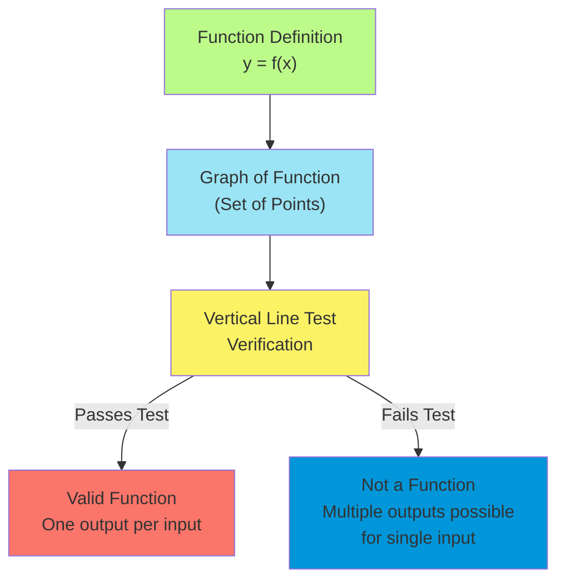
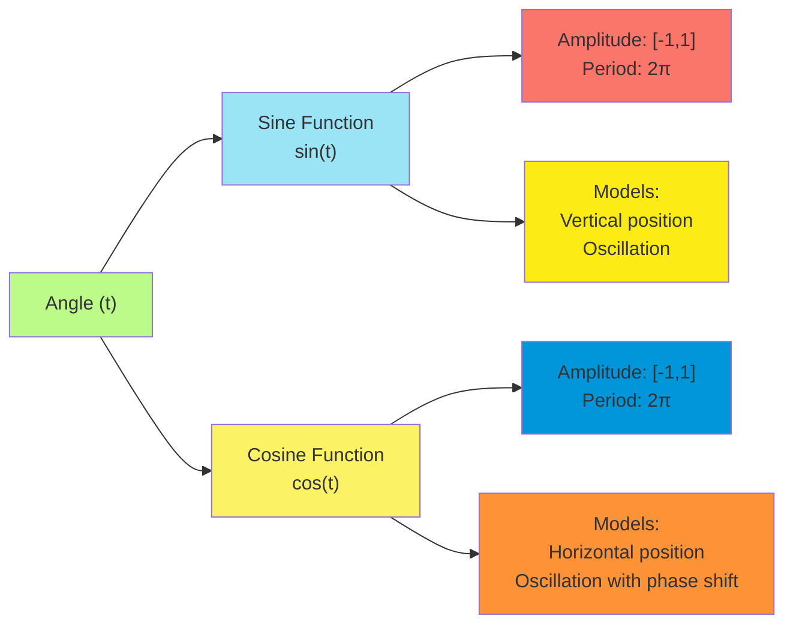
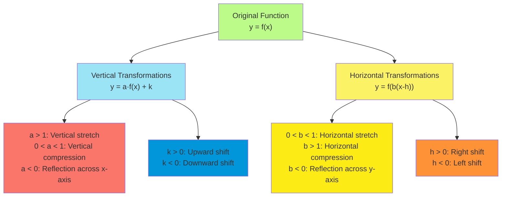
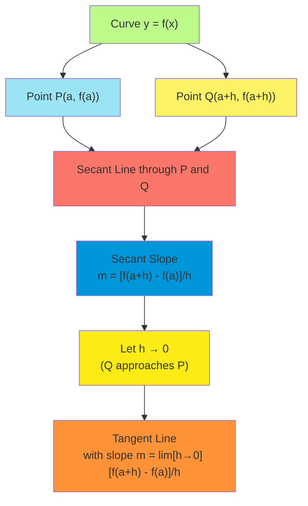
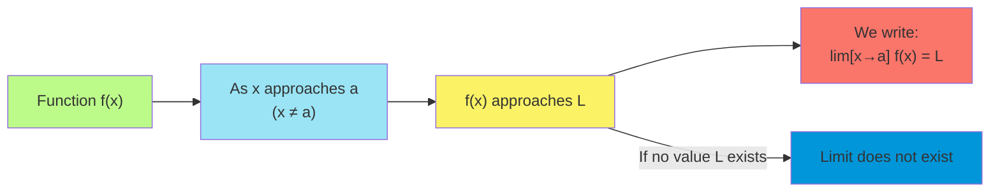
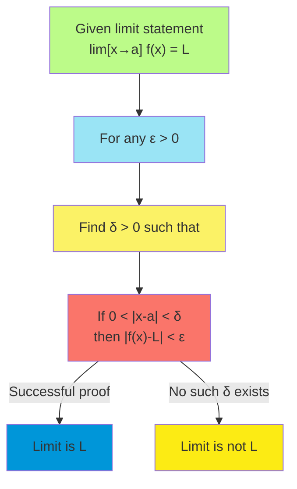
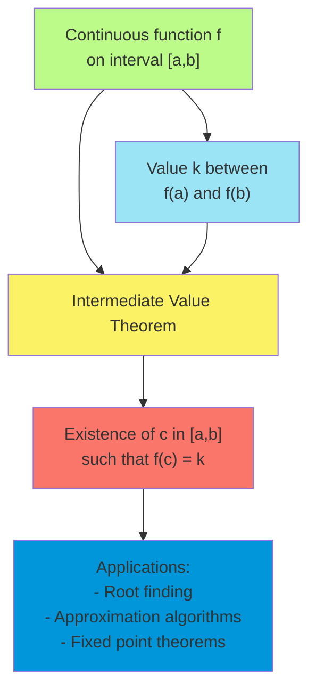

# C-1: Functions and Limits

1. Four Ways to Represent a Function

    - Verbal Descriptions and Function Terminology
    - Graphs and Visual Representations
    - Tables of Values and Discrete Data
    - Algebraic Formulas and Equations

2. Mathematical Models: A Catalog of Essential Functions

    - Linear Functions and Applications
    - Polynomial and Rational Functions
    - Trigonometric Functions and Periodicity
    - Exponential and Logarithmic Models

3. New Functions from Old Functions

    - Transformations of Functions (Shifts and Stretches)
    - Composition of Functions and Complex Operations
    - Inverse Functions and Reflection Properties
    - Piecewise-Defined Functions

4. The Tangent and Velocity Problems

    - Geometric Interpretation of Tangent Lines
    - Average vs. Instantaneous Rates of Change
    - The Slope Problem and Approximation Methods
    - Introduction to the Derivative Concept

5. The Limit of a Function

    - Intuitive Understanding of Limits
    - One-Sided Limits and Continuity Connection
    - Infinite Limits and Vertical Asymptotes
    - Formal Notation and Basic Properties

6. Calculating Limits Using the Limit Laws

    - Basic Limit Rules and Algebraic Properties
    - The Squeeze Theorem and Bounding Techniques
    - Trigonometric Limits and Special Values
    - Resolving Indeterminate Forms

7. The Precise Definition of a Limit

    - Epsilon-Delta Definition and Formal Proof Structure
    - Verifying Limits with Precise Arguments
    - Sequential Approach to Limits
    - Applications in Mathematical Analysis

8. Continuity
    - Definition and Properties of Continuous Functions
    - Types of Discontinuities and Their Classification
    - The Intermediate Value Theorem
    - Continuity on Intervals and Extreme Value Theorem

#### Four Ways to Represent a Function

The concept of a function serves as the cornerstone of calculus. At its essence, a function describes a relationship
between two sets, where each element in the first set (the domain) corresponds to exactly one element in the second set
(the range).

##### Verbal Descriptions and Function Terminology

A function can be described verbally through precise language that articulates the relationship between variables. The
mathematical definition states that a function $f$ from a set $A$ to a set $B$ assigns to each element $x \in A$
precisely one element $y \in B$, denoted as $y = f(x)$.

Crucial terminology includes:

- **Domain**: The set of all permissible input values ($x$)
- **Codomain**: The set $B$ where all outputs must belong
- **Range**: The set of all actual output values produced by the function
- **Independent variable**: The input variable ($x$)
- **Dependent variable**: The output variable ($y$ or $f(x)$)

When we say "$f$ is a function from $A$ to $B$," we write mathematically: $f: A \rightarrow B$

##### Graphs and Visual Representations

The graph of a function $f$ consists of all points $(x, f(x))$ in the Cartesian plane where $x$ is in the domain of $f$.
This visual representation provides geometric intuition about the function's behavior.

A critical property of functions manifests graphically through the **vertical line test**: if any vertical line
intersects a graph at more than one point, the graph does not represent a function.

##### Tables of Values and Discrete Data

Functions can be represented through tabular data, particularly useful for empirical relationships or discrete
phenomena. A table consists of input-output pairs $(x, f(x))$ that define the function at specific points.

Example: Consider the relationship between Celsius and Fahrenheit temperatures.

| Celsius ($°C$) | Fahrenheit ($°F$) |
| -------------- | ----------------- |
| -40            | -40               |
| 0              | 32                |
| 20             | 68                |
| 37             | 98.6              |
| 100            | 212               |

This discrete representation can be extended to a continuous function using the formula $F = \frac{9}{5}C + 32$.

##### Algebraic Formulas and Equations

The most precise representation often comes through algebraic formulas that define the exact relationship between
variables. These expressions allow us to determine function values for any input within the domain.

Examples:

- Linear function: $f(x) = mx + b$
- Quadratic function: $f(x) = ax^2 + bx + c$
- Rational function: $f(x) = \frac{P(x)}{Q(x)}$ where $P$ and $Q$ are polynomials
- Exponential function: $f(x) = a \cdot b^x$

The formula representation facilitates analytical operations such as differentiation and integration, which form the
heart of calculus.

#### Mathematical Models: A Catalog of Essential Functions

Mathematical models translate real-world phenomena into the language of mathematics, allowing for analysis and
prediction. Several fundamental function classes serve as building blocks for constructing these models.

##### Linear Functions and Applications

Linear functions follow the form $f(x) = mx + b$, where $m$ represents the slope (rate of change) and $b$ the
y-intercept.

Key properties:

- Constant rate of change
- Graph is a straight line
- Difference quotient $\frac{f(x_2) - f(x_1)}{x_2 - x_1} = m$ for any two distinct points

Linear functions model numerous phenomena:

- Distance-time relationships with constant velocity
- Simple interest calculations
- First-order approximations of complex systems
- Cost functions with fixed and variable components

The formula for the line passing through points $(x_1, y_1)$ and $(x_2, y_2)$ is:

$f(x) = y_1 + \frac{y_2 - y_1}{x_2 - x_1}(x - x_1)$

##### Polynomial and Rational Functions

Polynomial functions take the form $P(x) = a_n x^n + a_{n-1} x^{n-1} + \ldots + a_1 x + a_0$, where $n$ is a
non-negative integer.

Important classes include:

- Constant functions: $P(x) = a_0$
- Linear functions: $P(x) = a_1 x + a_0$
- Quadratic functions: $P(x) = a_2 x^2 + a_1 x + a_0$
- Cubic functions: $P(x) = a_3 x^3 + a_2 x^2 + a_1 x + a_0$

Rational functions are quotients of polynomials: $R(x) = \frac{P(x)}{Q(x)}$, where $P$ and $Q$ are polynomials and
$Q(x) \neq 0$

These functions exhibit complex behaviors including:

- Asymptotic behavior near zeros of the denominator
- Holes in the graph where common factors cancel
- End behavior determined by the highest-degree terms

Applications include modeling physical systems, population dynamics, and economic relationships.

##### Trigonometric Functions and Periodicity

Trigonometric functions describe circular and oscillatory phenomena. The six primary trigonometric functions are:

- Sine: $\sin(x)$
- Cosine: $\cos(x)$
- Tangent: $\tan(x) = \frac{\sin(x)}{\cos(x)}$
- Cotangent: $\cot(x) = \frac{\cos(x)}{\sin(x)}$
- Secant: $\sec(x) = \frac{1}{\cos(x)}$
- Cosecant: $\csc(x) = \frac{1}{\sin(x)}$

Key properties:

- Periodicity: $\sin(x + 2\pi) = \sin(x)$, $\cos(x + 2\pi) = \cos(x)$
- Domain and range restrictions
- Amplitude, frequency, and phase relationships

These functions model:

- Wave phenomena (sound, light, electromagnetic)
- Oscillatory motion (pendulums, springs)
- Circular motion and rotational dynamics
- Seasonal variations and cycles

##### Exponential and Logarithmic Models

Exponential functions take the form $f(x) = a \cdot b^x$ where $a$ and $b$ are constants with $b > 0$, $b \neq 1$.

Key properties:

- If $b > 1$: continuous growth (increasing)
- If $0 < b < 1$: continuous decay (decreasing)
- The natural exponential function $e^x$ has the special property that $\frac{d}{dx}(e^x) = e^x$

Logarithmic functions are inverses of exponential functions: $y = \log_b(x)$ is equivalent to $b^y = x$

The natural logarithm, $\ln(x) = \log_e(x)$, is particularly important in calculus.

Applications include:

- Compound interest and financial modeling
- Population growth and decay
- Radioactive decay and half-life calculations
- Chemical reaction rates
- Information theory and entropy

These functions model phenomena where the rate of change is proportional to the current value.

#### New Functions from Old Functions

Mathematicians and scientists build complex functions by transforming and combining simpler ones. Understanding these
operations is essential for modeling sophisticated phenomena.

##### Transformations of Functions (Shifts and Stretches)

Basic transformations allow us to modify the graph of a function $f(x)$ while preserving its fundamental shape:

1. **Vertical Shifts**: $y = f(x) + c$
    - If $c > 0$: Shift upward by $c$ units
    - If $c < 0$: Shift downward by $|c|$ units
2. **Horizontal Shifts**: $y = f(x - h)$
    - If $h > 0$: Shift right by $h$ units
    - If $h < 0$: Shift left by $|h|$ units
3. **Vertical Stretches/Compressions**: $y = a \cdot f(x)$
    - If $|a| > 1$: Vertical stretch by factor of $|a|$
    - If $0 < |a| < 1$: Vertical compression by factor of $|a|$
    - If $a < 0$: Reflection across x-axis combined with scaling
4. **Horizontal Stretches/Compressions**: $y = f(bx)$
    - If $0 < |b| < 1$: Horizontal stretch by factor of $\frac{1}{|b|}$
    - If $|b| > 1$: Horizontal compression by factor of $\frac{1}{|b|}$
    - If $b < 0$: Reflection across y-axis combined with scaling

The general form combining these transformations is: $y = a \cdot f(b(x - h)) + k$

##### Composition of Functions and Complex Operations

Function composition creates new functions by applying one function to the output of another.

If $f$ and $g$ are functions, their composition $(f \circ g)(x)$ or $f(g(x))$ applies $g$ first, then $f$ to the result:
$(f \circ g)(x) = f(g(x))$

Key properties:

- Domain of $f \circ g$ is ${x \in \text{domain}(g) : g(x) \in \text{domain}(f)}$
- Composition is not commutative: generally, $f \circ g \neq g \circ f$
- Composition is associative: $(f \circ g) \circ h = f \circ (g \circ h)$

Common operations include:

- Sum: $(f + g)(x) = f(x) + g(x)$
- Difference: $(f - g)(x) = f(x) - g(x)$
- Product: $(f \cdot g)(x) = f(x) \cdot g(x)$
- Quotient: $\left(\frac{f}{g}\right)(x) = \frac{f(x)}{g(x)}$ where $g(x) \neq 0$

These operations create sophisticated models from simpler components.

##### Inverse Functions and Reflection Properties

An inverse function $f^{-1}$ undoes the effect of a function $f$. If $f$ maps $a$ to $b$, then $f^{-1}$ maps $b$ back to
$a$.

Formally:

- $f^{-1}(f(x)) = x$ for all $x$ in the domain of $f$
- $f(f^{-1}(y)) = y$ for all $y$ in the range of $f$

Requirements for a function to have an inverse:

- Must be one-to-one (injective): each output corresponds to exactly one input
- Graphically: passes the horizontal line test

The graph of $f^{-1}$ is the reflection of the graph of $f$ across the line $y = x$.

Finding inverse functions:

1. Replace $f(x)$ with $y$
2. Interchange $x$ and $y$
3. Solve for $y$ in terms of $x$
4. Replace $y$ with $f^{-1}(x)$

Important examples:

- $f(x) = x^3$ has inverse $f^{-1}(x) = \sqrt[3]{x}$
- $f(x) = e^x$ has inverse $f^{-1}(x) = \ln(x)$
- $f(x) = \sin(x)$ on $[-\frac{\pi}{2}, \frac{\pi}{2}]$ has inverse $f^{-1}(x) = \arcsin(x)$

##### Piecewise-Defined Functions

Piecewise functions employ different formulas over different parts of their domain, allowing for flexibility in modeling
diverse behaviors.

General form:
$$f(x) = \begin{cases} f_1(x) & \text{if } x \in D_1 \ f_2(x) & \text{if } x \in D_2 \ \vdots & \ f_n(x) & \text{if } x \in D_n \end{cases}$$

Where $D_1, D_2, \ldots, D_n$ are subsets of the domain that don't overlap.

Important examples include:

- **Absolute value**: $|x| = \begin{cases} x & \text{if } x \geq 0 \ -x & \text{if } x < 0 \end{cases}$
- **Step function**: $\lfloor x \rfloor = \text{greatest integer } n \text{ such that } n \leq x$
- **Heaviside function**: $H(x) = \begin{cases} 0 & \text{if } x < 0 \ 1 & \text{if } x \geq 0 \end{cases}$

Piecewise functions model:

- Physical systems with different regimes
- Tax brackets and progressive pricing
- Systems with thresholds or discontinuities

#### The Tangent and Velocity Problems

Two foundational problems in calculus—finding the tangent line to a curve and calculating instantaneous velocity—share
the same mathematical structure. Both involve the limit of a ratio as the denominator approaches zero.

##### Geometric Interpretation of Tangent Lines

The tangent line to a curve at a point $P$ is the line that "touches" the curve at $P$ without crossing it (in the
neighborhood of $P$).

Historically, the problem of finding this tangent challenged mathematicians until the development of calculus. The key
insight: the tangent line can be defined as the limiting position of secant lines.

If $P(a, f(a))$ is a point on the curve $y = f(x)$, and $Q(a+h, f(a+h))$ is another point on the curve, the secant line
through $P$ and $Q$ has slope:

$$m_{sec} = \frac{f(a+h) - f(a)}{(a+h) - a} = \frac{f(a+h) - f(a)}{h}$$

As $Q$ approaches $P$ (i.e., as $h \to 0$), the secant line approaches the tangent line, whose slope is:

$$m_{tan} = \lim_{h \to 0} \frac{f(a+h) - f(a)}{h}$$

This limit, when it exists, is the derivative of $f$ at $a$, denoted $f'(a)$.

##### Average vs. Instantaneous Rates of Change

The concept of rate of change is fundamental in calculus. When examining how one quantity changes with respect to
another:

- **Average rate of change** over an interval $[a, b]$: $$\text{Average rate} = \frac{f(b) - f(a)}{b - a}$$
- **Instantaneous rate of change** at a point $a$:
  $$\text{Instantaneous rate} = \lim_{h \to 0} \frac{f(a+h) - f(a)}{h}$$

In the context of motion, where $s(t)$ represents position at time $t$:

- Average velocity over time interval $[t, t+h]$: $$v_{avg} = \frac{s(t+h) - s(t)}{h}$$
- Instantaneous velocity at time $t$: $$v(t) = \lim_{h \to 0} \frac{s(t+h) - s(t)}{h} = s'(t)$$

This parallel between tangent lines and instantaneous velocity illustrates the unifying power of calculus.

##### The Slope Problem and Approximation Methods

Before the formal development of calculus, mathematicians employed various approximation methods to estimate tangent
slopes:

1. **Numerical approximation**: Calculate secant slopes with progressively smaller values of $h$

    Example: For $f(x) = x^2$ at $x = 3$:

    | $h$   | $(f(3+h) - f(3))/h$            | Approximation of $f'(3)$ |
    | ----- | ------------------------------ | ------------------------ |
    | 1     | $(16 - 9)/1 = 7$               | 7 (rough)                |
    | 0.1   | $(9.61 - 9)/0.1 = 6.1$         | 6.1 (better)             |
    | 0.01  | $(9.0601 - 9)/0.01 = 6.01$     | 6.01 (more accurate)     |
    | 0.001 | $(9.006001 - 9)/0.001 = 6.001$ | 6.001 (even better)      |

    The actual derivative is $f'(x) = 2x$, so $f'(3) = 6$.

2. **Symmetric difference quotient**: Use points on both sides of $a$: $$f'(a) \approx \frac{f(a+h) - f(a-h)}{2h}$$

    This often provides better approximations for the same step size.

3. **Richardson extrapolation**: Combine multiple approximations to eliminate error terms

These methods remain valuable for numerical computation and for building intuition about the derivative concept.

##### Introduction to the Derivative Concept

The derivative of a function $f$ at a point $x = a$ is defined as:

$$f'(a) = \lim_{h \to 0} \frac{f(a+h) - f(a)}{h}$$

Equivalently, using the limit notation with $x$ approaching $a$:

$$f'(a) = \lim_{x \to a} \frac{f(x) - f(a)}{x - a}$$

The derivative function $f'(x)$ gives the instantaneous rate of change of $f$ at any point in its domain where the limit
exists.

Key interpretations of the derivative include:

- Geometric: slope of the tangent line to the graph of $f$ at $(a, f(a))$
- Physical: instantaneous rate of change of $f$ with respect to $x$
- Approximation: linear approximation of change in function value

Alternative notations for the derivative include:

- Leibniz notation: $\frac{dy}{dx}$ or $\frac{d}{dx}[f(x)]$
- Newton's notation: $\dot{y}$ or $\dot{f}$
- Euler's notation: $D_x[f]$ or $Df$

The derivative concept forms the foundation for differential calculus and leads to powerful techniques for optimization,
approximation, and modeling dynamic systems.

#### The Limit of a Function

The concept of a limit formalizes the notion of "approaching" a value. It provides the mathematical foundation for
calculus by defining derivatives and integrals.

##### Intuitive Understanding of Limits

Intuitively, the statement $\lim_{x \to a} f(x) = L$ means that $f(x)$ can be made arbitrarily close to $L$ by choosing
$x$ sufficiently close (but not equal) to $a$.

Key aspects of this intuition:

- The limit describes the behavior of $f(x)$ as $x$ approaches $a$, not necessarily the value at $a$
- The function need not be defined at $x = a$ for the limit to exist
- Both left and right approaches to $a$ must yield the same limiting value

Examples:

1. $\lim_{x \to 2} (3x + 1) = 7$ because as $x$ gets closer to 2, $3x + 1$ gets closer to 7
2. $\lim_{x \to 0} \frac{\sin(x)}{x} = 1$ even though the function is undefined at $x = 0$

##### One-Sided Limits and Continuity Connection

One-sided limits examine the behavior of a function as $x$ approaches $a$ from only one direction:

- Left-hand limit: $\lim_{x \to a^-} f(x) = L$ means $f(x)$ approaches $L$ as $x$ approaches $a$ from values less than
  $a$
- Right-hand limit: $\lim_{x \to a^+} f(x) = L$ means $f(x)$ approaches $L$ as $x$ approaches $a$ from values greater
  than $a$

The two-sided limit exists if and only if both one-sided limits exist and are equal: $\lim_{x \to a} f(x) = L$ if and
only if $\lim_{x \to a^-} f(x) = \lim_{x \to a^+} f(x) = L$

Connection to continuity: A function $f$ is continuous at $a$ if and only if:

1. $f(a)$ is defined
2. $\lim_{x \to a} f(x)$ exists
3. $\lim_{x \to a} f(x) = f(a)$

In other words, there is no "gap" or "jump" in the graph at $x = a$.

##### Infinite Limits and Vertical Asymptotes

When function values grow without bound as $x$ approaches $a$, we have an infinite limit:

- If $f(x)$ grows arbitrarily large positive: $\lim_{x \to a} f(x) = \infty$
- If $f(x)$ grows arbitrarily large negative: $\lim_{x \to a} f(x) = -\infty$

These situations often occur near vertical asymptotes, where the function values approach infinity as $x$ approaches
some value $a$. Typical cases include:

- Rational functions where the denominator approaches zero but the numerator doesn't Example:
  $\lim_{x \to 0} \frac{1}{x^2} = \infty$
- Logarithmic functions near zero Example: $\lim_{x \to 0^+} \ln(x) = -\infty$

Vertical asymptotes provide important information about function behavior and are essential for graphing rational
functions.

##### Formal Notation and Basic Properties

The rigorous definition of a limit involves the epsilon-delta definition (covered later), but we can work with limits
using established properties:

1. **Linearity**:
    - $\lim_{x \to a} [c \cdot f(x)] = c \cdot \lim_{x \to a} f(x)$ where $c$ is a constant
    - $\lim_{x \to a} [f(x) \pm g(x)] = \lim_{x \to a} f(x) \pm \lim_{x \to a} g(x)$
2. **Product and Quotient**:
    - $\lim_{x \to a} [f(x) \cdot g(x)] = \lim_{x \to a} f(x) \cdot \lim_{x \to a} g(x)$
    - $\lim_{x \to a} \frac{f(x)}{g(x)} = \frac{\lim_{x \to a} f(x)}{\lim_{x \to a} g(x)}$ provided
      $\lim_{x \to a} g(x) \neq 0$
3. **Composition**:
    - If $\lim_{x \to a} g(x) = L$ and $f$ is continuous at $L$, then $\lim_{x \to a} f(g(x)) = f(L)$
4. **Substitution**:
    - If $f$ is continuous at $a$, then $\lim_{x \to a} f(x) = f(a)$

These properties allow us to evaluate many limits without resorting to the formal definition.

#### Calculating Limits Using the Limit Laws

Armed with limit properties, we can develop systematic approaches to evaluate complex limits.

##### Basic Limit Rules and Algebraic Properties

The following limit laws form the foundation for limit calculations:

1. **Constant Rule**: $\lim_{x \to a} c = c$ for any constant $c$
2. **Identity Rule**: $\lim_{x \to a} x = a$
3. **Sum/Difference Rule**: $\lim_{x \to a} [f(x) \pm g(x)] = \lim_{x \to a} f(x) \pm \lim_{x \to a} g(x)$
4. **Constant Multiple Rule**: $\lim_{x \to a} [c \cdot f(x)] = c \cdot \lim_{x \to a} f(x)$
5. **Product Rule**: $\lim_{x \to a} [f(x) \cdot g(x)] = \lim_{x \to a} f(x) \cdot \lim_{x \to a} g(x)$
6. **Quotient Rule**: $\lim_{x \to a} \frac{f(x)}{g(x)} = \frac{\lim_{x \to a} f(x)}{\lim_{x \to a} g(x)}$ provided
   $\lim_{x \to a} g(x) \neq 0$
7. **Power Rule**: $\lim_{x \to a} [f(x)]^n = [\lim_{x \to a} f(x)]^n$ for positive integer $n$
8. **Root Rule**: $\lim_{x \to a} \sqrt[n]{f(x)} = \sqrt[n]{\lim_{x \to a} f(x)}$ for even $n$ when
   $\lim_{x \to a} f(x) > 0$, and for odd $n$ always

These rules allow us to decompose complicated limits into simpler components.

##### The Squeeze Theorem and Bounding Techniques

The Squeeze Theorem (also called the Sandwich or Pinching Theorem) provides a powerful method for finding limits of
challenging functions.

**Theorem**: If $g(x) \leq f(x) \leq h(x)$ for all $x$ in some open interval containing $a$ (except possibly at $a$
itself), and $\lim_{x \to a} g(x) = \lim_{x \to a} h(x) = L$, then $\lim_{x \to a} f(x) = L$.

Example: Proving $\lim_{x \to 0} x^2 \sin\left(\frac{1}{x}\right) = 0$

Since $-1 \leq \sin\left(\frac{1}{x}\right) \leq 1$ for all $x \neq 0$, we have:
$-x^2 \leq x^2 \sin\left(\frac{1}{x}\right) \leq x^2$

As $x \to 0$, both $-x^2 \to 0$ and $x^2 \to 0$, so by the Squeeze Theorem:
$\lim_{x \to 0} x^2 \sin\left(\frac{1}{x}\right) = 0$

This technique is particularly useful for functions with oscillatory behavior.

##### Trigonometric Limits and Special Values

Several important limits involving trigonometric functions serve as building blocks for more complex calculations:

1. $\lim_{x \to 0} \frac{\sin(x)}{x} = 1$

    This fundamental limit can be justified geometrically and is crucial for derivatives of trigonometric functions.

2. $\lim_{x \to 0} \frac{1 - \cos(x)}{x} = 0$ or equivalently, $\lim_{x \to 0} \frac{1 - \cos(x)}{x^2} = \frac{1}{2}$

3. $\lim_{x \to 0} \frac{\tan(x)}{x} = 1$

4. Related limits:

    - $\lim_{x \to 0} \frac{\sin(ax)}{x} = a$
    - $\lim_{x \to 0} \frac{\sin(x)}{x^n} = \begin{cases} 0, & \text{if } n < 1 \ 1, & \text{if } n = 1 \ \infty, & \text{if } n > 1 \end{cases}$

These special values allow us to evaluate limits involving trigonometric functions efficiently.

##### Resolving Indeterminate Forms

An indeterminate form occurs when direct substitution leads to expressions like $\frac{0}{0}$, $\frac{\infty}{\infty}$,
$0 \cdot \infty$, $\infty - \infty$, $0^0$, $1^\infty$, or $\infty^0$, which don't have a clear value.

Strategies for resolving these forms include:

1. **Algebraic manipulation**: Factoring, rationalizing, or simplifying to eliminate the indeterminacy

    Example: $\lim_{x \to 3} \frac{x^2 - 9}{x - 3}$

    Direct substitution yields $\frac{0}{0}$, but factoring:
    $\lim_{x \to 3} \frac{(x-3)(x+3)}{x-3} = \lim_{x \to 3} (x+3) = 6$

2. **L'Hôpital's Rule** (for $\frac{0}{0}$ or $\frac{\infty}{\infty}$): If $\lim_{x \to a} \frac{f(x)}{g(x)}$ gives an
   indeterminate form, then: $\lim_{x \to a} \frac{f(x)}{g(x)} = \lim_{x \to a} \frac{f'(x)}{g'(x)}$

    provided the latter limit exists or is infinite.

3. **Converting to a standard form**: Rewriting expressions using logarithms, exponentials, or other transformations

    Example: For $1^\infty$ form like $\lim_{x \to \infty} \left(1 + \frac{1}{x}\right)^x$, use:
    $\lim_{x \to \infty} \left(1 + \frac{1}{x}\right)^x = e$

Mastering these techniques is essential for evaluating complex limits in calculus.

#### The Precise Definition of a Limit

The intuitive notion of limits gains mathematical rigor through the epsilon-delta definition, which provides a
foundation for the entire edifice of calculus.

##### Epsilon-Delta Definition and Formal Proof Structure

The formal definition of a limit states:

$\lim_{x \to a} f(x) = L$ if and only if for every $\varepsilon > 0$, there exists a $\delta > 0$ such that if
$0 < |x - a| < \delta$, then $|f(x) - L| < \varepsilon$.

This definition expresses that:

- For any margin of error $\varepsilon$ we choose
- We can find a distance $\delta$ from $a$
- Such that whenever $x$ is within distance $\delta$ of $a$ (but not equal to $a$)
- The value $f(x)$ is within $\varepsilon$ of $L$

The structure of a formal limit proof follows this pattern:

1. Start with an arbitrary $\varepsilon > 0$
2. Find a suitable $\delta > 0$ (this is usually the challenging part)
3. Show that if $0 < |x - a| < \delta$, then $|f(x) - L| < \varepsilon$

##### Verifying Limits with Precise Arguments

Example: Prove that $\lim_{x \to 2} (3x - 1) = 5$ using the epsilon-delta definition.

Proof:

1. Let $\varepsilon > 0$ be arbitrary.
2. We need to find $\delta > 0$ such that if $0 < |x - 2| < \delta$, then $|(3x - 1) - 5| < \varepsilon$.
3. Simplifying: $|(3x - 1) - 5| = |3x - 6| = 3|x - 2|$
4. To ensure $3|x - 2| < \varepsilon$, we need $|x - 2| < \frac{\varepsilon}{3}$
5. Therefore, choosing $\delta = \frac{\varepsilon}{3}$ works.
6. Conclusion: For any $\varepsilon > 0$, if we choose $\delta = \frac{\varepsilon}{3}$, then whenever
   $0 < |x - 2| < \delta$, we have $|(3x - 1) - 5| < \varepsilon$.

This type of argument provides the logical foundation upon which calculus is built.

##### Sequential Approach to Limits

An equivalent definition of limits uses sequences:

$\lim_{x \to a} f(x) = L$ if and only if for every sequence ${x_n}$ with $x_n \neq a$ and $\lim_{n \to \infty} x_n = a$,
we have $\lim_{n \to \infty} f(x_n) = L$.

This approach is often more intuitive:

- If $f(x)$ approaches $L$ as $x$ approaches $a$
- Then for any way of approaching $a$ (i.e., any sequence converging to $a$)
- The corresponding function values must approach $L$

The sequential approach is particularly useful for proving that certain limits do not exist by finding two different
sequences approaching $a$ but yielding different limiting values for $f$.

Example: Showing $\lim_{x \to 0} \sin\left(\frac{1}{x}\right)$ does not exist:

- Consider sequence $x_n = \frac{1}{2n\pi}$, which gives $f(x_n) = \sin(2n\pi) = 0$
- Consider sequence $y_n = \frac{1}{(2n+\frac{1}{2})\pi}$, which gives $f(y_n) = \sin((2n+\frac{1}{2})\pi) = 1$

Since these sequences yield different limits for $f$, the limit does not exist.

##### Applications in Mathematical Analysis

The precise definition of limits extends to various concepts in mathematical analysis:

1. **Continuity**: A function $f$ is continuous at $a$ if $\lim_{x \to a} f(x) = f(a)$. Using the $\varepsilon$-$\delta$
   definition, for every $\varepsilon > 0$, there exists $\delta > 0$ such that if $|x - a| < \delta$, then
   $|f(x) - f(a)| < \varepsilon$.
2. **Uniform Continuity**: A function $f$ is uniformly continuous on a domain $D$ if for every $\varepsilon > 0$, there
   exists $\delta > 0$ such that for all $x, y \in D$ with $|x - y| < \delta$, we have $|f(x) - f(y)| < \varepsilon$.
3. **Differentiability**: A function $f$ is differentiable at $a$ if $\lim_{h \to 0} \frac{f(a+h) - f(a)}{h}$ exists.
4. **Uniform Convergence of Functions**: A sequence of functions ${f_n}$ converges uniformly to $f$ on domain $D$ if for
   every $\varepsilon > 0$, there exists $N$ such that for all $n \geq N$ and all $x \in D$,
   $|f_n(x) - f(x)| < \varepsilon$.

The rigor provided by the $\varepsilon$-$\delta$ definition allows mathematicians to establish properties of functions
with certainty and develop advanced mathematical theories.

#### Continuity

Continuity represents the property of functions that can be drawn "without lifting the pencil"—functions without gaps,
jumps, or holes. This concept is fundamental for calculus and analysis.

##### Definition and Properties of Continuous Functions

A function $f$ is continuous at a point $a$ if:

1. $f(a)$ is defined
2. $\lim_{x \to a} f(x)$ exists
3. $\lim_{x \to a} f(x) = f(a)$

Equivalently, using the $\varepsilon$-$\delta$ definition: for every $\varepsilon > 0$, there exists $\delta > 0$ such
that if $|x - a| < \delta$, then $|f(x) - f(a)| < \varepsilon$.

A function is continuous on an interval if it is continuous at every point in that interval.

Key properties of continuous functions:

1. **Algebraic Combinations**: If $f$ and $g$ are continuous at $a$, then so are:
    - $f + g$, $f - g$, and $c \cdot f$ for any constant $c$
    - $f \cdot g$
    - $f/g$ provided $g(a) \neq 0$
2. **Composition**: If $g$ is continuous at $a$ and $f$ is continuous at $g(a)$, then $f \circ g$ is continuous at $a$
3. **Standard Continuous Functions**:
    - Polynomials are continuous everywhere
    - Rational functions are continuous wherever the denominator is non-zero
    - Trigonometric functions $\sin(x)$ and $\cos(x)$ are continuous everywhere
    - Exponential and logarithmic functions are continuous on their domains

##### Types of Discontinuities and Their Classification

Discontinuities occur where a function fails to be continuous. They are classified into several types:

1. **Removable Discontinuity**: Occurs when $\lim_{x \to a} f(x)$ exists but either $f(a)$ is undefined or
   $f(a) \neq \lim_{x \to a} f(x)$

    Example: $f(x) = \frac{x^2 - 4}{x - 2}$ for $x \neq 2$, which simplifies to $f(x) = x + 2$ for $x \neq 2$

    The limit as $x \to 2$ is 4, but $f(2)$ is undefined. The discontinuity can be "removed" by defining $f(2) = 4$.

2. **Jump Discontinuity**: Occurs when both one-sided limits exist but differ

    Example: $f(x) = \begin{cases} x, & \text{if } x < 0 \ x+1, & \text{if } x \geq 0 \end{cases}$

    Here, $\lim_{x \to 0^-} f(x) = 0$ but $\lim_{x \to 0^+} f(x) = 1$.

3. **Infinite Discontinuity**: Occurs when at least one one-sided limit is infinite

    Example: $f(x) = \frac{1}{x}$ at $x = 0$

    Both $\lim_{x \to 0^-} f(x) = -\infty$ and $\lim_{x \to 0^+} f(x) = \infty$.

4. **Oscillatory Discontinuity**: Occurs when the function oscillates infinitely near the point

    Example: $f(x) = \sin\left(\frac{1}{x}\right)$ at $x = 0$

    The limit does not exist due to the function oscillating between -1 and 1 with increasing frequency as $x \to 0$.

Understanding these classifications helps analyze function behavior near problematic points.

##### The Intermediate Value Theorem

The Intermediate Value Theorem (IVT) is one of the most important results about continuous functions:

**Theorem**: If $f$ is continuous on a closed interval $[a, b]$ and $k$ is any value between $f(a)$ and $f(b)$, then
there exists at least one point $c \in [a, b]$ such that $f(c) = k$.

Intuitively, this means that a continuous function takes all intermediate values between any two of its function values.

Applications include:

- **Existence of roots**: If $f$ is continuous with $f(a) < 0$ and $f(b) > 0$, then $f(c) = 0$ for some $c \in (a, b)$
- **Approximation algorithms**: Bisection method for finding function roots
- **Fixed point theorems**: Guaranteeing the existence of solutions to certain equations

The IVT represents the formalization of the intuitive property that continuous functions cannot "jump over" values.

##### Continuity on Intervals and Extreme Value Theorem

Continuity on intervals leads to several powerful theorems about function behavior:

1. **Extreme Value Theorem**: If $f$ is continuous on a closed, bounded interval $[a, b]$, then $f$ attains both a
   maximum and minimum value on $[a, b]$.

    In other words, there exist points $c, d \in [a, b]$ such that:

    - $f(c) \leq f(x) \leq f(d)$ for all $x \in [a, b]$

2. **Boundedness Theorem**: If $f$ is continuous on a closed, bounded interval $[a, b]$, then $f$ is bounded on
   $[a, b]$.

    This means there exist constants $m$ and $M$ such that:

    - $m \leq f(x) \leq M$ for all $x \in [a, b]$

3. **Uniform Continuity**: If $f$ is continuous on a closed, bounded interval $[a, b]$, then $f$ is uniformly continuous
   on $[a, b]$.

    This means for every $\varepsilon > 0$, there exists $\delta > 0$ such that:

    - For all $x, y \in [a, b]$ with $|x - y| < \delta$, we have $|f(x) - f(y)| < \varepsilon$

These properties fail to hold for functions that are not continuous or when the domain is not a closed, bounded
interval. They form the foundation for optimization in calculus and for understanding function behavior in analysis.
