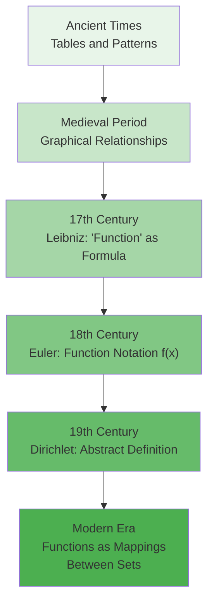
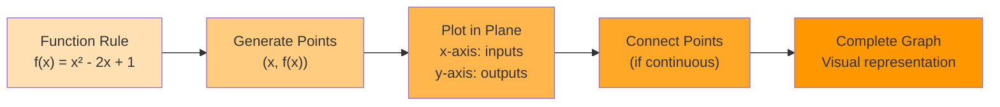
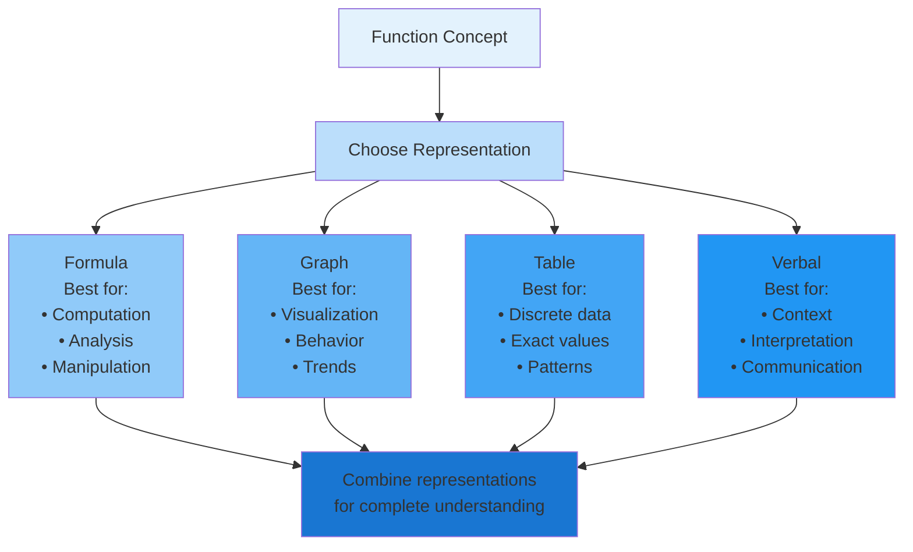
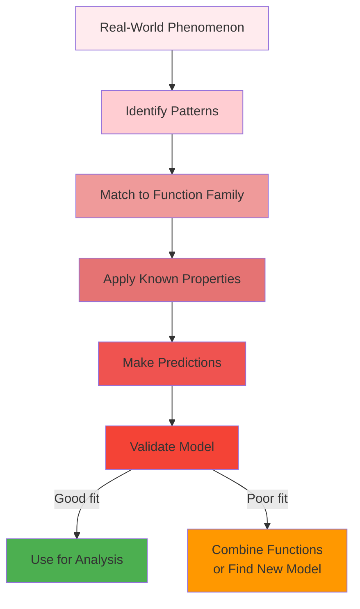
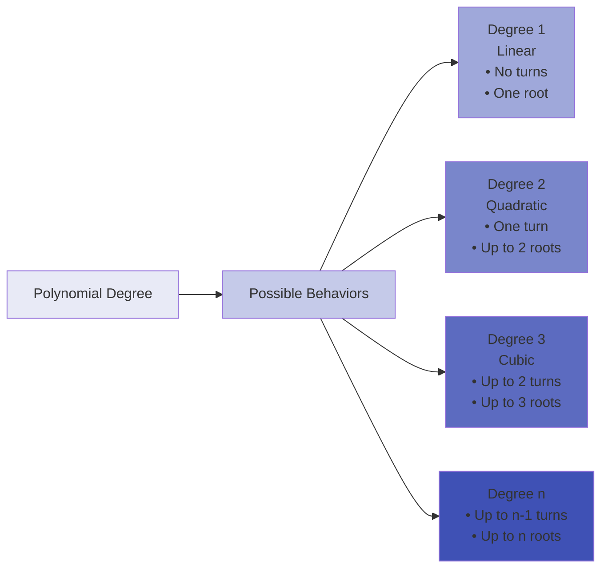
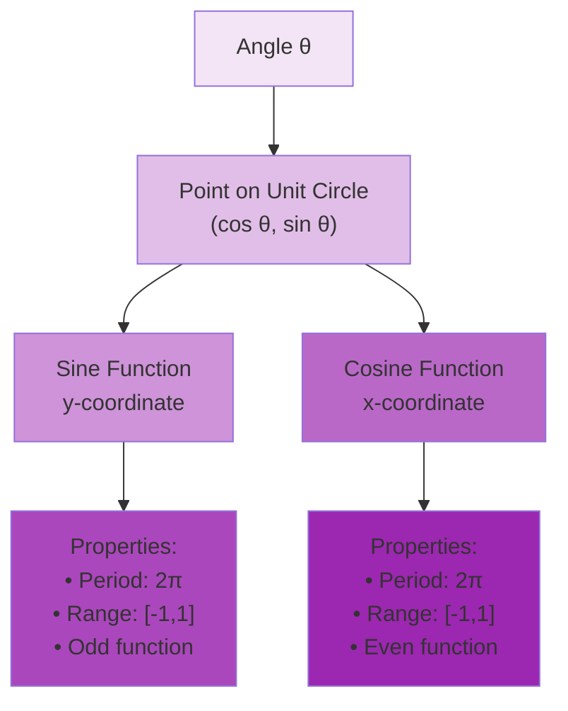
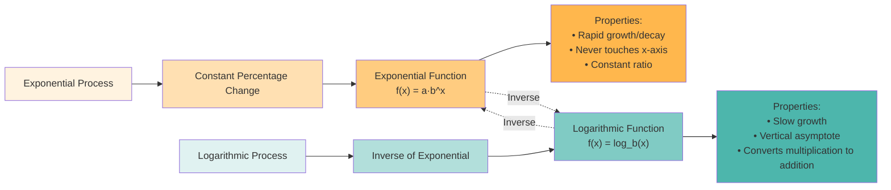
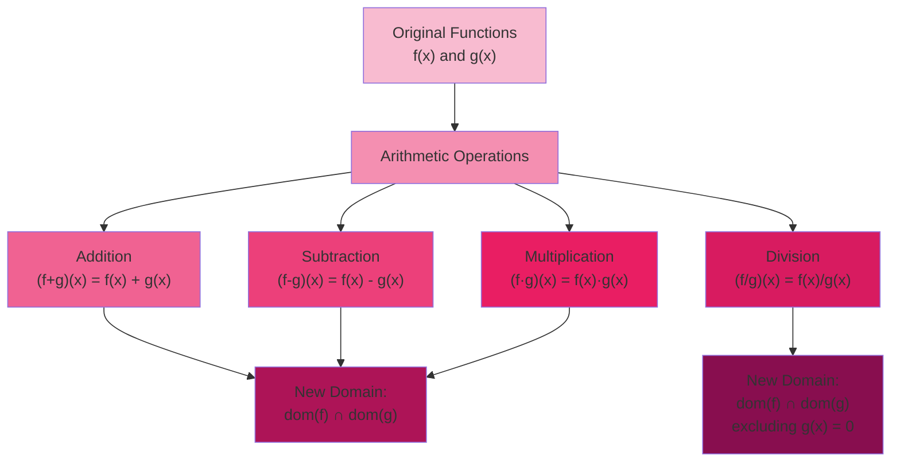
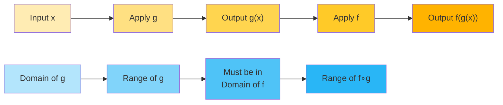
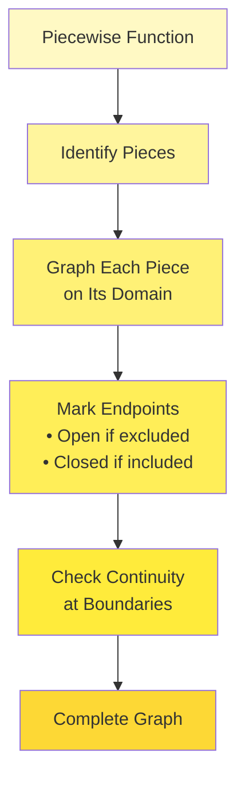

# C-1_1: Functions and Limits

1. Four Ways to Represent a Function

    - The Concept of Function: From Ancient to Modern Understanding
    - Verbal Descriptions and Function Terminology
    - Graphs and Visual Representations: Reading the Story
    - Tables of Values: Discrete Windows into Continuous Behavior
    - Algebraic Formulas: The Language of Patterns
    - Converting Between Representations: The Power of Multiple Perspectives

2. Mathematical Models: A Catalog of Essential Functions

    - Why We Need a Function Library: Building Blocks of Reality
    - Linear Functions: The Simplest Rate of Change
    - Polynomial Functions: From Parabolas to Higher Dimensions
    - Rational Functions: Division Creates Complexity
    - Trigonometric Functions: Circular Motion and Waves
    - Exponential and Logarithmic Functions: Growth and Decay
    - Choosing and Combining Models: The Art of Mathematical Modeling

3. New Functions from Old Functions

    - The Algebra of Functions: Creating Complexity from Simplicity
    - Transformations: Moving and Stretching Reality
    - Composition: Functions of Functions
    - Inverse Functions: Undoing and Reversing
    - Piecewise Functions: Different Rules for Different Regions
    - Recursive and Implicitly Defined Functions

#### The Concept of Function: From Ancient to Modern Understanding

The concept of a function represents one of the most profound abstractions in mathematics, evolving over millennia from
simple observations to a cornerstone of modern mathematical thought. To truly understand functions, we must appreciate
both their historical development and their modern formulation.

In ancient times, mathematicians recognized patterns and relationships. The Babylonians created tables relating the
positions of celestial bodies to time, effectively using functions without the formal concept. Greek mathematicians like
Apollonius studied conic sections, implicitly working with relationships we now express as functions. However, they
lacked a unified framework for these relationships.

The modern notion of a function emerged gradually. In the 14th century, Nicole Oresme graphed relationships between
variables, pioneering what we now call the Cartesian plane. The word "function" itself was introduced by Leibniz in
1673, though his concept differed from our current understanding. Initially, functions were thought of as expressions
involving variables—what we might call "formulas" today.

The revolutionary insight came in the 19th century with Dirichlet's definition: a function is any correspondence between
two sets that assigns to each element in the first set exactly one element in the second set. This abstraction freed
functions from formulas, allowing for arbitrary correspondences.

Today, we define a function $f$ from a set $A$ to a set $B$ (written $f: A \rightarrow B$) as a rule that assigns to
each element $x \in A$ exactly one element $y \in B$. This element $y$ is denoted $f(x)$, read as "$f$ of $x$" or "the
value of $f$ at $x$."

The power of this definition lies in its generality. A function can be:

- A formula like $f(x) = x^2 + 3x - 5$
- A procedure like "round to the nearest integer"
- A table of values with no apparent pattern
- A graph drawn freehand
- Even a random assignment, as long as each input has exactly one output

This abstraction enables us to study properties common to all functions, regardless of their specific nature. It's this
unifying perspective that makes the function concept so powerful in mathematics.

##### Verbal Descriptions and Function Terminology

When we describe functions verbally, we're translating mathematical relationships into natural language. This
translation requires precision, as ambiguity in language can lead to mathematical confusion. Let's explore how to
articulate functions clearly and understand the essential terminology.

A function can be described through various verbal formulations:

- "The function that squares its input and adds three"
- "The temperature at time $t$"
- "The cost of producing $n$ items"
- "The probability of exactly $k$ successes in $n$ trials"

Each description implicitly defines three crucial components:

**Domain**: The set of all possible inputs. When we say "the function that gives the square root," we must specify that
the domain consists of non-negative real numbers (for real-valued functions). The domain answers: "What can we put into
this function?"

**Codomain**: The set where all outputs must live. For the square root function with domain $[0, \infty)$, the codomain
might be specified as $\mathbb{R}$ (all real numbers) or more precisely as $[0, \infty)$.

**Rule of Correspondence**: The specific relationship between inputs and outputs. This is the "heart" of the
function—what it actually does.

Consider this verbal description: "The function $f$ assigns to each positive real number the time in hours it takes for
a bacterial population to double, given that the population grows at a rate of that number percent per hour."

Breaking this down:

- Domain: $(0, \infty)$ (positive real numbers representing growth rates)
- The rule involves exponential growth: if the growth rate is $r$% per hour, we need $(1 + r/100)^t = 2$
- Solving: $t = \frac{\ln(2)}{\ln(1 + r/100)}$
- So $f(r) = \frac{\ln(2)}{\ln(1 + r/100)}$

The **range** (or image) of a function—the set of all actual outputs—often differs from the codomain. For our bacterial
growth function, while the codomain might be all real numbers, the range is $(0, \infty)$ since doubling time is always
positive.

Critical distinctions in terminology:

- **Independent variable**: The input variable (often $x$), which we can choose freely within the domain
- **Dependent variable**: The output variable (often $y$ or $f(x)$), which depends on our choice of input
- **Argument**: The specific input value we're evaluating
- **Value**: The output $f(x)$ for a given input $x$

Understanding these terms prevents confusion. When we say "evaluate $f$ at 3," we mean "find $f(3)$"—substitute 3 for
the independent variable and calculate the result.

The notation $f: A \rightarrow B$ encodes remarkable information:

- $f$ is the function's name
- $A$ is the domain
- $B$ is the codomain
- The arrow $\rightarrow$ indicates the direction of mapping

This notation immediately tells us what types of inputs and outputs to expect, crucial for mathematical reasoning.

##### Graphs and Visual Representations: Reading the Story

The graph of a function transforms abstract relationships into visual stories. When we plot a function, we create a
bridge between algebra and geometry, allowing our visual intuition to guide mathematical understanding.

The graph of a function $f$ consists of all ordered pairs $(x, f(x))$ where $x$ belongs to the domain of $f$. In the
Cartesian plane, we plot these points with $x$-coordinates from the domain and $y$-coordinates given by the function
values. The resulting curve or set of points is the function's graph.

The **vertical line test** provides a visual criterion for identifying functions: if any vertical line intersects a
curve more than once, the curve cannot represent a function. Why? Because a vertical line $x = a$ represents all points
with the same $x$-coordinate. Multiple intersections would mean the same input $a$ produces multiple outputs, violating
the definition of a function.

Consider the circle $x^2 + y^2 = 1$. This fails the vertical line test—for instance, the line $x = 0$ intersects at both
$(0, 1)$ and $(0, -1)$. Thus, the circle doesn't represent $y$ as a function of $x$. However, we can split it into two
functions: $f(x) = \sqrt{1-x^2}$ (upper semicircle) and $g(x) = -\sqrt{1-x^2}$ (lower semicircle).

Graphs reveal function properties at a glance:

**Monotonicity**: Is the function increasing or decreasing? A function increases on an interval if its graph rises from
left to right. The function $f(x) = x^3$ increases everywhere, while $g(x) = -x^2$ decreases for $x > 0$.

**Extrema**: Local and global maxima and minima appear as peaks and valleys. The function $h(x) = x^3 - 3x$ has a local
maximum at $x = -1$ and a local minimum at $x = 1$.

**Symmetry**:

- Even functions satisfy $f(-x) = f(x)$, creating symmetry about the $y$-axis (like $f(x) = x^2$)
- Odd functions satisfy $f(-x) = -f(x)$, creating symmetry about the origin (like $f(x) = x^3$)

**Asymptotic behavior**: How does the function behave for extreme values? The rational function
$f(x) = \frac{x^2 + 1}{x}$ has a slant asymptote $y = x$ as $x \to \pm\infty$.

**Periodicity**: Functions like $\sin(x)$ repeat their values, creating wave-like patterns. The period is the smallest
positive value $p$ such that $f(x + p) = f(x)$ for all $x$.

Reading graphs requires practice. Consider the function whose graph starts at the origin, increases to a maximum at
$(1, 1)$, decreases to a minimum at $(3, -1)$, then increases without bound. This tells us:

- The function has both local extrema
- It changes from increasing to decreasing at $x = 1$
- It's neither even nor odd
- The range includes all values $\geq -1$

Graphs can also reveal subtle behaviors. The function $f(x) = x + \sin(x)$ appears almost linear from afar but shows
oscillation when viewed closely. This illustrates how different scales reveal different aspects of function behavior.

##### Tables of Values: Discrete Windows into Continuous Behavior

Tables represent functions through discrete samples, providing exact values at specific points. While less complete than
graphs or formulas, tables offer precision and are often how we first encounter functions in real-world data.

Consider a table representing water temperature as it cools:

| Time (minutes) | Temperature (°C) |
| -------------- | ---------------- |
| 0              | 100.0            |
| 5              | 85.2             |
| 10             | 72.8             |
| 15             | 62.3             |
| 20             | 53.5             |
| 25             | 46.1             |

This table defines a function $T(t)$ where $t$ is time and $T(t)$ is temperature. The domain shown is
${0, 5, 10, 15, 20, 25}$, though the physical phenomenon is continuous.

Tables raise important questions:

1. What happens between the given values?
2. How do we extend beyond the given domain?
3. What patterns exist in the data?

**Interpolation** estimates values between table entries. Linear interpolation assumes straight-line behavior between
points. For $T(7.5)$:
$$T(7.5) \approx T(5) + \frac{T(10) - T(5)}{10 - 5} \times (7.5 - 5) = 85.2 + \frac{72.8 - 85.2}{5} \times 2.5 = 79.0°C$$

More sophisticated methods like polynomial or spline interpolation can provide smoother estimates.

**Extrapolation** extends the function beyond the given domain. This requires assumptions about the underlying pattern.
From our temperature data, we might hypothesize Newton's Law of Cooling:
$T(t) = T_{\text{room}} + (T_0 - T_{\text{room}})e^{-kt}$.

Tables excel at revealing patterns through differences. Consider:

| $n$ | $f(n)$ | First Difference | Second Difference |
| --- | ------ | ---------------- | ----------------- |
| 0   | 1      | -                | -                 |
| 1   | 3      | 2                | -                 |
| 2   | 9      | 6                | 4                 |
| 3   | 19     | 10               | 4                 |
| 4   | 33     | 14               | 4                 |

Constant second differences suggest a quadratic function. Indeed, $f(n) = 2n^2 + 1$ generates this table.

Tables also capture functions that resist formulaic expression. Population data, stock prices, and experimental
measurements often exist primarily as tables. The challenge becomes extracting meaning from discrete points.

Consider how tables connect to other representations:

- **To graphs**: Plot the points and connect appropriately
- **To formulas**: Use regression or pattern recognition
- **To verbal descriptions**: Identify trends and behaviors

Tables remind us that functions need not have neat algebraic expressions. Any assignment of outputs to inputs, even
seemingly random ones, defines a function. This perspective is crucial in computer science, where functions are often
defined by algorithms or lookup tables rather than formulas.

##### Algebraic Formulas: The Language of Patterns

Algebraic formulas provide the most concise and powerful representation of many functions. They encode infinite
information in finite expressions, allowing us to compute values, analyze behavior, and discover properties through
manipulation.

An algebraic formula like $f(x) = \frac{x^2 - 1}{x + 2}$ immediately tells us:

- How to compute $f(x)$ for any $x$ in the domain
- The domain excludes $x = -2$ (where the denominator vanishes)
- The function is rational (a ratio of polynomials)
- We can analyze limits, derivatives, and integrals using algebraic techniques

The power of formulas lies in their manipulability. Consider transforming the above:
$$f(x) = \frac{x^2 - 1}{x + 2} = \frac{(x-1)(x+1)}{x+2}$$

This factored form reveals that $f(x) = 0$ when $x = 1$ or $x = -1$. Further algebraic manipulation through polynomial
division yields: $$f(x) = x - 2 + \frac{3}{x + 2}$$

This form exposes the slant asymptote $y = x - 2$ and the vertical asymptote at $x = -2$.

Different formula representations highlight different properties:

- **Standard form**: $f(x) = ax^2 + bx + c$ shows polynomial degree and leading coefficient
- **Factored form**: $f(x) = a(x - r_1)(x - r_2)$ reveals roots
- **Vertex form**: $f(x) = a(x - h)^2 + k$ identifies the vertex of a parabola

The art lies in choosing the most revealing form for our purpose.

Formulas enable **function composition** naturally. If $f(x) = x^2 + 1$ and $g(x) = \sqrt{x}$, then:
$$(g \circ f)(x) = g(f(x)) = g(x^2 + 1) = \sqrt{x^2 + 1}$$

This wouldn't be as clear with tables or graphs alone.

Complex phenomena often require sophisticated formulas. The logistic function $f(x) = \frac{L}{1 + e^{-k(x-x_0)}}$
models bounded growth, combining exponential behavior with saturation. Each parameter has meaning:

- $L$: carrying capacity (maximum value)
- $k$: growth rate
- $x_0$: midpoint of growth

However, formulas have limitations. Not all functions have neat algebraic expressions. The function "the number of
primes less than $x$" has no known simple formula. Even when formulas exist, they might obscure rather than
illuminate—the formula for the $n$th Fibonacci number involves the golden ratio raised to the $n$th power, hardly
intuitive!

##### Converting Between Representations: The Power of Multiple Perspectives

Mastery of functions requires fluency in converting between representations. Each transformation reveals different
aspects of the function, and the ability to move fluidly between forms distinguishes mathematical maturity.

**From Formula to Graph**: This conversion visualizes algebraic expressions. Consider $f(x) = x^3 - 3x$. To sketch its
graph:

1. Find intercepts: $f(0) = 0$ and $f(x) = 0$ when $x(x^2 - 3) = 0$, giving $x = 0, \pm\sqrt{3}$
2. Analyze critical points: $f'(x) = 3x^2 - 3 = 0$ when $x = \pm 1$
3. Determine concavity: $f''(x) = 6x$, so the function is concave down for $x < 0$ and concave up for $x > 0$
4. Check end behavior: As $x \to \pm\infty$, $f(x) \to \pm\infty$

This analysis yields a cubic with a local maximum at $(-1, 2)$ and local minimum at $(1, -2)$.

**From Graph to Formula**: This reverse process requires pattern recognition. Seeing a parabola, we know to try
$f(x) = ax^2 + bx + c$. Given three points, we can solve for $a$, $b$, and $c$. For a parabola through $(0, 1)$,
$(1, 0)$, and $(2, 1)$:

- From $(0, 1)$: $c = 1$
- From $(1, 0)$: $a + b + 1 = 0$
- From $(2, 1)$: $4a + 2b + 1 = 1$

Solving yields $a = 1$, $b = -2$, $c = 1$, so $f(x) = x^2 - 2x + 1 = (x-1)^2$.

**From Table to Formula**: This requires detecting patterns. Consider:

| $x$ | $f(x)$ |
| --- | ------ |
| 1   | 2      |
| 2   | 5      |
| 3   | 10     |
| 4   | 17     |
| 5   | 26     |

The differences between consecutive values are 3, 5, 7, 9—increasing by 2 each time. This constant second difference
indicates a quadratic. Using the method of undetermined coefficients or recognizing that $f(x) = x^2 + 1$ fits the
pattern.

**From Verbal to Formula**: This translation requires careful parsing. "The cost of producing $x$ items includes a fixed
cost of $500 plus $3 per item" becomes $C(x) = 500 + 3x$. "The population doubles every 3 hours" leads to
$P(t) = P_0 \cdot 2^{t/3}$.

**From Formula to Table**: Direct evaluation creates tables, but strategic point selection maximizes information. For
$f(x) = \sin(x)$, evaluate at multiples of $\pi/4$ to capture key behaviors.

**From Graph to Verbal**: This requires mathematical storytelling. A graph showing temperature over a day might be
described: "The temperature starts at 15°C at midnight, decreases to a minimum of 10°C at 4 AM, then rises to a maximum
of 25°C at 2 PM before declining back to 15°C by midnight."

Each representation offers unique advantages:

- **Formulas** enable precise calculation and symbolic manipulation
- **Graphs** reveal overall behavior and geometric properties
- **Tables** provide exact values and suggest patterns
- **Verbal descriptions** connect mathematics to real-world contexts

The key insight: no single representation tells the complete story. A function is fully understood only when we can
seamlessly translate between all forms, using each where it's most powerful.

Consider how different representations answer different questions about the same function:

- "What is $f(3.7)$?" → Use the formula
- "Where does $f$ have a maximum?" → Examine the graph
- "What pattern exists in the outputs?" → Study the table
- "What does this function model?" → Read the verbal description

This multi-representational fluency forms the foundation for all subsequent work in calculus. When we later study
limits, derivatives, and integrals, we'll constantly shift between these representations, using each to illuminate
different aspects of the mathematical landscape.

#### Mathematical Models: A Catalog of Essential Functions

Mathematical modeling transforms real-world phenomena into mathematical language, allowing us to analyze, predict, and
understand complex systems. At the heart of this process lies a collection of essential functions that serve as building
blocks. Just as architects combine basic shapes to create complex structures, mathematicians combine fundamental
functions to model intricate phenomena.

##### Why We Need a Function Library: Building Blocks of Reality

Imagine trying to describe every curve, every pattern, every relationship from scratch. It would be like reinventing
language for each conversation. Instead, mathematics provides us with a library of standard functions—tested,
understood, and ready to deploy. These functions aren't arbitrary; they emerge naturally from fundamental patterns in
nature, geometry, and human constructs.

The power of having standard functions extends beyond convenience. When we recognize that population growth follows an
exponential pattern, we immediately inherit all our knowledge about exponential functions: their properties, behaviors,
and techniques for analysis. This recognition transforms a complex real-world problem into a familiar mathematical
framework.

Our library of functions serves multiple purposes:

**Pattern Recognition**: When data exhibits certain characteristics, we can identify the underlying function family.
Constant rate of change suggests linear functions; U-shaped curves point to quadratics; periodic oscillations indicate
trigonometric functions.

**Prediction and Extrapolation**: Once we identify the function type, we can predict future values and understand
long-term behavior. Knowing that radioactive decay is exponential tells us the substance will never completely disappear
but will approach zero asymptotically.

**Communication**: Standard functions provide a common language. Saying "the relationship is logarithmic" immediately
conveys specific information about growth rates, asymptotic behavior, and mathematical properties.

**Analysis Tools**: Each function family comes with specialized techniques. Linear functions use slope-intercept
analysis; trigonometric functions employ identities and periodicity; exponential functions leverage logarithms.

The functions in our library aren't isolated entities—they're interconnected through various relationships:

- Polynomials are built from power functions
- Rational functions combine polynomials through division
- Trigonometric functions relate through identities
- Exponential and logarithmic functions are inverses

This interconnectedness means mastering one function family illuminates others. Understanding that
$\sin^2(x) + \cos^2(x) = 1$ connects trigonometry to the unit circle, while knowing that $\ln(e^x) = x$ links
exponentials and logarithms.

##### Linear Functions: The Simplest Rate of Change

Linear functions represent the most fundamental relationship in mathematics: constant rate of change. The general form
$f(x) = mx + b$ encodes two pieces of information: the rate of change $m$ (slope) and the starting value $b$
(y-intercept).

The beauty of linear functions lies in their predictability. If you know the function increases by 3 units for every
1-unit increase in input, this rate remains constant whether $x = 1$ or $x = 1000$. This property—that the rate of
change doesn't depend on position—makes linear functions both powerful and limited.

**Geometric Interpretation**: The graph of a linear function is always a straight line. The slope $m$ determines the
line's steepness and direction:

- $m > 0$: Line rises from left to right (increasing function)
- $m < 0$: Line falls from left to right (decreasing function)
- $m = 0$: Horizontal line (constant function)
- $|m|$ large: Steep line (rapid change)
- $|m|$ small: Gentle line (gradual change)

The y-intercept $b$ tells us where the line crosses the vertical axis—the function's value when the input is zero. This
often represents an initial condition or fixed component.

**Real-World Applications**: Linear functions model countless phenomena:

_Distance and Speed_: If you drive at a constant speed of 60 mph, starting 100 miles from home, your distance from home
is $d(t) = 100 + 60t$. The slope (60) is your speed; the intercept (100) is your starting distance.

_Economics_: A company's cost function might be $C(x) = 5000 + 25x$, where $x$ is the number of units produced. The
$5000 represents fixed costs (rent, equipment), while $25$ is the variable cost per unit.

_Temperature Conversion_: The relationship between Celsius and Fahrenheit is linear: $F = \frac{9}{5}C + 32$. The slope
$\frac{9}{5}$ represents how Fahrenheit degrees relate to Celsius degrees; the intercept 32 is the freezing point of
water in Fahrenheit.

**Finding Linear Functions**: Given two points $(x_1, y_1)$ and $(x_2, y_2)$, we can find the linear function passing
through them:

1. Calculate slope: $m = \frac{y_2 - y_1}{x_2 - x_1}$
2. Use point-slope form: $y - y_1 = m(x - x_1)$
3. Rearrange to slope-intercept form: $y = mx + b$

This process reveals an important principle: two points completely determine a linear function. This uniqueness property
doesn't hold for more complex functions.

**Linear Approximation**: Even when relationships aren't linear, linear functions provide local approximations. Near any
point, a smooth curve resembles its tangent line—a linear function. This principle, formalized through calculus, makes
linear functions essential for understanding all differentiable functions.

**Limitations**: Linear functions cannot model:

- Acceleration (changing rates of change)
- Bounded growth (approaching a limit)
- Periodic behavior (repeating patterns)
- Multiplicative relationships (compound growth)

Recognizing these limitations guides us toward other function families when linear models fail.

##### Polynomial Functions: From Parabolas to Higher Dimensions

Polynomial functions extend our modeling power by allowing rates of change to vary. The general form
$$P(x) = a_nx^n + a_{n-1}x^{n-1} + \cdots + a_1x + a_0$$ where $n$ is a non-negative integer and $a_n \neq 0$,
encompasses everything from constants to complex curves.

**Degree and Behavior**: The degree $n$ determines the polynomial's fundamental character:

- Degree 0: Constant function $P(x) = a_0$
- Degree 1: Linear function $P(x) = a_1x + a_0$
- Degree 2: Quadratic function $P(x) = a_2x^2 + a_1x + a_0$
- Degree 3: Cubic function $P(x) = a_3x^3 + a_2x^2 + a_1x + a_0$

As degree increases, polynomials gain flexibility but also complexity. A polynomial of degree $n$ can have at most $n$
real roots and $n-1$ turning points (local extrema).

**Quadratic Functions**: The parabola $f(x) = ax^2 + bx + c$ deserves special attention. Its graph has a distinctive
U-shape (or inverted U if $a < 0$) with a vertex at $x = -\frac{b}{2a}$. Quadratics model:

- Projectile motion: $h(t) = -\frac{1}{2}gt^2 + v_0t + h_0$
- Area relationships: Area of a square with side $x$ is $A(x) = x^2$
- Optimization problems: Profit functions often have quadratic form

The quadratic formula $x = \frac{-b \pm \sqrt{b^2 - 4ac}}{2a}$ provides roots explicitly, while the discriminant
$\Delta = b^2 - 4ac$ determines the nature of roots:

- $\Delta > 0$: Two distinct real roots
- $\Delta = 0$: One repeated real root
- $\Delta < 0$: Two complex conjugate roots

**Higher-Degree Polynomials**: Cubic functions introduce inflection points—places where concavity changes. The general
cubic $f(x) = ax^3 + bx^2 + cx + d$ can have:

- Three real roots or one real root and two complex conjugates
- Two turning points or none
- One inflection point (always)

**End Behavior**: For large |x|, the highest-degree term dominates:

- Even degree, positive leading coefficient: Both ends go to $+\infty$
- Even degree, negative leading coefficient: Both ends go to $-\infty$
- Odd degree, positive leading coefficient: Left to $-\infty$, right to $+\infty$
- Odd degree, negative leading coefficient: Left to $+\infty$, right to $-\infty$

**Applications**: Polynomials excel at modeling smooth, continuous phenomena:

- Physics: Potential energy functions
- Engineering: Stress-strain relationships
- Economics: Cost and revenue functions
- Statistics: Regression models

The **Fundamental Theorem of Algebra** guarantees that every polynomial of degree $n$ has exactly $n$ roots (counting
multiplicities) in the complex numbers. This profound result connects algebra and analysis.

##### Rational Functions: Division Creates Complexity

Rational functions, quotients of polynomials $R(x) = \frac{P(x)}{Q(x)}$, introduce discontinuities and asymptotic
behavior absent in polynomials. This added complexity makes them indispensable for modeling phenomena involving rates,
proportions, and constraints.

**Domain Restrictions**: Unlike polynomials, rational functions have restricted domains. The function is undefined where
the denominator equals zero. These points often correspond to vertical asymptotes, creating dramatic behavior.

Consider $f(x) = \frac{1}{x}$, the simplest nontrivial rational function:

- Domain: $\mathbb{R} \setminus {0}$ (all reals except 0)
- Vertical asymptote at $x = 0$
- Horizontal asymptote at $y = 0$
- Hyperbolic shape with two branches

**Asymptotic Analysis**: Rational functions exhibit rich asymptotic behavior:

1. **Vertical Asymptotes**: Occur at zeros of the denominator (unless canceled by the numerator). Near $x = a$ where
   $Q(a) = 0$ but $P(a) \neq 0$, the function approaches $\pm\infty$.
2. **Horizontal Asymptotes**: Determined by comparing degrees of numerator and denominator:

    - If deg$(P) <$ deg$(Q)$: Horizontal asymptote at $y= 0$
    - If deg$(P) =$ deg$(Q)$: Horizontal asymptote at $y = \frac{a_n}{b_n}$ (ratio of leading coefficients)
    - If deg$(P) >$ deg$(Q)$: No horizontal asymptote

3. **Oblique Asymptotes**: When deg$(P) =$ deg$(Q) + 1$, polynomial division yields $R(x) = mx + b + \frac{r(x)}{Q(x)}$
   where deg$(r) <$ deg$(Q)$. As $x \to \pm\infty$, $R(x)$ approaches the line $y = mx + b$.

**Example Analysis**: Consider $f(x) = \frac{x^2 - 1}{x^2 - 4} = \frac{(x-1)(x+1)}{(x-2)(x+2)}$

- Domain: $\mathbb{R} \setminus {-2, 2}$
- Zeros: $x = \pm 1$ (where numerator = 0)
- Vertical asymptotes: $x = \pm 2$ (where denominator = 0)
- Horizontal asymptote: $y = 1$ (equal degrees, ratio of leading coefficients)
- Function behavior: Approaches 1 as $x \to \pm\infty$

**Partial Fractions**: Complex rational functions can be decomposed into simpler components. For
$\frac{2x + 3}{x^2 - 1} = \frac{2x + 3}{(x-1)(x+1)}$, we can write:
$$\frac{2x + 3}{x^2 - 1} = \frac{A}{x-1} + \frac{B}{x+1}$$

Solving for $A$ and $B$ yields $A = \frac{5}{2}$, $B = -\frac{1}{2}$, giving insight into the function's behavior near
each asymptote.

**Applications**: Rational functions model numerous real-world phenomena:

- **Pharmacokinetics**: Drug concentration $C(t) = \frac{D}{V} \cdot \frac{1}{1 + kt}$ where $D$ is dose, $V$ is volume,
  and $k$ is elimination rate
- **Economics**: Average cost $AC(x) = \frac{C(x)}{x}$ where $C(x)$ is total cost
- **Physics**: Gravitational force $F(r) = \frac{Gm_1m_2}{r^2}$ (inverse square law)
- **Electronics**: Impedance in AC circuits involving capacitors and inductors

The power of rational functions lies in their ability to model both bounded and unbounded behavior, making them
essential for understanding rates, efficiencies, and proportional relationships.

##### Trigonometric Functions: Circular Motion and Waves

Trigonometric functions emerge from the geometry of circles and triangles, yet their applications extend far beyond
geometry. These periodic functions model any phenomenon that repeats in cycles—from sound waves to planetary orbits.

**The Unit Circle Definition**: For a point $(x, y)$ on the unit circle at angle $\theta$ from the positive x-axis:

- $\cos(\theta) = x$ (horizontal coordinate)
- $\sin(\theta) = y$ (vertical coordinate)
- $\tan(\theta) = \frac{y}{x} = \frac{\sin(\theta)}{\cos(\theta)}$ (slope of radius)

This definition immediately yields fundamental properties:

- $\sin^2(\theta) + \cos^2(\theta) = 1$ (Pythagorean identity)
- $-1 \leq \sin(\theta) \leq 1$ and $-1 \leq \cos(\theta) \leq 1$ (bounded functions)
- Both functions have period $2\pi$

**Periodicity and Wave Properties**: The general sinusoidal function $f(x) = A\sin(B(x - C)) + D$ encodes:

- $A$: Amplitude (maximum displacement from center)
- $B$: Frequency factor (period = $\frac{2\pi}{B}$)
- $C$: Phase shift (horizontal displacement)
- $D$: Vertical shift (center line)

This form models any periodic phenomenon. For example, the height of a point on a Ferris wheel:
$$h(t) = 25\sin\left(\frac{\pi}{30}(t - 15)\right) + 30$$ where the wheel has radius 25m, center at 30m height, period
60 seconds, and reaches maximum height at $t = 15$ seconds.

**Key Trigonometric Identities**: These relationships enable sophisticated manipulation:

1. **Angle Addition**:
    - $\sin(a + b) = \sin(a)\cos(b) + \cos(a)\sin(b)$
    - $\cos(a + b) = \cos(a)\cos(b) - \sin(a)\sin(b)$
2. **Double Angle**:
    - $\sin(2\theta) = 2\sin(\theta)\cos(\theta)$
    - $\cos(2\theta) = \cos^2(\theta) - \sin^2(\theta)$
3. **Half Angle**:
    - $\sin^2(\theta/2) = \frac{1 - \cos(\theta)}{2}$
    - $\cos^2(\theta/2) = \frac{1 + \cos(\theta)}{2}$

**Other Trigonometric Functions**:

- Tangent: $\tan(\theta) = \frac{\sin(\theta)}{\cos(\theta)}$, period $\pi$, vertical asymptotes at odd multiples of
  $\pi/2$
- Secant: $\sec(\theta) = \frac{1}{\cos(\theta)}$
- Cosecant: $\csc(\theta) = \frac{1}{\sin(\theta)}$
- Cotangent: $\cot(\theta) = \frac{\cos(\theta)}{\sin(\theta)}$

**Applications Across Sciences**:

_Physics_: Simple harmonic motion $x(t) = A\cos(\omega t + \phi)$ describes:

- Mass on spring: $\omega = \sqrt{k/m}$
- Pendulum: $\omega = \sqrt{g/L}$ for small angles
- AC current: $I(t) = I_0\sin(\omega t)$

_Signal Processing_: Fourier analysis decomposes complex signals into trigonometric components. Any periodic function
can be written as: $$f(x) = \frac{a_0}{2} + \sum_{n=1}^{\infty}[a_n\cos(nx) + b_n\sin(nx)]$$

_Engineering_: Vibrations, waves, and oscillations all use trigonometric models. The superposition principle allows
combining multiple waves: interference patterns, beats, and standing waves.

The universality of trigonometric functions stems from their connection to rotation and periodicity—fundamental aspects
of our physical world.

##### Exponential and Logarithmic Functions: Growth and Decay

Exponential functions model processes where the rate of change is proportional to the current value—a fundamental
pattern in nature, finance, and science. The general form $f(x) = a \cdot b^x$ (where $a \neq 0$, $b > 0$, $b \neq 1$)
captures both growth $(b > 1)$ and decay $(0 < b < 1)$.

**The Natural Exponential Function**: The number $e \approx 2.71828...$ emerges naturally in many contexts:

- Compound interest: $\lim_{n \to \infty}\left(1 + \frac{1}{n}\right)^n = e$
- Differential equations: $e^x$ is the unique function equal to its own derivative
- Probability: The normal distribution involves $e^{-x^2/2}$

The function $f(x) = e^x$ has remarkable properties:

- $\frac{d}{dx}(e^x) = e^x$ (invariant under differentiation)
- $e^{x+y} = e^x \cdot e^y$ (converts addition to multiplication)
- $e^0 = 1$ and $e^1 = e$
- Always positive: $e^x > 0$ for all real $x$

**Logarithmic Functions**: As inverse functions of exponentials, logarithms answer "To what power must we raise the base
to get this value?" If $b^y = x$, then $y = \log_b(x)$.

The natural logarithm $\ln(x) = \log_e(x)$ has special significance:

- Domain: $(0, \infty)$ (only positive inputs)
- Range: $(-\infty, \infty)$ (all real outputs)
- $\ln(1) = 0$ and $\ln(e) = 1$
- $\ln(xy) = \ln(x) + \ln(y)$ (converts multiplication to addition)
- $\ln(x^r) = r\ln(x)$ (brings exponents down)

**Growth and Decay Models**:

_Exponential Growth_: $P(t) = P_0e^{rt}$ where:

- $P_0$: Initial value
- $r$: Growth rate (positive)
- $t$: Time

Examples: Population growth, compound interest, nuclear chain reactions

_Exponential Decay_: $N(t) = N_0e^{-\lambda t}$ where:

- $N_0$: Initial quantity
- $\lambda$: Decay constant (positive)
- $t$: Time

Examples: Radioactive decay, drug elimination, cooling processes

**Half-Life and Doubling Time**: These concepts provide intuitive measures:

- Half-life: Time for quantity to reduce by half. If $N(t_{1/2}) = \frac{N_0}{2}$, then
  $t_{1/2} = \frac{\ln(2)}{\lambda}$
- Doubling time: Time for quantity to double. If $P(t_d) = 2P_0$, then $t_d = \frac{\ln(2)}{r}$

**Logarithmic Scales**: When data spans many orders of magnitude, logarithmic scales reveal patterns:

- Richter scale: Earthquake magnitude $M = \log_{10}\left(\frac{A}{A_0}\right)$
- Decibels: Sound intensity $L = 10\log_{10}\left(\frac{I}{I_0}\right)$
- pH scale: Acidity $\text{pH} = -\log_{10}[\text{H}^+]$

**Applications**: Exponential and logarithmic functions appear everywhere:

- Biology: Bacterial growth, enzyme kinetics
- Finance: Compound interest, present value calculations
- Physics: Radioactive decay, RC circuits
- Computer Science: Algorithm complexity, information theory
- Chemistry: Reaction rates, pH calculations

The inverse relationship between exponential and logarithmic functions provides powerful tools for solving equations. To
solve $2^x = 10$, we apply logarithms: $x = \log_2(10) = \frac{\ln(10)}{\ln(2)} \approx 3.32$.

##### Choosing and Combining Models: The Art of Mathematical Modeling

Real-world phenomena rarely follow a single, simple function. The art of mathematical modeling involves selecting
appropriate functions, combining them, and validating the results. This process requires both mathematical knowledge and
domain expertise.

**Model Selection Criteria**:

1. **Pattern Matching**: Examine data characteristics
    - Linear trend → Linear function
    - Constant percentage change → Exponential
    - Periodic oscillation → Trigonometric
    - Bounded growth → Logistic or rational
2. **Physical Principles**: Use domain knowledge
    - Conservation laws often yield polynomial relationships
    - Inverse square laws suggest rational functions
    - Wave phenomena indicate trigonometric functions
3. **Boundary Conditions**: Consider limiting behavior
    - What happens as $x \to 0$? As $x \to \infty$?
    - Are there natural bounds on the output?
    - Must the function pass through specific points?

**Combining Functions**: Complex phenomena often require function combinations:

_Damped Oscillation_: $f(t) = Ae^{-\gamma t}\cos(\omega t + \phi)$

- Exponential decay envelope
- Trigonometric oscillation
- Models: Shock absorbers, RLC circuits

_Logistic Growth_: $P(t) = \frac{K}{1 + Ae^{-rt}}$

- Combines exponential growth with saturation
- Models: Population with carrying capacity, market adoption

_Seasonal Trends_: $S(t) = mt + b + A\sin\left(\frac{2\pi t}{365}\right)$

- Linear trend plus periodic variation
- Models: Temperature with climate change, sales with seasonality

**Model Validation**: A model's value depends on its accuracy and usefulness:

1. **Residual Analysis**: Plot actual vs. predicted values
2. **R-squared**: Measure proportion of variance explained
3. **Cross-validation**: Test on unseen data
4. **Sensitivity Analysis**: How do small changes in parameters affect outcomes?

**Example: Modeling Coffee Temperature**

Coffee cooling involves multiple physical processes. Starting with Newton's Law of Cooling:
$$T(t) = T_{\text{room}} + (T_0 - T_{\text{room}})e^{-kt}$$

But this assumes constant room temperature and ignores evaporation. A more sophisticated model might be:
$$T(t) = T_{\text{room}}(t) + (T_0 - T_{\text{room}}(0))e^{-k(t)t}$$

Where:

- $T_{\text{room}}(t)$ varies with time of day
- $k(t)$ increases due to evaporation, which depends on temperature

This illustrates how models evolve from simple to complex as we incorporate more physical reality.

**The Modeling Cycle**:

1. **Identify**: What are we trying to model?
2. **Simplify**: What assumptions can we make?
3. **Select**: Which functions capture the essential behavior?
4. **Combine**: How do different effects interact?
5. **Validate**: Does the model match reality?
6. **Refine**: How can we improve accuracy?

The goal isn't perfection but usefulness. As statistician George Box noted, "All models are wrong, but some are useful."
The key is finding the right balance between simplicity and accuracy for your specific purpose.

Mathematical modeling is both science and art. It requires:

- Deep understanding of function behavior
- Ability to recognize patterns
- Skill in combining functions creatively
- Judgment about appropriate complexity
- Constant validation against reality

This catalog of essential functions provides the vocabulary; modeling supplies the grammar for expressing nature's
complexity in mathematical language.

#### New Functions from Old Functions

The true power of mathematics emerges when we combine simple elements to create complex structures. Just as chemists
combine atoms to form molecules with new properties, mathematicians combine functions to model intricate phenomena. This
section explores the algebra of functions—how we transform, combine, and manipulate functions to create new mathematical
objects.

##### The Algebra of Functions: Creating Complexity from Simplicity

Functions can be combined through arithmetic operations, creating new functions with properties inherited from their
components. Given functions $f$ and $g$, we can form:

**Addition**: $(f + g)(x) = f(x) + g(x)$

- Domain: Intersection of domains of $f$ and $g$
- Combines effects additively
- Example: Total cost = Fixed cost + Variable cost

**Subtraction**: $(f - g)(x) = f(x) - g(x)$

- Useful for finding differences or changes
- Example: Profit = Revenue - Cost

**Multiplication**: $(f \cdot g)(x) = f(x) \cdot g(x)$

- Creates more complex behavior
- Example: Work = Force × Distance

**Division**: $\left(\frac{f}{g}\right)(x) = \frac{f(x)}{g(x)}$, where $g(x) \neq 0$

- Domain excludes points where $g(x) = 0$
- Creates rational functions from polynomials
- Example: Average cost = Total cost / Quantity

Consider combining $f(x) = x^2$ and $g(x) = \sin(x)$:

- $(f + g)(x) = x^2 + \sin(x)$: Parabola with sinusoidal wiggle
- $(f \cdot g)(x) = x^2\sin(x)$: Oscillation with growing amplitude
- $\left(\frac{g}{f}\right)(x) = \frac{\sin(x)}{x^2}$: Damped oscillation approaching 0

**Properties of Combined Functions**:

- Continuity: If $f$ and $g$ are continuous at $a$, so are $f + g$, $f - g$, and $f \cdot g$. The quotient $f/g$ is
  continuous at $a$ if $g(a) \neq 0$.
- Differentiability: Similar preservation, with specific rules for derivatives
- Limits: $\lim_{x \to a}[f(x) + g(x)] = \lim_{x \to a}f(x) + \lim_{x \to a}g(x)$ (when both limits exist)

**Scalar Multiplication**: For any constant $c$, $(cf)(x) = c \cdot f(x)$

- Stretches (|c| > 1) or compresses (0 < |c| < 1) vertically
- Reflects across x-axis if c < 0
- Preserves zeros of the function

The algebra of functions provides a systematic way to build complexity. Starting with a library of basic functions, we
can construct models for virtually any smooth phenomenon through appropriate combinations.

##### Transformations: Moving and Stretching Reality

Transformations allow us to modify a function's graph without changing its essential character. Understanding
transformations provides geometric insight into function behavior and enables efficient graphing.

**Vertical Transformations**:

1. **Vertical Shift**: $y = f(x) + k$
    - Moves graph up (k > 0) or down (k < 0)
    - Preserves shape, domain, and range shifts by k
    - Example: $y = x^2 + 3$ shifts $y = x^2$ up by 3 units
2. **Vertical Stretch/Compression**: $y = a \cdot f(x)$
    - |a| > 1: Stretches graph vertically
    - 0 < |a| < 1: Compresses graph vertically
    - a < 0: Also reflects across x-axis
    - Example: $y = 2\sin(x)$ doubles amplitude of sine wave

**Horizontal Transformations**:

1. **Horizontal Shift**: $y = f(x - h)$
    - Moves graph right (h > 0) or left (h < 0)
    - Counter-intuitive: minus shifts right, plus shifts left
    - Example: $y = (x - 2)^2$ shifts parabola right by 2 units
2. **Horizontal Stretch/Compression**: $y = f(bx)$
    - 0 < |b| < 1: Stretches graph horizontally
    - |b| > 1: Compresses graph horizontally
    - b < 0: Also reflects across y-axis
    - Example: $y = \sin(2x)$ halves the period of sine

**Combined Transformations**: The general form $y = a \cdot f(b(x - h)) + k$ applies multiple transformations:

1. Shift right by h
2. Stretch/compress horizontally by factor 1/|b|
3. Reflect across y-axis if b < 0
4. Stretch/compress vertically by factor |a|
5. Reflect across x-axis if a < 0
6. Shift up by k

Order matters! Horizontal transformations occur before vertical ones in the standard form.

**Example Analysis**: Transform $f(x) = \sqrt{x}$ to get $g(x) = -2\sqrt{3(x + 1)} + 4$

Breaking down: $g(x) = -2\sqrt{3(x + 1)} + 4$

1. $x + 1$: Shift left by 1
2. $3(x + 1)$: Compress horizontally by factor 1/3
3. $\sqrt{3(x + 1)}$: Apply square root
4. $-2\sqrt{3(x + 1)}$: Stretch vertically by 2, reflect across x-axis
5. $-2\sqrt{3(x + 1)} + 4$: Shift up by 4

**Transformations and Function Properties**:

- Zeros: Vertical shifts affect zeros; horizontal shifts move them
- Symmetry: Reflections can create or destroy symmetry
- Periodicity: Horizontal stretches change period
- Asymptotes: Shift with the function

**Applications**:

- Signal processing: Time delays (horizontal shifts) and amplitude changes (vertical stretches)
- Economics: Adjusting for inflation (vertical scaling) or time lags (horizontal shifts)
- Physics: Reference frame changes often involve transformations

Understanding transformations provides a powerful tool for graphing and analysis. Instead of plotting points, we can
start with a known graph and apply transformations to get the desired function.

##### Composition: Functions of Functions

Function composition represents one of the most powerful operations in mathematics. If $f$ and $g$ are functions, their
composition $(f \circ g)(x) = f(g(x))$ creates a new function by applying $g$ first, then $f$ to the result.

**The Composition Process**:

**Domain Considerations**: The domain of $f \circ g$ consists of all $x$ in the domain of $g$ such that $g(x)$ is in the
domain of $f$. This can be tricky!

Example: Let $f(x) = \sqrt{x}$ and $g(x) = x^2 - 4$

- $(f \circ g)(x) = f(g(x)) = f(x^2 - 4) = \sqrt{x^2 - 4}$
- Need $x^2 - 4 \geq 0$, so $x \leq -2$ or $x \geq 2$
- Domain of $f \circ g$: $(-\infty, -2] \cup [2, \infty)$

**Composition is Not Commutative**: Generally, $f \circ g \neq g \circ f$

Example: $f(x) = x^2$ and $g(x) = x + 1$

- $(f \circ g)(x) = f(x + 1) = (x + 1)^2 = x^2 + 2x + 1$
- $(g \circ f)(x) = g(x^2) = x^2 + 1$

These are different functions! The order of composition matters.

**Decomposing Complex Functions**: Often we need to recognize how a complex function can be decomposed into simpler
components.

Example: $h(x) = \sin^2(3x + 1)$ Can be written as $h = f \circ g \circ k$ where:

- $k(x) = 3x + 1$
- $g(x) = \sin(x)$
- $f(x) = x^2$

This decomposition is crucial for applying the chain rule in calculus.

**Properties of Composition**:

1. **Associativity**: $(f \circ g) \circ h = f \circ (g \circ h)$
2. **Identity function**: $f \circ I = I \circ f = f$ where $I(x) = x$
3. **Preserves continuity**: If $g$ is continuous at $a$ and $f$ is continuous at $g(a)$, then $f \circ g$ is continuous
   at $a$

**Applications**:

- Computer Science: Function composition is fundamental to functional programming
- Physics: Coordinate transformations often involve composition
- Economics: Multi-stage production processes
- Machine Learning: Neural networks are compositions of simple functions

**Iteration**: Composing a function with itself yields iteration:

- $f^2(x) = (f \circ f)(x) = f(f(x))$
- $f^3(x) = (f \circ f \circ f)(x) = f(f(f(x)))$
- Generally, $f^n(x) = f(f^{n-1}(x))$

Iteration leads to dynamical systems and chaos theory. Even simple functions like $f(x) = rx(1-x)$ can produce complex
behavior under iteration.

##### Inverse Functions: Undoing and Reversing

An inverse function "undoes" the action of the original function. If $f$ takes $x$ to $y$, then $f^{-1}$ takes $y$ back
to $x$. This relationship provides powerful problem-solving tools and deep theoretical insights.

**Definition and Existence**: A function $f$ has an inverse $f^{-1}$ if and only if $f$ is one-to-one (injective):

- For every $y$ in the range of $f$, there exists exactly one $x$ in the domain such that $f(x) = y$
- Graphically: $f$ passes the horizontal line test

**Key Properties**:

1. $(f^{-1} \circ f)(x) = x$ for all $x$ in domain of $f$
2. $(f \circ f^{-1})(y) = y$ for all $y$ in range of $f$
3. Domain of $f^{-1}$ = Range of $f$
4. Range of $f^{-1}$ = Domain of $f$

**Finding Inverse Functions**: The algebraic process:

1. Write $y = f(x)$
2. Interchange $x$ and $y$: $x = f(y)$
3. Solve for $y$ in terms of $x$
4. Write $f^{-1}(x) = y$

Example: Find the inverse of $f(x) = \frac{2x + 3}{x - 1}$

1. $y = \frac{2x + 3}{x - 1}$
2. $x = \frac{2y + 3}{y - 1}$
3. $x(y - 1) = 2y + 3$ $xy - x = 2y + 3$ $xy - 2y = x + 3$ $y(x - 2) = x + 3$ $y = \frac{x + 3}{x - 2}$
4. $f^{-1}(x) = \frac{x + 3}{x - 2}$

**Graphical Relationship**: The graph of $f^{-1}$ is the reflection of the graph of $f$ across the line $y = x$. This
geometric insight often helps visualize inverse functions.

**Restricting Domains**: Functions that aren't one-to-one can have inverses on restricted domains.

Example: $f(x) = x^2$ is not one-to-one on $\mathbb{R}$, but:

- On $[0, \infty)$: $f^{-1}(x) = \sqrt{x}$
- On $(-\infty, 0]$: $f^{-1}(x) = -\sqrt{x}$

This principle enables inverse trigonometric functions:

- $\sin^{-1}(x)$ exists by restricting sine to $[-\pi/2, \pi/2]$
- $\cos^{-1}(x)$ exists by restricting cosine to $[0, \pi]$
- $\tan^{-1}(x)$ exists by restricting tangent to $(-\pi/2, \pi/2)$

**Important Inverse Pairs**:

1. Exponential and Logarithm: $e^x$ and $\ln(x)$
2. Power functions: $x^n$ and $x^{1/n}$ (with appropriate domains)
3. Trigonometric and inverse trigonometric functions

**Applications**:

- Solving equations: If $f(x) = b$, then $x = f^{-1}(b)$
- Cryptography: Encryption and decryption functions are inverses
- Coordinate transformations: Converting between coordinate systems
- Economics: Demand and supply functions are often inverses

The concept of inverse functions extends beyond algebra to abstract mathematics, where inverse elements exist in groups
and inverse morphisms in category theory.

##### Piecewise Functions: Different Rules for Different Regions

Piecewise functions apply different formulas over different parts of their domain, allowing us to model phenomena with
distinct behaviors in different regimes. These functions capture the reality that many systems follow different rules
under different conditions.

**Definition and Notation**: A piecewise function is defined by:
$$f(x) = \begin{cases} f_1(x), & \text{if } x \in D_1 \\ f_2(x), & \text{if } x \in D_2 \ \vdots & \\ f_n(x), & \text{if } x \in D_n \end{cases}$$

where $D_1, D_2, \ldots, D_n$ are disjoint subsets whose union is the domain of $f$.

**Classic Examples**:

1. **Absolute Value**: $$|x| = \begin{cases} x, & \text{if } x \geq 0 \ -x, & \text{if } x < 0 \end{cases}$$
2. **Greatest Integer Function** (Floor Function):
   $$\lfloor x \rfloor = \text{greatest integer } n \text{ such that } n \leq x$$
3. **Sign Function**:
   $$\text{sgn}(x) = \begin{cases} 1, & \text{if } x > 0 \ 0, & \text{if } x = 0 \ -1, & \text{if } x < 0 \end{cases}$$

**Continuity Considerations**: Piecewise functions often have discontinuities at the boundaries between pieces. To check
continuity at a boundary point $c$:

1. Evaluate the left-hand limit: $\lim_{x \to c^-} f(x)$
2. Evaluate the right-hand limit: $\lim_{x \to c^+} f(x)$
3. Check if both equal $f(c)$

Example: Is the following function continuous?
$$f(x) = \begin{cases} x^2, & \text{if } x < 1 \ 2x - 1, & \text{if } x \geq 1 \end{cases}$$

At $x = 1$:

- Left limit: $\lim_{x \to 1^-} x^2 = 1$
- Right limit: $\lim_{x \to 1^+} (2x - 1) = 1$
- Function value: $f(1) = 2(1) - 1 = 1$

Since all three equal 1, the function is continuous at $x = 1$.

**Real-World Applications**:

1. **Tax Brackets**: Tax as a function of income
   $$T(x) = \begin{cases} 0.10x, & \text{if } 0 \leq x \leq 10,000 \ 1,000 + 0.12(x - 10,000), & \text{if } 10,000 < x \leq 40,000 \ 4,600 + 0.22(x - 40,000), & \text{if } 40,000 < x \leq 85,000 \ \vdots \end{cases}$$
2. **Shipping Costs**: Cost based on weight
   $$C(w) = \begin{cases} 5.00, & \text{if } 0 < w \leq 1 \ 5.00 + 2.50(w - 1), & \text{if } 1 < w \leq 5 \ 15.00 + 1.50(w - 5), & \text{if } w > 5 \end{cases}$$
3. **Physics - Friction**: Static vs. kinetic friction
   $$F(v) = \begin{cases} \mu_s N, & \text{if } v = 0 \ \mu_k N, & \text{if } v > 0 \end{cases}$$

**Graphing Piecewise Functions**:

1. Graph each piece on its domain
2. Use open circles for excluded endpoints
3. Use closed circles for included endpoints
4. Check for jumps at boundaries

**Advanced Concepts**:

1. **Spline Functions**: Piecewise polynomials with smoothness conditions at boundaries
    - Used in computer graphics and numerical analysis
    - Ensure continuous derivatives at junction points
2. **Wavelet Functions**: Piecewise functions used in signal processing
    - Localized in both time and frequency domains
3. **Finite Element Methods**: Approximate solutions using piecewise functions
    - Engineering applications for stress analysis, heat transfer

Piecewise functions bridge the gap between simple mathematical models and complex real-world behavior. They acknowledge
that different conditions often require different mathematical descriptions.

##### Recursive and Implicitly Defined Functions

Not all functions can be expressed as explicit formulas. Recursive definitions and implicit equations provide
alternative ways to define functions, often capturing relationships that would be difficult or impossible to express
explicitly.

**Recursive Functions**: Define a function in terms of itself, with base cases to prevent infinite regress.

Classic example - Factorial:
$$n! = \begin{cases} 1, & \text{if } n = 0 \ n \cdot (n-1)!, & \text{if } n > 0 \end{cases}$$

Fibonacci sequence:
$$F(n) = \begin{cases} 0, & \text{if } n = 0 \ 1, & \text{if } n = 1 \ F(n-1) + F(n-2), & \text{if } n \geq 2 \end{cases}$$

**Properties of Recursive Functions**:

- Must have base case(s) to terminate recursion
- Often easier to define than to find closed-form expressions
- Natural for self-similar structures (fractals, trees)
- Computational complexity can be high without optimization

**Implicit Functions**: Defined by equations rather than explicit formulas.

Example: The circle $x^2 + y^2 = 1$ implicitly defines two functions:

- $y = \sqrt{1 - x^2}$ (upper semicircle)
- $y = -\sqrt{1 - x^2}$ (lower semicircle)

More complex example: $x^3 + y^3 = 3xy$ (Folium of Descartes)

- Cannot be solved explicitly for $y$ in terms of $x$
- Still defines $y$ as a function of $x$ in certain regions

**The Implicit Function Theorem**: Provides conditions under which an implicit equation defines a function: If
$F(x, y) = 0$ and $\frac{\partial F}{\partial y} \neq 0$ at a point, then near that point, the equation implicitly
defines $y$ as a function of $x$.

**Applications**:

1. **Dynamical Systems**: Next state depends on current state $$x_{n+1} = f(x_n)$$ Example: Logistic map
   $x_{n+1} = rx_n(1 - x_n)$
2. **Economics**: Equilibrium conditions often define implicit relationships
    - Supply equals demand: $S(p) = D(p)$ implicitly defines equilibrium price
3. **Fractals**: Self-similar structures defined recursively
    - Koch snowflake, Sierpinski triangle, Mandelbrot set
4. **Differential Equations**: Define functions through their derivatives $$\frac{dy}{dx} = f(x, y)$$

**Advantages and Challenges**:

Advantages:

- Can express complex relationships concisely
- Natural for self-referential or equilibrium conditions
- Often arise naturally from physical laws

Challenges:

- May be difficult to evaluate
- Uniqueness and existence questions
- Computational complexity

**Connection to Fixed Points**: Many recursive and implicit definitions involve finding fixed points—values where
$f(x) = x$. The Banach Fixed Point Theorem provides conditions for existence and uniqueness of fixed points, with
applications in:

- Solving equations numerically
- Proving existence of solutions to differential equations
- Economic equilibrium analysis

These alternative ways of defining functions expand our mathematical toolkit, allowing us to capture relationships that
would be awkward or impossible to express with explicit formulas. They remind us that the concept of function is broader
than algebraic expressions—it encompasses any well-defined correspondence between sets.
