# C-1_1: Functions and Limits

1. Four Ways to Represent a Function

    - The Concept of Function: From Ancient to Modern Understanding
    - Verbal Descriptions and Function Terminology
    - Graphs and Visual Representations: Reading the Story
    - Tables of Values: Discrete Windows into Continuous Behavior
    - Algebraic Formulas: The Language of Patterns
    - Converting Between Representations: The Power of Multiple Perspectives

2. Mathematical Models: A Catalog of Essential Functions

    - Why We Need a Function Library: Building Blocks of Reality
    - Linear Functions: The Simplest Rate of Change
    - Polynomial Functions: From Parabolas to Higher Dimensions
    - Rational Functions: Division Creates Complexity
    - Trigonometric Functions: Circular Motion and Waves
    - Exponential and Logarithmic Functions: Growth and Decay
    - Choosing and Combining Models: The Art of Mathematical Modeling

3. New Functions from Old Functions

    - The Algebra of Functions: Creating Complexity from Simplicity
    - Transformations: Moving and Stretching Reality
    - Composition: Functions of Functions
    - Inverse Functions: Undoing and Reversing
    - Piecewise Functions: Different Rules for Different Regions
    - Recursive and Implicitly Defined Functions

4. The Tangent and Velocity Problems

    - Historical Paradoxes: Zeno, Motion, and Infinity
    - The Geometric Challenge: What Is a Tangent to a Curve?
    - From Average to Instantaneous: The Fundamental Insight
    - Secant Lines Approaching Tangent Lines: A Visual Journey
    - Velocity as a Tangent Problem: Unifying Geometry and Physics
    - The Birth of the Derivative Concept

5. The Limit of a Function

    - Why Limits? Resolving the Paradoxes of Calculus
    - Intuitive Understanding: Approaching Without Reaching
    - One-Sided Limits: Direction Matters
    - Two-Sided Limits and Their Existence
    - Infinite Limits: When Functions Explode
    - Limits at Infinity: End Behavior of Functions
    - When Limits Don't Exist: Oscillation and Jumps

6. Calculating Limits Using the Limit Laws

    - The Algebra of Limits: Building a Calculation Framework
    - Direct Substitution: When Functions Play Nice
    - Limit Laws: The Rules of the Game
    - The Squeeze Theorem: Trapping Values
    - Trigonometric Limits: Special Techniques for Special Functions
    - Indeterminate Forms: When Algebra Fails
    - Strategic Problem Solving: Choosing the Right Approach

7. The Precise Definition of a Limit

    - From Intuition to Rigor: Why Epsilon-Delta?
    - Understanding Epsilon-Delta: A Game of Precision
    - The Formal Definition: Mathematical Precision
    - Proving Limits: Techniques and Strategies
    - Delta as a Function of Epsilon: The Hidden Function
    - Sequential Definition: An Alternative Viewpoint
    - Connecting Multiple Definitions: Different Faces of the Same Concept

8. Continuity

    - The Intuitive Idea: Drawing Without Lifting the Pencil
    - Formal Definition: Limits Meet Function Values
    - Types of Discontinuities: A Complete Classification
    - Continuity on Intervals: Global vs Local Behavior
    - The Intermediate Value Theorem: No Jumping Allowed
    - The Extreme Value Theorem: Guaranteeing Maxima and Minima
    - Uniform Continuity: A Stronger Condition
    - Pathological Examples: When Intuition Breaks Down

#### The Concept of Function: From Ancient to Modern Understanding

The concept of a function represents one of the most profound abstractions in mathematics, evolving over millennia from
simple observations to a cornerstone of modern mathematical thought. To truly understand functions, we must appreciate
both their historical development and their modern formulation.

In ancient times, mathematicians recognized patterns and relationships. The Babylonians created tables relating the
positions of celestial bodies to time, effectively using functions without the formal concept. Greek mathematicians like
Apollonius studied conic sections, implicitly working with relationships we now express as functions. However, they
lacked a unified framework for these relationships.

The modern notion of a function emerged gradually. In the 14th century, Nicole Oresme graphed relationships between
variables, pioneering what we now call the Cartesian plane. The word "function" itself was introduced by Leibniz in
1673, though his concept differed from our current understanding. Initially, functions were thought of as expressions
involving variables—what we might call "formulas" today.

The revolutionary insight came in the 19th century with Dirichlet's definition: a function is any correspondence between
two sets that assigns to each element in the first set exactly one element in the second set. This abstraction freed
functions from formulas, allowing for arbitrary correspondences.

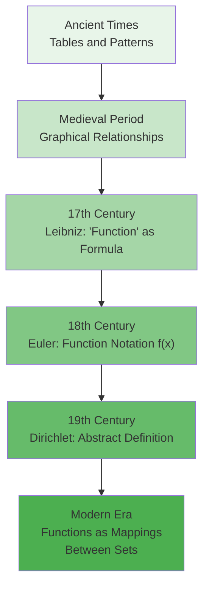
```mermaid
flowchart TD
    A["Ancient Times<br>Tables and Patterns"] --> B["Medieval Period<br>Graphical Relationships"]
    B --> C["17th Century<br>Leibniz: 'Function' as Formula"]
    C --> D["18th Century<br>Euler: Function Notation f(x)"]
    D --> E["19th Century<br>Dirichlet: Abstract Definition"]
    E --> F["Modern Era<br>Functions as Mappings<br>Between Sets"]

    style A fill:#E8F5E9
    style B fill:#C8E6C9
    style C fill:#A5D6A7
    style D fill:#81C784
    style E fill:#66BB6A
    style F fill:#4CAF50
```

Today, we define a function $f$ from a set $A$ to a set $B$ (written $f: A \rightarrow B$) as a rule that assigns to
each element $x \in A$ exactly one element $y \in B$. This element $y$ is denoted $f(x)$, read as "$f$ of $x$" or "the
value of $f$ at $x$."

The power of this definition lies in its generality. A function can be:

- A formula like $f(x) = x^2 + 3x - 5$
- A procedure like "round to the nearest integer"
- A table of values with no apparent pattern
- A graph drawn freehand
- Even a random assignment, as long as each input has exactly one output

This abstraction enables us to study properties common to all functions, regardless of their specific nature. It's this
unifying perspective that makes the function concept so powerful in mathematics.

##### Verbal Descriptions and Function Terminology

When we describe functions verbally, we're translating mathematical relationships into natural language. This
translation requires precision, as ambiguity in language can lead to mathematical confusion. Let's explore how to
articulate functions clearly and understand the essential terminology.

A function can be described through various verbal formulations:

- "The function that squares its input and adds three"
- "The temperature at time $t$"
- "The cost of producing $n$ items"
- "The probability of exactly $k$ successes in $n$ trials"

Each description implicitly defines three crucial components:

**Domain**: The set of all possible inputs. When we say "the function that gives the square root," we must specify that
the domain consists of non-negative real numbers (for real-valued functions). The domain answers: "What can we put into
this function?"

**Codomain**: The set where all outputs must live. For the square root function with domain $[0, \infty)$, the codomain
might be specified as $\mathbb{R}$ (all real numbers) or more precisely as $[0, \infty)$.

**Rule of Correspondence**: The specific relationship between inputs and outputs. This is the "heart" of the
function—what it actually does.

Consider this verbal description: "The function $f$ assigns to each positive real number the time in hours it takes for
a bacterial population to double, given that the population grows at a rate of that number percent per hour."

Breaking this down:

- Domain: $(0, \infty)$ (positive real numbers representing growth rates)
- The rule involves exponential growth: if the growth rate is $r$% per hour, we need $(1 + r/100)^t = 2$
- Solving: $t = \frac{\ln(2)}{\ln(1 + r/100)}$
- So $f(r) = \frac{\ln(2)}{\ln(1 + r/100)}$

The **range** (or image) of a function—the set of all actual outputs—often differs from the codomain. For our bacterial
growth function, while the codomain might be all real numbers, the range is $(0, \infty)$ since doubling time is always
positive.

Critical distinctions in terminology:

- **Independent variable**: The input variable (often $x$), which we can choose freely within the domain
- **Dependent variable**: The output variable (often $y$ or $f(x)$), which depends on our choice of input
- **Argument**: The specific input value we're evaluating
- **Value**: The output $f(x)$ for a given input $x$

Understanding these terms prevents confusion. When we say "evaluate $f$ at 3," we mean "find $f(3)$"—substitute 3 for
the independent variable and calculate the result.

The notation $f: A \rightarrow B$ encodes remarkable information:

- $f$ is the function's name
- $A$ is the domain
- $B$ is the codomain
- The arrow $\rightarrow$ indicates the direction of mapping

This notation immediately tells us what types of inputs and outputs to expect, crucial for mathematical reasoning.

##### Graphs and Visual Representations: Reading the Story

The graph of a function transforms abstract relationships into visual stories. When we plot a function, we create a
bridge between algebra and geometry, allowing our visual intuition to guide mathematical understanding.

The graph of a function $f$ consists of all ordered pairs $(x, f(x))$ where $x$ belongs to the domain of $f$. In the
Cartesian plane, we plot these points with $x$-coordinates from the domain and $y$-coordinates given by the function
values. The resulting curve or set of points is the function's graph.

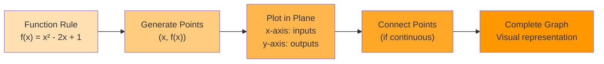
```mermaid
flowchart LR
    A["Function Rule<br>f(x) = x² - 2x + 1"] --> B["Generate Points<br>(x, f(x))"]
    B --> C["Plot in Plane<br>x-axis: inputs<br>y-axis: outputs"]
    C --> D["Connect Points<br>(if continuous)"]
    D --> E["Complete Graph<br>Visual representation"]

    style A fill:#FFE0B2
    style B fill:#FFCC80
    style C fill:#FFB74D
    style D fill:#FFA726
    style E fill:#FF9800
```

The **vertical line test** provides a visual criterion for identifying functions: if any vertical line intersects a
curve more than once, the curve cannot represent a function. Why? Because a vertical line $x = a$ represents all points
with the same $x$-coordinate. Multiple intersections would mean the same input $a$ produces multiple outputs, violating
the definition of a function.

Consider the circle $x^2 + y^2 = 1$. This fails the vertical line test—for instance, the line $x = 0$ intersects at both
$(0, 1)$ and $(0, -1)$. Thus, the circle doesn't represent $y$ as a function of $x$. However, we can split it into two
functions: $f(x) = \sqrt{1-x^2}$ (upper semicircle) and $g(x) = -\sqrt{1-x^2}$ (lower semicircle).

Graphs reveal function properties at a glance:

**Monotonicity**: Is the function increasing or decreasing? A function increases on an interval if its graph rises from
left to right. The function $f(x) = x^3$ increases everywhere, while $g(x) = -x^2$ decreases for $x > 0$.

**Extrema**: Local and global maxima and minima appear as peaks and valleys. The function $h(x) = x^3 - 3x$ has a local
maximum at $x = -1$ and a local minimum at $x = 1$.

**Symmetry**:

- Even functions satisfy $f(-x) = f(x)$, creating symmetry about the $y$-axis (like $f(x) = x^2$)
- Odd functions satisfy $f(-x) = -f(x)$, creating symmetry about the origin (like $f(x) = x^3$)

**Asymptotic behavior**: How does the function behave for extreme values? The rational function
$f(x) = \frac{x^2 + 1}{x}$ has a slant asymptote $y = x$ as $x \to \pm\infty$.

**Periodicity**: Functions like $\sin(x)$ repeat their values, creating wave-like patterns. The period is the smallest
positive value $p$ such that $f(x + p) = f(x)$ for all $x$.

Reading graphs requires practice. Consider the function whose graph starts at the origin, increases to a maximum at
$(1, 1)$, decreases to a minimum at $(3, -1)$, then increases without bound. This tells us:

- The function has both local extrema
- It changes from increasing to decreasing at $x = 1$
- It's neither even nor odd
- The range includes all values $\geq -1$

Graphs can also reveal subtle behaviors. The function $f(x) = x + \sin(x)$ appears almost linear from afar but shows
oscillation when viewed closely. This illustrates how different scales reveal different aspects of function behavior.

##### Tables of Values: Discrete Windows into Continuous Behavior

Tables represent functions through discrete samples, providing exact values at specific points. While less complete than
graphs or formulas, tables offer precision and are often how we first encounter functions in real-world data.

Consider a table representing water temperature as it cools:

| Time (minutes) | Temperature (°C) |
| -------------- | ---------------- |
| 0              | 100.0            |
| 5              | 85.2             |
| 10             | 72.8             |
| 15             | 62.3             |
| 20             | 53.5             |
| 25             | 46.1             |

This table defines a function $T(t)$ where $t$ is time and $T(t)$ is temperature. The domain shown is
${0, 5, 10, 15, 20, 25}$, though the physical phenomenon is continuous.

Tables raise important questions:

1. What happens between the given values?
2. How do we extend beyond the given domain?
3. What patterns exist in the data?

**Interpolation** estimates values between table entries. Linear interpolation assumes straight-line behavior between
points. For $T(7.5)$:
$$T(7.5) \approx T(5) + \frac{T(10) - T(5)}{10 - 5} \times (7.5 - 5) = 85.2 + \frac{72.8 - 85.2}{5} \times 2.5 = 79.0°C$$

More sophisticated methods like polynomial or spline interpolation can provide smoother estimates.

**Extrapolation** extends the function beyond the given domain. This requires assumptions about the underlying pattern.
From our temperature data, we might hypothesize Newton's Law of Cooling:
$T(t) = T_{\text{room}} + (T_0 - T_{\text{room}})e^{-kt}$.

Tables excel at revealing patterns through differences. Consider:

| $n$ | $f(n)$ | First Difference | Second Difference |
| --- | ------ | ---------------- | ----------------- |
| 0   | 1      | -                | -                 |
| 1   | 3      | 2                | -                 |
| 2   | 9      | 6                | 4                 |
| 3   | 19     | 10               | 4                 |
| 4   | 33     | 14               | 4                 |

Constant second differences suggest a quadratic function. Indeed, $f(n) = 2n^2 + 1$ generates this table.

Tables also capture functions that resist formulaic expression. Population data, stock prices, and experimental
measurements often exist primarily as tables. The challenge becomes extracting meaning from discrete points.

Consider how tables connect to other representations:

- **To graphs**: Plot the points and connect appropriately
- **To formulas**: Use regression or pattern recognition
- **To verbal descriptions**: Identify trends and behaviors

Tables remind us that functions need not have neat algebraic expressions. Any assignment of outputs to inputs, even
seemingly random ones, defines a function. This perspective is crucial in computer science, where functions are often
defined by algorithms or lookup tables rather than formulas.

##### Algebraic Formulas: The Language of Patterns

Algebraic formulas provide the most concise and powerful representation of many functions. They encode infinite
information in finite expressions, allowing us to compute values, analyze behavior, and discover properties through
manipulation.

An algebraic formula like $f(x) = \frac{x^2 - 1}{x + 2}$ immediately tells us:

- How to compute $f(x)$ for any $x$ in the domain
- The domain excludes $x = -2$ (where the denominator vanishes)
- The function is rational (a ratio of polynomials)
- We can analyze limits, derivatives, and integrals using algebraic techniques

The power of formulas lies in their manipulability. Consider transforming the above:
$$f(x) = \frac{x^2 - 1}{x + 2} = \frac{(x-1)(x+1)}{x+2}$$

This factored form reveals that $f(x) = 0$ when $x = 1$ or $x = -1$. Further algebraic manipulation through polynomial
division yields: $$f(x) = x - 2 + \frac{3}{x + 2}$$

This form exposes the slant asymptote $y = x - 2$ and the vertical asymptote at $x = -2$.

Different formula representations highlight different properties:

- **Standard form**: $f(x) = ax^2 + bx + c$ shows polynomial degree and leading coefficient
- **Factored form**: $f(x) = a(x - r_1)(x - r_2)$ reveals roots
- **Vertex form**: $f(x) = a(x - h)^2 + k$ identifies the vertex of a parabola

The art lies in choosing the most revealing form for our purpose.

Formulas enable **function composition** naturally. If $f(x) = x^2 + 1$ and $g(x) = \sqrt{x}$, then:
$$(g \circ f)(x) = g(f(x)) = g(x^2 + 1) = \sqrt{x^2 + 1}$$

This wouldn't be as clear with tables or graphs alone.

Complex phenomena often require sophisticated formulas. The logistic function $f(x) = \frac{L}{1 + e^{-k(x-x_0)}}$
models bounded growth, combining exponential behavior with saturation. Each parameter has meaning:

- $L$: carrying capacity (maximum value)
- $k$: growth rate
- $x_0$: midpoint of growth

However, formulas have limitations. Not all functions have neat algebraic expressions. The function "the number of
primes less than $x$" has no known simple formula. Even when formulas exist, they might obscure rather than
illuminate—the formula for the $n$th Fibonacci number involves the golden ratio raised to the $n$th power, hardly
intuitive!

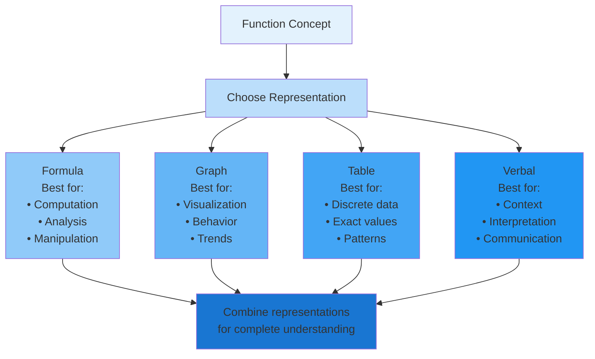
```mermaid
flowchart TD
    A["Function Concept"] --> B["Choose Representation"]
    B --> C["Formula<br>Best for:<br>• Computation<br>• Analysis<br>• Manipulation"]
    B --> D["Graph<br>Best for:<br>• Visualization<br>• Behavior<br>• Trends"]
    B --> E["Table<br>Best for:<br>• Discrete data<br>• Exact values<br>• Patterns"]
    B --> F["Verbal<br>Best for:<br>• Context<br>• Interpretation<br>• Communication"]

    C --> G["Combine representations<br>for complete understanding"]
    D --> G
    E --> G
    F --> G

    style A fill:#E3F2FD
    style B fill:#BBDEFB
    style C fill:#90CAF9
    style D fill:#64B5F6
    style E fill:#42A5F5
    style F fill:#2196F3
    style G fill:#1976D2
```

##### Converting Between Representations: The Power of Multiple Perspectives

Mastery of functions requires fluency in converting between representations. Each transformation reveals different
aspects of the function, and the ability to move fluidly between forms distinguishes mathematical maturity.

**From Formula to Graph**: This conversion visualizes algebraic expressions. Consider $f(x) = x^3 - 3x$. To sketch its
graph:

1. Find intercepts: $f(0) = 0$ and $f(x) = 0$ when $x(x^2 - 3) = 0$, giving $x = 0, \pm\sqrt{3}$
2. Analyze critical points: $f'(x) = 3x^2 - 3 = 0$ when $x = \pm 1$
3. Determine concavity: $f''(x) = 6x$, so the function is concave down for $x < 0$ and concave up for $x > 0$
4. Check end behavior: As $x \to \pm\infty$, $f(x) \to \pm\infty$

This analysis yields a cubic with a local maximum at $(-1, 2)$ and local minimum at $(1, -2)$.

**From Graph to Formula**: This reverse process requires pattern recognition. Seeing a parabola, we know to try
$f(x) = ax^2 + bx + c$. Given three points, we can solve for $a$, $b$, and $c$. For a parabola through $(0, 1)$,
$(1, 0)$, and $(2, 1)$:

- From $(0, 1)$: $c = 1$
- From $(1, 0)$: $a + b + 1 = 0$
- From $(2, 1)$: $4a + 2b + 1 = 1$

Solving yields $a = 1$, $b = -2$, $c = 1$, so $f(x) = x^2 - 2x + 1 = (x-1)^2$.

**From Table to Formula**: This requires detecting patterns. Consider:

| $x$ | $f(x)$ |
| --- | ------ |
| 1   | 2      |
| 2   | 5      |
| 3   | 10     |
| 4   | 17     |
| 5   | 26     |

The differences between consecutive values are 3, 5, 7, 9—increasing by 2 each time. This constant second difference
indicates a quadratic. Using the method of undetermined coefficients or recognizing that $f(x) = x^2 + 1$ fits the
pattern.

**From Verbal to Formula**: This translation requires careful parsing. "The cost of producing $x$ items includes a fixed
cost of $500 plus $3 per item" becomes $C(x) = 500 + 3x$. "The population doubles every 3 hours" leads to
$P(t) = P_0 \cdot 2^{t/3}$.

**From Formula to Table**: Direct evaluation creates tables, but strategic point selection maximizes information. For
$f(x) = \sin(x)$, evaluate at multiples of $\pi/4$ to capture key behaviors.

**From Graph to Verbal**: This requires mathematical storytelling. A graph showing temperature over a day might be
described: "The temperature starts at 15°C at midnight, decreases to a minimum of 10°C at 4 AM, then rises to a maximum
of 25°C at 2 PM before declining back to 15°C by midnight."

Each representation offers unique advantages:

- **Formulas** enable precise calculation and symbolic manipulation
- **Graphs** reveal overall behavior and geometric properties
- **Tables** provide exact values and suggest patterns
- **Verbal descriptions** connect mathematics to real-world contexts

The key insight: no single representation tells the complete story. A function is fully understood only when we can
seamlessly translate between all forms, using each where it's most powerful.

Consider how different representations answer different questions about the same function:

- "What is $f(3.7)$?" → Use the formula
- "Where does $f$ have a maximum?" → Examine the graph
- "What pattern exists in the outputs?" → Study the table
- "What does this function model?" → Read the verbal description

This multi-representational fluency forms the foundation for all subsequent work in calculus. When we later study
limits, derivatives, and integrals, we'll constantly shift between these representations, using each to illuminate
different aspects of the mathematical landscape.

#### Mathematical Models: A Catalog of Essential Functions

Mathematical modeling transforms real-world phenomena into mathematical language, allowing us to analyze, predict, and
understand complex systems. At the heart of this process lies a collection of essential functions that serve as building
blocks. Just as architects combine basic shapes to create complex structures, mathematicians combine fundamental
functions to model intricate phenomena.

##### Why We Need a Function Library: Building Blocks of Reality

Imagine trying to describe every curve, every pattern, every relationship from scratch. It would be like reinventing
language for each conversation. Instead, mathematics provides us with a library of standard functions—tested,
understood, and ready to deploy. These functions aren't arbitrary; they emerge naturally from fundamental patterns in
nature, geometry, and human constructs.

The power of having standard functions extends beyond convenience. When we recognize that population growth follows an
exponential pattern, we immediately inherit all our knowledge about exponential functions: their properties, behaviors,
and techniques for analysis. This recognition transforms a complex real-world problem into a familiar mathematical
framework.

Our library of functions serves multiple purposes:

**Pattern Recognition**: When data exhibits certain characteristics, we can identify the underlying function family.
Constant rate of change suggests linear functions; U-shaped curves point to quadratics; periodic oscillations indicate
trigonometric functions.

**Prediction and Extrapolation**: Once we identify the function type, we can predict future values and understand
long-term behavior. Knowing that radioactive decay is exponential tells us the substance will never completely disappear
but will approach zero asymptotically.

**Communication**: Standard functions provide a common language. Saying "the relationship is logarithmic" immediately
conveys specific information about growth rates, asymptotic behavior, and mathematical properties.

**Analysis Tools**: Each function family comes with specialized techniques. Linear functions use slope-intercept
analysis; trigonometric functions employ identities and periodicity; exponential functions leverage logarithms.

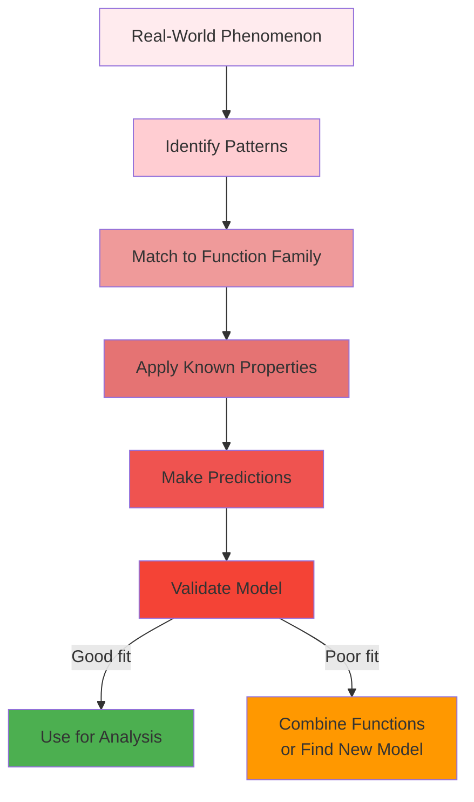
```mermaid
flowchart TD
    A["Real-World Phenomenon"] --> B["Identify Patterns"]
    B --> C["Match to Function Family"]
    C --> D["Apply Known Properties"]
    D --> E["Make Predictions"]
    E --> F["Validate Model"]
    F -->|"Good fit"| G["Use for Analysis"]
    F -->|"Poor fit"| H["Combine Functions<br>or Find New Model"]

    style A fill:#FFEBEE
    style B fill:#FFCDD2
    style C fill:#EF9A9A
    style D fill:#E57373
    style E fill:#EF5350
    style F fill:#F44336
    style G fill:#4CAF50
    style H fill:#FF9800
```

The functions in our library aren't isolated entities—they're interconnected through various relationships:

- Polynomials are built from power functions
- Rational functions combine polynomials through division
- Trigonometric functions relate through identities
- Exponential and logarithmic functions are inverses

This interconnectedness means mastering one function family illuminates others. Understanding that
$\sin^2(x) + \cos^2(x) = 1$ connects trigonometry to the unit circle, while knowing that $\ln(e^x) = x$ links
exponentials and logarithms.

##### Linear Functions: The Simplest Rate of Change

Linear functions represent the most fundamental relationship in mathematics: constant rate of change. The general form
$f(x) = mx + b$ encodes two pieces of information: the rate of change $m$ (slope) and the starting value $b$
(y-intercept).

The beauty of linear functions lies in their predictability. If you know the function increases by 3 units for every
1-unit increase in input, this rate remains constant whether $x = 1$ or $x = 1000$. This property—that the rate of
change doesn't depend on position—makes linear functions both powerful and limited.

**Geometric Interpretation**: The graph of a linear function is always a straight line. The slope $m$ determines the
line's steepness and direction:

- $m > 0$: Line rises from left to right (increasing function)
- $m < 0$: Line falls from left to right (decreasing function)
- $m = 0$: Horizontal line (constant function)
- $|m|$ large: Steep line (rapid change)
- $|m|$ small: Gentle line (gradual change)

The y-intercept $b$ tells us where the line crosses the vertical axis—the function's value when the input is zero. This
often represents an initial condition or fixed component.

**Real-World Applications**: Linear functions model countless phenomena:

_Distance and Speed_: If you drive at a constant speed of 60 mph, starting 100 miles from home, your distance from home
is $d(t) = 100 + 60t$. The slope (60) is your speed; the intercept (100) is your starting distance.

_Economics_: A company's cost function might be $C(x) = 5000 + 25x$, where $x$ is the number of units produced. The
$5000 represents fixed costs (rent, equipment), while $25$ is the variable cost per unit.

_Temperature Conversion_: The relationship between Celsius and Fahrenheit is linear: $F = \frac{9}{5}C + 32$. The slope
$\frac{9}{5}$ represents how Fahrenheit degrees relate to Celsius degrees; the intercept 32 is the freezing point of
water in Fahrenheit.

**Finding Linear Functions**: Given two points $(x_1, y_1)$ and $(x_2, y_2)$, we can find the linear function passing
through them:

1. Calculate slope: $m = \frac{y_2 - y_1}{x_2 - x_1}$
2. Use point-slope form: $y - y_1 = m(x - x_1)$
3. Rearrange to slope-intercept form: $y = mx + b$

This process reveals an important principle: two points completely determine a linear function. This uniqueness property
doesn't hold for more complex functions.

**Linear Approximation**: Even when relationships aren't linear, linear functions provide local approximations. Near any
point, a smooth curve resembles its tangent line—a linear function. This principle, formalized through calculus, makes
linear functions essential for understanding all differentiable functions.

**Limitations**: Linear functions cannot model:

- Acceleration (changing rates of change)
- Bounded growth (approaching a limit)
- Periodic behavior (repeating patterns)
- Multiplicative relationships (compound growth)

Recognizing these limitations guides us toward other function families when linear models fail.

##### Polynomial Functions: From Parabolas to Higher Dimensions

Polynomial functions extend our modeling power by allowing rates of change to vary. The general form
$$P(x) = a_nx^n + a_{n-1}x^{n-1} + \cdots + a_1x + a_0$$ where $n$ is a non-negative integer and $a_n \neq 0$,
encompasses everything from constants to complex curves.

**Degree and Behavior**: The degree $n$ determines the polynomial's fundamental character:

- Degree 0: Constant function $P(x) = a_0$
- Degree 1: Linear function $P(x) = a_1x + a_0$
- Degree 2: Quadratic function $P(x) = a_2x^2 + a_1x + a_0$
- Degree 3: Cubic function $P(x) = a_3x^3 + a_2x^2 + a_1x + a_0$

As degree increases, polynomials gain flexibility but also complexity. A polynomial of degree $n$ can have at most $n$
real roots and $n-1$ turning points (local extrema).

**Quadratic Functions**: The parabola $f(x) = ax^2 + bx + c$ deserves special attention. Its graph has a distinctive
U-shape (or inverted U if $a < 0$) with a vertex at $x = -\frac{b}{2a}$. Quadratics model:

- Projectile motion: $h(t) = -\frac{1}{2}gt^2 + v_0t + h_0$
- Area relationships: Area of a square with side $x$ is $A(x) = x^2$
- Optimization problems: Profit functions often have quadratic form

The quadratic formula $x = \frac{-b \pm \sqrt{b^2 - 4ac}}{2a}$ provides roots explicitly, while the discriminant
$\Delta = b^2 - 4ac$ determines the nature of roots:

- $\Delta > 0$: Two distinct real roots
- $\Delta = 0$: One repeated real root
- $\Delta < 0$: Two complex conjugate roots

**Higher-Degree Polynomials**: Cubic functions introduce inflection points—places where concavity changes. The general
cubic $f(x) = ax^3 + bx^2 + cx + d$ can have:

- Three real roots or one real root and two complex conjugates
- Two turning points or none
- One inflection point (always)

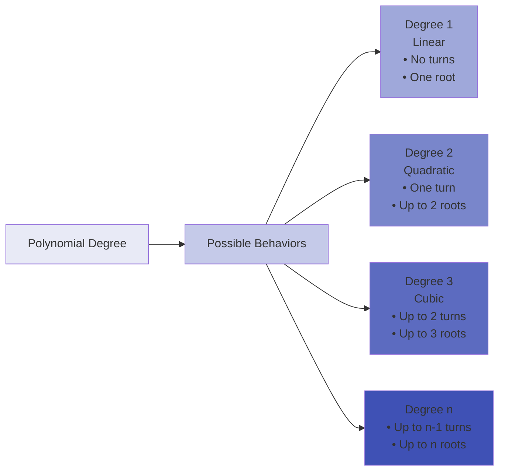
```mermaid
graph LR
    A["Polynomial Degree"] --> B["Possible Behaviors"]
    B --> C["Degree 1<br>Linear<br>• No turns<br>• One root"]
    B --> D["Degree 2<br>Quadratic<br>• One turn<br>• Up to 2 roots"]
    B --> E["Degree 3<br>Cubic<br>• Up to 2 turns<br>• Up to 3 roots"]
    B --> F["Degree n<br>• Up to n-1 turns<br>• Up to n roots"]

    style A fill:#E8EAF6
    style B fill:#C5CAE9
    style C fill:#9FA8DA
    style D fill:#7986CB
    style E fill:#5C6BC0
    style F fill:#3F51B5
```

**End Behavior**: For large |x|, the highest-degree term dominates:

- Even degree, positive leading coefficient: Both ends go to $+\infty$
- Even degree, negative leading coefficient: Both ends go to $-\infty$
- Odd degree, positive leading coefficient: Left to $-\infty$, right to $+\infty$
- Odd degree, negative leading coefficient: Left to $+\infty$, right to $-\infty$

**Applications**: Polynomials excel at modeling smooth, continuous phenomena:

- Physics: Potential energy functions
- Engineering: Stress-strain relationships
- Economics: Cost and revenue functions
- Statistics: Regression models

The **Fundamental Theorem of Algebra** guarantees that every polynomial of degree $n$ has exactly $n$ roots (counting
multiplicities) in the complex numbers. This profound result connects algebra and analysis.

##### Rational Functions: Division Creates Complexity

Rational functions, quotients of polynomials $R(x) = \frac{P(x)}{Q(x)}$, introduce discontinuities and asymptotic
behavior absent in polynomials. This added complexity makes them indispensable for modeling phenomena involving rates,
proportions, and constraints.

**Domain Restrictions**: Unlike polynomials, rational functions have restricted domains. The function is undefined where
the denominator equals zero. These points often correspond to vertical asymptotes, creating dramatic behavior.

Consider $f(x) = \frac{1}{x}$, the simplest nontrivial rational function:

- Domain: $\mathbb{R} \setminus {0}$ (all reals except 0)
- Vertical asymptote at $x = 0$
- Horizontal asymptote at $y = 0$
- Hyperbolic shape with two branches

**Asymptotic Analysis**: Rational functions exhibit rich asymptotic behavior:

1. **Vertical Asymptotes**: Occur at zeros of the denominator (unless canceled by the numerator). Near $x = a$ where
   $Q(a) = 0$ but $P(a) \neq 0$, the function approaches $\pm\infty$.
2. **Horizontal Asymptotes**: Determined by comparing degrees of numerator and denominator:

    - If deg$(P) <$ deg$(Q)$: Horizontal asymptote at $y= 0$
    - If deg$(P) =$ deg$(Q)$: Horizontal asymptote at $y = \frac{a_n}{b_n}$ (ratio of leading coefficients)
    - If deg$(P) >$ deg$(Q)$: No horizontal asymptote

3. **Oblique Asymptotes**: When deg$(P) =$ deg$(Q) + 1$, polynomial division yields $R(x) = mx + b + \frac{r(x)}{Q(x)}$
   where deg$(r) <$ deg$(Q)$. As $x \to \pm\infty$, $R(x)$ approaches the line $y = mx + b$.

**Example Analysis**: Consider $f(x) = \frac{x^2 - 1}{x^2 - 4} = \frac{(x-1)(x+1)}{(x-2)(x+2)}$

- Domain: $\mathbb{R} \setminus {-2, 2}$
- Zeros: $x = \pm 1$ (where numerator = 0)
- Vertical asymptotes: $x = \pm 2$ (where denominator = 0)
- Horizontal asymptote: $y = 1$ (equal degrees, ratio of leading coefficients)
- Function behavior: Approaches 1 as $x \to \pm\infty$

**Partial Fractions**: Complex rational functions can be decomposed into simpler components. For
$\frac{2x + 3}{x^2 - 1} = \frac{2x + 3}{(x-1)(x+1)}$, we can write:
$$\frac{2x + 3}{x^2 - 1} = \frac{A}{x-1} + \frac{B}{x+1}$$

Solving for $A$ and $B$ yields $A = \frac{5}{2}$, $B = -\frac{1}{2}$, giving insight into the function's behavior near
each asymptote.

**Applications**: Rational functions model numerous real-world phenomena:

- **Pharmacokinetics**: Drug concentration $C(t) = \frac{D}{V} \cdot \frac{1}{1 + kt}$ where $D$ is dose, $V$ is volume,
  and $k$ is elimination rate
- **Economics**: Average cost $AC(x) = \frac{C(x)}{x}$ where $C(x)$ is total cost
- **Physics**: Gravitational force $F(r) = \frac{Gm_1m_2}{r^2}$ (inverse square law)
- **Electronics**: Impedance in AC circuits involving capacitors and inductors

The power of rational functions lies in their ability to model both bounded and unbounded behavior, making them
essential for understanding rates, efficiencies, and proportional relationships.

##### Trigonometric Functions: Circular Motion and Waves

Trigonometric functions emerge from the geometry of circles and triangles, yet their applications extend far beyond
geometry. These periodic functions model any phenomenon that repeats in cycles—from sound waves to planetary orbits.

**The Unit Circle Definition**: For a point $(x, y)$ on the unit circle at angle $\theta$ from the positive x-axis:

- $\cos(\theta) = x$ (horizontal coordinate)
- $\sin(\theta) = y$ (vertical coordinate)
- $\tan(\theta) = \frac{y}{x} = \frac{\sin(\theta)}{\cos(\theta)}$ (slope of radius)

This definition immediately yields fundamental properties:

- $\sin^2(\theta) + \cos^2(\theta) = 1$ (Pythagorean identity)
- $-1 \leq \sin(\theta) \leq 1$ and $-1 \leq \cos(\theta) \leq 1$ (bounded functions)
- Both functions have period $2\pi$

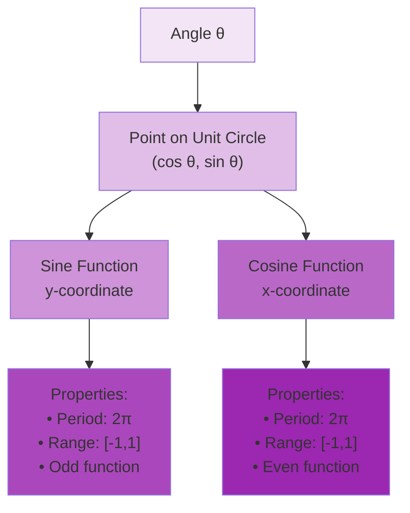
```mermaid
flowchart TD
    A["Angle θ"] --> B["Point on Unit Circle<br>(cos θ, sin θ)"]
    B --> C["Sine Function<br>y-coordinate"]
    B --> D["Cosine Function<br>x-coordinate"]
    C --> E["Properties:<br>• Period: 2π<br>• Range: [-1,1]<br>• Odd function"]
    D --> F["Properties:<br>• Period: 2π<br>• Range: [-1,1]<br>• Even function"]

    style A fill:#F3E5F5
    style B fill:#E1BEE7
    style C fill:#CE93D8
    style D fill:#BA68C8
    style E fill:#AB47BC
    style F fill:#9C27B0
```

**Periodicity and Wave Properties**: The general sinusoidal function $f(x) = A\sin(B(x - C)) + D$ encodes:

- $A$: Amplitude (maximum displacement from center)
- $B$: Frequency factor (period = $\frac{2\pi}{B}$)
- $C$: Phase shift (horizontal displacement)
- $D$: Vertical shift (center line)

This form models any periodic phenomenon. For example, the height of a point on a Ferris wheel:
$$h(t) = 25\sin\left(\frac{\pi}{30}(t - 15)\right) + 30$$ where the wheel has radius 25m, center at 30m height, period
60 seconds, and reaches maximum height at $t = 15$ seconds.

**Key Trigonometric Identities**: These relationships enable sophisticated manipulation:

1. **Angle Addition**:
    - $\sin(a + b) = \sin(a)\cos(b) + \cos(a)\sin(b)$
    - $\cos(a + b) = \cos(a)\cos(b) - \sin(a)\sin(b)$
2. **Double Angle**:
    - $\sin(2\theta) = 2\sin(\theta)\cos(\theta)$
    - $\cos(2\theta) = \cos^2(\theta) - \sin^2(\theta)$
3. **Half Angle**:
    - $\sin^2(\theta/2) = \frac{1 - \cos(\theta)}{2}$
    - $\cos^2(\theta/2) = \frac{1 + \cos(\theta)}{2}$

**Other Trigonometric Functions**:

- Tangent: $\tan(\theta) = \frac{\sin(\theta)}{\cos(\theta)}$, period $\pi$, vertical asymptotes at odd multiples of
  $\pi/2$
- Secant: $\sec(\theta) = \frac{1}{\cos(\theta)}$
- Cosecant: $\csc(\theta) = \frac{1}{\sin(\theta)}$
- Cotangent: $\cot(\theta) = \frac{\cos(\theta)}{\sin(\theta)}$

**Applications Across Sciences**:

_Physics_: Simple harmonic motion $x(t) = A\cos(\omega t + \phi)$ describes:

- Mass on spring: $\omega = \sqrt{k/m}$
- Pendulum: $\omega = \sqrt{g/L}$ for small angles
- AC current: $I(t) = I_0\sin(\omega t)$

_Signal Processing_: Fourier analysis decomposes complex signals into trigonometric components. Any periodic function
can be written as: $$f(x) = \frac{a_0}{2} + \sum_{n=1}^{\infty}[a_n\cos(nx) + b_n\sin(nx)]$$

_Engineering_: Vibrations, waves, and oscillations all use trigonometric models. The superposition principle allows
combining multiple waves: interference patterns, beats, and standing waves.

The universality of trigonometric functions stems from their connection to rotation and periodicity—fundamental aspects
of our physical world.

##### Exponential and Logarithmic Functions: Growth and Decay

Exponential functions model processes where the rate of change is proportional to the current value—a fundamental
pattern in nature, finance, and science. The general form $f(x) = a \cdot b^x$ (where $a \neq 0$, $b > 0$, $b \neq 1$)
captures both growth $(b > 1)$ and decay $(0 < b < 1)$.

**The Natural Exponential Function**: The number $e \approx 2.71828...$ emerges naturally in many contexts:

- Compound interest: $\lim_{n \to \infty}\left(1 + \frac{1}{n}\right)^n = e$
- Differential equations: $e^x$ is the unique function equal to its own derivative
- Probability: The normal distribution involves $e^{-x^2/2}$

The function $f(x) = e^x$ has remarkable properties:

- $\frac{d}{dx}(e^x) = e^x$ (invariant under differentiation)
- $e^{x+y} = e^x \cdot e^y$ (converts addition to multiplication)
- $e^0 = 1$ and $e^1 = e$
- Always positive: $e^x > 0$ for all real $x$

**Logarithmic Functions**: As inverse functions of exponentials, logarithms answer "To what power must we raise the base
to get this value?" If $b^y = x$, then $y = \log_b(x)$.

The natural logarithm $\ln(x) = \log_e(x)$ has special significance:

- Domain: $(0, \infty)$ (only positive inputs)
- Range: $(-\infty, \infty)$ (all real outputs)
- $\ln(1) = 0$ and $\ln(e) = 1$
- $\ln(xy) = \ln(x) + \ln(y)$ (converts multiplication to addition)
- $\ln(x^r) = r\ln(x)$ (brings exponents down)

**Growth and Decay Models**:

_Exponential Growth_: $P(t) = P_0e^{rt}$ where:

- $P_0$: Initial value
- $r$: Growth rate (positive)
- $t$: Time

Examples: Population growth, compound interest, nuclear chain reactions

_Exponential Decay_: $N(t) = N_0e^{-\lambda t}$ where:

- $N_0$: Initial quantity
- $\lambda$: Decay constant (positive)
- $t$: Time

Examples: Radioactive decay, drug elimination, cooling processes

**Half-Life and Doubling Time**: These concepts provide intuitive measures:

- Half-life: Time for quantity to reduce by half. If $N(t_{1/2}) = \frac{N_0}{2}$, then
  $t_{1/2} = \frac{\ln(2)}{\lambda}$
- Doubling time: Time for quantity to double. If $P(t_d) = 2P_0$, then $t_d = \frac{\ln(2)}{r}$

**Logarithmic Scales**: When data spans many orders of magnitude, logarithmic scales reveal patterns:

- Richter scale: Earthquake magnitude $M = \log_{10}\left(\frac{A}{A_0}\right)$
- Decibels: Sound intensity $L = 10\log_{10}\left(\frac{I}{I_0}\right)$
- pH scale: Acidity $\text{pH} = -\log_{10}[\text{H}^+]$

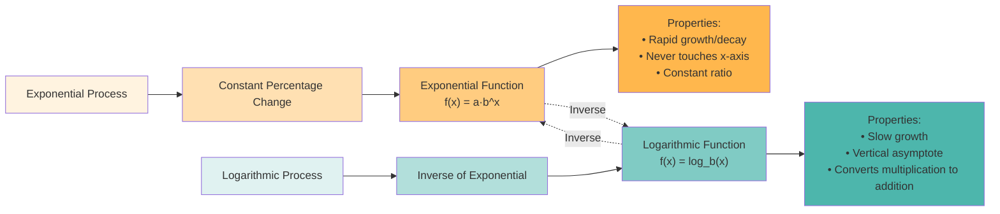
```mermaid
flowchart LR
    A["Exponential Process"] --> B["Constant Percentage Change"]
    B --> C["Exponential Function<br>f(x) = a·b^x"]
    C --> D["Properties:<br>• Rapid growth/decay<br>• Never touches x-axis<br>• Constant ratio"]

    E["Logarithmic Process"] --> F["Inverse of Exponential"]
    F --> G["Logarithmic Function<br>f(x) = log_b(x)"]
    G --> H["Properties:<br>• Slow growth<br>• Vertical asymptote<br>• Converts multiplication to addition"]

    C -.->|"Inverse"| G
    G -.->|"Inverse"| C

    style A fill:#FFF3E0
    style B fill:#FFE0B2
    style C fill:#FFCC80
    style D fill:#FFB74D
    style E fill:#E0F2F1
    style F fill:#B2DFDB
    style G fill:#80CBC4
    style H fill:#4DB6AC
```

**Applications**: Exponential and logarithmic functions appear everywhere:

- Biology: Bacterial growth, enzyme kinetics
- Finance: Compound interest, present value calculations
- Physics: Radioactive decay, RC circuits
- Computer Science: Algorithm complexity, information theory
- Chemistry: Reaction rates, pH calculations

The inverse relationship between exponential and logarithmic functions provides powerful tools for solving equations. To
solve $2^x = 10$, we apply logarithms: $x = \log_2(10) = \frac{\ln(10)}{\ln(2)} \approx 3.32$.

##### Choosing and Combining Models: The Art of Mathematical Modeling

Real-world phenomena rarely follow a single, simple function. The art of mathematical modeling involves selecting
appropriate functions, combining them, and validating the results. This process requires both mathematical knowledge and
domain expertise.

**Model Selection Criteria**:

1. **Pattern Matching**: Examine data characteristics
    - Linear trend → Linear function
    - Constant percentage change → Exponential
    - Periodic oscillation → Trigonometric
    - Bounded growth → Logistic or rational
2. **Physical Principles**: Use domain knowledge
    - Conservation laws often yield polynomial relationships
    - Inverse square laws suggest rational functions
    - Wave phenomena indicate trigonometric functions
3. **Boundary Conditions**: Consider limiting behavior
    - What happens as $x \to 0$? As $x \to \infty$?
    - Are there natural bounds on the output?
    - Must the function pass through specific points?

**Combining Functions**: Complex phenomena often require function combinations:

_Damped Oscillation_: $f(t) = Ae^{-\gamma t}\cos(\omega t + \phi)$

- Exponential decay envelope
- Trigonometric oscillation
- Models: Shock absorbers, RLC circuits

_Logistic Growth_: $P(t) = \frac{K}{1 + Ae^{-rt}}$

- Combines exponential growth with saturation
- Models: Population with carrying capacity, market adoption

_Seasonal Trends_: $S(t) = mt + b + A\sin\left(\frac{2\pi t}{365}\right)$

- Linear trend plus periodic variation
- Models: Temperature with climate change, sales with seasonality

**Model Validation**: A model's value depends on its accuracy and usefulness:

1. **Residual Analysis**: Plot actual vs. predicted values
2. **R-squared**: Measure proportion of variance explained
3. **Cross-validation**: Test on unseen data
4. **Sensitivity Analysis**: How do small changes in parameters affect outcomes?

**Example: Modeling Coffee Temperature**

Coffee cooling involves multiple physical processes. Starting with Newton's Law of Cooling:
$$T(t) = T_{\text{room}} + (T_0 - T_{\text{room}})e^{-kt}$$

But this assumes constant room temperature and ignores evaporation. A more sophisticated model might be:
$$T(t) = T_{\text{room}}(t) + (T_0 - T_{\text{room}}(0))e^{-k(t)t}$$

Where:

- $T_{\text{room}}(t)$ varies with time of day
- $k(t)$ increases due to evaporation, which depends on temperature

This illustrates how models evolve from simple to complex as we incorporate more physical reality.

**The Modeling Cycle**:

1. **Identify**: What are we trying to model?
2. **Simplify**: What assumptions can we make?
3. **Select**: Which functions capture the essential behavior?
4. **Combine**: How do different effects interact?
5. **Validate**: Does the model match reality?
6. **Refine**: How can we improve accuracy?

The goal isn't perfection but usefulness. As statistician George Box noted, "All models are wrong, but some are useful."
The key is finding the right balance between simplicity and accuracy for your specific purpose.

Mathematical modeling is both science and art. It requires:

- Deep understanding of function behavior
- Ability to recognize patterns
- Skill in combining functions creatively
- Judgment about appropriate complexity
- Constant validation against reality

This catalog of essential functions provides the vocabulary; modeling supplies the grammar for expressing nature's
complexity in mathematical language.

#### New Functions from Old Functions

The true power of mathematics emerges when we combine simple elements to create complex structures. Just as chemists
combine atoms to form molecules with new properties, mathematicians combine functions to model intricate phenomena. This
section explores the algebra of functions—how we transform, combine, and manipulate functions to create new mathematical
objects.

##### The Algebra of Functions: Creating Complexity from Simplicity

Functions can be combined through arithmetic operations, creating new functions with properties inherited from their
components. Given functions $f$ and $g$, we can form:

**Addition**: $(f + g)(x) = f(x) + g(x)$

- Domain: Intersection of domains of $f$ and $g$
- Combines effects additively
- Example: Total cost = Fixed cost + Variable cost

**Subtraction**: $(f - g)(x) = f(x) - g(x)$

- Useful for finding differences or changes
- Example: Profit = Revenue - Cost

**Multiplication**: $(f \cdot g)(x) = f(x) \cdot g(x)$

- Creates more complex behavior
- Example: Work = Force × Distance

**Division**: $\left(\frac{f}{g}\right)(x) = \frac{f(x)}{g(x)}$, where $g(x) \neq 0$

- Domain excludes points where $g(x) = 0$
- Creates rational functions from polynomials
- Example: Average cost = Total cost / Quantity

Consider combining $f(x) = x^2$ and $g(x) = \sin(x)$:

- $(f + g)(x) = x^2 + \sin(x)$: Parabola with sinusoidal wiggle
- $(f \cdot g)(x) = x^2\sin(x)$: Oscillation with growing amplitude
- $\left(\frac{g}{f}\right)(x) = \frac{\sin(x)}{x^2}$: Damped oscillation approaching 0

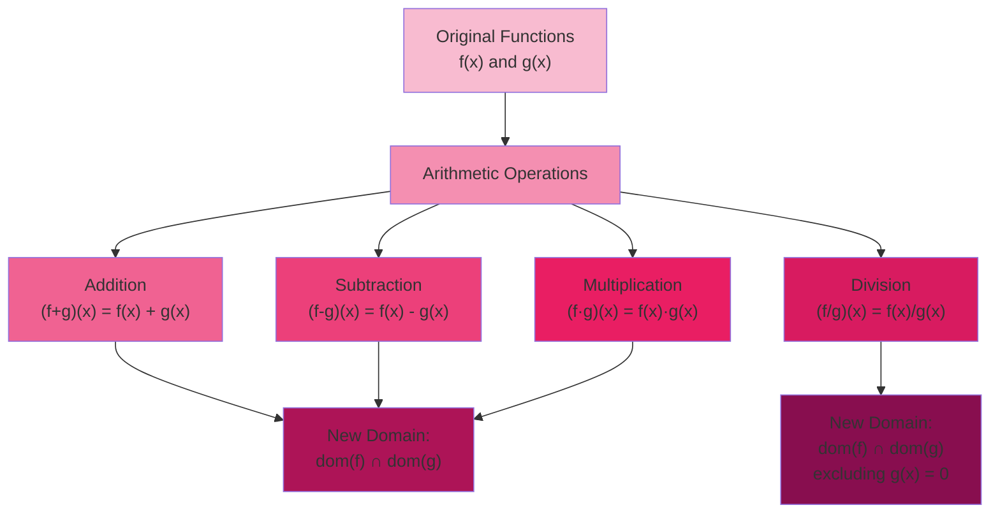
```mermaid
flowchart TD
    A["Original Functions<br>f(x) and g(x)"] --> B["Arithmetic Operations"]
    B --> C["Addition<br>(f+g)(x) = f(x) + g(x)"]
    B --> D["Subtraction<br>(f-g)(x) = f(x) - g(x)"]
    B --> E["Multiplication<br>(f·g)(x) = f(x)·g(x)"]
    B --> F["Division<br>(f/g)(x) = f(x)/g(x)"]

    C --> G["New Domain:<br>dom(f) ∩ dom(g)"]
    D --> G
    E --> G
    F --> H["New Domain:<br>dom(f) ∩ dom(g)<br>excluding g(x) = 0"]

    style A fill:#F8BBD0
    style B fill:#F48FB1
    style C fill:#F06292
    style D fill:#EC407A
    style E fill:#E91E63
    style F fill:#D81B60
    style G fill:#AD1457
    style H fill:#880E4F
```

**Properties of Combined Functions**:

- Continuity: If $f$ and $g$ are continuous at $a$, so are $f + g$, $f - g$, and $f \cdot g$. The quotient $f/g$ is
  continuous at $a$ if $g(a) \neq 0$.
- Differentiability: Similar preservation, with specific rules for derivatives
- Limits: $\lim_{x \to a}[f(x) + g(x)] = \lim_{x \to a}f(x) + \lim_{x \to a}g(x)$ (when both limits exist)

**Scalar Multiplication**: For any constant $c$, $(cf)(x) = c \cdot f(x)$

- Stretches (|c| > 1) or compresses (0 < |c| < 1) vertically
- Reflects across x-axis if c < 0
- Preserves zeros of the function

The algebra of functions provides a systematic way to build complexity. Starting with a library of basic functions, we
can construct models for virtually any smooth phenomenon through appropriate combinations.

##### Transformations: Moving and Stretching Reality

Transformations allow us to modify a function's graph without changing its essential character. Understanding
transformations provides geometric insight into function behavior and enables efficient graphing.

**Vertical Transformations**:

1. **Vertical Shift**: $y = f(x) + k$
    - Moves graph up (k > 0) or down (k < 0)
    - Preserves shape, domain, and range shifts by k
    - Example: $y = x^2 + 3$ shifts $y = x^2$ up by 3 units
2. **Vertical Stretch/Compression**: $y = a \cdot f(x)$
    - |a| > 1: Stretches graph vertically
    - 0 < |a| < 1: Compresses graph vertically
    - a < 0: Also reflects across x-axis
    - Example: $y = 2\sin(x)$ doubles amplitude of sine wave

**Horizontal Transformations**:

1. **Horizontal Shift**: $y = f(x - h)$
    - Moves graph right (h > 0) or left (h < 0)
    - Counter-intuitive: minus shifts right, plus shifts left
    - Example: $y = (x - 2)^2$ shifts parabola right by 2 units
2. **Horizontal Stretch/Compression**: $y = f(bx)$
    - 0 < |b| < 1: Stretches graph horizontally
    - |b| > 1: Compresses graph horizontally
    - b < 0: Also reflects across y-axis
    - Example: $y = \sin(2x)$ halves the period of sine

**Combined Transformations**: The general form $y = a \cdot f(b(x - h)) + k$ applies multiple transformations:

1. Shift right by h
2. Stretch/compress horizontally by factor 1/|b|
3. Reflect across y-axis if b < 0
4. Stretch/compress vertically by factor |a|
5. Reflect across x-axis if a < 0
6. Shift up by k

Order matters! Horizontal transformations occur before vertical ones in the standard form.

**Example Analysis**: Transform $f(x) = \sqrt{x}$ to get $g(x) = -2\sqrt{3(x + 1)} + 4$

Breaking down: $g(x) = -2\sqrt{3(x + 1)} + 4$

1. $x + 1$: Shift left by 1
2. $3(x + 1)$: Compress horizontally by factor 1/3
3. $\sqrt{3(x + 1)}$: Apply square root
4. $-2\sqrt{3(x + 1)}$: Stretch vertically by 2, reflect across x-axis
5. $-2\sqrt{3(x + 1)} + 4$: Shift up by 4

**Transformations and Function Properties**:

- Zeros: Vertical shifts affect zeros; horizontal shifts move them
- Symmetry: Reflections can create or destroy symmetry
- Periodicity: Horizontal stretches change period
- Asymptotes: Shift with the function

**Applications**:

- Signal processing: Time delays (horizontal shifts) and amplitude changes (vertical stretches)
- Economics: Adjusting for inflation (vertical scaling) or time lags (horizontal shifts)
- Physics: Reference frame changes often involve transformations

Understanding transformations provides a powerful tool for graphing and analysis. Instead of plotting points, we can
start with a known graph and apply transformations to get the desired function.

##### Composition: Functions of Functions

Function composition represents one of the most powerful operations in mathematics. If $f$ and $g$ are functions, their
composition $(f \circ g)(x) = f(g(x))$ creates a new function by applying $g$ first, then $f$ to the result.

**The Composition Process**:

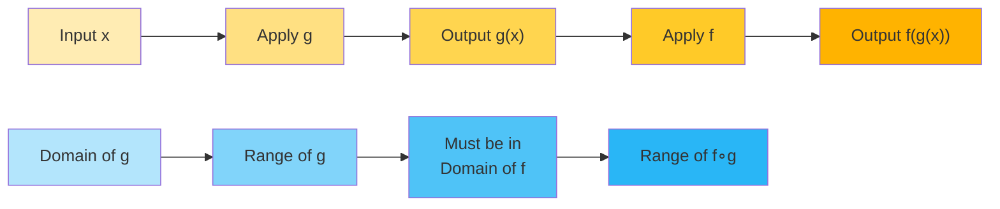
```mermaid
flowchart LR
    A["Input x"] --> B["Apply g"]
    B --> C["Output g(x)"]
    C --> D["Apply f"]
    D --> E["Output f(g(x))"]

    F["Domain of g"] --> G["Range of g"]
    G --> H["Must be in<br>Domain of f"]
    H --> I["Range of f∘g"]

    style A fill:#FFECB3
    style B fill:#FFE082
    style C fill:#FFD54F
    style D fill:#FFCA28
    style E fill:#FFB300
    style F fill:#B3E5FC
    style G fill:#81D4FA
    style H fill:#4FC3F7
    style I fill:#29B6F6
```

**Domain Considerations**: The domain of $f \circ g$ consists of all $x$ in the domain of $g$ such that $g(x)$ is in the
domain of $f$. This can be tricky!

Example: Let $f(x) = \sqrt{x}$ and $g(x) = x^2 - 4$

- $(f \circ g)(x) = f(g(x)) = f(x^2 - 4) = \sqrt{x^2 - 4}$
- Need $x^2 - 4 \geq 0$, so $x \leq -2$ or $x \geq 2$
- Domain of $f \circ g$: $(-\infty, -2] \cup [2, \infty)$

**Composition is Not Commutative**: Generally, $f \circ g \neq g \circ f$

Example: $f(x) = x^2$ and $g(x) = x + 1$

- $(f \circ g)(x) = f(x + 1) = (x + 1)^2 = x^2 + 2x + 1$
- $(g \circ f)(x) = g(x^2) = x^2 + 1$

These are different functions! The order of composition matters.

**Decomposing Complex Functions**: Often we need to recognize how a complex function can be decomposed into simpler
components.

Example: $h(x) = \sin^2(3x + 1)$ Can be written as $h = f \circ g \circ k$ where:

- $k(x) = 3x + 1$
- $g(x) = \sin(x)$
- $f(x) = x^2$

This decomposition is crucial for applying the chain rule in calculus.

**Properties of Composition**:

1. **Associativity**: $(f \circ g) \circ h = f \circ (g \circ h)$
2. **Identity function**: $f \circ I = I \circ f = f$ where $I(x) = x$
3. **Preserves continuity**: If $g$ is continuous at $a$ and $f$ is continuous at $g(a)$, then $f \circ g$ is continuous
   at $a$

**Applications**:

- Computer Science: Function composition is fundamental to functional programming
- Physics: Coordinate transformations often involve composition
- Economics: Multi-stage production processes
- Machine Learning: Neural networks are compositions of simple functions

**Iteration**: Composing a function with itself yields iteration:

- $f^2(x) = (f \circ f)(x) = f(f(x))$
- $f^3(x) = (f \circ f \circ f)(x) = f(f(f(x)))$
- Generally, $f^n(x) = f(f^{n-1}(x))$

Iteration leads to dynamical systems and chaos theory. Even simple functions like $f(x) = rx(1-x)$ can produce complex
behavior under iteration.

##### Inverse Functions: Undoing and Reversing

An inverse function "undoes" the action of the original function. If $f$ takes $x$ to $y$, then $f^{-1}$ takes $y$ back
to $x$. This relationship provides powerful problem-solving tools and deep theoretical insights.

**Definition and Existence**: A function $f$ has an inverse $f^{-1}$ if and only if $f$ is one-to-one (injective):

- For every $y$ in the range of $f$, there exists exactly one $x$ in the domain such that $f(x) = y$
- Graphically: $f$ passes the horizontal line test

**Key Properties**:

1. $(f^{-1} \circ f)(x) = x$ for all $x$ in domain of $f$
2. $(f \circ f^{-1})(y) = y$ for all $y$ in range of $f$
3. Domain of $f^{-1}$ = Range of $f$
4. Range of $f^{-1}$ = Domain of $f$

**Finding Inverse Functions**: The algebraic process:

1. Write $y = f(x)$
2. Interchange $x$ and $y$: $x = f(y)$
3. Solve for $y$ in terms of $x$
4. Write $f^{-1}(x) = y$

Example: Find the inverse of $f(x) = \frac{2x + 3}{x - 1}$

1. $y = \frac{2x + 3}{x - 1}$
2. $x = \frac{2y + 3}{y - 1}$
3. $x(y - 1) = 2y + 3$ $xy - x = 2y + 3$ $xy - 2y = x + 3$ $y(x - 2) = x + 3$ $y = \frac{x + 3}{x - 2}$
4. $f^{-1}(x) = \frac{x + 3}{x - 2}$

**Graphical Relationship**: The graph of $f^{-1}$ is the reflection of the graph of $f$ across the line $y = x$. This
geometric insight often helps visualize inverse functions.

**Restricting Domains**: Functions that aren't one-to-one can have inverses on restricted domains.

Example: $f(x) = x^2$ is not one-to-one on $\mathbb{R}$, but:

- On $[0, \infty)$: $f^{-1}(x) = \sqrt{x}$
- On $(-\infty, 0]$: $f^{-1}(x) = -\sqrt{x}$

This principle enables inverse trigonometric functions:

- $\sin^{-1}(x)$ exists by restricting sine to $[-\pi/2, \pi/2]$
- $\cos^{-1}(x)$ exists by restricting cosine to $[0, \pi]$
- $\tan^{-1}(x)$ exists by restricting tangent to $(-\pi/2, \pi/2)$

**Important Inverse Pairs**:

1. Exponential and Logarithm: $e^x$ and $\ln(x)$
2. Power functions: $x^n$ and $x^{1/n}$ (with appropriate domains)
3. Trigonometric and inverse trigonometric functions

**Applications**:

- Solving equations: If $f(x) = b$, then $x = f^{-1}(b)$
- Cryptography: Encryption and decryption functions are inverses
- Coordinate transformations: Converting between coordinate systems
- Economics: Demand and supply functions are often inverses

The concept of inverse functions extends beyond algebra to abstract mathematics, where inverse elements exist in groups
and inverse morphisms in category theory.

##### Piecewise Functions: Different Rules for Different Regions

Piecewise functions apply different formulas over different parts of their domain, allowing us to model phenomena with
distinct behaviors in different regimes. These functions capture the reality that many systems follow different rules
under different conditions.

**Definition and Notation**: A piecewise function is defined by:
$$f(x) = \begin{cases} f_1(x), & \text{if } x \in D_1 \\ f_2(x), & \text{if } x \in D_2 \ \vdots & \\ f_n(x), & \text{if } x \in D_n \end{cases}$$

where $D_1, D_2, \ldots, D_n$ are disjoint subsets whose union is the domain of $f$.

**Classic Examples**:

1. **Absolute Value**: $$|x| = \begin{cases} x, & \text{if } x \geq 0 \ -x, & \text{if } x < 0 \end{cases}$$
2. **Greatest Integer Function** (Floor Function):
   $$\lfloor x \rfloor = \text{greatest integer } n \text{ such that } n \leq x$$
3. **Sign Function**:
   $$\text{sgn}(x) = \begin{cases} 1, & \text{if } x > 0 \ 0, & \text{if } x = 0 \ -1, & \text{if } x < 0 \end{cases}$$

**Continuity Considerations**: Piecewise functions often have discontinuities at the boundaries between pieces. To check
continuity at a boundary point $c$:

1. Evaluate the left-hand limit: $\lim_{x \to c^-} f(x)$
2. Evaluate the right-hand limit: $\lim_{x \to c^+} f(x)$
3. Check if both equal $f(c)$

Example: Is the following function continuous?
$$f(x) = \begin{cases} x^2, & \text{if } x < 1 \ 2x - 1, & \text{if } x \geq 1 \end{cases}$$

At $x = 1$:

- Left limit: $\lim_{x \to 1^-} x^2 = 1$
- Right limit: $\lim_{x \to 1^+} (2x - 1) = 1$
- Function value: $f(1) = 2(1) - 1 = 1$

Since all three equal 1, the function is continuous at $x = 1$.

**Real-World Applications**:

1. **Tax Brackets**: Tax as a function of income
   $$T(x) = \begin{cases} 0.10x, & \text{if } 0 \leq x \leq 10,000 \ 1,000 + 0.12(x - 10,000), & \text{if } 10,000 < x \leq 40,000 \ 4,600 + 0.22(x - 40,000), & \text{if } 40,000 < x \leq 85,000 \ \vdots \end{cases}$$
2. **Shipping Costs**: Cost based on weight
   $$C(w) = \begin{cases} 5.00, & \text{if } 0 < w \leq 1 \ 5.00 + 2.50(w - 1), & \text{if } 1 < w \leq 5 \ 15.00 + 1.50(w - 5), & \text{if } w > 5 \end{cases}$$
3. **Physics - Friction**: Static vs. kinetic friction
   $$F(v) = \begin{cases} \mu_s N, & \text{if } v = 0 \ \mu_k N, & \text{if } v > 0 \end{cases}$$

**Graphing Piecewise Functions**:

1. Graph each piece on its domain
2. Use open circles for excluded endpoints
3. Use closed circles for included endpoints
4. Check for jumps at boundaries

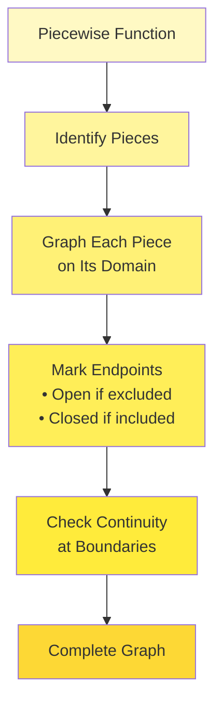
```mermaid
flowchart TD
    A["Piecewise Function"] --> B["Identify Pieces"]
    B --> C["Graph Each Piece<br>on Its Domain"]
    C --> D["Mark Endpoints<br>• Open if excluded<br>• Closed if included"]
    D --> E["Check Continuity<br>at Boundaries"]
    E --> F["Complete Graph"]

    style A fill:#FFF9C4
    style B fill:#FFF59D
    style C fill:#FFF176
    style D fill:#FFEE58
    style E fill:#FFEB3B
    style F fill:#FDD835
```

**Advanced Concepts**:

1. **Spline Functions**: Piecewise polynomials with smoothness conditions at boundaries
    - Used in computer graphics and numerical analysis
    - Ensure continuous derivatives at junction points
2. **Wavelet Functions**: Piecewise functions used in signal processing
    - Localized in both time and frequency domains
3. **Finite Element Methods**: Approximate solutions using piecewise functions
    - Engineering applications for stress analysis, heat transfer

Piecewise functions bridge the gap between simple mathematical models and complex real-world behavior. They acknowledge
that different conditions often require different mathematical descriptions.

##### Recursive and Implicitly Defined Functions

Not all functions can be expressed as explicit formulas. Recursive definitions and implicit equations provide
alternative ways to define functions, often capturing relationships that would be difficult or impossible to express
explicitly.

**Recursive Functions**: Define a function in terms of itself, with base cases to prevent infinite regress.

Classic example - Factorial:
$$n! = \begin{cases} 1, & \text{if } n = 0 \ n \cdot (n-1)!, & \text{if } n > 0 \end{cases}$$

Fibonacci sequence:
$$F(n) = \begin{cases} 0, & \text{if } n = 0 \ 1, & \text{if } n = 1 \ F(n-1) + F(n-2), & \text{if } n \geq 2 \end{cases}$$

**Properties of Recursive Functions**:

- Must have base case(s) to terminate recursion
- Often easier to define than to find closed-form expressions
- Natural for self-similar structures (fractals, trees)
- Computational complexity can be high without optimization

**Implicit Functions**: Defined by equations rather than explicit formulas.

Example: The circle $x^2 + y^2 = 1$ implicitly defines two functions:

- $y = \sqrt{1 - x^2}$ (upper semicircle)
- $y = -\sqrt{1 - x^2}$ (lower semicircle)

More complex example: $x^3 + y^3 = 3xy$ (Folium of Descartes)

- Cannot be solved explicitly for $y$ in terms of $x$
- Still defines $y$ as a function of $x$ in certain regions

**The Implicit Function Theorem**: Provides conditions under which an implicit equation defines a function: If
$F(x, y) = 0$ and $\frac{\partial F}{\partial y} \neq 0$ at a point, then near that point, the equation implicitly
defines $y$ as a function of $x$.

**Applications**:

1. **Dynamical Systems**: Next state depends on current state $$x_{n+1} = f(x_n)$$ Example: Logistic map
   $x_{n+1} = rx_n(1 - x_n)$
2. **Economics**: Equilibrium conditions often define implicit relationships
    - Supply equals demand: $S(p) = D(p)$ implicitly defines equilibrium price
3. **Fractals**: Self-similar structures defined recursively
    - Koch snowflake, Sierpinski triangle, Mandelbrot set
4. **Differential Equations**: Define functions through their derivatives $$\frac{dy}{dx} = f(x, y)$$

**Advantages and Challenges**:

Advantages:

- Can express complex relationships concisely
- Natural for self-referential or equilibrium conditions
- Often arise naturally from physical laws

Challenges:

- May be difficult to evaluate
- Uniqueness and existence questions
- Computational complexity

**Connection to Fixed Points**: Many recursive and implicit definitions involve finding fixed points—values where
$f(x) = x$. The Banach Fixed Point Theorem provides conditions for existence and uniqueness of fixed points, with
applications in:

- Solving equations numerically
- Proving existence of solutions to differential equations
- Economic equilibrium analysis

These alternative ways of defining functions expand our mathematical toolkit, allowing us to capture relationships that
would be awkward or impossible to express with explicit formulas. They remind us that the concept of function is broader
than algebraic expressions—it encompasses any well-defined correspondence between sets.

#### The Tangent and Velocity Problems

The quest to understand motion and curves led to one of mathematics' greatest achievements: calculus. Two seemingly
different problems—finding the tangent to a curve and determining instantaneous velocity—turn out to be manifestations
of the same fundamental concept. This unity reveals the deep connections between geometry and physics that calculus
illuminates.

##### Historical Paradoxes: Zeno, Motion, and Infinity

Before we can appreciate the calculus solution, we must understand the paradoxes that puzzled thinkers for over two
millennia. Around 450 BCE, the Greek philosopher Zeno of Elea proposed several paradoxes that seemed to prove motion was
impossible.

**Zeno's Arrow Paradox**: Consider an arrow in flight. At any instant, the arrow occupies a specific position in space.
At that instant, it is not moving—it's simply there. But time consists of instants. If the arrow is motionless at every
instant, when does it move?

**Zeno's Dichotomy**: Before an object can travel a distance, it must travel half that distance. Before it can travel
half, it must travel a quarter. This process continues indefinitely, requiring an infinite number of steps to move any
distance. How can infinite steps be completed in finite time?

These paradoxes strike at the heart of understanding motion:

- How can we speak of velocity at an instant when velocity requires comparing positions at different times?
- How do we reconcile the discrete (instants) with the continuous (motion)?
- What does it mean for something to be "infinitely small" but not zero?

Ancient mathematicians lacked the tools to resolve these paradoxes rigorously. Aristotle distinguished between
"potential" and "actual" infinity, arguing that while we can indefinitely subdivide a line, we never actually create
infinite divisions. This philosophical approach, while insightful, didn't provide the mathematical precision needed.

**Medieval Contributions**: Scholars in the 14th century made progress:

- Nicole Oresme graphed velocity against time, visualizing motion geometrically
- The Oxford Calculators developed the mean speed theorem: distance traveled at uniformly accelerated motion equals
  distance at constant speed equal to the average velocity

Yet they still lacked a unified mathematical framework for instantaneous change.

**The Breakthrough Insight**: The resolution came with the realization that we need not consider motion at a single
instant, but rather the limit of average velocities over smaller and smaller time intervals. This limit process—the
foundation of calculus—finally provided the mathematical tools to handle the infinite and infinitesimal rigorously.

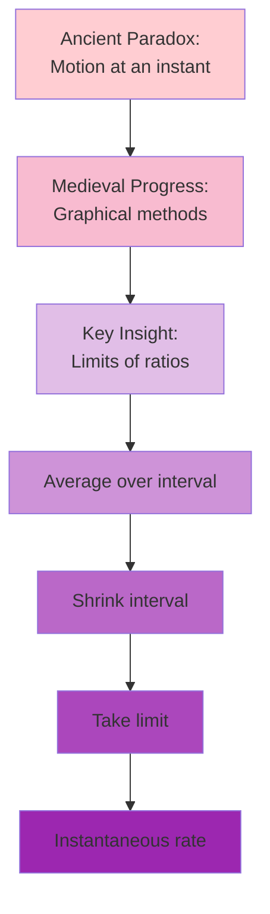
```mermaid
flowchart TD
    A["Ancient Paradox:<br>Motion at an instant"] --> B["Medieval Progress:<br>Graphical methods"]
    B --> C["Key Insight:<br>Limits of ratios"]
    C --> D["Average over interval"]
    D --> E["Shrink interval"]
    E --> F["Take limit"]
    F --> G["Instantaneous rate"]

    style A fill:#FFCDD2
    style B fill:#F8BBD0
    style C fill:#E1BEE7
    style D fill:#CE93D8
    style E fill:#BA68C8
    style F fill:#AB47BC
    style G fill:#9C27B0
```

##### The Geometric Challenge: What Is a Tangent to a Curve?

For circles, the ancient Greeks knew a tangent was a line touching the circle at exactly one point. But what about more
general curves? The definition "a line that touches but doesn't cross" fails for curves like $y = x^3$ at the origin,
where the tangent crosses the curve.

**The Fundamental Problem**: Given a curve and a point on it, how do we find the tangent line? This question challenged
mathematicians because:

- Unlike circles, general curves don't have obvious geometric properties defining tangents
- The tangent seems to require information about the curve's direction at a single point
- Traditional geometry dealt with static figures, not rates of change

**Early Approaches**:

1. **Fermat's Method** (1630s): To find the tangent to $y = f(x)$ at $x = a$:
    - Consider a nearby point at $x = a + e$
    - The tangent approximately passes through both points
    - Set up equations and let $e$ approach 0
    - Extract the tangent's slope from the limiting process
2. **Descartes' Method**: Used algebraic techniques specific to each curve type
    - For algebraic curves, sought double roots
    - Ingenious but not general
3. **Barrow's Geometric Method**: Isaac Barrow (Newton's teacher) developed geometric constructions for tangents
    - Related the tangent problem to area problems
    - Glimpsed the fundamental theorem of calculus

**The Modern Definition**: The tangent line at point $P$ is the limiting position of secant lines through $P$ and nearby
points $Q$ as $Q$ approaches $P$.

This definition elegantly resolves all difficulties:

- Works for any smooth curve
- Captures the intuitive notion of the curve's direction
- Provides a computational method
- Connects geometry to limits

For a curve $y = f(x)$ and point $(a, f(a))$:

1. Take another point $(a + h, f(a + h))$
2. The secant line has slope $\frac{f(a + h) - f(a)}{h}$
3. As $h \to 0$, this approaches the tangent's slope
4. The tangent line: $y - f(a) = f'(a)(x - a)$

This geometric problem drove the development of differential calculus, showing how practical questions lead to profound
mathematical insights.

##### From Average to Instantaneous: The Fundamental Insight

The transition from average to instantaneous rates represents one of the most profound conceptual leaps in mathematics.
This insight unified numerous problems across mathematics and physics.

**Average Rate of Change**: For any function $f$ over interval $[a, b]$:
$$\text{Average rate} = \frac{f(b) - f(a)}{b - a}$$

This ratio measures the overall change relative to the interval length. Geometrically, it's the slope of the secant line
through $(a, f(a))$ and $(b, f(b))$.

**The Limiting Process**: To find instantaneous rate at $x = a$:

1. Consider average rate over $[a, a + h]$: $\frac{f(a + h) - f(a)}{h}$
2. Let $h$ approach 0
3. If the limit exists: $\lim_{h \to 0} \frac{f(a + h) - f(a)}{h} = f'(a)$

This limit captures the rate of change at the precise moment $x = a$.

**Why This Works**: Consider position function $s(t)$:

- Average velocity over $[t, t + h]$: $v_{avg} = \frac{s(t + h) - s(t)}{h}$
- As $h$ decreases, we get better approximations to velocity at time $t$
- The limit gives exact instantaneous velocity

**Numerical Illustration**: For $s(t) = t^2$ at $t = 3$:

| $h$   | $\frac{s(3 + h) - s(3)}{h}$ | $\frac{(3 + h)^2 - 9}{h}$      |
| ----- | --------------------------- | ------------------------------ |
| 1.0   | 7.0                         | $(16 - 9)/1 = 7$               |
| 0.1   | 6.1                         | $(9.61 - 9)/0.1 = 6.1$         |
| 0.01  | 6.01                        | $(9.0601 - 9)/0.01 = 6.01$     |
| 0.001 | 6.001                       | $(9.006001 - 9)/0.001 = 6.001$ |

The pattern suggests instantaneous velocity at $t = 3$ is 6 units per time.

**The Fundamental Insight**: Instantaneous rates are limits of average rates. This principle:

- Resolves Zeno's paradoxes by avoiding the need to consider motion "at an instant"
- Provides a computational method for finding rates
- Unifies geometric (tangent) and physical (velocity) problems
- Forms the foundation of differential calculus

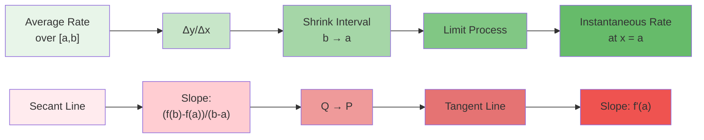
```mermaid
flowchart LR
    A["Average Rate<br>over [a,b]"] --> B["Δy/Δx"]
    B --> C["Shrink Interval<br>b → a"]
    C --> D["Limit Process"]
    D --> E["Instantaneous Rate<br>at x = a"]

    F["Secant Line"] --> G["Slope:<br>(f(b)-f(a))/(b-a)"]
    G --> H["Q → P"]
    H --> I["Tangent Line"]
    I --> J["Slope: f'(a)"]

    style A fill:#E8F5E9
    style B fill:#C8E6C9
    style C fill:#A5D6A7
    style D fill:#81C784
    style E fill:#66BB6A
    style F fill:#FFEBEE
    style G fill:#FFCDD2
    style H fill:#EF9A9A
    style I fill:#E57373
    style J fill:#EF5350
```

##### Secant Lines Approaching Tangent Lines: A Visual Journey

The visual transition from secant to tangent lines provides geometric intuition for the limit process. This journey from
discrete approximations to continuous reality mirrors the historical development of calculus.

**The Secant Line**: Given points $P(a, f(a))$ and $Q(a + h, f(a + h))$ on curve $y = f(x)$:

- Secant line passes through both points
- Slope: $m_{sec} = \frac{f(a + h) - f(a)}{h}$
- Equation: $y - f(a) = m_{sec}(x - a)$

**The Approach to Tangency**: As $h \to 0$:

1. Point $Q$ slides along the curve toward $P$
2. The secant line rotates around $P$
3. The slope $m_{sec}$ approaches a limiting value
4. The limiting position is the tangent line

**Visual Demonstration**: Consider $f(x) = x^2$ at $x = 1$:

For $h = 1$: Secant through $(1, 1)$ and $(2, 4)$ has slope 3 For $h = 0.5$: Secant through $(1, 1)$ and $(1.5, 2.25)$
has slope 2.5 For $h = 0.1$: Secant through $(1, 1)$ and $(1.1, 1.21)$ has slope 2.1 For $h = 0.01$: Secant through
$(1, 1)$ and $(1.01, 1.0201)$ has slope 2.01

The limiting slope is 2, giving tangent line $y - 1 = 2(x - 1)$ or $y = 2x - 1$.

**Interactive Visualization** (conceptual):

As $h$ decreases:

- $h = 1.0$: Secant far from tangent
- $h = 0.5$: Secant closer
- $h = 0.1$: Secant very close
- $h = 0.01$: Secant nearly indistinguishable from tangent
- $h \to 0$: Secant becomes tangent

**Why Limits Are Necessary**: We cannot simply set $h = 0$ because:

- This would give $\frac{0}{0}$, which is undefined
- We need two distinct points to determine a line
- The tangent is inherently a limiting concept

**Geometric Properties**:

1. **Local Linearity**: Near the point of tangency, the curve is approximately linear
2. **Best Linear Approximation**: The tangent line is the best linear approximation to the curve at that point
3. **Instantaneous Direction**: The tangent shows the curve's instantaneous direction

**Applications of the Tangent Line**:

- **Optimization**: At maxima and minima, tangent lines are horizontal
- **Linear Approximation**: $f(x) \approx f(a) + f'(a)(x - a)$ near $x = a$
- **Newton's Method**: Uses tangent lines to find roots iteratively

The visual journey from secant to tangent makes the abstract limit process concrete, showing how calculus bridges the
discrete and continuous.

##### Velocity as a Tangent Problem: Unifying Geometry and Physics

The profound connection between tangent lines and velocity reveals the unity underlying calculus. What seems like a
geometric property (slope of tangent) and a physical concept (instantaneous velocity) are mathematically identical.

**Position-Time Graphs**: When we plot position $s$ versus time $t$:

- The curve represents the object's motion
- Average velocity = slope of secant line
- Instantaneous velocity = slope of tangent line

This correspondence transforms physics problems into geometry problems.

**The Unification**: For position function $s(t)$:

- Instantaneous velocity: $v(t) = \lim_{h \to 0} \frac{s(t + h) - s(t)}{h}$
- Slope of tangent to graph: $m = \lim_{h \to 0} \frac{s(t + h) - s(t)}{h}$

These are identical! The velocity at time $t$ equals the slope of the tangent line to the position-time graph at point
$(t, s(t))$.

**Example - Free Fall**: For an object dropped from rest:

- Position: $s(t) = \frac{1}{2}gt^2$ (where $g \approx 9.8$ m/s²)
- Velocity: $v(t) = \lim_{h \to 0} \frac{\frac{1}{2}g(t + h)^2 - \frac{1}{2}gt^2}{h}$

Expanding:
$\frac{\frac{1}{2}g(t^2 + 2th + h^2) - \frac{1}{2}gt^2}{h} = \frac{\frac{1}{2}g(2th + h^2)}{h} = gt + \frac{1}{2}gh$

As $h \to 0$: $v(t) = gt$

The tangent line to the parabola $s = \frac{1}{2}gt^2$ at time $t$ has slope $gt$—exactly the physics formula for
velocity!

**Deeper Connections**:

1. **Acceleration**: The rate of change of velocity
    - Second derivative of position
    - Related to curve's concavity
2. **Integration**: Inverse of differentiation
    - Area under velocity curve = change in position
    - Fundamental theorem connects derivatives and integrals
3. **Vector Calculus**: Extends to motion in multiple dimensions
    - Tangent vectors to curves in space
    - Velocity vectors in physics

**Historical Impact**: This unification:

- Enabled precise mathematical treatment of motion
- Led to Newton's laws of motion
- Provided tools for celestial mechanics
- Sparked the scientific revolution

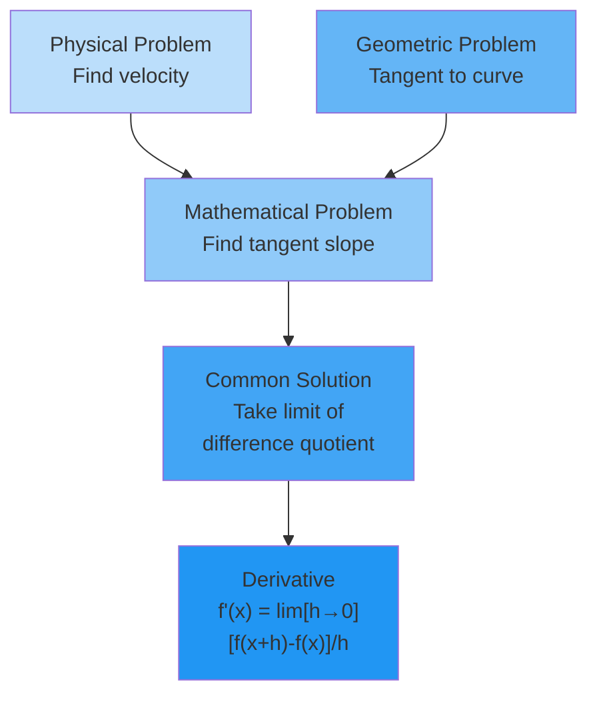
```mermaid
flowchart TD
    A["Physical Problem<br>Find velocity"] --> B["Mathematical Problem<br>Find tangent slope"]
    C["Geometric Problem<br>Tangent to curve"] --> B
    B --> D["Common Solution<br>Take limit of<br>difference quotient"]
    D --> E["Derivative<br>f'(x) = lim[h→0]<br>[f(x+h)-f(x)]/h"]

    style A fill:#BBDEFB
    style B fill:#90CAF9
    style C fill:#64B5F6
    style D fill:#42A5F5
    style E fill:#2196F3
```

The tangent-velocity connection exemplifies how mathematics reveals deep unities in nature. Seemingly disparate problems
share underlying mathematical structures, and recognizing these connections advances both mathematics and science.

##### The Birth of the Derivative Concept

The derivative emerged from the confluence of geometric and physical problems, crystallizing centuries of mathematical
thought into a single, powerful concept. This birth represents one of mathematics' greatest achievements.

**The Derivative Defined**: For a function $f$, the derivative at point $a$ is:
$$f'(a) = \lim_{h \to 0} \frac{f(a + h) - f(a)}{h}$$

when this limit exists.

**Multiple Interpretations**: The derivative simultaneously represents:

1. **Geometric**: Slope of the tangent line
2. **Physical**: Instantaneous rate of change
3. **Analytical**: Best linear approximation
4. **Algebraic**: Result of a limiting process

This multiplicity of meanings gives the derivative its power and wide applicability.

**Notation Systems**: Different notations emphasize different aspects:

- $f'(x)$ (Lagrange): Emphasizes derivative as a function
- $\frac{dy}{dx}$ (Leibniz): Suggests ratio of infinitesimals
- $\dot{y}$ (Newton): Common in physics for time derivatives
- $D_x f$ (Euler): Operator notation

**Existence and Differentiability**: Not all functions have derivatives everywhere:

- Corners: $f(x) = |x|$ has no derivative at $x = 0$
- Cusps: $f(x) = x^{2/3}$ has vertical tangent at $x = 0$
- Discontinuities: Jumps prevent derivatives

A function is differentiable at $a$ if $f'(a)$ exists. Differentiability implies continuity, but not conversely.

**Computing Derivatives**: Basic derivatives form building blocks:

- Constants: $(c)' = 0$
- Powers: $(x^n)' = nx^{n-1}$
- Exponentials: $(e^x)' = e^x$
- Trigonometric: $(\sin x)' = \cos x$, $(\cos x)' = -\sin x$

**Rules of Differentiation**: These allow computing complex derivatives:

1. **Linearity**: $(af + bg)' = af' + bg'$
2. **Product Rule**: $(fg)' = f'g + fg'$
3. **Quotient Rule**: $(f/g)' = \frac{f'g - fg'}{g^2}$
4. **Chain Rule**: $(f \circ g)' = (f' \circ g) \cdot g'$

**The Derivative Function**: Since $f'(a)$ can be computed for any $a$ in the domain where the limit exists, we get a
new function $f'$ - the derivative function.

This function tells us the rate of change at every point, providing a complete picture of how the original function
changes.

**Revolutionary Impact**: The derivative concept:

- Solved ancient problems (tangents, velocity)
- Enabled new mathematics (differential equations)
- Provided tools for physics (mechanics, electromagnetism)
- Led to optimization theory
- Opened doors to functional analysis

**Modern Extensions**:

- Partial derivatives for multivariable functions
- Directional derivatives
- Fractional derivatives
- Derivatives in abstract spaces

The birth of the derivative marked the beginning of modern analysis, providing a rigorous foundation for studying
change. From this single concept flows much of modern mathematics and its applications in science, engineering, and
beyond.

The journey from Zeno's paradoxes to the derivative shows how mathematical concepts evolve: practical problems inspire
new ideas, which are refined through centuries of thought, finally crystallizing into precise definitions that unlock
new realms of understanding.

#### The Limit of a Function

The concept of a limit provides the foundation upon which all of calculus is built. It allows us to discuss what happens
to function values as inputs approach particular values, even when the function might not be defined at those points.
This seemingly simple idea resolves ancient paradoxes and enables the rigorous treatment of instantaneous change.

##### Why Limits? Resolving the Paradoxes of Calculus

Before calculus, mathematicians faced seemingly insurmountable contradictions when trying to understand instantaneous
change and continuous motion. The limit concept emerged as the key to resolving these paradoxes.

**The Fundamental Problem**: Consider these challenging questions:

- What is the velocity of an object at a specific instant?
- What is the slope of a curve at a single point?
- What is the area under a curve?
- What happens to $\frac{\sin x}{x}$ when $x = 0$?

Each question involves a process that seems impossible:

- Velocity requires comparing positions at different times, but an instant has no duration
- Slope requires two points, but we have only one
- Area requires summing infinitely many infinitesimally thin rectangles
- Direct substitution in $\frac{\sin x}{x}$ gives $\frac{0}{0}$, which is undefined

**Pre-Calculus Attempts**: Historical approaches included:

1. **Infinitesimals**: Leibniz used "infinitely small" quantities
    - Intuitive but logically problematic
    - What is a number "infinitely close" to zero but not zero?
2. **Fluxions**: Newton's "flowing quantities"
    - Useful for physics but mathematically vague
    - How fast does a quantity "flow"?
3. **Exhaustion**: Ancient Greek method
    - Rigorous but cumbersome
    - Required separate proofs for each problem

**The Limit Solution**: Limits avoid these philosophical difficulties by focusing on the approach rather than arrival:

- We don't need velocity at an instant; we need the limit of average velocities
- We don't need the slope through one point; we need the limit of secant slopes
- We don't need to add infinite rectangles; we need the limit of finite sums
- We don't evaluate $\frac{\sin x}{x}$ at $x = 0$; we find the limit as $x \to 0$

**Example - Resolving $\frac{0}{0}$**: Consider $\lim_{x \to 2} \frac{x^2 - 4}{x - 2}$

Direct substitution gives $\frac{0}{0}$, but factoring:
$$\frac{x^2 - 4}{x - 2} = \frac{(x-2)(x+2)}{x-2} = x + 2 \text{ for } x \neq 2$$

So $\lim_{x \to 2} \frac{x^2 - 4}{x - 2} = \lim_{x \to 2} (x + 2) = 4$

The limit exists even though the function is undefined at $x = 2$!

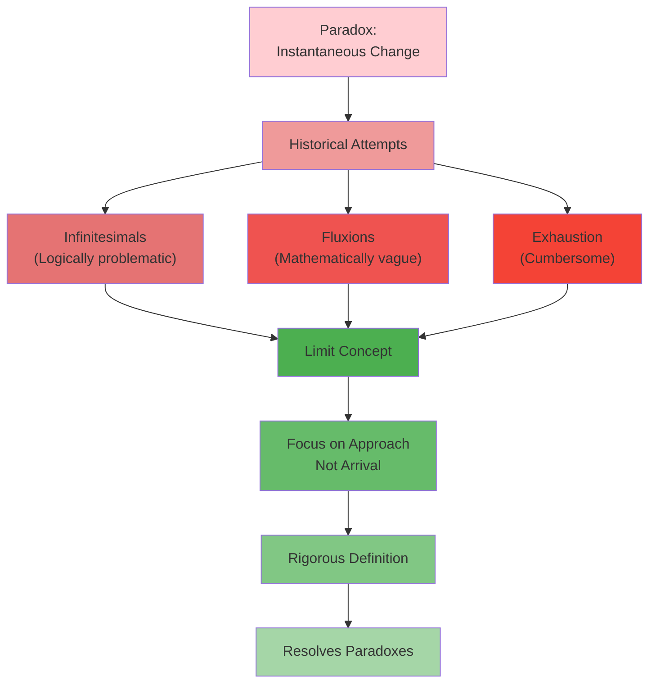
```mermaid
flowchart TD
    A["Paradox:<br>Instantaneous Change"] --> B["Historical Attempts"]
    B --> C["Infinitesimals<br>(Logically problematic)"]
    B --> D["Fluxions<br>(Mathematically vague)"]
    B --> E["Exhaustion<br>(Cumbersome)"]

    F["Limit Concept"] --> G["Focus on Approach<br>Not Arrival"]
    G --> H["Rigorous Definition"]
    H --> I["Resolves Paradoxes"]

    C --> F
    D --> F
    E --> F

    style A fill:#FFCDD2
    style B fill:#EF9A9A
    style C fill:#E57373
    style D fill:#EF5350
    style E fill:#F44336
    style F fill:#4CAF50
    style G fill:#66BB6A
    style H fill:#81C784
    style I fill:#A5D6A7
```

**The Power of Limits**: Limits provide:

1. **Rigor**: Precise definitions replace vague intuitions
2. **Generality**: One concept handles many different problems
3. **Computability**: Systematic methods for calculation
4. **Foundation**: Base for derivatives, integrals, and series

The limit concept transforms calculus from a collection of clever tricks into a coherent mathematical theory.

##### Intuitive Understanding: Approaching Without Reaching

Before diving into formal definitions, let's build intuition about what limits really mean. The key insight: limits
describe the behavior of functions near a point, not necessarily at the point.

**The Basic Idea**: The statement $\lim_{x \to a} f(x) = L$ means: "As $x$ gets arbitrarily close to $a$ (but not equal
to $a$), $f(x)$ gets arbitrarily close to $L$"

**Key Aspects**:

1. **Approaching**: We consider values of $x$ near $a$, not $x = a$ itself
2. **Arbitrarily Close**: For any desired closeness to $L$, we can get $f(x)$ that close
3. **From Both Sides**: We consider $x$ approaching from both left and right 4. **Independence from $f(a) $**: The value
   $f(a) $ might not exist or might differ from $L $

**Visual Intuition**: Imagine walking along the graph of $f(x)$ from both directions toward $x = a$:

- From the left: Follow the curve as $x$ increases toward $a$
- From the right: Follow the curve as $x$ decreases toward $a$
- If both paths lead to the same height $L$, then $\lim_{x \to a} f(x) = L$

**Examples Building Intuition**:

1. **Simple Limit**: $\lim_{x \to 3} (2x + 1) = 7$
    - As $x$ approaches 3, $2x + 1$ approaches $2(3) + 1 = 7$
    - We can verify: when $x = 2.9$, $f(x) = 6.8$; when $x = 3.1$, $f(x) = 7.2$
2. **Limit Differs from Function Value**: Define
   $$f(x) = \begin{cases} x + 1 & \text{if } x \neq 2 \ 5 & \text{if } x = 2 \end{cases}$$ Then
   $\lim_{x \to 2} f(x) = 3$ even though $f(2) = 5$
3. **Limit Where Function Undefined**: $\lim_{x \to 0} \frac{\sin x}{x} = 1$
    - The function is undefined at $x = 0$
    - But as $x$ approaches 0, the ratio approaches 1

**The "Challenge-Response" Game**: Think of limits as a game:

- Challenger: "I want $f(x)$ within 0.01 of $L$"
- Responder: "Stay within 0.005 of $a$"
- If the responder can always meet any challenge, the limit exists

This game captures the essence of the formal $\epsilon$-$\delta$ definition.

**Common Misconceptions**:

1. "The limit is the value at the point" - No, it's the value approached
2. "Limits always equal the function value" - Not necessarily
3. "We reach the limit" - We approach but never need to reach
4. "Limits are approximations" - Limits are exact values

**Graphical Indicators**: On a graph, look for:

- Continuous approach to a value
- No sudden jumps near the point
- Same height approached from both sides

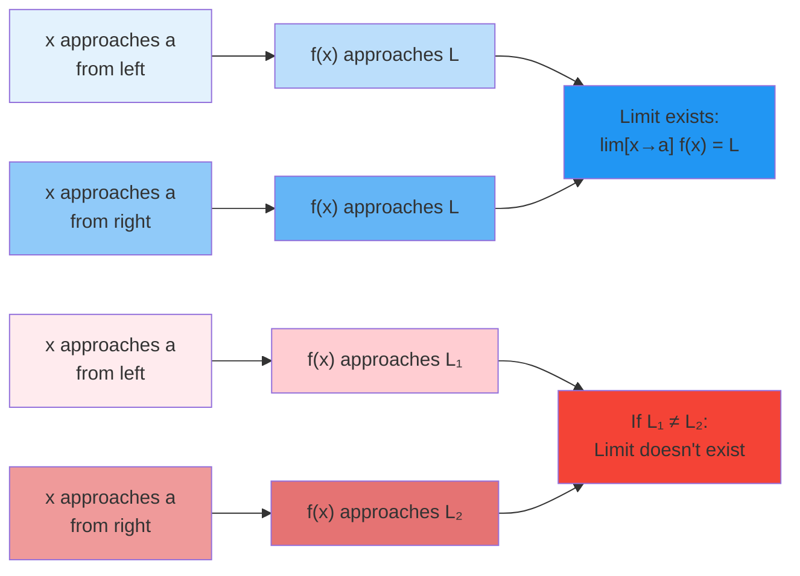
```mermaid
flowchart LR
    A["x approaches a<br>from left"] --> B["f(x) approaches L"]
    C["x approaches a<br>from right"] --> D["f(x) approaches L"]
    B --> E["Limit exists:<br>lim[x→a] f(x) = L"]
    D --> E

    F["x approaches a<br>from left"] --> G["f(x) approaches L₁"]
    H["x approaches a<br>from right"] --> I["f(x) approaches L₂"]
    G --> J["If L₁ ≠ L₂:<br>Limit doesn't exist"]
    I --> J

    style A fill:#E3F2FD
    style B fill:#BBDEFB
    style C fill:#90CAF9
    style D fill:#64B5F6
    style E fill:#2196F3
    style F fill:#FFEBEE
    style G fill:#FFCDD2
    style H fill:#EF9A9A
    style I fill:#E57373
    style J fill:#F44336
```

##### One-Sided Limits: Direction Matters

Sometimes functions behave differently when approached from different directions. One-sided limits capture this
directional behavior, providing a more nuanced understanding of function behavior near discontinuities.

**Left-Hand Limit**: $\lim_{x \to a^-} f(x) = L$ means:

- Consider only $x < a$ approaching $a$
- As $x$ increases toward $a$, $f(x)$ approaches $L$
- Notation: $a^-$ indicates approach from the left

**Right-Hand Limit**: $\lim_{x \to a^+} f(x) = L$ means:

- Consider only $x > a$ approaching $a$
- As $x$ decreases toward $a$, $f(x)$ approaches $L$
- Notation: $a^+$ indicates approach from the right

**Relationship to Two-Sided Limits**:
$$\lim_{x \to a} f(x) = L \text{ if and only if } \lim_{x \to a^-} f(x) = \lim_{x \to a^+} f(x) = L$$

The two-sided limit exists only when both one-sided limits exist and are equal.

**Examples Illustrating One-Sided Limits**:

1. **Step Function**: $$f(x) = \begin{cases} 1 & \text{if } x < 0 \ 2 & \text{if } x \geq 0 \end{cases}$$
    - $\lim_{x \to 0^-} f(x) = 1$ (approaching from negative values)
    - $\lim_{x \to 0^+} f(x) = 2$ (approaching from positive values)
    - $\lim_{x \to 0} f(x)$ does not exist (one-sided limits differ)
2. **Absolute Value Function**: $f(x) = |x|$
    - $\lim_{x \to 0^-} |x| = 0$ (as $x \to 0$ from left, $|x| = -x \to 0$)
    - $\lim_{x \to 0^+} |x| = 0$ (as $x \to 0$ from right, $|x| = x \to 0$)
    - $\lim_{x \to 0} |x| = 0$ (one-sided limits agree)
3. **Reciprocal Function**: $f(x) = \frac{1}{x}$
    - $\lim_{x \to 0^-} \frac{1}{x} = -\infty$ (negative values grow in magnitude)
    - $\lim_{x \to 0^+} \frac{1}{x} = +\infty$ (positive values grow)
    - $\lim_{x \to 0} \frac{1}{x}$ does not exist (different infinities)

**Applications of One-Sided Limits**:

1. **Piecewise Functions**: Analyze behavior at transition points
2. **Jump Discontinuities**: Measure the "size" of jumps
3. **Removable Discontinuities**: Identify where functions can be "fixed"
4. **Asymptotic Behavior**: Understand approach to vertical asymptotes

**Computing One-Sided Limits**: Use the same techniques as two-sided limits, but restrict the domain:

- For left-hand limits, only consider $x < a$
- For right-hand limits, only consider $x > a$

Example: Find $\lim_{x \to 2^+} \frac{|x - 2|}{x - 2}$

For $x > 2$: $x - 2 > 0$, so $|x - 2| = x - 2$ Therefore: $\frac{|x - 2|}{x - 2} = \frac{x - 2}{x - 2} = 1$ So:
$\lim_{x \to 2^+} \frac{|x - 2|}{x - 2} = 1$

For comparison: $\lim_{x \to 2^-} \frac{|x - 2|}{x - 2} = -1$

**Practical Importance**: One-sided limits are essential for:

- Defining derivatives at endpoints of intervals
- Understanding function behavior at boundaries
- Analyzing physical systems with different behaviors in different regions
- Fourier series at points of discontinuity

##### Two-Sided Limits and Their Existence

The standard limit concept requires agreement from both directions. Understanding when limits exist—and when they
don't—is crucial for analyzing function behavior.

**Existence Criteria**: $\lim_{x \to a} f(x) = L$ exists if and only if:

1. $\lim_{x \to a^-} f(x)$ exists
2. $\lim_{x \to a^+} f(x)$ exists
3. $\lim_{x \to a^-} f(x) = \lim_{x \to a^+} f(x) = L$

All three conditions must hold for the two-sided limit to exist.

**Ways Limits Can Fail to Exist**:

1. **Jump Discontinuity**: Different one-sided limits Example:
   $f(x) = \begin{cases} x & \text{if } x < 1 \ x + 2 & \text{if } x \geq 1 \end{cases}$
    - Left limit at 1: $\lim_{x \to 1^-} f(x) = 1$
    - Right limit at 1: $\lim_{x \to 1^+} f(x) = 3$
    - Two-sided limit doesn't exist
2. **Infinite Discontinuity**: One or both one-sided limits are infinite Example: $f(x) = \frac{1}{x^2}$ at $x = 0$
    - Both one-sided limits are $+\infty$
    - We say the limit doesn't exist (in the real numbers)
3. **Oscillatory Behavior**: Function oscillates rapidly Example: $f(x) = \sin\left(\frac{1}{x}\right)$ at $x = 0$
    - As $x \to 0$, function oscillates between -1 and 1 infinitely often
    - Neither one-sided limit exists
4. **Essential Discontinuity**: Chaotic behavior Example:
   $f(x) = \begin{cases} 1 & \text{if } x \text{ is rational} \ 0 & \text{if } x \text{ is irrational} \end{cases}$
    - Near any point, function jumps between 0 and 1
    - No limits exist anywhere

**Testing for Existence**: Systematic approach:

1. Check if function is defined near (but not necessarily at) the point
2. Compute left-hand limit
3. Compute right-hand limit
4. Compare the two one-sided limits

**Example - Complete Analysis**: Analyze $\lim_{x \to 2} \frac{x^2 - 4}{|x - 2|}$

For $x < 2$: $|x - 2| = -(x - 2) = 2 - x$
$$\lim_{x \to 2^-} \frac{x^2 - 4}{|x - 2|} = \lim_{x \to 2^-} \frac{(x-2)(x+2)}{2-x} = \lim_{x \to 2^-} \frac{(x-2)(x+2)}{-(x-2)} = \lim_{x \to 2^-} -(x+2) = -4$$

For $x > 2$: $|x - 2| = x - 2$
$$\lim_{x \to 2^+} \frac{x^2 - 4}{|x - 2|} = \lim_{x \to 2^+} \frac{(x-2)(x+2)}{x-2} = \lim_{x \to 2^+} (x+2) = 4$$

Since $-4 \neq 4$, the two-sided limit doesn't exist.

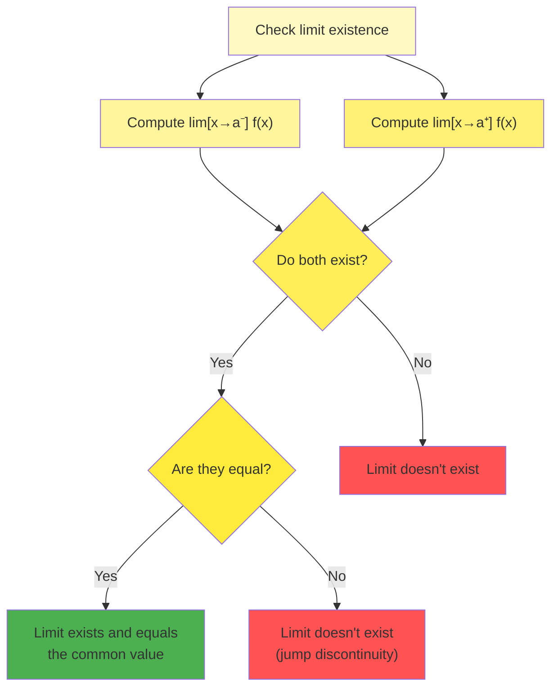
```mermaid
flowchart TD
    A["Check limit existence"] --> B["Compute lim[x→a⁻] f(x)"]
    A --> C["Compute lim[x→a⁺] f(x)"]
    B --> D{Do both exist?}
    C --> D
    D -->|Yes| E{Are they equal?}
    D -->|No| F["Limit doesn't exist"]
    E -->|Yes| G["Limit exists and equals<br>the common value"]
    E -->|No| H["Limit doesn't exist<br>(jump discontinuity)"]

    style A fill:#FFF9C4
    style B fill:#FFF59D
    style C fill:#FFF176
    style D fill:#FFEE58
    style E fill:#FFEB3B
    style F fill:#FF5252
    style G fill:#4CAF50
    style H fill:#FF5252
```

##### Infinite Limits: When Functions Explode

When function values grow without bound as $x$ approaches a value, we use infinite limits to describe this behavior.
Though we say "the limit is infinity," technically the limit doesn't exist in the real number system—infinity is not a
real number but rather a description of unbounded behavior.

**Positive Infinity**: $\lim_{x \to a} f(x) = +\infty$ means:

- As $x$ approaches $a$, $f(x)$ increases without bound
- For any $M > 0$, we can make $f(x) > M$ by taking $x$ close enough to $a$

**Negative Infinity**: $\lim_{x \to a} f(x) = -\infty$ means:

- As $x$ approaches $a$, $f(x)$ decreases without bound
- For any $M < 0$, we can make $f(x) < M$ by taking $x$ close enough to $a$

**Vertical Asymptotes**: When $\lim_{x \to a} f(x) = \pm\infty$, the line $x = a$ is a vertical asymptote. The graph
approaches this vertical line but never touches it.

**Examples of Infinite Limits**:

1. **Simple Rational Function**: $f(x) = \frac{1}{x}$
    - $\lim_{x \to 0^+} \frac{1}{x} = +\infty$ (positive values grow)
    - $\lim_{x \to 0^-} \frac{1}{x} = -\infty$ (negative values decrease)
    - Vertical asymptote at $x = 0$
2. **Even Powers**: $f(x) = \frac{1}{x^2}$
    - $\lim_{x \to 0^+} \frac{1}{x^2} = +\infty$
    - $\lim_{x \to 0^-} \frac{1}{x^2} = +\infty$
    - Both sides approach positive infinity
3. **Logarithmic Function**: $f(x) = \ln(x)$
    - $\lim_{x \to 0^+} \ln(x) = -\infty$
    - Vertical asymptote at $x = 0$
    - Only defined for $x > 0$

**One-Sided Infinite Limits**: Often necessary when behavior differs by direction:
$$\lim_{x \to 2^-} \frac{1}{x-2} = -\infty \quad \text{and} \quad \lim_{x \to 2^+} \frac{1}{x-2} = +\infty$$

**Arithmetic with Infinity**: Informal rules (use with caution):

- $\infty + \infty = \infty$
- $\infty \cdot \infty = \infty$
- $\frac{k}{\infty} = 0$ for finite $k$
- $\frac{\infty}{k} = \infty$ for positive finite $k$

**Indeterminate Forms**: These require careful analysis:

- $\infty - \infty$
- $\frac{\infty}{\infty}$
- $0 \cdot \infty$
- $\infty^0$

**Determining Infinite Limits**: Look for:

1. Denominators approaching zero
2. Sign of expressions near the limit point
3. Behavior of numerator

Example: Find $\lim_{x \to 3} \frac{x^2 - 9}{(x-3)^2}$

Factor: $\frac{x^2 - 9}{(x-3)^2} = \frac{(x-3)(x+3)}{(x-3)^2} = \frac{x+3}{x-3}$

As $x \to 3^+$: numerator $\to 6$, denominator $\to 0^+$, so limit is $+\infty$ As $x \to 3^-$: numerator $\to 6$,
denominator $\to 0^-$, so limit is $-\infty$

**Physical Interpretation**: Infinite limits often represent:

- Singularities in physical systems
- Asymptotic behavior
- Phase transitions
- Resonance phenomena

##### Limits at Infinity: End Behavior of Functions

While infinite limits describe vertical asymptotes, limits at infinity describe horizontal asymptotes and end
behavior—what happens to $f(x)$ as $x$ grows very large (positive or negative).

**Definition**: $\lim_{x \to \infty} f(x) = L$ means:

- As $x$ increases without bound, $f(x)$ approaches $L$
- For any $\epsilon > 0$, there exists $N$ such that if $x > N$, then $|f(x) - L| < \epsilon$

Similarly for $\lim_{x \to -\infty} f(x) = L$ with $x < -N$.

**Horizontal Asymptotes**: If $\lim_{x \to \infty} f(x) = L$ or $\lim_{x \to -\infty} f(x) = L$, then $y = L$ is a
horizontal asymptote.

**Key Examples**:

1. **Exponential Decay**: $\lim_{x \to \infty} e^{-x} = 0$
    - Exponential functions approach 0 rapidly
    - Horizontal asymptote at $y = 0$
2. **Rational Functions**: For $f(x) = \frac{a_nx^n + \ldots + a_0}{b_mx^m + \ldots + b_0}$
    - If $n < m$: $\lim_{x \to \pm\infty} f(x) = 0$
    - If $n = m$: $\lim_{x \to \pm\infty} f(x) = \frac{a_n}{b_m}$
    - If $n > m$: Limit is $\pm\infty$ (no horizontal asymptote)
3. **Arctangent**: $\lim_{x \to \infty} \arctan(x) = \frac{\pi}{2}$ and
   $\lim_{x \to -\infty} \arctan(x) = -\frac{\pi}{2}$
    - Different horizontal asymptotes on each side

**Techniques for Evaluating**:

1. **Divide by Highest Power**: For rational functions Example: $\lim_{x \to \infty} \frac{3x^2 + 5x - 2}{2x^2 - x + 7}$

    Divide numerator and denominator by $x^2$:
    $$\lim_{x \to \infty} \frac{3 + \frac{5}{x} - \frac{2}{x^2}}{2 - \frac{1}{x} + \frac{7}{x^2}} = \frac{3 + 0 - 0}{2 - 0 + 0} = \frac{3}{2}$$

2. **Dominant Terms**: Focus on fastest-growing terms Example: $\lim_{x \to \infty} (e^x + x^{100})$ Since $e^x$ grows
   faster than any polynomial, the limit is $+\infty$

3. **Squeeze Theorem**: Bound the function Example: $\lim_{x \to \infty} \frac{\sin(x)}{x} = 0$ Since
   $-1 \leq \sin(x) \leq 1$, we have $\frac{-1}{x} \leq \frac{\sin(x)}{x} \leq \frac{1}{x}$ As $x \to \infty$, both
   bounds approach 0

**Growth Rates**: Understanding relative growth rates helps evaluate limits:

- Logarithmic < Polynomial < Exponential
- $\ln(x) < x^a < b^x$ for $a > 0, b > 1$

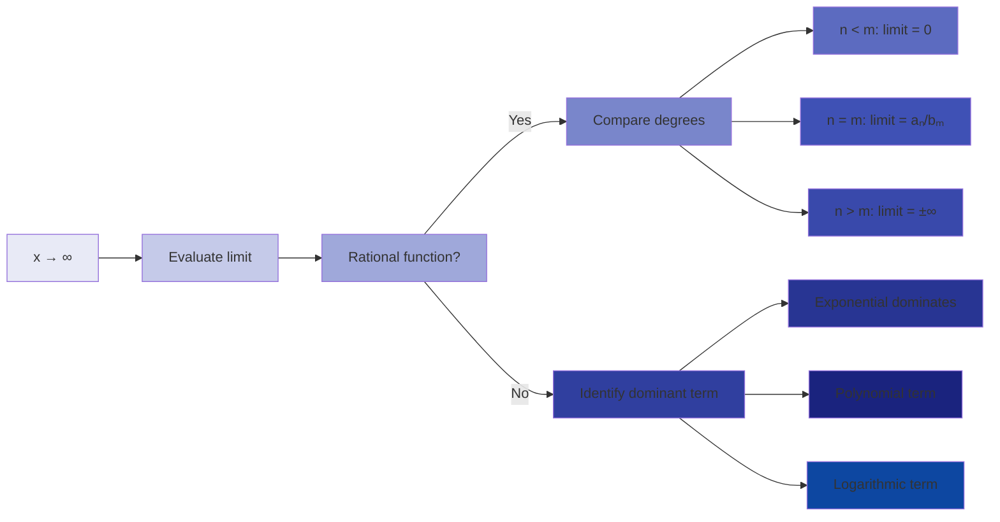
```mermaid
flowchart LR
    A["x → ∞"] --> B["Evaluate limit"]
    B --> C["Rational function?"]
    C -->|Yes| D["Compare degrees"]
    D --> E["n < m: limit = 0"]
    D --> F["n = m: limit = aₙ/bₘ"]
    D --> G["n > m: limit = ±∞"]

    C -->|No| H["Identify dominant term"]
    H --> I["Exponential dominates"]
    H --> J["Polynomial term"]
    H --> K["Logarithmic term"]

    style A fill:#E8EAF6
    style B fill:#C5CAE9
    style C fill:#9FA8DA
    style D fill:#7986CB
    style E fill:#5C6BC0
    style F fill:#3F51B5
    style G fill:#3949AB
    style H fill:#303F9F
    style I fill:#283593
    style J fill:#1A237E
    style K fill:#0D47A1
```

##### When Limits Don't Exist: Oscillation and Jumps

Understanding when and why limits fail to exist is as important as computing limits that do exist. There are several
distinct ways a limit can fail to exist, each revealing different function behaviors.

**Types of Non-Existence**:

1. **Jump Discontinuity**: One-sided limits exist but differ
    - Function "jumps" between values
    - Common in piecewise functions
    - Example: Greatest integer function $\lfloor x \rfloor$ at integers
2. **Oscillatory Non-Existence**: Function oscillates without settling
    - No limiting value from either side
    - Frequency of oscillation increases
    - Example: $\sin(1/x)$ as $x \to 0$
3. **Infinite Oscillation with Varying Amplitude**:
    - Example: $x\sin(1/x)$ oscillates but is bounded by $|x|$
    - Actually has limit 0 by Squeeze Theorem
    - Contrast with $\sin(1/x)$ which has no limit
4. **Essential Discontinuity**: Chaotic behavior
    - No pattern to function values
    - Example: Dirichlet function (1 on rationals, 0 on irrationals)

**Detailed Examples**:

1. **Simple Oscillation**: $f(x) = \sin\left(\frac{1}{x}\right)$ near $x = 0$

    As $x \to 0$:

    - When $x = \frac{1}{n\pi}$, $f(x) = \sin(n\pi) = 0$
    - When $x = \frac{1}{(n + \frac{1}{2})\pi}$, $f(x) = \pm 1$
    - Function oscillates between -1 and 1 infinitely often
    - No limit exists

2. **Damped Oscillation**: $g(x) = x\sin\left(\frac{1}{x}\right)$ near $x = 0$

    Using Squeeze Theorem:

    - $-1 \leq \sin(1/x) \leq 1$
    - $-|x| \leq x\sin(1/x) \leq |x|$
    - Since $\lim_{x \to 0} |x| = 0$, we get $\lim_{x \to 0} x\sin(1/x) = 0$
    - Oscillation is "controlled" by the factor $x$

3. **Rational Points**: Consider
   $$h(x) = \begin{cases} x & \text{if } x \text{ is rational} \ -x & \text{if } x \text{ is irrational} \end{cases}$$

    At $x = 0$:

    - Along rationals: approaches 0
    - Along irrationals: approaches 0
    - Limit exists and equals 0!

    But at any $a \neq 0$:

    - Along rationals: approaches $a$
    - Along irrationals: approaches $-a$
    - No limit exists

**Graphical Signatures**:

- Jump: Sudden vertical gap in graph
- Oscillation: Increasingly rapid wiggling
- Essential: No discernible pattern

**Testing Strategies**:

1. Check one-sided limits first
2. Look for oscillatory terms like $\sin(1/x)$, $\cos(1/x)$
3. Consider behavior along special sequences
4. Apply definition directly when needed

**Sequential Criterion**: A powerful tool for proving non-existence: If sequences ${a_n}$ and ${b_n}$ both approach $c$
but $\lim_{n \to \infty} f(a_n) \neq \lim_{n \to \infty} f(b_n)$, then $\lim_{x \to c} f(x)$ doesn't exist.

Example: For $\sin(1/x)$ at $x = 0$:

- Let $a_n = \frac{1}{2n\pi}$, then $f(a_n) = \sin(2n\pi) = 0$
- Let $b_n = \frac{1}{(2n + \frac{1}{2})\pi}$, then $f(b_n) = \sin((2n + \frac{1}{2})\pi) = 1$
- Different limits prove overall limit doesn't exist

**Philosophical Note**: Non-existence of limits isn't a "failure" but rather reveals rich function behavior. These cases
often correspond to interesting physical phenomena:

- Jump discontinuities model phase transitions
- Oscillations appear in resonance and interference
- Essential discontinuities arise in chaotic systems

Understanding when limits don't exist deepens our appreciation of function behavior and the power of the limit concept
to capture subtle distinctions in mathematical behavior.

#### Calculating Limits Using the Limit Laws

While understanding limits conceptually is crucial, we also need practical tools for computation. The limit laws provide
algebraic rules that transform complex limit problems into simpler ones, allowing systematic evaluation without always
returning to the definition.

##### Basic Limit Rules and Algebraic Properties

The limit laws are the workhorses of limit calculation. These rules, proven from the formal definition, allow us to
break complex expressions into manageable pieces.

**Fundamental Limit Laws**: If $\lim_{x \to a} f(x) = L$ and $\lim_{x \to a} g(x) = M$, then:

1. **Constant Rule**: $\lim_{x \to a} c = c$ for any constant $c$
    - Constants don't change as $x$ varies
2. **Identity Rule**: $\lim_{x \to a} x = a$
    - The limit of $x$ as $x$ approaches $a$ is simply $a$
3. **Sum Rule**: $\lim_{x \to a} [f(x) + g(x)] = L + M$
    - Limits distribute over addition
4. **Difference Rule**: $\lim_{x \to a} [f(x) - g(x)] = L - M$
    - Limits distribute over subtraction
5. **Constant Multiple Rule**: $\lim_{x \to a} [c \cdot f(x)] = c \cdot L$
    - Constants factor out of limits
6. **Product Rule**: $\lim_{x \to a} [f(x) \cdot g(x)] = L \cdot M$
    - Limits distribute over multiplication
7. **Quotient Rule**: $\lim_{x \to a} \frac{f(x)}{g(x)} = \frac{L}{M}$, provided $M \neq 0$
    - Limits distribute over division (with restriction)
8. **Power Rule**: $\lim_{x \to a} [f(x)]^n = L^n$ for positive integer $n$
    - Can extend to rational exponents when appropriate
9. **Root Rule**: $\lim_{x \to a} \sqrt[n]{f(x)} = \sqrt[n]{L}$
    - For even $n$, require $L \geq 0$

**Substitution Property**: If $f$ is continuous at $a$, then $\lim_{x \to a} f(x) = f(a)$

- For continuous functions, just substitute!

**Example Calculations**:

1. **Polynomial Limit**: Find $\lim_{x \to 2} (3x^2 - 5x + 7)$

    Using limit laws:
    $$\begin{align} \lim_{x \to 2} (3x^2 - 5x + 7) &= \lim_{x \to 2} (3x^2) - \lim_{x \to 2} (5x) + \lim_{x \to 2} 7 \ &= 3 \lim_{x \to 2} x^2 - 5 \lim_{x \to 2} x + 7 \ &= 3(2)^2 - 5(2) + 7 \ &= 12 - 10 + 7 = 9 \end{align}$$

2. **Rational Function**: Find $\lim_{x \to 3} \frac{x^2 + 2x}{x - 1}$

    Check denominator: $3 - 1 = 2 \neq 0$, so we can use quotient rule:
    $$\lim_{x \to 3} \frac{x^2 + 2x}{x - 1} = \frac{\lim_{x \to 3} (x^2 + 2x)}{\lim_{x \to 3} (x - 1)} = \frac{9 + 6}{2} = \frac{15}{2}$$

3. **Combination**: Find $\lim_{x \to 1} \sqrt{3x + 1} \cdot (x^2 - 1)$

    $$\begin{align} &= \lim_{x \to 1} \sqrt{3x + 1} \cdot \lim_{x \to 1} (x^2 - 1) \ &= \sqrt{3(1) + 1} \cdot (1^2 - 1) \ &= \sqrt{4} \cdot 0 = 2 \cdot 0 = 0 \end{align}$$

**When Basic Rules Fail**: The limit laws require that component limits exist. When they don't, we need other
techniques:

Example: $\lim_{x \to 0} \frac{\sin x}{x}$

- Can't use quotient rule directly (denominator approaches 0)
- Need special techniques (coming in later sections)

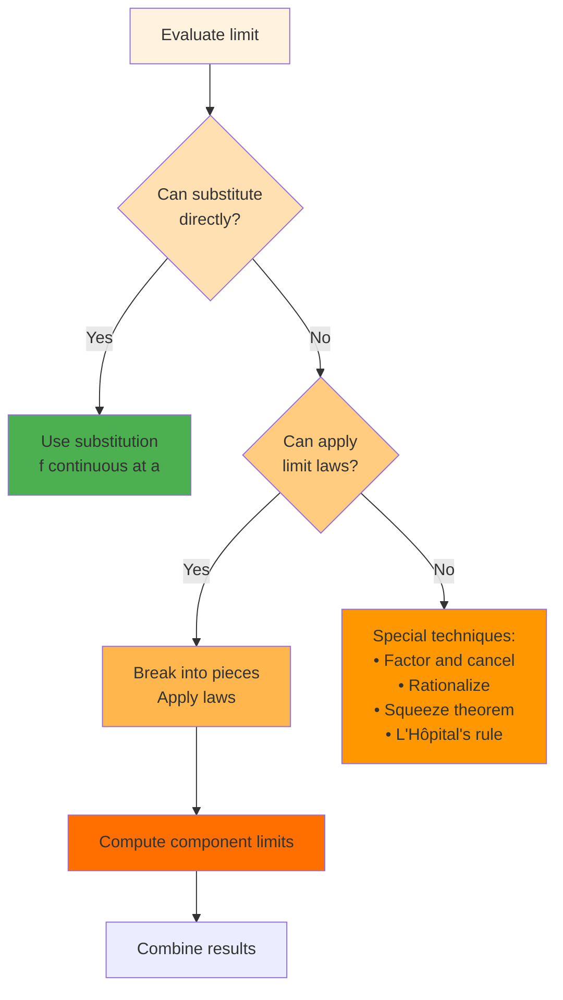
```mermaid
flowchart TD
    A["Evaluate limit"] --> B{Can substitute<br>directly?}
    B -->|Yes| C["Use substitution<br>f continuous at a"]
    B -->|No| D{Can apply<br>limit laws?}
    D -->|Yes| E["Break into pieces<br>Apply laws"]
    D -->|No| F["Special techniques:<br>• Factor and cancel<br>• Rationalize<br>• Squeeze theorem<br>• L'Hôpital's rule"]

    E --> G["Compute component limits"]
    G --> H["Combine results"]

    style A fill:#FFF3E0
    style B fill:#FFE0B2
    style C fill:#4CAF50
    style D fill:#FFCC80
    style E fill:#FFB74D
    style F fill:#FF9800
    style G fill:#FF6F00
    style H fill:#4CAF5
```

**Common Patterns**:

1. **Polynomial Functions**: Always continuous, so use direct substitution
2. **Rational Functions**: Check if denominator is zero at limit point
3. **Composite Functions**: If $g$ is continuous at $a$ and $f$ is continuous at $g(a)$, then
   $\lim_{x \to a} f(g(x)) = f(g(a))$

**Warnings**:

- Don't assume $\lim[f(x) + g(x)] = \lim f(x) + \lim g(x)$ without verifying individual limits exist
- The quotient rule requires denominator limit ≠ 0
- Indeterminate forms need special treatment

The limit laws transform limit evaluation from a conceptual challenge to an algebraic exercise—when they apply.
Mastering both their use and limitations is essential for calculus.

##### The Squeeze Theorem and Bounding Techniques

The Squeeze Theorem (also called the Sandwich Theorem or Pinching Theorem) provides a powerful technique for finding
limits of functions that are difficult to evaluate directly. By trapping a function between two simpler functions with
the same limit, we can deduce the limit of the trapped function.

**The Squeeze Theorem**: If $g(x) \leq f(x) \leq h(x)$ for all $x$ in some interval containing $a$ (except possibly at
$a$), and $\lim_{x \to a} g(x) = \lim_{x \to a} h(x) = L$, then $\lim_{x \to a} f(x) = L$.

**Intuition**: If $f(x)$ is squeezed between two functions that approach the same value, $f(x)$ must approach that value
too.

**Classic Example**: Prove $\lim_{x \to 0} x^2 \sin\left(\frac{1}{x}\right) = 0$

Solution:

1. Note that $-1 \leq \sin\left(\frac{1}{x}\right) \leq 1$ for all $x \neq 0$
2. Multiply by $x^2$ (which is non-negative): $-x^2 \leq x^2 \sin\left(\frac{1}{x}\right) \leq x^2$
3. We have $\lim_{x \to 0} (-x^2) = 0$ and $\lim_{x \to 0} x^2 = 0$
4. By the Squeeze Theorem: $\lim_{x \to 0} x^2 \sin\left(\frac{1}{x}\right) = 0$

**Key Steps in Applying the Squeeze Theorem**:

1. Identify useful bounds for the difficult part
2. Multiply/manipulate to bound the entire expression
3. Verify the bounds have the same limit
4. Apply the theorem

**More Examples**:

1. **Bounded Oscillation**: Find $\lim_{x \to 0} x \cos\left(\frac{1}{x^2}\right)$

    - Know: $-1 \leq \cos\left(\frac{1}{x^2}\right) \leq 1$
    - So: $-|x| \leq x \cos\left(\frac{1}{x^2}\right) \leq |x|$
    - Since $\lim_{x \to 0} |x| = 0$, the limit is 0

2. **Asymptotic Behavior**: Find $\lim_{x \to \infty} \frac{\sin x}{x}$

    - Know: $-1 \leq \sin x \leq 1$
    - So: $\frac{-1}{x} \leq \frac{\sin x}{x} \leq \frac{1}{x}$ for $x > 0$
    - As $x \to \infty$: both $\frac{-1}{x}$ and $\frac{1}{x}$ approach 0
    - Therefore: $\lim_{x \to \infty} \frac{\sin x}{x} = 0$

3. **Polynomial Bounds**: Find $\lim_{x \to 0} x^4 \left\lfloor\frac{1}{x}\right\rfloor$

    - For $x > 0$: $\frac{1}{x} - 1 < \left\lfloor\frac{1}{x}\right\rfloor \leq \frac{1}{x}$
    - Multiply by $x^4$: $x^3 - x^4 < x^4 \left\lfloor\frac{1}{x}\right\rfloor \leq x^3$
    - Both bounds approach 0, so the limit is 0

**Creating Bounds**: Strategies for finding useful bounds:

1. **Trigonometric Functions**: Use $|\sin \theta| \leq 1$, $|\cos \theta| \leq 1$
2. **Absolute Values**: $|f(x)| \geq 0$ always
3. **Known Inequalities**:
    - $\sin x < x < \tan x$ for $0 < x < \pi/2$
    - $e^x \geq 1 + x$ for all $x$
    - $\ln(1 + x) \leq x$ for $x > -1$

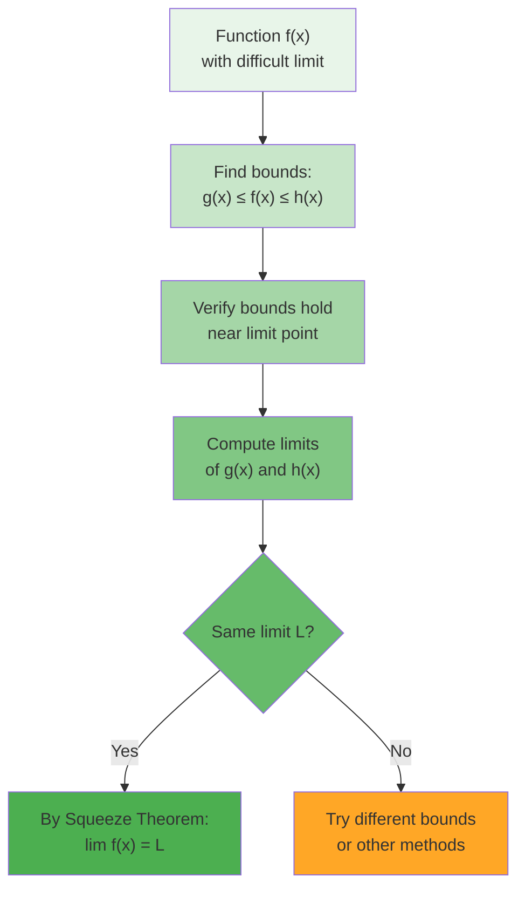
```mermaid
flowchart TD
    A["Function f(x)<br>with difficult limit"] --> B["Find bounds:<br>g(x) ≤ f(x) ≤ h(x)"]
    B --> C["Verify bounds hold<br>near limit point"]
    C --> D["Compute limits<br>of g(x) and h(x)"]
    D --> E{Same limit L?}
    E -->|Yes| F["By Squeeze Theorem:<br>lim f(x) = L"]
    E -->|No| G["Try different bounds<br>or other methods"]

    style A fill:#E8F5E9
    style B fill:#C8E6C9
    style C fill:#A5D6A7
    style D fill:#81C784
    style E fill:#66BB6A
    style F fill:#4CAF50
    style G fill:#FFA726
```

**Extensions and Variations**:

1. **One-Sided Squeeze**: Can apply to one-sided limits
2. **Infinite Limits**: If $g(x) \to \infty$ and $f(x) \geq g(x)$, then $f(x) \to \infty$
3. **Sequences**: Similar theorem for sequences

**Common Pitfall**: The bounds must have the same limit. Having $0 \leq f(x) \leq x$ doesn't help find
$\lim_{x \to 1} f(x)$ since the bounds have different limits (0 and 1).

The Squeeze Theorem exemplifies a general mathematical strategy: when direct computation is difficult, establish bounds
and analyze those instead. This technique appears throughout analysis and provides a bridge between inequalities and
limits.

##### Trigonometric Limits and Special Values

Certain limits involving trigonometric functions appear so frequently in calculus that they deserve special attention.
These limits are essential for finding derivatives of trigonometric functions and solving many practical problems.

**The Fundamental Trigonometric Limit**: $\lim_{x \to 0} \frac{\sin x}{x} = 1$

This limit cannot be evaluated using basic limit laws (we get $\frac{0}{0}$). The proof uses geometric reasoning:

**Geometric Proof** (for $0 < x < \pi/2$):

1. In a unit circle, consider angle $x$ (in radians)
2. We have: $\sin x <$ arc length $= x <$ $\tan x$
3. Dividing by $\sin x$: $1 < \frac{x}{\sin x} < \frac{1}{\cos x}$
4. Taking reciprocals: $\cos x < \frac{\sin x}{x} < 1$
5. As $x \to 0^+$: $\cos x \to 1$, so by Squeeze Theorem, $\frac{\sin x}{x} \to 1$
6. By symmetry, the same holds as $x \to 0^-$

**Related Important Limits**:

1. **Cosine Limit**: $\lim_{x \to 0} \frac{1 - \cos x}{x} = 0$

    Proof using the identity $1 - \cos x = 2\sin^2(x/2)$:
    $$\frac{1 - \cos x}{x} = \frac{2\sin^2(x/2)}{x} = \sin(x/2) \cdot \frac{\sin(x/2)}{x/2}$$ As $x \to 0$, this
    approaches $0 \cdot 1 = 0$

2. **Squared Version**: $\lim_{x \to 0} \frac{1 - \cos x}{x^2} = \frac{1}{2}$

    $$\frac{1 - \cos x}{x^2} = \frac{2\sin^2(x/2)}{x^2} = \frac{1}{2} \left(\frac{\sin(x/2)}{x/2}\right)^2 \to \frac{1}{2}$$

3. **Tangent Limit**: $\lim_{x \to 0} \frac{\tan x}{x} = 1$

    $$\frac{\tan x}{x} = \frac{\sin x}{x} \cdot \frac{1}{\cos x} \to 1 \cdot 1 = 1$$

**Variations and Extensions**:

1. **Scaled Arguments**: $\lim_{x \to 0} \frac{\sin(ax)}{x} = a$

    Let $u = ax$, then as $x \to 0$, $u \to 0$:
    $$\frac{\sin(ax)}{x} = \frac{\sin u}{u/a} = a \cdot \frac{\sin u}{u} \to a \cdot 1 = a$$

2. **Different Denominators**: $\lim_{x \to 0} \frac{\sin(ax)}{bx} = \frac{a}{b}$

3. **Combined with Other Functions**: $\lim_{x \to 0} \frac{x - \sin x}{x^3} = \frac{1}{6}$

    Using Taylor series insight: $\sin x = x - \frac{x^3}{6} + O(x^5)$

**Application Examples**:

1. Find $\lim_{x \to 0} \frac{\sin(3x)}{\sin(5x)}$

    $$\frac{\sin(3x)}{\sin(5x)} = \frac{\sin(3x)}{3x} \cdot \frac{5x}{\sin(5x)} \cdot \frac{3x}{5x} \to 1 \cdot 1 \cdot \frac{3}{5} = \frac{3}{5}$$

2. Find $\lim_{x \to 0} \frac{\tan x - \sin x}{x^3}$

    $$\tan x - \sin x = \sin x \left(\frac{1}{\cos x} - 1\right) = \sin x \cdot \frac{1 - \cos x}{\cos x}$$

    So:
    $\frac{\tan x - \sin x}{x^3} = \frac{\sin x}{x} \cdot \frac{1 - \cos x}{x^2} \cdot \frac{1}{\cos x} \to 1 \cdot \frac{1}{2} \cdot 1 = \frac{1}{2}$

**Important Techniques**:

1. Factor out the standard limit $\frac{\sin x}{x}$
2. Use trigonometric identities to simplify
3. Apply the Squeeze Theorem when needed
4. Remember that angles must be in radians

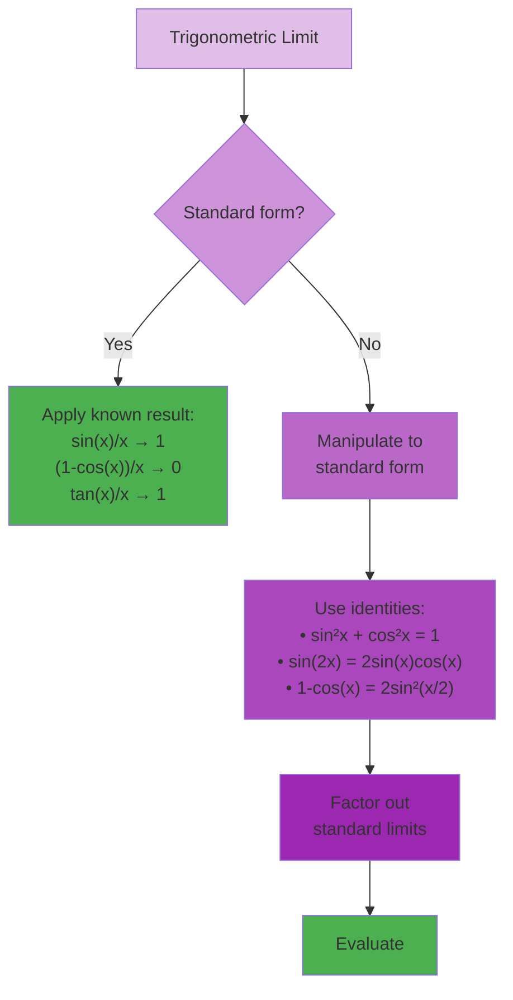
```mermaid
flowchart TD
    A["Trigonometric Limit"] --> B{Standard form?}
    B -->|Yes| C["Apply known result:<br>sin(x)/x → 1<br>(1-cos(x))/x → 0<br>tan(x)/x → 1"]
    B -->|No| D["Manipulate to<br>standard form"]
    D --> E["Use identities:<br>• sin²x + cos²x = 1<br>• sin(2x) = 2sin(x)cos(x)<br>• 1-cos(x) = 2sin²(x/2)"]
    E --> F["Factor out<br>standard limits"]
    F --> G["Evaluate"]

    style A fill:#E1BEE7
    style B fill:#CE93D8
    style C fill:#4CAF50
    style D fill:#BA68C8
    style E fill:#AB47BC
    style F fill:#9C27B0
    style G fill:#4CAF50
```

These trigonometric limits form the foundation for differential calculus of trigonometric functions. The limit
$\lim_{x \to 0} \frac{\sin x}{x} = 1$ is particularly fundamental—it's the reason the derivative of $\sin x$ is
$\cos x$.

##### Resolving Indeterminate Forms

Indeterminate forms arise when limit laws give expressions like $\frac{0}{0}$, $\frac{\infty}{\infty}$,
$0 \cdot \infty$, $\infty - \infty$, $0^0$, $1^\infty$, or $\infty^0$. These expressions don't have a predetermined
value—the limit might exist and equal any value, or might not exist at all. Special techniques are needed to resolve
these ambiguities.

**Common Indeterminate Forms and Resolution Strategies**:

**1. Form $\frac{0}{0}$**: Most common in calculus

_Strategy_: Factor and cancel, rationalize, or use L'Hôpital's Rule

Example: $\lim_{x \to 2} \frac{x^2 - 4}{x - 2}$

- Direct substitution gives $\frac{0}{0}$
- Factor: $\frac{(x-2)(x+2)}{x-2} = x + 2$ for $x \neq 2$
- Therefore: $\lim_{x \to 2} (x + 2) = 4$

Example with rationalization: $\lim_{x \to 4} \frac{\sqrt{x} - 2}{x - 4}$

- Multiply by conjugate:
  $\frac{\sqrt{x} - 2}{x - 4} \cdot \frac{\sqrt{x} + 2}{\sqrt{x} + 2} = \frac{x - 4}{(x-4)(\sqrt{x} + 2)} = \frac{1}{\sqrt{x} + 2}$
- Therefore: $\lim_{x \to 4} \frac{1}{\sqrt{x} + 2} = \frac{1}{4}$

**2. Form $\frac{\infty}{\infty}$**: Common with rational functions as $x \to \infty$

_Strategy_: Divide by highest power

Example: $\lim_{x \to \infty} \frac{3x^2 + 5x - 2}{2x^2 - x + 7}$

- Divide numerator and denominator by $x^2$: $\frac{3 + \frac{5}{x} - \frac{2}{x^2}}{2 - \frac{1}{x} + \frac{7}{x^2}}$
- As $x \to \infty$: approaches $\frac{3}{2}$

**3. Form $0 \cdot \infty$**: Convert to $\frac{0}{0}$ or $\frac{\infty}{\infty}$

Example: $\lim_{x \to 0^+} x \ln x$

- Rewrite as: $\lim_{x \to 0^+} \frac{\ln x}{1/x}$ (now form $\frac{-\infty}{\infty}$)
- Apply L'Hôpital's Rule: $\lim_{x \to 0^+} \frac{1/x}{-1/x^2} = \lim_{x \to 0^+} (-x) = 0$

**4. Form $\infty - \infty$**: Find common denominator or factor

Example: $\lim_{x \to \infty} (\sqrt{x^2 + x} - x)$

- Multiply by conjugate:
  $\frac{(\sqrt{x^2 + x} - x)(\sqrt{x^2 + x} + x)}{\sqrt{x^2 + x} + x} = \frac{x}{\sqrt{x^2 + x} + x}$
- Factor out $x$: $\frac{x}{x(\sqrt{1 + 1/x} + 1)} = \frac{1}{\sqrt{1 + 1/x} + 1}$
- As $x \to \infty$: approaches $\frac{1}{2}$

**5. Forms $0^0$, $1^\infty$, $\infty^0$**: Use logarithms

Example: $\lim_{x \to 0^+} x^x$

- Let $y = x^x$, so $\ln y = x \ln x$
- We showed $\lim_{x \to 0^+} x \ln x = 0$
- Therefore $\lim_{x \to 0^+} \ln y = 0$
- So $\lim_{x \to 0^+} y = e^0 = 1$

**L'Hôpital's Rule** (preview): For forms $\frac{0}{0}$ or $\frac{\infty}{\infty}$:
$$\lim_{x \to a} \frac{f(x)}{g(x)} = \lim_{x \to a} \frac{f'(x)}{g'(x)}$$ (under appropriate conditions)

**Decision Tree for Indeterminate Forms**:

```mermaid
flowchart TD
    A["Indeterminate Form"] --> B{Which type?}
    B -->|"0/0"| C["• Factor and cancel<br>• Rationalize<br>• L'Hôpital's Rule"]
    B -->|"∞/∞"| D["• Divide by highest power<br>• L'Hôpital's Rule"]
    B -->|"0·∞"| E["Convert to 0/0 or ∞/∞"]
    B -->|"∞-∞"| F["• Common denominator<br>• Conjugate<br>• Factor"]
    B -->|"0⁰, 1^∞, ∞⁰"| G["Use logarithms"]

    style A fill:#FFEBEE
    style B fill:#FFCDD2
    style C fill:#EF9A9A
    style D fill:#E57373
    style E fill:#EF5350
    style F fill:#F44336
    style G fill:#E53935
```

**Common Mistakes**:

1. Assuming indeterminate forms equal specific values
2. Applying L'Hôpital's Rule without checking conditions
3. Not simplifying before applying advanced techniques

**Key Insight**: Indeterminate forms show that limit evaluation requires understanding the rates at which functions
approach their limiting values, not just the values themselves. This deeper understanding motivates the derivative
concept and differential calculus.

##### Strategic Approaches to Complex Limits

When faced with challenging limits, success often depends on choosing the right strategy. This section synthesizes
techniques and provides a systematic approach to limit problems.

**Strategic Framework**:

1. **Initial Analysis**:

    - Can I substitute directly?
    - What form do I get?
    - Are there obvious simplifications?

2. **Identify the Challenge**:

    - Indeterminate form?
    - Oscillatory behavior?
    - Piecewise definition?
    - Infinity involved?

3. **Select Appropriate Technique**:
    - Match problem type to method
    - Consider multiple approaches
    - Start with simplest method

**Comprehensive Example Set**:

**Example 1**: $\lim_{x \to 0} \frac{e^x - e^{-x}}{x}$

Analysis:

- Direct substitution gives $\frac{1-1}{0} = \frac{0}{0}$
- Could use L'Hôpital's Rule
- Alternative: Use series expansion

Solution using series:

- $e^x = 1 + x + \frac{x^2}{2} + O(x^3)$
- $e^{-x} = 1 - x + \frac{x^2}{2} + O(x^3)$
- $e^x - e^{-x} = 2x + O(x^3)$
- Therefore: $\frac{e^x - e^{-x}}{x} = 2 + O(x^2) \to 2$

**Example 2**: $\lim_{x \to \infty} x\left(1 - \cos\left(\frac{1}{x}\right)\right)$

Analysis:

- Form is $\infty \cdot 0$
- Let $u = 1/x$, then as $x \to \infty$, $u \to 0$

Solution:

- Becomes $\lim_{u \to 0} \frac{1 - \cos u}{u}$
- We know this equals 0

**Example 3**: $\lim_{x \to 1} \frac{x^{100} - 1}{x - 1}$

Analysis:

- Form $\frac{0}{0}$
- Could factor, but that's tedious
- Recognize as derivative definition!

Solution:

- This is $\lim_{x \to 1} \frac{x^{100} - 1^{100}}{x - 1} = \frac{d}{dx}(x^{100})\bigg|_{x=1} = 100$

**Master Strategy Guide**:

```mermaid
flowchart TD
    A["Evaluate Limit"] --> B{Direct substitution<br>possible?}
    B -->|Yes| C{Continuous<br>at point?}
    C -->|Yes| D["Substitute directly"]
    C -->|No| E["Check one-sided limits"]

    B -->|No| F{Indeterminate<br>form?}
    F -->|"0/0"| G["Try:<br>1. Factor/Cancel<br>2. Rationalize<br>3. Trig identity<br>4. L'Hôpital"]
    F -->|"∞/∞"| H["Try:<br>1. Highest power<br>2. L'Hôpital"]
    F -->|Other| I["Convert to<br>standard form"]

    F -->|No| J{Special<br>function?}
    J -->|Trig| K["Use special<br>trig limits"]
    J -->|Oscillating| L["Try Squeeze<br>Theorem"]
    J -->|No| M["Check for<br>other patterns"]

    style A fill:#F5F5F5
    style B fill:#E0E0E0
    style C fill:#BDBDBD
    style D fill:#4CAF50
    style E fill:#FFA726
    style F fill:#9E9E9E
    style G fill:#2196F3
    style H fill:#2196F3
    style I fill:#2196F3
    style J fill:#757575
    style K fill:#9C27B0
    style L fill:#9C27B0
    style M fill:#FF5722
```

**Advanced Techniques**:

1. **Change of Variables**: Simplify complex expressions

    - Example: For $\lim_{x \to \infty} x \sin(1/x)$, let $u = 1/x$

2. **Series Expansions**: For functions near specific points

    - Taylor/Maclaurin series provide polynomial approximations

3. **Asymptotic Analysis**: For limits at infinity

    - Compare growth rates of functions

4. **Logarithmic Transformation**: For exponential forms
    - If $\lim \ln f(x) = L$, then $\lim f(x) = e^L$

**Problem-Solving Mindset**:

1. **Pattern Recognition**: Similar problems often use similar techniques
2. **Multiple Methods**: Try different approaches if stuck
3. **Check Results**: Verify using numerical values or graphing
4. **Build Intuition**: Understand why techniques work, not just how

**Common Patterns to Recognize**:

- Difference of squares: $a^2 - b^2 = (a-b)(a+b)$
- Difference of cubes: $a^3 - b^3 = (a-b)(a^2 + ab + b^2)$
- Trigonometric identities
- Derivative definitions in disguise

Mastering limit evaluation requires both knowing individual techniques and developing judgment about which to apply.
With practice, pattern recognition becomes automatic, and complex limits become manageable puzzles rather than
insurmountable obstacles.

##### Common Pitfalls and How to Avoid Them

Even experienced students make characteristic errors when working with limits. Understanding these pitfalls and their
remedies strengthens limit-solving skills and deepens conceptual understanding.

**Pitfall 1: Illegal Algebraic Operations**

_Common Error_: Splitting limits before verifying they exist
$$\lim_{x \to 0} \left(\frac{1}{x} - \frac{1}{x}\right) \stackrel{?}{=} \lim_{x \to 0} \frac{1}{x} - \lim_{x \to 0} \frac{1}{x}$$

_Problem_: The individual limits don't exist!

_Correct Approach_: Simplify first $$\lim_{x \to 0} \left(\frac{1}{x} - \frac{1}{x}\right) = \lim_{x \to 0} 0 = 0$$

**Pitfall 2: Mishandling Infinity**

_Common Error_: Treating $\infty$ as a number $$\lim_{x \to \infty} (x - x) \stackrel{?}{=} \infty - \infty = 0$$

_Problem_: $\infty - \infty$ is indeterminate

_Correct Approach_: Evaluate the expression first $$\lim_{x \to \infty} (x - x) = \lim_{x \to \infty} 0 = 0$$

**Pitfall 3: Ignoring Domain Restrictions**

_Common Error_: Not checking where functions are defined

Example: $\lim_{x \to -2} \ln(x + 1)$

- Students might substitute to get $\ln(-1)$

_Problem_: $\ln(x + 1)$ is undefined for $x < -1$

_Correct Approach_: Check domain first. The limit doesn't exist because we can't approach -2 within the domain.

**Pitfall 4: Confusing Limit with Function Value**

_Common Error_: Assuming $\lim_{x \to a} f(x) = f(a)$

_Problem_: This is only true for continuous functions

_Example_: For $f(x) = \begin{cases} x + 1 & \text{if } x \neq 2 \\ 5 & \text{if } x = 2 \end{cases}$

- $\lim_{x \to 2} f(x) = 3$ but $f(2) = 5$

**Pitfall 5: Misapplying L'Hôpital's Rule**

_Common Errors_:

1. Using it when not indeterminate form
2. Differentiating incorrectly
3. Not checking if new limit is determinate

_Example_: $\lim_{x \to 0} \frac{x^2 + 2x}{x}$

- Don't need L'Hôpital! Just simplify: $\lim_{x \to 0} (x + 2) = 2$

**Pitfall 6: Overlooking One-Sided Behavior**

_Common Error_: Assuming two-sided limit exists without checking

_Example_: $\lim_{x \to 0} \frac{|x|}{x}$

- From right: $\lim_{x \to 0^+} \frac{x}{x} = 1$
- From left: $\lim_{x \to 0^-} \frac{-x}{x} = -1$
- Two-sided limit doesn't exist!

**Pitfall 7: Rationalizing Incorrectly**

_Common Error_: Multiplying by wrong conjugate or making algebra errors

_Correct Example_: $\lim_{x \to 0} \frac{\sqrt{1+x} - 1}{x}$

- Multiply by $\frac{\sqrt{1+x} + 1}{\sqrt{1+x} + 1}$
- Get $\frac{(1+x) - 1}{x(\sqrt{1+x} + 1)} = \frac{1}{\sqrt{1+x} + 1} \to \frac{1}{2}$

**Prevention Strategies**:

1. **Check Your Work**:

    - Verify using numerical values near the limit point
    - Graph the function to visualize behavior
    - Try alternative methods

2. **Understand the Theory**:

    - Know when limit laws apply
    - Understand what indeterminate means
    - Remember continuity requirements

3. **Develop Good Habits**:

    - Always check domains first
    - Simplify before applying rules
    - Consider one-sided limits for suspicious points

4. **Common Sense Checks**:
    - Is the answer reasonable?
    - Does it match the graph?
    - Do units make sense (in applications)?

```mermaid
flowchart TD
    A["Limit Problem"] --> B["Initial Checks"]
    B --> C["Is function defined<br>near limit point?"]
    B --> D["Will limit laws apply?"]
    B --> E["Any obvious<br>simplifications?"]

    C --> F["Work Carefully"]
    D --> F
    E --> F

    F --> G["Verify Result"]
    G --> H["Numerical check"]
    G --> I["Graphical check"]
    G --> J["Alternative method"]

    style A fill:#FFF3E0
    style B fill:#FFE0B2
    style C fill:#FFCC80
    style D fill:#FFB74D
    style E fill:#FFA726
    style F fill:#FF9800
    style G fill:#F57C00
    style H fill:#E65100
    style I fill:#D84315
    style J fill:#BF360C
```

By understanding these common pitfalls, students can develop the careful, systematic approach needed for successful
limit evaluation. Remember: limits are about the journey (approaching) not the destination (arriving), and this journey
requires careful navigation to avoid these common traps.

#### The Precise Definition of a Limit

While intuitive understanding of limits is essential, mathematics demands precision. The epsilon-delta definition
provides the rigorous foundation upon which all of calculus rests. This formal definition transforms the vague notion of
"approaching" into precise mathematical language.

##### Building Intuition for Epsilon-Delta

Before diving into formalism, let's build intuition through a series of increasingly precise descriptions of what it
means for a limit to exist.

**Progressive Refinement of the Limit Concept**:

1. **Vague**: "$f(x)$ approaches $L$ as $x$ approaches $a$"

2. **Better**: "$f(x)$ gets arbitrarily close to $L$ when $x$ is sufficiently close to $a$"

3. **More Precise**: "We can make $f(x)$ as close to $L$ as desired by taking $x$ close enough to $a$"

4. **Nearly Formal**: "For any desired closeness to $L$, there exists a corresponding closeness to aa a that guarantees
   it"

5. **Formal**: "For every $\varepsilon > 0$, there exists $\delta > 0$ such that if $0 < |x - a| < \delta$, then
   $|f(x) - L| < \varepsilon$"

**The Challenge-Response Game**: Think of limits as a dialogue between a challenger and a responder:

**Challenger**: "I want $f(x)$ within 0.01 of $L$" **Responder**: "Then keep $x$ within 0.003 of $a$"

**Challenger**: "Now I want $f(x)$ within 0.0001 of $L$" **Responder**: "Then keep $x$ within 0.00002 of $a$"

If the responder can always meet any challenge (no matter how small $\varepsilon$), then the limit exists and equals
$L$.

**Visual Interpretation**: The epsilon-delta definition describes a "target zone" around $L$:

```mermaid
graph TD
    A["Horizontal band:<br>y = L ± ε"] --> B["Creates target zone<br>for f(x) values"]
    C["Vertical band:<br>x = a ± δ"] --> D["Creates input zone<br>(excluding x = a)"]
    B --> E["If we can always find δ<br>so that inputs in vertical band<br>give outputs in horizontal band,<br>then limit exists"]
    D --> E

    style A fill:#E3F2FD
    style B fill:#BBDEFB
    style C fill:#90CAF9
    style D fill:#64B5F6
    style E fill:#2196F3
```

**Why We Need This Precision**: Consider these questions:

- What exactly does "arbitrarily close" mean?
- How do we prove a limit exists?
- How do we show two definitions are equivalent?
- How do we extend limits to abstract spaces?

The epsilon-delta definition answers all these questions with mathematical rigor.

**Building Understanding Through Examples**:

**Example 1**: Intuition for $\lim_{x \to 2} (3x - 1) = 5$

- If someone wants $|f(x) - 5| < 0.1$, we need $|(3x - 1) - 5| < 0.1$
- This means $|3x - 6| < 0.1$, so $3|x - 2| < 0.1$
- Therefore $|x - 2| < 0.1/3 \approx 0.033$
- So choosing $\delta = 0.033$ works for $\varepsilon = 0.1$

**Example 2**: Why the definition excludes $x = a$

Consider $f(x) = \begin{cases} x & \text{if } x \neq 2 \\ 10 & \text{if } x = 2 \end{cases}$

- The limit as $x \to 2$ should be 2 (based on nearby values)
- If we didn't exclude $x = 2$, we'd need $|f(2) - 2| = |10 - 2| = 8 < \varepsilon$
- This would fail for small $\varepsilon$
- By excluding $x = a$, we focus on approach behavior, not the value at $a$

**The Power of Quantifiers**: The formal definition uses precise logical structure:

- "For every $\varepsilon > 0$" (universal quantifier)
- "There exists $\delta > 0$" (existential quantifier)
- The order matters! $\delta$ can depend on $\varepsilon$

This logical precision enables rigorous proofs and eliminates ambiguity.

##### Epsilon-Delta Definition and Formal Proof Structure

Now we present the formal definition and explore its structure in detail.

**The Formal Definition**: $$\lim_{x \to a} f(x) = L$$ means: For every $\varepsilon > 0$, there exists $\delta > 0$
such that if $0 < |x - a| < \delta$, then $|f(x) - L| < \varepsilon$.

**Breaking Down the Components**:

1. **"For every $\varepsilon > 0$"**:

    - $\varepsilon$ represents the desired closeness to $L$
    - Must work for ALL positive values, no matter how small
    - The challenger in our game

2. **"There exists $\delta > 0$"**:

    - $\delta$ represents how close $x$ must be to $a$
    - Only needs to exist, not be unique
    - Can depend on both $\varepsilon$ and $a$
    - The responder's answer

3. **"If $0 < |x - a| < \delta$"**:

    - $|x - a| < \delta$: $x$ is within $\delta$ of $a$
    - $0 < |x - a|$: $x \neq a$ (crucial exclusion)
    - Defines the input condition

4. **"Then $|f(x) - L| < \varepsilon$"**:
    - The desired output condition
    - $f(x)$ is within $\varepsilon$ of $L$

**Standard Proof Structure**: To prove $\lim_{x \to a} f(x) = L$:

1. **Setup**: Let $\varepsilon > 0$ be arbitrary
2. **Analysis**: Work backwards from $|f(x) - L| < \varepsilon$ to find what restriction on $|x - a|$ is needed
3. **Choice of $\delta$**: Based on analysis, choose specific $\delta > 0$
4. **Verification**: Show that if $0 < |x - a| < \delta$, then $|f(x) - L| < \varepsilon$
5. **Conclusion**: Since $\varepsilon$ was arbitrary, the limit equals $L$

**Complete Example Proof**: Prove $\lim_{x \to 3} (2x + 1) = 7$

_Proof_:

1. Let $\varepsilon > 0$ be arbitrary.

2. We need to find $\delta > 0$ such that if $0 < |x - 3| < \delta$, then $|(2x + 1) - 7| < \varepsilon$.

3. Analysis: $$|(2x + 1) - 7| = |2x - 6| = |2(x - 3)| = 2|x - 3|$$

    We want $2|x - 3| < \varepsilon$, which means $|x - 3| < \frac{\varepsilon}{2}$.

4. Choice: Let $\delta = \frac{\varepsilon}{2}$.

5. Verification: Suppose $0 < |x - 3| < \delta = \frac{\varepsilon}{2}$. Then:
   $$|(2x + 1) - 7| = 2|x - 3| < 2 \cdot \frac{\varepsilon}{2} = \varepsilon$$

6. Therefore, $\lim_{x \to 3} (2x + 1) = 7$. □

**More Complex Example**: Prove $\lim_{x \to 2} x^2 = 4$

_Proof_:

1. Let $\varepsilon > 0$ be arbitrary.

2. Analysis: We need $|x^2 - 4| < \varepsilon$. $$|x^2 - 4| = |x - 2||x + 2|$$

    We can control $|x - 2|$ with $\delta$, but need to bound $|x + 2|$.

3. Preliminary bound: If $\delta \leq 1$, then $|x - 2| < 1$, so $1 < x < 3$, thus $3 < x + 2 < 5$. Therefore
   $|x + 2| < 5$.

4. With this bound: $|x^2 - 4| = |x - 2||x + 2| < 5|x - 2|$

5. To ensure $5|x - 2| < \varepsilon$, we need $|x - 2| < \frac{\varepsilon}{5}$.

6. Choice: Let $\delta = \min\{1, \frac{\varepsilon}{5}\}$.

7. Verification: If $0 < |x - 2| < \delta$, then:

    - Since $\delta \leq 1$, we have $|x + 2| < 5$
    - Since $\delta \leq \frac{\varepsilon}{5}$, we have $|x - 2| < \frac{\varepsilon}{5}$
    - Therefore: $|x^2 - 4| = |x - 2||x + 2| < \frac{\varepsilon}{5} \cdot 5 = \varepsilon$

8. Therefore, $\lim_{x \to 2} x^2 = 4$. □

```mermaid
flowchart TD
    A["To prove lim[x→a] f(x) = L"] --> B["1. Let ε > 0 be arbitrary"]
    B --> C["2. Analyze |f(x) - L|<br>Express in terms of |x - a|"]
    C --> D["3. Find what bound on |x - a|<br>guarantees |f(x) - L| < ε"]
    D --> E["4. Choose δ based on analysis<br>(may need preliminary bounds)"]
    E --> F["5. Verify: If 0 < |x - a| < δ<br>then |f(x) - L| < ε"]
    F --> G["6. Conclude limit equals L"]

    style A fill:#FFEBEE
    style B fill:#FFCDD2
    style C fill:#EF9A9A
    style D fill:#E57373
    style E fill:#EF5350
    style F fill:#F44336
    style G fill:#4CAF50
```

**Key Insights**:

1. $\delta$ typically depends on $\varepsilon$ (often linearly)
2. For complex functions, preliminary bounds are often needed
3. The choice $\delta = \min\{\delta_1, \delta_2, ...\}$ handles multiple constraints
4. The proof structure is systematic and algorithmic

##### Verifying Limits with Precise Arguments

Beyond basic limit proofs, the epsilon-delta definition enables us to verify more complex limits and establish
properties of limits rigorously.

**Advanced Proof Techniques**:

**1. Limits of Composite Functions**: If $\lim_{x \to a} g(x) = L$ and $f$ is continuous at $L$, prove
$\lim_{x \to a} f(g(x)) = f(L)$

_Proof Sketch_:

- Given $\varepsilon > 0$
- Since $f$ continuous at $L$: $\exists \gamma > 0$ such that $|y - L| < \gamma \Rightarrow |f(y) - f(L)| < \varepsilon$
- Since $\lim_{x \to a} g(x) = L$: $\exists \delta > 0$ such that $0 < |x - a| < \delta \Rightarrow |g(x) - L| < \gamma$
- Combining: $0 < |x - a| < \delta \Rightarrow |f(g(x)) - f(L)| < \varepsilon$

**2. Uniqueness of Limits**: Prove that if a limit exists, it is unique.

_Proof by Contradiction_:

- Suppose $\lim_{x \to a} f(x) = L_1$ and $\lim_{x \to a} f(x) = L_2$ with $L_1 \neq L_2$
- Let $\varepsilon = \frac{|L_1 - L_2|}{2} > 0$
- There exist $\delta_1, \delta_2 > 0$ for the two limits
- Let $\delta = \min\{\delta_1, \delta_2\}$
- For $0 < |x - a| < \delta$: both $|f(x) - L_1| < \varepsilon$ and $|f(x) - L_2| < \varepsilon$
- By triangle inequality: $|L_1 - L_2| \leq |L_1 - f(x)| + |f(x) - L_2| < 2\varepsilon = |L_1 - L_2|$
- Contradiction! Therefore $L_1 = L_2$

**3. Proving Limit Laws**: Prove the sum rule using epsilon-delta.

_Proof of Sum Rule_: If $\lim_{x \to a} f(x) = L$ and $\lim_{x \to a} g(x) = M$, then
$\lim_{x \to a} [f(x) + g(x)] = L + M$

- Let $\varepsilon > 0$
- Since limits exist:
    - $\exists \delta_1 > 0$: $0 < |x - a| < \delta_1 \Rightarrow |f(x) - L| < \frac{\varepsilon}{2}$
    - $\exists \delta_2 > 0$: $0 < |x - a| < \delta_2 \Rightarrow |g(x) - M| < \frac{\varepsilon}{2}$
- Let $\delta = \min\{\delta_1, \delta_2\}$
- For $0 < |x - a| < \delta$:
  $$|(f(x) + g(x)) - (L + M)| \leq |f(x) - L| + |g(x) - M| < \frac{\varepsilon}{2} + \frac{\varepsilon}{2} = \varepsilon$$

**Common Proof Strategies**:

1. **Triangle Inequality**: Essential for managing absolute values $$|a + b| \leq |a| + |b|$$
   $$||a| - |b|| \leq |a - b|$$

2. **Factoring**: Express $|f(x) - L|$ in terms of $|x - a|$

3. **Bounding Techniques**:

    - First restrict to $|x - a| < 1$ to bound other factors
    - Then further restrict to achieve desired inequality

4. **Working Backwards**: Start with desired conclusion and determine what $\delta$ is needed

**Example - A Challenging Limit**: Prove $\lim_{x \to 0} x \sin\left(\frac{1}{x}\right) = 0$

_Proof_:

1. Let $\varepsilon > 0$

2. Note that $\left|\sin\left(\frac{1}{x}\right)\right| \leq 1$ for all $x \neq 0$

3. Therefore:
   $\left|x \sin\left(\frac{1}{x}\right) - 0\right| = |x| \cdot \left|\sin\left(\frac{1}{x}\right)\right| \leq |x|$

4. To ensure $|x| < \varepsilon$, choose $\delta = \varepsilon$

5. If $0 < |x - 0| < \delta = \varepsilon$, then:
   $$\left|x \sin\left(\frac{1}{x}\right) - 0\right| \leq |x| < \varepsilon$$

6. Therefore $\lim_{x \to 0} x \sin\left(\frac{1}{x}\right) = 0$ □

**Verifying Non-Existence**: To prove a limit doesn't exist, show:

- Either: Find sequences approaching $a$ with different limiting values
- Or: Show that for some $\varepsilon > 0$, no suitable $\delta$ exists

The epsilon-delta definition transforms limit theory from intuition to rigorous mathematics, enabling precise proofs of
fundamental theorems that underpin all of calculus.

##### Sequential Approach to Limits

An alternative characterization of limits uses sequences instead of epsilon-delta. This approach often provides more
intuitive proofs and connects limits to discrete mathematics.

**Sequential Definition of Limit**: $\lim_{x \to a} f(x) = L$ if and only if for every sequence $\{x_n\}$ with
$x_n \neq a$ and $\lim_{n \to \infty} x_n = a$, we have $\lim_{n \to \infty} f(x_n) = L$.

**Equivalence with Epsilon-Delta**: These two definitions are equivalent:

_Proof that epsilon-delta implies sequential_:

- Assume $\lim_{x \to a} f(x) = L$ (epsilon-delta sense)
- Let $\{x_n\}$ be any sequence with $x_n \neq a$ and $x_n \to a$
- Given $\varepsilon > 0$, there exists $\delta > 0$ for the function limit
- Since $x_n \to a$, there exists $N$ such that $n \geq N \Rightarrow 0 < |x_n - a| < \delta$
- Therefore $n \geq N \Rightarrow |f(x_n) - L| < \varepsilon$
- So $f(x_n) \to L$

**Advantages of Sequential Approach**:

1. **Proving Non-Existence**: Find two sequences with different limits

Example: Show $\lim_{x \to 0} \sin\left(\frac{1}{x}\right)$ doesn't exist

- Let $x_n = \frac{1}{n\pi}$, then $f(x_n) = \sin(n\pi) = 0 \to 0$
- Let $y_n = \frac{1}{(n + \frac{1}{2})\pi}$, then $f(y_n) = \sin((n + \frac{1}{2})\pi) = (-1)^n$
- Second sequence doesn't converge, so limit doesn't exist

2. **Composition of Limits**: More natural with sequences

3. **Connection to Continuity**: $f$ continuous at $a$ iff for every sequence $x_n \to a$, we have $f(x_n) \to f(a)$

**Using Sequences in Proofs**:

**Example 1**: Prove $\lim_{x \to 2} (x^2 - 3x) = -2$ using sequences

_Proof_:

- Let $\{x_n\}$ be any sequence with $x_n \neq 2$ and $x_n \to 2$
- Then $f(x_n) = x_n^2 - 3x_n = x_n^2 - 3x_n$
- Since $x_n \to 2$: $x_n^2 \to 4$ and $3x_n \to 6$
- Therefore $f(x_n) \to 4 - 6 = -2$
- Since this holds for any such sequence, $\lim_{x \to 2} (x^2 - 3x) = -2$

**Example 2**: Use sequences to prove the product rule for limits

_Proof_: If $\lim_{x \to a} f(x) = L$ and $\lim_{x \to a} g(x) = M$, then $\lim_{x \to a} f(x)g(x) = LM$

- Let $\{x_n\}$ with $x_n \neq a$ and $x_n \to a$
- By hypothesis: $f(x_n) \to L$ and $g(x_n) \to M$
- By sequence limit properties: $f(x_n)g(x_n) \to LM$
- Since this holds for any such sequence, $\lim_{x \to a} f(x)g(x) = LM$

```mermaid
flowchart LR
    A["Epsilon-Delta<br>Definition"] <--> B["Sequential<br>Definition"]
    B --> C["Advantages:<br>• Easier non-existence proofs<br>• Natural for composition<br>• Connects to discrete math"]
    A --> D["Advantages:<br>• Direct verification<br>• Constructive<br>• Traditional foundation"]

    style A fill:#E3F2FD
    style B fill:#BBDEFB
    style C fill:#90CAF9
    style D fill:#64B5F6
```

**Heine-Borel Property**: The sequential characterization is sometimes called the Heine-Borel property of limits. It
shows that continuous functions preserve sequential limits—a key property in analysis.

**Choosing the Right Approach**:

- Use epsilon-delta for constructive proofs and when you need explicit bounds
- Use sequences for non-existence proofs and theoretical results
- Both provide complete understanding of limits

##### Connecting Intuition with Rigor

The formal definition of limits might seem divorced from the intuitive understanding we developed earlier. This section
bridges that gap, showing how rigor enhances rather than replaces intuition.

**From Intuition to Formalism**:

1. **Intuitive**: "As $x$ gets close to $a$, $f(x)$ gets close to $L$"

    - **Issue**: What does "close" mean?
    - **Resolution**: $\varepsilon$ and $\delta$ quantify closeness

2. **Intuitive**: "We can make $f(x)$ as close to $L$ as we want"

    - **Issue**: Who controls what?
    - **Resolution**: We control $x$ (via $\delta$), achieving desired $f(x)$ behavior (via $\varepsilon$)

3. **Intuitive**: "The limit describes behavior near, not at, the point"
    - **Issue**: How do we exclude the point itself?
    - **Resolution**: The condition $0 < |x - a|$ ensures $x \neq a$

**Visual Bridge**: The epsilon-delta definition creates a geometric framework:

For any horizontal strip of width 2ε centered at y = L, there exists a vertical strip of width 2δ centered at x = a,
such that the graph within the vertical strip (except at x = a) lies entirely within the horizontal strip.

**Why Rigor Matters**:

1. **Eliminates Ambiguity**: "Sufficiently close" becomes precisely quantified
2. **Enables Proofs**: Can establish limit laws and theorems
3. **Handles Edge Cases**: Works even for pathological functions
4. **Extends to Abstract Settings**: Generalizes to metric spaces and beyond

**Example - Rigor Reveals Subtlety**: Consider $f(x) = x \sin(1/x)$ for $x \neq 0$

Intuition says: "Since $\sin(1/x)$ oscillates wildly near 0, the limit might not exist"

But rigorous analysis shows: The factor $x$ controls the oscillation, giving limit 0

This demonstrates how formal analysis can correct faulty intuition.

**Building Intuition from Rigor**: The formal definition also enhances intuition:

1. **Delta as a Function**: Often $\delta = \delta(\varepsilon)$

    - Linear functions: $\delta$ proportional to $\varepsilon$
    - Quadratic near zero: $\delta$ proportional to $\sqrt{\varepsilon}$
    - This relationship reveals function behavior

2. **Uniform Continuity**: When $\delta$ can be chosen independently of the point

    - Indicates function has controlled rate of change
    - Linear functions are uniformly continuous

3. **Rate of Approach**: How quickly $\delta$ shrinks as $\varepsilon \to 0$ indicates how rapidly $f(x)$ approaches $L$

**Practical Benefits of Formalism**:

1. **Numerical Estimates**: Proofs often give explicit $\delta$-$\varepsilon$ relationships

    - If $\delta = \varepsilon/5$, then to get within 0.001, stay within 0.0002

2. **Error Bounds**: In applications, $\varepsilon$ is error tolerance, $\delta$ is required precision

3. **Algorithm Design**: Numerical methods use epsilon-delta ideas for convergence criteria

**The Two-Way Street**: Intuition guides formal proofs, while rigor sharpens intuition:

- Start with geometric understanding
- Formalize with epsilon-delta
- Extract new insights from the formal proof
- Enhance original intuition

This interplay between intuition and rigor characterizes mathematical thinking at its best. The formal definition
doesn't replace understanding—it deepens it.

##### Applications in Mathematical Analysis

The epsilon-delta definition of limits extends far beyond elementary calculus, forming the foundation for vast areas of
mathematics. Understanding these connections reveals the true power of the limit concept.

**Generalization to Metric Spaces**: In a metric space $(X, d)$, the limit definition becomes:

$\lim_{x \to a} f(x) = L$ means: For every $\varepsilon > 0$, there exists $\delta > 0$ such that if
$0 < d(x, a) < \delta$, then $d(f(x), L) < \varepsilon$.

This abstraction:

- Replaces $|x - a|$ with distance $d(x, a)$
- Works in $\mathbb{R}^n$, function spaces, and beyond
- Unifies many seemingly different concepts

**Uniform Continuity**: A function $f: A \to \mathbb{R}$ is uniformly continuous if: For every $\varepsilon > 0$, there
exists $\delta > 0$ such that for all $x, y \in A$ with $|x - y| < \delta$, we have $|f(x) - f(y)| < \varepsilon$.

Key difference: $\delta$ depends only on $\varepsilon$, not on the specific point.

**Theorem**: Every continuous function on a closed, bounded interval is uniformly continuous.

This has profound implications for:

- Numerical integration
- Approximation theory
- Fourier analysis

**Differentiability**: The derivative is defined as a limit: $$f'(a) = \lim_{h \to 0} \frac{f(a + h) - f(a)}{h}$$

Using epsilon-delta: $f'(a) = L$ means: For every $\varepsilon > 0$, there exists $\delta > 0$ such that if
$0 < |h| < \delta$, then $\left|\frac{f(a + h) - f(a)}{h} - L\right| < \varepsilon$.

**Cauchy Sequences**: A sequence $\{x_n\}$ is Cauchy if: For every $\varepsilon > 0$, there exists $N$ such that if
$m, n \geq N$, then $|x_m - x_n| < \varepsilon$.

Connection to limits:

- Every convergent sequence is Cauchy
- In complete spaces, every Cauchy sequence converges
- Defines completeness without reference to limit values

**Function Spaces and Uniform Convergence**: For a sequence of functions $\{f_n\}$:

_Pointwise convergence_: For each $x$, $\lim_{n \to \infty} f_n(x) = f(x)$

_Uniform convergence_: For every $\varepsilon > 0$, there exists $N$ such that if $n \geq N$, then
$|f_n(x) - f(x)| < \varepsilon$ for all $x$.

Uniform convergence:

- Preserves continuity
- Allows term-by-term integration
- Essential for power series and Fourier series

**Compactness**: A set $K$ is compact if every sequence in $K$ has a convergent subsequence with limit in $K$.

The Heine-Borel theorem states: In $\mathbb{R}^n$, a set is compact iff it's closed and bounded.

Applications:

- Extreme value theorem
- Existence theorems for differential equations
- Fixed point theorems

```mermaid
flowchart TD
    A["Epsilon-Delta Definition"] --> B["Metric Spaces"]
    A --> C["Uniform Continuity"]
    A --> D["Differentiability"]
    A --> E["Cauchy Sequences"]
    A --> F["Function Convergence"]

    B --> G["Topology"]
    C --> H["Approximation Theory"]
    D --> I["Differential Equations"]
    E --> J["Completeness"]
    F --> K["Functional Analysis"]

    style A fill:#FFE0B2
    style B fill:#FFCC80
    style C fill:#FFB74D
    style D fill:#FFA726
    style E fill:#FF9800
    style F fill:#F57C00
    style G fill:#BBDEFB
    style H fill:#90CAF9
    style I fill:#64B5F6
    style J fill:#42A5F5
    style K fill:#2196F3
```

**Modern Applications**:

1. **Machine Learning**: Convergence of optimization algorithms
2. **Numerical Analysis**: Error estimates and stability
3. **Probability Theory**: Convergence of random variables
4. **Partial Differential Equations**: Weak solutions and distributions

The epsilon-delta definition, seemingly abstract, provides the language for discussing approximation, convergence, and
continuity throughout mathematics. It transforms vague notions into precise concepts amenable to rigorous analysis,
enabling mathematics to tackle increasingly complex problems with confidence.

The journey from ancient paradoxes through Newton and Leibniz to Cauchy and Weierstrass shows how mathematical concepts
evolve. The epsilon-delta definition represents not an endpoint but a foundation for ever-deeper understanding of the
continuous and infinite in mathematics.

#### Continuity

Continuity formalizes the intuitive notion of functions without breaks or jumps. A continuous function can be drawn
without lifting the pencil from the paper—but this simple idea leads to profound mathematical consequences and
surprising subtleties.

##### Definition and Properties of Continuous Functions

The concept of continuity captures the idea that small changes in input produce small changes in output. This behavior
is so fundamental that much of calculus focuses on continuous functions.

**Definition at a Point**: A function $f$ is continuous at point $a$ if:

1. $f(a)$ is defined
2. $\lim_{x \to a} f(x)$ exists
3. $\lim_{x \to a} f(x) = f(a)$

All three conditions must hold. In essence: the limiting value equals the actual value.

**Epsilon-Delta Definition**: Equivalently, $f$ is continuous at $a$ if: For every $\varepsilon > 0$, there exists
$\delta > 0$ such that if $|x - a| < \delta$, then $|f(x) - f(a)| < \varepsilon$.

Note: Unlike the limit definition, we don't require $x \neq a$.

**Sequential Definition**: $f$ is continuous at $a$ if for every sequence $\{x_n\}$ with $x_n \to a$, we have
$f(x_n) \to f(a)$.

**Types of Continuity**:

1. **Continuity at a Point**: Function is continuous at specific value $a$
2. **Continuity on an Interval**: Continuous at every point in the interval
3. **Uniform Continuity**: Rate of change is bounded across entire domain
4. **Absolute Continuity**: Stronger condition related to integration
5. **Lipschitz Continuity**: $|f(x) - f(y)| \leq L|x - y|$ for some constant $L$

**Basic Continuous Functions**:

1. **Polynomials**: $P(x) = a_nx^n + ... + a_1x + a_0$ continuous everywhere

    - Sums and products of continuous functions

2. **Rational Functions**: $R(x) = \frac{P(x)}{Q(x)}$ continuous where $Q(x) \neq 0$

    - Discontinuous only at zeros of denominator

3. **Trigonometric Functions**: $\sin x$, $\cos x$ continuous everywhere

    - $\tan x$ continuous except at odd multiples of $\pi/2$

4. **Exponential and Logarithmic**: $e^x$ continuous everywhere, $\ln x$ continuous for $x > 0$

5. **Root Functions**: $\sqrt[n]{x}$ continuous on appropriate domains

**Properties of Continuous Functions**:

**Theorem (Algebra of Continuous Functions)**: If $f$ and $g$ are continuous at $a$, then:

1. $f + g$ is continuous at $a$
2. $f - g$ is continuous at $a$
3. $cf$ is continuous at $a$ for any constant $c$
4. $fg$ is continuous at $a$
5. $f/g$ is continuous at $a$ if $g(a) \neq 0$

**Theorem (Composition)**: If $g$ is continuous at $a$ and $f$ is continuous at $g(a)$, then $f \circ g$ is continuous
at $a$.

**Proof of Composition**: Using epsilon-delta:

- Given $\varepsilon > 0$
- Since $f$ continuous at $g(a)$: $\exists \gamma > 0$ such that
  $|y - g(a)| < \gamma \Rightarrow |f(y) - f(g(a))| < \varepsilon$
- Since $g$ continuous at $a$: $\exists \delta > 0$ such that $|x - a| < \delta \Rightarrow |g(x) - g(a)| < \gamma$
- Combining: $|x - a| < \delta \Rightarrow |f(g(x)) - f(g(a))| < \varepsilon$

**Examples and Non-Examples**:

1. **Continuous**: $f(x) = \frac{x^2 - 1}{x + 1}$ for $x \neq -1$

    - Can be simplified to $f(x) = x - 1$ for $x \neq -1$
    - Extend by continuity: define $f(-1) = -2$ to make continuous everywhere

2. **Discontinuous**: $f(x) = \lfloor x \rfloor$ (greatest integer function)

    - Jump discontinuity at every integer
    - Right-continuous but not left-continuous

3. **Pathological**: Dirichlet function
   $D(x) = \begin{cases} 1 & \text{if } x \text{ rational} \\ 0 & \text{if } x \text{ irrational} \end{cases}$
    - Discontinuous everywhere!
    - No point of continuity

```mermaid
flowchart TD
    A["Function f at point a"] --> B{"Is f(a) defined?"}
    B -->|No| C["Not continuous at a"]
    B -->|Yes| D{"Does lim[x→a] f(x) exist?"}
    D -->|No| C
    D -->|Yes| E{"Does lim[x→a] f(x) = f(a)?"}
    E -->|No| C
    E -->|Yes| F["Continuous at a"]

    style A fill:#FFF3E0
    style B fill:#FFE0B2
    style C fill:#FF5252
    style D fill:#FFCC80
    style E fill:#FFB74D
    style F fill:#4CAF50
```

**Continuity on Intervals**: Special considerations for different types of intervals:

1. **Open Interval $(a, b)$**: Check continuity at each point using standard definition

2. **Closed Interval $[a, b]$**:

    - At interior points: standard continuity
    - At $a$: right-continuous ($\lim_{x \to a^+} f(x) = f(a)$)
    - At $b$: left-continuous ($\lim_{x \to b^-} f(x) = f(b)$)

3. **Half-Open Intervals**: Combine approaches as appropriate

**Why Continuity Matters**:

1. **Predictability**: Small errors in input cause small errors in output
2. **Computability**: Can approximate values arbitrarily well
3. **Theorems**: Many powerful results require continuity
4. **Physical Reality**: Most physical quantities vary continuously

##### Types of Discontinuities and Their Classification

When continuity fails, the type of failure reveals important information about the function. Understanding these
classifications helps in analysis and in determining whether discontinuities can be "repaired."

**Classification of Discontinuities**:

**1. Removable Discontinuity** (Point Discontinuity)

- The limit exists but either $f(a)$ is undefined or $f(a) \neq \lim_{x \to a} f(x)$
- Can be "removed" by redefining the function at that point

Example: $f(x) = \frac{x^2 - 4}{x - 2}$ at $x = 2$

- $\lim_{x \to 2} f(x) = \lim_{x \to 2} (x + 2) = 4$
- But $f(2)$ is undefined
- Define $f(2) = 4$ to make continuous

Formal characterization: $\lim_{x \to a} f(x)$ exists and is finite

**2. Jump Discontinuity**

- Both one-sided limits exist and are finite but unequal
- Function "jumps" between values

Example: $f(x) = \begin{cases} x^2 & \text{if } x < 1 \\ 2 - x & \text{if } x \geq 1 \end{cases}$

- $\lim_{x \to 1^-} f(x) = 1$
- $\lim_{x \to 1^+} f(x) = 1$
- Actually continuous! (Bad example - let me fix)

Better example: $f(x) = \begin{cases} x & \text{if } x < 0 \\ x + 1 & \text{if } x \geq 0 \end{cases}$

- $\lim_{x \to 0^-} f(x) = 0$
- $\lim_{x \to 0^+} f(x) = 1$
- Jump of size 1

**3. Infinite Discontinuity**

- At least one one-sided limit is infinite
- Often associated with vertical asymptotes

Example: $f(x) = \frac{1}{x}$ at $x = 0$

- $\lim_{x \to 0^-} f(x) = -\infty$
- $\lim_{x \to 0^+} f(x) = +\infty$

Example: $f(x) = \frac{1}{x^2}$ at $x = 0$

- Both one-sided limits are $+\infty$

**4. Oscillatory Discontinuity**

- Limit fails to exist due to oscillation
- Function oscillates too rapidly to settle on a value

Example: $f(x) = \sin\left(\frac{1}{x}\right)$ at $x = 0$

- As $x \to 0$, function oscillates between -1 and 1 infinitely often
- Neither one-sided limit exists

**5. Essential Discontinuity**

- Discontinuity that is not removable, jump, or infinite
- Often exhibits chaotic behavior

Example: $f(x) = \sin\left(\frac{1}{x}\right)$ is actually oscillatory, not essential

Better example: $e^{1/z}$ at $z = 0$ in complex analysis

- Takes all non-zero values in any neighborhood of 0

**First and Second Species**:

- **First Species**: Discontinuities where both one-sided limits exist (removable and jump)
- **Second Species**: At least one one-sided limit doesn't exist (infinite and oscillatory)

**Visual Characteristics**:

```mermaid
graph TD
    A[Discontinuity Types] --> B[Removable]
    A --> C[Jump]
    A --> D[Infinite]
    A --> E[Oscillatory]

    B --> F[Hole in graph<br>Limit exists]
    C --> G[Vertical gap<br>Different one-sided limits]
    D --> H[Vertical asymptote<br>Infinite limit]
    E --> I[Rapid oscillation<br>No limit]

    style A fill:#E8EAF6
    style B fill:#C5CAE9
    style C fill:#9FA8DA
    style D fill:#7986CB
    style E fill:#5C6BC0
```

**Analyzing Discontinuities**: Systematic approach:

1. Check if $f(a)$ is defined
2. Calculate $\lim_{x \to a^-} f(x)$
3. Calculate $\lim_{x \to a^+} f(x)$
4. Compare values to classify

**Continuity and Derivatives**:

- If $f$ is differentiable at $a$, then $f$ is continuous at $a$
- Converse is false: $f(x) = |x|$ is continuous but not differentiable at 0

**Counting Discontinuities**:

- **Theorem**: A monotonic function on $[a,b]$ has at most countably many discontinuities
- **Theorem**: The set of discontinuities of any function $\mathbb{R} \to \mathbb{R}$ is at most countable

**Applications**:

1. **Signal Processing**: Jump discontinuities model sudden changes
2. **Physics**: Infinite discontinuities appear at singularities
3. **Economics**: Price functions may have jumps
4. **Engineering**: Material failure often involves discontinuous behavior

Understanding discontinuity types helps determine:

- Whether a function can be integrated
- How to handle numerical computations near discontinuities
- Whether physical models are realistic

##### The Intermediate Value Theorem

The Intermediate Value Theorem (IVT) is one of the most intuitive yet powerful results about continuous functions. It
formalizes the idea that a continuous function cannot "skip over" values.

**Statement of the Theorem**: If $f$ is continuous on the closed interval $[a, b]$ and $k$ is any number between $f(a)$
and $f(b)$, then there exists at least one $c \in [a, b]$ such that $f(c) = k$.

More formally: If $f$ is continuous on $[a, b]$ and $f(a) < k < f(b)$ (or $f(b) < k < f(a)$), then
$\exists c \in (a, b)$ such that $f(c) = k$.

**Intuitive Understanding**:

- A continuous function must pass through every intermediate value
- Cannot "jump over" any height between starting and ending values
- Guarantees existence but not uniqueness

**Proof Sketch** (using completeness of real numbers):

1. Let $S = \{x \in [a, b] : f(x) < k\}$
2. $S$ is non-empty (contains $a$) and bounded above by $b$
3. Let $c = \sup S$ (supremum exists by completeness)
4. By continuity and properties of supremum, $f(c) = k$

**Key Applications**:

**1. Existence of Roots**: If $f$ is continuous on $[a, b]$ with $f(a) < 0 < f(b)$, then $f$ has a root in $(a, b)$.

Example: Show $x^3 + x - 1 = 0$ has a solution in $(0, 1)$

- $f(0) = -1 < 0$
- $f(1) = 1 > 0$
- By IVT, $\exists c \in (0, 1)$ with $f(c) = 0$

**2. Fixed Point Results**: If $f: [0, 1] \to [0, 1]$ is continuous, then $f$ has a fixed point.

Proof: Define $g(x) = f(x) - x$

- $g(0) = f(0) - 0 \geq 0$
- $g(1) = f(1) - 1 \leq 0$
- By IVT, $\exists c$ with $g(c) = 0$, so $f(c) = c$

**3. Bisection Method**: Algorithm for finding roots

```python
def bisection(f, a, b, tolerance):
    # Assumes f(a) and f(b) have opposite signs
    while b - a > tolerance:
        c = (a + b) / 2
        if f(c) == 0:
            return c
        elif f(a) * f(c) < 0:
            b = c
        else:
            a = c
    return (a + b) / 2
```

**Examples and Applications**:

1. **Temperature**: If temperature is 20°C at noon and 10°C at 6 PM, then at some time between, it was exactly 15°C.

2. **Existence Proofs**: Show $\cos x = x$ has a solution

    - Define $f(x) = \cos x - x$
    - $f(0) = 1 > 0$
    - $f(\pi/2) = -\pi/2 < 0$
    - By IVT, solution exists in $(0, \pi/2)$

3. **Implicit Functions**: Prove existence of solutions to equations

**Important Observations**:

1. **Continuity is Essential**: IVT fails for discontinuous functions

    - $f(x) = \begin{cases} -1 & \text{if } x < 0 \\ 1 & \text{if } x \geq 0 \end{cases}$
    - No point where $f(x) = 0$ despite $f(-1) < 0 < f(1)$

2. **Closed Interval Required**: Need continuity at endpoints

    - Without this, function might approach but not attain intermediate value

3. **Multiple Solutions**: IVT guarantees at least one, possibly many

```mermaid
flowchart TD
    A["Continuous function<br>on [a,b]"] --> B["f(a) < k < f(b)<br>or<br>f(b) < k < f(a)"]
    B --> C["IVT guarantees:<br>∃c ∈ [a,b] with f(c) = k"]
    C --> D["Applications"]
    D --> E["Root finding"]
    D --> F["Fixed points"]
    D --> G["Existence proofs"]

    style A fill:#E8F5E9
    style B fill:#C8E6C9
    style C fill:#A5D6A7
    style D fill:#81C784
    style E fill:#66BB6A
    style F fill:#4CAF50
    style G fill:#43A047
```

**Generalizations**:

1. **Darboux's Theorem**: Derivatives have the intermediate value property even if not continuous

2. **Connected Spaces**: IVT generalizes to continuous functions from connected spaces

3. **Bolzano's Theorem**: Special case of IVT for root existence

**Limitations**:

- Doesn't tell us how to find $c$
- Doesn't guarantee uniqueness
- Requires real numbers (fails in rationals)

The IVT embodies the completeness of real numbers and the power of continuity. It transforms existence questions into
verification of inequality conditions, providing a fundamental tool for analysis.

##### Continuity on Intervals and Extreme Value Theorem

Continuous functions on closed, bounded intervals possess remarkable properties that form the foundation for
optimization and approximation theory. The crown jewel is the Extreme Value Theorem.

**The Extreme Value Theorem (EVT)**: If $f$ is continuous on a closed, bounded interval $[a, b]$, then:

1. $f$ attains its maximum: $\exists c \in [a, b]$ such that $f(c) \geq f(x)$ for all $x \in [a, b]$
2. $f$ attains its minimum: $\exists d \in [a, b]$ such that $f(d) \leq f(x)$ for all $x \in [a, b]$

**Why Each Condition Matters**:

1. **Continuity**: Essential for preventing jumps that skip extrema

    - $f(x) = \begin{cases} x & \text{if } 0 \leq x < 1 \\ 0 & \text{if } x = 1 \end{cases}$ on $[0, 1]$
    - No maximum (supremum is 1, not attained)

2. **Closed Interval**: Need endpoints included

    - $f(x) = x$ on $(0, 1)$ has no maximum or minimum
    - Supremum is 1, infimum is 0, neither attained

3. **Bounded Interval**: Prevents escape to infinity
    - $f(x) = x$ on $[0, \infty)$ has minimum (0) but no maximum

**Proof Idea**: Uses compactness of $[a, b]$

1. Continuous functions map compact sets to compact sets
2. Compact subsets of $\mathbb{R}$ are closed and bounded
3. Closed and bounded sets contain their supremum and infimum

**Related Results**:

**1. Boundedness Theorem**: If $f$ is continuous on $[a, b]$, then $f$ is bounded.

- Exists $M$ such that $|f(x)| \leq M$ for all $x \in [a, b]$

**2. Uniform Continuity Theorem**: If $f$ is continuous on $[a, b]$, then $f$ is uniformly continuous.

- For all $\varepsilon > 0$, exists $\delta > 0$ such that $|x - y| < \delta \Rightarrow |f(x) - f(y)| < \varepsilon$
- $\delta$ works for all points, not just specific ones

**Finding Extrema**: Systematic approach:

1. Find critical points where $f'(x) = 0$ or $f'(x)$ doesn't exist
2. Evaluate $f$ at critical points
3. Evaluate $f$ at endpoints
4. Compare values to find global max/min

**Example**: Find extrema of $f(x) = x^3 - 3x$ on $[-2, 2]$

1. $f'(x) = 3x^2 - 3 = 0$ when $x = \pm 1$
2. Evaluate:
    - $f(-2) = -8 + 6 = -2$
    - $f(-1) = -1 + 3 = 2$
    - $f(1) = 1 - 3 = -2$
    - $f(2) = 8 - 6 = 2$
3. Maximum: 2 (at $x = -1$ and $x = 2$)
4. Minimum: -2 (at $x = -2$ and $x = 1$)

**Applications**:

1. **Optimization Problems**:

    - Maximizing profit on production interval
    - Finding optimal dimensions given constraints

2. **Approximation Theory**:

    - Best polynomial approximation exists by EVT
    - Minimax approximation

3. **Physics**:
    - Potential energy has minimum in stable equilibrium
    - Maximum height in projectile motion

**Failure of EVT**:

1. **Open Intervals**: $f(x) = \frac{1}{1+x^2}$ on $(-\infty, \infty)$

    - Maximum is 1 at $x = 0$
    - No minimum (infimum is 0, not attained)

2. **Discontinuous Functions**: Step functions may not attain extrema

3. **Unbounded Intervals**: Even continuous functions may lack extrema

```mermaid
flowchart TD
    A["Continuous function<br>on [a,b]"] --> B["Closed interval"]
    A --> C["Bounded interval"]
    B --> D["Contains limit points"]
    C --> E["Prevents escape to ∞"]
    D --> F["EVT: Function attains<br>maximum and minimum"]
    E --> F
    F --> G["Applications:<br>• Optimization<br>• Approximation<br>• Existence proofs"]

    style A fill:#F3E5F5
    style B fill:#E1BEE7
    style C fill:#CE93D8
    style D fill:#BA68C8
    style E fill:#AB47BC
    style F fill:#9C27B0
    style G fill:#8E24AA
```

**Connection to Compactness**: The EVT is really about compact sets:

- In any metric space, continuous functions on compact sets attain their extrema
- $[a, b]$ is compact in $\mathbb{R}$ (Heine-Borel theorem)
- Generalizes to higher dimensions and abstract spaces

**Practical Importance**:

1. Guarantees solutions to optimization problems exist
2. Justifies many numerical methods
3. Enables worst-case analysis
4. Foundation for calculus of variations

The Extreme Value Theorem exemplifies how topological properties (compactness) combine with analytical properties
(continuity) to produce powerful results. It transforms optimization from hopeful searching to guaranteed existence.

##### Uniform Continuity and Its Significance

Uniform continuity strengthens ordinary continuity by requiring a single $\delta$ to work for all points in the domain.
This seemingly technical distinction has profound implications for analysis and applications.

**Definition**: A function $f: A \to \mathbb{R}$ is uniformly continuous on $A$ if: For every $\varepsilon > 0$, there
exists $\delta > 0$ such that for all $x, y \in A$ with $|x - y| < \delta$, we have $|f(x) - f(y)| < \varepsilon$.

**Key Difference from Ordinary Continuity**:

- Ordinary: $\delta$ may depend on both $\varepsilon$ and the specific point
- Uniform: $\delta$ depends only on $\varepsilon$, works everywhere

**Intuitive Interpretation**:

- Uniformly continuous: Has a controlled rate of change everywhere
- Not uniformly continuous: Rate of change becomes arbitrarily large somewhere

**Examples and Non-Examples**:

1. **Uniformly Continuous**: $f(x) = 2x + 3$ on $\mathbb{R}$

    - $|f(x) - f(y)| = 2|x - y|$
    - Choose $\delta = \varepsilon/2$

2. **Uniformly Continuous**: $f(x) = \sqrt{x}$ on $[0, \infty)$

    - Though derivative unbounded near 0, function still uniformly continuous
    - Rate of change controlled by square root behavior

3. **Not Uniformly Continuous**: $f(x) = x^2$ on $\mathbb{R}$

    - $|f(x) - f(y)| = |x + y||x - y|$
    - No single $\delta$ works for all $x$ when $|x + y|$ large

4. **Not Uniformly Continuous**: $f(x) = \frac{1}{x}$ on $(0, 1)$
    - Near 0, small changes in $x$ cause large changes in $f(x)$

**Fundamental Theorem**: Every continuous function on a closed, bounded interval is uniformly continuous.

**Proof Sketch**:

1. Suppose $f$ continuous on $[a, b]$ but not uniformly continuous
2. Then exists $\varepsilon_0 > 0$ and sequences $\{x_n\}, \{y_n\}$ with $|x_n - y_n| < 1/n$ but
   $|f(x_n) - f(y_n)| \geq \varepsilon_0$
3. By Bolzano-Weierstrass, extract convergent subsequence
4. Leads to contradiction with continuity

**Criteria for Uniform Continuity**:

1. **Lipschitz Condition**: If $|f(x) - f(y)| \leq L|x - y|$ for some $L$, then $f$ is uniformly continuous

    - Choose $\delta = \varepsilon/L$

2. **Bounded Derivative**: If $f'$ exists and is bounded on interval, then $f$ is uniformly continuous

    - By Mean Value Theorem

3. **Cauchy Criterion**: $f$ is uniformly continuous iff for every $\varepsilon > 0$, exists $\delta > 0$ such that
   $|x - y| < \delta$ implies $|f(x) - f(y)| < \varepsilon$

**Properties of Uniformly Continuous Functions**:

1. **Preserve Cauchy Sequences**: If $\{x_n\}$ is Cauchy and $f$ uniformly continuous, then $\{f(x_n)\}$ is Cauchy

2. **Extend to Closure**: Uniformly continuous functions on dense subsets extend uniquely to the closure

3. **Preserve Total Boundedness**: Image of totally bounded set under uniformly continuous function is totally bounded

**Applications**:

1. **Numerical Integration**:

    - Riemann sums converge uniformly for uniformly continuous functions
    - Error bounds independent of partition choice

2. **Approximation**:

    - Can approximate uniformly continuous functions by simpler ones
    - Weierstrass approximation theorem

3. **Differential Equations**:
    - Uniform continuity ensures solution stability
    - Perturbation analysis

**Extension Theorem**: If $f$ is uniformly continuous on $(a, b)$, then $f$ can be extended continuously to $[a, b]$.

This is false for merely continuous functions: $f(x) = \sin(1/x)$ on $(0, 1)$ cannot be extended continuously to 0.

```mermaid
flowchart TD
    A["Uniform Continuity"] --> B["Single δ for all points"]
    B --> C["Controlled rate of change"]
    C --> D["Properties"]
    D --> E["Preserves Cauchy sequences"]
    D --> F["Extends to closure"]
    D --> G["Enables uniform approximation"]

    H["Testing for UC"] --> I["Lipschitz condition?"]
    H --> J["Bounded derivative?"]
    H --> K["Closed bounded interval?"]

    style A fill:#E0F2F1
    style B fill:#B2DFDB
    style C fill:#80CBC4
    style D fill:#4DB6AC
    style E fill:#26A69A
    style F fill:#009688
    style G fill:#00897B
```

**Significance in Analysis**:

1. **Completeness**: Uniform continuity preserves completeness properties
2. **Integration**: Ensures Riemann integrability
3. **Convergence**: Uniform limits of uniformly continuous functions are uniformly continuous
4. **Metric Spaces**: Concept extends naturally to general metric spaces

Uniform continuity represents a global property of functions, contrasting with the local nature of ordinary continuity.
It provides the right notion of continuity for many theoretical and practical purposes, bridging the gap between
pointwise and global behavior.

##### Pathological Functions: When Intuition Breaks Down

Mathematics contains functions that defy geometric intuition, revealing the limitations of visual thinking and the power
of rigorous definitions. These pathological examples shaped the development of modern analysis.

**Historical Context**: In the 19th century, mathematicians believed:

- Continuous functions were mostly differentiable
- Curves had tangents except at isolated points
- Functions could be visualized geometrically

These beliefs were shattered by counterexamples that forced a more rigorous approach to analysis.

**Classic Pathological Examples**:

**1. The Dirichlet Function**:
$$D(x) = \begin{cases} 1 & \text{if } x \text{ is rational} \\ 0 & \text{if } x \text{ is irrational} \end{cases}$$

Properties:

- Discontinuous at every point
- No point of continuity exists
- Riemann integrable with integral 0 (as a limit)
- Challenges notion of "drawable" function

To see discontinuity at any $a$:

- In any interval around $a$, there are both rationals and irrationals
- Function jumps between 0 and 1 infinitely often
- No limit exists

**2. The Modified Dirichlet Function**:
$$f(x) = \begin{cases} x & \text{if } x \text{ is rational} \\ 0 & \text{if } x \text{ is irrational} \end{cases}$$

Properties:

- Continuous only at $x = 0$
- Discontinuous everywhere else
- Shows continuity can occur at isolated points

**3. Conway Base 13 Function**:

- Continuous at every irrational
- Discontinuous at every rational
- Reverses our usual intuition

**4. The Weierstrass Function**: $$W(x) = \sum_{n=0}^{\infty} a^n \cos(b^n \pi x)$$ where $0 < a < 1$, $b$ is odd, and
$ab > 1 + \frac{3\pi}{2}$

Properties:

- Continuous everywhere
- Differentiable nowhere!
- Fractal-like, self-similar at all scales
- Destroyed belief that continuous meant "mostly smooth"

Intuition for non-differentiability:

- Each term adds smaller but more rapid oscillations
- At every point, function is "rough" at all scales
- No well-defined tangent line anywhere

**5. The Cantor Function** (Devil's Staircase):

- Continuous everywhere
- Derivative is 0 almost everywhere
- Yet increases from 0 to 1
- Maps Cantor set to $[0, 1]$

Construction:

- On middle third of $[0, 1]$, set value to $1/2$
- On middle thirds of remaining intervals, set to $1/4$ and $3/4$
- Continue indefinitely

**6. Space-Filling Curves**:

- Peano curve: Continuous map from $[0, 1]$ onto $[0, 1] \times [0, 1]$
- Hilbert curve: Another space-filling curve
- Violates intuition that curves are 1-dimensional

**Lessons from Pathological Functions**:

1. **Visual Intuition Has Limits**:

    - Cannot always trust geometric reasoning
    - Need rigorous definitions and proofs

2. **Existence vs. Constructibility**:

    - Many pathological functions exist but cannot be explicitly computed
    - Existence proofs may be non-constructive

3. **Generic vs. Typical**:

    - In some sense, "most" continuous functions are nowhere differentiable
    - Smooth functions are the exception, not the rule

4. **Importance of Rigor**:
    - Epsilon-delta definitions capture subtleties
    - Careful distinction between pointwise and uniform properties

```mermaid
flowchart TD
    A["Pathological Functions"] --> B["Challenge Intuition"]
    B --> C["Dirichlet Function<br>Discontinuous everywhere"]
    B --> D["Weierstrass Function<br>Continuous but<br>nowhere differentiable"]
    B --> E["Cantor Function<br>Increasing but<br>derivative = 0 a.e."]
    B --> F["Space-filling curves<br>1D curve fills<br>2D space"]

    G["Implications"] --> H["Visual reasoning insufficient"]
    G --> I["Need rigorous definitions"]
    G --> J["Rich structure in<br>'exceptional' cases"]

    style A fill:#FFEBEE
    style B fill:#FFCDD2
    style C fill:#EF9A9A
    style D fill:#E57373
    style E fill:#EF5350
    style F fill:#F44336
    style G fill:#C62828
    style H fill:#B71C1C
    style I fill:#880E4F
    style J fill:#AD1457
```

**Modern Perspective**:

1. **Fractals**: Many pathological functions are now understood as fractals

    - Self-similarity at all scales
    - Fractional dimensions

2. **Measure Theory**: Provides framework for handling pathological behavior

    - "Almost everywhere" concepts
    - Lebesgue integration handles Dirichlet function

3. **Functional Analysis**: Studies spaces of functions

    - Different norms give different notions of "closeness"
    - Pathological in one context may be typical in another

4. **Applications**: Once purely theoretical, now practical
    - Signal processing uses discontinuous functions
    - Fractals model natural phenomena
    - Quantum mechanics involves non-differentiable paths

**Philosophical Impact**:

- Separated mathematical objects from physical intuition
- Emphasized importance of precise definitions
- Showed richness of mathematical universe beyond visualization
- Led to development of modern topology and analysis

These pathological functions remind us that mathematics extends far beyond our geometric intuition, revealing a universe
of possibilities that can only be explored through rigorous logical reasoning. They transformed mathematics from a
science of calculation to one of careful definition and proof.

**Constructing Pathological Behavior**:

Understanding how to create functions with unusual properties deepens our grasp of continuity and its limits.

**Example Construction - Continuous at Irrationals Only**: Define $f(x)$ as follows:

- If $x$ is irrational, $f(x) = 0$
- If $x = p/q$ in lowest terms, $f(x) = 1/q$

Analysis:

- At irrational $a$: For any $\varepsilon > 0$, only finitely many rationals $p/q$ with $q < 1/\varepsilon$ exist in any
  bounded interval
- These can be avoided by choosing $\delta$ small enough
- Thus continuous at irrationals
- At rational $p/q$: Irrationals arbitrarily close have value 0, while $f(p/q) = 1/q \neq 0$

**The Baire Category Theorem**: Provides framework for understanding "typical" behavior:

- In complete metric spaces, "most" elements have certain properties
- Continuous nowhere differentiable functions are "generic" in $C[0,1]$
- Differentiable functions form a "meager" (first category) set

**Implications for Teaching and Learning**:

1. Start with intuitive examples but acknowledge limitations
2. Use pathological examples to motivate rigorous definitions
3. Show how seeming exceptions reveal deeper patterns
4. Connect to modern applications (fractals, signal processing)

Pathological functions serve as a reminder that mathematical truth often transcends human visualization, requiring us to
trust in logic and rigorous reasoning even when intuition fails. They mark the transition from classical to modern
analysis and continue to inspire new mathematics today.
