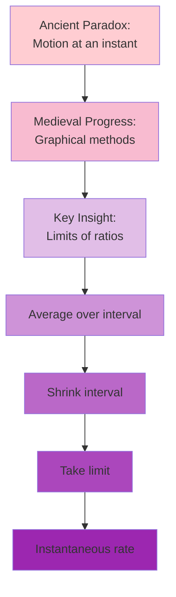
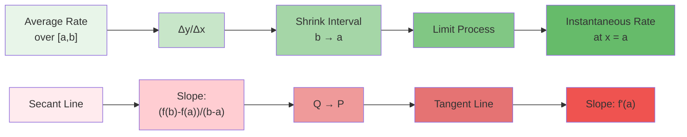
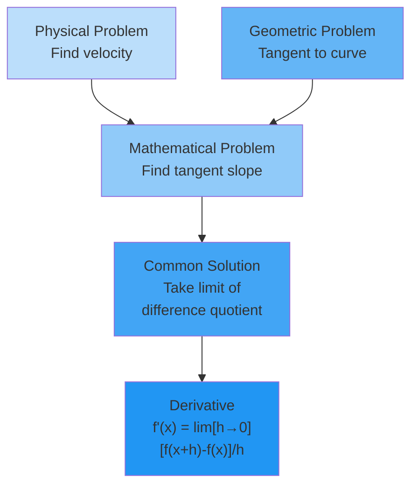
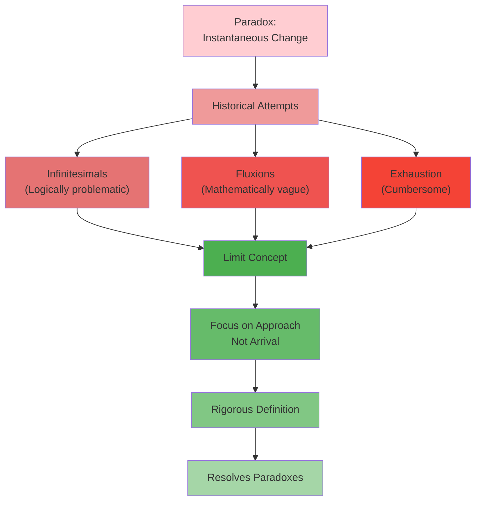
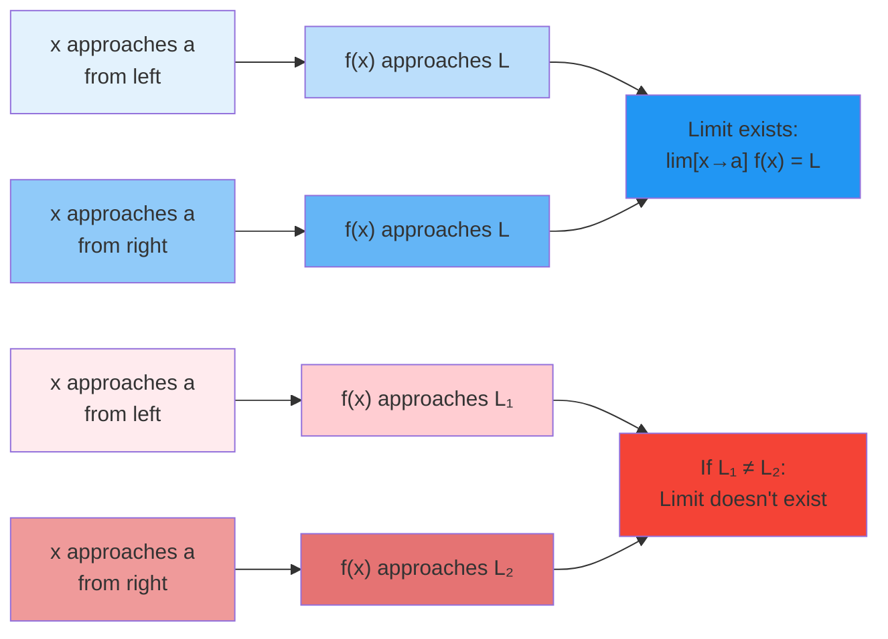
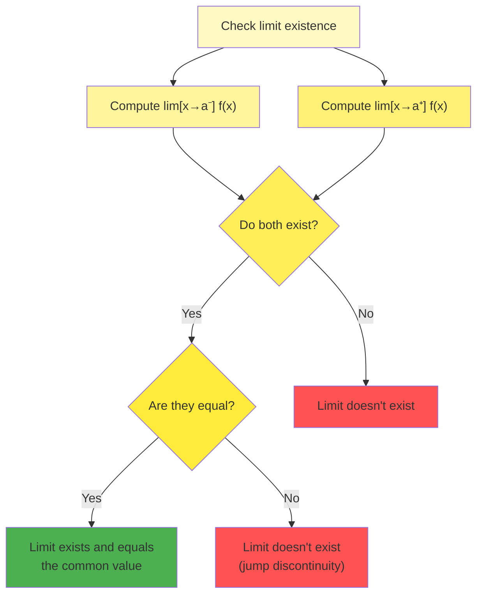
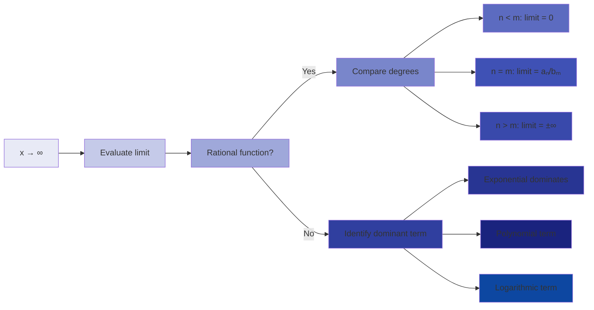

# C-1_2: Functions and Limits

4. The Tangent and Velocity Problems

    - Historical Paradoxes: Zeno, Motion, and Infinity
    - The Geometric Challenge: What Is a Tangent to a Curve?
    - From Average to Instantaneous: The Fundamental Insight
    - Secant Lines Approaching Tangent Lines: A Visual Journey
    - Velocity as a Tangent Problem: Unifying Geometry and Physics
    - The Birth of the Derivative Concept

5. The Limit of a Function

    - Why Limits? Resolving the Paradoxes of Calculus
    - Intuitive Understanding: Approaching Without Reaching
    - One-Sided Limits: Direction Matters
    - Two-Sided Limits and Their Existence
    - Infinite Limits: When Functions Explode
    - Limits at Infinity: End Behavior of Functions
    - When Limits Don't Exist: Oscillation and Jumps

#### The Tangent and Velocity Problems

The quest to understand motion and curves led to one of mathematics' greatest achievements: calculus. Two seemingly
different problems—finding the tangent to a curve and determining instantaneous velocity—turn out to be manifestations
of the same fundamental concept. This unity reveals the deep connections between geometry and physics that calculus
illuminates.

##### Historical Paradoxes: Zeno, Motion, and Infinity

Before we can appreciate the calculus solution, we must understand the paradoxes that puzzled thinkers for over two
millennia. Around 450 BCE, the Greek philosopher Zeno of Elea proposed several paradoxes that seemed to prove motion was
impossible.

**Zeno's Arrow Paradox**: Consider an arrow in flight. At any instant, the arrow occupies a specific position in space.
At that instant, it is not moving—it's simply there. But time consists of instants. If the arrow is motionless at every
instant, when does it move?

**Zeno's Dichotomy**: Before an object can travel a distance, it must travel half that distance. Before it can travel
half, it must travel a quarter. This process continues indefinitely, requiring an infinite number of steps to move any
distance. How can infinite steps be completed in finite time?

These paradoxes strike at the heart of understanding motion:

- How can we speak of velocity at an instant when velocity requires comparing positions at different times?
- How do we reconcile the discrete (instants) with the continuous (motion)?
- What does it mean for something to be "infinitely small" but not zero?

Ancient mathematicians lacked the tools to resolve these paradoxes rigorously. Aristotle distinguished between
"potential" and "actual" infinity, arguing that while we can indefinitely subdivide a line, we never actually create
infinite divisions. This philosophical approach, while insightful, didn't provide the mathematical precision needed.

**Medieval Contributions**: Scholars in the 14th century made progress:

- Nicole Oresme graphed velocity against time, visualizing motion geometrically
- The Oxford Calculators developed the mean speed theorem: distance traveled at uniformly accelerated motion equals
  distance at constant speed equal to the average velocity

Yet they still lacked a unified mathematical framework for instantaneous change.

**The Breakthrough Insight**: The resolution came with the realization that we need not consider motion at a single
instant, but rather the limit of average velocities over smaller and smaller time intervals. This limit process—the
foundation of calculus—finally provided the mathematical tools to handle the infinite and infinitesimal rigorously.

##### The Geometric Challenge: What Is a Tangent to a Curve?

For circles, the ancient Greeks knew a tangent was a line touching the circle at exactly one point. But what about more
general curves? The definition "a line that touches but doesn't cross" fails for curves like $y = x^3$ at the origin,
where the tangent crosses the curve.

**The Fundamental Problem**: Given a curve and a point on it, how do we find the tangent line? This question challenged
mathematicians because:

- Unlike circles, general curves don't have obvious geometric properties defining tangents
- The tangent seems to require information about the curve's direction at a single point
- Traditional geometry dealt with static figures, not rates of change

**Early Approaches**:

1. **Fermat's Method** (1630s): To find the tangent to $y = f(x)$ at $x = a$:
    - Consider a nearby point at $x = a + e$
    - The tangent approximately passes through both points
    - Set up equations and let $e$ approach 0
    - Extract the tangent's slope from the limiting process
2. **Descartes' Method**: Used algebraic techniques specific to each curve type
    - For algebraic curves, sought double roots
    - Ingenious but not general
3. **Barrow's Geometric Method**: Isaac Barrow (Newton's teacher) developed geometric constructions for tangents
    - Related the tangent problem to area problems
    - Glimpsed the fundamental theorem of calculus

**The Modern Definition**: The tangent line at point $P$ is the limiting position of secant lines through $P$ and nearby
points $Q$ as $Q$ approaches $P$.

This definition elegantly resolves all difficulties:

- Works for any smooth curve
- Captures the intuitive notion of the curve's direction
- Provides a computational method
- Connects geometry to limits

For a curve $y = f(x)$ and point $(a, f(a))$:

1. Take another point $(a + h, f(a + h))$
2. The secant line has slope $\frac{f(a + h) - f(a)}{h}$
3. As $h \to 0$, this approaches the tangent's slope
4. The tangent line: $y - f(a) = f'(a)(x - a)$

This geometric problem drove the development of differential calculus, showing how practical questions lead to profound
mathematical insights.

##### From Average to Instantaneous: The Fundamental Insight

The transition from average to instantaneous rates represents one of the most profound conceptual leaps in mathematics.
This insight unified numerous problems across mathematics and physics.

**Average Rate of Change**: For any function $f$ over interval $[a, b]$:
$$\text{Average rate} = \frac{f(b) - f(a)}{b - a}$$

This ratio measures the overall change relative to the interval length. Geometrically, it's the slope of the secant line
through $(a, f(a))$ and $(b, f(b))$.

**The Limiting Process**: To find instantaneous rate at $x = a$:

1. Consider average rate over $[a, a + h]$: $\frac{f(a + h) - f(a)}{h}$
2. Let $h$ approach 0
3. If the limit exists: $\lim_{h \to 0} \frac{f(a + h) - f(a)}{h} = f'(a)$

This limit captures the rate of change at the precise moment $x = a$.

**Why This Works**: Consider position function $s(t)$:

- Average velocity over $[t, t + h]$: $v_{avg} = \frac{s(t + h) - s(t)}{h}$
- As $h$ decreases, we get better approximations to velocity at time $t$
- The limit gives exact instantaneous velocity

**Numerical Illustration**: For $s(t) = t^2$ at $t = 3$:

| $h$   | $\frac{s(3 + h) - s(3)}{h}$ | $\frac{(3 + h)^2 - 9}{h}$      |
| ----- | --------------------------- | ------------------------------ |
| 1.0   | 7.0                         | $(16 - 9)/1 = 7$               |
| 0.1   | 6.1                         | $(9.61 - 9)/0.1 = 6.1$         |
| 0.01  | 6.01                        | $(9.0601 - 9)/0.01 = 6.01$     |
| 0.001 | 6.001                       | $(9.006001 - 9)/0.001 = 6.001$ |

The pattern suggests instantaneous velocity at $t = 3$ is 6 units per time.

**The Fundamental Insight**: Instantaneous rates are limits of average rates. This principle:

- Resolves Zeno's paradoxes by avoiding the need to consider motion "at an instant"
- Provides a computational method for finding rates
- Unifies geometric (tangent) and physical (velocity) problems
- Forms the foundation of differential calculus

##### Secant Lines Approaching Tangent Lines: A Visual Journey

The visual transition from secant to tangent lines provides geometric intuition for the limit process. This journey from
discrete approximations to continuous reality mirrors the historical development of calculus.

**The Secant Line**: Given points $P(a, f(a))$ and $Q(a + h, f(a + h))$ on curve $y = f(x)$:

- Secant line passes through both points
- Slope: $m_{sec} = \frac{f(a + h) - f(a)}{h}$
- Equation: $y - f(a) = m_{sec}(x - a)$

**The Approach to Tangency**: As $h \to 0$:

1. Point $Q$ slides along the curve toward $P$
2. The secant line rotates around $P$
3. The slope $m_{sec}$ approaches a limiting value
4. The limiting position is the tangent line

**Visual Demonstration**: Consider $f(x) = x^2$ at $x = 1$:

For $h = 1$: Secant through $(1, 1)$ and $(2, 4)$ has slope 3 For $h = 0.5$: Secant through $(1, 1)$ and $(1.5, 2.25)$
has slope 2.5 For $h = 0.1$: Secant through $(1, 1)$ and $(1.1, 1.21)$ has slope 2.1 For $h = 0.01$: Secant through
$(1, 1)$ and $(1.01, 1.0201)$ has slope 2.01

The limiting slope is 2, giving tangent line $y - 1 = 2(x - 1)$ or $y = 2x - 1$.

**Interactive Visualization** (conceptual):

As $h$ decreases:

- $h = 1.0$: Secant far from tangent
- $h = 0.5$: Secant closer
- $h = 0.1$: Secant very close
- $h = 0.01$: Secant nearly indistinguishable from tangent
- $h \to 0$: Secant becomes tangent

**Why Limits Are Necessary**: We cannot simply set $h = 0$ because:

- This would give $\frac{0}{0}$, which is undefined
- We need two distinct points to determine a line
- The tangent is inherently a limiting concept

**Geometric Properties**:

1. **Local Linearity**: Near the point of tangency, the curve is approximately linear
2. **Best Linear Approximation**: The tangent line is the best linear approximation to the curve at that point
3. **Instantaneous Direction**: The tangent shows the curve's instantaneous direction

**Applications of the Tangent Line**:

- **Optimization**: At maxima and minima, tangent lines are horizontal
- **Linear Approximation**: $f(x) \approx f(a) + f'(a)(x - a)$ near $x = a$
- **Newton's Method**: Uses tangent lines to find roots iteratively

The visual journey from secant to tangent makes the abstract limit process concrete, showing how calculus bridges the
discrete and continuous.

##### Velocity as a Tangent Problem: Unifying Geometry and Physics

The profound connection between tangent lines and velocity reveals the unity underlying calculus. What seems like a
geometric property (slope of tangent) and a physical concept (instantaneous velocity) are mathematically identical.

**Position-Time Graphs**: When we plot position $s$ versus time $t$:

- The curve represents the object's motion
- Average velocity = slope of secant line
- Instantaneous velocity = slope of tangent line

This correspondence transforms physics problems into geometry problems.

**The Unification**: For position function $s(t)$:

- Instantaneous velocity: $v(t) = \lim_{h \to 0} \frac{s(t + h) - s(t)}{h}$
- Slope of tangent to graph: $m = \lim_{h \to 0} \frac{s(t + h) - s(t)}{h}$

These are identical! The velocity at time $t$ equals the slope of the tangent line to the position-time graph at point
$(t, s(t))$.

**Example - Free Fall**: For an object dropped from rest:

- Position: $s(t) = \frac{1}{2}gt^2$ (where $g \approx 9.8$ m/s²)
- Velocity: $v(t) = \lim_{h \to 0} \frac{\frac{1}{2}g(t + h)^2 - \frac{1}{2}gt^2}{h}$

Expanding:
$\frac{\frac{1}{2}g(t^2 + 2th + h^2) - \frac{1}{2}gt^2}{h} = \frac{\frac{1}{2}g(2th + h^2)}{h} = gt + \frac{1}{2}gh$

As $h \to 0$: $v(t) = gt$

The tangent line to the parabola $s = \frac{1}{2}gt^2$ at time $t$ has slope $gt$—exactly the physics formula for
velocity!

**Deeper Connections**:

1. **Acceleration**: The rate of change of velocity
    - Second derivative of position
    - Related to curve's concavity
2. **Integration**: Inverse of differentiation
    - Area under velocity curve = change in position
    - Fundamental theorem connects derivatives and integrals
3. **Vector Calculus**: Extends to motion in multiple dimensions
    - Tangent vectors to curves in space
    - Velocity vectors in physics

**Historical Impact**: This unification:

- Enabled precise mathematical treatment of motion
- Led to Newton's laws of motion
- Provided tools for celestial mechanics
- Sparked the scientific revolution

The tangent-velocity connection exemplifies how mathematics reveals deep unities in nature. Seemingly disparate problems
share underlying mathematical structures, and recognizing these connections advances both mathematics and science.

##### The Birth of the Derivative Concept

The derivative emerged from the confluence of geometric and physical problems, crystallizing centuries of mathematical
thought into a single, powerful concept. This birth represents one of mathematics' greatest achievements.

**The Derivative Defined**: For a function $f$, the derivative at point $a$ is:
$$f'(a) = \lim_{h \to 0} \frac{f(a + h) - f(a)}{h}$$

when this limit exists.

**Multiple Interpretations**: The derivative simultaneously represents:

1. **Geometric**: Slope of the tangent line
2. **Physical**: Instantaneous rate of change
3. **Analytical**: Best linear approximation
4. **Algebraic**: Result of a limiting process

This multiplicity of meanings gives the derivative its power and wide applicability.

**Notation Systems**: Different notations emphasize different aspects:

- $f'(x)$ (Lagrange): Emphasizes derivative as a function
- $\frac{dy}{dx}$ (Leibniz): Suggests ratio of infinitesimals
- $\dot{y}$ (Newton): Common in physics for time derivatives
- $D_x f$ (Euler): Operator notation

**Existence and Differentiability**: Not all functions have derivatives everywhere:

- Corners: $f(x) = |x|$ has no derivative at $x = 0$
- Cusps: $f(x) = x^{2/3}$ has vertical tangent at $x = 0$
- Discontinuities: Jumps prevent derivatives

A function is differentiable at $a$ if $f'(a)$ exists. Differentiability implies continuity, but not conversely.

**Computing Derivatives**: Basic derivatives form building blocks:

- Constants: $(c)' = 0$
- Powers: $(x^n)' = nx^{n-1}$
- Exponentials: $(e^x)' = e^x$
- Trigonometric: $(\sin x)' = \cos x$, $(\cos x)' = -\sin x$

**Rules of Differentiation**: These allow computing complex derivatives:

1. **Linearity**: $(af + bg)' = af' + bg'$
2. **Product Rule**: $(fg)' = f'g + fg'$
3. **Quotient Rule**: $(f/g)' = \frac{f'g - fg'}{g^2}$
4. **Chain Rule**: $(f \circ g)' = (f' \circ g) \cdot g'$

**The Derivative Function**: Since $f'(a)$ can be computed for any $a$ in the domain where the limit exists, we get a
new function $f'$ - the derivative function.

This function tells us the rate of change at every point, providing a complete picture of how the original function
changes.

**Revolutionary Impact**: The derivative concept:

- Solved ancient problems (tangents, velocity)
- Enabled new mathematics (differential equations)
- Provided tools for physics (mechanics, electromagnetism)
- Led to optimization theory
- Opened doors to functional analysis

**Modern Extensions**:

- Partial derivatives for multivariable functions
- Directional derivatives
- Fractional derivatives
- Derivatives in abstract spaces

The birth of the derivative marked the beginning of modern analysis, providing a rigorous foundation for studying
change. From this single concept flows much of modern mathematics and its applications in science, engineering, and
beyond.

The journey from Zeno's paradoxes to the derivative shows how mathematical concepts evolve: practical problems inspire
new ideas, which are refined through centuries of thought, finally crystallizing into precise definitions that unlock
new realms of understanding.

#### The Limit of a Function

The concept of a limit provides the foundation upon which all of calculus is built. It allows us to discuss what happens
to function values as inputs approach particular values, even when the function might not be defined at those points.
This seemingly simple idea resolves ancient paradoxes and enables the rigorous treatment of instantaneous change.

##### Why Limits? Resolving the Paradoxes of Calculus

Before calculus, mathematicians faced seemingly insurmountable contradictions when trying to understand instantaneous
change and continuous motion. The limit concept emerged as the key to resolving these paradoxes.

**The Fundamental Problem**: Consider these challenging questions:

- What is the velocity of an object at a specific instant?
- What is the slope of a curve at a single point?
- What is the area under a curve?
- What happens to $\frac{\sin x}{x}$ when $x = 0$?

Each question involves a process that seems impossible:

- Velocity requires comparing positions at different times, but an instant has no duration
- Slope requires two points, but we have only one
- Area requires summing infinitely many infinitesimally thin rectangles
- Direct substitution in $\frac{\sin x}{x}$ gives $\frac{0}{0}$, which is undefined

**Pre-Calculus Attempts**: Historical approaches included:

1. **Infinitesimals**: Leibniz used "infinitely small" quantities
    - Intuitive but logically problematic
    - What is a number "infinitely close" to zero but not zero?
2. **Fluxions**: Newton's "flowing quantities"
    - Useful for physics but mathematically vague
    - How fast does a quantity "flow"?
3. **Exhaustion**: Ancient Greek method
    - Rigorous but cumbersome
    - Required separate proofs for each problem

**The Limit Solution**: Limits avoid these philosophical difficulties by focusing on the approach rather than arrival:

- We don't need velocity at an instant; we need the limit of average velocities
- We don't need the slope through one point; we need the limit of secant slopes
- We don't need to add infinite rectangles; we need the limit of finite sums
- We don't evaluate $\frac{\sin x}{x}$ at $x = 0$; we find the limit as $x \to 0$

**Example - Resolving $\frac{0}{0}$**: Consider $\lim_{x \to 2} \frac{x^2 - 4}{x - 2}$

Direct substitution gives $\frac{0}{0}$, but factoring:
$$\frac{x^2 - 4}{x - 2} = \frac{(x-2)(x+2)}{x-2} = x + 2 \text{ for } x \neq 2$$

So $\lim_{x \to 2} \frac{x^2 - 4}{x - 2} = \lim_{x \to 2} (x + 2) = 4$

The limit exists even though the function is undefined at $x = 2$!

**The Power of Limits**: Limits provide:

1. **Rigor**: Precise definitions replace vague intuitions
2. **Generality**: One concept handles many different problems
3. **Computability**: Systematic methods for calculation
4. **Foundation**: Base for derivatives, integrals, and series

The limit concept transforms calculus from a collection of clever tricks into a coherent mathematical theory.

##### Intuitive Understanding: Approaching Without Reaching

Before diving into formal definitions, let's build intuition about what limits really mean. The key insight: limits
describe the behavior of functions near a point, not necessarily at the point.

**The Basic Idea**: The statement $\lim_{x \to a} f(x) = L$ means: "As $x$ gets arbitrarily close to $a$ (but not equal
to $a$), $f(x)$ gets arbitrarily close to $L$"

**Key Aspects**:

1. **Approaching**: We consider values of $x$ near $a$, not $x = a$ itself
2. **Arbitrarily Close**: For any desired closeness to $L$, we can get $f(x)$ that close
3. **From Both Sides**: We consider $x$ approaching from both left and right 4. **Independence from $f(a) $**: The value
   $f(a) $ might not exist or might differ from $L $

**Visual Intuition**: Imagine walking along the graph of $f(x)$ from both directions toward $x = a$:

- From the left: Follow the curve as $x$ increases toward $a$
- From the right: Follow the curve as $x$ decreases toward $a$
- If both paths lead to the same height $L$, then $\lim_{x \to a} f(x) = L$

**Examples Building Intuition**:

1. **Simple Limit**: $\lim_{x \to 3} (2x + 1) = 7$
    - As $x$ approaches 3, $2x + 1$ approaches $2(3) + 1 = 7$
    - We can verify: when $x = 2.9$, $f(x) = 6.8$; when $x = 3.1$, $f(x) = 7.2$
2. **Limit Differs from Function Value**: Define
   $$f(x) = \begin{cases} x + 1 & \text{if } x \neq 2 \ 5 & \text{if } x = 2 \end{cases}$$ Then
   $\lim_{x \to 2} f(x) = 3$ even though $f(2) = 5$
3. **Limit Where Function Undefined**: $\lim_{x \to 0} \frac{\sin x}{x} = 1$
    - The function is undefined at $x = 0$
    - But as $x$ approaches 0, the ratio approaches 1

**The "Challenge-Response" Game**: Think of limits as a game:

- Challenger: "I want $f(x)$ within 0.01 of $L$"
- Responder: "Stay within 0.005 of $a$"
- If the responder can always meet any challenge, the limit exists

This game captures the essence of the formal $\epsilon$-$\delta$ definition.

**Common Misconceptions**:

1. "The limit is the value at the point" - No, it's the value approached
2. "Limits always equal the function value" - Not necessarily
3. "We reach the limit" - We approach but never need to reach
4. "Limits are approximations" - Limits are exact values

**Graphical Indicators**: On a graph, look for:

- Continuous approach to a value
- No sudden jumps near the point
- Same height approached from both sides

##### One-Sided Limits: Direction Matters

Sometimes functions behave differently when approached from different directions. One-sided limits capture this
directional behavior, providing a more nuanced understanding of function behavior near discontinuities.

**Left-Hand Limit**: $\lim_{x \to a^-} f(x) = L$ means:

- Consider only $x < a$ approaching $a$
- As $x$ increases toward $a$, $f(x)$ approaches $L$
- Notation: $a^-$ indicates approach from the left

**Right-Hand Limit**: $\lim_{x \to a^+} f(x) = L$ means:

- Consider only $x > a$ approaching $a$
- As $x$ decreases toward $a$, $f(x)$ approaches $L$
- Notation: $a^+$ indicates approach from the right

**Relationship to Two-Sided Limits**:
$$\lim_{x \to a} f(x) = L \text{ if and only if } \lim_{x \to a^-} f(x) = \lim_{x \to a^+} f(x) = L$$

The two-sided limit exists only when both one-sided limits exist and are equal.

**Examples Illustrating One-Sided Limits**:

1. **Step Function**: $$f(x) = \begin{cases} 1 & \text{if } x < 0 \ 2 & \text{if } x \geq 0 \end{cases}$$
    - $\lim_{x \to 0^-} f(x) = 1$ (approaching from negative values)
    - $\lim_{x \to 0^+} f(x) = 2$ (approaching from positive values)
    - $\lim_{x \to 0} f(x)$ does not exist (one-sided limits differ)
2. **Absolute Value Function**: $f(x) = |x|$
    - $\lim_{x \to 0^-} |x| = 0$ (as $x \to 0$ from left, $|x| = -x \to 0$)
    - $\lim_{x \to 0^+} |x| = 0$ (as $x \to 0$ from right, $|x| = x \to 0$)
    - $\lim_{x \to 0} |x| = 0$ (one-sided limits agree)
3. **Reciprocal Function**: $f(x) = \frac{1}{x}$
    - $\lim_{x \to 0^-} \frac{1}{x} = -\infty$ (negative values grow in magnitude)
    - $\lim_{x \to 0^+} \frac{1}{x} = +\infty$ (positive values grow)
    - $\lim_{x \to 0} \frac{1}{x}$ does not exist (different infinities)

**Applications of One-Sided Limits**:

1. **Piecewise Functions**: Analyze behavior at transition points
2. **Jump Discontinuities**: Measure the "size" of jumps
3. **Removable Discontinuities**: Identify where functions can be "fixed"
4. **Asymptotic Behavior**: Understand approach to vertical asymptotes

**Computing One-Sided Limits**: Use the same techniques as two-sided limits, but restrict the domain:

- For left-hand limits, only consider $x < a$
- For right-hand limits, only consider $x > a$

Example: Find $\lim_{x \to 2^+} \frac{|x - 2|}{x - 2}$

For $x > 2$: $x - 2 > 0$, so $|x - 2| = x - 2$ Therefore: $\frac{|x - 2|}{x - 2} = \frac{x - 2}{x - 2} = 1$ So:
$\lim_{x \to 2^+} \frac{|x - 2|}{x - 2} = 1$

For comparison: $\lim_{x \to 2^-} \frac{|x - 2|}{x - 2} = -1$

**Practical Importance**: One-sided limits are essential for:

- Defining derivatives at endpoints of intervals
- Understanding function behavior at boundaries
- Analyzing physical systems with different behaviors in different regions
- Fourier series at points of discontinuity

##### Two-Sided Limits and Their Existence

The standard limit concept requires agreement from both directions. Understanding when limits exist—and when they
don't—is crucial for analyzing function behavior.

**Existence Criteria**: $\lim_{x \to a} f(x) = L$ exists if and only if:

1. $\lim_{x \to a^-} f(x)$ exists
2. $\lim_{x \to a^+} f(x)$ exists
3. $\lim_{x \to a^-} f(x) = \lim_{x \to a^+} f(x) = L$

All three conditions must hold for the two-sided limit to exist.

**Ways Limits Can Fail to Exist**:

1. **Jump Discontinuity**: Different one-sided limits Example:
   $f(x) = \begin{cases} x & \text{if } x < 1 \ x + 2 & \text{if } x \geq 1 \end{cases}$
    - Left limit at 1: $\lim_{x \to 1^-} f(x) = 1$
    - Right limit at 1: $\lim_{x \to 1^+} f(x) = 3$
    - Two-sided limit doesn't exist
2. **Infinite Discontinuity**: One or both one-sided limits are infinite Example: $f(x) = \frac{1}{x^2}$ at $x = 0$
    - Both one-sided limits are $+\infty$
    - We say the limit doesn't exist (in the real numbers)
3. **Oscillatory Behavior**: Function oscillates rapidly Example: $f(x) = \sin\left(\frac{1}{x}\right)$ at $x = 0$
    - As $x \to 0$, function oscillates between -1 and 1 infinitely often
    - Neither one-sided limit exists
4. **Essential Discontinuity**: Chaotic behavior Example:
   $f(x) = \begin{cases} 1 & \text{if } x \text{ is rational} \ 0 & \text{if } x \text{ is irrational} \end{cases}$
    - Near any point, function jumps between 0 and 1
    - No limits exist anywhere

**Testing for Existence**: Systematic approach:

1. Check if function is defined near (but not necessarily at) the point
2. Compute left-hand limit
3. Compute right-hand limit
4. Compare the two one-sided limits

**Example - Complete Analysis**: Analyze $\lim_{x \to 2} \frac{x^2 - 4}{|x - 2|}$

For $x < 2$: $|x - 2| = -(x - 2) = 2 - x$
$$\lim_{x \to 2^-} \frac{x^2 - 4}{|x - 2|} = \lim_{x \to 2^-} \frac{(x-2)(x+2)}{2-x} = \lim_{x \to 2^-} \frac{(x-2)(x+2)}{-(x-2)} = \lim_{x \to 2^-} -(x+2) = -4$$

For $x > 2$: $|x - 2| = x - 2$
$$\lim_{x \to 2^+} \frac{x^2 - 4}{|x - 2|} = \lim_{x \to 2^+} \frac{(x-2)(x+2)}{x-2} = \lim_{x \to 2^+} (x+2) = 4$$

Since $-4 \neq 4$, the two-sided limit doesn't exist.

##### Infinite Limits: When Functions Explode

When function values grow without bound as $x$ approaches a value, we use infinite limits to describe this behavior.
Though we say "the limit is infinity," technically the limit doesn't exist in the real number system—infinity is not a
real number but rather a description of unbounded behavior.

**Positive Infinity**: $\lim_{x \to a} f(x) = +\infty$ means:

- As $x$ approaches $a$, $f(x)$ increases without bound
- For any $M > 0$, we can make $f(x) > M$ by taking $x$ close enough to $a$

**Negative Infinity**: $\lim_{x \to a} f(x) = -\infty$ means:

- As $x$ approaches $a$, $f(x)$ decreases without bound
- For any $M < 0$, we can make $f(x) < M$ by taking $x$ close enough to $a$

**Vertical Asymptotes**: When $\lim_{x \to a} f(x) = \pm\infty$, the line $x = a$ is a vertical asymptote. The graph
approaches this vertical line but never touches it.

**Examples of Infinite Limits**:

1. **Simple Rational Function**: $f(x) = \frac{1}{x}$
    - $\lim_{x \to 0^+} \frac{1}{x} = +\infty$ (positive values grow)
    - $\lim_{x \to 0^-} \frac{1}{x} = -\infty$ (negative values decrease)
    - Vertical asymptote at $x = 0$
2. **Even Powers**: $f(x) = \frac{1}{x^2}$
    - $\lim_{x \to 0^+} \frac{1}{x^2} = +\infty$
    - $\lim_{x \to 0^-} \frac{1}{x^2} = +\infty$
    - Both sides approach positive infinity
3. **Logarithmic Function**: $f(x) = \ln(x)$
    - $\lim_{x \to 0^+} \ln(x) = -\infty$
    - Vertical asymptote at $x = 0$
    - Only defined for $x > 0$

**One-Sided Infinite Limits**: Often necessary when behavior differs by direction:
$$\lim_{x \to 2^-} \frac{1}{x-2} = -\infty \quad \text{and} \quad \lim_{x \to 2^+} \frac{1}{x-2} = +\infty$$

**Arithmetic with Infinity**: Informal rules (use with caution):

- $\infty + \infty = \infty$
- $\infty \cdot \infty = \infty$
- $\frac{k}{\infty} = 0$ for finite $k$
- $\frac{\infty}{k} = \infty$ for positive finite $k$

**Indeterminate Forms**: These require careful analysis:

- $\infty - \infty$
- $\frac{\infty}{\infty}$
- $0 \cdot \infty$
- $\infty^0$

**Determining Infinite Limits**: Look for:

1. Denominators approaching zero
2. Sign of expressions near the limit point
3. Behavior of numerator

Example: Find $\lim_{x \to 3} \frac{x^2 - 9}{(x-3)^2}$

Factor: $\frac{x^2 - 9}{(x-3)^2} = \frac{(x-3)(x+3)}{(x-3)^2} = \frac{x+3}{x-3}$

As $x \to 3^+$: numerator $\to 6$, denominator $\to 0^+$, so limit is $+\infty$ As $x \to 3^-$: numerator $\to 6$,
denominator $\to 0^-$, so limit is $-\infty$

**Physical Interpretation**: Infinite limits often represent:

- Singularities in physical systems
- Asymptotic behavior
- Phase transitions
- Resonance phenomena

##### Limits at Infinity: End Behavior of Functions

While infinite limits describe vertical asymptotes, limits at infinity describe horizontal asymptotes and end
behavior—what happens to $f(x)$ as $x$ grows very large (positive or negative).

**Definition**: $\lim_{x \to \infty} f(x) = L$ means:

- As $x$ increases without bound, $f(x)$ approaches $L$
- For any $\epsilon > 0$, there exists $N$ such that if $x > N$, then $|f(x) - L| < \epsilon$

Similarly for $\lim_{x \to -\infty} f(x) = L$ with $x < -N$.

**Horizontal Asymptotes**: If $\lim_{x \to \infty} f(x) = L$ or $\lim_{x \to -\infty} f(x) = L$, then $y = L$ is a
horizontal asymptote.

**Key Examples**:

1. **Exponential Decay**: $\lim_{x \to \infty} e^{-x} = 0$
    - Exponential functions approach 0 rapidly
    - Horizontal asymptote at $y = 0$
2. **Rational Functions**: For $f(x) = \frac{a_nx^n + \ldots + a_0}{b_mx^m + \ldots + b_0}$
    - If $n < m$: $\lim_{x \to \pm\infty} f(x) = 0$
    - If $n = m$: $\lim_{x \to \pm\infty} f(x) = \frac{a_n}{b_m}$
    - If $n > m$: Limit is $\pm\infty$ (no horizontal asymptote)
3. **Arctangent**: $\lim_{x \to \infty} \arctan(x) = \frac{\pi}{2}$ and
   $\lim_{x \to -\infty} \arctan(x) = -\frac{\pi}{2}$
    - Different horizontal asymptotes on each side

**Techniques for Evaluating**:

1. **Divide by Highest Power**: For rational functions Example: $\lim_{x \to \infty} \frac{3x^2 + 5x - 2}{2x^2 - x + 7}$

    Divide numerator and denominator by $x^2$:
    $$\lim_{x \to \infty} \frac{3 + \frac{5}{x} - \frac{2}{x^2}}{2 - \frac{1}{x} + \frac{7}{x^2}} = \frac{3 + 0 - 0}{2 - 0 + 0} = \frac{3}{2}$$

2. **Dominant Terms**: Focus on fastest-growing terms Example: $\lim_{x \to \infty} (e^x + x^{100})$ Since $e^x$ grows
   faster than any polynomial, the limit is $+\infty$

3. **Squeeze Theorem**: Bound the function Example: $\lim_{x \to \infty} \frac{\sin(x)}{x} = 0$ Since
   $-1 \leq \sin(x) \leq 1$, we have $\frac{-1}{x} \leq \frac{\sin(x)}{x} \leq \frac{1}{x}$ As $x \to \infty$, both
   bounds approach 0

**Growth Rates**: Understanding relative growth rates helps evaluate limits:

- Logarithmic < Polynomial < Exponential
- $\ln(x) < x^a < b^x$ for $a > 0, b > 1$

##### When Limits Don't Exist: Oscillation and Jumps

Understanding when and why limits fail to exist is as important as computing limits that do exist. There are several
distinct ways a limit can fail to exist, each revealing different function behaviors.

**Types of Non-Existence**:

1. **Jump Discontinuity**: One-sided limits exist but differ
    - Function "jumps" between values
    - Common in piecewise functions
    - Example: Greatest integer function $\lfloor x \rfloor$ at integers
2. **Oscillatory Non-Existence**: Function oscillates without settling
    - No limiting value from either side
    - Frequency of oscillation increases
    - Example: $\sin(1/x)$ as $x \to 0$
3. **Infinite Oscillation with Varying Amplitude**:
    - Example: $x\sin(1/x)$ oscillates but is bounded by $|x|$
    - Actually has limit 0 by Squeeze Theorem
    - Contrast with $\sin(1/x)$ which has no limit
4. **Essential Discontinuity**: Chaotic behavior
    - No pattern to function values
    - Example: Dirichlet function (1 on rationals, 0 on irrationals)

**Detailed Examples**:

1. **Simple Oscillation**: $f(x) = \sin\left(\frac{1}{x}\right)$ near $x = 0$

    As $x \to 0$:

    - When $x = \frac{1}{n\pi}$, $f(x) = \sin(n\pi) = 0$
    - When $x = \frac{1}{(n + \frac{1}{2})\pi}$, $f(x) = \pm 1$
    - Function oscillates between -1 and 1 infinitely often
    - No limit exists

2. **Damped Oscillation**: $g(x) = x\sin\left(\frac{1}{x}\right)$ near $x = 0$

    Using Squeeze Theorem:

    - $-1 \leq \sin(1/x) \leq 1$
    - $-|x| \leq x\sin(1/x) \leq |x|$
    - Since $\lim_{x \to 0} |x| = 0$, we get $\lim_{x \to 0} x\sin(1/x) = 0$
    - Oscillation is "controlled" by the factor $x$

3. **Rational Points**: Consider
   $$h(x) = \begin{cases} x & \text{if } x \text{ is rational} \ -x & \text{if } x \text{ is irrational} \end{cases}$$

    At $x = 0$:

    - Along rationals: approaches 0
    - Along irrationals: approaches 0
    - Limit exists and equals 0!

    But at any $a \neq 0$:

    - Along rationals: approaches $a$
    - Along irrationals: approaches $-a$
    - No limit exists

**Graphical Signatures**:

- Jump: Sudden vertical gap in graph
- Oscillation: Increasingly rapid wiggling
- Essential: No discernible pattern

**Testing Strategies**:

1. Check one-sided limits first
2. Look for oscillatory terms like $\sin(1/x)$, $\cos(1/x)$
3. Consider behavior along special sequences
4. Apply definition directly when needed

**Sequential Criterion**: A powerful tool for proving non-existence: If sequences ${a_n}$ and ${b_n}$ both approach $c$
but $\lim_{n \to \infty} f(a_n) \neq \lim_{n \to \infty} f(b_n)$, then $\lim_{x \to c} f(x)$ doesn't exist.

Example: For $\sin(1/x)$ at $x = 0$:

- Let $a_n = \frac{1}{2n\pi}$, then $f(a_n) = \sin(2n\pi) = 0$
- Let $b_n = \frac{1}{(2n + \frac{1}{2})\pi}$, then $f(b_n) = \sin((2n + \frac{1}{2})\pi) = 1$
- Different limits prove overall limit doesn't exist

**Philosophical Note**: Non-existence of limits isn't a "failure" but rather reveals rich function behavior. These cases
often correspond to interesting physical phenomena:

- Jump discontinuities model phase transitions
- Oscillations appear in resonance and interference
- Essential discontinuities arise in chaotic systems

Understanding when limits don't exist deepens our appreciation of function behavior and the power of the limit concept
to capture subtle distinctions in mathematical behavior.
