# C-1_3: Functions and Limits


#### Calculating Limits Using the Limit Laws

While understanding limits conceptually is crucial, we also need practical tools for computation. The limit laws provide
algebraic rules that transform complex limit problems into simpler ones, allowing systematic evaluation without always
returning to the definition.

##### Basic Limit Rules and Algebraic Properties

The limit laws are the workhorses of limit calculation. These rules, proven from the formal definition, allow us to
break complex expressions into manageable pieces.

**Fundamental Limit Laws**: If $\lim_{x \to a} f(x) = L$ and $\lim_{x \to a} g(x) = M$, then:

1. **Constant Rule**: $\lim_{x \to a} c = c$ for any constant $c$
    - Constants don't change as $x$ varies
2. **Identity Rule**: $\lim_{x \to a} x = a$
    - The limit of $x$ as $x$ approaches $a$ is simply $a$
3. **Sum Rule**: $\lim_{x \to a} [f(x) + g(x)] = L + M$
    - Limits distribute over addition
4. **Difference Rule**: $\lim_{x \to a} [f(x) - g(x)] = L - M$
    - Limits distribute over subtraction
5. **Constant Multiple Rule**: $\lim_{x \to a} [c \cdot f(x)] = c \cdot L$
    - Constants factor out of limits
6. **Product Rule**: $\lim_{x \to a} [f(x) \cdot g(x)] = L \cdot M$
    - Limits distribute over multiplication
7. **Quotient Rule**: $\lim_{x \to a} \frac{f(x)}{g(x)} = \frac{L}{M}$, provided $M \neq 0$
    - Limits distribute over division (with restriction)
8. **Power Rule**: $\lim_{x \to a} [f(x)]^n = L^n$ for positive integer $n$
    - Can extend to rational exponents when appropriate
9. **Root Rule**: $\lim_{x \to a} \sqrt[n]{f(x)} = \sqrt[n]{L}$
    - For even $n$, require $L \geq 0$

**Substitution Property**: If $f$ is continuous at $a$, then $\lim_{x \to a} f(x) = f(a)$

- For continuous functions, just substitute!

**Example Calculations**:

1. **Polynomial Limit**: Find $\lim_{x \to 2} (3x^2 - 5x + 7)$

    Using limit laws:
    $$\begin{align} \lim_{x \to 2} (3x^2 - 5x + 7) &= \lim_{x \to 2} (3x^2) - \lim_{x \to 2} (5x) + \lim_{x \to 2} 7 \ &= 3 \lim_{x \to 2} x^2 - 5 \lim_{x \to 2} x + 7 \ &= 3(2)^2 - 5(2) + 7 \ &= 12 - 10 + 7 = 9 \end{align}$$

2. **Rational Function**: Find $\lim_{x \to 3} \frac{x^2 + 2x}{x - 1}$

    Check denominator: $3 - 1 = 2 \neq 0$, so we can use quotient rule:
    $$\lim_{x \to 3} \frac{x^2 + 2x}{x - 1} = \frac{\lim_{x \to 3} (x^2 + 2x)}{\lim_{x \to 3} (x - 1)} = \frac{9 + 6}{2} = \frac{15}{2}$$

3. **Combination**: Find $\lim_{x \to 1} \sqrt{3x + 1} \cdot (x^2 - 1)$

    $$\begin{align} &= \lim_{x \to 1} \sqrt{3x + 1} \cdot \lim_{x \to 1} (x^2 - 1) \ &= \sqrt{3(1) + 1} \cdot (1^2 - 1) \ &= \sqrt{4} \cdot 0 = 2 \cdot 0 = 0 \end{align}$$

**When Basic Rules Fail**: The limit laws require that component limits exist. When they don't, we need other
techniques:

Example: $\lim_{x \to 0} \frac{\sin x}{x}$

- Can't use quotient rule directly (denominator approaches 0)
- Need special techniques (coming in later sections)

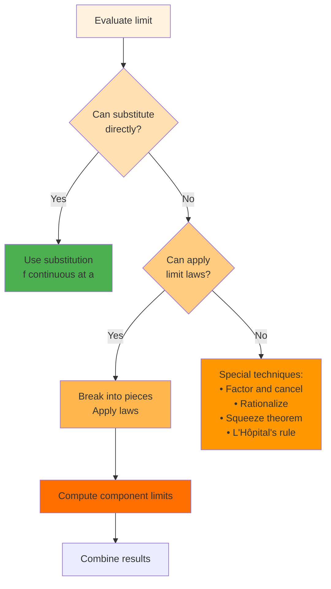

**Common Patterns**:

1. **Polynomial Functions**: Always continuous, so use direct substitution
2. **Rational Functions**: Check if denominator is zero at limit point
3. **Composite Functions**: If $g$ is continuous at $a$ and $f$ is continuous at $g(a)$, then
   $\lim_{x \to a} f(g(x)) = f(g(a))$

**Warnings**:

- Don't assume $\lim[f(x) + g(x)] = \lim f(x) + \lim g(x)$ without verifying individual limits exist
- The quotient rule requires denominator limit ≠ 0
- Indeterminate forms need special treatment

The limit laws transform limit evaluation from a conceptual challenge to an algebraic exercise—when they apply.
Mastering both their use and limitations is essential for calculus.

##### The Squeeze Theorem and Bounding Techniques

The Squeeze Theorem (also called the Sandwich Theorem or Pinching Theorem) provides a powerful technique for finding
limits of functions that are difficult to evaluate directly. By trapping a function between two simpler functions with
the same limit, we can deduce the limit of the trapped function.

**The Squeeze Theorem**: If $g(x) \leq f(x) \leq h(x)$ for all $x$ in some interval containing $a$ (except possibly at
$a$), and $\lim_{x \to a} g(x) = \lim_{x \to a} h(x) = L$, then $\lim_{x \to a} f(x) = L$.

**Intuition**: If $f(x)$ is squeezed between two functions that approach the same value, $f(x)$ must approach that value
too.

**Classic Example**: Prove $\lim_{x \to 0} x^2 \sin\left(\frac{1}{x}\right) = 0$

Solution:

1. Note that $-1 \leq \sin\left(\frac{1}{x}\right) \leq 1$ for all $x \neq 0$
2. Multiply by $x^2$ (which is non-negative): $-x^2 \leq x^2 \sin\left(\frac{1}{x}\right) \leq x^2$
3. We have $\lim_{x \to 0} (-x^2) = 0$ and $\lim_{x \to 0} x^2 = 0$
4. By the Squeeze Theorem: $\lim_{x \to 0} x^2 \sin\left(\frac{1}{x}\right) = 0$

**Key Steps in Applying the Squeeze Theorem**:

1. Identify useful bounds for the difficult part
2. Multiply/manipulate to bound the entire expression
3. Verify the bounds have the same limit
4. Apply the theorem

**More Examples**:

1. **Bounded Oscillation**: Find $\lim_{x \to 0} x \cos\left(\frac{1}{x^2}\right)$

    - Know: $-1 \leq \cos\left(\frac{1}{x^2}\right) \leq 1$
    - So: $-|x| \leq x \cos\left(\frac{1}{x^2}\right) \leq |x|$
    - Since $\lim_{x \to 0} |x| = 0$, the limit is 0

2. **Asymptotic Behavior**: Find $\lim_{x \to \infty} \frac{\sin x}{x}$

    - Know: $-1 \leq \sin x \leq 1$
    - So: $\frac{-1}{x} \leq \frac{\sin x}{x} \leq \frac{1}{x}$ for $x > 0$
    - As $x \to \infty$: both $\frac{-1}{x}$ and $\frac{1}{x}$ approach 0
    - Therefore: $\lim_{x \to \infty} \frac{\sin x}{x} = 0$

3. **Polynomial Bounds**: Find $\lim_{x \to 0} x^4 \left\lfloor\frac{1}{x}\right\rfloor$

    - For $x > 0$: $\frac{1}{x} - 1 < \left\lfloor\frac{1}{x}\right\rfloor \leq \frac{1}{x}$
    - Multiply by $x^4$: $x^3 - x^4 < x^4 \left\lfloor\frac{1}{x}\right\rfloor \leq x^3$
    - Both bounds approach 0, so the limit is 0

**Creating Bounds**: Strategies for finding useful bounds:

1. **Trigonometric Functions**: Use $|\sin \theta| \leq 1$, $|\cos \theta| \leq 1$
2. **Absolute Values**: $|f(x)| \geq 0$ always
3. **Known Inequalities**:
    - $\sin x < x < \tan x$ for $0 < x < \pi/2$
    - $e^x \geq 1 + x$ for all $x$
    - $\ln(1 + x) \leq x$ for $x > -1$

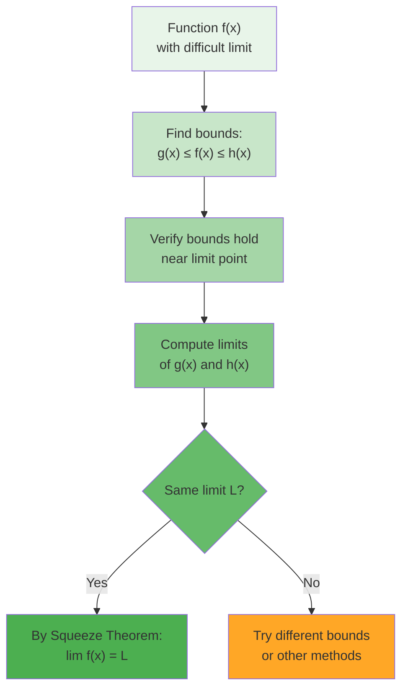

**Extensions and Variations**:

1. **One-Sided Squeeze**: Can apply to one-sided limits
2. **Infinite Limits**: If $g(x) \to \infty$ and $f(x) \geq g(x)$, then $f(x) \to \infty$
3. **Sequences**: Similar theorem for sequences

**Common Pitfall**: The bounds must have the same limit. Having $0 \leq f(x) \leq x$ doesn't help find
$\lim_{x \to 1} f(x)$ since the bounds have different limits (0 and 1).

The Squeeze Theorem exemplifies a general mathematical strategy: when direct computation is difficult, establish bounds
and analyze those instead. This technique appears throughout analysis and provides a bridge between inequalities and
limits.

##### Trigonometric Limits and Special Values

Certain limits involving trigonometric functions appear so frequently in calculus that they deserve special attention.
These limits are essential for finding derivatives of trigonometric functions and solving many practical problems.

**The Fundamental Trigonometric Limit**: $\lim_{x \to 0} \frac{\sin x}{x} = 1$

This limit cannot be evaluated using basic limit laws (we get $\frac{0}{0}$). The proof uses geometric reasoning:

**Geometric Proof** (for $0 < x < \pi/2$):

1. In a unit circle, consider angle $x$ (in radians)
2. We have: $\sin x <$ arc length $= x <$ $\tan x$
3. Dividing by $\sin x$: $1 < \frac{x}{\sin x} < \frac{1}{\cos x}$
4. Taking reciprocals: $\cos x < \frac{\sin x}{x} < 1$
5. As $x \to 0^+$: $\cos x \to 1$, so by Squeeze Theorem, $\frac{\sin x}{x} \to 1$
6. By symmetry, the same holds as $x \to 0^-$

**Related Important Limits**:

1. **Cosine Limit**: $\lim_{x \to 0} \frac{1 - \cos x}{x} = 0$

    Proof using the identity $1 - \cos x = 2\sin^2(x/2)$:
    $$\frac{1 - \cos x}{x} = \frac{2\sin^2(x/2)}{x} = \sin(x/2) \cdot \frac{\sin(x/2)}{x/2}$$ As $x \to 0$, this
    approaches $0 \cdot 1 = 0$

2. **Squared Version**: $\lim_{x \to 0} \frac{1 - \cos x}{x^2} = \frac{1}{2}$

    $$\frac{1 - \cos x}{x^2} = \frac{2\sin^2(x/2)}{x^2} = \frac{1}{2} \left(\frac{\sin(x/2)}{x/2}\right)^2 \to \frac{1}{2}$$

3. **Tangent Limit**: $\lim_{x \to 0} \frac{\tan x}{x} = 1$

    $$\frac{\tan x}{x} = \frac{\sin x}{x} \cdot \frac{1}{\cos x} \to 1 \cdot 1 = 1$$

**Variations and Extensions**:

1. **Scaled Arguments**: $\lim_{x \to 0} \frac{\sin(ax)}{x} = a$

    Let $u = ax$, then as $x \to 0$, $u \to 0$:
    $$\frac{\sin(ax)}{x} = \frac{\sin u}{u/a} = a \cdot \frac{\sin u}{u} \to a \cdot 1 = a$$

2. **Different Denominators**: $\lim_{x \to 0} \frac{\sin(ax)}{bx} = \frac{a}{b}$

3. **Combined with Other Functions**: $\lim_{x \to 0} \frac{x - \sin x}{x^3} = \frac{1}{6}$

    Using Taylor series insight: $\sin x = x - \frac{x^3}{6} + O(x^5)$

**Application Examples**:

1. Find $\lim_{x \to 0} \frac{\sin(3x)}{\sin(5x)}$

    $$\frac{\sin(3x)}{\sin(5x)} = \frac{\sin(3x)}{3x} \cdot \frac{5x}{\sin(5x)} \cdot \frac{3x}{5x} \to 1 \cdot 1 \cdot \frac{3}{5} = \frac{3}{5}$$

2. Find $\lim_{x \to 0} \frac{\tan x - \sin x}{x^3}$

    $$\tan x - \sin x = \sin x \left(\frac{1}{\cos x} - 1\right) = \sin x \cdot \frac{1 - \cos x}{\cos x}$$

    So:
    $\frac{\tan x - \sin x}{x^3} = \frac{\sin x}{x} \cdot \frac{1 - \cos x}{x^2} \cdot \frac{1}{\cos x} \to 1 \cdot \frac{1}{2} \cdot 1 = \frac{1}{2}$

**Important Techniques**:

1. Factor out the standard limit $\frac{\sin x}{x}$
2. Use trigonometric identities to simplify
3. Apply the Squeeze Theorem when needed
4. Remember that angles must be in radians

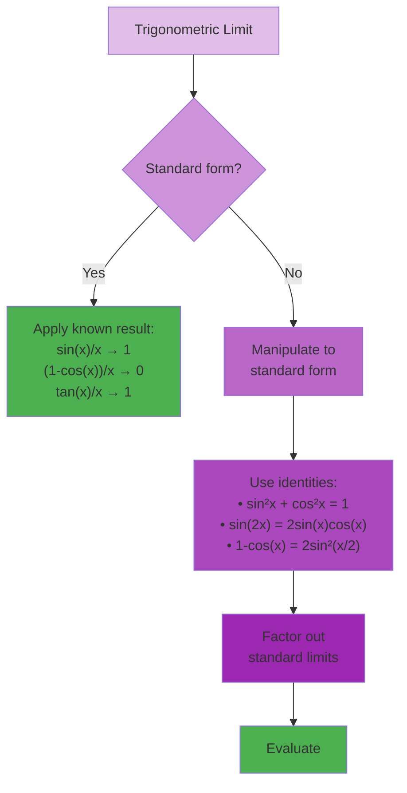

These trigonometric limits form the foundation for differential calculus of trigonometric functions. The limit
$\lim_{x \to 0} \frac{\sin x}{x} = 1$ is particularly fundamental—it's the reason the derivative of $\sin x$ is
$\cos x$.

##### Resolving Indeterminate Forms

Indeterminate forms arise when limit laws give expressions like $\frac{0}{0}$, $\frac{\infty}{\infty}$,
$0 \cdot \infty$, $\infty - \infty$, $0^0$, $1^\infty$, or $\infty^0$. These expressions don't have a predetermined
value—the limit might exist and equal any value, or might not exist at all. Special techniques are needed to resolve
these ambiguities.

**Common Indeterminate Forms and Resolution Strategies**:

**1. Form $\frac{0}{0}$**: Most common in calculus

_Strategy_: Factor and cancel, rationalize, or use L'Hôpital's Rule

Example: $\lim_{x \to 2} \frac{x^2 - 4}{x - 2}$

- Direct substitution gives $\frac{0}{0}$
- Factor: $\frac{(x-2)(x+2)}{x-2} = x + 2$ for $x \neq 2$
- Therefore: $\lim_{x \to 2} (x + 2) = 4$

Example with rationalization: $\lim_{x \to 4} \frac{\sqrt{x} - 2}{x - 4}$

- Multiply by conjugate:
  $\frac{\sqrt{x} - 2}{x - 4} \cdot \frac{\sqrt{x} + 2}{\sqrt{x} + 2} = \frac{x - 4}{(x-4)(\sqrt{x} + 2)} = \frac{1}{\sqrt{x} + 2}$
- Therefore: $\lim_{x \to 4} \frac{1}{\sqrt{x} + 2} = \frac{1}{4}$

**2. Form $\frac{\infty}{\infty}$**: Common with rational functions as $x \to \infty$

_Strategy_: Divide by highest power

Example: $\lim_{x \to \infty} \frac{3x^2 + 5x - 2}{2x^2 - x + 7}$

- Divide numerator and denominator by $x^2$: $\frac{3 + \frac{5}{x} - \frac{2}{x^2}}{2 - \frac{1}{x} + \frac{7}{x^2}}$
- As $x \to \infty$: approaches $\frac{3}{2}$

**3. Form $0 \cdot \infty$**: Convert to $\frac{0}{0}$ or $\frac{\infty}{\infty}$

Example: $\lim_{x \to 0^+} x \ln x$

- Rewrite as: $\lim_{x \to 0^+} \frac{\ln x}{1/x}$ (now form $\frac{-\infty}{\infty}$)
- Apply L'Hôpital's Rule: $\lim_{x \to 0^+} \frac{1/x}{-1/x^2} = \lim_{x \to 0^+} (-x) = 0$

**4. Form $\infty - \infty$**: Find common denominator or factor

Example: $\lim_{x \to \infty} (\sqrt{x^2 + x} - x)$

- Multiply by conjugate:
  $\frac{(\sqrt{x^2 + x} - x)(\sqrt{x^2 + x} + x)}{\sqrt{x^2 + x} + x} = \frac{x}{\sqrt{x^2 + x} + x}$
- Factor out $x$: $\frac{x}{x(\sqrt{1 + 1/x} + 1)} = \frac{1}{\sqrt{1 + 1/x} + 1}$
- As $x \to \infty$: approaches $\frac{1}{2}$

**5. Forms $0^0$, $1^\infty$, $\infty^0$**: Use logarithms

Example: $\lim_{x \to 0^+} x^x$

- Let $y = x^x$, so $\ln y = x \ln x$
- We showed $\lim_{x \to 0^+} x \ln x = 0$
- Therefore $\lim_{x \to 0^+} \ln y = 0$
- So $\lim_{x \to 0^+} y = e^0 = 1$

**L'Hôpital's Rule** (preview): For forms $\frac{0}{0}$ or $\frac{\infty}{\infty}$:
$$\lim_{x \to a} \frac{f(x)}{g(x)} = \lim_{x \to a} \frac{f'(x)}{g'(x)}$$ (under appropriate conditions)

**Decision Tree for Indeterminate Forms**:

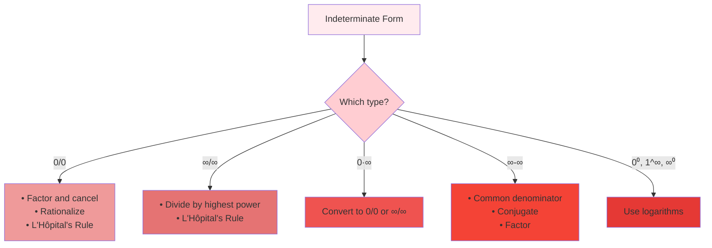

**Common Mistakes**:

1. Assuming indeterminate forms equal specific values
2. Applying L'Hôpital's Rule without checking conditions
3. Not simplifying before applying advanced techniques

**Key Insight**: Indeterminate forms show that limit evaluation requires understanding the rates at which functions
approach their limiting values, not just the values themselves. This deeper understanding motivates the derivative
concept and differential calculus.

##### Strategic Approaches to Complex Limits

When faced with challenging limits, success often depends on choosing the right strategy. This section synthesizes
techniques and provides a systematic approach to limit problems.

**Strategic Framework**:

1. **Initial Analysis**:

    - Can I substitute directly?
    - What form do I get?
    - Are there obvious simplifications?

2. **Identify the Challenge**:

    - Indeterminate form?
    - Oscillatory behavior?
    - Piecewise definition?
    - Infinity involved?

3. **Select Appropriate Technique**:
    - Match problem type to method
    - Consider multiple approaches
    - Start with simplest method

**Comprehensive Example Set**:

**Example 1**: $\lim_{x \to 0} \frac{e^x - e^{-x}}{x}$

Analysis:

- Direct substitution gives $\frac{1-1}{0} = \frac{0}{0}$
- Could use L'Hôpital's Rule
- Alternative: Use series expansion

Solution using series:

- $e^x = 1 + x + \frac{x^2}{2} + O(x^3)$
- $e^{-x} = 1 - x + \frac{x^2}{2} + O(x^3)$
- $e^x - e^{-x} = 2x + O(x^3)$
- Therefore: $\frac{e^x - e^{-x}}{x} = 2 + O(x^2) \to 2$

**Example 2**: $\lim_{x \to \infty} x\left(1 - \cos\left(\frac{1}{x}\right)\right)$

Analysis:

- Form is $\infty \cdot 0$
- Let $u = 1/x$, then as $x \to \infty$, $u \to 0$

Solution:

- Becomes $\lim_{u \to 0} \frac{1 - \cos u}{u}$
- We know this equals 0

**Example 3**: $\lim_{x \to 1} \frac{x^{100} - 1}{x - 1}$

Analysis:

- Form $\frac{0}{0}$
- Could factor, but that's tedious
- Recognize as derivative definition!

Solution:

- This is $\lim_{x \to 1} \frac{x^{100} - 1^{100}}{x - 1} = \frac{d}{dx}(x^{100})\bigg|_{x=1} = 100$

**Master Strategy Guide**:

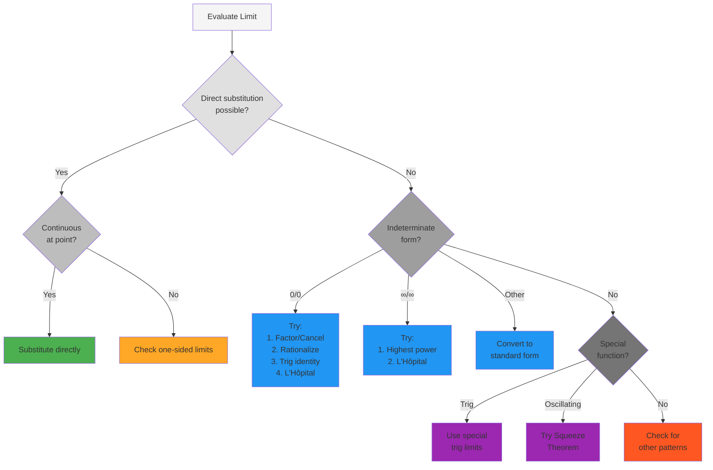

**Advanced Techniques**:

1. **Change of Variables**: Simplify complex expressions

    - Example: For $\lim_{x \to \infty} x \sin(1/x)$, let $u = 1/x$

2. **Series Expansions**: For functions near specific points

    - Taylor/Maclaurin series provide polynomial approximations

3. **Asymptotic Analysis**: For limits at infinity

    - Compare growth rates of functions

4. **Logarithmic Transformation**: For exponential forms
    - If $\lim \ln f(x) = L$, then $\lim f(x) = e^L$

**Problem-Solving Mindset**:

1. **Pattern Recognition**: Similar problems often use similar techniques
2. **Multiple Methods**: Try different approaches if stuck
3. **Check Results**: Verify using numerical values or graphing
4. **Build Intuition**: Understand why techniques work, not just how

**Common Patterns to Recognize**:

- Difference of squares: $a^2 - b^2 = (a-b)(a+b)$
- Difference of cubes: $a^3 - b^3 = (a-b)(a^2 + ab + b^2)$
- Trigonometric identities
- Derivative definitions in disguise

Mastering limit evaluation requires both knowing individual techniques and developing judgment about which to apply.
With practice, pattern recognition becomes automatic, and complex limits become manageable puzzles rather than
insurmountable obstacles.

##### Common Pitfalls and How to Avoid Them

Even experienced students make characteristic errors when working with limits. Understanding these pitfalls and their
remedies strengthens limit-solving skills and deepens conceptual understanding.

**Pitfall 1: Illegal Algebraic Operations**

_Common Error_: Splitting limits before verifying they exist
$$\lim_{x \to 0} \left(\frac{1}{x} - \frac{1}{x}\right) \stackrel{?}{=} \lim_{x \to 0} \frac{1}{x} - \lim_{x \to 0} \frac{1}{x}$$

_Problem_: The individual limits don't exist!

_Correct Approach_: Simplify first $$\lim_{x \to 0} \left(\frac{1}{x} - \frac{1}{x}\right) = \lim_{x \to 0} 0 = 0$$

**Pitfall 2: Mishandling Infinity**

_Common Error_: Treating $\infty$ as a number $$\lim_{x \to \infty} (x - x) \stackrel{?}{=} \infty - \infty = 0$$

_Problem_: $\infty - \infty$ is indeterminate

_Correct Approach_: Evaluate the expression first $$\lim_{x \to \infty} (x - x) = \lim_{x \to \infty} 0 = 0$$

**Pitfall 3: Ignoring Domain Restrictions**

_Common Error_: Not checking where functions are defined

Example: $\lim_{x \to -2} \ln(x + 1)$

- Students might substitute to get $\ln(-1)$

_Problem_: $\ln(x + 1)$ is undefined for $x < -1$

_Correct Approach_: Check domain first. The limit doesn't exist because we can't approach -2 within the domain.

**Pitfall 4: Confusing Limit with Function Value**

_Common Error_: Assuming $\lim_{x \to a} f(x) = f(a)$

_Problem_: This is only true for continuous functions

_Example_: For $f(x) = \begin{cases} x + 1 & \text{if } x \neq 2 \\ 5 & \text{if } x = 2 \end{cases}$

- $\lim_{x \to 2} f(x) = 3$ but $f(2) = 5$

**Pitfall 5: Misapplying L'Hôpital's Rule**

_Common Errors_:

1. Using it when not indeterminate form
2. Differentiating incorrectly
3. Not checking if new limit is determinate

_Example_: $\lim_{x \to 0} \frac{x^2 + 2x}{x}$

- Don't need L'Hôpital! Just simplify: $\lim_{x \to 0} (x + 2) = 2$

**Pitfall 6: Overlooking One-Sided Behavior**

_Common Error_: Assuming two-sided limit exists without checking

_Example_: $\lim_{x \to 0} \frac{|x|}{x}$

- From right: $\lim_{x \to 0^+} \frac{x}{x} = 1$
- From left: $\lim_{x \to 0^-} \frac{-x}{x} = -1$
- Two-sided limit doesn't exist!

**Pitfall 7: Rationalizing Incorrectly**

_Common Error_: Multiplying by wrong conjugate or making algebra errors

_Correct Example_: $\lim_{x \to 0} \frac{\sqrt{1+x} - 1}{x}$

- Multiply by $\frac{\sqrt{1+x} + 1}{\sqrt{1+x} + 1}$
- Get $\frac{(1+x) - 1}{x(\sqrt{1+x} + 1)} = \frac{1}{\sqrt{1+x} + 1} \to \frac{1}{2}$

**Prevention Strategies**:

1. **Check Your Work**:

    - Verify using numerical values near the limit point
    - Graph the function to visualize behavior
    - Try alternative methods

2. **Understand the Theory**:

    - Know when limit laws apply
    - Understand what indeterminate means
    - Remember continuity requirements

3. **Develop Good Habits**:

    - Always check domains first
    - Simplify before applying rules
    - Consider one-sided limits for suspicious points

4. **Common Sense Checks**:
    - Is the answer reasonable?
    - Does it match the graph?
    - Do units make sense (in applications)?

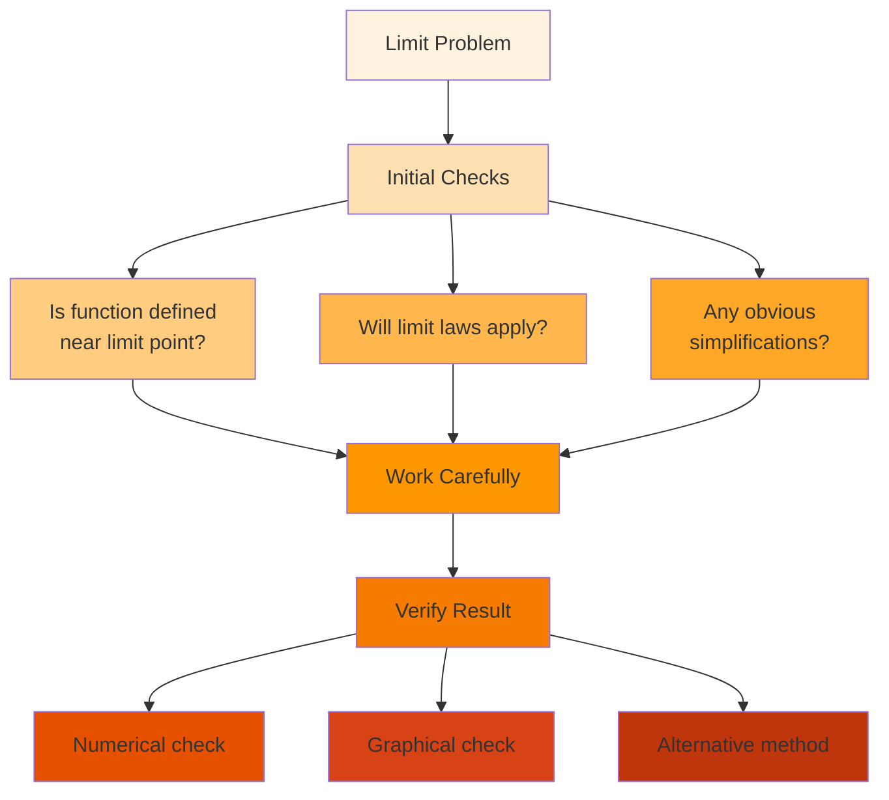

By understanding these common pitfalls, students can develop the careful, systematic approach needed for successful
limit evaluation. Remember: limits are about the journey (approaching) not the destination (arriving), and this journey
requires careful navigation to avoid these common traps.

#### The Precise Definition of a Limit

While intuitive understanding of limits is essential, mathematics demands precision. The epsilon-delta definition
provides the rigorous foundation upon which all of calculus rests. This formal definition transforms the vague notion of
"approaching" into precise mathematical language.

##### Building Intuition for Epsilon-Delta

Before diving into formalism, let's build intuition through a series of increasingly precise descriptions of what it
means for a limit to exist.

**Progressive Refinement of the Limit Concept**:

1. **Vague**: "$f(x)$ approaches $L$ as $x$ approaches $a$"

2. **Better**: "$f(x)$ gets arbitrarily close to $L$ when $x$ is sufficiently close to $a$"

3. **More Precise**: "We can make $f(x)$ as close to $L$ as desired by taking $x$ close enough to $a$"

4. **Nearly Formal**: "For any desired closeness to $L$, there exists a corresponding closeness to aa a that guarantees
   it"

5. **Formal**: "For every $\varepsilon > 0$, there exists $\delta > 0$ such that if $0 < |x - a| < \delta$, then
   $|f(x) - L| < \varepsilon$"

**The Challenge-Response Game**: Think of limits as a dialogue between a challenger and a responder:

**Challenger**: "I want $f(x)$ within 0.01 of $L$" **Responder**: "Then keep $x$ within 0.003 of $a$"

**Challenger**: "Now I want $f(x)$ within 0.0001 of $L$" **Responder**: "Then keep $x$ within 0.00002 of $a$"

If the responder can always meet any challenge (no matter how small $\varepsilon$), then the limit exists and equals
$L$.

**Visual Interpretation**: The epsilon-delta definition describes a "target zone" around $L$:

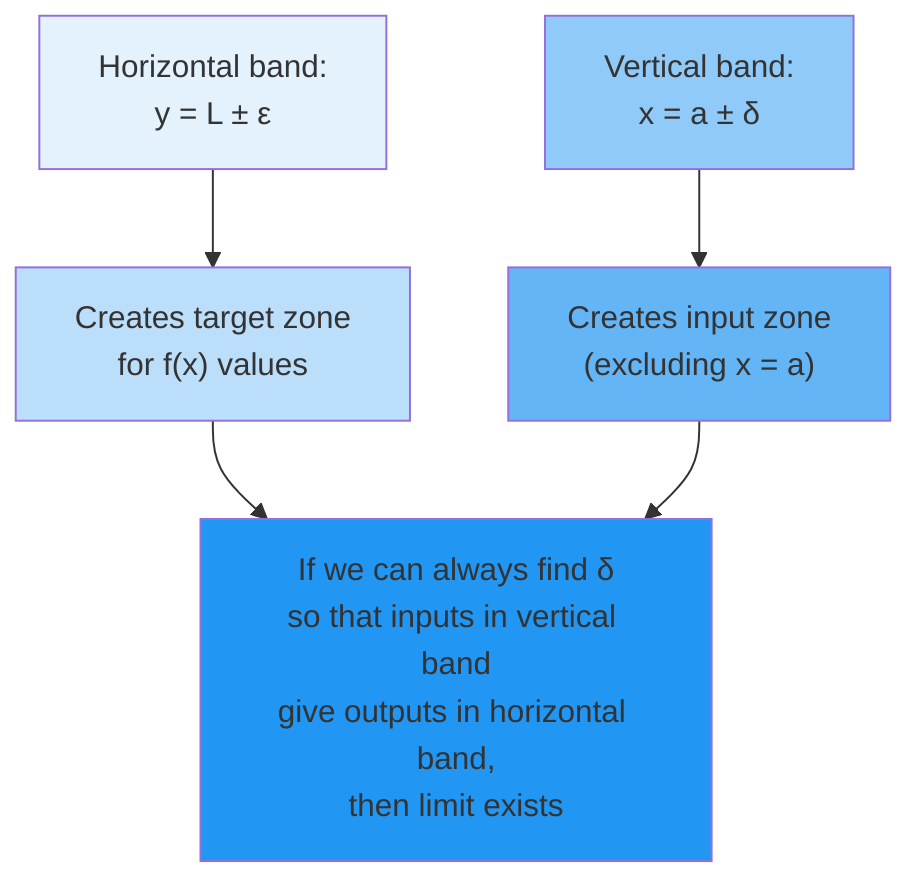

**Why We Need This Precision**: Consider these questions:

- What exactly does "arbitrarily close" mean?
- How do we prove a limit exists?
- How do we show two definitions are equivalent?
- How do we extend limits to abstract spaces?

The epsilon-delta definition answers all these questions with mathematical rigor.

**Building Understanding Through Examples**:

**Example 1**: Intuition for $\lim_{x \to 2} (3x - 1) = 5$

- If someone wants $|f(x) - 5| < 0.1$, we need $|(3x - 1) - 5| < 0.1$
- This means $|3x - 6| < 0.1$, so $3|x - 2| < 0.1$
- Therefore $|x - 2| < 0.1/3 \approx 0.033$
- So choosing $\delta = 0.033$ works for $\varepsilon = 0.1$

**Example 2**: Why the definition excludes $x = a$

Consider $f(x) = \begin{cases} x & \text{if } x \neq 2 \\ 10 & \text{if } x = 2 \end{cases}$

- The limit as $x \to 2$ should be 2 (based on nearby values)
- If we didn't exclude $x = 2$, we'd need $|f(2) - 2| = |10 - 2| = 8 < \varepsilon$
- This would fail for small $\varepsilon$
- By excluding $x = a$, we focus on approach behavior, not the value at $a$

**The Power of Quantifiers**: The formal definition uses precise logical structure:

- "For every $\varepsilon > 0$" (universal quantifier)
- "There exists $\delta > 0$" (existential quantifier)
- The order matters! $\delta$ can depend on $\varepsilon$

This logical precision enables rigorous proofs and eliminates ambiguity.

##### Epsilon-Delta Definition and Formal Proof Structure

Now we present the formal definition and explore its structure in detail.

**The Formal Definition**: $$\lim_{x \to a} f(x) = L$$ means: For every $\varepsilon > 0$, there exists $\delta > 0$
such that if $0 < |x - a| < \delta$, then $|f(x) - L| < \varepsilon$.

**Breaking Down the Components**:

1. **"For every $\varepsilon > 0$"**:

    - $\varepsilon$ represents the desired closeness to $L$
    - Must work for ALL positive values, no matter how small
    - The challenger in our game

2. **"There exists $\delta > 0$"**:

    - $\delta$ represents how close $x$ must be to $a$
    - Only needs to exist, not be unique
    - Can depend on both $\varepsilon$ and $a$
    - The responder's answer

3. **"If $0 < |x - a| < \delta$"**:

    - $|x - a| < \delta$: $x$ is within $\delta$ of $a$
    - $0 < |x - a|$: $x \neq a$ (crucial exclusion)
    - Defines the input condition

4. **"Then $|f(x) - L| < \varepsilon$"**:
    - The desired output condition
    - $f(x)$ is within $\varepsilon$ of $L$

**Standard Proof Structure**: To prove $\lim_{x \to a} f(x) = L$:

1. **Setup**: Let $\varepsilon > 0$ be arbitrary
2. **Analysis**: Work backwards from $|f(x) - L| < \varepsilon$ to find what restriction on $|x - a|$ is needed
3. **Choice of $\delta$**: Based on analysis, choose specific $\delta > 0$
4. **Verification**: Show that if $0 < |x - a| < \delta$, then $|f(x) - L| < \varepsilon$
5. **Conclusion**: Since $\varepsilon$ was arbitrary, the limit equals $L$

**Complete Example Proof**: Prove $\lim_{x \to 3} (2x + 1) = 7$

_Proof_:

1. Let $\varepsilon > 0$ be arbitrary.

2. We need to find $\delta > 0$ such that if $0 < |x - 3| < \delta$, then $|(2x + 1) - 7| < \varepsilon$.

3. Analysis: $$|(2x + 1) - 7| = |2x - 6| = |2(x - 3)| = 2|x - 3|$$

    We want $2|x - 3| < \varepsilon$, which means $|x - 3| < \frac{\varepsilon}{2}$.

4. Choice: Let $\delta = \frac{\varepsilon}{2}$.

5. Verification: Suppose $0 < |x - 3| < \delta = \frac{\varepsilon}{2}$. Then:
   $$|(2x + 1) - 7| = 2|x - 3| < 2 \cdot \frac{\varepsilon}{2} = \varepsilon$$

6. Therefore, $\lim_{x \to 3} (2x + 1) = 7$. □

**More Complex Example**: Prove $\lim_{x \to 2} x^2 = 4$

_Proof_:

1. Let $\varepsilon > 0$ be arbitrary.

2. Analysis: We need $|x^2 - 4| < \varepsilon$. $$|x^2 - 4| = |x - 2||x + 2|$$

    We can control $|x - 2|$ with $\delta$, but need to bound $|x + 2|$.

3. Preliminary bound: If $\delta \leq 1$, then $|x - 2| < 1$, so $1 < x < 3$, thus $3 < x + 2 < 5$. Therefore
   $|x + 2| < 5$.

4. With this bound: $|x^2 - 4| = |x - 2||x + 2| < 5|x - 2|$

5. To ensure $5|x - 2| < \varepsilon$, we need $|x - 2| < \frac{\varepsilon}{5}$.

6. Choice: Let $\delta = \min\{1, \frac{\varepsilon}{5}\}$.

7. Verification: If $0 < |x - 2| < \delta$, then:

    - Since $\delta \leq 1$, we have $|x + 2| < 5$
    - Since $\delta \leq \frac{\varepsilon}{5}$, we have $|x - 2| < \frac{\varepsilon}{5}$
    - Therefore: $|x^2 - 4| = |x - 2||x + 2| < \frac{\varepsilon}{5} \cdot 5 = \varepsilon$

8. Therefore, $\lim_{x \to 2} x^2 = 4$. □

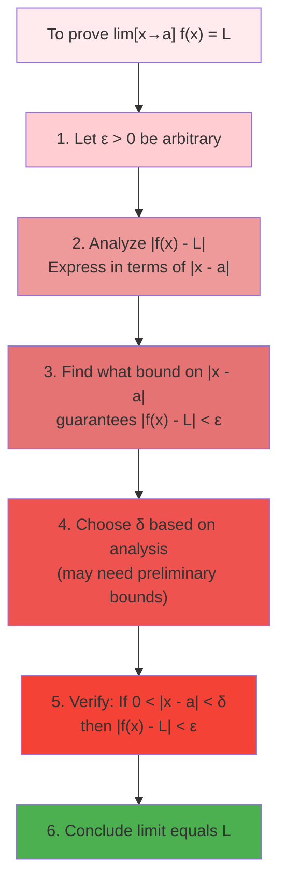

**Key Insights**:

1. $\delta$ typically depends on $\varepsilon$ (often linearly)
2. For complex functions, preliminary bounds are often needed
3. The choice $\delta = \min\{\delta_1, \delta_2, ...\}$ handles multiple constraints
4. The proof structure is systematic and algorithmic

##### Verifying Limits with Precise Arguments

Beyond basic limit proofs, the epsilon-delta definition enables us to verify more complex limits and establish
properties of limits rigorously.

**Advanced Proof Techniques**:

**1. Limits of Composite Functions**: If $\lim_{x \to a} g(x) = L$ and $f$ is continuous at $L$, prove
$\lim_{x \to a} f(g(x)) = f(L)$

_Proof Sketch_:

- Given $\varepsilon > 0$
- Since $f$ continuous at $L$: $\exists \gamma > 0$ such that $|y - L| < \gamma \Rightarrow |f(y) - f(L)| < \varepsilon$
- Since $\lim_{x \to a} g(x) = L$: $\exists \delta > 0$ such that $0 < |x - a| < \delta \Rightarrow |g(x) - L| < \gamma$
- Combining: $0 < |x - a| < \delta \Rightarrow |f(g(x)) - f(L)| < \varepsilon$

**2. Uniqueness of Limits**: Prove that if a limit exists, it is unique.

_Proof by Contradiction_:

- Suppose $\lim_{x \to a} f(x) = L_1$ and $\lim_{x \to a} f(x) = L_2$ with $L_1 \neq L_2$
- Let $\varepsilon = \frac{|L_1 - L_2|}{2} > 0$
- There exist $\delta_1, \delta_2 > 0$ for the two limits
- Let $\delta = \min\{\delta_1, \delta_2\}$
- For $0 < |x - a| < \delta$: both $|f(x) - L_1| < \varepsilon$ and $|f(x) - L_2| < \varepsilon$
- By triangle inequality: $|L_1 - L_2| \leq |L_1 - f(x)| + |f(x) - L_2| < 2\varepsilon = |L_1 - L_2|$
- Contradiction! Therefore $L_1 = L_2$

**3. Proving Limit Laws**: Prove the sum rule using epsilon-delta.

_Proof of Sum Rule_: If $\lim_{x \to a} f(x) = L$ and $\lim_{x \to a} g(x) = M$, then
$\lim_{x \to a} [f(x) + g(x)] = L + M$

- Let $\varepsilon > 0$
- Since limits exist:
    - $\exists \delta_1 > 0$: $0 < |x - a| < \delta_1 \Rightarrow |f(x) - L| < \frac{\varepsilon}{2}$
    - $\exists \delta_2 > 0$: $0 < |x - a| < \delta_2 \Rightarrow |g(x) - M| < \frac{\varepsilon}{2}$
- Let $\delta = \min\{\delta_1, \delta_2\}$
- For $0 < |x - a| < \delta$:
  $$|(f(x) + g(x)) - (L + M)| \leq |f(x) - L| + |g(x) - M| < \frac{\varepsilon}{2} + \frac{\varepsilon}{2} = \varepsilon$$

**Common Proof Strategies**:

1. **Triangle Inequality**: Essential for managing absolute values $$|a + b| \leq |a| + |b|$$
   $$||a| - |b|| \leq |a - b|$$

2. **Factoring**: Express $|f(x) - L|$ in terms of $|x - a|$

3. **Bounding Techniques**:

    - First restrict to $|x - a| < 1$ to bound other factors
    - Then further restrict to achieve desired inequality

4. **Working Backwards**: Start with desired conclusion and determine what $\delta$ is needed

**Example - A Challenging Limit**: Prove $\lim_{x \to 0} x \sin\left(\frac{1}{x}\right) = 0$

_Proof_:

1. Let $\varepsilon > 0$

2. Note that $\left|\sin\left(\frac{1}{x}\right)\right| \leq 1$ for all $x \neq 0$

3. Therefore:
   $\left|x \sin\left(\frac{1}{x}\right) - 0\right| = |x| \cdot \left|\sin\left(\frac{1}{x}\right)\right| \leq |x|$

4. To ensure $|x| < \varepsilon$, choose $\delta = \varepsilon$

5. If $0 < |x - 0| < \delta = \varepsilon$, then:
   $$\left|x \sin\left(\frac{1}{x}\right) - 0\right| \leq |x| < \varepsilon$$

6. Therefore $\lim_{x \to 0} x \sin\left(\frac{1}{x}\right) = 0$ □

**Verifying Non-Existence**: To prove a limit doesn't exist, show:

- Either: Find sequences approaching $a$ with different limiting values
- Or: Show that for some $\varepsilon > 0$, no suitable $\delta$ exists

The epsilon-delta definition transforms limit theory from intuition to rigorous mathematics, enabling precise proofs of
fundamental theorems that underpin all of calculus.

##### Sequential Approach to Limits

An alternative characterization of limits uses sequences instead of epsilon-delta. This approach often provides more
intuitive proofs and connects limits to discrete mathematics.

**Sequential Definition of Limit**: $\lim_{x \to a} f(x) = L$ if and only if for every sequence $\{x_n\}$ with
$x_n \neq a$ and $\lim_{n \to \infty} x_n = a$, we have $\lim_{n \to \infty} f(x_n) = L$.

**Equivalence with Epsilon-Delta**: These two definitions are equivalent:

_Proof that epsilon-delta implies sequential_:

- Assume $\lim_{x \to a} f(x) = L$ (epsilon-delta sense)
- Let $\{x_n\}$ be any sequence with $x_n \neq a$ and $x_n \to a$
- Given $\varepsilon > 0$, there exists $\delta > 0$ for the function limit
- Since $x_n \to a$, there exists $N$ such that $n \geq N \Rightarrow 0 < |x_n - a| < \delta$
- Therefore $n \geq N \Rightarrow |f(x_n) - L| < \varepsilon$
- So $f(x_n) \to L$

**Advantages of Sequential Approach**:

1. **Proving Non-Existence**: Find two sequences with different limits

Example: Show $\lim_{x \to 0} \sin\left(\frac{1}{x}\right)$ doesn't exist

- Let $x_n = \frac{1}{n\pi}$, then $f(x_n) = \sin(n\pi) = 0 \to 0$
- Let $y_n = \frac{1}{(n + \frac{1}{2})\pi}$, then $f(y_n) = \sin((n + \frac{1}{2})\pi) = (-1)^n$
- Second sequence doesn't converge, so limit doesn't exist

2. **Composition of Limits**: More natural with sequences

3. **Connection to Continuity**: $f$ continuous at $a$ iff for every sequence $x_n \to a$, we have $f(x_n) \to f(a)$

**Using Sequences in Proofs**:

**Example 1**: Prove $\lim_{x \to 2} (x^2 - 3x) = -2$ using sequences

_Proof_:

- Let $\{x_n\}$ be any sequence with $x_n \neq 2$ and $x_n \to 2$
- Then $f(x_n) = x_n^2 - 3x_n = x_n^2 - 3x_n$
- Since $x_n \to 2$: $x_n^2 \to 4$ and $3x_n \to 6$
- Therefore $f(x_n) \to 4 - 6 = -2$
- Since this holds for any such sequence, $\lim_{x \to 2} (x^2 - 3x) = -2$

**Example 2**: Use sequences to prove the product rule for limits

_Proof_: If $\lim_{x \to a} f(x) = L$ and $\lim_{x \to a} g(x) = M$, then $\lim_{x \to a} f(x)g(x) = LM$

- Let $\{x_n\}$ with $x_n \neq a$ and $x_n \to a$
- By hypothesis: $f(x_n) \to L$ and $g(x_n) \to M$
- By sequence limit properties: $f(x_n)g(x_n) \to LM$
- Since this holds for any such sequence, $\lim_{x \to a} f(x)g(x) = LM$

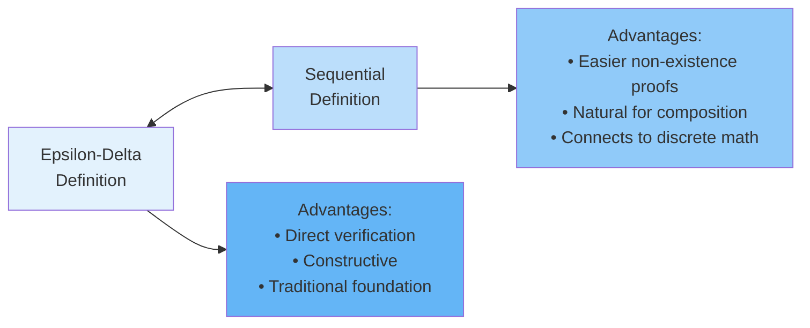

**Heine-Borel Property**: The sequential characterization is sometimes called the Heine-Borel property of limits. It
shows that continuous functions preserve sequential limits—a key property in analysis.

**Choosing the Right Approach**:

- Use epsilon-delta for constructive proofs and when you need explicit bounds
- Use sequences for non-existence proofs and theoretical results
- Both provide complete understanding of limits

##### Connecting Intuition with Rigor

The formal definition of limits might seem divorced from the intuitive understanding we developed earlier. This section
bridges that gap, showing how rigor enhances rather than replaces intuition.

**From Intuition to Formalism**:

1. **Intuitive**: "As $x$ gets close to $a$, $f(x)$ gets close to $L$"

    - **Issue**: What does "close" mean?
    - **Resolution**: $\varepsilon$ and $\delta$ quantify closeness

2. **Intuitive**: "We can make $f(x)$ as close to $L$ as we want"

    - **Issue**: Who controls what?
    - **Resolution**: We control $x$ (via $\delta$), achieving desired $f(x)$ behavior (via $\varepsilon$)

3. **Intuitive**: "The limit describes behavior near, not at, the point"
    - **Issue**: How do we exclude the point itself?
    - **Resolution**: The condition $0 < |x - a|$ ensures $x \neq a$

**Visual Bridge**: The epsilon-delta definition creates a geometric framework:

For any horizontal strip of width 2ε centered at y = L, there exists a vertical strip of width 2δ centered at x = a,
such that the graph within the vertical strip (except at x = a) lies entirely within the horizontal strip.

**Why Rigor Matters**:

1. **Eliminates Ambiguity**: "Sufficiently close" becomes precisely quantified
2. **Enables Proofs**: Can establish limit laws and theorems
3. **Handles Edge Cases**: Works even for pathological functions
4. **Extends to Abstract Settings**: Generalizes to metric spaces and beyond

**Example - Rigor Reveals Subtlety**: Consider $f(x) = x \sin(1/x)$ for $x \neq 0$

Intuition says: "Since $\sin(1/x)$ oscillates wildly near 0, the limit might not exist"

But rigorous analysis shows: The factor $x$ controls the oscillation, giving limit 0

This demonstrates how formal analysis can correct faulty intuition.

**Building Intuition from Rigor**: The formal definition also enhances intuition:

1. **Delta as a Function**: Often $\delta = \delta(\varepsilon)$

    - Linear functions: $\delta$ proportional to $\varepsilon$
    - Quadratic near zero: $\delta$ proportional to $\sqrt{\varepsilon}$
    - This relationship reveals function behavior

2. **Uniform Continuity**: When $\delta$ can be chosen independently of the point

    - Indicates function has controlled rate of change
    - Linear functions are uniformly continuous

3. **Rate of Approach**: How quickly $\delta$ shrinks as $\varepsilon \to 0$ indicates how rapidly $f(x)$ approaches $L$

**Practical Benefits of Formalism**:

1. **Numerical Estimates**: Proofs often give explicit $\delta$-$\varepsilon$ relationships

    - If $\delta = \varepsilon/5$, then to get within 0.001, stay within 0.0002

2. **Error Bounds**: In applications, $\varepsilon$ is error tolerance, $\delta$ is required precision

3. **Algorithm Design**: Numerical methods use epsilon-delta ideas for convergence criteria

**The Two-Way Street**: Intuition guides formal proofs, while rigor sharpens intuition:

- Start with geometric understanding
- Formalize with epsilon-delta
- Extract new insights from the formal proof
- Enhance original intuition

This interplay between intuition and rigor characterizes mathematical thinking at its best. The formal definition
doesn't replace understanding—it deepens it.

##### Applications in Mathematical Analysis

The epsilon-delta definition of limits extends far beyond elementary calculus, forming the foundation for vast areas of
mathematics. Understanding these connections reveals the true power of the limit concept.

**Generalization to Metric Spaces**: In a metric space $(X, d)$, the limit definition becomes:

$\lim_{x \to a} f(x) = L$ means: For every $\varepsilon > 0$, there exists $\delta > 0$ such that if
$0 < d(x, a) < \delta$, then $d(f(x), L) < \varepsilon$.

This abstraction:

- Replaces $|x - a|$ with distance $d(x, a)$
- Works in $\mathbb{R}^n$, function spaces, and beyond
- Unifies many seemingly different concepts

**Uniform Continuity**: A function $f: A \to \mathbb{R}$ is uniformly continuous if: For every $\varepsilon > 0$, there
exists $\delta > 0$ such that for all $x, y \in A$ with $|x - y| < \delta$, we have $|f(x) - f(y)| < \varepsilon$.

Key difference: $\delta$ depends only on $\varepsilon$, not on the specific point.

**Theorem**: Every continuous function on a closed, bounded interval is uniformly continuous.

This has profound implications for:

- Numerical integration
- Approximation theory
- Fourier analysis

**Differentiability**: The derivative is defined as a limit: $$f'(a) = \lim_{h \to 0} \frac{f(a + h) - f(a)}{h}$$

Using epsilon-delta: $f'(a) = L$ means: For every $\varepsilon > 0$, there exists $\delta > 0$ such that if
$0 < |h| < \delta$, then $\left|\frac{f(a + h) - f(a)}{h} - L\right| < \varepsilon$.

**Cauchy Sequences**: A sequence $\{x_n\}$ is Cauchy if: For every $\varepsilon > 0$, there exists $N$ such that if
$m, n \geq N$, then $|x_m - x_n| < \varepsilon$.

Connection to limits:

- Every convergent sequence is Cauchy
- In complete spaces, every Cauchy sequence converges
- Defines completeness without reference to limit values

**Function Spaces and Uniform Convergence**: For a sequence of functions $\{f_n\}$:

_Pointwise convergence_: For each $x$, $\lim_{n \to \infty} f_n(x) = f(x)$

_Uniform convergence_: For every $\varepsilon > 0$, there exists $N$ such that if $n \geq N$, then
$|f_n(x) - f(x)| < \varepsilon$ for all $x$.

Uniform convergence:

- Preserves continuity
- Allows term-by-term integration
- Essential for power series and Fourier series

**Compactness**: A set $K$ is compact if every sequence in $K$ has a convergent subsequence with limit in $K$.

The Heine-Borel theorem states: In $\mathbb{R}^n$, a set is compact iff it's closed and bounded.

Applications:

- Extreme value theorem
- Existence theorems for differential equations
- Fixed point theorems

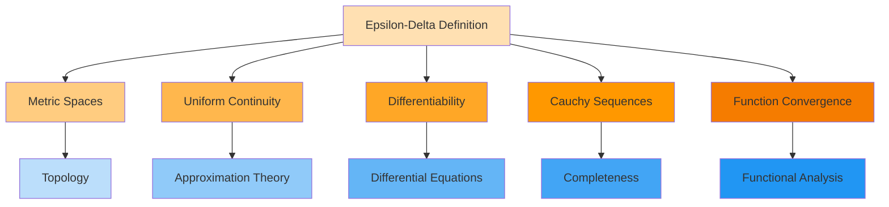

**Modern Applications**:

1. **Machine Learning**: Convergence of optimization algorithms
2. **Numerical Analysis**: Error estimates and stability
3. **Probability Theory**: Convergence of random variables
4. **Partial Differential Equations**: Weak solutions and distributions

The epsilon-delta definition, seemingly abstract, provides the language for discussing approximation, convergence, and
continuity throughout mathematics. It transforms vague notions into precise concepts amenable to rigorous analysis,
enabling mathematics to tackle increasingly complex problems with confidence.

The journey from ancient paradoxes through Newton and Leibniz to Cauchy and Weierstrass shows how mathematical concepts
evolve. The epsilon-delta definition represents not an endpoint but a foundation for ever-deeper understanding of the
continuous and infinite in mathematics.

#### Continuity

Continuity formalizes the intuitive notion of functions without breaks or jumps. A continuous function can be drawn
without lifting the pencil from the paper—but this simple idea leads to profound mathematical consequences and
surprising subtleties.

##### Definition and Properties of Continuous Functions

The concept of continuity captures the idea that small changes in input produce small changes in output. This behavior
is so fundamental that much of calculus focuses on continuous functions.

**Definition at a Point**: A function $f$ is continuous at point $a$ if:

1. $f(a)$ is defined
2. $\lim_{x \to a} f(x)$ exists
3. $\lim_{x \to a} f(x) = f(a)$

All three conditions must hold. In essence: the limiting value equals the actual value.

**Epsilon-Delta Definition**: Equivalently, $f$ is continuous at $a$ if: For every $\varepsilon > 0$, there exists
$\delta > 0$ such that if $|x - a| < \delta$, then $|f(x) - f(a)| < \varepsilon$.

Note: Unlike the limit definition, we don't require $x \neq a$.

**Sequential Definition**: $f$ is continuous at $a$ if for every sequence $\{x_n\}$ with $x_n \to a$, we have
$f(x_n) \to f(a)$.

**Types of Continuity**:

1. **Continuity at a Point**: Function is continuous at specific value $a$
2. **Continuity on an Interval**: Continuous at every point in the interval
3. **Uniform Continuity**: Rate of change is bounded across entire domain
4. **Absolute Continuity**: Stronger condition related to integration
5. **Lipschitz Continuity**: $|f(x) - f(y)| \leq L|x - y|$ for some constant $L$

**Basic Continuous Functions**:

1. **Polynomials**: $P(x) = a_nx^n + ... + a_1x + a_0$ continuous everywhere

    - Sums and products of continuous functions

2. **Rational Functions**: $R(x) = \frac{P(x)}{Q(x)}$ continuous where $Q(x) \neq 0$

    - Discontinuous only at zeros of denominator

3. **Trigonometric Functions**: $\sin x$, $\cos x$ continuous everywhere

    - $\tan x$ continuous except at odd multiples of $\pi/2$

4. **Exponential and Logarithmic**: $e^x$ continuous everywhere, $\ln x$ continuous for $x > 0$

5. **Root Functions**: $\sqrt[n]{x}$ continuous on appropriate domains

**Properties of Continuous Functions**:

**Theorem (Algebra of Continuous Functions)**: If $f$ and $g$ are continuous at $a$, then:

1. $f + g$ is continuous at $a$
2. $f - g$ is continuous at $a$
3. $cf$ is continuous at $a$ for any constant $c$
4. $fg$ is continuous at $a$
5. $f/g$ is continuous at $a$ if $g(a) \neq 0$

**Theorem (Composition)**: If $g$ is continuous at $a$ and $f$ is continuous at $g(a)$, then $f \circ g$ is continuous
at $a$.

**Proof of Composition**: Using epsilon-delta:

- Given $\varepsilon > 0$
- Since $f$ continuous at $g(a)$: $\exists \gamma > 0$ such that
  $|y - g(a)| < \gamma \Rightarrow |f(y) - f(g(a))| < \varepsilon$
- Since $g$ continuous at $a$: $\exists \delta > 0$ such that $|x - a| < \delta \Rightarrow |g(x) - g(a)| < \gamma$
- Combining: $|x - a| < \delta \Rightarrow |f(g(x)) - f(g(a))| < \varepsilon$

**Examples and Non-Examples**:

1. **Continuous**: $f(x) = \frac{x^2 - 1}{x + 1}$ for $x \neq -1$

    - Can be simplified to $f(x) = x - 1$ for $x \neq -1$
    - Extend by continuity: define $f(-1) = -2$ to make continuous everywhere

2. **Discontinuous**: $f(x) = \lfloor x \rfloor$ (greatest integer function)

    - Jump discontinuity at every integer
    - Right-continuous but not left-continuous

3. **Pathological**: Dirichlet function
   $D(x) = \begin{cases} 1 & \text{if } x \text{ rational} \\ 0 & \text{if } x \text{ irrational} \end{cases}$
    - Discontinuous everywhere!
    - No point of continuity

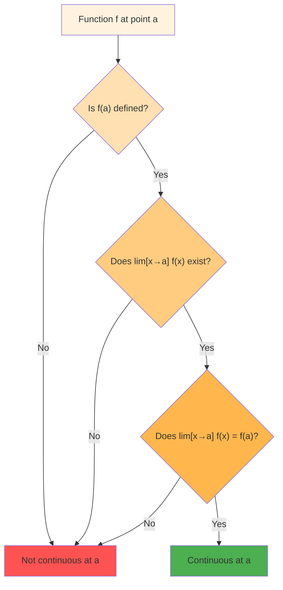

**Continuity on Intervals**: Special considerations for different types of intervals:

1. **Open Interval $(a, b)$**: Check continuity at each point using standard definition

2. **Closed Interval $[a, b]$**:

    - At interior points: standard continuity
    - At $a$: right-continuous ($\lim_{x \to a^+} f(x) = f(a)$)
    - At $b$: left-continuous ($\lim_{x \to b^-} f(x) = f(b)$)

3. **Half-Open Intervals**: Combine approaches as appropriate

**Why Continuity Matters**:

1. **Predictability**: Small errors in input cause small errors in output
2. **Computability**: Can approximate values arbitrarily well
3. **Theorems**: Many powerful results require continuity
4. **Physical Reality**: Most physical quantities vary continuously

##### Types of Discontinuities and Their Classification

When continuity fails, the type of failure reveals important information about the function. Understanding these
classifications helps in analysis and in determining whether discontinuities can be "repaired."

**Classification of Discontinuities**:

**1. Removable Discontinuity** (Point Discontinuity)

- The limit exists but either $f(a)$ is undefined or $f(a) \neq \lim_{x \to a} f(x)$
- Can be "removed" by redefining the function at that point

Example: $f(x) = \frac{x^2 - 4}{x - 2}$ at $x = 2$

- $\lim_{x \to 2} f(x) = \lim_{x \to 2} (x + 2) = 4$
- But $f(2)$ is undefined
- Define $f(2) = 4$ to make continuous

Formal characterization: $\lim_{x \to a} f(x)$ exists and is finite

**2. Jump Discontinuity**

- Both one-sided limits exist and are finite but unequal
- Function "jumps" between values

Example: $f(x) = \begin{cases} x^2 & \text{if } x < 1 \\ 2 - x & \text{if } x \geq 1 \end{cases}$

- $\lim_{x \to 1^-} f(x) = 1$
- $\lim_{x \to 1^+} f(x) = 1$
- Actually continuous! (Bad example - let me fix)

Better example: $f(x) = \begin{cases} x & \text{if } x < 0 \\ x + 1 & \text{if } x \geq 0 \end{cases}$

- $\lim_{x \to 0^-} f(x) = 0$
- $\lim_{x \to 0^+} f(x) = 1$
- Jump of size 1

**3. Infinite Discontinuity**

- At least one one-sided limit is infinite
- Often associated with vertical asymptotes

Example: $f(x) = \frac{1}{x}$ at $x = 0$

- $\lim_{x \to 0^-} f(x) = -\infty$
- $\lim_{x \to 0^+} f(x) = +\infty$

Example: $f(x) = \frac{1}{x^2}$ at $x = 0$

- Both one-sided limits are $+\infty$

**4. Oscillatory Discontinuity**

- Limit fails to exist due to oscillation
- Function oscillates too rapidly to settle on a value

Example: $f(x) = \sin\left(\frac{1}{x}\right)$ at $x = 0$

- As $x \to 0$, function oscillates between -1 and 1 infinitely often
- Neither one-sided limit exists

**5. Essential Discontinuity**

- Discontinuity that is not removable, jump, or infinite
- Often exhibits chaotic behavior

Example: $f(x) = \sin\left(\frac{1}{x}\right)$ is actually oscillatory, not essential

Better example: $e^{1/z}$ at $z = 0$ in complex analysis

- Takes all non-zero values in any neighborhood of 0

**First and Second Species**:

- **First Species**: Discontinuities where both one-sided limits exist (removable and jump)
- **Second Species**: At least one one-sided limit doesn't exist (infinite and oscillatory)

**Visual Characteristics**:

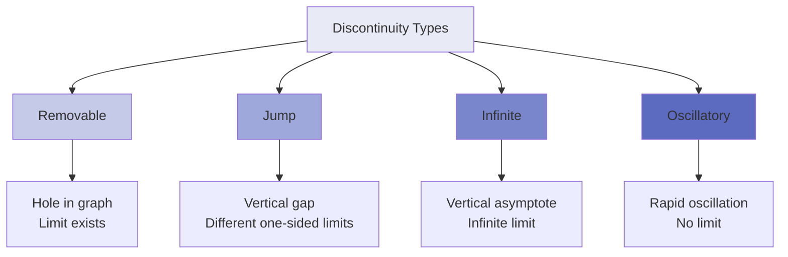

**Analyzing Discontinuities**: Systematic approach:

1. Check if $f(a)$ is defined
2. Calculate $\lim_{x \to a^-} f(x)$
3. Calculate $\lim_{x \to a^+} f(x)$
4. Compare values to classify

**Continuity and Derivatives**:

- If $f$ is differentiable at $a$, then $f$ is continuous at $a$
- Converse is false: $f(x) = |x|$ is continuous but not differentiable at 0

**Counting Discontinuities**:

- **Theorem**: A monotonic function on $[a,b]$ has at most countably many discontinuities
- **Theorem**: The set of discontinuities of any function $\mathbb{R} \to \mathbb{R}$ is at most countable

**Applications**:

1. **Signal Processing**: Jump discontinuities model sudden changes
2. **Physics**: Infinite discontinuities appear at singularities
3. **Economics**: Price functions may have jumps
4. **Engineering**: Material failure often involves discontinuous behavior

Understanding discontinuity types helps determine:

- Whether a function can be integrated
- How to handle numerical computations near discontinuities
- Whether physical models are realistic

##### The Intermediate Value Theorem

The Intermediate Value Theorem (IVT) is one of the most intuitive yet powerful results about continuous functions. It
formalizes the idea that a continuous function cannot "skip over" values.

**Statement of the Theorem**: If $f$ is continuous on the closed interval $[a, b]$ and $k$ is any number between $f(a)$
and $f(b)$, then there exists at least one $c \in [a, b]$ such that $f(c) = k$.

More formally: If $f$ is continuous on $[a, b]$ and $f(a) < k < f(b)$ (or $f(b) < k < f(a)$), then
$\exists c \in (a, b)$ such that $f(c) = k$.

**Intuitive Understanding**:

- A continuous function must pass through every intermediate value
- Cannot "jump over" any height between starting and ending values
- Guarantees existence but not uniqueness

**Proof Sketch** (using completeness of real numbers):

1. Let $S = \{x \in [a, b] : f(x) < k\}$
2. $S$ is non-empty (contains $a$) and bounded above by $b$
3. Let $c = \sup S$ (supremum exists by completeness)
4. By continuity and properties of supremum, $f(c) = k$

**Key Applications**:

**1. Existence of Roots**: If $f$ is continuous on $[a, b]$ with $f(a) < 0 < f(b)$, then $f$ has a root in $(a, b)$.

Example: Show $x^3 + x - 1 = 0$ has a solution in $(0, 1)$

- $f(0) = -1 < 0$
- $f(1) = 1 > 0$
- By IVT, $\exists c \in (0, 1)$ with $f(c) = 0$

**2. Fixed Point Results**: If $f: [0, 1] \to [0, 1]$ is continuous, then $f$ has a fixed point.

Proof: Define $g(x) = f(x) - x$

- $g(0) = f(0) - 0 \geq 0$
- $g(1) = f(1) - 1 \leq 0$
- By IVT, $\exists c$ with $g(c) = 0$, so $f(c) = c$

**3. Bisection Method**: Algorithm for finding roots

```python
def bisection(f, a, b, tolerance):
    # Assumes f(a) and f(b) have opposite signs
    while b - a > tolerance:
        c = (a + b) / 2
        if f(c) == 0:
            return c
        elif f(a) * f(c) < 0:
            b = c
        else:
            a = c
    return (a + b) / 2
```

**Examples and Applications**:

1. **Temperature**: If temperature is 20°C at noon and 10°C at 6 PM, then at some time between, it was exactly 15°C.

2. **Existence Proofs**: Show $\cos x = x$ has a solution

    - Define $f(x) = \cos x - x$
    - $f(0) = 1 > 0$
    - $f(\pi/2) = -\pi/2 < 0$
    - By IVT, solution exists in $(0, \pi/2)$

3. **Implicit Functions**: Prove existence of solutions to equations

**Important Observations**:

1. **Continuity is Essential**: IVT fails for discontinuous functions

    - $f(x) = \begin{cases} -1 & \text{if } x < 0 \\ 1 & \text{if } x \geq 0 \end{cases}$
    - No point where $f(x) = 0$ despite $f(-1) < 0 < f(1)$

2. **Closed Interval Required**: Need continuity at endpoints

    - Without this, function might approach but not attain intermediate value

3. **Multiple Solutions**: IVT guarantees at least one, possibly many

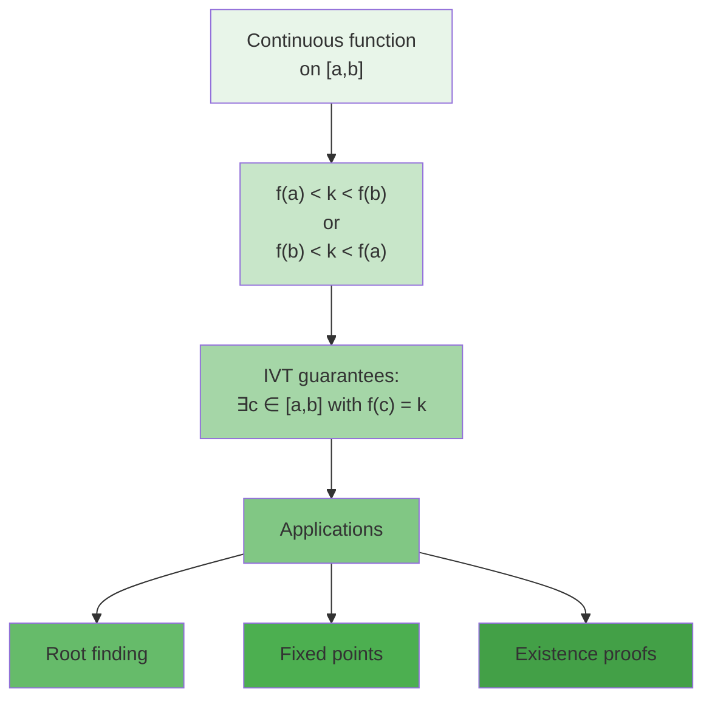

**Generalizations**:

1. **Darboux's Theorem**: Derivatives have the intermediate value property even if not continuous

2. **Connected Spaces**: IVT generalizes to continuous functions from connected spaces

3. **Bolzano's Theorem**: Special case of IVT for root existence

**Limitations**:

- Doesn't tell us how to find $c$
- Doesn't guarantee uniqueness
- Requires real numbers (fails in rationals)

The IVT embodies the completeness of real numbers and the power of continuity. It transforms existence questions into
verification of inequality conditions, providing a fundamental tool for analysis.

##### Continuity on Intervals and Extreme Value Theorem

Continuous functions on closed, bounded intervals possess remarkable properties that form the foundation for
optimization and approximation theory. The crown jewel is the Extreme Value Theorem.

**The Extreme Value Theorem (EVT)**: If $f$ is continuous on a closed, bounded interval $[a, b]$, then:

1. $f$ attains its maximum: $\exists c \in [a, b]$ such that $f(c) \geq f(x)$ for all $x \in [a, b]$
2. $f$ attains its minimum: $\exists d \in [a, b]$ such that $f(d) \leq f(x)$ for all $x \in [a, b]$

**Why Each Condition Matters**:

1. **Continuity**: Essential for preventing jumps that skip extrema

    - $f(x) = \begin{cases} x & \text{if } 0 \leq x < 1 \\ 0 & \text{if } x = 1 \end{cases}$ on $[0, 1]$
    - No maximum (supremum is 1, not attained)

2. **Closed Interval**: Need endpoints included

    - $f(x) = x$ on $(0, 1)$ has no maximum or minimum
    - Supremum is 1, infimum is 0, neither attained

3. **Bounded Interval**: Prevents escape to infinity
    - $f(x) = x$ on $[0, \infty)$ has minimum (0) but no maximum

**Proof Idea**: Uses compactness of $[a, b]$

1. Continuous functions map compact sets to compact sets
2. Compact subsets of $\mathbb{R}$ are closed and bounded
3. Closed and bounded sets contain their supremum and infimum

**Related Results**:

**1. Boundedness Theorem**: If $f$ is continuous on $[a, b]$, then $f$ is bounded.

- Exists $M$ such that $|f(x)| \leq M$ for all $x \in [a, b]$

**2. Uniform Continuity Theorem**: If $f$ is continuous on $[a, b]$, then $f$ is uniformly continuous.

- For all $\varepsilon > 0$, exists $\delta > 0$ such that $|x - y| < \delta \Rightarrow |f(x) - f(y)| < \varepsilon$
- $\delta$ works for all points, not just specific ones

**Finding Extrema**: Systematic approach:

1. Find critical points where $f'(x) = 0$ or $f'(x)$ doesn't exist
2. Evaluate $f$ at critical points
3. Evaluate $f$ at endpoints
4. Compare values to find global max/min

**Example**: Find extrema of $f(x) = x^3 - 3x$ on $[-2, 2]$

1. $f'(x) = 3x^2 - 3 = 0$ when $x = \pm 1$
2. Evaluate:
    - $f(-2) = -8 + 6 = -2$
    - $f(-1) = -1 + 3 = 2$
    - $f(1) = 1 - 3 = -2$
    - $f(2) = 8 - 6 = 2$
3. Maximum: 2 (at $x = -1$ and $x = 2$)
4. Minimum: -2 (at $x = -2$ and $x = 1$)

**Applications**:

1. **Optimization Problems**:

    - Maximizing profit on production interval
    - Finding optimal dimensions given constraints

2. **Approximation Theory**:

    - Best polynomial approximation exists by EVT
    - Minimax approximation

3. **Physics**:
    - Potential energy has minimum in stable equilibrium
    - Maximum height in projectile motion

**Failure of EVT**:

1. **Open Intervals**: $f(x) = \frac{1}{1+x^2}$ on $(-\infty, \infty)$

    - Maximum is 1 at $x = 0$
    - No minimum (infimum is 0, not attained)

2. **Discontinuous Functions**: Step functions may not attain extrema

3. **Unbounded Intervals**: Even continuous functions may lack extrema

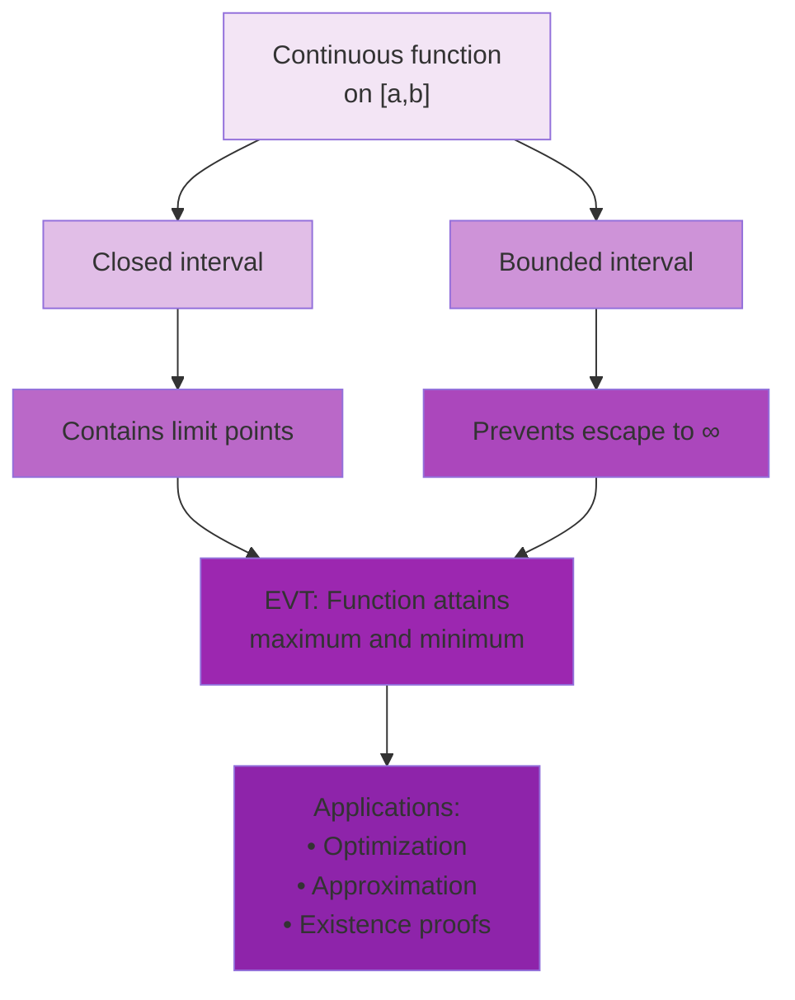

**Connection to Compactness**: The EVT is really about compact sets:

- In any metric space, continuous functions on compact sets attain their extrema
- $[a, b]$ is compact in $\mathbb{R}$ (Heine-Borel theorem)
- Generalizes to higher dimensions and abstract spaces

**Practical Importance**:

1. Guarantees solutions to optimization problems exist
2. Justifies many numerical methods
3. Enables worst-case analysis
4. Foundation for calculus of variations

The Extreme Value Theorem exemplifies how topological properties (compactness) combine with analytical properties
(continuity) to produce powerful results. It transforms optimization from hopeful searching to guaranteed existence.

##### Uniform Continuity and Its Significance

Uniform continuity strengthens ordinary continuity by requiring a single $\delta$ to work for all points in the domain.
This seemingly technical distinction has profound implications for analysis and applications.

**Definition**: A function $f: A \to \mathbb{R}$ is uniformly continuous on $A$ if: For every $\varepsilon > 0$, there
exists $\delta > 0$ such that for all $x, y \in A$ with $|x - y| < \delta$, we have $|f(x) - f(y)| < \varepsilon$.

**Key Difference from Ordinary Continuity**:

- Ordinary: $\delta$ may depend on both $\varepsilon$ and the specific point
- Uniform: $\delta$ depends only on $\varepsilon$, works everywhere

**Intuitive Interpretation**:

- Uniformly continuous: Has a controlled rate of change everywhere
- Not uniformly continuous: Rate of change becomes arbitrarily large somewhere

**Examples and Non-Examples**:

1. **Uniformly Continuous**: $f(x) = 2x + 3$ on $\mathbb{R}$

    - $|f(x) - f(y)| = 2|x - y|$
    - Choose $\delta = \varepsilon/2$

2. **Uniformly Continuous**: $f(x) = \sqrt{x}$ on $[0, \infty)$

    - Though derivative unbounded near 0, function still uniformly continuous
    - Rate of change controlled by square root behavior

3. **Not Uniformly Continuous**: $f(x) = x^2$ on $\mathbb{R}$

    - $|f(x) - f(y)| = |x + y||x - y|$
    - No single $\delta$ works for all $x$ when $|x + y|$ large

4. **Not Uniformly Continuous**: $f(x) = \frac{1}{x}$ on $(0, 1)$
    - Near 0, small changes in $x$ cause large changes in $f(x)$

**Fundamental Theorem**: Every continuous function on a closed, bounded interval is uniformly continuous.

**Proof Sketch**:

1. Suppose $f$ continuous on $[a, b]$ but not uniformly continuous
2. Then exists $\varepsilon_0 > 0$ and sequences $\{x_n\}, \{y_n\}$ with $|x_n - y_n| < 1/n$ but
   $|f(x_n) - f(y_n)| \geq \varepsilon_0$
3. By Bolzano-Weierstrass, extract convergent subsequence
4. Leads to contradiction with continuity

**Criteria for Uniform Continuity**:

1. **Lipschitz Condition**: If $|f(x) - f(y)| \leq L|x - y|$ for some $L$, then $f$ is uniformly continuous

    - Choose $\delta = \varepsilon/L$

2. **Bounded Derivative**: If $f'$ exists and is bounded on interval, then $f$ is uniformly continuous

    - By Mean Value Theorem

3. **Cauchy Criterion**: $f$ is uniformly continuous iff for every $\varepsilon > 0$, exists $\delta > 0$ such that
   $|x - y| < \delta$ implies $|f(x) - f(y)| < \varepsilon$

**Properties of Uniformly Continuous Functions**:

1. **Preserve Cauchy Sequences**: If $\{x_n\}$ is Cauchy and $f$ uniformly continuous, then $\{f(x_n)\}$ is Cauchy

2. **Extend to Closure**: Uniformly continuous functions on dense subsets extend uniquely to the closure

3. **Preserve Total Boundedness**: Image of totally bounded set under uniformly continuous function is totally bounded

**Applications**:

1. **Numerical Integration**:

    - Riemann sums converge uniformly for uniformly continuous functions
    - Error bounds independent of partition choice

2. **Approximation**:

    - Can approximate uniformly continuous functions by simpler ones
    - Weierstrass approximation theorem

3. **Differential Equations**:
    - Uniform continuity ensures solution stability
    - Perturbation analysis

**Extension Theorem**: If $f$ is uniformly continuous on $(a, b)$, then $f$ can be extended continuously to $[a, b]$.

This is false for merely continuous functions: $f(x) = \sin(1/x)$ on $(0, 1)$ cannot be extended continuously to 0.

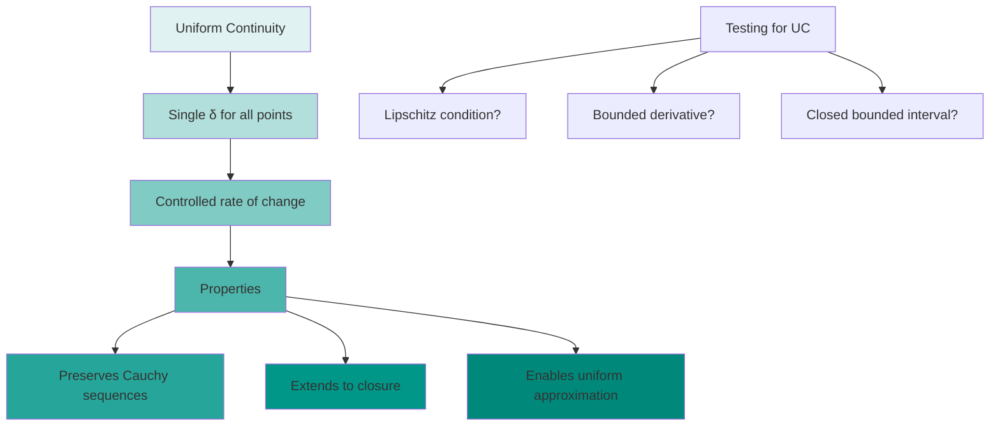

**Significance in Analysis**:

1. **Completeness**: Uniform continuity preserves completeness properties
2. **Integration**: Ensures Riemann integrability
3. **Convergence**: Uniform limits of uniformly continuous functions are uniformly continuous
4. **Metric Spaces**: Concept extends naturally to general metric spaces

Uniform continuity represents a global property of functions, contrasting with the local nature of ordinary continuity.
It provides the right notion of continuity for many theoretical and practical purposes, bridging the gap between
pointwise and global behavior.

##### Pathological Functions: When Intuition Breaks Down

Mathematics contains functions that defy geometric intuition, revealing the limitations of visual thinking and the power
of rigorous definitions. These pathological examples shaped the development of modern analysis.

**Historical Context**: In the 19th century, mathematicians believed:

- Continuous functions were mostly differentiable
- Curves had tangents except at isolated points
- Functions could be visualized geometrically

These beliefs were shattered by counterexamples that forced a more rigorous approach to analysis.

**Classic Pathological Examples**:

**1. The Dirichlet Function**:
$$D(x) = \begin{cases} 1 & \text{if } x \text{ is rational} \\ 0 & \text{if } x \text{ is irrational} \end{cases}$$

Properties:

- Discontinuous at every point
- No point of continuity exists
- Riemann integrable with integral 0 (as a limit)
- Challenges notion of "drawable" function

To see discontinuity at any $a$:

- In any interval around $a$, there are both rationals and irrationals
- Function jumps between 0 and 1 infinitely often
- No limit exists

**2. The Modified Dirichlet Function**:
$$f(x) = \begin{cases} x & \text{if } x \text{ is rational} \\ 0 & \text{if } x \text{ is irrational} \end{cases}$$

Properties:

- Continuous only at $x = 0$
- Discontinuous everywhere else
- Shows continuity can occur at isolated points

**3. Conway Base 13 Function**:

- Continuous at every irrational
- Discontinuous at every rational
- Reverses our usual intuition

**4. The Weierstrass Function**: $$W(x) = \sum_{n=0}^{\infty} a^n \cos(b^n \pi x)$$ where $0 < a < 1$, $b$ is odd, and
$ab > 1 + \frac{3\pi}{2}$

Properties:

- Continuous everywhere
- Differentiable nowhere!
- Fractal-like, self-similar at all scales
- Destroyed belief that continuous meant "mostly smooth"

Intuition for non-differentiability:

- Each term adds smaller but more rapid oscillations
- At every point, function is "rough" at all scales
- No well-defined tangent line anywhere

**5. The Cantor Function** (Devil's Staircase):

- Continuous everywhere
- Derivative is 0 almost everywhere
- Yet increases from 0 to 1
- Maps Cantor set to $[0, 1]$

Construction:

- On middle third of $[0, 1]$, set value to $1/2$
- On middle thirds of remaining intervals, set to $1/4$ and $3/4$
- Continue indefinitely

**6. Space-Filling Curves**:

- Peano curve: Continuous map from $[0, 1]$ onto $[0, 1] \times [0, 1]$
- Hilbert curve: Another space-filling curve
- Violates intuition that curves are 1-dimensional

**Lessons from Pathological Functions**:

1. **Visual Intuition Has Limits**:

    - Cannot always trust geometric reasoning
    - Need rigorous definitions and proofs

2. **Existence vs. Constructibility**:

    - Many pathological functions exist but cannot be explicitly computed
    - Existence proofs may be non-constructive

3. **Generic vs. Typical**:

    - In some sense, "most" continuous functions are nowhere differentiable
    - Smooth functions are the exception, not the rule

4. **Importance of Rigor**:
    - Epsilon-delta definitions capture subtleties
    - Careful distinction between pointwise and uniform properties

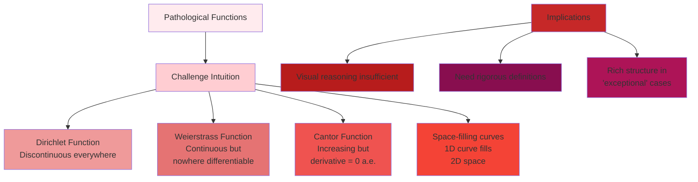

**Modern Perspective**:

1. **Fractals**: Many pathological functions are now understood as fractals

    - Self-similarity at all scales
    - Fractional dimensions

2. **Measure Theory**: Provides framework for handling pathological behavior

    - "Almost everywhere" concepts
    - Lebesgue integration handles Dirichlet function

3. **Functional Analysis**: Studies spaces of functions

    - Different norms give different notions of "closeness"
    - Pathological in one context may be typical in another

4. **Applications**: Once purely theoretical, now practical
    - Signal processing uses discontinuous functions
    - Fractals model natural phenomena
    - Quantum mechanics involves non-differentiable paths

**Philosophical Impact**:

- Separated mathematical objects from physical intuition
- Emphasized importance of precise definitions
- Showed richness of mathematical universe beyond visualization
- Led to development of modern topology and analysis

These pathological functions remind us that mathematics extends far beyond our geometric intuition, revealing a universe
of possibilities that can only be explored through rigorous logical reasoning. They transformed mathematics from a
science of calculation to one of careful definition and proof.

**Constructing Pathological Behavior**:

Understanding how to create functions with unusual properties deepens our grasp of continuity and its limits.

**Example Construction - Continuous at Irrationals Only**: Define $f(x)$ as follows:

- If $x$ is irrational, $f(x) = 0$
- If $x = p/q$ in lowest terms, $f(x) = 1/q$

Analysis:

- At irrational $a$: For any $\varepsilon > 0$, only finitely many rationals $p/q$ with $q < 1/\varepsilon$ exist in any
  bounded interval
- These can be avoided by choosing $\delta$ small enough
- Thus continuous at irrationals
- At rational $p/q$: Irrationals arbitrarily close have value 0, while $f(p/q) = 1/q \neq 0$

**The Baire Category Theorem**: Provides framework for understanding "typical" behavior:

- In complete metric spaces, "most" elements have certain properties
- Continuous nowhere differentiable functions are "generic" in $C[0,1]$
- Differentiable functions form a "meager" (first category) set

**Implications for Teaching and Learning**:

1. Start with intuitive examples but acknowledge limitations
2. Use pathological examples to motivate rigorous definitions
3. Show how seeming exceptions reveal deeper patterns
4. Connect to modern applications (fractals, signal processing)

Pathological functions serve as a reminder that mathematical truth often transcends human visualization, requiring us to
trust in logic and rigorous reasoning even when intuition fails. They mark the transition from classical to modern
analysis and continue to inspire new mathematics today.

