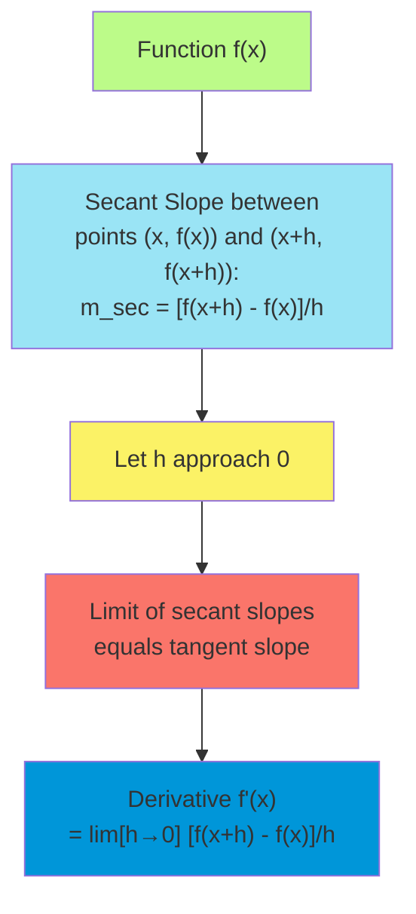
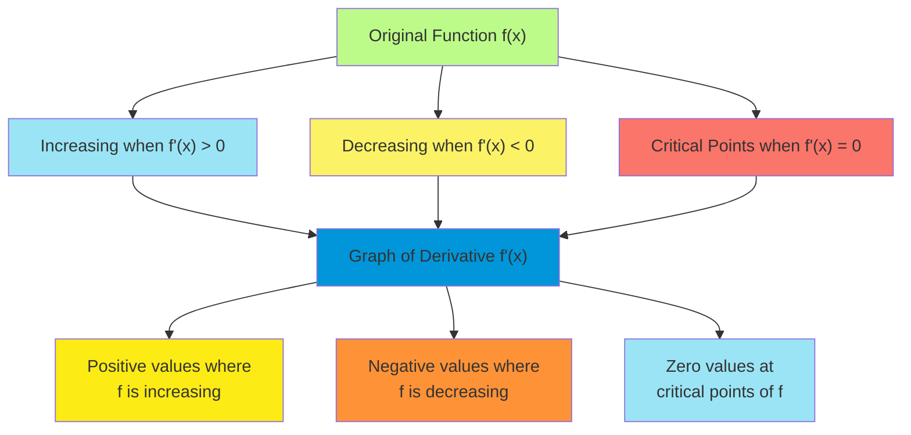
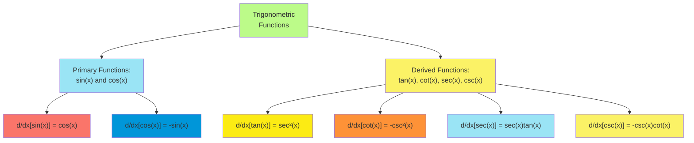
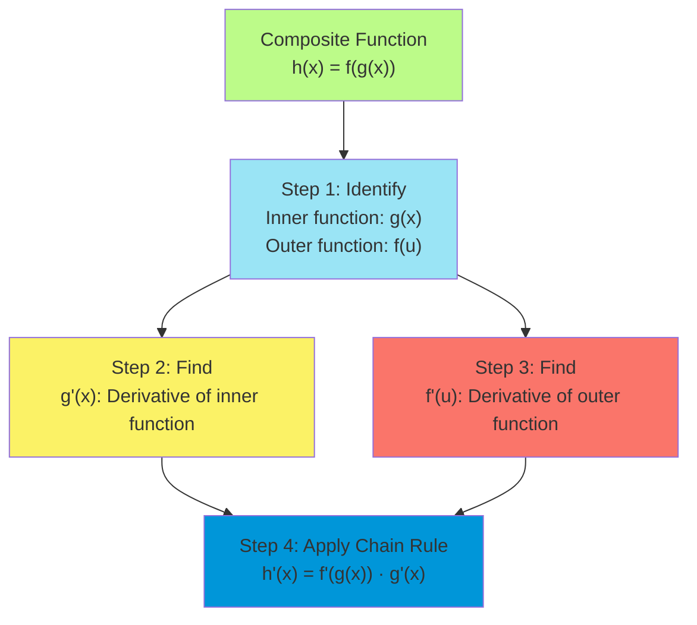
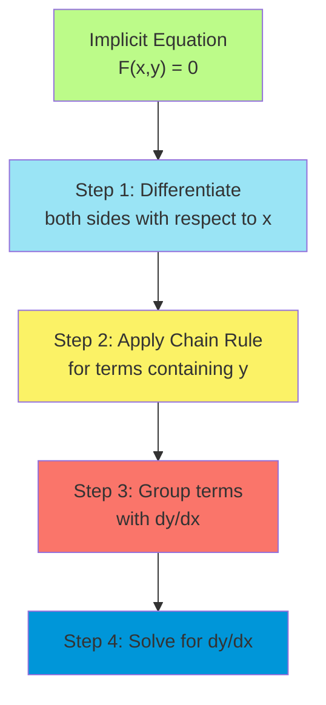
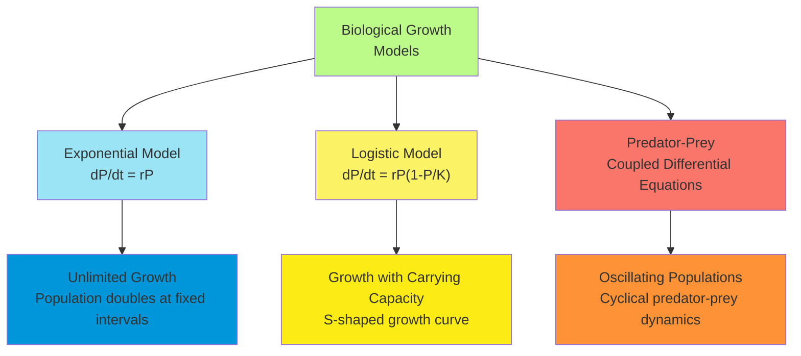
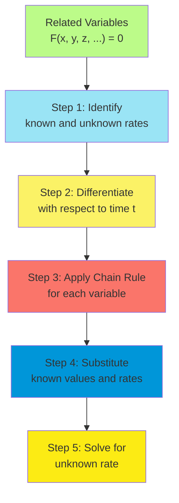
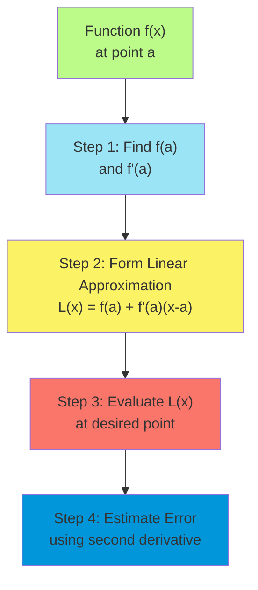
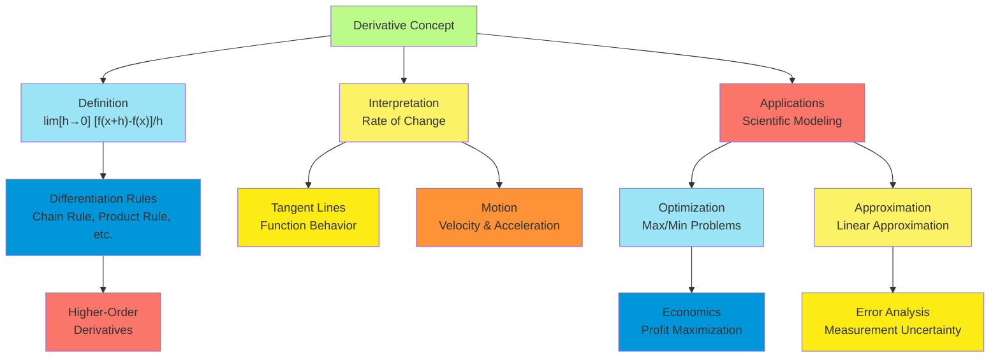

# C-2: Derivatives

1. Derivatives and Rates of Change

    - Definition of the Derivative as a Limit
    - Physical Interpretation and Real-World Applications
    - Notation Systems (Leibniz, Lagrange, Newton)
    - Differentiability and Its Relationship to Continuity

2. The Derivative as a Function

    - Graphical Interpretation of Derivatives
    - Higher-Order Derivatives and Their Meanings
    - Smoothness Properties of Differentiable Functions
    - Constructing Derivative Functions from Original Functions

3. Differentiation Formulas

    - Power Rule and Polynomial Differentiation
    - Product and Quotient Rules with Proofs
    - Derivatives of Constants and Linear Combinations
    - Special Case Formulas and Shortcut Techniques

4. Derivatives of Trigonometric Functions

    - Derivatives of Sine and Cosine Functions
    - Derivatives of Tangent, Cotangent, Secant, and Cosecant
    - Trigonometric Identities in Differentiation
    - Applications in Oscillatory Motion

5. The Chain Rule

    - Composition of Functions and Differentiation
    - Proof and Intuitive Understanding
    - Nested Functions and Multiple Applications
    - Implicit Use in Complex Differentiation Problems

6. Implicit Differentiation

    - Equations Defining Functions Implicitly
    - Step-by-Step Technique and Methodology
    - Applications to Curves and Relations
    - Higher-Order Implicit Derivatives

7. Rates of Change in the Natural and Social Sciences

    - Physical Applications (Velocity, Acceleration)
    - Biological Growth Models and Population Dynamics
    - Economic Applications (Marginal Cost, Revenue)
    - Social Science Models and Interpretations

8. Related Rates

    - Time Derivatives and Interrelated Quantities
    - Geometric Problems and Spatial Relationships
    - Problem-Solving Strategy and Common Pitfalls
    - Real-World Applications and Case Studies

9. Linear Approximations and Differentials
    - Tangent Line Approximation and Error Analysis
    - Definition and Geometrical Interpretation of Differentials
    - Total Differential for Functions of Multiple Variables
    - Applications in Error Estimation and Measurement

#### Derivatives and Rates of Change

The derivative concept sits at the heart of differential calculus, providing a precise mathematical formulation for the
rate at which quantities change. This powerful tool emerged from attempts to solve two seemingly distinct problems:
finding tangent lines to curves and calculating instantaneous velocity.

##### Definition of the Derivative as a Limit

The derivative of a function $f$ at a point $x = a$ is defined as the limit:

$$f'(a) = \lim_{h \to 0} \frac{f(a+h) - f(a)}{h}$$

This expression represents the slope of the tangent line to the graph of $f$ at the point $(a, f(a))$. Equivalently,
using different notation for the limit:

$$f'(a) = \lim_{x \to a} \frac{f(x) - f(a)}{x - a}$$

The difference quotient $\frac{f(a+h) - f(a)}{h}$ gives the slope of the secant line connecting the points $(a, f(a))$
and $(a+h, f(a+h))$. As $h$ approaches zero, this secant line approaches the tangent line at $(a, f(a))$.

The derivative function $f'(x)$ assigns to each input $x$ the derivative of $f$ at that point, provided the limit
exists. This function gives the instantaneous rate of change of $f$ with respect to $x$ at any point in the domain where
$f$ is differentiable.

##### Physical Interpretation and Real-World Applications

The derivative has profound interpretations across diverse fields:

1. **Kinematics**: If $s(t)$ represents the position of an object at time $t$:
    - The first derivative $s'(t) = v(t)$ gives the instantaneous velocity
    - The second derivative $s''(t) = a(t)$ gives the instantaneous acceleration
2. **Rate of Change**: The derivative $f'(x)$ measures how quickly the output $f(x)$ changes with respect to small
   changes in the input $x$.
3. **Optimization**: Critical points where $f'(x) = 0$ help identify maximum or minimum values, essential for
   optimization problems in economics, engineering, and natural sciences.
4. **Marginal Analysis**: In economics, derivatives represent marginal quantities:
    - If $C(x)$ is the cost of producing $x$ items, then $C'(x)$ is the marginal cost
    - If $R(x)$ is the revenue from selling $x$ items, then $R'(x)$ is the marginal revenue
5. **Growth Rates**: In population biology, if $P(t)$ represents population size at time $t$, then $P'(t)$ gives the
   instantaneous growth rate.
6. **Heat Flow**: In thermodynamics, derivatives describe the rate of heat transfer across boundaries.
7. **Electric Fields**: In electromagnetism, derivatives relate the electric potential to the electric field strength.

The derivative's ability to quantify instantaneous change makes it indispensable across the sciences.

##### Notation Systems (Leibniz, Lagrange, Newton)

Several notation systems exist for derivatives, each with advantages in different contexts:

1. **Lagrange's Notation** (Prime Notation):

    - First derivative: $f'(x)$
    - Second derivative: $f''(x)$
    - nth derivative: $f^{(n)}(x)$

    This concise notation is convenient for indicating the order of differentiation and is widely used in theoretical
    discussions.

2. **Leibniz's Notation**:

    - First derivative: $\frac{dy}{dx}$ or $\frac{d}{dx}[y]$ or $\frac{d}{dx}[f(x)]$
    - Second derivative: $\frac{d^2y}{dx^2}$
    - nth derivative: $\frac{d^ny}{dx^n}$

    This notation explicitly shows the variables involved and extends naturally to partial derivatives. It also suggests
    the differential relationship $dy = f'(x) , dx$, useful in integration and differential equations.

3. **Newton's Notation** (Dot Notation):

    - First derivative: $\dot{y}$ or $\dot{f}$
    - Second derivative: $\ddot{y}$ or $\ddot{f}$

    Primarily used in physics, especially for time derivatives in mechanics, this notation is compact but less explicit
    about the independent variable.

4. **Euler's Notation**:

    - First derivative: $D_x[f]$ or $Df$
    - Second derivative: $D^2_x[f]$ or $D^2f$

    This operator-based notation is useful in differential equations and functional analysis.

Each notation system offers distinct advantages, and most mathematicians and scientists switch between them depending on
the context.

##### Differentiability and Its Relationship to Continuity

A function $f$ is differentiable at a point $a$ if the derivative $f'(a)$ exists, meaning the limit defining the
derivative exists and is finite.

The relationship between differentiability and continuity is fundamental:

**Theorem**: If a function $f$ is differentiable at a point $a$, then $f$ is continuous at $a$.

Proof sketch:

1. We need to show $\lim_{x \to a} f(x) = f(a)$
2. We can write $f(x) - f(a) = \frac{f(x) - f(a)}{x - a} \cdot (x - a)$
3. As $x \to a$, the first factor approaches $f'(a)$ (by differentiability)
4. The second factor approaches 0
5. Therefore, $\lim_{x \to a} [f(x) - f(a)] = 0$, which means $\lim_{x \to a} f(x) = f(a)$

The converse, however, is not true. A function can be continuous at a point without being differentiable there.

Common cases where a continuous function fails to be differentiable include:

1. **Sharp corners**: The absolute value function $f(x) = |x|$ is continuous at $x = 0$ but not differentiable there due
   to the abrupt change in direction.
2. **Cusps**: Functions like $f(x) = x^{2/3}$ have a cusp at $x = 0$ where the slope becomes vertical.
3. **Vertical tangents**: For functions like $f(x) = x^{1/3}$, the derivative approaches infinity as $x$ approaches 0.
4. **Oscillatory behavior**: Functions like $f(x) = x^2 \sin(1/x)$ for $x \neq 0$ and $f(0) = 0$ are continuous
   everywhere but not differentiable at $x = 0$ due to wildly oscillating slopes near the origin.

Understanding these relationships is crucial for analyzing function behavior and applying calculus effectively.

#### The Derivative as a Function

While the derivative at a specific point gives the instantaneous rate of change at that location, the derivative
function provides a comprehensive view of how a function's rate of change evolves across its domain.

##### Graphical Interpretation of Derivatives

The derivative function $f'(x)$ has several important graphical interpretations:

1. **Slope of Tangent Lines**: At each point $x$, the value $f'(x)$ equals the slope of the tangent line to the graph of
   $f$ at the point $(x, f(x))$.
2. **Rate of Change Indicator**:
    - Where $f'(x) > 0$, the function $f$ is increasing
    - Where $f'(x) < 0$, the function $f$ is decreasing
    - Where $f'(x) = 0$, the function $f$ has a horizontal tangent (critical point)
3. **Steepness of Graph**: The magnitude of $f'(x)$ indicates how steeply the graph of $f$ is rising or falling:
    - Large positive values of $f'(x)$ indicate steep upward slopes
    - Large negative values of $f'(x)$ indicate steep downward slopes
    - Values of $f'(x)$ near zero indicate relatively flat regions
4. **Relationship between Graphs**: The graph of $f'$ can be constructed by plotting the slopes of the tangent lines to
   $f$ at each point:
    - Peaks in $f$ correspond to zeros in $f'$ with sign changes from positive to negative
    - Valleys in $f$ correspond to zeros in $f'$ with sign changes from negative to positive
    - Inflection points in $f$ correspond to extrema in $f'$

Understanding this graphical relationship helps visualize function behavior and analyze the relationship between a
function and its rate of change.

##### Higher-Order Derivatives and Their Meanings

The process of differentiation can be applied repeatedly, yielding higher-order derivatives:

1. **First Derivative** ($f'(x)$ or $\frac{dy}{dx}$): Rate of change of the function
2. **Second Derivative** ($f''(x)$ or $\frac{d^2y}{dx^2}$): Rate of change of the first derivative (acceleration)
3. **Third Derivative** ($f'''(x)$ or $\frac{d^3y}{dx^3}$): Rate of change of the second derivative (jerk or jolt)
4. **Fourth Derivative** ($f^{(4)}(x)$ or $\frac{d^4y}{dx^4}$): Rate of change of the third derivative (snap)

Physical interpretations for a position function $s(t)$:

- $s'(t)$: Velocity
- $s''(t)$: Acceleration
- $s'''(t)$: Jerk (rate of change of acceleration)
- $s^{(4)}(t)$: Snap (rate of change of jerk)

Geometric interpretations:

- $f'(x)$: Slope of the curve
- $f''(x)$: Curvature-related information:
    - $f''(x) > 0$: Curve is concave up (curving upward)
    - $f''(x) < 0$: Curve is concave down (curving downward)
    - $f''(x) = 0$: Potential inflection point where concavity changes

Economic interpretations for a cost function $C(x)$:

- $C'(x)$: Marginal cost
- $C''(x)$: Rate of change of marginal cost (indicates economies or diseconomies of scale)

Higher-order derivatives provide increasingly refined information about function behavior and are essential in various
applications, including Taylor series expansions, differential equations, and analysis of physical systems.

##### Smoothness Properties of Differentiable Functions

The concept of smoothness in mathematics relates to how many continuous derivatives a function possesses:

1. **$C^0$ Functions**: Continuous functions (0 continuous derivatives)
2. **$C^1$ Functions**: Functions with continuous first derivatives
3. **$C^2$ Functions**: Functions with continuous first and second derivatives
4. **$C^n$ Functions**: Functions with continuous derivatives up to order $n$
5. **$C^∞$ Functions**: Infinitely differentiable functions (smooth functions)

Important properties:

- A function that is $C^n$ is automatically $C^{n-1}$, $C^{n-2}$, etc.
- Polynomials are $C^∞$ functions (infinitely differentiable)
- The absolute value function $|x|$ is $C^0$ but not $C^1$ (continuous but not differentiable at $x = 0$)
- Functions like $x^{2/3}$ are continuous but not differentiable at $x = 0$

Practical implications of smoothness:

- $C^1$ functions have no sharp corners
- $C^2$ functions have continuous curvature (important in design and physics)
- Higher degrees of smoothness allow for better approximations with Taylor polynomials
- Many physical laws require certain levels of smoothness for their solutions

Smoothness properties influence the behavior of functions in analysis, differential equations, and applied mathematics,
providing important qualitative information about function behavior.

##### Constructing Derivative Functions from Original Functions

Constructing the derivative function $f'(x)$ from a given function $f(x)$ involves several approaches:

1. **Analytical Method**: Apply differentiation rules directly to $f(x)$:
    - For $f(x) = x^3 - 2x^2 + 4x - 7$
    - $f'(x) = 3x^2 - 4x + 4$
2. **Graphical Method**: Estimate the slope of the tangent line at various points and plot these values:
    - For each $x$-value, estimate the slope at $(x, f(x))$
    - Plot these slopes against the corresponding $x$-values
3. **Numerical Method**: Use the difference quotient with a small value of $h$:
    - $f'(x) \approx \frac{f(x+h) - f(x)}{h}$ for small $h$
    - More accurate approximations include:
        - Central difference: $f'(x) \approx \frac{f(x+h) - f(x-h)}{2h}$
        - Higher-order differences for improved accuracy
4. **Symbolic Differentiation**: Use computer algebra systems to perform symbolic differentiation
5. **Automatic Differentiation**: Used in machine learning and computational mathematics to efficiently compute
   derivatives

Verifying the derivative function:

- Check that $f'(a)$ gives the slope of the tangent to $f$ at $(a, f(a))$
- Confirm that $f'(x)$ is positive where $f$ is increasing and negative where $f$ is decreasing
- Verify that $f'(x) = 0$ at critical points of $f$

Understanding the relationship between a function and its derivative provides essential insights into function behavior
and enables applications across mathematics and applied sciences.

#### Differentiation Formulas

The practical application of calculus relies heavily on a toolkit of differentiation rules. These formulas allow us to
differentiate complex functions without resorting to the limit definition each time.

##### Power Rule and Polynomial Differentiation

The power rule forms the foundation of differentiation techniques and states:

For any real number $n$, the derivative of $x^n$ is:

$$\frac{d}{dx}[x^n] = nx^{n-1}$$

This powerful rule applies to any function raised to a power:

$$\frac{d}{dx}[u^n] = nu^{n-1} \cdot \frac{du}{dx}$$

where $u$ is a function of $x$.

Special cases include:

- $\frac{d}{dx}[x] = 1$ (when $n = 1$)
- $\frac{d}{dx}[1] = 0$ (when $n = 0$, since $1 = x^0$)
- $\frac{d}{dx}[\frac{1}{x}] = -\frac{1}{x^2}$ (when $n = -1$)
- $\frac{d}{dx}[\sqrt{x}] = \frac{1}{2\sqrt{x}}$ (when $n = \frac{1}{2}$)

For polynomials, we can differentiate term by term:

$$\frac{d}{dx}[a_nx^n + a_{n-1}x^{n-1} + \ldots + a_1x + a_0] = na_nx^{n-1} + (n-1)a_{n-1}x^{n-2} + \ldots + a_1$$

Example: For $f(x) = 3x^4 - 2x^3 + 5x - 7$ $f'(x) = 12x^3 - 6x^2 + 5 - 0 = 12x^3 - 6x^2 + 5$

The power rule's wide applicability makes it one of the most frequently used differentiation techniques.

##### Product and Quotient Rules with Proofs

When functions are multiplied or divided, we apply specialized rules:

1. **Product Rule**: For functions $f(x)$ and $g(x)$:

    $$\frac{d}{dx}[f(x) \cdot g(x)] = f(x) \cdot \frac{d}{dx}[g(x)] + g(x) \cdot \frac{d}{dx}[f(x)]$$

    Or in more compact notation:

    $$(f \cdot g)' = f \cdot g' + g \cdot f'$$

    Proof sketch:

    - Begin with the definition of the derivative as a limit:
      $(f \cdot g)'(x) = \lim_{h \to 0} \frac{f(x+h)g(x+h) - f(x)g(x)}{h}$
    - Add and subtract $f(x+h)g(x)$ in the numerator:
      $(f \cdot g)'(x) = \lim_{h \to 0} \frac{f(x+h)g(x+h) - f(x+h)g(x) + f(x+h)g(x) - f(x)g(x)}{h}$
    - Group terms and simplify:
      $(f \cdot g)'(x) = \lim_{h \to 0} [f(x+h) \frac{g(x+h) - g(x)}{h} + g(x) \frac{f(x+h) - f(x)}{h}]$
    - As $h \to 0$, $f(x+h) \to f(x)$, and the other limits become $g'(x)$ and $f'(x)$
    - This yields $(f \cdot g)'(x) = f(x)g'(x) + g(x)f'(x)$

2. **Quotient Rule**: For functions $f(x)$ and $g(x)$ where $g(x) \neq 0$:

    $$\frac{d}{dx}\left[\frac{f(x)}{g(x)}\right] = \frac{g(x) \cdot \frac{d}{dx}[f(x)] - f(x) \cdot \frac{d}{dx}[g(x)]}{[g(x)]^2}$$

    Or more compactly:

    $$\left(\frac{f}{g}\right)' = \frac{g \cdot f' - f \cdot g'}{g^2}$$

    Proof sketch:

    - The quotient rule can be derived from the product rule by noting that $\frac{f}{g} = f \cdot \frac{1}{g}$
    - The derivative of $\frac{1}{g}$ is $-\frac{g'}{g^2}$ (using the chain rule)
    - Applying the product rule:
      $(\frac{f}{g})' = f' \cdot \frac{1}{g} + f \cdot (-\frac{g'}{g^2}) = \frac{f'}{g} - \frac{f \cdot g'}{g^2} = \frac{g \cdot f' - f \cdot g'}{g^2}$

These rules enable differentiation of complex expressions without resorting to the first principles approach.

##### Derivatives of Constants and Linear Combinations

Basic differentiation principles include:

1. **Constant Rule**: The derivative of a constant is zero:

    $$\frac{d}{dx}[c] = 0$$

    where $c$ is any constant.

    This makes intuitive sense because constants do not change as $x$ changes, so their rate of change is zero.

2. **Constant Multiple Rule**: For any constant $c$ and differentiable function $f(x)$:

    $$\frac{d}{dx}[c \cdot f(x)] = c \cdot \frac{d}{dx}[f(x)]$$

    Or more compactly:

    $$(c \cdot f)' = c \cdot f'$$

    This rule allows us to factor constants outside the differentiation operation.

3. **Sum and Difference Rules**: For differentiable functions $f(x)$ and $g(x)$:

    $$\frac{d}{dx}[f(x) \pm g(x)] = \frac{d}{dx}[f(x)] \pm \frac{d}{dx}[g(x)]$$

    Or more compactly:

    $$(f \pm g)' = f' \pm g'$$

    This rule means we can differentiate functions term by term.

These properties establish differentiation as a linear operation, which greatly simplifies the process of finding
derivatives of complex expressions.

Example: For $h(x) = 5x^3 - 7\sin(x) + 2$ $h'(x) = 5 \cdot 3x^2 - 7 \cdot \cos(x) + 0 = 15x^2 - 7\cos(x)$

These basic rules, combined with the product, quotient, and chain rules, form the foundation of differential calculus.

##### Special Case Formulas and Shortcut Techniques

Beyond the fundamental rules, several special formulas expedite differentiation:

1. **Exponential Functions**:
    - $\frac{d}{dx}[e^x] = e^x$
    - $\frac{d}{dx}[a^x] = a^x \ln(a)$ for $a > 0$
2. **Logarithmic Functions**:
    - $\frac{d}{dx}[\ln(x)] = \frac{1}{x}$ for $x > 0$
    - $\frac{d}{dx}[\log_a(x)] = \frac{1}{x \ln(a)}$ for $x > 0$ and $a > 0, a \neq 1$
3. **Inverse Trigonometric Functions**:
    - $\frac{d}{dx}[\arcsin(x)] = \frac{1}{\sqrt{1-x^2}}$ for $|x| < 1$
    - $\frac{d}{dx}[\arccos(x)] = -\frac{1}{\sqrt{1-x^2}}$ for $|x| < 1$
    - $\frac{d}{dx}[\arctan(x)] = \frac{1}{1+x^2}$
4. **Hyperbolic Functions**:
    - $\frac{d}{dx}[\sinh(x)] = \cosh(x)$
    - $\frac{d}{dx}[\cosh(x)] = \sinh(x)$
    - $\frac{d}{dx}[\tanh(x)] = \text{sech}^2(x) = \frac{1}{\cosh^2(x)}$

Shortcut techniques include:

1. **Logarithmic Differentiation**: Useful for expressions involving products, powers, or both:

    - Take the natural logarithm of both sides
    - Differentiate implicitly
    - Solve for the original derivative

    Example: For $y = x^x$ $\ln(y) = x\ln(x)$ $\frac{1}{y} \cdot \frac{dy}{dx} = \ln(x) + 1$
    $\frac{dy}{dx} = y(\ln(x) + 1) = x^x(\ln(x) + 1)$

2. **Recognizing Patterns**: For functions that fit known forms:

    - Identify the pattern
    - Apply the appropriate formula
    - Use the chain rule if needed

    Example: For $f(x) = \sin^2(3x)$, recognize this as $[g(x)]^2$ where $g(x) = \sin(3x)$:
    $f'(x) = 2\sin(3x) \cdot \frac{d}{dx}[\sin(3x)] = 2\sin(3x) \cdot 3\cos(3x) = 6\sin(3x)\cos(3x) = 3\sin(6x)$

3. **Table of Derivatives**: Memorizing or referencing common derivatives to speed up calculations

These specialized formulas and techniques streamline the differentiation process, especially for complex expressions.

#### Derivatives of Trigonometric Functions

Trigonometric functions model periodic phenomena and are crucial in various scientific fields. Understanding their
derivatives unlocks powerful analytical tools.

##### Derivatives of Sine and Cosine Functions

The fundamental trigonometric derivatives are:

$$\frac{d}{dx}[\sin(x)] = \cos(x)$$

$$\frac{d}{dx}[\cos(x)] = -\sin(x)$$

Proof sketch for the derivative of sine:

1. Start with the definition of the derivative: $\frac{d}{dx}[\sin(x)] = \lim_{h \to 0} \frac{\sin(x+h) - \sin(x)}{h}$
2. Use the trigonometric identity: $\sin(a+b) = \sin(a)\cos(b) + \cos(a)\sin(b)$
3. Substitute into the limit:
   $\frac{d}{dx}[\sin(x)] = \lim_{h \to 0} \frac{\sin(x)\cos(h) + \cos(x)\sin(h) - \sin(x)}{h}$
4. Simplify: $\frac{d}{dx}[\sin(x)] = \lim_{h \to 0} \frac{\sin(x)(\cos(h) - 1) + \cos(x)\sin(h)}{h}$
5. Use the following limits:
    - $\lim_{h \to 0} \frac{\sin(h)}{h} = 1$
    - $\lim_{h \to 0} \frac{\cos(h) - 1}{h} = 0$
6. This gives: $\frac{d}{dx}[\sin(x)] = \sin(x) \cdot 0 + \cos(x) \cdot 1 = \cos(x)$

The derivative of cosine can be derived similarly or by using the relationship $\cos(x) = \sin(x + \frac{\pi}{2})$.

For composite trigonometric functions, we apply the chain rule:

$$\frac{d}{dx}[\sin(g(x))] = \cos(g(x)) \cdot g'(x)$$

$$\frac{d}{dx}[\cos(g(x))] = -\sin(g(x)) \cdot g'(x)$$

Example: For $f(x) = \sin(3x^2 + 2)$
$f'(x) = \cos(3x^2 + 2) \cdot \frac{d}{dx}[3x^2 + 2] = \cos(3x^2 + 2) \cdot 6x = 6x\cos(3x^2 + 2)$

These derivatives are fundamental in analyzing oscillatory motion and wave phenomena.

##### Derivatives of Tangent, Cotangent, Secant, and Cosecant

The derivatives of the remaining trigonometric functions can be derived using the quotient rule and the derivatives of
sine and cosine:

$$\frac{d}{dx}[\tan(x)] = \frac{d}{dx}\left[\frac{\sin(x)}{\cos(x)}\right] = \frac{\cos^2(x) + \sin^2(x)}{\cos^2(x)} = \frac{1}{\cos^2(x)} = \sec^2(x)$$

$$\frac{d}{dx}[\cot(x)] = \frac{d}{dx}\left[\frac{\cos(x)}{\sin(x)}\right] = \frac{-\sin^2(x) - \cos^2(x)}{\sin^2(x)} = -\frac{1}{\sin^2(x)} = -\csc^2(x)$$

$$\frac{d}{dx}[\sec(x)] = \frac{d}{dx}\left[\frac{1}{\cos(x)}\right] = \frac{\sin(x)}{\cos^2(x)} = \sec(x)\tan(x)$$

$$\frac{d}{dx}[\csc(x)] = \frac{d}{dx}\left[\frac{1}{\sin(x)}\right] = \frac{-\cos(x)}{\sin^2(x)} = -\csc(x)\cot(x)$$

For composite functions involving these trigonometric functions, we apply the chain rule:

$$\frac{d}{dx}[\tan(g(x))] = \sec^2(g(x)) \cdot g'(x)$$

$$\frac{d}{dx}[\cot(g(x))] = -\csc^2(g(x)) \cdot g'(x)$$

$$\frac{d}{dx}[\sec(g(x))] = \sec(g(x))\tan(g(x)) \cdot g'(x)$$

$$\frac{d}{dx}[\csc(g(x))] = -\csc(g(x))\cot(g(x)) \cdot g'(x)$$

Example: For $h(x) = \tan(5x)$ $h'(x) = \sec^2(5x) \cdot 5 = 5\sec^2(5x)$

These derivatives complete the toolkit for differentiating trigonometric expressions.

##### Trigonometric Identities in Differentiation

Trigonometric identities play a crucial role in simplifying derivatives of complex trigonometric expressions. Key
identities that frequently appear in differentiation include:

1. **Pythagorean Identities**:
    - $\sin^2(x) + \cos^2(x) = 1$
    - $1 + \tan^2(x) = \sec^2(x)$
    - $1 + \cot^2(x) = \csc^2(x)$
2. **Double-Angle Formulas**:
    - $\sin(2x) = 2\sin(x)\cos(x)$
    - $\cos(2x) = \cos^2(x) - \sin^2(x) = 2\cos^2(x) - 1 = 1 - 2\sin^2(x)$
    - $\tan(2x) = \frac{2\tan(x)}{1 - \tan^2(x)}$
3. **Addition and Subtraction Formulas**:
    - $\sin(a \pm b) = \sin(a)\cos(b) \pm \cos(a)\sin(b)$
    - $\cos(a \pm b) = \cos(a)\cos(b) \mp \sin(a)\sin(b)$
    - $\tan(a \pm b) = \frac{\tan(a) \pm \tan(b)}{1 \mp \tan(a)\tan(b)}$

These identities help in several ways:

1. **Simplifying Before Differentiation**: For expressions like $\sin^2(x)$, we can differentiate using the chain rule:
   $\frac{d}{dx}[\sin^2(x)] = 2\sin(x) \cdot \cos(x) = \sin(2x)$

    Alternatively, for $\cos^2(x)$, we can use the identity $\cos^2(x) = \frac{1 + \cos(2x)}{2}$:
    $\frac{d}{dx}[\cos^2(x)] = \frac{d}{dx}\left[\frac{1 + \cos(2x)}{2}\right] = \frac{-2\sin(2x)}{2} = -\sin(2x)$

2. **Simplifying After Differentiation**: For $\frac{d}{dx}[\sin(x)\cos(x)]$, using the product rule:
   $\frac{d}{dx}[\sin(x)\cos(x)] = \sin(x) \cdot (-\sin(x)) + \cos(x) \cdot \cos(x) = -\sin^2(x) + \cos^2(x) = \cos(2x)$

    We can also recognize $\sin(x)\cos(x) = \frac{\sin(2x)}{2}$ and differentiate directly:
    $\frac{d}{dx}[\sin(x)\cos(x)] = \frac{d}{dx}\left[\frac{\sin(2x)}{2}\right] = \frac{\cos(2x) \cdot 2}{2} = \cos(2x)$

3. **Alternative Forms**: The identity $\frac{d}{dx}[\tan(x)] = \sec^2(x)$ can also be expressed as
   $\frac{d}{dx}[\tan(x)] = 1 + \tan^2(x)$

These techniques are essential for efficiently handling complex trigonometric expressions and recognizing patterns that
simplify differentiation.

##### Applications in Oscillatory Motion

Trigonometric functions and their derivatives are fundamental to modeling oscillatory phenomena:

1. **Simple Harmonic Motion**: For a particle moving along a straight line with position
   $x(t) = A\cos(\omega t + \phi)$:

    - Position: $x(t) = A\cos(\omega t + \phi)$
    - Velocity: $v(t) = x'(t) = -A\omega\sin(\omega t + \phi)$
    - Acceleration: $a(t) = x''(t) = -A\omega^2\cos(\omega t + \phi) = -\omega^2 x(t)$

    The relationship $a(t) = -\omega^2 x(t)$ is characteristic of simple harmonic motion, showing that acceleration is
    proportional to displacement and directed toward the equilibrium position.

2. **Damped Oscillations**: For a damped oscillator with position $x(t) = Ae^{-\gamma t}\cos(\omega t + \phi)$:

    - Position: $x(t) = Ae^{-\gamma t}\cos(\omega t + \phi)$
    - Velocity:
      $v(t) = x'(t) = -\gamma Ae^{-\gamma t}\cos(\omega t + \phi) - \omega Ae^{-\gamma t}\sin(\omega t + \phi)$
    - Acceleration:
      $a(t) = x''(t) = (\gamma^2 - \omega^2)Ae^{-\gamma t}\cos(\omega t + \phi) + 2\gamma\omega Ae^{-\gamma t}\sin(\omega t + \phi)$

    The derivatives reveal how the amplitude decays over time and how the damping affects the frequency.

3. **Wave Equations**: For a wave described by $u(x,t) = A\sin(kx - \omega t)$:

    - Partial derivative with respect to time: $\frac{\partial u}{\partial t} = -A\omega\cos(kx - \omega t)$
    - Second partial derivative: $\frac{\partial^2 u}{\partial t^2} = -A\omega^2\sin(kx - \omega t) = -\omega^2 u(x,t)$
    - Partial derivative with respect to position: $\frac{\partial u}{\partial x} = Ak\cos(kx - \omega t)$
    - Second partial derivative: $\frac{\partial^2 u}{\partial x^2} = -Ak^2\sin(kx - \omega t) = -k^2 u(x,t)$

    The wave equation $\frac{\partial^2 u}{\partial t^2} = c^2 \frac{\partial^2 u}{\partial x^2}$ can be verified by
    noting that $\omega = ck$ for waves with speed $c$.

4. **Energy in Oscillatory Systems**: For a mass on a spring with position $x(t) = A\cos(\omega t)$:

    - Kinetic energy: $K(t) = \frac{1}{2}mv^2(t) = \frac{1}{2}m\omega^2A^2\sin^2(\omega t)$
    - Potential energy: $U(t) = \frac{1}{2}kx^2(t) = \frac{1}{2}kA^2\cos^2(\omega t)$
    - Total energy: $E = K(t) + U(t) = \frac{1}{2}kA^2$, which is constant since $m\omega^2 = k$

These applications demonstrate how derivatives of trigonometric functions provide essential insights into the behavior
of oscillatory systems, from mechanical vibrations to electromagnetic waves.

#### The Chain Rule

The chain rule extends differentiation to composite functions, greatly expanding our ability to analyze complex
relationships. It is one of the most powerful and frequently used tools in calculus.

##### Composition of Functions and Differentiation

Function composition occurs when one function is applied to the output of another:

$$h(x) = f(g(x))$$

Here, $g$ is the inner function and $f$ is the outer function. The composite function $h$ applies $g$ first, then
applies $f$ to the result.

Examples:

- If $f(x) = \sin(x)$ and $g(x) = x^2$, then $h(x) = f(g(x)) = \sin(x^2)$
- If $f(x) = \sqrt{x}$ and $g(x) = 1+x^3$, then $h(x) = f(g(x)) = \sqrt{1+x^3}$
- If $f(x) = e^x$ and $g(x) = \ln(x+1)$, then $h(x) = f(g(x)) = e^{\ln(x+1)} = x+1$

The chain rule states that the derivative of a composite function equals the derivative of the outer function evaluated
at the inner function, multiplied by the derivative of the inner function:

$$\frac{d}{dx}[f(g(x))] = f'(g(x)) \cdot g'(x)$$

In Leibniz notation, if $y = f(u)$ and $u = g(x)$, then:

$$\frac{dy}{dx} = \frac{dy}{du} \cdot \frac{du}{dx}$$

This notation clearly illustrates why the chain rule is sometimes described as "the derivatives multiply."

##### Proof and Intuitive Understanding

The chain rule can be proven using the limit definition of the derivative:

1. For the composite function $h(x) = f(g(x))$, the derivative is:
   $$h'(x) = \lim_{h \to 0} \frac{h(x+h) - h(x)}{h} = \lim_{h \to 0} \frac{f(g(x+h)) - f(g(x))}{h}$$

2. Multiply and divide by $g(x+h) - g(x)$:
   $$h'(x) = \lim_{h \to 0} \frac{f(g(x+h)) - f(g(x))}{g(x+h) - g(x)} \cdot \frac{g(x+h) - g(x)}{h}$$

3. This can be rewritten as:
   $$h'(x) = \lim_{h \to 0} \frac{f(g(x+h)) - f(g(x))}{g(x+h) - g(x)} \cdot \lim_{h \to 0} \frac{g(x+h) - g(x)}{h}$$

    assuming both limits exist and $g(x+h) - g(x) \neq 0$ for small $h$.

4. The first limit equals $f'(g(x))$ and the second equals $g'(x)$, giving: $$h'(x) = f'(g(x)) \cdot g'(x)$$

Intuitively, the chain rule can be understood through rates of change:

- $g'(x)$ represents how quickly the inner function $g$ changes with respect to $x$
- $f'(g(x))$ represents how quickly the outer function $f$ changes with respect to $g$
- $h'(x)$ combines these effects: if $g$ changes rapidly with $x$, and $f$ changes rapidly with $g$, then $f(g(x))$
  changes rapidly with $x$

Physical analogy: Consider a gear system where the input gear ($x$) drives an intermediate gear ($g$), which drives the
output gear ($f$). The rotation rate of the output depends on both the gear ratio between input and intermediate
(represented by $g'(x)$) and the gear ratio between intermediate and output (represented by $f'(g(x))$).

##### Nested Functions and Multiple Applications

The chain rule extends naturally to compositions of more than two functions:

For $h(x) = f(g(m(x)))$ with three nested functions, the derivative is:
$$h'(x) = f'(g(m(x))) \cdot g'(m(x)) \cdot m'(x)$$

This pattern continues for any number of nested functions.

Examples of multiple applications:

1. **Triple nested functions**: For $h(x) = \sin(e^{x^2})$:

    - Inner function: $m(x) = x^2$, so $m'(x) = 2x$
    - Middle function: $g(u) = e^u$, so $g'(u) = e^u$
    - Outer function: $f(v) = \sin(v)$, so $f'(v) = \cos(v)$

    Applying the chain rule: $h'(x) = \cos(e^{x^2}) \cdot e^{x^2} \cdot 2x = 2x \cdot e^{x^2} \cdot \cos(e^{x^2})$

2. **Expressions with multiple chain rule applications**: For $k(x) = \sqrt{x^2 + 1} \cdot \tan(3x)$:

    - Using the product rule:
      $k'(x) = \frac{d}{dx}[\sqrt{x^2 + 1}] \cdot \tan(3x) + \sqrt{x^2 + 1} \cdot \frac{d}{dx}[\tan(3x)]$
    - For the first term, use the chain rule:
      $\frac{d}{dx}[\sqrt{x^2 + 1}] = \frac{1}{2}(x^2 + 1)^{-1/2} \cdot 2x = \frac{x}{\sqrt{x^2 + 1}}$
    - For the second term, use the chain rule: $\frac{d}{dx}[\tan(3x)] = \sec^2(3x) \cdot 3 = 3\sec^2(3x)$
    - Combining: $k'(x) = \frac{x}{\sqrt{x^2 + 1}} \cdot \tan(3x) + \sqrt{x^2 + 1} \cdot 3\sec^2(3x)$

3. **General power rule as a chain rule application**: For $y = [g(x)]^n$:

    - This is a composition where $f(u) = u^n$ and $u = g(x)$
    - Using the chain rule: $\frac{dy}{dx} = n[g(x)]^{n-1} \cdot g'(x)$

The ability to handle nested functions enables us to differentiate virtually any explicitly defined function.

##### Implicit Use in Complex Differentiation Problems

The chain rule often appears implicitly in standard differentiation formulas:

1. **General Power Rule**: $\frac{d}{dx}[g(x)^n] = n \cdot g(x)^{n-1} \cdot g'(x)$

    This is the chain rule applied to $f(u) = u^n$ where $u = g(x)$.

2. **Trigonometric Compositions**: $\frac{d}{dx}[\sin(g(x))] = \cos(g(x)) \cdot g'(x)$

    This is the chain rule applied to $f(u) = \sin(u)$ where $u = g(x)$.

3. **Exponential Compositions**: $\frac{d}{dx}[e^{g(x)}] = e^{g(x)} \cdot g'(x)$

    This is the chain rule applied to $f(u) = e^u$ where $u = g(x)$.

4. **Logarithmic Compositions**: $\frac{d}{dx}[\ln(g(x))] = \frac{1}{g(x)} \cdot g'(x)$

    This is the chain rule applied to $f(u) = \ln(u)$ where $u = g(x)$.

The chain rule is also essential in more advanced applications:

1. **Change of Variables in Integration**: The substitution method in integration (where $u = g(x)$ and
   $du = g'(x) , dx$) is based on the chain rule.

2. **Multi-variable Calculus**: The chain rule extends to functions of multiple variables:

    For $z = f(x,y)$ where $x = x(t)$ and $y = y(t)$:
    $\frac{dz}{dt} = \frac{\partial f}{\partial x} \cdot \frac{dx}{dt} + \frac{\partial f}{\partial y} \cdot \frac{dy}{dt}$

3. **Parametric Equations**: For a curve defined by $x = x(t)$ and $y = y(t)$, the derivative $\frac{dy}{dx}$ is found
   using: $\frac{dy}{dx} = \frac{dy/dt}{dx/dt} = \frac{y'(t)}{x'(t)}$

    This is an application of the chain rule.

Understanding the chain rule's presence in these diverse contexts highlights its fundamental importance in calculus.

#### Implicit Differentiation

While many functions can be explicitly expressed as $y = f(x)$, some relationships are more naturally described by
equations like $F(x,y) = 0$ where $y$ is implicitly defined as a function of $x$. Implicit differentiation provides a
powerful technique for finding derivatives in such cases.

##### Equations Defining Functions Implicitly

An equation $F(x,y) = 0$ defines $y$ implicitly as a function of $x$ if for each value of $x$ in some interval, there
exists a unique value of $y$ satisfying the equation.

Examples of implicit relationships:

1. Circle: $x^2 + y^2 = r^2$
2. Ellipse: $\frac{x^2}{a^2} + \frac{y^2}{b^2} = 1$
3. General conic sections: $Ax^2 + Bxy + Cy^2 + Dx + Ey + F = 0$
4. Level curves of functions: $f(x,y) = c$

Unlike explicit functions where $y$ is directly expressed in terms of $x$, implicit relationships may:

- Define multiple values of $y$ for a given $x$
- Define $y$ that cannot be expressed using elementary functions
- Represent more general geometric shapes and relations

For example, the circle $x^2 + y^2 = 1$ can be rewritten explicitly as $y = \pm\sqrt{1 - x^2}$, showing that $y$ is not
a single-valued function of $x$. However, we can still find the derivative of $y$ with respect to $x$ at any point
$(x_0, y_0)$ on the circle where $y$ is locally a function of $x$.

##### Step-by-Step Technique and Methodology

Implicit differentiation follows these steps:

1. Start with the implicit equation $F(x,y) = 0$, viewing $y$ as a function of $x$
2. Differentiate both sides of the equation with respect to $x$, treating $y$ as a function $y(x)$
3. When differentiating terms involving $y$, apply the chain rule, introducing factors of $\frac{dy}{dx}$
4. Solve the resulting equation for $\frac{dy}{dx}$

Example: Find $\frac{dy}{dx}$ for the circle $x^2 + y^2 = r^2$

1. Differentiate both sides with respect to $x$: $\frac{d}{dx}[x^2 + y^2] = \frac{d}{dx}[r^2]$

2. Apply differentiation rules: $2x + 2y \cdot \frac{dy}{dx} = 0$

    Note: When differentiating $y^2$, we use the chain rule: $\frac{d}{dx}[y^2] = 2y \cdot \frac{dy}{dx}$

3. Solve for $\frac{dy}{dx}$: $2y \cdot \frac{dy}{dx} = -2x$ $\frac{dy}{dx} = -\frac{x}{y}$

This derivative gives the slope of the tangent line to the circle at any point $(x,y)$ on the circle where $y \neq 0$.

##### Applications to Curves and Relations

Implicit differentiation enables analysis of curves that cannot be easily expressed explicitly:

1. **Conic Sections**: For an ellipse $\frac{x^2}{a^2} + \frac{y^2}{b^2} = 1$:

    Differentiating with respect to $x$: $\frac{2x}{a^2} + \frac{2y}{b^2} \cdot \frac{dy}{dx} = 0$

    Solving for $\frac{dy}{dx}$: $\frac{dy}{dx} = -\frac{b^2 \cdot x}{a^2 \cdot y}$

    This reveals how the slope varies around the ellipse.

2. **Tangent Lines to Curves**: For the curve $xy^3 - y = x^2 + 1$, find the tangent line at point $(2,1)$.

    Differentiating implicitly: $y^3 + 3xy^2 \frac{dy}{dx} - \frac{dy}{dx} = 2x$

    Rearranging: $(3xy^2 - 1) \frac{dy}{dx} = 2x - y^3$

    $\frac{dy}{dx} = \frac{2x - y^3}{3xy^2 - 1}$

    At $(2,1)$: $\frac{dy}{dx} = \frac{2(2) - 1^3}{3(2)(1)^2 - 1} = \frac{3}{5}$

    Tangent line equation: $y - 1 = \frac{3}{5}(x - 2)$ or $y = \frac{3}{5}x - \frac{1}{5}$

3. **Normal Lines to Curves**: The normal line is perpendicular to the tangent line, so its slope is $-\frac{1}{dy/dx}$.

    For the curve $x^2 + 2y^2 = 6$ at point $(2, 1)$:

    Implicit differentiation gives: $2x + 4y \cdot \frac{dy}{dx} = 0$ $\frac{dy}{dx} = -\frac{x}{2y}$

    At $(2, 1)$: $\frac{dy}{dx} = -\frac{2}{2} = -1$

    Normal line slope: $\frac{1}{1} = 1$

    Normal line equation: $y - 1 = 1(x - 2)$ or $y = x - 1$

4. **Orthogonal Trajectories**: Curves that intersect a family of curves at right angles.

    For the family of ellipses $\frac{x^2}{a^2} + \frac{y^2}{b^2} = 1$, the orthogonal trajectories satisfy:

    $\frac{dy}{dx} \cdot \left(-\frac{b^2 \cdot x}{a^2 \cdot y}\right) = -1$

    This yields the differential equation for the orthogonal family: $\frac{dy}{dx} = \frac{a^2 \cdot y}{b^2 \cdot x}$

Implicit differentiation is particularly valuable for analyzing algebraic curves like foliums, lemniscates, and other
curves defined by polynomial relations.

##### Higher-Order Implicit Derivatives

Higher-order derivatives can also be found implicitly by differentiating successive derivatives:

Example: For the equation $x^2 + y^2 = r^2$, find $\frac{d^2y}{dx^2}$

1. We already found $\frac{dy}{dx} = -\frac{x}{y}$
2. Differentiate this expression with respect to $x$: $\frac{d^2y}{dx^2} = \frac{d}{dx}\left[-\frac{x}{y}\right]$
3. Use the quotient rule: $\frac{d^2y}{dx^2} = -\frac{y \cdot 1 - x \cdot \frac{dy}{dx}}{y^2}$
4. Substitute $\frac{dy}{dx} = -\frac{x}{y}$:
   $\frac{d^2y}{dx^2} = -\frac{y - x \cdot (-\frac{x}{y})}{y^2} = -\frac{y + \frac{x^2}{y}}{y^2} = -\frac{y^2 + x^2}{y^3}$
5. Since $x^2 + y^2 = r^2$, we can simplify: $\frac{d^2y}{dx^2} = -\frac{r^2}{y^3}$

This second derivative reveals information about the concavity of the circle at various points.

For general implicit relations $F(x,y) = 0$, finding higher-order derivatives becomes increasingly complex but follows
the same principles:

1. Differentiate the equation implicitly to find $\frac{dy}{dx}$
2. Differentiate $\frac{dy}{dx}$ with respect to $x$, treating it as a function of $x$ and applying the chain rule where
   terms involve $y$
3. Substitute known expressions for $\frac{dy}{dx}$ and simplify
4. Continue this process for higher-order derivatives

Higher-order implicit derivatives are useful in:

- Taylor series expansions of implicitly defined functions
- Analysis of curvature in complex curves
- Stability analysis in differential equations
- Studies of singular points in algebraic curves

This technique extends the power of differential calculus to a much broader class of relationships between variables.

#### Rates of Change in the Natural and Social Sciences

Derivatives quantify rates of change, making them essential tools for modeling dynamic processes across disciplines. The
interpretation of derivatives varies by context, providing insights into diverse phenomena.

##### Physical Applications (Velocity, Acceleration)

In physics, derivatives describe motion and dynamic systems:

1. **Kinematics in One Dimension**: For a particle with position function $s(t)$:

    - Velocity: $v(t) = s'(t)$ (first derivative)
    - Acceleration: $a(t) = v'(t) = s''(t)$ (second derivative)
    - Jerk: $j(t) = a'(t) = s'''(t)$ (third derivative)

    Example: For position $s(t) = t^3 - 6t^2 + 9t + 1$ (in meters):

    - Velocity: $v(t) = 3t^2 - 12t + 9$ (m/s)
    - Acceleration: $a(t) = 6t - 12$ (m/s²)
    - Jerk: $j(t) = 6$ (m/s³)

    Critical analysis reveals:

    - When $v(t) = 0$, the particle momentarily stops
    - When $a(t) = 0$, the particle has zero acceleration (constant velocity)
    - The sign of $v(t)$ indicates direction of motion
    - The sign of $a(t)$ indicates whether speed is increasing or decreasing

2. **Rotational Motion**: For an object rotating with angular position $\theta(t)$:

    - Angular velocity: $\omega(t) = \theta'(t)$ (rad/s)
    - Angular acceleration: $\alpha(t) = \omega'(t) = \theta''(t)$ (rad/s²)

    The relationship between linear and angular quantities:

    - Linear velocity: $v = r\omega$
    - Linear acceleration: $a = r\alpha$
    - Centripetal acceleration: $a_c = r\omega^2 = \frac{v^2}{r}$

3. **Force and Newton's Laws**: For a particle with mass $m$:

    - Force: $F = ma = m \cdot s''(t)$
    - Work done by a variable force $F(x)$: $W = \int_{x_1}^{x_2} F(x) , dx$
    - Power: $P(t) = F(t) \cdot v(t) = m \cdot a(t) \cdot v(t)$

4. **Wave Phenomena**: For a wave function $y(x,t)$:

    - Wave velocity: $v = \frac{\omega}{k}$ where $\omega$ is angular frequency and $k$ is wave number
    - Wave equation: $\frac{\partial^2 y}{\partial t^2} = v^2 \frac{\partial^2 y}{\partial x^2}$

    The derivatives describe the rate of change of displacement with respect to time and position.

These applications demonstrate how derivatives provide a mathematical language for describing physical motion and
forces.

##### Biological Growth Models and Population Dynamics

In biology, derivatives model growth processes and population changes:

1. **Exponential Growth**: For a population $P(t)$ following unlimited growth: $P(t) = P_0 e^{rt}$

    The growth rate is: $\frac{dP}{dt} = rP(t)$

    This indicates that the population changes at a rate proportional to its current size, with $r$ being the intrinsic
    growth rate.

    Applications: Bacterial growth, compound interest, unconstrained population increase

2. **Logistic Growth**: For a population with carrying capacity $K$:
   $P(t) = \frac{K}{1 + \left(\frac{K-P_0}{P_0}\right)e^{-rt}}$

    The growth rate is: $\frac{dP}{dt} = rP(t)\left(1 - \frac{P(t)}{K}\right)$

    This model incorporates density-dependent factors:

    - When $P$ is small relative to $K$, growth is approximately exponential
    - As $P$ approaches $K$, growth slows
    - The maximum growth rate occurs at $P = \frac{K}{2}$

    Applications: Population ecology, cell growth, market saturation

3. **Gompertz Growth Model**: For systems with asymmetric growth patterns: $P(t) = Ke^{-be^{-ct}}$

    The growth rate is: $\frac{dP}{dt} = cP(t)\ln\left(\frac{K}{P(t)}\right)$

    Applications: Tumor growth, organism growth, technology adoption

4. **Predator-Prey Dynamics** (Lotka-Volterra equations): For interacting populations of predators ($y$) and prey ($x$):
   $\frac{dx}{dt} = \alpha x - \beta xy$ $\frac{dy}{dt} = \delta xy - \gamma y$

​ Where:

- $\delta$: predator growth rate from predation
- $\gamma$: predator death rate without prey
- $\alpha$: prey growth rate without predators
- $\beta$: predation rate

​ This system of differential equations produces cyclical population dynamics often observed in nature.

1. **Epidemiological Models**: The SIR model divides a population into Susceptible, Infected, and Recovered individuals:
   $\frac{dS}{dt} = -\beta SI$ $\frac{dI}{dt} = \beta SI - \gamma I$ $\frac{dR}{dt} = \gamma I$

    Where:

    - $\beta$: infection rate constant
    - $\gamma$: recovery rate constant

    The derivatives describe the rates at which individuals transition between compartments, crucial for predicting
    disease spread.

2. **Allometric Growth**: Relationships between biological measurements often follow power laws: $y = ax^b$

    The derivative $\frac{dy}{dx} = abx^{b-1}$ characterizes how one measurement changes relative to another.

    Example: For brain mass ($y$) versus body mass ($x$) with $b ≈ 0.75$, the derivative reveals how brain size scales
    with increasing body size across species.

These biological applications demonstrate how rates of change provide insights into growth patterns, population
dynamics, and complex ecological interactions.

##### Economic Applications (Marginal Cost, Revenue)

In economics, derivatives quantify marginal concepts that drive decision-making:

1. **Marginal Cost**: For a cost function $C(q)$ representing the total cost of producing $q$ units:

    Marginal cost: $MC(q) = C'(q) = \frac{dC}{dq}$

    This represents the cost of producing one additional unit. Key insights:

    - When $MC(q) < AC(q)$ (average cost), the average cost is decreasing
    - When $MC(q) > AC(q)$, the average cost is increasing
    - $MC(q)$ intersects $AC(q)$ at the minimum of $AC(q)$

    Example: For $C(q) = 100 + 10q + 0.1q^2$:

    - $MC(q) = 10 + 0.2q$
    - As production increases, marginal cost rises (reflecting diminishing returns)

2. **Marginal Revenue**: For a revenue function $R(q) = p(q) \cdot q$ where $p(q)$ is the price function:

    Marginal revenue: $MR(q) = R'(q) = \frac{dR}{dq}$

    This represents the additional revenue from selling one more unit. For a linear demand curve $p(q) = a - bq$:

    - $R(q) = (a - bq) \cdot q = aq - bq^2$
    - $MR(q) = a - 2bq$
    - Note that $MR(q)$ decreases twice as fast as the demand curve

3. **Profit Maximization**: For a profit function $\Pi(q) = R(q) - C(q)$:

    Marginal profit: $\Pi'(q) = R'(q) - C'(q) = MR(q) - MC(q)$

    Profit is maximized when $MR(q) = MC(q)$ (first-order condition) and $MR'(q) < MC'(q)$ (second-order condition).

    The first derivative test identifies critical points, while the second derivative confirms maxima versus minima.

4. **Elasticity of Demand**: Price elasticity of demand:
   $\varepsilon = \frac{\frac{dq}{q}}{\frac{dp}{p}} = \frac{p}{q} \cdot \frac{dq}{dp}$

    This measure uses derivatives to quantify the percentage change in quantity demanded relative to percentage change
    in price:

    - $|\varepsilon| > 1$: Demand is elastic (quantity changes more than price)
    - $|\varepsilon| < 1$: Demand is inelastic (quantity changes less than price)
    - $|\varepsilon| = 1$: Unit elastic

    Revenue implications:

    - Price increases reduce revenue when demand is elastic
    - Price increases increase revenue when demand is inelastic

5. **Production Functions and Marginal Productivity**: For a production function $Q = f(L, K)$ with labor $L$ and
   capital $K$:

    Marginal product of labor: $MP_L = \frac{\partial Q}{\partial L}$ Marginal product of capital:
    $MP_K = \frac{\partial Q}{\partial K}$

    These partial derivatives indicate how output changes with small increases in each input, informing resource
    allocation decisions.

6. **Utility Maximization**: For a utility function $U(x, y)$ with budget constraint $p_x x + p_y y = M$:

    The optimality condition involves marginal rate of substitution:
    $MRS = \frac{\frac{\partial U}{\partial x}}{\frac{\partial U}{\partial y}} = \frac{p_x}{p_y}$

    This condition uses partial derivatives to determine the optimal consumption bundle.

These economic applications demonstrate how derivatives provide tools for optimization, decision analysis, and
understanding market behavior.

##### Social Science Models and Interpretations

In the social sciences, derivatives help model complex human behaviors and social phenomena:

1. **Learning Curves**: For a performance function $P(t)$ describing skill acquisition over time:

    The learning rate: $\frac{dP}{dt}$

    Typical models include:

    - Power law: $P(t) = at^b$ where $\frac{dP}{dt} = abt^{b-1}$
    - Exponential approach: $P(t) = P_{max}(1 - e^{-kt})$ where $\frac{dP}{dt} = P_{max}ke^{-kt}$

    The derivative reveals how quickly skills improve, typically showing diminishing returns (decreasing rate of
    improvement over time).

2. **Diffusion of Innovations**: For the adoption function $A(t)$ representing the cumulative number of adopters:

    The adoption rate: $\frac{dA}{dt}$

    Often modeled using the logistic function: $A(t) = \frac{M}{1 + e^{-(a+bt)}}$

    where $M$ is the maximum number of potential adopters.

    The derivative reveals the S-shaped pattern of technology adoption, with slow initial uptake, rapid middle-phase
    growth, and saturation.

3. **Opinion Dynamics**: For the distribution of opinions $f(x,t)$ in a population:

    The rate of change: $\frac{\partial f}{\partial t}$

    Models include:

    - Diffusion models: $\frac{\partial f}{\partial t} = D \frac{\partial^2 f}{\partial x^2}$
    - Bounded confidence models with partial differential equations

    These derivatives describe how quickly opinions spread or converge within social networks.

4. **Urban Growth Models**: For city population $P(t)$ or density distribution $\rho(r,t)$:

    Growth rate: $\frac{dP}{dt}$ or $\frac{\partial \rho}{\partial t}$

    Models include:

    - Exponential models for early growth phases
    - Logistic models incorporating constraints
    - Diffusion models for spatial spread: $\frac{\partial \rho}{\partial t} = D\nabla^2\rho + f(\rho)$

    The derivatives reveal patterns of urban expansion and population concentration.

5. **Crime Rate Models**: For crime rate $C(t)$ as a function of various social factors:

    Rate of change: $\frac{dC}{dt}$

    Analyzed in relation to derivatives of other variables:

    - $\frac{\partial C}{\partial U}$ (effect of unemployment)
    - $\frac{\partial C}{\partial P}$ (effect of policing)
    - $\frac{\partial C}{\partial I}$ (effect of income inequality)

    These partial derivatives help identify effective intervention strategies.

6. **Voting Behavior Models**: For voter preference function $V(p,t)$ based on policy position $p$:

    Sensitivity to policy change: $\frac{\partial V}{\partial p}$

    Evolution over time: $\frac{\partial V}{\partial t}$

    These derivatives help predict electoral outcomes and optimal campaign strategies.

7. **Network Growth**: For the size or connectivity of social networks $N(t)$:

    Growth rate: $\frac{dN}{dt}$

    Models include:

    - Preferential attachment: $\frac{dN_i}{dt} \propto N_i$ (rich-get-richer effect)
    - Fitness-based models with competing growth factors

    These derivatives describe the evolution of social networks and online communities.

These social science applications demonstrate how calculus provides tools for analyzing and predicting human behavior
and social dynamics, often revealing non-obvious patterns and relationships.

#### Related Rates

Related rates problems involve finding the rate of change of one quantity in terms of the rate of change of related
quantities. This powerful application of the chain rule connects various changing elements in dynamic systems.

##### Time Derivatives and Interrelated Quantities

Related rates problems typically involve variables that change with time, connected through a functional relationship:

1. **Basic Framework**:

    - Variables $x$, $y$, $z$, etc. are functions of time $t$
    - Given the relationship $F(x, y, z, ...) = 0$
    - Known: rates of change $\frac{dx}{dt}$, $\frac{dy}{dt}$, etc. for all but one variable
    - Goal: find the unknown rate

2. **Methodology**:

    - Differentiate the equation $F(x, y, z, ...) = 0$ with respect to time $t$
    - Apply the chain rule for each variable: $\frac{d}{dt}[x] = \frac{dx}{dt}$, etc.
    - Substitute known values and rates
    - Solve for the unknown rate

3. **Common Time Derivatives**:

    - Distance: $s(t)$ → Velocity: $v(t) = \frac{ds}{dt}$ → Acceleration: $a(t) = \frac{dv}{dt}$
    - Angle: $\theta(t)$ → Angular velocity: $\omega(t) = \frac{d\theta}{dt}$ → Angular acceleration:
      $\alpha(t) = \frac{d\omega}{dt}$
    - Volume: $V(t)$ → Rate of change of volume: $\frac{dV}{dt}$
    - Area: $A(t)$ → Rate of change of area: $\frac{dA}{dt}$

4. **Example**: Water flowing into a conical tank

    - Cone: height $h$, radius $r$, volume $V = \frac{1}{3}\pi r^2 h$
    - Given: $\frac{dV}{dt} = 5$ m³/min (inflow rate), $h = 3r$ (relationship)
    - Find: $\frac{dh}{dt}$ when $h = 6$ m and $r = 2$ m

    Solution:

    - Express volume solely in terms of height using $r = \frac{h}{3}$:
      $V = \frac{1}{3}\pi \left(\frac{h}{3}\right)^2 h = \frac{\pi h^3}{27}$
    - Differentiate with respect to time:
      $\frac{dV}{dt} = \frac{\pi}{27} \cdot 3h^2 \cdot \frac{dh}{dt} = \frac{\pi h^2}{9} \cdot \frac{dh}{dt}$
    - Solve for $\frac{dh}{dt}$:
      $\frac{dh}{dt} = \frac{9 \cdot \frac{dV}{dt}}{\pi h^2} = \frac{9 \cdot 5}{\pi \cdot 6^2} = \frac{45}{\pi \cdot 36} = \frac{5}{4\pi}$
      m/min

The key insight is that time serves as the independent variable connecting different changing quantities, allowing us to
relate their rates of change through the chain rule.

##### Geometric Problems and Spatial Relationships

Geometric contexts provide rich opportunities for related rates analysis:

1. **Changing Triangles**: Consider a ladder sliding down a wall:

    - Wall height: $y$
    - Floor distance: $x$
    - Ladder length: $L$ (constant)
    - Pythagoras: $x^2 + y^2 = L^2$

    Differentiating with respect to time: $2x \cdot \frac{dx}{dt} + 2y \cdot \frac{dy}{dt} = 0$

    Rearranging: $\frac{dy}{dt} = -\frac{x}{y} \cdot \frac{dx}{dt}$

    If the base is sliding away at $\frac{dx}{dt} = 2$ ft/s when $x = 8$ ft and $y = 6$ ft:
    $\frac{dy}{dt} = -\frac{8}{6} \cdot 2 = -\frac{8}{3}$ ft/s

    The negative sign indicates the top of the ladder is moving downward.

2. **Shadow Problems**: For a person walking away from a streetlight:

    - Person's distance from light: $x$
    - Light height: $h$ (constant)
    - Shadow length: $s$
    - Relationship from similar triangles: $\frac{s}{x} = \frac{x+s}{h}$

    Solving for $s$: $s = \frac{x^2}{h-x}$

    Differentiating:
    $\frac{ds}{dt} = \frac{d}{dt}\left[\frac{x^2}{h-x}\right] = \frac{(h-x) \cdot 2x \cdot \frac{dx}{dt} - x^2 \cdot (-\frac{dx}{dt})}{(h-x)^2}$

    Simplifying:
    $\frac{ds}{dt} = \frac{2x(h-x) + x^2}{(h-x)^2} \cdot \frac{dx}{dt} = \frac{x(2h-x)}{(h-x)^2} \cdot \frac{dx}{dt}$

    This relates the rate of change of shadow length to the walking speed.

3. **Changing Angles**: For a rotating searchlight tracking a ship:

    - Distance from lighthouse to shore: $a$ (constant)
    - Ship's distance from shore: $x$
    - Angle of searchlight: $\theta$
    - Relationship: $\tan(\theta) = \frac{x}{a}$

    Differentiating: $\sec^2(\theta) \cdot \frac{d\theta}{dt} = \frac{1}{a} \cdot \frac{dx}{dt}$

    Thus:
    $\frac{d\theta}{dt} = \frac{1}{a \cdot \sec^2(\theta)} \cdot \frac{dx}{dt} = \frac{\cos^2(\theta)}{a} \cdot \frac{dx}{dt}$

    This relates the angular velocity of the searchlight to the ship's speed.

4. **Changing Areas and Volumes**: For an expanding circle:

    - Radius: $r$
    - Area: $A = \pi r^2$
    - Circumference: $C = 2\pi r$

    Differentiating: $\frac{dA}{dt} = 2\pi r \cdot \frac{dr}{dt} = C \cdot \frac{dr}{dt}$

    This reveals that the rate of change of area equals the circumference times the rate of change of radius.

    Similarly, for a sphere: $\frac{dV}{dt} = 4\pi r^2 \cdot \frac{dr}{dt} = S \cdot \frac{dr}{dt}$

    where $S$ is the surface area, demonstrating a general principle that the rate of change of volume equals the
    surface area times the rate of change of the radius.

These geometric examples illustrate how calculus connects changing spatial quantities, providing insights into dynamic
geometric systems.

##### Problem-Solving Strategy and Common Pitfalls

A systematic approach to related rates problems helps avoid common errors:

1. **Problem-Solving Strategy**:

    a. **Read and understand the problem**:

    - Identify all variables and which ones are changing
    - Determine which rates are known and which are unknown
    - Note any constant quantities

    b. **Draw a diagram**:

    - Label all relevant quantities
    - Include variables as functions of time: $x(t)$, $y(t)$, etc.
    - Update the diagram to show the specific instant described in the problem

    c. **Write an equation relating the variables**:

    - Find a formula that connects the quantity whose rate you seek with quantities whose rates you know
    - Simplify if possible before differentiating

    d. **Differentiate with respect to time**:

    - Apply the chain rule consistently
    - Remember that constants have zero derivatives

    e. **Substitute known values and rates**:

    - Use the specific values at the instant in question
    - Be careful with signs (positive/negative)

    f. **Solve for the unknown rate**:

    - Isolate the derivative you're seeking
    - Check units for consistency

    g. **Verify your answer**:

    - Consider whether the sign and magnitude make sense
    - Dimensional analysis should confirm consistent units

2. **Common Pitfalls**:

    a. **Forgetting to use the chain rule**:

    - Incorrectly differentiating $r^2$ as $2r$ instead of $2r \cdot \frac{dr}{dt}$

    b. **Substituting values too early**:

    - Plugging in numerical values before differentiating, losing functional relationships

    c. **Sign errors**:

    - Overlooking that some quantities may be decreasing (negative derivatives)

    d. **Implicit function confusion**:

    - Treating all variables as functions of another variable rather than as functions of time

    e. **Using the wrong equation**:

    - Selecting a relationship that doesn't connect the relevant variables

    f. **Unit inconsistencies**:

    - Mixing units (e.g., feet and inches) without proper conversion

    g. **Misinterpreting the problem context**:

    - Not understanding the physical or geometric situation

3. **Verification Techniques**:

    a. **Dimensional analysis**:

    - If $\frac{dx}{dt}$ is in m/s and the equation gives $\frac{dy}{dt}$ in m²/s, something is wrong

    b. **Physical reasonableness**:

    - If an object is moving away, its distance should be increasing (positive derivative)

    c. **Alternative approach**:

    - Try solving the problem using a different relationship as a check

By following this structured approach and being aware of common pitfalls, you can solve related rates problems
efficiently and accurately.

##### Real-World Applications and Case Studies

Related rates principles apply to numerous practical scenarios:

1. **Engineering Applications**:

    a. **Fluid Dynamics**:

    - A cylindrical tank drains through a hole at the bottom
    - Torricelli's Law gives outflow velocity: $v = \sqrt{2gh}$, where $h$ is the water height
    - The volume flow rate is $\frac{dV}{dt} = A_{hole} \cdot v$
    - The changing volume in the tank: $\frac{dV}{dt} = \pi r^2 \cdot \frac{dh}{dt}$
    - Combining these: $\pi r^2 \cdot \frac{dh}{dt} = -A_{hole} \cdot \sqrt{2gh}$
    - This differential equation describes how the water level drops over time

    b. **Electrical Circuits**:

    - For an RC circuit with capacitor charge $q$, current $i = \frac{dq}{dt}$
    - Voltage across the capacitor: $V_C = \frac{q}{C}$
    - The circuit equation: $\frac{dq}{dt} = -\frac{1}{RC} \cdot q$
    - This is a related rates problem connecting charge change rate to the charge itself

    c. **Heat Transfer**:

    - Newton's Law of Cooling: $\frac{dT}{dt} = k(T - T_{ambient})$
    - The rate of temperature change relates to the temperature difference
    - This governs cooling processes in thermal engineering

2. **Medical Applications**:

    a. **Blood Flow**:

    - Poiseuille's Law: $Q = \frac{\pi r^4 \Delta P}{8\eta L}$, where $Q$ is flow rate
    - Differentiating: $\frac{dQ}{dt} = \frac{\pi \Delta P}{2\eta L} \cdot r^3 \cdot \frac{dr}{dt}$
    - This shows how small changes in blood vessel radius dramatically affect flow (explaining hypertension mechanisms)

    b. **Drug Metabolism**:

    - First-order kinetics: $\frac{dC}{dt} = -kC$, where $C$ is drug concentration
    - This related rates equation shows how metabolism rate depends on current concentration

    c. **Tumor Growth**:

    - Gompertz model: $\frac{dV}{dt} = \alpha V \ln\left(\frac{K}{V}\right)$
    - Relates the rate of volume change to current volume

3. **Economic Case Studies**:

    a. **Production Optimization**:

    - Production function: $Q = f(L, K)$
    - If capital $K$ increases at rate $\frac{dK}{dt}$ and labor $L$ at rate $\frac{dL}{dt}$
    - Output changes at rate:
      $\frac{dQ}{dt} = \frac{\partial Q}{\partial L} \cdot \frac{dL}{dt} + \frac{\partial Q}{\partial K} \cdot \frac{dK}{dt}$
    - This helps manufacturing firms optimize investment strategies

    b. **Market Equilibrium Dynamics**:

    - Supply and demand functions: $S(p)$ and $D(p)$
    - If market conditions change, price adjusts according to:
    - $\frac{dp}{dt} = k(D(p) - S(p))$
    - This related rates equation models price evolution

    c. **Investment Growth**:

    - For compound interest with continuous reinvestment:
    - $\frac{dA}{dt} = rA + C$, where $A$ is account value, $r$ is interest rate, and $C$ is contribution rate
    - This equation relates the rate of change of investment to current value and contribution rate

4. **Environmental Applications**:

    a. **Pollution Dispersion**:

    - Concentration $c(x,y,t)$ evolves according to:
    - $\frac{\partial c}{\partial t} = D\nabla^2 c - \vec{v} \cdot \nabla c + S$
    - This shows how pollution concentration changes relate to spatial variations

    b. **Glacier Melt**:

    - Volume change: $\frac{dV}{dt} = -kA(T - T_0)$ where $A$ is surface area
    - This relates melt rate to exposed area and temperature difference

    c. **Carbon Cycle**:

    - Atmospheric CO₂ accumulation:
    - $\frac{dC}{dt} = E - \alpha(C - C_0)$, where $E$ is emissions rate
    - This relates the rate of concentration change to emissions and absorption

These real-world applications demonstrate how related rates principles help analyze and solve complex dynamic problems
across diverse fields, providing insights into system behavior and informing optimization strategies.

#### Linear Approximations and Differentials

Linear approximation uses the derivative to approximate function values near a known point, providing a powerful
technique for estimation and error analysis.

##### Tangent Line Approximation and Error Analysis

The tangent line approximation replaces a function with its tangent line near a specific point:

1. **Basic Concept**: For a function $f(x)$ at a point $a$, the linear approximation is:

    $$L(x) = f(a) + f'(a)(x - a)$$

    This approximation becomes more accurate as $x$ approaches $a$.

2. **Geometric Interpretation**: The linear approximation is the equation of the tangent line to the graph of $f$ at the
   point $(a, f(a))$. The tangent line has:

    - Slope: $f'(a)$
    - y-intercept: $f(a) - f'(a) \cdot a$

3. **Error Estimation**: The error in the linear approximation is:

    $$E(x) = f(x) - L(x)$$

    Taylor's Theorem provides error bounds:

    $$|E(x)| \leq \frac{M}{2}|x - a|^2$$

    where $M$ is the maximum value of $|f''(c)|$ for $c$ between $a$ and $x$.

4. **Example**: Approximating $\sqrt{26}$ using $f(x) = \sqrt{x}$ at $a = 25$

    - Function: $f(x) = \sqrt{x}$
    - Derivative: $f'(x) = \frac{1}{2\sqrt{x}}$
    - At $a = 25$: $f(25) = 5$ and $f'(25) = \frac{1}{10}$
    - Linear approximation: $L(x) = 5 + \frac{1}{10}(x - 25)$
    - For $x = 26$: $L(26) = 5 + \frac{1}{10} = 5.1$
    - Actual value: $\sqrt{26} \approx 5.0990$
    - Error: $\approx 0.001$ (very small for this close approximation)

5. **Error Analysis Technique**:

    - Second derivative: $f''(x) = -\frac{1}{4x^{3/2}}$
    - Maximum of $|f''(x)|$ between 25 and 26: $|f''(25)| = \frac{1}{500}$
    - Error bound: $|E(26)| \leq \frac{1}{500} \cdot \frac{1}{2} \cdot |26 - 25|^2 = \frac{1}{1000}$
    - This confirms our approximation is accurate to within 0.001

Linear approximation provides a simple yet powerful way to estimate function values, particularly useful for complex
functions when evaluating points near known values.

##### Definition and Geometrical Interpretation of Differentials

The differential approach offers an alternative view of linear approximation using infinitesimal changes:

1. **Definition of Differentials**:

    - For an independent variable $x$, its differential $dx$ represents a small change in $x$

    - For a dependent variable $y = f(x)$, its differential $dy$ is defined as:

        $$dy = f'(x) , dx$$

    - While $\Delta y = f(x + \Delta x) - f(x)$ represents the actual change in $f$, $dy$ approximates this change

2. **Geometric Interpretation**:

    - When $x$ changes by $dx$, the corresponding change in $y$ along the tangent line is $dy$
    - On a graph:
        - $dx$ is the horizontal displacement
        - $dy$ is the vertical displacement along the tangent line
        - $\Delta y$ is the vertical displacement along the actual curve
    - The approximation improves as $dx$ becomes smaller

3. **Relation to Linear Approximation**: The linear approximation can be expressed using differentials:

    $$f(x + dx) \approx f(x) + dy = f(x) + f'(x) , dx$$

    This shows that $dy$ represents the linear approximation of the change in $f$ when $x$ changes by $dx$.

4. **Example**: For $f(x) = x^3$ at $x = 2$ with $dx = 0.1$

    - Derivative: $f'(x) = 3x^2$, so $f'(2) = 12$
    - Differential: $dy = f'(2) , dx = 12 \cdot 0.1 = 1.2$
    - Approximation: $f(2.1) \approx f(2) + dy = 8 + 1.2 = 9.2$
    - Actual value: $f(2.1) = (2.1)^3 = 9.261$
    - Error: $9.261 - 9.2 = 0.061$, which is relatively small for this approximation

5. Notational Considerations

    :

    - In Leibniz notation, the derivative $\frac{dy}{dx}$ is treated as a ratio of differentials
    - This treatment provides powerful intuition, especially in substitution methods for integration
    - While historically controversial, this approach is now formalized in non-standard analysis

Differentials provide a versatile framework for approximation, error analysis, and understanding rates of change, with
applications extending to physics, engineering, and multivariable calculus.

##### Total Differential for Functions of Multiple Variables

For functions of multiple variables, the total differential extends the concept to capture approximations involving
simultaneous changes in multiple inputs:

1. **Definition of Total Differential**: For a function $z = f(x,y)$ of two variables, the total differential is:

    $$dz = \frac{\partial f}{\partial x} , dx + \frac{\partial f}{\partial y} , dy$$

    This represents the combined effect of small changes $dx$ and $dy$ on the function value.

2. **Geometric Interpretation**:

    - The total differential corresponds to the change in height along the tangent plane
    - $\frac{\partial f}{\partial x}$ and $\frac{\partial f}{\partial y}$ are the slopes of the tangent plane in the $x$
      and $y$ directions
    - The approximation improves as $dx$ and $dy$ become smaller

3. **Linear Approximation in Multiple Variables**: The total differential leads to the linear approximation:

    $$f(x+dx, y+dy) \approx f(x,y) + \frac{\partial f}{\partial x} , dx + \frac{\partial f}{\partial y} , dy$$

    This extends the tangent line approximation to a tangent plane approximation.

4. **General Case for $n$ Variables**: For a function $w = f(x_1, x_2, \ldots, x_n)$ of $n$ variables, the total
   differential is:

    $$dw = \frac{\partial f}{\partial x_1} , dx_1 + \frac{\partial f}{\partial x_2} , dx_2 + \ldots + \frac{\partial f}{\partial x_n} , dx_n = \sum_{i=1}^{n} \frac{\partial f}{\partial x_i} , dx_i$$

5. **Example**: For $f(x,y) = x^2y + xy^2$ at $(2,1)$ with $dx = 0.1$ and $dy = -0.2$

    - Partial derivatives: $\frac{\partial f}{\partial x} = 2xy + y^2$ $\frac{\partial f}{\partial y} = x^2 + 2xy$
    - At $(2,1)$: $\frac{\partial f}{\partial x}(2,1) = 2(2)(1) + 1^2 = 5$
      $\frac{\partial f}{\partial y}(2,1) = 2^2 + 2(2)(1) = 8$
    - Total differential: $dz = 5 \cdot 0.1 + 8 \cdot (-0.2) = 0.5 - 1.6 = -1.1$
    - Approximation: $f(2.1, 0.8) \approx f(2,1) + dz = 6 - 1.1 = 4.9$
    - Actual value: $f(2.1, 0.8) = (2.1)^2(0.8) + (2.1)(0.8)^2 = 3.528 + 1.344 = 4.872$
    - Error: $4.872 - 4.9 = -0.028$, which is quite accurate

The total differential provides a powerful tool for approximation in multivariable settings, with applications in error
propagation, sensitivity analysis, and numerical methods.

##### Applications in Error Estimation and Measurement

Differentials provide a systematic approach to analyzing how errors in measurements propagate through calculations:

1. **Error Propagation**: For a function $y = f(x)$ where $x$ has a measurement error $\Delta x$, the resulting error in
   $y$ can be approximated by:

    $$\Delta y \approx dy = f'(x) , \Delta x$$

    For a function of multiple variables $z = f(x, y)$ with errors $\Delta x$ and $\Delta y$:

    $$\Delta z \approx dz = \frac{\partial f}{\partial x} , \Delta x + \frac{\partial f}{\partial y} , \Delta y$$

2. **Relative Error Analysis**: The relative error relates the error to the magnitude of the measurement:

    $$\frac{|\Delta y|}{|y|} \approx \frac{|dy|}{|y|} = \left|\frac{f'(x)}{f(x)}\right| , |\Delta x|$$

    For logarithmic differentiation, this simplifies to:

    $$\frac{|\Delta y|}{|y|} \approx \left|\frac{d}{dx}[\ln|f(x)|]\right| , |\Delta x|$$

3. **Example**: Propagation of error in volume calculation

    For a sphere with radius $r = 10 \pm 0.1$ cm, estimate the error in the volume.

    - Volume formula: $V = \frac{4}{3}\pi r^3$
    - Differential: $dV = \frac{dV}{dr} , dr = 4\pi r^2 , dr$
    - At $r = 10$ cm with $dr = 0.1$ cm: $dV = 4\pi(10)^2 \cdot 0.1 = 4\pi \cdot 10 = 40\pi \approx 125.7$ cm³
    - Relative error:
      $\frac{|dV|}{|V|} = \frac{|4\pi r^2 , dr|}{|\frac{4}{3}\pi r^3|} = \frac{3|dr|}{|r|} = \frac{3 \cdot 0.1}{10} = 0.03$
      or 3%
    - Actual volume: $V = \frac{4}{3}\pi(10)^3 \approx 4188.8$ cm³
    - Approximated error bounds: $V = 4188.8 \pm 125.7$ cm³, or $V \approx (4063.1, 4314.5)$ cm³

4. **Compounding Errors in Calculations**: For a function $f(x_1, x_2, \ldots, x_n)$ dependent on multiple measurements:

    a. **Worst-case error bound** (assuming errors can compound):
    $$|\Delta f| \leq \sum_{i=1}^{n} \left|\frac{\partial f}{\partial x_i} , \Delta x_i\right|$$

    b. **Statistical error estimation** (assuming independent random errors):
    $$\sigma_f^2 = \sum_{i=1}^{n} \left(\frac{\partial f}{\partial x_i}\right)^2 \sigma_{x_i}^2$$

    where $\sigma_f$ is the standard deviation of $f$ and $\sigma_{x_i}$ are the standard deviations of the
    measurements.

5. **Applications in Physical Measurements**:

    a. **Electrical Resistance**: For a resistor with resistance $R = \frac{\rho L}{A}$ (resistivity × length / area),
    the relative error is:
    $$\frac{\Delta R}{R} \approx \frac{\Delta \rho}{\rho} + \frac{\Delta L}{L} - \frac{\Delta A}{A}$$

    b. **Gravitational Force**: For $F = G\frac{m_1 m_2}{r^2}$, the relative error is:
    $$\frac{\Delta F}{F} \approx \frac{\Delta G}{G} + \frac{\Delta m_1}{m_1} + \frac{\Delta m_2}{m_2} - 2\frac{\Delta r}{r}$$

    c. **Chemical Reaction Rates**: For rate constant $k$ in Arrhenius equation $k = Ae^{-E_a/RT}$, the relative error
    due to temperature uncertainty is: $$\frac{\Delta k}{k} \approx \frac{E_a}{RT^2} , \Delta T$$

6. **Quality Control Applications**:

    - Manufacturing tolerances analysis
    - Precision requirements for instrument components
    - Acceptable bounds for experimental parameters

These applications demonstrate how differential approximations provide a systematic framework for analyzing and managing
uncertainty in measurements and calculations, essential in experimental science, engineering, and quality control.

#### Summary and Connections

The study of derivatives provides a unified framework for understanding rates of change, a concept that permeates
mathematics, science, and engineering.

1. **Conceptual Framework**:
    - The derivative represents the instantaneous rate of change of a function
    - It can be viewed geometrically as the slope of the tangent line
    - It can be interpreted physically as a rate (velocity, growth rate, etc.)
    - It forms the foundation for optimization, approximation, and modeling dynamic systems
2. **Key Techniques Developed**:
    - Limit-based definition of derivatives
    - Differentiation rules (power, product, quotient, chain)
    - Implicit differentiation for relations not explicitly solvable for y
    - Related rates analysis for interconnected changing quantities
    - Linear approximation using differentials
3. **Interconnections with Other Calculus Topics**:
    - Limits: The derivative is defined as a limit of difference quotients
    - Integration: Fundamental Theorem of Calculus connects derivatives and integrals
    - Series: Taylor series expresses functions in terms of derivatives at a point
    - Multivariable calculus: Partial derivatives extend the concept to multiple dimensions
    - Differential equations: Derivatives relate functions to their rates of change
4. **Advanced Perspectives**:
    - Generalizations to higher dimensions (gradients, directional derivatives)
    - Extensions to complex analysis (holomorphic functions, Cauchy-Riemann equations)
    - Functional analysis (Fréchet and Gâteaux derivatives in infinite-dimensional spaces)
    - Stochastic calculus (Itô's formula for processes with randomness)
5. **Historical Context**:
    - Independently developed by Newton and Leibniz in the 17th century
    - Initially controversial due to "infinitesimal" quantities
    - Rigorous formalization through limits by Cauchy and Weierstrass
    - Modern extensions into diverse mathematical branches

The derivative concept unifies seemingly disparate phenomena through the common language of rates of change, providing
powerful analytical tools for understanding the dynamic nature of our world.

This comprehensive exploration of derivatives has established the foundation for further studies in calculus, providing
essential tools for analyzing change—a universal aspect of natural and human-created systems.
