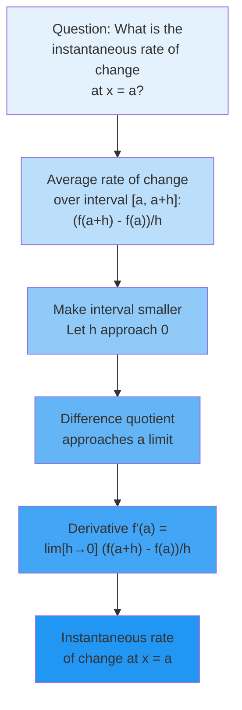
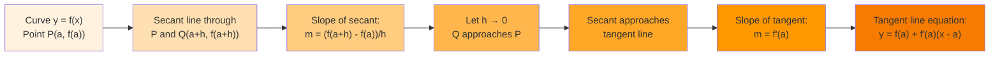
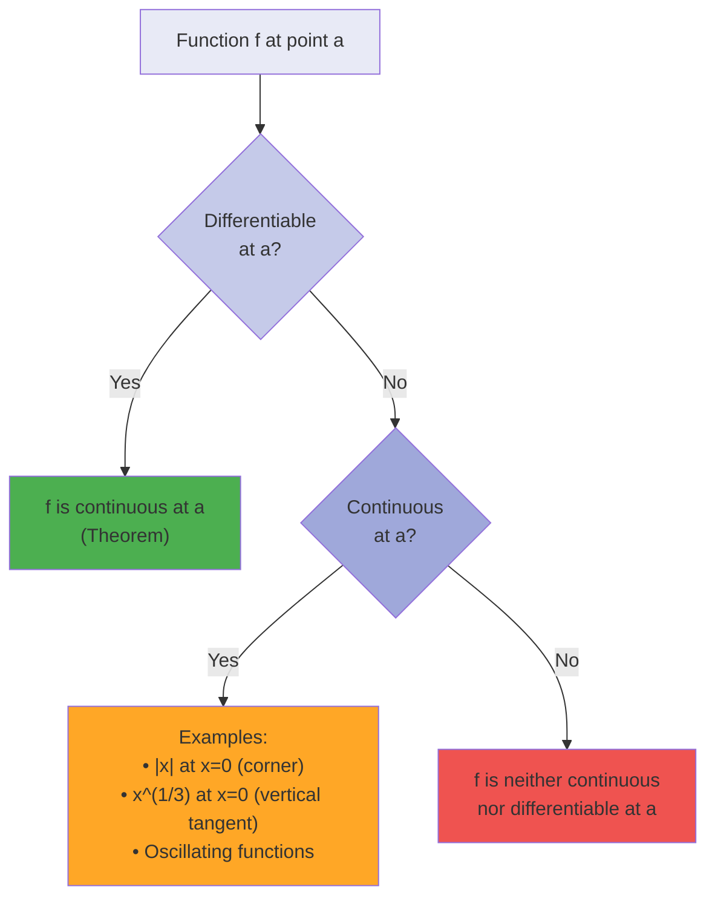

# C-2: Derivatives

1. Derivatives and Rates of Change

    - The Derivative as a Limit: From Intuition to Precision
    - Geometric Meaning: Tangent Lines and Local Linearity
    - Physical Interpretation: Velocity and Instantaneous Change
    - Notation Systems and Their Significance
    - Differentiability vs. Continuity: A Delicate Relationship

2. The Derivative as a Function

    - From Point Derivatives to Derivative Functions
    - Graphical Analysis: Reading the Story of Change
    - Higher-Order Derivatives: Acceleration and Beyond
    - Smoothness and Differentiability Classes
    - Constructing Derivative Functions: Methods and Meaning

3. Differentiation Formulas

    - The Power Rule: Foundation of Algebraic Differentiation
    - Linearity of Differentiation: Sum and Constant Multiple Rules
    - Product Rule: When Functions Multiply
    - Quotient Rule: Division and Its Complexities
    - Building a Differentiation Toolkit

4. Derivatives of Trigonometric Functions

    - Fundamental Limits and Basic Derivatives
    - The Sine and Cosine Connection
    - Derivatives of Other Trigonometric Functions
    - Trigonometric Identities in Differentiation
    - Applications to Periodic Phenomena

5. The Chain Rule

    - Composition and the Chain of Rates
    - Understanding the Chain Rule: Multiple Perspectives
    - Nested Functions and Repeated Application
    - Implicit Chain Rule Applications
    - The Chain Rule as a Unifying Principle

6. Implicit Differentiation

    - When Functions Hide in Equations
    - The Technique of Implicit Differentiation
    - Geometric Applications: Tangents to Implicit Curves
    - Higher-Order Implicit Derivatives
    - Related Rates Preview

7. Rates of Change in the Natural and Social Sciences

    - Physics: Motion, Forces, and Fields
    - Biology: Growth, Decay, and Population Dynamics
    - Economics: Marginal Analysis and Optimization
    - Chemistry: Reaction Rates and Equilibrium
    - Social Sciences: Modeling Change in Human Systems

8. Related Rates

    - The Interconnected World of Changing Quantities
    - Setting Up Related Rates Problems
    - Geometric Related Rates
    - Physical and Engineering Applications
    - Common Pitfalls and Problem-Solving Strategies

9. Linear Approximations and Differentials
    - The Tangent Line as Best Linear Approximation
    - Differentials: A New Perspective on Change
    - Error Analysis and Propagation
    - Applications in Measurement and Estimation
    - Extending to Multiple Variables: Total Differentials

The concept of the derivative stands as one of the most profound achievements in mathematics, providing a precise
language for describing change. From the motion of planets to the growth of populations, from the fluctuations of
markets to the flow of electric current, derivatives capture the essence of how things vary. This chapter develops the
theory of derivatives from first principles, building a comprehensive framework for understanding and calculating rates
of change.

#### The Derivative as a Limit: From Intuition to Precision

The journey toward understanding derivatives begins with a deceptively simple question: what does it mean for something
to change at a particular instant? This question puzzled mathematicians for centuries because an instant has no
duration—how can change occur in no time at all?

##### The Fundamental Problem of Instantaneous Change

Consider a car traveling along a highway. We can easily calculate its average speed over an hour by dividing the
distance traveled by the time elapsed. But what about its speed at exactly 2:00 PM? At that precise moment, no time
passes and no distance is covered, yet we intuitively understand that the car has a definite speed. This
paradox—measuring change at an instant—lies at the heart of differential calculus.

The resolution comes through the concept of limits. Instead of trying to measure change at an instant, we measure
average rates of change over smaller and smaller time intervals, then examine what happens as these intervals shrink
toward zero.

**Definition of the Derivative**: For a function $f$ defined on an interval containing the point $a$, the derivative of
$f$ at $a$ is defined as:

$$f'(a) = \lim_{h \to 0} \frac{f(a+h) - f(a)}{h}$$

provided this limit exists. When it does, we say $f$ is differentiable at $a$.

Let's unpack this definition carefully. The expression $\frac{f(a+h) - f(a)}{h}$ represents the average rate of change
of $f$ over the interval from $a$ to $a+h$. As $h$ approaches zero, this interval shrinks, and the average rate of
change approaches what we call the instantaneous rate of change.

**Alternative Form**: We can express the same limit using a slightly different notation:

$$f'(a) = \lim_{x \to a} \frac{f(x) - f(a)}{x - a}$$

This form sometimes provides computational advantages and emphasizes that we're examining the behavior of the difference
quotient as $x$ approaches $a$.



**Example - Computing a Derivative from the Definition**: Let's find the derivative of $f(x) = x^2$ at $x = 3$ using the
definition.

We need to evaluate: $$f'(3) = \lim_{h \to 0} \frac{f(3+h) - f(3)}{h}$$

First, let's compute the difference quotient:
$$\frac{f(3+h) - f(3)}{h} = \frac{(3+h)^2 - 3^2}{h} = \frac{9 + 6h + h^2 - 9}{h} = \frac{6h + h^2}{h}$$

For $h \neq 0$, we can simplify: $$\frac{6h + h^2}{h} = \frac{h(6 + h)}{h} = 6 + h$$

Now we can evaluate the limit: $$f'(3) = \lim_{h \to 0} (6 + h) = 6$$

Therefore, the instantaneous rate of change of $f(x) = x^2$ at $x = 3$ is 6.

**The Derivative Function**: Rather than computing the derivative at each point separately, we can find a general
formula for $f'(x)$. For $f(x) = x^2$:

$$f'(x) = \lim_{h \to 0} \frac{(x+h)^2 - x^2}{h} = \lim_{h \to 0} \frac{x^2 + 2xh + h^2 - x^2}{h} = \lim_{h \to 0} \frac{2xh + h^2}{h}$$

Simplifying for $h \neq 0$: $$f'(x) = \lim_{h \to 0} (2x + h) = 2x$$

This gives us the derivative function $f'(x) = 2x$, which tells us the rate of change at any point $x$.

##### Geometric Meaning: Tangent Lines and Local Linearity

The derivative has a beautiful geometric interpretation that connects algebra with geometry. At any point on a smooth
curve, the derivative gives the slope of the tangent line—the line that best approximates the curve near that point.

**From Secant to Tangent**: Consider a curve $y = f(x)$ and a point $P(a, f(a))$ on this curve. If we choose another
point $Q(a+h, f(a+h))$ on the curve, the line through $P$ and $Q$ is called a secant line. The slope of this secant line
is:

$$m_{\text{secant}} = \frac{f(a+h) - f(a)}{h}$$

As $Q$ approaches $P$ (equivalently, as $h$ approaches 0), the secant line rotates around $P$, approaching a limiting
position. This limiting line is the tangent line, and its slope is the derivative $f'(a)$.

**Equation of the Tangent Line**: Once we know the derivative at a point, we can write the equation of the tangent line.
At the point $(a, f(a))$ with slope $f'(a)$, the tangent line has equation:

$$y - f(a) = f'(a)(x - a)$$

or equivalently:

$$y = f(a) + f'(a)(x - a)$$

This linear function provides the best linear approximation to $f$ near $x = a$.

**Local Linearity**: One of the most important properties of differentiable functions is that they look approximately
linear when we "zoom in" sufficiently close to any point. This property, called local linearity, means that near
$x = a$:

$$f(x) \approx f(a) + f'(a)(x - a)$$

The approximation becomes increasingly accurate as $x$ approaches $a$. This principle underlies many applications, from
numerical methods to physics simulations.



**Example - Finding a Tangent Line**: Find the equation of the tangent line to $f(x) = \sqrt{x}$ at $x = 4$.

First, we need $f(4) = \sqrt{4} = 2$.

Next, we find the derivative. Using the definition: $$f'(x) = \lim_{h \to 0} \frac{\sqrt{x+h} - \sqrt{x}}{h}$$

This limit requires some algebraic manipulation. We multiply by the conjugate:
$$f'(x) = \lim_{h \to 0} \frac{\sqrt{x+h} - \sqrt{x}}{h} \cdot \frac{\sqrt{x+h} + \sqrt{x}}{\sqrt{x+h} + \sqrt{x}}$$

$$= \lim_{h \to 0} \frac{(x+h) - x}{h(\sqrt{x+h} + \sqrt{x})} = \lim_{h \to 0} \frac{h}{h(\sqrt{x+h} + \sqrt{x})}$$

$$= \lim_{h \to 0} \frac{1}{\sqrt{x+h} + \sqrt{x}} = \frac{1}{2\sqrt{x}}$$

Therefore, $f'(4) = \frac{1}{2\sqrt{4}} = \frac{1}{4}$.

The tangent line equation is: $$y - 2 = \frac{1}{4}(x - 4)$$ $$y = \frac{1}{4}x + 1$$

##### Physical Interpretation: Velocity and Instantaneous Change

The derivative's most intuitive interpretation comes from physics, where it represents instantaneous velocity. This
connection motivated much of the historical development of calculus.

**Position and Velocity**: If $s(t)$ represents the position of an object at time $t$, then:

- Average velocity over $[t, t+h]$: $v_{\text{avg}} = \frac{s(t+h) - s(t)}{h}$
- Instantaneous velocity at time $t$: $v(t) = s'(t) = \lim_{h \to 0} \frac{s(t+h) - s(t)}{h}$

**Example - Free Fall**: An object dropped from rest falls according to $s(t) = 16t^2$ feet after $t$ seconds (ignoring
air resistance). Find its velocity at $t = 2$ seconds.

Using the derivative: $$v(t) = s'(t) = \lim_{h \to 0} \frac{16(t+h)^2 - 16t^2}{h}$$

$$= \lim_{h \to 0} \frac{16t^2 + 32th + 16h^2 - 16t^2}{h} = \lim_{h \to 0} \frac{32th + 16h^2}{h} = \lim_{h \to 0} (32t + 16h) = 32t$$

Therefore, $v(2) = 32(2) = 64$ feet per second.

**General Rates of Change**: The derivative concept extends beyond velocity to any rate of change:

- Temperature change: If $T(t)$ is temperature at time $t$, then $T'(t)$ is the rate of temperature change
- Population growth: If $P(t)$ is population size, then $P'(t)$ is the growth rate
- Chemical reactions: If $C(t)$ is concentration, then $C'(t)$ is the reaction rate
- Economics: If $C(x)$ is the cost of producing $x$ items, then $C'(x)$ is the marginal cost

This universality makes derivatives indispensable across sciences and engineering.

##### Notation Systems and Their Significance

Different notation systems for derivatives reflect different perspectives and serve different purposes. Understanding
these notations helps in reading mathematical literature and choosing the most appropriate notation for a given context.

**Leibniz Notation**: Gottfried Wilhelm Leibniz introduced the notation $\frac{dy}{dx}$, which emphasizes the derivative
as a ratio of infinitesimal changes. While not literally a fraction, this notation:

- Suggests the limit of the ratio $\frac{\Delta y}{\Delta x}$
- Makes the chain rule intuitive: $\frac{dy}{dx} = \frac{dy}{du} \cdot \frac{du}{dx}$
- Clearly shows which variable is changing and which is the independent variable
- Facilitates integration by substitution

For higher derivatives, Leibniz notation becomes:

- Second derivative: $\frac{d^2y}{dx^2}$
- Third derivative: $\frac{d^3y}{dx^3}$
- $n$th derivative: $\frac{d^ny}{dx^n}$

**Lagrange Notation**: Joseph-Louis Lagrange introduced the prime notation $f'(x)$, which is:

- Compact and convenient for functions given by formulas
- Clear when dealing with function composition
- Easy to write for lower-order derivatives

For higher derivatives:

- Second derivative: $f''(x)$
- Third derivative: $f'''(x)$
- Fourth derivative: $f^{(4)}(x)$
- $n$th derivative: $f^{(n)}(x)$

**Newton Notation**: Isaac Newton used dots above variables, primarily for time derivatives:

- First derivative: $\dot{x}$ (velocity if $x$ is position)
- Second derivative: $\ddot{x}$ (acceleration)

This notation remains popular in physics and engineering, especially for time-dependent quantities.

**Operator Notation**: The derivative can be viewed as an operator $D$ that acts on functions:

- $Df = f'$
- $D^2f = f''$
- $D^nf = f^{(n)}$

This perspective is useful in differential equations and functional analysis.

**Example - Same Derivative, Different Notations**: For $y = x^3 - 2x + 1$:

- Leibniz: $\frac{dy}{dx} = 3x^2 - 2$
- Lagrange: $f'(x) = 3x^2 - 2$
- Newton (if $x = x(t)$): $\dot{y} = (3x^2 - 2)\dot{x}$
- Operator: $D(x^3 - 2x + 1) = 3x^2 - 2$

Each notation emphasizes different aspects of the derivative concept.

##### Differentiability vs. Continuity: A Delicate Relationship

The relationship between differentiability and continuity reveals important subtleties about function behavior. While
these concepts are related, they are not equivalent.

**Theorem (Differentiability Implies Continuity)**: If a function $f$ is differentiable at a point $a$, then $f$ is
continuous at $a$.

**Proof**: We need to show that $\lim_{x \to a} f(x) = f(a)$, which is equivalent to showing that
$\lim_{x \to a} [f(x) - f(a)] = 0$.

For $x \neq a$, we can write: $$f(x) - f(a) = \frac{f(x) - f(a)}{x - a} \cdot (x - a)$$

Taking the limit as $x \to a$:
$$\lim_{x \to a} [f(x) - f(a)] = \lim_{x \to a} \frac{f(x) - f(a)}{x - a} \cdot \lim_{x \to a} (x - a)$$

Since $f$ is differentiable at $a$, the first limit exists and equals $f'(a)$. The second limit is clearly 0. Therefore:
$$\lim_{x \to a} [f(x) - f(a)] = f'(a) \cdot 0 = 0$$

This proves that $\lim_{x \to a} f(x) = f(a)$, so $f$ is continuous at $a$. ∎

**The Converse is False**: Continuity does not imply differentiability. A function can be continuous at a point but fail
to have a derivative there. Let's examine the classic counterexamples:

**Example 1 - The Absolute Value Function**: Consider $f(x) = |x|$ at $x = 0$.

This function is continuous at 0 since $\lim_{x \to 0} |x| = 0 = |0|$.

However, the derivative at 0 would be: $$f'(0) = \lim_{h \to 0} \frac{|0+h| - |0|}{h} = \lim_{h \to 0} \frac{|h|}{h}$$

From the right: $\lim_{h \to 0^+} \frac{h}{h} = 1$ From the left: $\lim_{h \to 0^-} \frac{-h}{h} = -1$

Since the one-sided limits differ, the derivative doesn't exist at $x = 0$. Geometrically, the graph has a sharp corner
at the origin.

**Example 2 - The Cube Root Function**: Consider $f(x) = x^{1/3}$ at $x = 0$.

This function is continuous everywhere. At $x = 0$:
$$f'(0) = \lim_{h \to 0} \frac{h^{1/3} - 0}{h} = \lim_{h \to 0} \frac{1}{h^{2/3}}$$

This limit is infinite, so the derivative doesn't exist. Geometrically, the graph has a vertical tangent at the origin.

**Example 3 - A Wildly Oscillating Function**: Consider:

$$
f(x) = \begin{cases}
x^2 \sin(1/x) & \text{if } x \neq 0 \\
0 & \text{if } x = 0
\end{cases}
$$

This function is continuous at 0 (provable using the squeeze theorem). However, when we try to find the derivative at 0:
$$f'(0) = \lim_{h \to 0} \frac{h^2 \sin(1/h) - 0}{h} = \lim_{h \to 0} h \sin(1/h)$$

While this limit exists and equals 0 (by the squeeze theorem), making $f$ differentiable at 0, the derivative function
$f'(x) = 2x\sin(1/x) - \cos(1/x)$ for $x \neq 0$ is not continuous at 0. This shows that even when a derivative exists,
it need not be continuous.



**Types of Non-Differentiability**: When a continuous function fails to be differentiable, it typically falls into one
of these categories:

1. **Corners (Sharp Turns)**: Like $|x|$ at $x = 0$, where left and right derivatives exist but differ
2. **Cusps**: Like $x^{2/3}$ at $x = 0$, where the curve comes to a sharp point
3. **Vertical Tangents**: Like $x^{1/3}$ at $x = 0$, where the slope becomes infinite
4. **Wild Oscillation**: Like $x \sin(1/x)$ near $x = 0$, where the function oscillates too rapidly

Understanding these distinctions helps us appreciate why differentiability is a stronger condition than continuity,
requiring not just that a function has no gaps, but that it has a well-defined direction at each point.

#### The Derivative as a Function

Having established the derivative at individual points, we now shift perspective to view the derivative as a function in
its own right. This viewpoint reveals patterns, enables powerful computational techniques, and provides deeper insights
into function behavior.

##### From Point Derivatives to Derivative Functions

The transition from thinking about $f'(a)$ (the derivative at a specific point) to $f'(x)$ (the derivative function)
represents a crucial conceptual leap. Instead of asking "what is the rate of change at this particular point?", we ask
"what is the formula that gives the rate of change at any point?"

**The Derivative Function**: Given a function $f$, its derivative function $f'$ is defined by:
$$f'(x) = \lim_{h \to 0} \frac{f(x+h) - f(x)}{h}$$

at each point $x$ where this limit exists. The domain of $f'$ consists of all points where $f$ is differentiable.

**Example - From Points to Function**: Let's find the derivative function for $f(x) = x^3 - 2x$.

Starting with the definition: $$f'(x) = \lim_{h \to 0} \frac{[(x+h)^3 - 2(x+h)] - [x^3 - 2x]}{h}$$

Expanding $(x+h)^3 = x^3 + 3x^2h + 3xh^2 + h^3$:
$$f'(x) = \lim_{h \to 0} \frac{x^3 + 3x^2h + 3xh^2 + h^3 - 2x - 2h - x^3 + 2x}{h}$$

$$= \lim_{h \to 0} \frac{3x^2h + 3xh^2 + h^3 - 2h}{h}$$

$$= \lim_{h \to 0} \frac{h(3x^2 + 3xh + h^2 - 2)}{h}$$

For $h \neq 0$: $$= \lim_{h \to 0} (3x^2 + 3xh + h^2 - 2) = 3x^2 - 2$$

Therefore, $f'(x) = 3x^2 - 2$. This single formula tells us the rate of change at any point.

**The Power of the Function Perspective**: Viewing the derivative as a function enables us to:

1. Find rates of change efficiently at multiple points
2. Analyze where functions increase or decrease
3. Locate extreme values
4. Study the derivative's own properties
5. Apply the differentiation process repeatedly

##### Graphical Analysis: Reading the Story of Change

The relationship between a function and its derivative provides a powerful tool for understanding function behavior. By
examining the derivative's graph, we can deduce essential features of the original function.

**Key Relationships**:

1. **Sign of $f'(x)$**:

    - Where $f'(x) > 0$: $f$ is increasing
    - Where $f'(x) < 0$: $f$ is decreasing
    - Where $f'(x) = 0$: $f$ has a horizontal tangent (critical point)

2. **Magnitude of $f'(x)$**:

    - Large $|f'(x)|$: $f$ is changing rapidly (steep slope)
    - Small $|f'(x)|$: $f$ is changing slowly (gentle slope)

3. **Behavior of $f'(x)$**:
    - If $f'$ is increasing: $f$ is concave up
    - If $f'$ is decreasing: $f$ is concave down
    - If $f'$ has an extreme value: $f$ has an inflection point

```mermaid
flowchart TD
    A["Original Function f(x)"] --> B["Derivative f'(x)"]
    B --> C{f'(x) > 0?}
    C -->|Yes| D["f is increasing"]
    C -->|No| E{f'(x) < 0?}
    E -->|Yes| F["f is decreasing"]
    E -->|No| G["f'(x) = 0<br>Critical point"]

    B --> H{f' increasing?}
    H -->|Yes| I["f is concave up"]
    H -->|No| J["f is concave down"]

    style A fill:#E8F5E9
    style B fill:#C8E6C9
    style C fill:#A5D6A7
    style D fill:#81C784
    style E fill:#66BB6A
    style F fill:#4CAF50
    style G fill:#FFB74D
    style H fill:#B2DFDB
    style I fill:#80CBC4
    style J fill:#4DB6AC
```

**Example - Analyzing Function Behavior**: Given $f(x) = x^3 - 3x^2 - 9x + 5$, analyze its behavior using the
derivative.

First, find the derivative: $$f'(x) = 3x^2 - 6x - 9 = 3(x^2 - 2x - 3) = 3(x - 3)(x + 1)$$

Critical points occur where $f'(x) = 0$:

- $x = 3$ and $x = -1$

Sign analysis of $f'(x)$:

- For $x < -1$: both factors are negative, so $f'(x) > 0$ (f increasing)
- For $-1 < x < 3$: factors have opposite signs, so $f'(x) < 0$ (f decreasing)
- For $x > 3$: both factors are positive, so $f'(x) > 0$ (f increasing)

This tells us:

- $f$ has a local maximum at $x = -1$
- $f$ has a local minimum at $x = 3$
- $f$ increases on $(-\infty, -1) \cup (3, \infty)$
- $f$ decreases on $(-1, 3)$

**Constructing Graphs from Derivative Information**: We can sketch a function knowing only its derivative's behavior:

1. Identify where $f' = 0$ (critical points)
2. Determine the sign of $f'$ in each interval
3. Note any discontinuities or asymptotes in $f'$
4. Sketch $f$ as increasing where $f' > 0$ and decreasing where $f' < 0$
5. Include horizontal tangents at critical points

This process, working backwards from derivative to function, deepens our understanding of the derivative-function
relationship.

##### Higher-Order Derivatives: Acceleration and Beyond

Just as we can differentiate a function to get its derivative, we can differentiate the derivative to get the second
derivative, and continue this process to obtain higher-order derivatives. Each level provides additional information
about the function's behavior.

**Notation for Higher Derivatives**:

- Second derivative: $f''(x)$, $\frac{d^2y}{dx^2}$, $\ddot{y}$, $D^2f$
- Third derivative: $f'''(x)$, $\frac{d^3y}{dx^3}$, $\dddot{y}$, $D^3f$
- $n$th derivative: $f^{(n)}(x)$, $\frac{d^ny}{dx^n}$, $D^nf$

**Physical Interpretations**: For position $s(t)$:

- First derivative $s'(t) = v(t)$: velocity
- Second derivative $s''(t) = v'(t) = a(t)$: acceleration
- Third derivative $s'''(t) = a'(t) = j(t)$: jerk (rate of change of acceleration)
- Fourth derivative $s^{(4)}(t)$: snap
- Fifth derivative $s^{(5)}(t)$: crackle
- Sixth derivative $s^{(6)}(t)$: pop

These higher derivatives, while having whimsical names, appear in engineering applications like ride comfort analysis
and mechanical stress calculations.

**Geometric Meaning of the Second Derivative**:

- $f''(x) > 0$: The graph is concave up (shaped like ∪)
- $f''(x) < 0$: The graph is concave down (shaped like ∩)
- $f''(x) = 0$: Possible inflection point (where concavity changes)

**Example - Complete Analysis Using Multiple Derivatives**: Analyze $f(x) = x^4 - 4x^3 + 4x^2$.

First derivative: $$f'(x) = 4x^3 - 12x^2 + 8x = 4x(x^2 - 3x + 2) = 4x(x-1)(x-2)$$

Second derivative: $$f''(x) = 12x^2 - 24x + 8 = 4(3x^2 - 6x + 2)$$

Critical points from $f'(x) = 0$: $x = 0, 1, 2$

To classify these critical points, we use the second derivative test:

- At $x = 0$: $f''(0) = 8 > 0$, so local minimum
- At $x = 1$: $f''(1) = 12 - 24 + 8 = -4 < 0$, so local maximum
- At $x = 2$: $f''(2) = 48 - 48 + 8 = 8 > 0$, so local minimum

For inflection points, solve $f''(x) = 0$: $$3x^2 - 6x + 2 = 0$$
$$x = \frac{6 \pm \sqrt{36-24}}{6} = \frac{6 \pm 2\sqrt{3}}{6} = 1 \pm \frac{\sqrt{3}}{3}$$

The complete analysis reveals the function's shape: two valleys separated by a hill, with two inflection points where
the concavity changes.

**Theorem (Existence of Higher Derivatives)**: If $f^{(n)}(a)$ exists, then $f^{(n-1)}$ is continuous at $a$. However,
the converse is false—continuity of $f^{(n-1)}$ doesn't guarantee existence of $f^{(n)}$.

This theorem highlights the increasingly stringent requirements for higher-order differentiability.

##### Smoothness and Differentiability Classes

Mathematicians classify functions by their degree of smoothness, which relates to how many continuous derivatives they
possess. This classification provides a precise language for discussing function regularity.

**Differentiability Classes**:

- $C^0$: Continuous functions
- $C^1$: Continuously differentiable functions (derivative exists and is continuous)
- $C^2$: Twice continuously differentiable functions
- $C^n$: Functions with $n$ continuous derivatives
- $C^\infty$: Infinitely differentiable (smooth) functions
- $C^\omega$: Analytic functions (locally equal to their Taylor series)

**Hierarchy**: Each class is contained in the previous one:
$$C^\omega \subset C^\infty \subset \cdots \subset C^2 \subset C^1 \subset C^0$$

**Examples of Different Smoothness Classes**:

1. **$C^0$ but not $C^1$**: $f(x) = |x|$

    - Continuous everywhere
    - Not differentiable at $x = 0$

2. **$C^1$ but not $C^2$**:

    $$
    f(x) = \begin{cases}
    x^2 & \text{if } x \geq 0 \\
    -x^2 & \text{if } x < 0
    \end{cases}
    $$

    - $f'(x) = 2|x|$ is continuous
    - $f''(0)$ doesn't exist

3. **$C^\infty$ but not $C^\omega$**:
    $$
    f(x) = \begin{cases}
    e^
    $$
