# C-2: Derivatives

1. Derivatives and Rates of Change

    - The Derivative as a Limit: From Intuition to Precision
    - Geometric Meaning: Tangent Lines and Local Linearity
    - Physical Interpretation: Velocity and Instantaneous Change
    - Notation Systems and Their Significance
    - Differentiability vs. Continuity: A Delicate Relationship

2. The Derivative as a Function

    - From Point Derivatives to Derivative Functions
    - Graphical Analysis: Reading the Story of Change
    - Higher-Order Derivatives: Acceleration and Beyond
    - Smoothness and Differentiability Classes
    - Constructing Derivative Functions: Methods and Meaning

3. Differentiation Formulas

    - The Power Rule: Foundation of Algebraic Differentiation
    - Linearity of Differentiation: Sum and Constant Multiple Rules
    - Product Rule: When Functions Multiply
    - Quotient Rule: Division and Its Complexities
    - Building a Differentiation Toolkit

4. Derivatives of Trigonometric Functions

    - Fundamental Limits and Basic Derivatives
    - The Sine and Cosine Connection
    - Derivatives of Other Trigonometric Functions
    - Trigonometric Identities in Differentiation
    - Applications to Periodic Phenomena

5. The Chain Rule

    - Composition and the Chain of Rates
    - Understanding the Chain Rule: Multiple Perspectives
    - Nested Functions and Repeated Application
    - Implicit Chain Rule Applications
    - The Chain Rule as a Unifying Principle

6. Implicit Differentiation

    - When Functions Hide in Equations
    - The Technique of Implicit Differentiation
    - Geometric Applications: Tangents to Implicit Curves
    - Higher-Order Implicit Derivatives
    - Related Rates Preview

7. Rates of Change in the Natural and Social Sciences

    - Physics: Motion, Forces, and Fields
    - Biology: Growth, Decay, and Population Dynamics
    - Economics: Marginal Analysis and Optimization
    - Chemistry: Reaction Rates and Equilibrium
    - Social Sciences: Modeling Change in Human Systems

8. Related Rates

    - The Interconnected World of Changing Quantities
    - Setting Up Related Rates Problems
    - Geometric Related Rates
    - Physical and Engineering Applications
    - Common Pitfalls and Problem-Solving Strategies

9. Linear Approximations and Differentials
    - The Tangent Line as Best Linear Approximation
    - Differentials: A New Perspective on Change
    - Error Analysis and Propagation
    - Applications in Measurement and Estimation
    - Extending to Multiple Variables: Total Differentials

The concept of the derivative stands as one of the most profound achievements in mathematics, providing a precise
language for describing change. From the motion of planets to the growth of populations, from the fluctuations of
markets to the flow of electric current, derivatives capture the essence of how things vary. This chapter develops the
theory of derivatives from first principles, building a comprehensive framework for understanding and calculating rates
of change.

#### The Derivative as a Limit: From Intuition to Precision

The journey toward understanding derivatives begins with a deceptively simple question: what does it mean for something
to change at a particular instant? This question puzzled mathematicians for centuries because an instant has no
duration—how can change occur in no time at all?

##### The Fundamental Problem of Instantaneous Change

Consider a car traveling along a highway. We can easily calculate its average speed over an hour by dividing the
distance traveled by the time elapsed. But what about its speed at exactly 2:00 PM? At that precise moment, no time
passes and no distance is covered, yet we intuitively understand that the car has a definite speed. This
paradox—measuring change at an instant—lies at the heart of differential calculus.

The resolution comes through the concept of limits. Instead of trying to measure change at an instant, we measure
average rates of change over smaller and smaller time intervals, then examine what happens as these intervals shrink
toward zero.

**Definition of the Derivative**: For a function $f$ defined on an interval containing the point $a$, the derivative of
$f$ at $a$ is defined as:

$$f'(a) = \lim_{h \to 0} \frac{f(a+h) - f(a)}{h}$$

provided this limit exists. When it does, we say $f$ is differentiable at $a$.

Let's unpack this definition carefully. The expression $\frac{f(a+h) - f(a)}{h}$ represents the average rate of change
of $f$ over the interval from $a$ to $a+h$. As $h$ approaches zero, this interval shrinks, and the average rate of
change approaches what we call the instantaneous rate of change.

**Alternative Form**: We can express the same limit using a slightly different notation:

$$f'(a) = \lim_{x \to a} \frac{f(x) - f(a)}{x - a}$$

This form sometimes provides computational advantages and emphasizes that we're examining the behavior of the difference
quotient as $x$ approaches $a$.

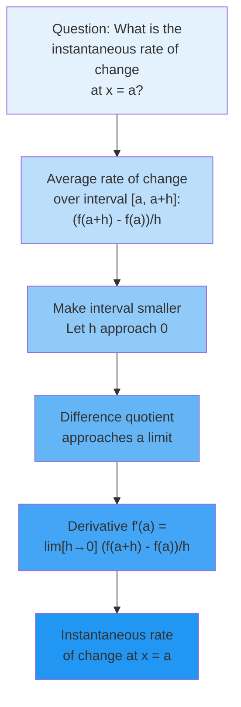

**Example - Computing a Derivative from the Definition**: Let's find the derivative of $f(x) = x^2$ at $x = 3$ using the
definition.

We need to evaluate: $$f'(3) = \lim_{h \to 0} \frac{f(3+h) - f(3)}{h}$$

First, let's compute the difference quotient:
$$\frac{f(3+h) - f(3)}{h} = \frac{(3+h)^2 - 3^2}{h} = \frac{9 + 6h + h^2 - 9}{h} = \frac{6h + h^2}{h}$$

For $h \neq 0$, we can simplify: $$\frac{6h + h^2}{h} = \frac{h(6 + h)}{h} = 6 + h$$

Now we can evaluate the limit: $$f'(3) = \lim_{h \to 0} (6 + h) = 6$$

Therefore, the instantaneous rate of change of $f(x) = x^2$ at $x = 3$ is 6.

**The Derivative Function**: Rather than computing the derivative at each point separately, we can find a general
formula for $f'(x)$. For $f(x) = x^2$:

$$f'(x) = \lim_{h \to 0} \frac{(x+h)^2 - x^2}{h} = \lim_{h \to 0} \frac{x^2 + 2xh + h^2 - x^2}{h} = \lim_{h \to 0} \frac{2xh + h^2}{h}$$

Simplifying for $h \neq 0$: $$f'(x) = \lim_{h \to 0} (2x + h) = 2x$$

This gives us the derivative function $f'(x) = 2x$, which tells us the rate of change at any point $x$.

##### Geometric Meaning: Tangent Lines and Local Linearity

The derivative has a beautiful geometric interpretation that connects algebra with geometry. At any point on a smooth
curve, the derivative gives the slope of the tangent line—the line that best approximates the curve near that point.

**From Secant to Tangent**: Consider a curve $y = f(x)$ and a point $P(a, f(a))$ on this curve. If we choose another
point $Q(a+h, f(a+h))$ on the curve, the line through $P$ and $Q$ is called a secant line. The slope of this secant line
is:

$$m_{\text{secant}} = \frac{f(a+h) - f(a)}{h}$$

As $Q$ approaches $P$ (equivalently, as $h$ approaches 0), the secant line rotates around $P$, approaching a limiting
position. This limiting line is the tangent line, and its slope is the derivative $f'(a)$.

**Equation of the Tangent Line**: Once we know the derivative at a point, we can write the equation of the tangent line.
At the point $(a, f(a))$ with slope $f'(a)$, the tangent line has equation:

$$y - f(a) = f'(a)(x - a)$$

or equivalently:

$$y = f(a) + f'(a)(x - a)$$

This linear function provides the best linear approximation to $f$ near $x = a$.

**Local Linearity**: One of the most important properties of differentiable functions is that they look approximately
linear when we "zoom in" sufficiently close to any point. This property, called local linearity, means that near
$x = a$:

$$f(x) \approx f(a) + f'(a)(x - a)$$

The approximation becomes increasingly accurate as $x$ approaches $a$. This principle underlies many applications, from
numerical methods to physics simulations.

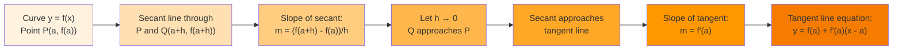

**Example - Finding a Tangent Line**: Find the equation of the tangent line to $f(x) = \sqrt{x}$ at $x = 4$.

First, we need $f(4) = \sqrt{4} = 2$.

Next, we find the derivative. Using the definition: $$f'(x) = \lim_{h \to 0} \frac{\sqrt{x+h} - \sqrt{x}}{h}$$

This limit requires some algebraic manipulation. We multiply by the conjugate:
$$f'(x) = \lim_{h \to 0} \frac{\sqrt{x+h} - \sqrt{x}}{h} \cdot \frac{\sqrt{x+h} + \sqrt{x}}{\sqrt{x+h} + \sqrt{x}}$$

$$= \lim_{h \to 0} \frac{(x+h) - x}{h(\sqrt{x+h} + \sqrt{x})} = \lim_{h \to 0} \frac{h}{h(\sqrt{x+h} + \sqrt{x})}$$

$$= \lim_{h \to 0} \frac{1}{\sqrt{x+h} + \sqrt{x}} = \frac{1}{2\sqrt{x}}$$

Therefore, $f'(4) = \frac{1}{2\sqrt{4}} = \frac{1}{4}$.

The tangent line equation is: $$y - 2 = \frac{1}{4}(x - 4)$$ $$y = \frac{1}{4}x + 1$$

##### Physical Interpretation: Velocity and Instantaneous Change

The derivative's most intuitive interpretation comes from physics, where it represents instantaneous velocity. This
connection motivated much of the historical development of calculus.

**Position and Velocity**: If $s(t)$ represents the position of an object at time $t$, then:

- Average velocity over $[t, t+h]$: $v_{\text{avg}} = \frac{s(t+h) - s(t)}{h}$
- Instantaneous velocity at time $t$: $v(t) = s'(t) = \lim_{h \to 0} \frac{s(t+h) - s(t)}{h}$

**Example - Free Fall**: An object dropped from rest falls according to $s(t) = 16t^2$ feet after $t$ seconds (ignoring
air resistance). Find its velocity at $t = 2$ seconds.

Using the derivative: $$v(t) = s'(t) = \lim_{h \to 0} \frac{16(t+h)^2 - 16t^2}{h}$$

$$= \lim_{h \to 0} \frac{16t^2 + 32th + 16h^2 - 16t^2}{h} = \lim_{h \to 0} \frac{32th + 16h^2}{h} = \lim_{h \to 0} (32t + 16h) = 32t$$

Therefore, $v(2) = 32(2) = 64$ feet per second.

**General Rates of Change**: The derivative concept extends beyond velocity to any rate of change:

- Temperature change: If $T(t)$ is temperature at time $t$, then $T'(t)$ is the rate of temperature change
- Population growth: If $P(t)$ is population size, then $P'(t)$ is the growth rate
- Chemical reactions: If $C(t)$ is concentration, then $C'(t)$ is the reaction rate
- Economics: If $C(x)$ is the cost of producing $x$ items, then $C'(x)$ is the marginal cost

This universality makes derivatives indispensable across sciences and engineering.

##### Notation Systems and Their Significance

Different notation systems for derivatives reflect different perspectives and serve different purposes. Understanding
these notations helps in reading mathematical literature and choosing the most appropriate notation for a given context.

**Leibniz Notation**: Gottfried Wilhelm Leibniz introduced the notation $\frac{dy}{dx}$, which emphasizes the derivative
as a ratio of infinitesimal changes. While not literally a fraction, this notation:

- Suggests the limit of the ratio $\frac{\Delta y}{\Delta x}$
- Makes the chain rule intuitive: $\frac{dy}{dx} = \frac{dy}{du} \cdot \frac{du}{dx}$
- Clearly shows which variable is changing and which is the independent variable
- Facilitates integration by substitution

For higher derivatives, Leibniz notation becomes:

- Second derivative: $\frac{d^2y}{dx^2}$
- Third derivative: $\frac{d^3y}{dx^3}$
- $n$th derivative: $\frac{d^ny}{dx^n}$

**Lagrange Notation**: Joseph-Louis Lagrange introduced the prime notation $f'(x)$, which is:

- Compact and convenient for functions given by formulas
- Clear when dealing with function composition
- Easy to write for lower-order derivatives

For higher derivatives:

- Second derivative: $f''(x)$
- Third derivative: $f'''(x)$
- Fourth derivative: $f^{(4)}(x)$
- $n$th derivative: $f^{(n)}(x)$

**Newton Notation**: Isaac Newton used dots above variables, primarily for time derivatives:

- First derivative: $\dot{x}$ (velocity if $x$ is position)
- Second derivative: $\ddot{x}$ (acceleration)

This notation remains popular in physics and engineering, especially for time-dependent quantities.

**Operator Notation**: The derivative can be viewed as an operator $D$ that acts on functions:

- $Df = f'$
- $D^2f = f''$
- $D^nf = f^{(n)}$

This perspective is useful in differential equations and functional analysis.

**Example - Same Derivative, Different Notations**: For $y = x^3 - 2x + 1$:

- Leibniz: $\frac{dy}{dx} = 3x^2 - 2$
- Lagrange: $f'(x) = 3x^2 - 2$
- Newton (if $x = x(t)$): $\dot{y} = (3x^2 - 2)\dot{x}$
- Operator: $D(x^3 - 2x + 1) = 3x^2 - 2$

Each notation emphasizes different aspects of the derivative concept.

##### Differentiability vs. Continuity: A Delicate Relationship

The relationship between differentiability and continuity reveals important subtleties about function behavior. While
these concepts are related, they are not equivalent.

**Theorem (Differentiability Implies Continuity)**: If a function $f$ is differentiable at a point $a$, then $f$ is
continuous at $a$.

**Proof**: We need to show that $\lim_{x \to a} f(x) = f(a)$, which is equivalent to showing that
$\lim_{x \to a} [f(x) - f(a)] = 0$.

For $x \neq a$, we can write: $$f(x) - f(a) = \frac{f(x) - f(a)}{x - a} \cdot (x - a)$$

Taking the limit as $x \to a$:
$$\lim_{x \to a} [f(x) - f(a)] = \lim_{x \to a} \frac{f(x) - f(a)}{x - a} \cdot \lim_{x \to a} (x - a)$$

Since $f$ is differentiable at $a$, the first limit exists and equals $f'(a)$. The second limit is clearly 0. Therefore:
$$\lim_{x \to a} [f(x) - f(a)] = f'(a) \cdot 0 = 0$$

This proves that $\lim_{x \to a} f(x) = f(a)$, so $f$ is continuous at $a$. ∎

**The Converse is False**: Continuity does not imply differentiability. A function can be continuous at a point but fail
to have a derivative there. Let's examine the classic counterexamples:

**Example 1 - The Absolute Value Function**: Consider $f(x) = |x|$ at $x = 0$.

This function is continuous at 0 since $\lim_{x \to 0} |x| = 0 = |0|$.

However, the derivative at 0 would be: $$f'(0) = \lim_{h \to 0} \frac{|0+h| - |0|}{h} = \lim_{h \to 0} \frac{|h|}{h}$$

From the right: $\lim_{h \to 0^+} \frac{h}{h} = 1$ From the left: $\lim_{h \to 0^-} \frac{-h}{h} = -1$

Since the one-sided limits differ, the derivative doesn't exist at $x = 0$. Geometrically, the graph has a sharp corner
at the origin.

**Example 2 - The Cube Root Function**: Consider $f(x) = x^{1/3}$ at $x = 0$.

This function is continuous everywhere. At $x = 0$:
$$f'(0) = \lim_{h \to 0} \frac{h^{1/3} - 0}{h} = \lim_{h \to 0} \frac{1}{h^{2/3}}$$

This limit is infinite, so the derivative doesn't exist. Geometrically, the graph has a vertical tangent at the origin.

**Example 3 - A Wildly Oscillating Function**: Consider:

$$
f(x) = \begin{cases}
x^2 \sin(1/x) & \text{if } x \neq 0 \\
0 & \text{if } x = 0
\end{cases}
$$

This function is continuous at 0 (provable using the squeeze theorem). However, when we try to find the derivative at 0:
$$f'(0) = \lim_{h \to 0} \frac{h^2 \sin(1/h) - 0}{h} = \lim_{h \to 0} h \sin(1/h)$$

While this limit exists and equals 0 (by the squeeze theorem), making $f$ differentiable at 0, the derivative function
$f'(x) = 2x\sin(1/x) - \cos(1/x)$ for $x \neq 0$ is not continuous at 0. This shows that even when a derivative exists,
it need not be continuous.

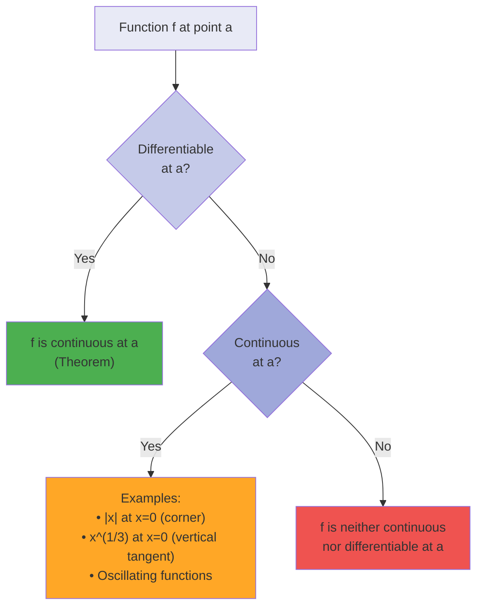

**Types of Non-Differentiability**: When a continuous function fails to be differentiable, it typically falls into one
of these categories:

1. **Corners (Sharp Turns)**: Like $|x|$ at $x = 0$, where left and right derivatives exist but differ
2. **Cusps**: Like $x^{2/3}$ at $x = 0$, where the curve comes to a sharp point
3. **Vertical Tangents**: Like $x^{1/3}$ at $x = 0$, where the slope becomes infinite
4. **Wild Oscillation**: Like $x \sin(1/x)$ near $x = 0$, where the function oscillates too rapidly

Understanding these distinctions helps us appreciate why differentiability is a stronger condition than continuity,
requiring not just that a function has no gaps, but that it has a well-defined direction at each point.

#### The Derivative as a Function

Having established the derivative at individual points, we now shift perspective to view the derivative as a function in
its own right. This viewpoint reveals patterns, enables powerful computational techniques, and provides deeper insights
into function behavior.

##### From Point Derivatives to Derivative Functions

The transition from thinking about $f'(a)$ (the derivative at a specific point) to $f'(x)$ (the derivative function)
represents a crucial conceptual leap. Instead of asking "what is the rate of change at this particular point?", we ask
"what is the formula that gives the rate of change at any point?"

**The Derivative Function**: Given a function $f$, its derivative function $f'$ is defined by:
$$f'(x) = \lim_{h \to 0} \frac{f(x+h) - f(x)}{h}$$

at each point $x$ where this limit exists. The domain of $f'$ consists of all points where $f$ is differentiable.

**Example - From Points to Function**: Let's find the derivative function for $f(x) = x^3 - 2x$.

Starting with the definition: $$f'(x) = \lim_{h \to 0} \frac{[(x+h)^3 - 2(x+h)] - [x^3 - 2x]}{h}$$

Expanding $(x+h)^3 = x^3 + 3x^2h + 3xh^2 + h^3$:
$$f'(x) = \lim_{h \to 0} \frac{x^3 + 3x^2h + 3xh^2 + h^3 - 2x - 2h - x^3 + 2x}{h}$$

$$= \lim_{h \to 0} \frac{3x^2h + 3xh^2 + h^3 - 2h}{h}$$

$$= \lim_{h \to 0} \frac{h(3x^2 + 3xh + h^2 - 2)}{h}$$

For $h \neq 0$: $$= \lim_{h \to 0} (3x^2 + 3xh + h^2 - 2) = 3x^2 - 2$$

Therefore, $f'(x) = 3x^2 - 2$. This single formula tells us the rate of change at any point.

**The Power of the Function Perspective**: Viewing the derivative as a function enables us to:

1. Find rates of change efficiently at multiple points
2. Analyze where functions increase or decrease
3. Locate extreme values
4. Study the derivative's own properties
5. Apply the differentiation process repeatedly

##### Graphical Analysis: Reading the Story of Change

The relationship between a function and its derivative provides a powerful tool for understanding function behavior. By
examining the derivative's graph, we can deduce essential features of the original function.

**Key Relationships**:

1. **Sign of $f'(x)$**:

    - Where $f'(x) > 0$: $f$ is increasing
    - Where $f'(x) < 0$: $f$ is decreasing
    - Where $f'(x) = 0$: $f$ has a horizontal tangent (critical point)

2. **Magnitude of $f'(x)$**:

    - Large $|f'(x)|$: $f$ is changing rapidly (steep slope)
    - Small $|f'(x)|$: $f$ is changing slowly (gentle slope)

3. **Behavior of $f'(x)$**:
    - If $f'$ is increasing: $f$ is concave up
    - If $f'$ is decreasing: $f$ is concave down
    - If $f'$ has an extreme value: $f$ has an inflection point

```mermaid
flowchart TD
    A["Original Function f(x)"] --> B["Derivative f'(x)"]
    B --> C{f'(x) > 0?}
    C -->|Yes| D["f is increasing"]
    C -->|No| E{f'(x) < 0?}
    E -->|Yes| F["f is decreasing"]
    E -->|No| G["f'(x) = 0<br>Critical point"]

    B --> H{f' increasing?}
    H -->|Yes| I["f is concave up"]
    H -->|No| J["f is concave down"]

    style A fill:#E8F5E9
    style B fill:#C8E6C9
    style C fill:#A5D6A7
    style D fill:#81C784
    style E fill:#66BB6A
    style F fill:#4CAF50
    style G fill:#FFB74D
    style H fill:#B2DFDB
    style I fill:#80CBC4
    style J fill:#4DB6AC
```

**Example - Analyzing Function Behavior**: Given $f(x) = x^3 - 3x^2 - 9x + 5$, analyze its behavior using the
derivative.

First, find the derivative: $$f'(x) = 3x^2 - 6x - 9 = 3(x^2 - 2x - 3) = 3(x - 3)(x + 1)$$

Critical points occur where $f'(x) = 0$:

- $x = 3$ and $x = -1$

Sign analysis of $f'(x)$:

- For $x < -1$: both factors are negative, so $f'(x) > 0$ (f increasing)
- For $-1 < x < 3$: factors have opposite signs, so $f'(x) < 0$ (f decreasing)
- For $x > 3$: both factors are positive, so $f'(x) > 0$ (f increasing)

This tells us:

- $f$ has a local maximum at $x = -1$
- $f$ has a local minimum at $x = 3$
- $f$ increases on $(-\infty, -1) \cup (3, \infty)$
- $f$ decreases on $(-1, 3)$

**Constructing Graphs from Derivative Information**: We can sketch a function knowing only its derivative's behavior:

1. Identify where $f' = 0$ (critical points)
2. Determine the sign of $f'$ in each interval
3. Note any discontinuities or asymptotes in $f'$
4. Sketch $f$ as increasing where $f' > 0$ and decreasing where $f' < 0$
5. Include horizontal tangents at critical points

This process, working backwards from derivative to function, deepens our understanding of the derivative-function
relationship.

##### Higher-Order Derivatives: Acceleration and Beyond

Just as we can differentiate a function to get its derivative, we can differentiate the derivative to get the second
derivative, and continue this process to obtain higher-order derivatives. Each level provides additional information
about the function's behavior.

**Notation for Higher Derivatives**:

- Second derivative: $f''(x)$, $\frac{d^2y}{dx^2}$, $\ddot{y}$, $D^2f$
- Third derivative: $f'''(x)$, $\frac{d^3y}{dx^3}$, $\dddot{y}$, $D^3f$
- $n$th derivative: $f^{(n)}(x)$, $\frac{d^ny}{dx^n}$, $D^nf$

**Physical Interpretations**: For position $s(t)$:

- First derivative $s'(t) = v(t)$: velocity
- Second derivative $s''(t) = v'(t) = a(t)$: acceleration
- Third derivative $s'''(t) = a'(t) = j(t)$: jerk (rate of change of acceleration)
- Fourth derivative $s^{(4)}(t)$: snap
- Fifth derivative $s^{(5)}(t)$: crackle
- Sixth derivative $s^{(6)}(t)$: pop

These higher derivatives, while having whimsical names, appear in engineering applications like ride comfort analysis
and mechanical stress calculations.

**Geometric Meaning of the Second Derivative**:

- $f''(x) > 0$: The graph is concave up (shaped like ∪)
- $f''(x) < 0$: The graph is concave down (shaped like ∩)
- $f''(x) = 0$: Possible inflection point (where concavity changes)

**Example - Complete Analysis Using Multiple Derivatives**: Analyze $f(x) = x^4 - 4x^3 + 4x^2$.

First derivative: $$f'(x) = 4x^3 - 12x^2 + 8x = 4x(x^2 - 3x + 2) = 4x(x-1)(x-2)$$

Second derivative: $$f''(x) = 12x^2 - 24x + 8 = 4(3x^2 - 6x + 2)$$

Critical points from $f'(x) = 0$: $x = 0, 1, 2$

To classify these critical points, we use the second derivative test:

- At $x = 0$: $f''(0) = 8 > 0$, so local minimum
- At $x = 1$: $f''(1) = 12 - 24 + 8 = -4 < 0$, so local maximum
- At $x = 2$: $f''(2) = 48 - 48 + 8 = 8 > 0$, so local minimum

For inflection points, solve $f''(x) = 0$: $$3x^2 - 6x + 2 = 0$$
$$x = \frac{6 \pm \sqrt{36-24}}{6} = \frac{6 \pm 2\sqrt{3}}{6} = 1 \pm \frac{\sqrt{3}}{3}$$

The complete analysis reveals the function's shape: two valleys separated by a hill, with two inflection points where
the concavity changes.

**Theorem (Existence of Higher Derivatives)**: If $f^{(n)}(a)$ exists, then $f^{(n-1)}$ is continuous at $a$. However,
the converse is false—continuity of $f^{(n-1)}$ doesn't guarantee existence of $f^{(n)}$.

This theorem highlights the increasingly stringent requirements for higher-order differentiability.

##### Smoothness and Differentiability Classes

Mathematicians classify functions by their degree of smoothness, which relates to how many continuous derivatives they
possess. This classification provides a precise language for discussing function regularity.

**Differentiability Classes**:

- $C^0$: Continuous functions
- $C^1$: Continuously differentiable functions (derivative exists and is continuous)
- $C^2$: Twice continuously differentiable functions
- $C^n$: Functions with $n$ continuous derivatives
- $C^\infty$: Infinitely differentiable (smooth) functions
- $C^\omega$: Analytic functions (locally equal to their Taylor series)

**Hierarchy**: Each class is contained in the previous one:
$$C^\omega \subset C^\infty \subset \cdots \subset C^2 \subset C^1 \subset C^0$$

**Examples of Different Smoothness Classes**:

1. **$C^0$ but not $C^1$**: $f(x) = |x|$

    - Continuous everywhere
    - Not differentiable at $x = 0$

2. **$C^1$ but not $C^2$**:

    $$
    f(x) = \begin{cases}
    x^2 & \text{if } x \geq 0 \\
    -x^2 & \text{if } x < 0
    \end{cases}
    $$

    - $f'(x) = 2|x|$ is continuous
    - $f''(0)$ doesn't exist

3. **$C^\infty$ but not $C^\omega$**:

    $$
    f(x) = \begin{cases}
    e^{-1/x^2} & \text{if } x \neq 0 \\
    0 & \text{if } x = 0
    \end{cases}
    $$

    - All derivatives exist and equal 0 at $x = 0$
    - Taylor series at 0 is identically 0, but $f(x) \neq 0$ for $x \neq 0$
    - Hence not analytic at 0

4. $C^\omega$ (Analytic): Polynomials, $e^x$, $\sin x$, $\cos x$

    - Equal to their Taylor series in a neighborhood of each point

**Importance of Smoothness**:

1. **Numerical Methods**: Higher smoothness allows better approximations
2. **Differential Equations**: Solutions often required to be in specific classes
3. **Physics**: Physical quantities often assumed to be $C^\infty$
4. **Optimization**: Smoothness determines which optimization methods apply

**A Remarkable Function**: The function mentioned above deserves special attention as it challenges intuition:

$$f(x) = \begin{cases} e^{-1/x^2} & \text{if } x \neq 0 \ 0 & \text{if } x = 0 \end{cases}$$

**Proof that all derivatives at 0 equal 0**: We'll show by induction that $f^{(n)}(0) = 0$ for all $n \geq 0$.

For $n = 0$: $f(0) = 0$ by definition.

For $n = 1$: $$f'(0) = \lim_{h \to 0} \frac{f(h) - f(0)}{h} = \lim_{h \to 0} \frac{e^{-1/h^2}}{h}$$

Let $u = 1/h$, so as $h \to 0^+$, $u \to +\infty$:
$$\lim_{h \to 0^+} \frac{e^{-1/h^2}}{h} = \lim_{u \to +\infty} ue^{-u^2}$$

Since $e^{-u^2}$ decreases faster than any polynomial grows, this limit is 0. Similarly from the left, so $f'(0) = 0$.

For $x \neq 0$, derivatives have the form: $$f^{(n)}(x) = \frac{P_n(1/x)}{x^{2n}} e^{-1/x^2}$$

where $P_n$ is a polynomial. By induction and similar limit arguments, $f^{(n)}(0) = 0$ for all $n$.

This example shows that $C^\infty$ functions can have very subtle behavior!

##### Constructing Derivative Functions: Methods and Meaning

Understanding how to construct derivative functions—both theoretically and practically—provides insights into the nature
of differentiation and its applications.

**Methods for Finding Derivative Functions**:

1. **From the Definition**: Direct application of the limit
    - Rigorous but often tedious
    - Essential for proving differentiation rules
    - Provides deepest understanding
2. **Using Differentiation Rules**: Apply known formulas
    - Efficient for computation
    - Requires recognizing patterns
    - Most common practical method
3. **Implicit Differentiation**: For implicitly defined functions
    - Handles relations not solved for $y$
    - Reveals hidden derivatives
4. **Numerical Differentiation**: Approximate using finite differences
    - For data without formulas
    - Subject to round-off errors
    - Various schemes for accuracy
5. **Symbolic Computation**: Computer algebra systems
    - Handles complex expressions
    - Exact results
    - Can miss simplifications

**Example - Multiple Methods**: Find the derivative of $f(x) = \frac{1}{x}$.

_Method 1 - Definition_:
$$f'(x) = \lim_{h \to 0} \frac{\frac{1}{x+h} - \frac{1}{x}}{h} = \lim_{h \to 0} \frac{\frac{x - (x+h)}{x(x+h)}}{h} = \lim_{h \to 0} \frac{-h}{hx(x+h)} = \lim_{h \to 0} \frac{-1}{x(x+h)} = -\frac{1}{x^2}$$

_Method 2 - Power Rule_: Write $f(x) = x^{-1}$ and apply the power rule: $$f'(x) = -1 \cdot x^{-2} = -\frac{1}{x^2}$$

_Method 3 - Quotient Rule_: Write $f(x) = \frac{1}{x}$ and apply quotient rule:
$$f'(x) = \frac{0 \cdot x - 1 \cdot 1}{x^2} = -\frac{1}{x^2}$$

Each method yields the same result but offers different insights.

**Meaning of the Derivative Function**: The derivative function $f'$ encodes:

1. **Local Linear Approximation**: Near $x = a$, $f(x) \approx f(a) + f'(a)(x-a)$
2. **Rate of Change**: $f'(x)$ gives instantaneous rate at each point
3. **Geometric Information**: Slopes of all tangent lines
4. **Optimization Data**: Critical points where $f'(x) = 0$
5. **Monotonicity**: Where $f$ increases or decreases

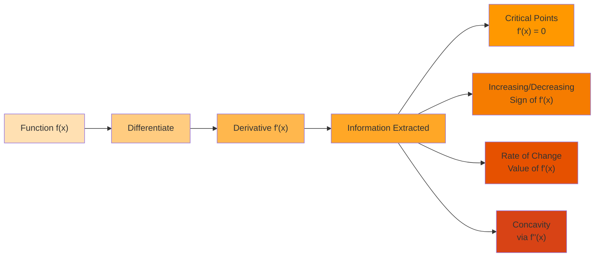

#### Differentiation Formulas

Having established the theoretical foundation, we now develop the practical tools for differentiation. These formulas
transform the potentially laborious process of computing derivatives from the definition into an efficient algorithmic
procedure.

##### The Power Rule: Foundation of Algebraic Differentiation

The power rule is perhaps the most fundamental differentiation formula, serving as the basis for differentiating all
polynomial and many other functions.

**Theorem (Power Rule)**: For any real number $n$ and $x > 0$ (or $x \neq 0$ if $n$ is a positive integer):
$$\frac{d}{dx}[x^n] = nx^{n-1}$$

**Proof for Positive Integer $n$**: We'll use the binomial theorem and the definition of derivative.

For $f(x) = x^n$: $$f'(x) = \lim_{h \to 0} \frac{(x+h)^n - x^n}{h}$$

By the binomial theorem:
$$(x+h)^n = \sum_{k=0}^{n} \binom{n}{k} x^{n-k}h^k = x^n + nx^{n-1}h + \binom{n}{2}x^{n-2}h^2 + \cdots + h^n$$

Therefore: $$f'(x) = \lim_{h \to 0} \frac{x^n + nx^{n-1}h + \binom{n}{2}x^{n-2}h^2 + \cdots + h^n - x^n}{h}$$

$$= \lim_{h \to 0} \frac{nx^{n-1}h + \binom{n}{2}x^{n-2}h^2 + \cdots + h^n}{h}$$

$$= \lim_{h \to 0} \left(nx^{n-1} + \binom{n}{2}x^{n-2}h + \cdots + h^{n-1}\right)$$

$$= nx^{n-1}$$

**Extension to Rational Exponents**: For $n = p/q$ where $p, q$ are integers with $q > 0$:

Let $y = x^{p/q}$, so $y^q = x^p$. Differentiating implicitly: $$q y^{q-1} \frac{dy}{dx} = px^{p-1}$$

$$\frac{dy}{dx} = \frac{px^{p-1}}{qy^{q-1}} = \frac{px^{p-1}}{q(x^{p/q})^{q-1}} = \frac{px^{p-1}}{qx^{p(q-1)/q}} = \frac{p}{q}x^{p-1-p(q-1)/q} = \frac{p}{q}x^{(p/q)-1}$$

This proves the power rule for rational exponents.

**Extension to All Real Exponents**: For arbitrary real $n$, we can use the exponential function: $$x^n = e^{n\ln x}$$

Differentiating:
$$\frac{d}{dx}[x^n] = \frac{d}{dx}[e^{n\ln x}] = e^{n\ln x} \cdot \frac{n}{x} = x^n \cdot \frac{n}{x} = nx^{n-1}$$

**Special Cases and Examples**:

1. $\frac{d}{dx}[x^0] = \frac{d}{dx}[1] = 0$ (consistent with $n = 0$)
2. $\frac{d}{dx}[x^1] = 1$ (identity function)
3. $\frac{d}{dx}[x^{-1}] = -x^{-2} = -\frac{1}{x^2}$
4. $\frac{d}{dx}[\sqrt{x}] = \frac{d}{dx}[x^{1/2}] = \frac{1}{2}x^{-1/2} = \frac{1}{2\sqrt{x}}$
5. $\frac{d}{dx}[x^{\pi}] = \pi x^{\pi-1}$

**Common Mistakes to Avoid**:

- Forgetting to subtract 1 from the exponent
- Mishandling negative exponents
- Confusing $\frac{d}{dx}[a^x]$ with $\frac{d}{dx}[x^a]$

##### Linearity of Differentiation: Sum and Constant Multiple Rules

Differentiation is a linear operation, meaning it preserves addition and scalar multiplication. This property
dramatically simplifies finding derivatives of complex expressions.

**Theorem (Constant Multiple Rule)**: If $f$ is differentiable and $c$ is a constant, then:
$$\frac{d}{dx}[cf(x)] = c\frac{d}{dx}[f(x)]$$

**Proof**: Using the definition of derivative:
$$\frac{d}{dx}[cf(x)] = \lim_{h \to 0} \frac{cf(x+h) - cf(x)}{h} = \lim_{h \to 0} c\cdot\frac{f(x+h) - f(x)}{h} = c\lim_{h \to 0} \frac{f(x+h) - f(x)}{h} = cf'(x)$$

**Theorem (Sum Rule)**: If $f$ and $g$ are differentiable, then:
$$\frac{d}{dx}[f(x) + g(x)] = \frac{d}{dx}[f(x)] + \frac{d}{dx}[g(x)]$$

**Proof**: $$\frac{d}{dx}[f(x) + g(x)] = \lim_{h \to 0} \frac{[f(x+h) + g(x+h)] - [f(x) + g(x)]}{h}$$

$$= \lim_{h \to 0} \frac{[f(x+h) - f(x)] + [g(x+h) - g(x)]}{h}$$

$$= \lim_{h \to 0} \left[\frac{f(x+h) - f(x)}{h} + \frac{g(x+h) - g(x)}{h}\right]$$

$$= \lim_{h \to 0} \frac{f(x+h) - f(x)}{h} + \lim_{h \to 0} \frac{g(x+h) - g(x)}{h} = f'(x) + g'(x)$$

**Corollary (Difference Rule)**: $\frac{d}{dx}[f(x) - g(x)] = f'(x) - g'(x)$

**Theorem (General Linearity)**: For constants $a, b$ and differentiable functions $f, g$:
$$\frac{d}{dx}[af(x) + bg(x)] = af'(x) + bg'(x)$$

This extends to any finite linear combination.

**Example - Polynomial Differentiation**: Find the derivative of $p(x) = 3x^4 - 7x^2 + 5x - 2$.

Applying linearity and the power rule:
$$p'(x) = 3\frac{d}{dx}[x^4] - 7\frac{d}{dx}[x^2] + 5\frac{d}{dx}[x] - \frac{d}{dx}[2]$$
$$= 3(4x^3) - 7(2x) + 5(1) - 0$$ $$= 12x^3 - 14x + 5$$

**Significance of Linearity**:

1. **Computational Efficiency**: Differentiate term by term
2. **Theoretical Importance**: Differentiation is a linear operator
3. **Basis for Advanced Topics**: Functional analysis, differential operators
4. **Physical Interpretation**: Superposition principle in physics

##### Product Rule: When Functions Multiply

When functions are multiplied, their derivatives interact in a specific way captured by the product rule. This rule
reveals that the derivative of a product is not simply the product of derivatives.

**Theorem (Product Rule)**: If $f$ and $g$ are differentiable, then: $$\frac{d}{dx}[f(x)g(x)] = f'(x)g(x) + f(x)g'(x)$$

**Proof**: We need to compute: $$\lim_{h \to 0} \frac{f(x+h)g(x+h) - f(x)g(x)}{h}$$

The key insight is to add and subtract $f(x+h)g(x)$:
$$\frac{f(x+h)g(x+h) - f(x)g(x)}{h} = \frac{f(x+h)g(x+h) - f(x+h)g(x) + f(x+h)g(x) - f(x)g(x)}{h}$$

$$= \frac{f(x+h)[g(x+h) - g(x)] + g(x)[f(x+h) - f(x)]}{h}$$

$$= f(x+h)\frac{g(x+h) - g(x)}{h} + g(x)\frac{f(x+h) - f(x)}{h}$$

Taking the limit as $h \to 0$:

- $f(x+h) \to f(x)$ (by continuity of $f$ at $x$)
- $\frac{g(x+h) - g(x)}{h} \to g'(x)$
- $\frac{f(x+h) - f(x)}{h} \to f'(x)$

Therefore: $$\frac{d}{dx}[f(x)g(x)] = f(x)g'(x) + g(x)f'(x)$$

**Mnemonic**: "The derivative of a product is the first times the derivative of the second plus the second times the
derivative of the first."

**Example**: Find the derivative of $h(x) = x^2\sin x$.

Let $f(x) = x^2$ and $g(x) = \sin x$. Then $f'(x) = 2x$ and $g'(x) = \cos x$.

By the product rule: $$h'(x) = f'(x)g(x) + f(x)g'(x) = 2x\sin x + x^2\cos x$$

**Extension to Multiple Products**: For three functions:
$$\frac{d}{dx}[f(x)g(x)h(x)] = f'(x)g(x)h(x) + f(x)g'(x)h(x) + f(x)g(x)h'(x)$$

In general, for $n$ functions:
$$\frac{d}{dx}[f_1(x)f_2(x)\cdots f_n(x)] = \sum_{i=1}^{n} f_1(x)\cdots f_{i-1}(x)f_i'(x)f_{i+1}(x)\cdots f_n(x)$$

**Geometric Interpretation**: The product rule can be understood through areas. If $f(x)$ and $g(x)$ represent lengths
of sides of a rectangle, then $f(x)g(x)$ is the area. The rate of change of area equals:

- Rate of change of first side times second side
- Plus first side times rate of change of second side

This captures how area changes when both dimensions vary.

##### Quotient Rule: Division and Its Complexities

The quotient rule handles derivatives of rational functions, showing how rates of change interact when one function
divides another.

**Theorem (Quotient Rule)**: If $f$ and $g$ are differentiable and $g(x) \neq 0$, then:
$$\frac{d}{dx}\left[\frac{f(x)}{g(x)}\right] = \frac{f'(x)g(x) - f(x)g'(x)}{[g(x)]^2}$$

**Proof Method 1 - From Definition**:
$$\frac{d}{dx}\left[\frac{f(x)}{g(x)}\right] = \lim_{h \to 0} \frac{\frac{f(x+h)}{g(x+h)} - \frac{f(x)}{g(x)}}{h}$$

$$= \lim_{h \to 0} \frac{f(x+h)g(x) - f(x)g(x+h)}{hg(x+h)g(x)}$$

Adding and subtracting $f(x)g(x)$:
$$= \lim_{h \to 0} \frac{f(x+h)g(x) - f(x)g(x) + f(x)g(x) - f(x)g(x+h)}{hg(x+h)g(x)}$$

$$= \lim_{h \to 0} \frac{g(x)[f(x+h) - f(x)] - f(x)[g(x+h) - g(x)]}{hg(x+h)g(x)}$$

$$= \lim_{h \to 0} \frac{g(x)\frac{f(x+h) - f(x)}{h} - f(x)\frac{g(x+h) - g(x)}{h}}{g(x+h)g(x)}$$

Taking the limit: $$= \frac{g(x)f'(x) - f(x)g'(x)}{[g(x)]^2}$$

**Proof Method 2 - Using Product Rule**: Write $\frac{f(x)}{g(x)} = f(x) \cdot [g(x)]^{-1}$ and differentiate:

First, find $\frac{d}{dx}[g(x)]^{-1}$ using the chain rule:
$$\frac{d}{dx}[g(x)]^{-1} = -[g(x)]^{-2} \cdot g'(x) = -\frac{g'(x)}{[g(x)]^2}$$

Now apply the product rule:
$$\frac{d}{dx}\left[\frac{f(x)}{g(x)}\right] = f'(x) \cdot \frac{1}{g(x)} + f(x) \cdot \left(-\frac{g'(x)}{[g(x)]^2}\right)$$

$$= \frac{f'(x)}{g(x)} - \frac{f(x)g'(x)}{[g(x)]^2} = \frac{f'(x)g(x) - f(x)g'(x)}{[g(x)]^2}$$

**Mnemonic**: "Low d-high minus high d-low, all over low squared" where:

- "Low" refers to the denominator
- "High" refers to the numerator
- "d" means derivative

**Example**: Find the derivative of $h(x) = \frac{x^2 + 1}{x - 3}$.

Let $f(x) = x^2 + 1$ and $g(x) = x - 3$. Then $f'(x) = 2x$ and $g'(x) = 1$.

By the quotient rule:
$$h'(x) = \frac{(2x)(x-3) - (x^2+1)(1)}{(x-3)^2} = \frac{2x^2 - 6x - x^2 - 1}{(x-3)^2} = \frac{x^2 - 6x - 1}{(x-3)^2}$$

**Common Errors**:

1. Forgetting to square the denominator
2. Getting the order wrong in the numerator (it matters!)
3. Simplifying incorrectly

##### Building a Differentiation Toolkit

With the fundamental rules established, we can now differentiate a vast array of functions efficiently. Let's compile
these rules and add some important special cases.

**Complete Differentiation Rules**:

1. **Constant Rule**: $\frac{d}{dx}[c] = 0$
2. **Power Rule**: $\frac{d}{dx}[x^n] = nx^{n-1}$
3. **Constant Multiple**: $\frac{d}{dx}[cf(x)] = cf'(x)$
4. **Sum Rule**: $\frac{d}{dx}[f(x) + g(x)] = f'(x) + g'(x)$
5. **Product Rule**: $\frac{d}{dx}[f(x)g(x)] = f'(x)g(x) + f(x)g'(x)$
6. **Quotient Rule**: $\frac{d}{dx}\left[\frac{f(x)}{g(x)}\right] = \frac{f'(x)g(x) - f(x)g'(x)}{[g(x)]^2}$
7. **Chain Rule**: $\frac{d}{dx}[f(g(x))] = f'(g(x))g'(x)$ (to be covered in detail)

**Standard Derivatives to Memorize**:

- $\frac{d}{dx}[e^x] = e^x$
- $\frac{d}{dx}[\ln x] = \frac{1}{x}$
- $\frac{d}{dx}[\sin x] = \cos x$
- $\frac{d}{dx}[\cos x] = -\sin x$
- $\frac{d}{dx}[\tan x] = \sec^2 x$
- $\frac{d}{dx}[\sec x] = \sec x \tan x$
- $\frac{d}{dx}[\arcsin x] = \frac{1}{\sqrt{1-x^2}}$
- $\frac{d}{dx}[\arctan x] = \frac{1}{1+x^2}$

**Strategies for Complex Functions**:

1. **Identify Structure**: Determine which rules apply
2. **Break Down**: Separate into simpler components
3. **Apply Rules Systematically**: Work from outside in or inside out
4. **Simplify**: Algebraic simplification often reveals patterns
5. **Check**: Verify special cases or use alternative methods

**Example - Combining Multiple Rules**: Find the derivative of $f(x) = \frac{x^2\sin x}{x + 1}$.

This requires both product and quotient rules. Let's call the numerator $u(x) = x^2\sin x$ and denominator
$v(x) = x + 1$.

First, find $u'(x)$ using the product rule: $$u'(x) = 2x\sin x + x^2\cos x$$

And $v'(x) = 1$.

Now apply the quotient rule: $$f'(x) = \frac{u'(x)v(x) - u(x)v'(x)}{[v(x)]^2}$$

$$= \frac{(2x\sin x + x^2\cos x)(x + 1) - x^2\sin x \cdot 1}{(x + 1)^2}$$

$$= \frac{2x^2\sin x + 2x\sin x + x^3\cos x + x^2\cos x - x^2\sin x}{(x + 1)^2}$$

$$= \frac{x^2\sin x + 2x\sin x + x^3\cos x + x^2\cos x}{(x + 1)^2}$$

$$= \frac{x\sin x(x + 2) + x^2\cos x(x + 1)}{(x + 1)^2}$$

This systematic approach handles even complex expressions efficiently.

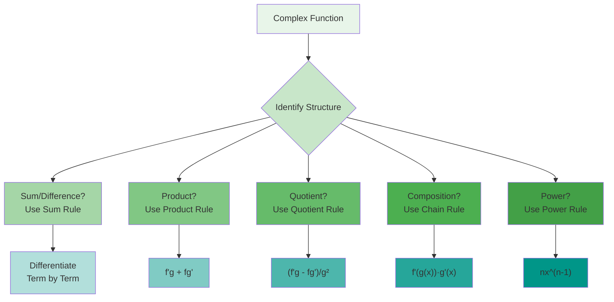

#### Derivatives of Trigonometric Functions

Trigonometric functions model periodic phenomena throughout science and engineering. Their derivatives reveal how these
periodic behaviors change, providing essential tools for analyzing waves, oscillations, and rotational motion.

##### Fundamental Limits and Basic Derivatives

Before deriving the derivatives of trigonometric functions, we must establish two fundamental limits that serve as the
foundation for all trigonometric differentiation.

**Fundamental Limit 1**: $$\lim_{h \to 0} \frac{\sin h}{h} = 1$$

**Geometric Proof**: Consider a unit circle with a central angle $h$ (in radians) where $0 < h < \pi/2$.

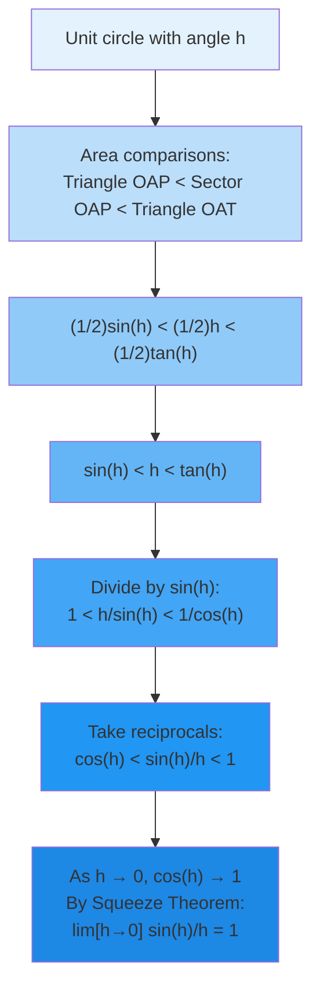

In this diagram:

- Point A is at $(cos h, sin h)$
- Point T is where the tangent line meets the vertical line through $(1,0)$
- The areas satisfy: $\frac{1}{2}\sin h < \frac{1}{2}h < \frac{1}{2}\tan h$

Since $\cos h < \frac{\sin h}{h} < 1$ and $\lim_{h \to 0} \cos h = 1$, the Squeeze Theorem gives us
$\lim_{h \to 0} \frac{\sin h}{h} = 1$.

For negative $h$, we use the fact that $\frac{\sin(-h)}{-h} = \frac{-\sin h}{-h} = \frac{\sin h}{h}$, so the limit holds
from both sides.

**Fundamental Limit 2**: $$\lim_{h \to 0} \frac{1 - \cos h}{h} = 0$$

**Algebraic Proof**:
$$\frac{1 - \cos h}{h} = \frac{1 - \cos h}{h} \cdot \frac{1 + \cos h}{1 + \cos h} = \frac{1 - \cos^2 h}{h(1 + \cos h)} = \frac{\sin^2 h}{h(1 + \cos h)}$$

$$= \frac{\sin h}{h} \cdot \frac{\sin h}{1 + \cos h}$$

As $h \to 0$:

- $\frac{\sin h}{h} \to 1$ (by Fundamental Limit 1)
- $\sin h \to 0$
- $1 + \cos h \to 2$

Therefore: $\lim_{h \to 0} \frac{1 - \cos h}{h} = 1 \cdot \frac{0}{2} = 0$

**Alternative Form**: $$\lim_{h \to 0} \frac{1 - \cos h}{h^2} = \frac{1}{2}$$

This follows from:
$$\frac{1 - \cos h}{h^2} = \frac{\sin^2 h}{h^2(1 + \cos h)} = \left(\frac{\sin h}{h}\right)^2 \cdot \frac{1}{1 + \cos h} \to 1^2 \cdot \frac{1}{2} = \frac{1}{2}$$

##### The Sine and Cosine Connection

With these fundamental limits established, we can now derive the derivatives of sine and cosine.

**Theorem**: $\frac{d}{dx}[\sin x] = \cos x$

**Proof**: Using the definition of derivative: $$\frac{d}{dx}[\sin x] = \lim_{h \to 0} \frac{\sin(x+h) - \sin x}{h}$$

Using the angle addition formula $\sin(x+h) = \sin x \cos h + \cos x \sin h$:

$$\frac{d}{dx}[\sin x] = \lim_{h \to 0} \frac{\sin x \cos h + \cos x \sin h - \sin x}{h}$$

$$= \lim_{h \to 0} \frac{\sin x(\cos h - 1) + \cos x \sin h}{h}$$

$$= \lim_{h \to 0} \left[\sin x \cdot \frac{\cos h - 1}{h} + \cos x \cdot \frac{\sin h}{h}\right]$$

$$= \sin x \cdot 0 + \cos x \cdot 1 = \cos x$$

Therefore, $\frac{d}{dx}[\sin x] = \cos x$. ∎

**Theorem**: $\frac{d}{dx}[\cos x] = -\sin x$

**Proof Method 1** - Using the angle addition formula:
$$\frac{d}{dx}[\cos x] = \lim_{h \to 0} \frac{\cos(x+h) - \cos x}{h}$$

Using $\cos(x+h) = \cos x \cos h - \sin x \sin h$:

$$= \lim_{h \to 0} \frac{\cos x \cos h - \sin x \sin h - \cos x}{h}$$

$$= \lim_{h \to 0} \frac{\cos x(\cos h - 1) - \sin x \sin h}{h}$$

$$= \lim_{h \to 0} \left[\cos x \cdot \frac{\cos h - 1}{h} - \sin x \cdot \frac{\sin h}{h}\right]$$

$$= \cos x \cdot 0 - \sin x \cdot 1 = -\sin x$$

**Proof Method 2** - Using the identity $\cos x = \sin(x + \pi/2)$ and chain rule:
$$\frac{d}{dx}[\cos x] = \frac{d}{dx}[\sin(x + \pi/2)] = \cos(x + \pi/2) \cdot 1 = -\sin x$$

**Geometric Interpretation**: The derivatives of sine and cosine reveal a beautiful relationship:

- The rate of change of $\sin x$ is $\cos x$
- The rate of change of $\cos x$ is $-\sin x$

This creates a cycle:
$\sin x \xrightarrow{\text{differentiate}} \cos x \xrightarrow{\text{differentiate}} -\sin x \xrightarrow{\text{differentiate}} -\cos x \xrightarrow{\text{differentiate}} \sin x$

**Higher Derivatives**: This pattern continues:

- $\frac{d}{dx}[\sin x] = \cos x$
- $\frac{d^2}{dx^2}[\sin x] = -\sin x$
- $\frac{d^3}{dx^3}[\sin x] = -\cos x$
- $\frac{d^4}{dx^4}[\sin x] = \sin x$

The derivatives repeat with period 4, reflecting the underlying periodicity of trigonometric functions.

##### Derivatives of Other Trigonometric Functions

With sine and cosine derivatives established, we can derive the remaining trigonometric derivatives using quotient and
reciprocal relationships.

**Theorem**: $\frac{d}{dx}[\tan x] = \sec^2 x$

**Proof**: Since $\tan x = \frac{\sin x}{\cos x}$, apply the quotient rule:

$$\frac{d}{dx}[\tan x] = \frac{d}{dx}\left[\frac{\sin x}{\cos x}\right] = \frac{\cos x \cdot \cos x - \sin x \cdot (-\sin x)}{\cos^2 x}$$

$$= \frac{\cos^2 x + \sin^2 x}{\cos^2 x} = \frac{1}{\cos^2 x} = \sec^2 x$$

**Alternative Proof**: Using the identity $1 + \tan^2 x = \sec^2 x$:

Differentiating both sides: $$0 + 2\tan x \cdot \frac{d}{dx}[\tan x] = 2\sec x \cdot \sec x \tan x$$

$$\frac{d}{dx}[\tan x] = \frac{2\sec^2 x \tan x}{2\tan x} = \sec^2 x$$

**Theorem**: $\frac{d}{dx}[\cot x] = -\csc^2 x$

**Proof**: Since $\cot x = \frac{\cos x}{\sin x}$:

$$\frac{d}{dx}[\cot x] = \frac{-\sin x \cdot \sin x - \cos x \cdot \cos x}{\sin^2 x} = \frac{-(\sin^2 x + \cos^2 x)}{\sin^2 x} = \frac{-1}{\sin^2 x} = -\csc^2 x$$

**Theorem**: $\frac{d}{dx}[\sec x] = \sec x \tan x$

**Proof**: Since $\sec x = \frac{1}{\cos x}$:

$$\frac{d}{dx}[\sec x] = \frac{d}{dx}[\cos x]^{-1} = -1 \cdot [\cos x]^{-2} \cdot (-\sin x) = \frac{\sin x}{\cos^2 x} = \frac{1}{\cos x} \cdot \frac{\sin x}{\cos x} = \sec x \tan x$$

**Theorem**: $\frac{d}{dx}[\csc x] = -\csc x \cot x$

**Proof**: Since $\csc x = \frac{1}{\sin x}$:

$$\frac{d}{dx}[\csc x] = \frac{d}{dx}[\sin x]^{-1} = -1 \cdot [\sin x]^{-2} \cdot \cos x = \frac{-\cos x}{\sin^2 x} = -\frac{1}{\sin x} \cdot \frac{\cos x}{\sin x} = -\csc x \cot x$$

**Summary of Trigonometric Derivatives**:

| Function | Derivative       |
| -------- | ---------------- |
| $\sin x$ | $\cos x$         |
| $\cos x$ | $-\sin x$        |
| $\tan x$ | $\sec^2 x$       |
| $\cot x$ | $-\csc^2 x$      |
| $\sec x$ | $\sec x \tan x$  |
| $\csc x$ | $-\csc x \cot x$ |

**Patterns to Remember**:

1. Derivatives of co-functions (cos, cot, csc) have negative signs
2. Derivatives of $\tan$ and $\cot$ involve squares
3. Derivatives of $\sec$ and $\csc$ involve products

##### Trigonometric Identities in Differentiation

Trigonometric identities provide alternative approaches to differentiation and help simplify complex expressions.
Understanding these connections deepens our grasp of both trigonometry and calculus.

**Using Identities Before Differentiation**:

Example: Find $\frac{d}{dx}[\sin^2 x + \cos^2 x]$

Method 1 - Direct differentiation:
$$\frac{d}{dx}[\sin^2 x + \cos^2 x] = 2\sin x \cos x + 2\cos x(-\sin x) = 2\sin x \cos x - 2\sin x \cos x = 0$$

Method 2 - Using identity $\sin^2 x + \cos^2 x = 1$: $$\frac{d}{dx}[1] = 0$$

The identity approach is clearly simpler!

**Double Angle Formulas in Differentiation**:

Example: Differentiate $f(x) = \sin x \cos x$

Method 1 - Product rule: $$f'(x) = \cos x \cdot \cos x + \sin x \cdot (-\sin x) = \cos^2 x - \sin^2 x$$

Method 2 - Using $\sin x \cos x = \frac{1}{2}\sin 2x$:
$$f'(x) = \frac{1}{2} \cdot \frac{d}{dx}[\sin 2x] = \frac{1}{2} \cdot \cos 2x \cdot 2 = \cos 2x$$

Note that $\cos 2x = \cos^2 x - \sin^2 x$, confirming our result.

**Verification of Derivatives Using Identities**:

The identity $\frac{d}{dx}[\tan x] = \sec^2 x$ can be verified using $1 + \tan^2 x = \sec^2 x$.

If we differentiate the identity: $$\frac{d}{dx}[1 + \tan^2 x] = \frac{d}{dx}[\sec^2 x]$$
$$0 + 2\tan x \cdot \frac{d}{dx}[\tan x] = 2\sec x \cdot \sec x \tan x$$

This gives us $\frac{d}{dx}[\tan x] = \sec^2 x$, confirming our earlier result.

**Half-Angle Substitutions**:

For expressions like $\sqrt{1 - \cos x}$, use $1 - \cos x = 2\sin^2(x/2)$:

$$\frac{d}{dx}[\sqrt{1 - \cos x}] = \frac{d}{dx}[\sqrt{2}\sin(x/2)] = \sqrt{2}\cos(x/2) \cdot \frac{1}{2} = \frac{\sqrt{2}}{2}\cos(x/2)$$

Alternatively, direct differentiation:
$$\frac{d}{dx}[\sqrt{1 - \cos x}] = \frac{1}{2\sqrt{1 - \cos x}} \cdot \sin x = \frac{\sin x}{2\sqrt{1 - \cos x}}$$

These are equivalent since $\sin x = 2\sin(x/2)\cos(x/2)$ and $\sqrt{1 - \cos x} = \sqrt{2}\sin(x/2)$.

##### Applications to Periodic Phenomena

The derivatives of trigonometric functions are essential for analyzing periodic phenomena across science and
engineering.

**Simple Harmonic Motion**: For position $x(t) = A\sin(\omega t + \phi)$:

- Velocity: $v(t) = \frac{dx}{dt} = A\omega\cos(\omega t + \phi)$
- Acceleration: $a(t) = \frac{dv}{dt} = -A\omega^2\sin(\omega t + \phi) = -\omega^2 x(t)$

This shows that acceleration is proportional to displacement but opposite in direction—the defining characteristic of
simple harmonic motion.

**Wave Motion**: For a wave $y(x,t) = A\sin(kx - \omega t)$:

- Spatial derivative: $\frac{\partial y}{\partial x} = Ak\cos(kx - \omega t)$ (slope at fixed time)
- Temporal derivative: $\frac{\partial y}{\partial t} = -A\omega\cos(kx - \omega t)$ (velocity at fixed position)

The wave equation $\frac{\partial^2 y}{\partial t^2} = v^2\frac{\partial^2 y}{\partial x^2}$ is satisfied with
$v = \omega/k$.

**AC Circuits**: For current $i(t) = I_0\sin(\omega t)$:

- Voltage across inductor: $V_L = L\frac{di}{dt} = L\omega I_0\cos(\omega t)$
- Voltage across capacitor: $V_C = \frac{1}{C}\int i , dt = -\frac{I_0}{\omega C}\cos(\omega t)$

The phase relationships revealed by derivatives are crucial for circuit analysis.

**Modulated Signals**: For amplitude modulation $f(t) = A(1 + m\cos\omega_m t)\sin\omega_c t$:

$$f'(t) = A[-m\omega_m\sin\omega_m t]\sin\omega_c t + A(1 + m\cos\omega_m t)\omega_c\cos\omega_c t$$

This shows how both the envelope and carrier contribute to the rate of change.

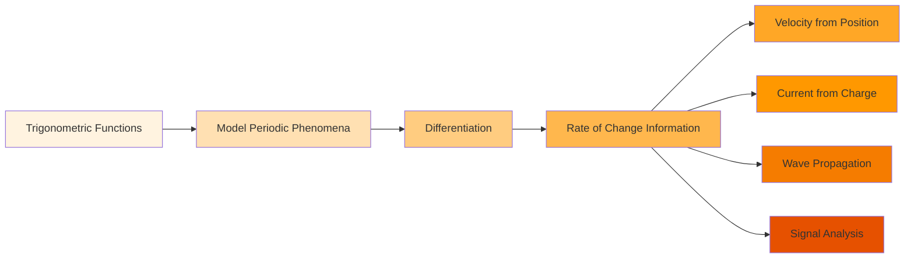

These applications demonstrate why trigonometric derivatives are fundamental tools in physics, engineering, and signal
processing.

#### The Chain Rule

The chain rule stands as one of the most powerful and frequently used techniques in differential calculus. It provides
the key to differentiating composite functions—functions built by applying one function to the output of another.

##### Composition and the Chain of Rates

To understand the chain rule, we must first understand function composition and how rates of change propagate through
composite functions.

**Function Composition**: Given functions $f$ and $g$, their composition $(f \circ g)(x) = f(g(x))$ means:

1. First apply $g$ to input $x$, getting $g(x)$
2. Then apply $f$ to the result, getting $f(g(x))$

The key insight: when $x$ changes, it causes $g(x)$ to change, which in turn causes $f(g(x))$ to change. The chain rule
quantifies this cascade of changes.

**Intuitive Understanding**: Consider these relationships:

- $x$ changes at some rate
- This causes $g(x)$ to change at rate $g'(x)$
- The change in $g(x)$ causes $f(g(x))$ to change at rate $f'(g(x))$
- The total rate of change is the product: $f'(g(x)) \cdot g'(x)$

Think of it as a chain of cause and effect, where rates multiply along the chain.

**The Chain Rule**: If $g$ is differentiable at $x$ and $f$ is differentiable at $g(x)$, then the composition
$f \circ g$ is differentiable at $x$ and:

$$\frac{d}{dx}[f(g(x))] = f'(g(x)) \cdot g'(x)$$

In Leibniz notation, if $y = f(u)$ and $u = g(x)$, then: $$\frac{dy}{dx} = \frac{dy}{du} \cdot \frac{du}{dx}$$

This notation makes the chain rule appear almost obvious—the $du$ terms seem to "cancel."

**Proof of the Chain Rule**: We'll prove this fundamental theorem rigorously.

Given: $h(x) = f(g(x))$, we want to find $h'(x)$.

By definition:
$$h'(x) = \lim_{\Delta x \to 0} \frac{h(x + \Delta x) - h(x)}{\Delta x} = \lim_{\Delta x \to 0} \frac{f(g(x + \Delta x)) - f(g(x))}{\Delta x}$$

Let $\Delta u = g(x + \Delta x) - g(x)$. Note that as $\Delta x \to 0$, we have $\Delta u \to 0$ since $g$ is continuous
at $x$ (differentiability implies continuity).

For $\Delta u \neq 0$, we can write:
$$\frac{f(g(x + \Delta x)) - f(g(x))}{\Delta x} = \frac{f(g(x) + \Delta u) - f(g(x))}{\Delta u} \cdot \frac{\Delta u}{\Delta x}$$

As $\Delta x \to 0$:

- $\frac{\Delta u}{\Delta x} \to g'(x)$
- $\frac{f(g(x) + \Delta u) - f(g(x))}{\Delta u} \to f'(g(x))$ (since $\Delta u \to 0$)

Therefore: $$h'(x) = f'(g(x)) \cdot g'(x)$$

**Technical Note**: The proof requires careful handling when $\Delta u = 0$ for some values of $\Delta x$ near 0. The
complete proof addresses this by considering:

$$F(t) = \begin{cases} \frac{f(g(x) + t) - f(g(x))}{t} & \text{if } t \neq 0 \ f'(g(x)) & \text{if } t = 0 \end{cases}$$

Since $f$ is differentiable at $g(x)$, the function $F$ is continuous at $t = 0$. This allows the limit to be evaluated
even when $\Delta u = 0$ for some values.

##### Understanding the Chain Rule: Multiple Perspectives

The chain rule can be understood from several viewpoints, each providing valuable insight.

**Perspective 1 - Rates of Change**: If $y$ depends on $u$, and $u$ depends on $x$, then the rate at which $y$ changes
with respect to $x$ equals the rate at which $y$ changes with respect to $u$ times the rate at which $u$ changes with
respect to $x$.

**Perspective 2 - Linear Approximation**: Near a point, differentiable functions are approximately linear:

- $f(u + \Delta u) \approx f(u) + f'(u)\Delta u$
- $g(x + \Delta x) \approx g(x) + g'(x)\Delta x$

Combining these: $$f(g(x + \Delta x)) \approx f(g(x) + g'(x)\Delta x) \approx f(g(x)) + f'(g(x)) \cdot g'(x)\Delta x$$

This shows the derivative is $f'(g(x)) \cdot g'(x)$.

**Perspective 3 - Transformations**: Think of $g$ as transforming the $x$-axis and $f$ as transforming the result. The
chain rule tells us how these transformations combine.

**Perspective 4 - Substitution**: If we substitute $u = g(x)$ into $y = f(u)$, the chain rule tells us how to
differentiate the resulting expression with respect to $x$.

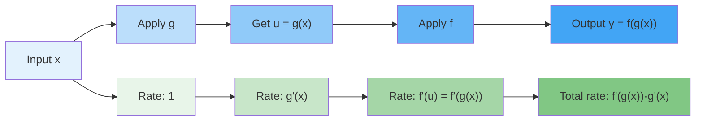

**Example - Basic Application**: Find the derivative of $h(x) = \sin(x^2)$.

Here, $f(u) = \sin u$ and $g(x) = x^2$.

- $f'(u) = \cos u$, so $f'(g(x)) = \cos(x^2)$
- $g'(x) = 2x$

By the chain rule: $$h'(x) = f'(g(x)) \cdot g'(x) = \cos(x^2) \cdot 2x = 2x\cos(x^2)$$

**Example - With Leibniz Notation**: Find $\frac{dy}{dx}$ if $y = \sqrt{1 + x^3}$.

Let $u = 1 + x^3$, so $y = \sqrt{u} = u^{1/2}$.

- $\frac{dy}{du} = \frac{1}{2}u^{-1/2} = \frac{1}{2\sqrt{u}}$
- $\frac{du}{dx} = 3x^2$

By the chain rule:
$$\frac{dy}{dx} = \frac{dy}{du} \cdot \frac{du}{dx} = \frac{1}{2\sqrt{u}} \cdot 3x^2 = \frac{3x^2}{2\sqrt{1 + x^3}}$$

##### Nested Functions and Repeated Application

Many functions involve multiple levels of composition, requiring repeated application of the chain rule.

**Triple Composition**: For $h(x) = f(g(k(x)))$, we have: $$h'(x) = f'(g(k(x))) \cdot g'(k(x)) \cdot k'(x)$$

This extends to any number of nested functions—we multiply the derivatives of each function in the chain, evaluated at
the appropriate points.

**Example - Triple Composition**: Differentiate $y = \sin(\ln(\sqrt{x}))$.

Breaking down the composition:

- Innermost: $k(x) = \sqrt{x} = x^{1/2}$
- Middle: $g(u) = \ln(u)$
- Outermost: $f(v) = \sin(v)$

So $y = f(g(k(x)))$.

Finding derivatives:

- $k'(x) = \frac{1}{2}x^{-1/2} = \frac{1}{2\sqrt{x}}$
- $g'(u) = \frac{1}{u}$, so $g'(k(x)) = \frac{1}{\sqrt{x}}$
- $f'(v) = \cos(v)$, so $f'(g(k(x))) = \cos(\ln(\sqrt{x}))$

Applying the chain rule:
$$\frac{dy}{dx} = \cos(\ln(\sqrt{x})) \cdot \frac{1}{\sqrt{x}} \cdot \frac{1}{2\sqrt{x}} = \frac{\cos(\ln(\sqrt{x}))}{2x}$$

**Strategy for Complex Compositions**:

1. Identify the chain of functions from outside to inside
2. Find the derivative of each function
3. Apply the chain rule, multiplying derivatives from outside to inside
4. Simplify the result

**Example - Multiple Chain Rules**: Differentiate $y = \sin^3(2x)$.

This can be written as $y = [\sin(2x)]^3$.

Let $u = \sin(2x)$, so $y = u^3$.

- $\frac{dy}{du} = 3u^2 = 3\sin^2(2x)$

For $u = \sin(2x)$, let $v = 2x$, so $u = \sin(v)$.

- $\frac{du}{dv} = \cos(v) = \cos(2x)$
- $\frac{dv}{dx} = 2$

Combining:
$$\frac{dy}{dx} = \frac{dy}{du} \cdot \frac{du}{dv} \cdot \frac{dv}{dx} = 3\sin^2(2x) \cdot \cos(2x) \cdot 2 = 6\sin^2(2x)\cos(2x)$$

##### Implicit Chain Rule Applications

The chain rule appears implicitly in many standard differentiation formulas. Recognizing these hidden applications
deepens understanding.

**General Power Rule**: For any differentiable function $g(x)$: $$\frac{d}{dx}[g(x)]^n = n[g(x)]^{n-1} \cdot g'(x)$$

This is the chain rule applied to $f(u) = u^n$ where $u = g(x)$.

**General Exponential Rule**: $$\frac{d}{dx}[e^{g(x)}] = e^{g(x)} \cdot g'(x)$$

**General Logarithmic Rule**: $$\frac{d}{dx}[\ln(g(x))] = \frac{1}{g(x)} \cdot g'(x) = \frac{g'(x)}{g(x)}$$

**Trigonometric Compositions**:

- $\frac{d}{dx}[\sin(g(x))] = \cos(g(x)) \cdot g'(x)$
- $\frac{d}{dx}[\cos(g(x))] = -\sin(g(x)) \cdot g'(x)$
- $\frac{d}{dx}[\tan(g(x))] = \sec^2(g(x)) \cdot g'(x)$

**Example - Logarithmic Differentiation**: Find the derivative of $y = x^x$.

Taking the natural logarithm: $\ln y = x \ln x$

Differentiating both sides: $$\frac{1}{y} \cdot \frac{dy}{dx} = \ln x + x \cdot \frac{1}{x} = \ln x + 1$$

Therefore: $$\frac{dy}{dx} = y(\ln x + 1) = x^x(\ln x + 1)$$

This technique uses the chain rule implicitly when differentiating $\ln y$.

##### The Chain Rule as a Unifying Principle

The chain rule unifies many seemingly disparate aspects of calculus and extends to advanced topics.

**Related Rates**: In related rates problems, variables depend on time, creating compositions: If
$V = \frac{4}{3}\pi r^3$ and $r = r(t)$, then:
$$\frac{dV}{dt} = \frac{dV}{dr} \cdot \frac{dr}{dt} = 4\pi r^2 \cdot \frac{dr}{dt}$$

**Inverse Functions**: If $y = f(x)$ and $x = f^{-1}(y)$, then:
$$\frac{dx}{dy} = \frac{1}{\frac{dy}{dx}} = \frac{1}{f'(x)}$$

This is a consequence of the chain rule applied to $x = f^{-1}(f(x))$.

**Parametric Equations**: For curves defined by $x = x(t)$, $y = y(t)$: $$\frac{dy}{dx} = \frac{dy/dt}{dx/dt}$$

This follows from the chain rule since $y$ is a function of $t$, which is implicitly a function of $x$.

**Multivariable Chain Rule**: For $z = f(x,y)$ where $x = x(t)$ and $y = y(t)$:
$$\frac{dz}{dt} = \frac{\partial f}{\partial x} \cdot \frac{dx}{dt} + \frac{\partial f}{\partial y} \cdot \frac{dy}{dt}$$

This extends the single-variable chain rule to paths in higher dimensions.

**Differential Equations**: The chain rule appears in solving differential equations: For $\frac{dy}{dx} = f(y)$, we can
write: $$\frac{dy}{f(y)} = dx$$

This separation of variables uses the chain rule implicitly.

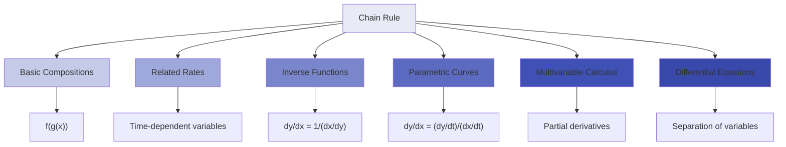

The chain rule's ubiquity in calculus reflects a fundamental principle: when quantities are related through composition,
their rates of change multiply. This simple yet profound idea extends throughout mathematics and its applications.

#### Implicit Differentiation

Not all relationships between variables can be expressed with one variable explicitly as a function of another. Implicit
differentiation provides a powerful technique for finding derivatives when variables are intertwined in complex
equations.

##### When Functions Hide in Equations

Many important curves and relationships are most naturally expressed as equations relating $x$ and $y$, rather than as
explicit functions $y = f(x)$.

**Examples of Implicit Relationships**:

1. Circle: $x^2 + y^2 = r^2$
2. Ellipse: $\frac{x^2}{a^2} + \frac{y^2}{b^2} = 1$
3. Folium of Descartes: $x^3 + y^3 = 3xy$
4. Lemniscate: $(x^2 + y^2)^2 = 2a^2(x^2 - y^2)$

These equations define $y$ implicitly as a function of $x$ (at least locally), but solving for $y$ explicitly may be
difficult or impossible.

**The Implicit Function Theorem** (stated informally): If $F(x,y) = 0$ defines a relation near a point $(a,b)$ where:

- $F(a,b) = 0$
- $F$ has continuous partial derivatives
- $\frac{\partial F}{\partial y}(a,b) \neq 0$

Then near $(a,b)$, the equation $F(x,y) = 0$ implicitly defines $y$ as a function of $x$.

**Why Implicit Differentiation Works**: Even though we can't solve for $y$ explicitly, we can still find $\frac{dy}{dx}$
by:

1. Differentiating both sides of the equation with respect to $x$
2. Treating $y$ as a function of $x$ (even though we don't know its formula)
3. Using the chain rule whenever we differentiate terms involving $y$

##### The Technique of Implicit Differentiation

The process of implicit differentiation follows a systematic approach.

**Step-by-Step Method**:

1. Differentiate both sides of the equation with respect to $x$
2. For terms involving only $x$: differentiate normally
3. For terms involving $y$: use the chain rule, introducing $\frac{dy}{dx}$
4. For products or quotients involving both $x$ and $y$: use product/quotient rule
5. Collect all terms containing $\frac{dy}{dx}$
6. Solve for $\frac{dy}{dx}$

**Example 1 - Circle**: Find $\frac{dy}{dx}$ for $x^2 + y^2 = 25$.

Differentiating both sides with respect to $x$: $$\frac{d}{dx}[x^2 + y^2] = \frac{d}{dx}[25]$$

$$2x + 2y\frac{dy}{dx} =0$$

Solving for $\frac{dy}{dx}$: $$2y\frac{dy}{dx} = -2x$$ $$\frac{dy}{dx} = -\frac{x}{y}$$

Note: This derivative is undefined when $y = 0$ (at the points $(±5, 0)$), which makes sense geometrically—the circle
has vertical tangents there.

**Example 2 - More Complex**: Find $\frac{dy}{dx}$ for $x^3 + y^3 = 3xy$.

Differentiating both sides: $$\frac{d}{dx}[x^3 + y^3] = \frac{d}{dx}[3xy]$$

Left side: $$3x^2 + 3y^2\frac{dy}{dx}$$

Right side (using product rule): $$3\left(1 \cdot y + x \cdot \frac{dy}{dx}\right) = 3y + 3x\frac{dy}{dx}$$

Setting equal: $$3x^2 + 3y^2\frac{dy}{dx} = 3y + 3x\frac{dy}{dx}$$

Collecting terms with $\frac{dy}{dx}$: $$3y^2\frac{dy}{dx} - 3x\frac{dy}{dx} = 3y - 3x^2$$
$$\frac{dy}{dx}(3y^2 - 3x) = 3y - 3x^2$$ $$\frac{dy}{dx} = \frac{3y - 3x^2}{3y^2 - 3x} = \frac{y - x^2}{y^2 - x}$$

**Example 3 - With Transcendental Functions**: Find $\frac{dy}{dx}$ for $e^{xy} = x + y$.

Differentiating both sides: $$\frac{d}{dx}[e^{xy}] = \frac{d}{dx}[x + y]$$

Left side (using chain rule with $u = xy$): $$e^{xy} \cdot \frac{d}{dx}[xy] = e^{xy}\left(y + x\frac{dy}{dx}\right)$$

Right side: $$1 + \frac{dy}{dx}$$

Setting equal: $$e^{xy}\left(y + x\frac{dy}{dx}\right) = 1 + \frac{dy}{dx}$$

Expanding: $$ye^{xy} + xe^{xy}\frac{dy}{dx} = 1 + \frac{dy}{dx}$$

Collecting terms: $$xe^{xy}\frac{dy}{dx} - \frac{dy}{dx} = 1 - ye^{xy}$$ $$\frac{dy}{dx}(xe^{xy} - 1) = 1 - ye^{xy}$$
$$\frac{dy}{dx} = \frac{1 - ye^{xy}}{xe^{xy} - 1}$$

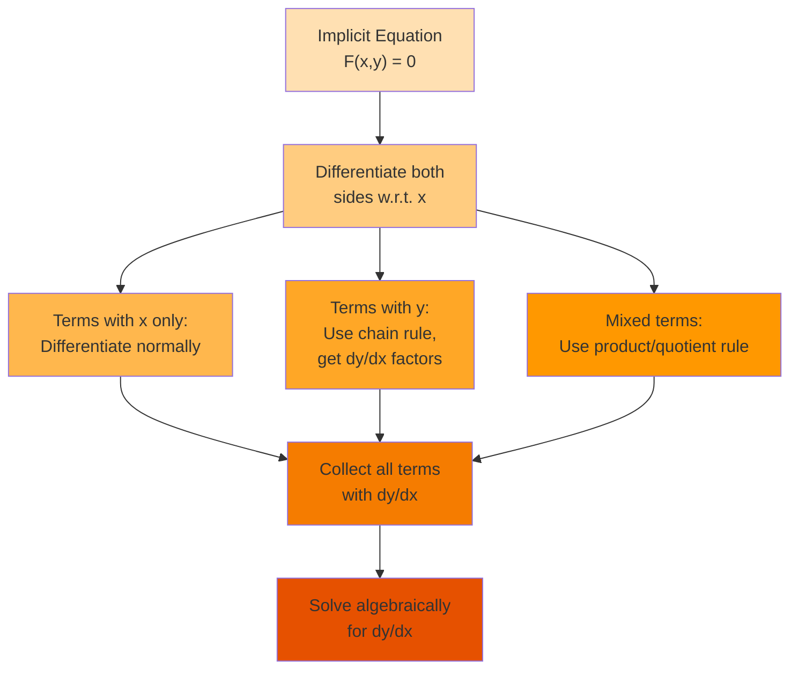

##### Geometric Applications: Tangents to Implicit Curves

Implicit differentiation excels at finding tangent lines to curves defined by equations, even when we can't solve for
$y$ explicitly.

**Finding Tangent Lines**: Once we have $\frac{dy}{dx}$, we can find the tangent line at any point $(x_0, y_0)$ on the
curve:

1. Verify that $(x_0, y_0)$ satisfies the equation
2. Calculate $\frac{dy}{dx}$ at that point
3. Use point-slope form: $y - y_0 = m(x - x_0)$ where $m = \frac{dy}{dx}\bigg|_{(x_0,y_0)}$

**Example - Tangent to Folium**: Find the tangent line to $x^3 + y^3 = 3xy$ at the point $(3/2, 3/2)$.

First, verify the point is on the curve: $$(3/2)^3 + (3/2)^3 = 27/8 + 27/8 = 27/4$$ $$3 \cdot (3/2) \cdot (3/2) = 27/4$$
✓

From earlier, we found: $$\frac{dy}{dx} = \frac{y - x^2}{y^2 - x}$$

At $(3/2, 3/2)$:
$$\frac{dy}{dx} = \frac{3/2 - (3/2)^2}{(3/2)^2 - 3/2} = \frac{3/2 - 9/4}{9/4 - 3/2} = \frac{6/4 - 9/4}{9/4 - 6/4} = \frac{-3/4}{3/4} = -1$$

The tangent line is: $$y - \frac{3}{2} = -1\left(x - \frac{3}{2}\right)$$ $$y = -x + 3$$

**Normal Lines**: The normal line is perpendicular to the tangent. If the tangent has slope $m$, the normal has slope
$-1/m$ (provided $m \neq 0$).

For the previous example, the normal line at $(3/2, 3/2)$ has slope $-1/(-1) = 1$:
$$y - \frac{3}{2} = 1\left(x - \frac{3}{2}\right)$$ $$y = x$$

**Horizontal and Vertical Tangents**:

- Horizontal tangents occur where $\frac{dy}{dx} = 0$
- Vertical tangents occur where $\frac{dy}{dx}$ is undefined (typically where its denominator is zero)

**Example - Finding Special Tangents**: Find horizontal and vertical tangents to $x^2 + y^2 = 25$.

We found $\frac{dy}{dx} = -\frac{x}{y}$.

Horizontal tangents ($\frac{dy}{dx} = 0$): This occurs when $x = 0$, giving points $(0, ±5)$.

Vertical tangents ($\frac{dy}{dx}$ undefined): This occurs when $y = 0$, giving points $(±5, 0)$.

This matches our geometric intuition for a circle!

##### Higher-Order Implicit Derivatives

We can find second and higher derivatives implicitly, though the algebra becomes more involved.

**Finding the Second Derivative**: To find $\frac{d^2y}{dx^2}$:

1. Start with the expression for $\frac{dy}{dx}$
2. Differentiate it with respect to $x$
3. Remember that $\frac{dy}{dx}$ itself depends on $x$ and $y$
4. Substitute the known expression for $\frac{dy}{dx}$

**Example - Second Derivative**: Find $\frac{d^2y}{dx^2}$ for $x^2 + y^2 = 25$.

We have $\frac{dy}{dx} = -\frac{x}{y}$.

Differentiating with respect to $x$: $$\frac{d^2y}{dx^2} = \frac{d}{dx}\left[-\frac{x}{y}\right]$$

Using the quotient rule:
$$\frac{d^2y}{dx^2} = -\frac{y \cdot 1 - x \cdot \frac{dy}{dx}}{y^2} = -\frac{y - x\frac{dy}{dx}}{y^2}$$

Substituting $\frac{dy}{dx} = -\frac{x}{y}$:
$$\frac{d^2y}{dx^2} = -\frac{y - x\left(-\frac{x}{y}\right)}{y^2} = -\frac{y + \frac{x^2}{y}}{y^2} = -\frac{y^2 + x^2}{y^3}$$

Since $x^2 + y^2 = 25$: $$\frac{d^2y}{dx^2} = -\frac{25}{y^3}$$

**Interpretation**: The second derivative is always negative (for $y > 0$), confirming the circle is concave down in the
upper half. The magnitude increases as $|y|$ decreases, reflecting increasing curvature near the horizontal tangents.

**Example - Complex Second Derivative**: For $xy = 1$, find $\frac{d^2y}{dx^2}$.

First derivative: $$y + x\frac{dy}{dx} = 0$$ $$\frac{dy}{dx} = -\frac{y}{x}$$

Second derivative:
$$\frac{d^2y}{dx^2} = \frac{d}{dx}\left[-\frac{y}{x}\right] = -\frac{x\frac{dy}{dx} - y \cdot 1}{x^2} = -\frac{x\frac{dy}{dx} - y}{x^2}$$

Substituting $\frac{dy}{dx} = -\frac{y}{x}$:
$$\frac{d^2y}{dx^2} = -\frac{x\left(-\frac{y}{x}\right) - y}{x^2} = -\frac{-y - y}{x^2} = \frac{2y}{x^2}$$

Since $xy = 1$, we have $y = \frac{1}{x}$: $$\frac{d^2y}{dx^2} = \frac{2 \cdot \frac{1}{x}}{x^2} = \frac{2}{x^3}$$

This matches what we'd get by differentiating $y = x^{-1}$ directly!

##### Related Rates Preview

Implicit differentiation naturally leads to related rates problems, where multiple quantities change with respect to
time.

**Connection to Related Rates**: If variables $x$ and $y$ are related by an equation and both depend on time $t$, we can
differentiate the equation with respect to $t$:

For $x^2 + y^2 = 25$: $$\frac{d}{dt}[x^2 + y^2] = \frac{d}{dt}[25]$$ $$2x\frac{dx}{dt} + 2y\frac{dy}{dt} = 0$$

This relates the rates $\frac{dx}{dt}$ and $\frac{dy}{dt}$.

**Example - Expanding Circle**: A circle's radius increases at 2 cm/s. How fast is the area increasing when $r = 10$ cm?

The area is $A = \pi r^2$.

Differentiating with respect to $t$: $$\frac{dA}{dt} = 2\pi r \frac{dr}{dt}$$

When $r = 10$ and $\frac{dr}{dt} = 2$: $$\frac{dA}{dt} = 2\pi(10)(2) = 40\pi \text{ cm}^2/\text{s}$$

**Key Insight**: Implicit differentiation is the foundation for related rates. We differentiate relationships between
variables, treating them as functions of a parameter (often time).

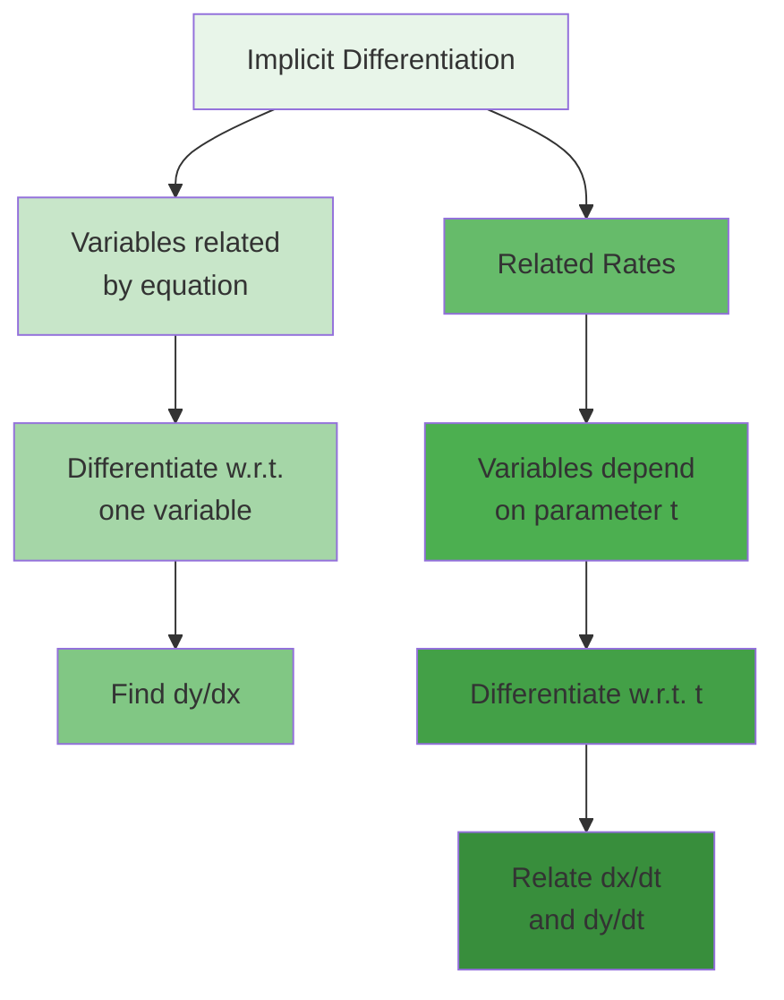

Implicit differentiation thus serves as a bridge between static geometric relationships and dynamic related rates
problems.

#### Rates of Change in the Natural and Social Sciences

The derivative's power extends far beyond abstract mathematics. As the mathematical language of change, derivatives
provide essential tools for understanding phenomena across all sciences. This section explores how different fields use
derivatives to model and analyze their specific domains.

##### Physics: Motion, Forces, and Fields

Physics was the birthplace of calculus, with Newton developing it specifically to describe motion and forces. Today,
derivatives permeate every branch of physics.

**Classical Mechanics**:

Position, velocity, and acceleration form a hierarchy of derivatives:

- Position: $\vec{r}(t)$
- Velocity: $\vec{v}(t) = \frac{d\vec{r}}{dt}$
- Acceleration: $\vec{a}(t) = \frac{d\vec{v}}{dt} = \frac{d^2\vec{r}}{dt^2}$

Newton's Second Law connects these to forces: $$\vec{F} = m\vec{a} = m\frac{d^2\vec{r}}{dt^2}$$

**Example - Projectile Motion**: A projectile launched at angle $\theta$ with initial speed $v_0$:

- $x(t) = v_0\cos(\theta)t$
- $y(t) = v_0\sin(\theta)t - \frac{1}{2}gt^2$

Velocities:

- $v_x(t) = v_0\cos(\theta)$ (constant)
- $v_y(t) = v_0\sin(\theta) - gt$

The projectile reaches maximum height when $v_y = 0$, giving $t = \frac{v_0\sin(\theta)}{g}$.

**Energy and Work**:

Power is the rate of energy transfer: $$P = \frac{dE}{dt}$$

For mechanical systems: $$P = \vec{F} \cdot \vec{v} = \vec{F} \cdot \frac{d\vec{r}}{dt}$$

**Oscillations and Waves**:

Simple harmonic motion satisfies: $$\frac{d^2x}{dt^2} = -\omega^2 x$$

This differential equation has solutions: $$x(t) = A\cos(\omega t + \phi)$$

For waves, the wave equation involves partial derivatives:
$$\frac{\partial^2 u}{\partial t^2} = v^2\frac{\partial^2 u}{\partial x^2}$$

**Thermodynamics**:

Heat flow follows Fourier's law: $$\vec{q} = -k\nabla T = -k\frac{dT}{dx}\hat{x}$$ (in 1D)

The rate of temperature change: $$\frac{dT}{dt} = \alpha\nabla^2 T$$ (heat equation)

**Electromagnetism**:

Maxwell's equations are fundamentally about rates of change:

- Faraday's law: $\nabla \times \vec{E} = -\frac{\partial \vec{B}}{\partial t}$
- Ampère-Maxwell law: $\nabla \times \vec{B} = \mu_0\vec{J} + \mu_0\epsilon_0\frac{\partial \vec{E}}{\partial t}$

Current is the rate of charge flow: $$I = \frac{dQ}{dt}$$

**Quantum Mechanics**:

The Schrödinger equation describes how quantum states evolve: $$i\hbar\frac{\partial \psi}{\partial t} = \hat{H}\psi$$

Expectation values change according to:
$$\frac{d\langle A \rangle}{dt} = \frac{i}{\hbar}\langle[\hat{H}, \hat{A}]\rangle + \left\langle\frac{\partial \hat{A}}{\partial t}\right\rangle$$

##### Biology: Growth, Decay, and Population Dynamics

Biology uses derivatives to model how organisms and populations change over time, from molecular to ecosystem scales.

**Cell Growth**:

Exponential growth in ideal conditions: $$\frac{dN}{dt} = rN$$

Solution: $N(t) = N_0e^{rt}$

**Enzyme Kinetics**:

Michaelis-Menten kinetics describes reaction rates: $$v = \frac{d[P]}{dt} = \frac{V_{max}[S]}{K_m + [S]}$$

where:

- $[S]$ is substrate concentration
- $[P]$ is product concentration
- $V_{max}$ is maximum reaction rate
- $K_m$ is Michaelis constant

**Population Dynamics**:

Logistic growth with carrying capacity: $$\frac{dP}{dt} = rP\left(1 - \frac{P}{K}\right)$$

This models how growth slows as resources become limited.

**Predator-Prey Models**:

The Lotka-Volterra equations: $$\frac{dx}{dt} = ax - bxy$$ (prey) $$\frac{dy}{dt} = -cy + dxy$$ (predator)

These coupled equations produce oscillating populations.

**Epidemiology**:

The SIR model tracks disease spread: $$\frac{dS}{dt} = -\beta SI$$ $$\frac{dI}{dt} = \beta SI - \gamma I$$
$$\frac{dR}{dt} = \gamma I$$

The basic reproduction number $R_0 = \frac{\beta}{\gamma}$ determines whether an epidemic occurs.

**Pharmacokinetics**:

Drug concentration follows: $$\frac{dC}{dt} = -kC$$

For oral medication with absorption: $$\frac{dC}{dt} = k_a D e^{-k_a t} - k_e C$$

**Neural Activity**:

The Hodgkin-Huxley model describes action potentials: $$C_m\frac{dV}{dt} = -\sum I_{ion} + I_{ext}$$

where ionic currents depend on voltage-gated channels.

**Evolution**:

Allele frequency changes according to: $$\frac{dp}{dt} = p(1-p)[p(w_{AA} - w_{Aa}) + (1-p)(w_{Aa} - w_{aa})]$$

where $w$ values are fitnesses.

##### Economics: Marginal Analysis and Optimization

Economics uses derivatives to analyze how small changes affect outcomes, leading to optimal decision-making.

**Marginal Concepts**:

For any economic quantity $Q(x)$:

- Marginal quantity: $\frac{dQ}{dx}$
- Average quantity: $\frac{Q(x)}{x}$

Key insight: Average is minimized when marginal equals average.

**Cost Analysis**:

Total cost: $C(q)$

- Marginal cost: $MC(q) = \frac{dC}{dq}$
- Variable cost: $VC(q) = C(q) - C(0)$
- Average cost: $AC(q) = \frac{C(q)}{q}$

Efficient scale occurs where $MC(q) = AC(q)$.

**Revenue and Profit**:

Revenue: $R(q) = p(q) \cdot q$

- Marginal revenue: $MR(q) = \frac{dR}{dq} = p(q) + q\frac{dp}{dq}$

Profit: $\Pi(q) = R(q) - C(q)$

- Maximized where $MR(q) = MC(q)$

**Elasticity**:

Price elasticity of demand: $$\varepsilon = \frac{d\ln Q}{d\ln P} = \frac{P}{Q}\frac{dQ}{dP}$$

Interpretation:

- $|\varepsilon| > 1$: Elastic demand
- $|\varepsilon| < 1$: Inelastic demand
- $|\varepsilon| = 1$: Unit elastic

**Consumer Theory**:

Utility maximization subject to budget constraint: $$\max U(x,y) \text{ subject to } p_x x + p_y y = M$$

Solution requires: $$\frac{\partial U/\partial x}{\partial U/\partial y} = \frac{p_x}{p_y}$$

**Production Theory**:

For production function $Q = f(L,K)$:

- Marginal product of labor: $MP_L = \frac{\partial Q}{\partial L}$
- Marginal product of capital: $MP_K = \frac{\partial Q}{\partial K}$

Diminishing returns: $\frac{\partial^2 Q}{\partial L^2} < 0$

**Growth Models**:

Solow growth model: $$\frac{dk}{dt} = sf(k) - (n + \delta)k$$

where:

- $k$ is capital per worker
- $s$ is savings rate
- $n$ is population growth
- $\delta$ is depreciation

**Financial Mathematics**:

Continuous compounding: $$\frac{dA}{dt} = rA$$

Black-Scholes option pricing involves:
$$\frac{\partial V}{\partial t} + \frac{1}{2}\sigma^2 S^2\frac{\partial^2 V}{\partial S^2} + rS\frac{\partial V}{\partial S} - rV = 0$$

##### Chemistry: Reaction Rates and Equilibrium

Chemistry uses derivatives to describe how concentrations change during reactions and approach equilibrium.

**Reaction Rates**:

For reaction $A \rightarrow B$: $$\text{rate} = -\frac{d[A]}{dt} = \frac{d[B]}{dt}$$

**Rate Laws**:

First-order: $\frac{d[A]}{dt} = -k[A]$ Second-order: $\frac{d[A]}{dt} = -k[A]^2$ nth-order: $\frac{d[A]}{dt} = -k[A]^n$

**Integrated Rate Laws**:

First-order: $[A] = [A]_0 e^{-kt}$ Second-order: $\frac{1}{[A]} = \frac{1}{[A]_0} + kt$

**Complex Reactions**:

For $A + B \rightarrow C$: $$\frac{d[C]}{dt} = k[A][B]$$

With intermediate: $$A \xrightarrow{k_1} B \xrightarrow{k_2} C$$

$$\frac{d[B]}{dt} = k_1[A] - k_2[B]$$

**Temperature Dependence**:

Arrhenius equation: $$k = Ae^{-E_a/RT}$$

Rate of change with temperature: $$\frac{d\ln k}{dT} = \frac{E_a}{RT^2}$$

**Chemical Equilibrium**:

At equilibrium, forward and reverse rates equal: $$\frac{d[A]}{dt} = 0$$

Le Chatelier's principle involves derivatives: $$\frac{d\ln K}{dT} = \frac{\Delta H°}{RT^2}$$

**Diffusion**:

Fick's first law: $$J = -D\frac{dC}{dx}$$

Fick's second law: $$\frac{\partial C}{\partial t} = D\frac{\partial^2 C}{\partial x^2}$$

##### Social Sciences: Modeling Change in Human Systems

Social sciences increasingly use derivatives to model how human systems evolve and respond to interventions.

**Sociology - Diffusion of Innovation**:

Adoption rate often follows: $$\frac{dN}{dt} = k(N_{max} - N)N$$

This S-curve models how ideas spread through populations.

**Psychology - Learning Curves**:

Performance improvement: $$\frac{dP}{dt} = r(P_{max} - P)$$

Forgetting curve: $$\frac{dR}{dt} = -kR$$

where $R$ is retention.

**Political Science - Opinion Dynamics**:

Continuous opinion model: $$\frac{dx_i}{dt} = -x_i + \frac{1}{n}\sum_{j} w_{ij}x_j$$

where $x_i$ is person $i$'s opinion and $w_{ij}$ represents influence.

**Demography**:

Population age structure: $$\frac{\partial n(a,t)}{\partial t} + \frac{\partial n(a,t)}{\partial a} = -\mu(a)n(a,t)$$

where $n(a,t)$ is population density at age $a$ and $\mu(a)$ is mortality rate.

**Urban Planning**:

Traffic flow: $$\frac{\partial \rho}{\partial t} + \frac{\partial(\rho v)}{\partial x} = 0$$

where $\rho$ is traffic density and $v$ is velocity.

**Education - Knowledge Acquisition**:

Skill development: $$\frac{dS}{dt} = \alpha(S_{target} - S) + \beta P$$

where $S$ is skill level and $P$ is practice rate.

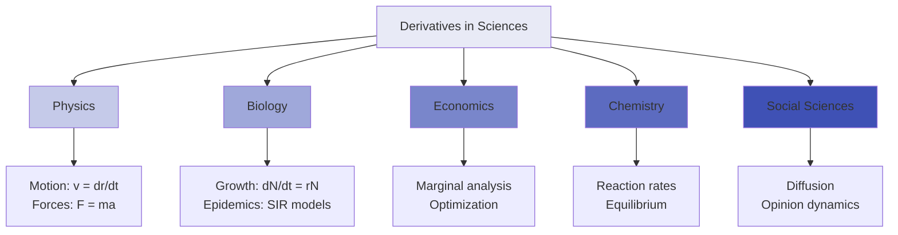

The universality of derivatives across sciences reflects a fundamental truth: change is the essence of natural and human
phenomena. Calculus provides the mathematical framework to quantify, analyze, and predict these changes, making it
indispensable for scientific understanding.

#### Related Rates

Related rates problems exemplify the power of calculus to connect changing quantities in dynamic systems. When multiple
variables change with time and are related by an equation, we can find how their rates of change depend on each other.

##### The Interconnected World of Changing Quantities

In the real world, quantities rarely change in isolation. The expansion of a balloon affects both its radius and volume;
a moving shadow's length depends on the sun's position and the object's height; water draining from a tank changes both
the water level and outflow rate. Related rates problems capture these interconnections mathematically.

**Core Concept**: If variables are related by an equation and each depends on time, their rates of change are also
related. By differentiating the constraint equation with respect to time, we obtain a relationship between the rates.

**Mathematical Framework**: Given:

- Variables $x, y, z, ...$ that depend on time $t$
- A relationship $F(x, y, z, ...) = 0$
- Some rates $\frac{dx}{dt}, \frac{dy}{dt}, ...$ are known

Find: The unknown rate(s)

Method: Differentiate $F$ with respect to $t$ using the chain rule.

**Why Related Rates Matter**:

1. **Engineering**: Designing systems where multiple parameters change
2. **Physics**: Understanding coupled motions and forces
3. **Economics**: Analyzing interconnected markets
4. **Biology**: Modeling interacting populations or metabolic processes
5. **Environmental Science**: Tracking pollutant spread and dilution

##### Setting Up Related Rates Problems

Success with related rates depends on systematic problem setup. A clear approach prevents errors and ensures all
relationships are captured.

**Step-by-Step Approach**:

1. **Identify Variables**: List all quantities that change with time
2. **Draw and Label**: Create a diagram showing the situation
3. **State What's Given**: Note which rates are known
4. **State What's Sought**: Identify the unknown rate(s)
5. **Find Relationships**: Write equations connecting the variables
6. **Differentiate**: Apply $\frac{d}{dt}$ to all equations
7. **Substitute**: Insert known values and rates
8. **Solve**: Find the unknown rate

**Example Setup - Expanding Balloon**:

_Problem_: Air is pumped into a spherical balloon at 100 cm³/s. How fast is the radius increasing when the diameter is
50 cm?

_Setup_:

- Variables: Volume $V$, radius $r$
- Given: $\frac{dV}{dt} = 100$ cm³/s, diameter = 50 cm (so $r = 25$ cm)
- Find: $\frac{dr}{dt}$ when $r = 25$
- Relationship: $V = \frac{4}{3}\pi r^3$

_Solution_: Differentiate with respect to $t$:
$$\frac{dV}{dt} = \frac{4}{3}\pi \cdot 3r^2 \cdot \frac{dr}{dt} = 4\pi r^2 \frac{dr}{dt}$$

Solve for $\frac{dr}{dt}$: $$\frac{dr}{dt} = \frac{1}{4\pi r^2} \cdot \frac{dV}{dt}$$

When $r = 25$ and $\frac{dV}{dt} = 100$:
$$\frac{dr}{dt} = \frac{100}{4\pi(25)^2} = \frac{100}{2500\pi} = \frac{1}{25\pi} \text{ cm/s}$$

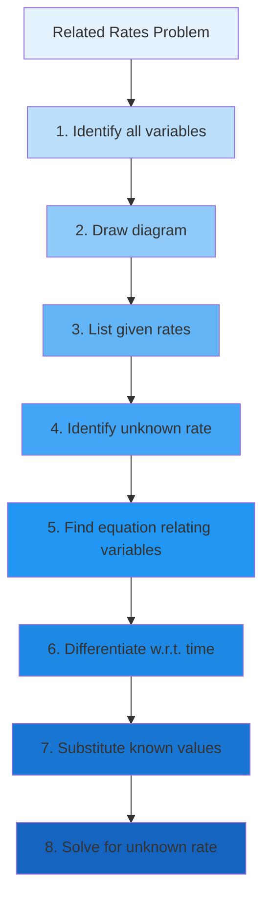

**Common Relationships to Remember**:

- Circle: $A = \pi r^2$, $C = 2\pi r$
- Sphere: $V = \frac{4}{3}\pi r^3$, $S = 4\pi r^2$
- Cylinder: $V = \pi r^2 h$
- Cone: $V = \frac{1}{3}\pi r^2 h$
- Pythagorean theorem: $a^2 + b^2 = c^2$
- Similar triangles: Proportional sides

##### Geometric Related Rates

Geometric problems form a large class of related rates applications, involving changing shapes, angles, and distances.

**Example 1 - Sliding Ladder**: A 10-foot
