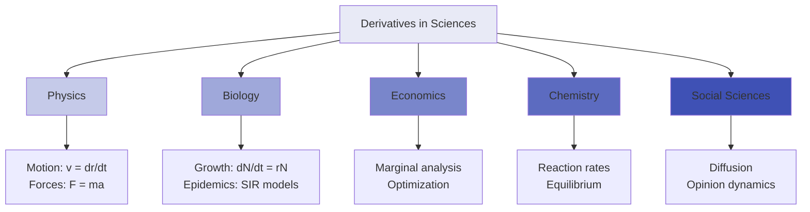
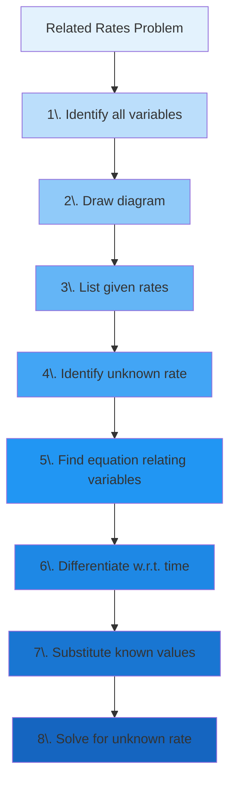
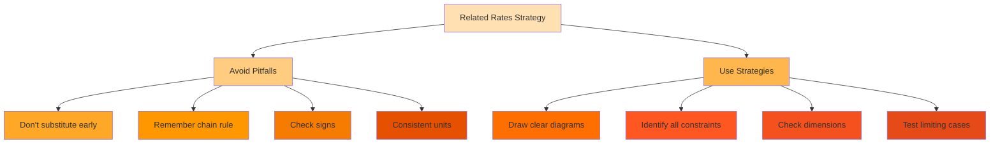
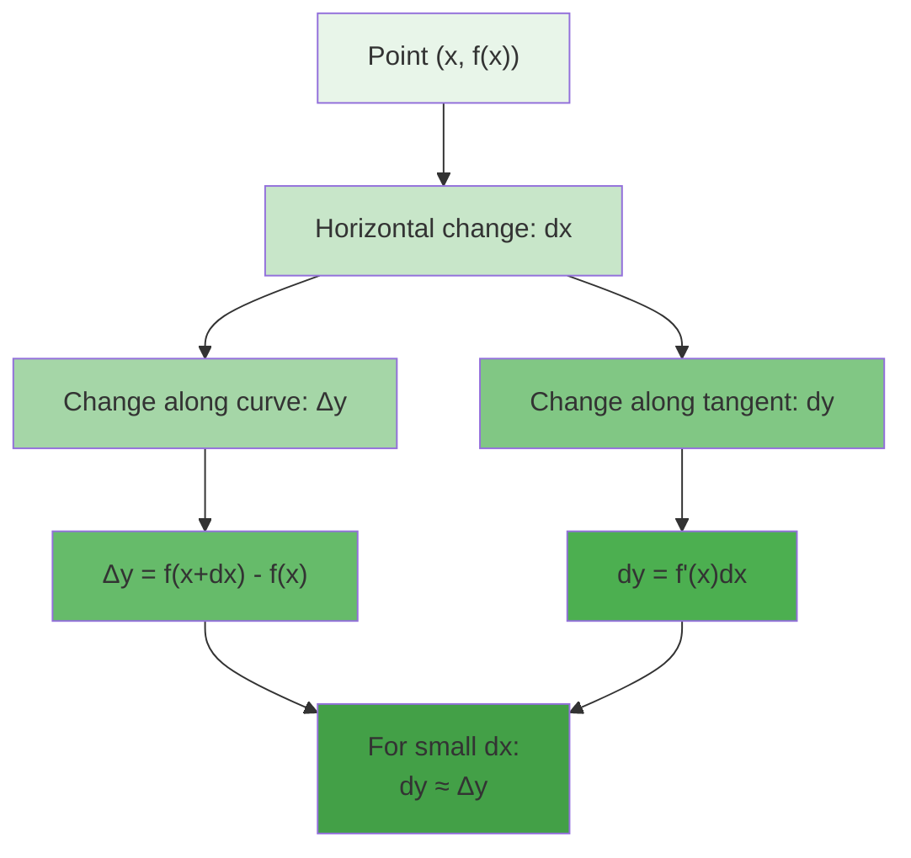
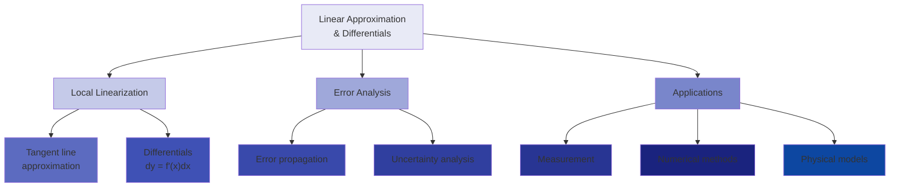

# C-2_2: Derivatives

7. Rates of Change in the Natural and Social Sciences

    - Physics: Motion, Forces, and Fields
    - Biology: Growth, Decay, and Population Dynamics
    - Economics: Marginal Analysis and Optimization
    - Chemistry: Reaction Rates and Equilibrium
    - Social Sciences: Modeling Change in Human Systems

8. Related Rates

    - The Interconnected World of Changing Quantities
    - Setting Up Related Rates Problems
    - Geometric Related Rates
    - Physical and Engineering Applications
    - Common Pitfalls and Problem-Solving Strategies

9. Linear Approximations and Differentials
    - The Tangent Line as Best Linear Approximation
    - Differentials: A New Perspective on Change
    - Error Analysis and Propagation
    - Applications in Measurement and Estimation
    - Extending to Multiple Variables: Total Differentials

#### Rates of Change in the Natural and Social Sciences

The derivative's power extends far beyond abstract mathematics. As the mathematical language of change, derivatives
provide essential tools for understanding phenomena across all sciences. This section explores how different fields use
derivatives to model and analyze their specific domains.

##### Physics: Motion, Forces, and Fields

Physics was the birthplace of calculus, with Newton developing it specifically to describe motion and forces. Today,
derivatives permeate every branch of physics.

**Classical Mechanics**:

Position, velocity, and acceleration form a hierarchy of derivatives:

- Position: $\vec{r}(t)$
- Velocity: $\vec{v}(t) = \frac{d\vec{r}}{dt}$
- Acceleration: $\vec{a}(t) = \frac{d\vec{v}}{dt} = \frac{d^2\vec{r}}{dt^2}$

Newton's Second Law connects these to forces: $$\vec{F} = m\vec{a} = m\frac{d^2\vec{r}}{dt^2}$$

**Example - Projectile Motion**: A projectile launched at angle $\theta$ with initial speed $v_0$:

- $x(t) = v_0\cos(\theta)t$
- $y(t) = v_0\sin(\theta)t - \frac{1}{2}gt^2$

Velocities:

- $v_x(t) = v_0\cos(\theta)$ (constant)
- $v_y(t) = v_0\sin(\theta) - gt$

The projectile reaches maximum height when $v_y = 0$, giving $t = \frac{v_0\sin(\theta)}{g}$.

**Energy and Work**:

Power is the rate of energy transfer: $$P = \frac{dE}{dt}$$

For mechanical systems: $$P = \vec{F} \cdot \vec{v} = \vec{F} \cdot \frac{d\vec{r}}{dt}$$

**Oscillations and Waves**:

Simple harmonic motion satisfies: $$\frac{d^2x}{dt^2} = -\omega^2 x$$

This differential equation has solutions: $$x(t) = A\cos(\omega t + \phi)$$

For waves, the wave equation involves partial derivatives:
$$\frac{\partial^2 u}{\partial t^2} = v^2\frac{\partial^2 u}{\partial x^2}$$

**Thermodynamics**:

Heat flow follows Fourier's law: $$\vec{q} = -k\nabla T = -k\frac{dT}{dx}\hat{x}$$ (in 1D)

The rate of temperature change: $$\frac{dT}{dt} = \alpha\nabla^2 T$$ (heat equation)

**Electromagnetism**:

Maxwell's equations are fundamentally about rates of change:

- Faraday's law: $\nabla \times \vec{E} = -\frac{\partial \vec{B}}{\partial t}$
- Ampère-Maxwell law: $\nabla \times \vec{B} = \mu_0\vec{J} + \mu_0\epsilon_0\frac{\partial \vec{E}}{\partial t}$

Current is the rate of charge flow: $$I = \frac{dQ}{dt}$$

**Quantum Mechanics**:

The Schrödinger equation describes how quantum states evolve: $$i\hbar\frac{\partial \psi}{\partial t} = \hat{H}\psi$$

Expectation values change according to:
$$\frac{d\langle A \rangle}{dt} = \frac{i}{\hbar}\langle[\hat{H}, \hat{A}]\rangle + \left\langle\frac{\partial \hat{A}}{\partial t}\right\rangle$$

##### Biology: Growth, Decay, and Population Dynamics

Biology uses derivatives to model how organisms and populations change over time, from molecular to ecosystem scales.

**Cell Growth**:

Exponential growth in ideal conditions: $$\frac{dN}{dt} = rN$$

Solution: $N(t) = N_0e^{rt}$

**Enzyme Kinetics**:

Michaelis-Menten kinetics describes reaction rates: $$v = \frac{d[P]}{dt} = \frac{V_{max}[S]}{K_m + [S]}$$

where:

- $[S]$ is substrate concentration
- $[P]$ is product concentration
- $V_{max}$ is maximum reaction rate
- $K_m$ is Michaelis constant

**Population Dynamics**:

Logistic growth with carrying capacity: $$\frac{dP}{dt} = rP\left(1 - \frac{P}{K}\right)$$

This models how growth slows as resources become limited.

**Predator-Prey Models**:

The Lotka-Volterra equations: $$\frac{dx}{dt} = ax - bxy$$ (prey) $$\frac{dy}{dt} = -cy + dxy$$ (predator)

These coupled equations produce oscillating populations.

**Epidemiology**:

The SIR model tracks disease spread: $$\frac{dS}{dt} = -\beta SI$$ $$\frac{dI}{dt} = \beta SI - \gamma I$$
$$\frac{dR}{dt} = \gamma I$$

The basic reproduction number $R_0 = \frac{\beta}{\gamma}$ determines whether an epidemic occurs.

**Pharmacokinetics**:

Drug concentration follows: $$\frac{dC}{dt} = -kC$$

For oral medication with absorption: $$\frac{dC}{dt} = k_a D e^{-k_a t} - k_e C$$

**Neural Activity**:

The Hodgkin-Huxley model describes action potentials: $$C_m\frac{dV}{dt} = -\sum I_{ion} + I_{ext}$$

where ionic currents depend on voltage-gated channels.

**Evolution**:

Allele frequency changes according to: $$\frac{dp}{dt} = p(1-p)[p(w_{AA} - w_{Aa}) + (1-p)(w_{Aa} - w_{aa})]$$

where $w$ values are fitnesses.

##### Economics: Marginal Analysis and Optimization

Economics uses derivatives to analyze how small changes affect outcomes, leading to optimal decision-making.

**Marginal Concepts**:

For any economic quantity $Q(x)$:

- Marginal quantity: $\frac{dQ}{dx}$
- Average quantity: $\frac{Q(x)}{x}$

Key insight: Average is minimized when marginal equals average.

**Cost Analysis**:

Total cost: $C(q)$

- Marginal cost: $MC(q) = \frac{dC}{dq}$
- Variable cost: $VC(q) = C(q) - C(0)$
- Average cost: $AC(q) = \frac{C(q)}{q}$

Efficient scale occurs where $MC(q) = AC(q)$.

**Revenue and Profit**:

Revenue: $R(q) = p(q) \cdot q$

- Marginal revenue: $MR(q) = \frac{dR}{dq} = p(q) + q\frac{dp}{dq}$

Profit: $\Pi(q) = R(q) - C(q)$

- Maximized where $MR(q) = MC(q)$

**Elasticity**:

Price elasticity of demand: $$\varepsilon = \frac{d\ln Q}{d\ln P} = \frac{P}{Q}\frac{dQ}{dP}$$

Interpretation:

- $|\varepsilon| > 1$: Elastic demand
- $|\varepsilon| < 1$: Inelastic demand
- $|\varepsilon| = 1$: Unit elastic

**Consumer Theory**:

Utility maximization subject to budget constraint: $$\max U(x,y) \text{ subject to } p_x x + p_y y = M$$

Solution requires: $$\frac{\partial U/\partial x}{\partial U/\partial y} = \frac{p_x}{p_y}$$

**Production Theory**:

For production function $Q = f(L,K)$:

- Marginal product of labor: $MP_L = \frac{\partial Q}{\partial L}$
- Marginal product of capital: $MP_K = \frac{\partial Q}{\partial K}$

Diminishing returns: $\frac{\partial^2 Q}{\partial L^2} < 0$

**Growth Models**:

Solow growth model: $$\frac{dk}{dt} = sf(k) - (n + \delta)k$$

where:

- $k$ is capital per worker
- $s$ is savings rate
- $n$ is population growth
- $\delta$ is depreciation

**Financial Mathematics**:

Continuous compounding: $$\frac{dA}{dt} = rA$$

Black-Scholes option pricing involves:
$$\frac{\partial V}{\partial t} + \frac{1}{2}\sigma^2 S^2\frac{\partial^2 V}{\partial S^2} + rS\frac{\partial V}{\partial S} - rV = 0$$

##### Chemistry: Reaction Rates and Equilibrium

Chemistry uses derivatives to describe how concentrations change during reactions and approach equilibrium.

**Reaction Rates**:

For reaction $A \rightarrow B$: $$\text{rate} = -\frac{d[A]}{dt} = \frac{d[B]}{dt}$$

**Rate Laws**:

First-order: $\frac{d[A]}{dt} = -k[A]$ Second-order: $\frac{d[A]}{dt} = -k[A]^2$ nth-order: $\frac{d[A]}{dt} = -k[A]^n$

**Integrated Rate Laws**:

First-order: $[A] = [A]_0 e^{-kt}$ Second-order: $\frac{1}{[A]} = \frac{1}{[A]_0} + kt$

**Complex Reactions**:

For $A + B \rightarrow C$: $$\frac{d[C]}{dt} = k[A][B]$$

With intermediate: $$A \xrightarrow{k_1} B \xrightarrow{k_2} C$$

$$\frac{d[B]}{dt} = k_1[A] - k_2[B]$$

**Temperature Dependence**:

Arrhenius equation: $$k = Ae^{-E_a/RT}$$

Rate of change with temperature: $$\frac{d\ln k}{dT} = \frac{E_a}{RT^2}$$

**Chemical Equilibrium**:

At equilibrium, forward and reverse rates equal: $$\frac{d[A]}{dt} = 0$$

Le Chatelier's principle involves derivatives: $$\frac{d\ln K}{dT} = \frac{\Delta H°}{RT^2}$$

**Diffusion**:

Fick's first law: $$J = -D\frac{dC}{dx}$$

Fick's second law: $$\frac{\partial C}{\partial t} = D\frac{\partial^2 C}{\partial x^2}$$

##### Social Sciences: Modeling Change in Human Systems

Social sciences increasingly use derivatives to model how human systems evolve and respond to interventions.

**Sociology - Diffusion of Innovation**:

Adoption rate often follows: $$\frac{dN}{dt} = k(N_{max} - N)N$$

This S-curve models how ideas spread through populations.

**Psychology - Learning Curves**:

Performance improvement: $$\frac{dP}{dt} = r(P_{max} - P)$$

Forgetting curve: $$\frac{dR}{dt} = -kR$$

where $R$ is retention.

**Political Science - Opinion Dynamics**:

Continuous opinion model: $$\frac{dx_i}{dt} = -x_i + \frac{1}{n}\sum_{j} w_{ij}x_j$$

where $x_i$ is person $i$'s opinion and $w_{ij}$ represents influence.

**Demography**:

Population age structure: $$\frac{\partial n(a,t)}{\partial t} + \frac{\partial n(a,t)}{\partial a} = -\mu(a)n(a,t)$$

where $n(a,t)$ is population density at age $a$ and $\mu(a)$ is mortality rate.

**Urban Planning**:

Traffic flow: $$\frac{\partial \rho}{\partial t} + \frac{\partial(\rho v)}{\partial x} = 0$$

where $\rho$ is traffic density and $v$ is velocity.

**Education - Knowledge Acquisition**:

Skill development: $$\frac{dS}{dt} = \alpha(S_{target} - S) + \beta P$$

where $S$ is skill level and $P$ is practice rate.

The universality of derivatives across sciences reflects a fundamental truth: change is the essence of natural and human
phenomena. Calculus provides the mathematical framework to quantify, analyze, and predict these changes, making it
indispensable for scientific understanding.

#### Related Rates

Related rates problems exemplify the power of calculus to connect changing quantities in dynamic systems. When multiple
variables change with time and are related by an equation, we can find how their rates of change depend on each other.

##### The Interconnected World of Changing Quantities

In the real world, quantities rarely change in isolation. The expansion of a balloon affects both its radius and volume;
a moving shadow's length depends on the sun's position and the object's height; water draining from a tank changes both
the water level and outflow rate. Related rates problems capture these interconnections mathematically.

**Core Concept**: If variables are related by an equation and each depends on time, their rates of change are also
related. By differentiating the constraint equation with respect to time, we obtain a relationship between the rates.

**Mathematical Framework**: Given:

- Variables $x, y, z, ...$ that depend on time $t$
- A relationship $F(x, y, z, ...) = 0$
- Some rates $\frac{dx}{dt}, \frac{dy}{dt}, ...$ are known

Find: The unknown rate(s)

Method: Differentiate $F$ with respect to $t$ using the chain rule.

**Why Related Rates Matter**:

1. **Engineering**: Designing systems where multiple parameters change
2. **Physics**: Understanding coupled motions and forces
3. **Economics**: Analyzing interconnected markets
4. **Biology**: Modeling interacting populations or metabolic processes
5. **Environmental Science**: Tracking pollutant spread and dilution

##### Setting Up Related Rates Problems

Success with related rates depends on systematic problem setup. A clear approach prevents errors and ensures all
relationships are captured.

**Step-by-Step Approach**:

1. **Identify Variables**: List all quantities that change with time
2. **Draw and Label**: Create a diagram showing the situation
3. **State What's Given**: Note which rates are known
4. **State What's Sought**: Identify the unknown rate(s)
5. **Find Relationships**: Write equations connecting the variables
6. **Differentiate**: Apply $\frac{d}{dt}$ to all equations
7. **Substitute**: Insert known values and rates
8. **Solve**: Find the unknown rate

**Example Setup - Expanding Balloon**:

_Problem_: Air is pumped into a spherical balloon at 100 cm³/s. How fast is the radius increasing when the diameter is
50 cm?

_Setup_:

- Variables: Volume $V$, radius $r$
- Given: $\frac{dV}{dt} = 100$ cm³/s, diameter = 50 cm (so $r = 25$ cm)
- Find: $\frac{dr}{dt}$ when $r = 25$
- Relationship: $V = \frac{4}{3}\pi r^3$

_Solution_: Differentiate with respect to $t$:
$$\frac{dV}{dt} = \frac{4}{3}\pi \cdot 3r^2 \cdot \frac{dr}{dt} = 4\pi r^2 \frac{dr}{dt}$$

Solve for $\frac{dr}{dt}$: $$\frac{dr}{dt} = \frac{1}{4\pi r^2} \cdot \frac{dV}{dt}$$

When $r = 25$ and $\frac{dV}{dt} = 100$:
$$\frac{dr}{dt} = \frac{100}{4\pi(25)^2} = \frac{100}{2500\pi} = \frac{1}{25\pi} \text{ cm/s}$$

**Common Relationships to Remember**:

- Circle: $A = \pi r^2$, $C = 2\pi r$
- Sphere: $V = \frac{4}{3}\pi r^3$, $S = 4\pi r^2$
- Cylinder: $V = \pi r^2 h$
- Cone: $V = \frac{1}{3}\pi r^2 h$
- Pythagorean theorem: $a^2 + b^2 = c^2$
- Similar triangles: Proportional sides

##### Geometric Related Rates

Geometric problems form a large class of related rates applications, involving changing shapes, angles, and distances.

**Example 1 - Sliding Ladder**: A 10-foot ladder leans against a wall. Its base slides away from the wall at 2 ft/s. How
fast is the top sliding down when the base is 6 feet from the wall?

_Setup_:

- Let $x$ = distance from wall to base
- Let $y$ = height of top on wall
- Given: $\frac{dx}{dt} = 2$ ft/s, ladder length = 10 ft
- Find: $\frac{dy}{dt}$ when $x = 6$

_Solution_: By Pythagorean theorem: $x^2 + y^2 = 100$

When $x = 6$: $36 + y^2 = 100$, so $y = 8$

Differentiate with respect to $t$: $$2x\frac{dx}{dt} + 2y\frac{dy}{dt} = 0$$

Solve for $\frac{dy}{dt}$: $$\frac{dy}{dt} = -\frac{x}{y} \cdot \frac{dx}{dt}$$

Substitute values: $$\frac{dy}{dt} = -\frac{6}{8} \cdot 2 = -1.5 \text{ ft/s}$$

The negative sign indicates the top is moving down.

**Example 2 - Conical Tank**: Water flows out of an inverted conical tank (radius 5 m, height 10 m) at 2 m³/min. How
fast is the water level dropping when the depth is 6 m?

_Setup_:

- Variables: Volume $V$, height $h$, radius at water level $r$
- Tank dimensions give: $\frac{r}{h} = \frac{5}{10} = \frac{1}{2}$, so $r = \frac{h}{2}$
- Given: $\frac{dV}{dt} = -2$ m³/min (negative because water flows out)
- Find: $\frac{dh}{dt}$ when $h = 6$

_Solution_: Volume of water:
$$V = \frac{1}{3}\pi r^2 h = \frac{1}{3}\pi \left(\frac{h}{2}\right)^2 h = \frac{\pi h^3}{12}$$

Differentiate: $$\frac{dV}{dt} = \frac{\pi}{12} \cdot 3h^2 \cdot \frac{dh}{dt} = \frac{\pi h^2}{4} \cdot \frac{dh}{dt}$$

Solve for $\frac{dh}{dt}$: $$\frac{dh}{dt} = \frac{4}{\pi h^2} \cdot \frac{dV}{dt}$$

When $h = 6$ and $\frac{dV}{dt} = -2$:
$$\frac{dh}{dt} = \frac{4}{\pi(36)} \cdot (-2) = -\frac{8}{36\pi} = -\frac{2}{9\pi} \text{ m/min}$$

**Example 3 - Rotating Spotlight**: A spotlight on the ground shines on a wall 20 m away. The light rotates at 0.5
rad/s. How fast does the illuminated spot move along the wall when the angle is 30°?

_Setup_:

- Let $\theta$ = angle from perpendicular
- Let $x$ = distance along wall from perpendicular point
- Given: $\frac{d\theta}{dt} = 0.5$ rad/s, distance to wall = 20 m
- Find: $\frac{dx}{dt}$ when $\theta = 30° = \pi/6$ rad

_Solution_: From trigonometry: $\tan\theta = \frac{x}{20}$, so $x = 20\tan\theta$

Differentiate: $$\frac{dx}{dt} = 20\sec^2\theta \cdot \frac{d\theta}{dt}$$

When $\theta = \pi/6$: $$\sec^2(\pi/6) = \frac{1}{\cos^2(\pi/6)} = \frac{1}{(3/4)} = \frac{4}{3}$$

Therefore: $$\frac{dx}{dt} = 20 \cdot \frac{4}{3} \cdot 0.5 = \frac{40}{3} \text{ m/s}$$

**Shadow Problems**: These involve similar triangles and moving light sources.

_Example_: A 6-foot person walks away from a 15-foot streetlight at 4 ft/s. How fast is the tip of their shadow moving?

_Setup_:

- Let $x$ = person's distance from light
- Let $s$ = shadow length
- Similar triangles: $\frac{15}{x+s} = \frac{6}{s}$

_Solution_: From similar triangles: $15s = 6(x+s)$, giving $s = \frac{2x}{3}$

Total distance from light to shadow tip: $x + s = x + \frac{2x}{3} = \frac{5x}{3}$

Rate of shadow tip movement:
$$\frac{d}{dt}(x + s) = \frac{d}{dt}\left(\frac{5x}{3}\right) = \frac{5}{3} \cdot \frac{dx}{dt} = \frac{5}{3} \cdot 4 = \frac{20}{3} \text{ ft/s}$$

##### Physical and Engineering Applications

Related rates problems model many physical systems where multiple parameters change simultaneously.

**Example 1 - Boyle's Law**: For an ideal gas at constant temperature, $PV = k$ (constant). If pressure increases at 2
kPa/min when $P = 100$ kPa and $V = 50$ L, how fast is volume decreasing?

_Solution_: Differentiate $PV = k$: $$P\frac{dV}{dt} + V\frac{dP}{dt} = 0$$

Solve for $\frac{dV}{dt}$:
$$\frac{dV}{dt} = -\frac{V}{P} \cdot \frac{dP}{dt} = -\frac{50}{100} \cdot 2 = -1 \text{ L/min}$$

**Example 2 - Electrical Circuit**: In an RC circuit, charge $Q$ satisfies $Q = CV(1 - e^{-t/RC})$. If $C = 10$ μF,
$R = 1000$ Ω, and $V = 12$ V, find the current at $t = 0.01$ s.

_Solution_: Current $I = \frac{dQ}{dt}$: $$I = CV \cdot \frac{1}{RC} \cdot e^{-t/RC} = \frac{V}{R} e^{-t/RC}$$

At $t = 0.01$ s: $$I = \frac{12}{1000} e^{-0.01/(1000 \times 10^{-5})} = 0.012 e^{-1} = 0.0044 \text{ A}$$

**Example 3 - Fluid Mechanics**: Water flows through a pipe with varying diameter. By continuity equation,
$A_1v_1 = A_2v_2$. If the diameter decreases from 10 cm to 5 cm and $v_1 = 2$ m/s, find $v_2$ and acceleration.

_Solution_: Areas: $A_1 = \pi(0.05)^2$, $A_2 = \pi(0.025)^2$

From continuity: $$v_2 = \frac{A_1}{A_2}v_1 = \frac{(0.05)^2}{(0.025)^2} \cdot 2 = 4 \cdot 2 = 8 \text{ m/s}$$

If the transition occurs over 0.5 m: Time to traverse: $t = \frac{0.5}{(2+8)/2} = 0.1$ s

Average acceleration: $a = \frac{8-2}{0.1} = 60$ m/s²

**Thermal Expansion**: A metal rod expands when heated. If $L = L_0(1 + \alpha T)$ where $\alpha = 12 \times 10^{-6}$
/°C, $L_0 = 1$ m, and temperature rises at 5°C/min, find $\frac{dL}{dt}$ at $T = 100$°C.

_Solution_:
$$\frac{dL}{dt} = L_0\alpha\frac{dT}{dt} = 1 \times 12 \times 10^{-6} \times 5 = 6 \times 10^{-5} \text{ m/min}$$

##### Common Pitfalls and Problem-Solving Strategies

Success with related rates requires avoiding common errors and applying effective strategies.

**Common Pitfalls**:

1. **Substituting Too Early**:
    - Wrong: Substitute numerical values before differentiating
    - Right: Differentiate first, then substitute
2. **Forgetting Chain Rule**:
    - Wrong: $\frac{d}{dt}[r^2] = 2r$
    - Right: $\frac{d}{dt}[r^2] = 2r\frac{dr}{dt}$
3. **Sign Errors**:
    - Decreasing quantities have negative rates
    - Check whether quantities increase or decrease
4. **Unit Inconsistency**:
    - Ensure all measurements use consistent units
    - Convert as needed before solving
5. **Assuming Constant Rates**:
    - Rates may change over time
    - The problem asks for the rate at a specific instant

**Problem-Solving Strategies**:

1. **Draw Multiple Diagrams**:
    - Show the general situation
    - Show the specific instant in question
    - Update diagrams as you work
2. **Identify Constraints**:
    - Geometric relationships (Pythagorean theorem, similar triangles)
    - Physical laws (conservation principles)
    - Given conditions (constant ratios, fixed totals)
3. **Check Dimensions**:
    - Ensure your answer has correct units
    - Use dimensional analysis to verify formulas
4. **Consider Limiting Cases**:
    - What happens as variables approach extremes?
    - Does your answer make physical sense?
5. **Work Backwards**:
    - Start with what you need to find
    - Determine what information would help
    - Connect to what's given

**Example - Complete Solution with Checks**:

_Problem_: A plane flies horizontally at 500 mph at altitude 5 miles. It passes directly over a radar station. How fast
is the distance from plane to station increasing 10 minutes later?

_Solution_: Setup:

- Horizontal distance from station: $x$
- Distance from plane to station: $s$
- Altitude: $h = 5$ miles (constant)
- $\frac{dx}{dt} = 500$ mph

After 10 minutes = 1/6 hour: $x = 500 \times \frac{1}{6} = \frac{250}{3}$ miles

Relationship: $s^2 = x^2 + h^2 = x^2 + 25$

Differentiate: $$2s\frac{ds}{dt} = 2x\frac{dx}{dt}$$ $$\frac{ds}{dt} = \frac{x}{s} \cdot \frac{dx}{dt}$$

Find $s$ when $x = \frac{250}{3}$:
$$s = \sqrt{x^2 + 25} = \sqrt{\left(\frac{250}{3}\right)^2 + 25} = \sqrt{\frac{62500}{9} + 25} = \sqrt{\frac{62500 + 225}{9}} = \sqrt{\frac{62725}{9}} = \frac{5\sqrt{2509}}{3}$$

Therefore:
$$\frac{ds}{dt} = \frac{250/3}{5\sqrt{2509}/3} \cdot 500 = \frac{250}{5\sqrt{2509}} \cdot 500 = \frac{25000}{\sqrt{2509}}$$

Numerical approximation: $\sqrt{2509} \approx 50.09$, so $\frac{ds}{dt} \approx 499.1$ mph

_Checks_:

- Units: mph ✓
- Magnitude: Less than 500 mph (plane's speed) ✓
- Limiting behavior: As $x \to \infty$, $\frac{ds}{dt} \to 500$ mph ✓

Related rates problems exemplify calculus in action, showing how derivatives connect changing quantities in dynamic
systems. Mastery comes through practice, careful setup, and systematic problem-solving.

#### Linear Approximations and Differentials

Linear approximation represents one of the most practical applications of derivatives, allowing us to estimate function
values and analyze how errors propagate through calculations. This technique transforms complex functions into simple
linear ones near points of interest.

##### The Tangent Line as Best Linear Approximation

The fundamental insight of linear approximation is that near any point where a function is differentiable, the function
behaves approximately like its tangent line.

**The Linear Approximation Formula**: For a function $f$ differentiable at $a$: $$L(x) = f(a) + f'(a)(x - a)$$

This linear function $L(x)$ is the best linear approximation to $f$ near $x = a$.

**Why "Best"?**: Among all linear functions, the tangent line:

1. Passes through the point $(a, f(a))$
2. Has the same slope as $f$ at $x = a$
3. Minimizes the error $|f(x) - L(x)|$ as $x \to a$

**Error Analysis**: By Taylor's theorem, the error in linear approximation is:
$$E(x) = f(x) - L(x) = \frac{f''(c)}{2}(x - a)^2$$

for some $c$ between $a$ and $x$. Key observations:

- Error is proportional to $(x - a)^2$ (quadratic in distance)
- Error depends on second derivative (curvature)
- Error is small when $|x - a|$ is small

**Example 1 - Square Root Approximation**: Approximate $\sqrt{4.1}$ using linear approximation.

Choose $a = 4$ (where we know $\sqrt{4} = 2$).

- $f(x) = \sqrt{x}$
- $f'(x) = \frac{1}{2\sqrt{x}}$
- $f'(4) = \frac{1}{4}$

Linear approximation: $$L(x) = 2 + \frac{1}{4}(x - 4)$$

For $x = 4.1$: $$\sqrt{4.1} \approx L(4.1) = 2 + \frac{1}{4}(0.1) = 2.025$$

Actual value: $\sqrt{4.1} = 2.024845...$ Error: $|2.024845 - 2.025| = 0.000155$

**Example 2 - Trigonometric Approximation**: Approximate $\sin(31°)$.

Convert to radians: $31° = \frac{31\pi}{180} \approx 0.5411$ rad

Use $a = \frac{\pi}{6}$ (30°) where $\sin(\pi/6) = \frac{1}{2}$.

- $f(x) = \sin x$
- $f'(x) = \cos x$
- $f'(\pi/6) = \cos(\pi/6) = \frac{\sqrt{3}}{2}$

Linear approximation: $$L(x) = \frac{1}{2} + \frac{\sqrt{3}}{2}(x - \frac{\pi}{6})$$

For $x = \frac{31\pi}{180}$: $$x - \frac{\pi}{6} = \frac{31\pi}{180} - \frac{30\pi}{180} = \frac{\pi}{180}$$

$$\sin(31°) \approx \frac{1}{2} + \frac{\sqrt{3}}{2} \cdot \frac{\pi}{180} = \frac{1}{2} + \frac{\sqrt{3}\pi}{360} \approx 0.5151$$

Actual value: $\sin(31°) = 0.5150...$

**Standard Linear Approximations** (near $x = 0$):

1. $(1 + x)^n \approx 1 + nx$ (for small $|x|$)
2. $e^x \approx 1 + x$
3. $\ln(1 + x) \approx x$
4. $\sin x \approx x$
5. $\cos x \approx 1 - \frac{x^2}{2}$
6. $\tan x \approx x$
7. $\frac{1}{1-x} \approx 1 + x$

##### Differentials: A New Perspective on Change

Differentials provide an alternative viewpoint on linear approximation, treating small changes as mathematical objects.

**Definition of Differentials**:

- For independent variable $x$: the differential $dx$ is an arbitrary increment
- For dependent variable $y = f(x)$: the differential is $dy = f'(x)dx$

**Geometric Interpretation**:

- $dx$: horizontal displacement from a point
- $dy$: corresponding vertical displacement along the tangent line
- $\Delta y = f(x + dx) - f(x)$: actual change in function
- $dy \approx \Delta y$ when $dx$ is small

**Computational Rules for Differentials**:

1. $d(c) = 0$ (constant)
2. $d(x^n) = nx^{n-1}dx$
3. $d(u + v) = du + dv$
4. $d(uv) = v,du + u,dv$
5. $d(u/v) = \frac{v,du - u,dv}{v^2}$
6. $d(f(u)) = f'(u)du$ (chain rule)

**Example - Using Differentials**: Find the approximate change in area of a square when its side increases from 10 cm to
10.1 cm.

Let $A = s^2$ where $s$ is the side length. $dA = 2s,ds$

With $s = 10$ and $ds = 0.1$: $dA = 2(10)(0.1) = 2$ cm²

Actual change: $\Delta A = (10.1)^2 - 10^2 = 102.01 - 100 = 2.01$ cm²

The differential gives a good approximation.

**Differential Form of Approximation**: The approximation formula can be written:
$$f(x + dx) \approx f(x) + dy = f(x) + f'(x)dx$$

This is equivalent to: $$\Delta f \approx df$$

##### Error Analysis and Propagation

In practical measurements and calculations, understanding how errors propagate is crucial for assessing reliability.

**Absolute and Relative Error**:

- Absolute error in $x$: $|\Delta x|$
- Relative error in $x$: $\frac{|\Delta x|}{|x|}$
- Percentage error: $\frac{|\Delta x|}{|x|} \times 100%$

**Error Propagation Formula**: If $y = f(x)$ and $x$ has error $\Delta x$, then: $$\Delta y \approx dy = f'(x)\Delta x$$

For relative errors:
$$\frac{\Delta y}{y} \approx \frac{f'(x)}{f(x)} \cdot \Delta x = \frac{d(\ln f)}{dx} \cdot \Delta x$$

**Example 1 - Volume Measurement**: A sphere's radius is measured as $r = 5.0 \pm 0.1$ cm. Estimate the error in
calculated volume.

Volume: $V = \frac{4}{3}\pi r^3$

Differential: $dV = 4\pi r^2 dr$

With $r = 5$ and $dr = \pm 0.1$: $$dV = 4\pi(25)(±0.1) = ±10\pi \text{ cm}^3$$

Volume: $V = \frac{4}{3}\pi(125) = \frac{500\pi}{3} \approx 523.6$ cm³

Absolute error: $\pm 10\pi \approx \pm 31.4$ cm³ Relative error: $\frac{10\pi}{500\pi/3} = \frac{30}{500} = 0.06 = 6%$

Note: Relative error in volume is 3 times relative error in radius ($\frac{dr}{r} = \frac{0.1}{5} = 2%$).

**Error Propagation in Multiple Variables**: For $z = f(x,y)$ with errors $\Delta x, \Delta y$:

Total differential: $$dz = \frac{\partial f}{\partial x}dx + \frac{\partial f}{\partial y}dy$$

Maximum error (worst case):
$$|\Delta z|_{max} \approx \left|\frac{\partial f}{\partial x}\right||\Delta x| + \left|\frac{\partial f}{\partial y}\right||\Delta y|$$

Statistical error (independent random errors):
$$\sigma_z^2 \approx \left(\frac{\partial f}{\partial x}\right)^2\sigma_x^2 + \left(\frac{\partial f}{\partial y}\right)^2\sigma_y^2$$

**Example 2 - Resistance Calculation**: Resistance $R = \frac{\rho L}{A}$ where:

- Resistivity: $\rho = 1.7 \times 10^{-8} \pm 0.1 \times 10^{-8}$ Ω⋅m
- Length: $L = 2.0 \pm 0.02$ m
- Area: $A = 1.0 \times 10^{-6} \pm 0.05 \times 10^{-6}$ m²

Find the resistance and its uncertainty.

Nominal resistance: $$R = \frac{1.7 \times 10^{-8} \times 2.0}{1.0 \times 10^{-6}} = 0.034 \text{ Ω}$$

For relative errors: $$\frac{dR}{R} = \frac{d\rho}{\rho} + \frac{dL}{L} - \frac{dA}{A}$$

Relative errors:

- $\frac{\Delta\rho}{\rho} = \frac{0.1}{1.7} \approx 0.059$
- $\frac{\Delta L}{L} = \frac{0.02}{2.0} = 0.01$
- $\frac{\Delta A}{A} = \frac{0.05}{1.0} = 0.05$

Maximum relative error: $$\frac{\Delta R}{R} \approx 0.059 + 0.01 + 0.05 = 0.119 = 11.9%$$

Therefore: $R = 0.034 \pm 0.004$ Ω

##### Applications in Measurement and Estimation

Linear approximation and differentials have widespread applications in science and engineering.

**Physics Applications**:

1. **Pendulum Period**: For small angles, $T = 2\pi\sqrt{\frac{L}{g}}$

    Change in period with length: $$dT = \frac{\pi}{\sqrt{Lg}}dL$$

    A 1% increase in length gives approximately 0.5% increase in period.

2. **Doppler Effect**: For $v << c$: $$f' \approx f\left(1 + \frac{v}{c}\right)$$

    Frequency shift is linear in velocity for slow speeds.

3. **Lens Formula**: $\frac{1}{f} = \frac{1}{u} + \frac{1}{v}$

    Error in focal length: $$df = \frac{f^2}{u^2}du + \frac{f^2}{v^2}dv$$

**Engineering Applications**:

1. **Structural Deformation**: For small strains: $$\Delta L \approx \frac{FL}{EA}$$

    Linear relationship between force and elongation.

2. **Heat Transfer**: Temperature drop across insulation: $$\Delta T \approx \frac{Q \cdot R_{thermal}}{A}$$

3. **Circuit Analysis**: Small signal analysis uses linearization around operating point.

**Economic Applications**:

1. **Elasticity**: For small price changes: $$\Delta Q \approx \frac{dQ}{dP} \cdot \Delta P$$
2. **Compound Interest**: For small rates and short times: $$(1 + r)^t \approx 1 + rt$$

**Numerical Methods**:

1. **Newton's Method**: Uses linear approximation to find roots: $$x_{n+1} = x_n - \frac{f(x_n)}{f'(x_n)}$$
2. **Euler's Method**: For differential equations: $$y_{n+1} = y_n + f'(x_n, y_n) \cdot \Delta x$$

##### Extending to Multiple Variables: Total Differentials

For functions of several variables, the concept extends naturally to total differentials.

**Total Differential**: For $z = f(x,y)$: $$dz = \frac{\partial f}{\partial x}dx + \frac{\partial f}{\partial y}dy$$

This represents the change in $z$ due to small changes in both $x$ and $y$.

**Geometric Interpretation**: The total differential gives the change along the tangent plane to the surface
$z = f(x,y)$.

**Example - Ideal Gas Law**: For $PV = nRT$: $$P = \frac{nRT}{V}$$

Total differential: $$dP = \frac{nR}{V}dT - \frac{nRT}{V^2}dV$$

If temperature increases by 1 K and volume increases by 0.01 m³ when $T = 300$ K, $V = 1$ m³, $n = 1$ mol:
$$dP = \frac{8.314}{1}(1) - \frac{8.314 \times 300}{1}(0.01) = 8.314 - 24.942 = -16.628 \text{ Pa}$$

**Chain Rule for Total Differentials**: If $z = f(x,y)$ where $x = x(t)$ and $y = y(t)$:
$$\frac{dz}{dt} = \frac{\partial f}{\partial x}\frac{dx}{dt} + \frac{\partial f}{\partial y}\frac{dy}{dt}$$

**Applications of Total Differentials**:

1. **Implicit Differentiation**: For $F(x,y) = 0$:
   $$\frac{\partial F}{\partial x}dx + \frac{\partial F}{\partial y}dy = 0$$

    Gives: $\frac{dy}{dx} = -\frac{\partial F/\partial x}{\partial F/\partial y}$

2. **Exact Differential Equations**: Equations of form: $$M(x,y)dx + N(x,y)dy = 0$$

    are exact if $\frac{\partial M}{\partial y} = \frac{\partial N}{\partial x}$

3. **Thermodynamics**: First law in differential form: $$dU = TdS - PdV$$

The concept of linear approximation and differentials provides a bridge between the local behavior of functions and
their global properties, offering both theoretical insights and practical computational tools. These ideas extend
throughout advanced mathematics, from differential geometry to functional analysis, demonstrating the foundational
importance of the derivative concept.

This comprehensive exploration of derivatives has taken us from the fundamental definition through practical
applications across the sciences. The derivative concept unifies instantaneous rates of change, optimization,
approximation, and the analysis of dynamic systems, making it one of the most powerful tools in mathematics. Through
careful development of theory and technique, we've built a foundation for understanding change—the essence of calculus
and a fundamental aspect of our universe.
