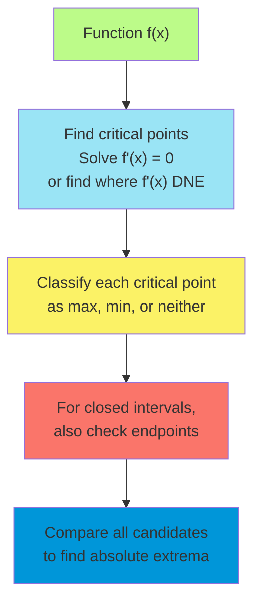
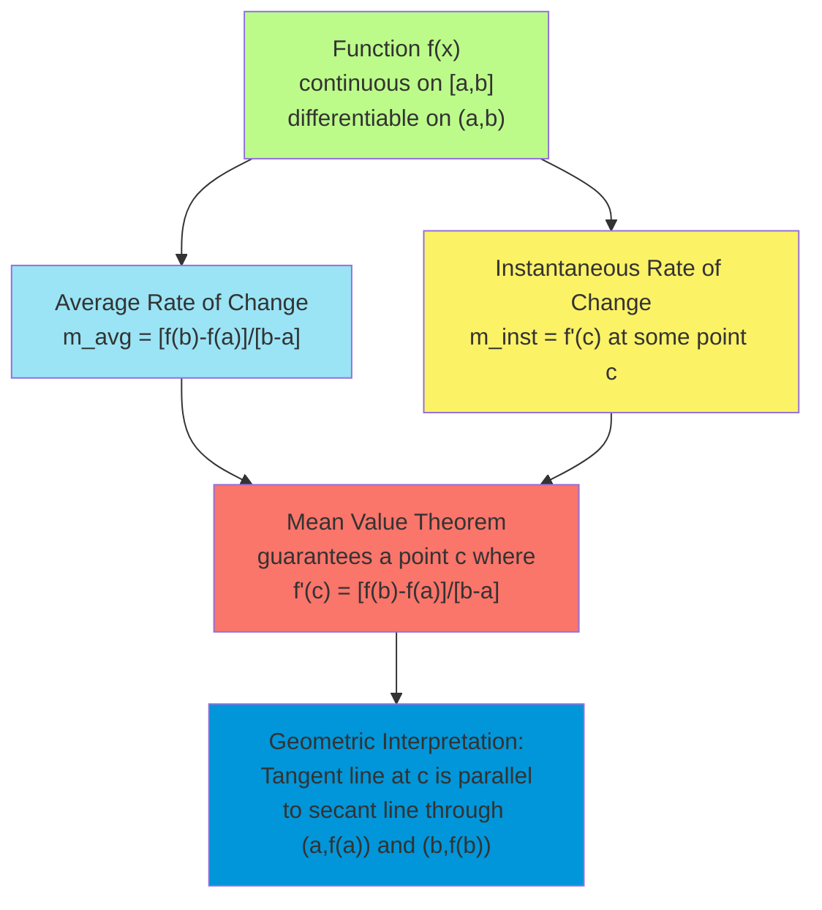
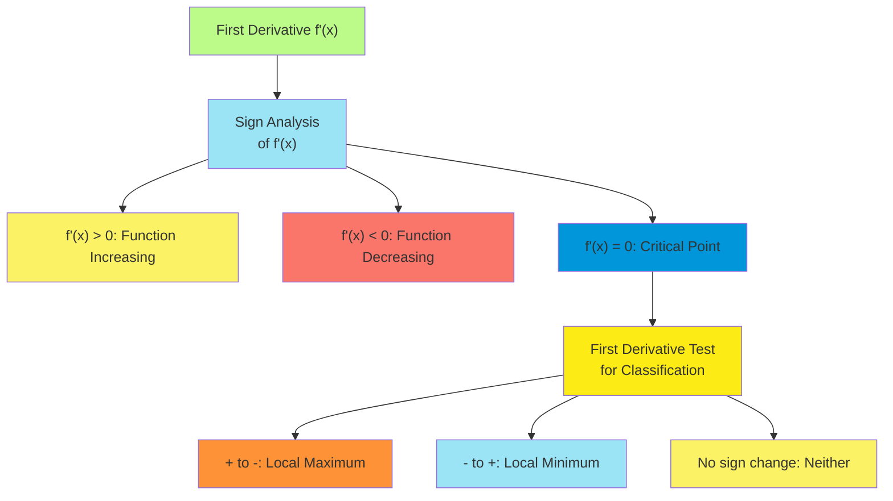
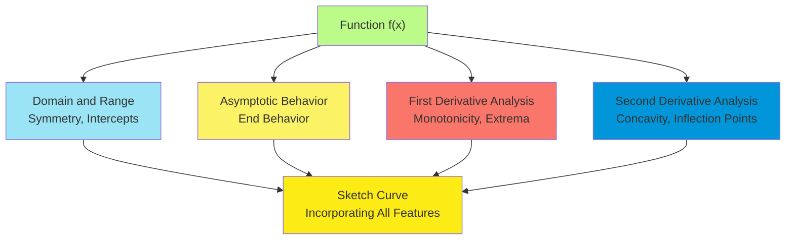
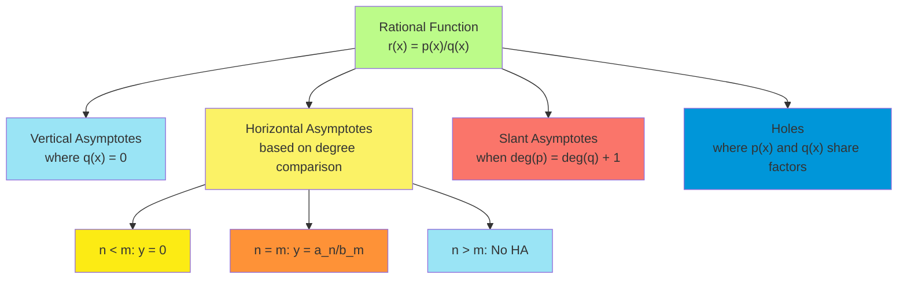
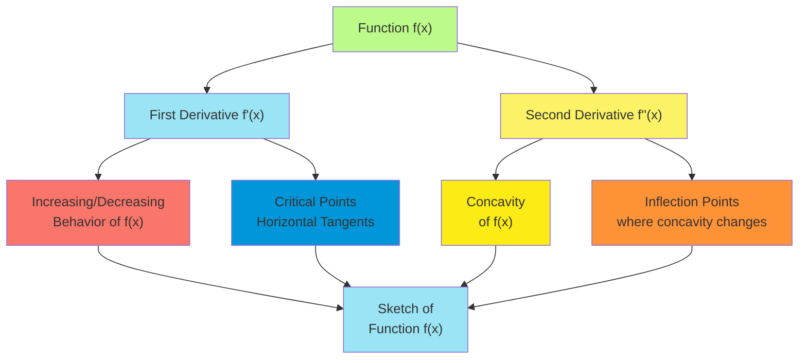
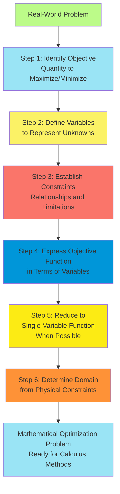
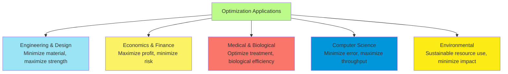
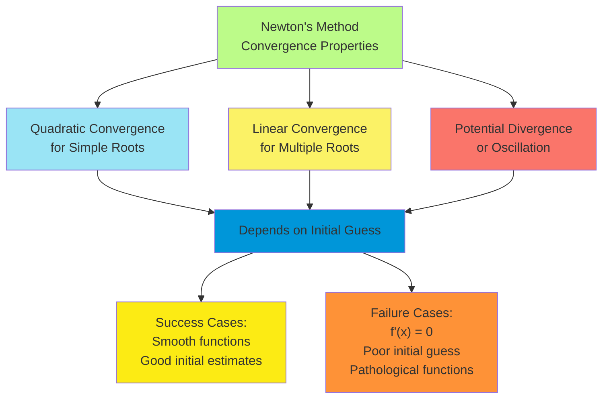
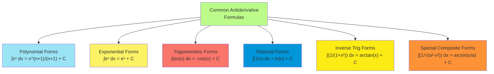

# C-3: Applications of Differentiation

1. Maximum and Minimum Values

    - Critical Points and Extrema Classification
    - First and Second Derivative Tests
    - Absolute vs. Relative Extrema
    - Practical Optimization Problem-Solving Framework

2. The Mean Value Theorem

    - Theorem Statement and Geometric Interpretation
    - Rolle's Theorem as a Special Case
    - Applications and Consequences
    - Theoretical Importance in Calculus

3. How Derivatives Affect the Shape of a Graph

    - Monotonicity and First Derivative Test
    - Concavity and Second Derivative Test
    - Inflection Points and Curve Behavior
    - Complete Curve Sketching Methodology

4. Limits at Infinity; Horizontal Asymptotes

    - End Behavior of Functions
    - Techniques for Computing Infinite Limits
    - Rational Functions and Their Asymptotic Properties
    - Transcendental Functions and Their Limiting Behavior

5. Summary of Curve Sketching

    - Comprehensive Strategy for Graph Analysis
    - Integration of Derivative Information
    - Identifying Key Features (Extrema, Inflection, Asymptotes)
    - Visual Representation Techniques

6. Graphing with Calculus and Calculators

    - Technology-Enhanced Visualization Methods
    - Numerical Approaches to Derivative Analysis
    - Error Detection and Verification Strategies
    - Advanced Graphing Techniques

7. Optimization Problems

    - Mathematical Modeling for Real-World Scenarios
    - Constraint Identification and Problem Formulation
    - Objective Function Analysis
    - Practical Applications in Various Fields

8. Newton's Method

    - Iterative Algorithm for Finding Roots
    - Convergence Properties and Limitations
    - Error Analysis and Approximation
    - Applications in Equation Solving

9. Antiderivatives
    - Definition and Basic Properties
    - Common Antiderivative Formulas
    - Initial Value Problems
    - Introduction to Integration Concept

#### Maximum and Minimum Values

Understanding extrema—the maximum and minimum values of functions—is fundamental to calculus applications in
optimization, modeling physical systems, and analyzing function behavior. These concepts form the mathematical
foundation for solving a wide range of practical problems.

##### Critical Points and Extrema Classification

Critical points are inputs where a function's derivative equals zero or fails to exist, making them candidates for
extrema. Formally, $c$ is a critical point of a function $f$ if either:

1. $f'(c) = 0$ (horizontal tangent line), or
2. $f'(c)$ does not exist (non-differentiable point)

Critical points serve as the starting point for identifying extrema, which come in several types:

- **Local maximum**: $f(c)$ is a local maximum if there exists an open interval $(a,b)$ containing $c$ such that
  $f(c) \geq f(x)$ for all $x$ in $(a,b)$.
- **Local minimum**: $f(c)$ is a local minimum if there exists an open interval $(a,b)$ containing $c$ such that
  $f(c) \leq f(x)$ for all $x$ in $(a,b)$.
- **Global (absolute) maximum/minimum**: $f(c)$ is an absolute maximum (minimum) if $f(c) \geq f(x)$ (or
  $f(c) \leq f(x)$) for all $x$ in the domain of $f$.

Examples of critical points include:

1. For $f(x) = x^3 - 3x + 2$:
    - $f'(x) = 3x^2 - 3$
    - Setting $f'(x) = 0$: $3x^2 - 3 = 0$
    - Solving: $x^2 = 1$, so $x = \pm 1$
    - Critical points: $x = 1$ and $x = -1$
2. For $f(x) = |x-3|$:
    - $f'(x) = 1$ for $x > 3$
    - $f'(x) = -1$ for $x < 3$
    - $f'(3)$ does not exist (non-differentiable point)
    - Critical point: $x = 3$

Not all critical points are extrema, and not all extrema are critical points (if they occur at endpoints of a closed
domain). Classification requires further analysis using derivative tests.

##### First and Second Derivative Tests

The first and second derivative tests provide systematic methods for classifying critical points:

**First Derivative Test**: Let $c$ be a critical point of a continuous function $f$.

1. If $f'(x)$ changes from positive to negative at $x = c$, then $f(c)$ is a local maximum.
2. If $f'(x)$ changes from negative to positive at $x = c$, then $f(c)$ is a local minimum.
3. If $f'(x)$ doesn't change sign at $x = c$ (same sign on both sides), then $f(c)$ is neither a local maximum nor a
   local minimum (possibly an inflection point).

Example: For $f(x) = x^3 - 3x + 2$, we found critical points at $x = -1$ and $x = 1$.

- At $x = -1$: $f'(x)$ changes from negative to positive, so $f(-1) = -2$ is a local minimum.
- At $x = 1$: $f'(x)$ changes from positive to negative, so $f(1) = 0$ is a local maximum.

**Second Derivative Test**: Let $c$ be a critical point of a function $f$ with $f'(c) = 0$ and $f''(c)$ exists.

1. If $f''(c) < 0$, then $f(c)$ is a local maximum.
2. If $f''(c) > 0$, then $f(c)$ is a local minimum.
3. If $f''(c) = 0$, the test is inconclusive (must use the first derivative test).

Example: For $f(x) = x^3 - 3x + 2$:

- $f'(x) = 3x^2 - 3$
- $f''(x) = 6x$
- At $x = -1$: $f''(-1) = -6 < 0$, confirming $f(-1)$ is a local maximum.
- At $x = 1$: $f''(1) = 6 > 0$, confirming $f(1)$ is a local minimum.

The second derivative test is often more convenient when the second derivative is easily computed, but it doesn't always
yield a conclusive result.

##### Absolute vs. Relative Extrema

The distinction between absolute (global) and relative (local) extrema is crucial in optimization problems:

- **Relative extrema** are points where the function value is either higher or lower than at nearby points.
- **Absolute extrema** are the highest and lowest values the function attains over its entire domain.

For a continuous function on a closed, bounded interval $[a,b]$, the Extreme Value Theorem guarantees that both an
absolute maximum and an absolute minimum exist. To find these values:

1. Identify all critical points in $(a,b)$
2. Evaluate the function at these critical points
3. Evaluate the function at the endpoints $a$ and $b$
4. Compare all these values to determine the absolute maximum and minimum

Example: Find the absolute extrema of $f(x) = x^3 - 3x + 2$ on $[-2,2]$.

Critical points: $x = -1$ and $x = 1$

- $f(-2) = -8 - (-6) + 2 = 0$
- $f(-1) = -1 - (-3) + 2 = 4$
- $f(1) = 1 - 3 + 2 = 0$
- $f(2) = 8 - 6 + 2 = 4$

Comparing these values:

- Absolute maximum: $f(-1) = f(2) = 4$ (occurs at two points)
- Absolute minimum: $f(-2) = f(1) = 0$ (occurs at two points)

For unbounded domains or non-continuous functions, absolute extrema might not exist. For instance, $f(x) = x^2$ on
$\mathbb{R}$ has no absolute maximum, while $f(x) = 1/x$ on $(0,\infty)$ has no absolute minimum.

##### Practical Optimization Problem-Solving Framework

Real-world optimization problems follow a systematic approach:

1. **Understand the problem**:
    - Identify what quantity needs to be maximized or minimized
    - Determine constraints and variable ranges
    - Translate physical descriptions into mathematical relationships
2. **Formulate the objective function**:
    - Express the quantity to be optimized in terms of one variable
    - Use constraints to eliminate extra variables
    - Determine the domain based on physical constraints
3. **Find critical points**:
    - Compute the derivative of the objective function
    - Solve the equation $f'(x) = 0$
    - Check for points where $f'(x)$ doesn't exist
    - Verify that critical points satisfy the constraints
4. **Determine the optimal value**:
    - Use the first or second derivative test to classify critical points
    - Check endpoints of the domain if applicable
    - Select the appropriate extremum (maximum or minimum)
    - Calculate the optimal value of the objective function
5. **Interpret the result**:
    - Translate the mathematical solution back to the original context
    - Verify the solution makes physical sense
    - Report with appropriate units and precision

Example: A rectangular field of area 1000 m² is to be enclosed with fencing. Find the dimensions that minimize the
amount of fencing required.

Step 1: Let $x$ = width and $y$ = length. We need to minimize the perimeter $P = 2x + 2y$.

Step 2: From the area constraint: $xy = 1000$, so $y = 1000/x$. The perimeter function becomes:
$P(x) = 2x + 2(1000/x) = 2x + 2000/x$. Domain: $x > 0$ (physical constraint: width must be positive).

Step 3: $P'(x) = 2 - 2000/x^2$ Setting $P'(x) = 0$: $2 - 2000/x^2 = 0$ Solving: $x^2 = 1000$, so
$x = \sqrt{1000} \approx 31.62$ meters. Therefore, $y = 1000/x = 1000/31.62 \approx 31.62$ meters.

Step 4: $P''(x) = 4000/x^3 > 0$ for $x > 0$, confirming a minimum.

Step 5: The field should be a square with sides of approximately 31.62 meters to minimize the fencing required. The
minimum perimeter is approximately 126.5 meters.

This systematic framework applies to diverse optimization problems in engineering, economics, and science, from
maximizing profit to minimizing material costs or travel time.

#### The Mean Value Theorem

The Mean Value Theorem (MVT) is a foundational result in calculus that connects the average rate of change of a function
over an interval to its instantaneous rate of change at some point within that interval.

##### Theorem Statement and Geometric Interpretation

**Mean Value Theorem (MVT)**: If a function $f$ is continuous on a closed interval $[a,b]$ and differentiable on the
open interval $(a,b)$, then there exists at least one point $c$ in $(a,b)$ such that:

$$f'(c) = \frac{f(b) - f(a)}{b - a}$$

Geometric interpretation: The MVT states that somewhere on a smooth curve, there must be a point where the tangent line
is parallel to the secant line connecting the endpoints of the interval. In other words, at some point, the
instantaneous rate of change equals the average rate of change over the entire interval.

The right side of the equation, $\frac{f(b) - f(a)}{b - a}$, represents the slope of the secant line from $(a, f(a))$ to
$(b, f(b))$. The left side, $f'(c)$, represents the slope of the tangent line at the point $(c, f(c))$.

Example: For $f(x) = x^2$ on $[1,3]$:

- Average rate of change: $\frac{f(3) - f(1)}{3 - 1} = \frac{9 - 1}{2} = 4$
- Derivative: $f'(x) = 2x$
- Setting $f'(c) = 4$: $2c = 4$, so $c = 2$
- Indeed, at $x = 2$, the tangent line has slope 4, matching the average rate of change over $[1,3]$

While the theorem guarantees the existence of at least one such point $c$, there may be multiple points that satisfy the
conclusion, particularly for oscillating functions.

##### Rolle's Theorem as a Special Case

Rolle's Theorem is a special case of the Mean Value Theorem where $f(a) = f(b)$, meaning the function values at the
endpoints are equal.

**Rolle's Theorem**: If a function $f$ is continuous on a closed interval $[a,b]$, differentiable on the open interval
$(a,b)$, and $f(a) = f(b)$, then there exists at least one point $c$ in $(a,b)$ such that $f'(c) = 0$.

Geometric interpretation: If a smooth curve starts and ends at the same height, then somewhere between those points,
there must be a horizontal tangent line (a point where the slope is zero).

When $f(a) = f(b)$, the secant line has slope zero, so the MVT guarantees a point where the tangent line also has slope
zero.

Example: For $f(x) = x^3 - 3x$ on $[-1,1]$:

- $f(-1) = -1 - (-3) = 2$
- $f(1) = 1 - 3 = -2$
- The endpoints don't have equal values, so Rolle's Theorem doesn't apply.

Example: For $f(x) = x^3 - 3x + 2$ on $[-\sqrt{3}, \sqrt{3}]$:

- $f(-\sqrt{3}) = -3\sqrt{3} - (-3\sqrt{3}) + 2 = 2$
- $f(\sqrt{3}) = 3\sqrt{3} - 3\sqrt{3} + 2 = 2$
- The function equals 2 at both endpoints, so Rolle's Theorem applies.
- $f'(x) = 3x^2 - 3$
- Setting $f'(x) = 0$: $3x^2 - 3 = 0$, so $x^2 = 1$, giving $x = \pm 1$
- Indeed, $f'(1) = f'(-1) = 0$, confirming Rolle's Theorem.

Rolle's Theorem can be used to prove the MVT by applying it to an auxiliary function, and it provides a powerful tool
for analyzing the behavior of functions.

##### Applications and Consequences

The Mean Value Theorem yields several important results and applications:

1. **Constant Function Theorem**: If $f'(x) = 0$ for all $x$ in an interval $(a,b)$, then $f$ is constant on $[a,b]$.

    Proof: For any two points $x_1$ and $x_2$ in $[a,b]$, apply the MVT: $f'(c) = \frac{f(x_2) - f(x_1)}{x_2 - x_1}$
    Since $f'(c) = 0$, we have $f(x_2) = f(x_1)$.

2. **Increasing/Decreasing Function Test**:

    - If $f'(x) > 0$ for all $x$ in an interval $(a,b)$, then $f$ is strictly increasing on $[a,b]$.
    - If $f'(x) < 0$ for all $x$ in an interval $(a,b)$, then $f$ is strictly decreasing on $[a,b]$.

    Proof: For any $x_1 < x_2$ in $[a,b]$, the MVT gives: $f'(c) = \frac{f(x_2) - f(x_1)}{x_2 - x_1}$ If $f'(c) > 0$,
    then $f(x_2) > f(x_1)$, making $f$ increasing.

3. **Equal Functions Theorem**: If $f'(x) = g'(x)$ for all $x$ in an interval $(a,b)$, then $f(x) = g(x) + C$ for some
   constant $C$.

    Proof: Apply the constant function theorem to $h(x) = f(x) - g(x)$.

4. **Caratheodory's Theorem** (generalization of MVT): If $f$ is differentiable at $c$, then there exists a function
   $\phi$ such that: $f(x) - f(c) = (x - c)\phi(x)$ where $\phi$ is continuous at $c$ and $\phi(c) = f'(c)$.

5. **Physical Applications**:

    - Motion analysis: If an object travels 120 miles in 2 hours, then at some moment, its instantaneous speed was
      exactly 60 mph.
    - Average value: The instantaneous rate of a continuous process must achieve its average value at least once.

6. **Extension to Vector-Valued Functions** (Mean Value Inequality): For a vector-valued function
   $\mathbf{f}: [a,b] \to \mathbb{R}^n$:
   $|\mathbf{f}(b) - \mathbf{f}(a)| \leq (b-a) \sup_{a \leq t \leq b} |\mathbf{f}'(t)|$

These applications demonstrate the MVT's fundamental role in understanding function behavior and developing more
advanced concepts in calculus.

##### Theoretical Importance in Calculus

The Mean Value Theorem occupies a central position in the theoretical framework of calculus:

1. **Foundation for the Fundamental Theorem of Calculus**: The MVT is essential in proving that differentiation and
   integration are inverse operations. It establishes that if $F$ is an antiderivative of $f$, then:
   $\int_a^b f(x) , dx = F(b) - F(a)$
2. **Bridge Between Local and Global Properties**: The MVT connects local behavior (the derivative at a point) with
   global behavior (the change in function value over an interval), bridging differential and integral calculus.
3. **Central to Convergence Proofs**: Many convergence proofs in calculus, including those for Taylor series and
   numerical methods, rely on the MVT to establish error bounds and convergence rates.
4. **Theoretical Basis for L'Hôpital's Rule**: The MVT underlies the proof of L'Hôpital's Rule, which is used to
   evaluate limits of indeterminate forms.
5. **Extension to Taylor's Theorem**: The MVT is generalized to Taylor's Theorem with the remainder term, which
   approximates functions using polynomials with precise error bounds.
6. **Development of Differential Equations**: The existence and uniqueness theorems for differential equations often
   rely on the MVT and its extensions.
7. **Connection to the Intermediate Value Theorem**: Together with the Intermediate Value Theorem, the MVT forms the
   foundation for analyzing continuous functions on intervals.
8. **Basis for Numerical Analysis**: The error analysis of numerical techniques such as interpolation, numerical
   integration, and numerical solution of differential equations often employs the MVT.

The MVT represents a profound insight into the nature of continuous and differentiable functions, establishing that such
functions cannot change their values without changing their derivatives correspondingly. This principle pervades
calculus and connects it to real-world applications where rates of change must be analyzed and understood.

#### How Derivatives Affect the Shape of a Graph

Derivatives provide crucial information about the shape and behavior of a function's graph, enabling us to understand
qualitative features without plotting every point.

##### Monotonicity and First Derivative Test

The sign of the first derivative determines whether a function is increasing, decreasing, or constant:

1. **Monotonicity Criteria**:

    - If $f'(x) > 0$ for all $x$ in an interval $I$, then $f$ is strictly increasing on $I$.
    - If $f'(x) < 0$ for all $x$ in an interval $I$, then $f$ is strictly decreasing on $I$.
    - If $f'(x) = 0$ for all $x$ in an interval $I$, then $f$ is constant on $I$.

    These criteria follow directly from the Mean Value Theorem.

2. **Critical Points and Sign Changes**: Critical points often mark the boundaries between intervals where $f$ is
   increasing and decreasing. To analyze monotonicity:

    - Find all critical points and points where $f'$ is undefined.
    - Determine the sign of $f'(x)$ in each resulting interval.
    - Classify the function as increasing or decreasing in each interval.

3. **First Derivative Test for Extrema**: For a critical point $c$:

    - If $f'(x)$ changes from positive to negative at $x = c$, then $f(c)$ is a local maximum.
    - If $f'(x)$ changes from negative to positive at $x = c$, then $f(c)$ is a local minimum.
    - If $f'(x)$ maintains the same sign on both sides of $x = c$, then $f(c)$ is neither a local maximum nor a local
      minimum.

Example: Analyze the monotonicity of $f(x) = x^3 - 3x^2 + 2$.

Step 1: Find the critical points. $f'(x) = 3x^2 - 6x = 3x(x - 2)$ Setting $f'(x) = 0$: $x = 0$ or $x = 2$

Step 2: Determine the sign of $f'(x)$ in each interval.

- For $x < 0$: $f'(x) > 0$ (increasing)
- For $0 < x < 2$: $f'(x) < 0$ (decreasing)
- For $x > 2$: $f'(x) > 0$ (increasing)

Step 3: Classify the critical points.

- At $x = 0$: $f'(x)$ changes from positive to negative, so $f(0) = 2$ is a local maximum.
- At $x = 2$: $f'(x)$ changes from negative to positive, so $f(2) = -2$ is a local minimum.

The monotonicity analysis provides a qualitative understanding of how the function rises and falls across its domain.

##### Concavity and Second Derivative Test

The second derivative reveals how the slope of a function changes, determining whether the graph curves upward (concave
up) or downward (concave down):

1. **Concavity Criteria**:

    - If $f''(x) > 0$ for all $x$ in an interval $I$, then $f$ is concave up (convex) on $I$.
    - If $f''(x) < 0$ for all $x$ in an interval $I$, then $f$ is concave down (concave) on $I$.

    Geometrically:

    - Concave up: Graph lies above its tangent lines
    - Concave down: Graph lies below its tangent lines

2. **Inflection Points**: An inflection point occurs where the concavity changes. It's a point where:

    - $f''(c) = 0$ or $f''(c)$ is undefined, and
    - $f''(x)$ changes sign at $x = c$

    Note: Not all points where $f''(x) = 0$ are inflection points; the concavity must actually change.

3. **Second Derivative Test for Extrema**: For a critical point $c$ with $f'(c) = 0$:

    - If $f''(c) > 0$, then $f(c)$ is a local minimum.
    - If $f''(c) < 0$, then $f(c)$ is a local maximum.
    - If $f''(c) = 0$, the test is inconclusive (use the first derivative test).

    This test provides a more direct method for classifying critical points when the second derivative is readily
    available.

Example: Analyze the concavity of $f(x) = x^4 - 4x^3 + 6$.

Step 1: Find the second derivative. $f'(x) = 4x^3 - 12x^2$ $f''(x) = 12x^2 - 24x = 12x(x - 2)$

Step 2: Find potential inflection points by solving $f''(x) = 0$. $12x(x - 2) = 0$ gives $x = 0$ or $x = 2$

Step 3: Determine the sign of $f''(x)$ in each interval.

- For $x < 0$: $f''(x) < 0$ (concave down)
- For $0 < x < 2$: $f''(x) < 0$ (concave down)
- For $x > 2$: $f''(x) > 0$ (concave up)

Step 4: Identify inflection points.

- At $x = 0$: $f''(x)$ doesn't change sign, so not an inflection point.
- At $x = 2$: $f''(x)$ changes from negative to positive, so $(2, f(2)) = (2, -10)$ is an inflection point.

This concavity analysis reveals how the curve bends across its domain, complementing the monotonicity analysis to
provide a more complete understanding of the function's behavior.

##### Inflection Points and Curve Behavior

Inflection points mark significant changes in a curve's behavior where the concavity shifts:

1. **Mathematical Definition**: A point $(c, f(c))$ is an inflection point if $f$ is continuous at $c$ and the concavity
   changes at $c$.
2. **Analytical Determination**:
    - Find points where $f''(x) = 0$ or $f''(x)$ is undefined.
    - Check if $f''(x)$ changes sign across these points.
    - Only points where the sign changes are inflection points.
3. **Geometric Significance**:
    - At an inflection point, the tangent line crosses the curve.
    - The curve changes from bending upward to bending downward, or vice versa.
    - The rate of change of the slope ($f''$) is zero momentarily.
4. **Relationship to Extrema of the Derivative**:
    - Inflection points of $f(x)$ correspond to local extrema of $f'(x)$.
    - If $(c, f(c))$ is an inflection point, then $(c, f'(c))$ is often a local maximum or minimum of $f'$.
5. **Applications**:
    - In economics: Inflection points in cost or profit functions indicate where the rate of change shifts.
    - In physics: Inflection points in position functions indicate where acceleration changes direction.
    - In statistics: The inflection points of a normal distribution occur at one standard deviation from the mean.

Example: Analyze the inflection points of $f(x) = x^4 - 6x^2$.

Step 1: Find the second derivative. $f'(x) = 4x^3 - 12x$ $f''(x) = 12x^2 - 12 = 12(x^2 - 1)$

Step 2: Solve $f''(x) = 0$. $12(x^2 - 1) = 0$ gives $x = \pm 1$

Step 3: Check the sign of $f''(x)$ in each interval.

- For $x < -1$: $f''(x) > 0$ (concave up)
- For $-1 < x < 1$: $f''(x) < 0$ (concave down)
- For $x > 1$: $f''(x) > 0$ (concave up)

Step 4: Confirm the inflection points.

- At $x = -1$: $f''(x)$ changes from positive to negative, so $(-1, f(-1)) = (-1, -5)$ is an inflection point.
- At $x = 1$: $f''(x)$ changes from negative to positive, so $(1, f(1)) = (1, -5)$ is an inflection point.

Understanding inflection points provides insight into where a function's curvature changes, complementing information
about increasing/decreasing behavior and extrema.

##### Complete Curve Sketching Methodology

A comprehensive approach to curve sketching integrates all derivative information to produce a qualitatively accurate
graph:

1. **Domain and Range Analysis**:
    - Determine the domain of the function.
    - Identify any vertical asymptotes where the function is undefined.
    - Consider restrictions on the range if apparent.
2. **Symmetry Check**:
    - Even function: $f(-x) = f(x)$ (symmetric about y-axis)
    - Odd function: $f(-x) = -f(x)$ (symmetric about origin)
    - Periodic function: $f(x + p) = f(x)$ for some period $p$
3. **Intercepts**:
    - x-intercepts: Solve $f(x) = 0$
    - y-intercept: Evaluate $f(0)$ if 0 is in the domain
4. **Asymptotic Behavior**:
    - Horizontal asymptotes: Evaluate $\lim_{x \to \pm\infty} f(x)$
    - Vertical asymptotes: Locate points where $\lim_{x \to c} f(x) = \pm\infty$
    - Slant asymptotes: If $\lim_{x \to \infty} [f(x) - (mx + b)] = 0$, then $y = mx + b$ is a slant asymptote
5. **First Derivative Analysis**:
    - Find critical points where $f'(x) = 0$ or $f'(x)$ is undefined.
    - Determine where $f$ is increasing or decreasing.
    - Classify critical points as local maxima, local minima, or neither.
6. **Second Derivative Analysis**:
    - Find points where $f''(x) = 0$ or $f''(x)$ is undefined.
    - Determine intervals of concavity (concave up or concave down).
    - Identify inflection points where concavity changes.
7. **Special Features**:
    - Cusps: Points where the derivative changes sign and is undefined
    - Corners: Points where left and right derivatives exist but are unequal
    - Self-intersections: Points where the function crosses itself
8. **Sketch Assembly**:
    - Plot key points (intercepts, extrema, inflection points).
    - Indicate asymptotes with dashed lines.
    - Connect points with curves that respect the monotonicity and concavity.
    - Verify the sketch against the original function if possible.

Example: Sketch the curve $f(x) = \frac{x^2}{x-1}$.

Step 1: Domain analysis

- Domain: All real numbers except $x = 1$ (vertical asymptote)

Step 2: Symmetry check

- Not symmetric about the y-axis or origin

Step 3: Intercepts

- y-intercept: $f(0) = \frac{0^2}{0-1} = 0$
- x-intercept: $f(x) = 0$ when $x^2 = 0$, so $x = 0$

Step 4: Asymptotic behavior

- Vertical asymptote at $x = 1$
- As $x \to \pm\infty$: $f(x) = \frac{x^2}{x-1} \approx \frac{x^2}{x} = x$ for large $|x|$
- Slant asymptote: $y = x + 1$ (dividing $x^2$ by $x-1$ gives $x + 1 + \frac{1}{x-1}$)

Step 5: First derivative analysis
$f'(x) = \frac{(x-1) \cdot 2x - x^2 \cdot 1}{(x-1)^2} = \frac{2x^2-2x-x^2}{(x-1)^2} = \frac{x^2-2x}{(x-1)^2} = \frac{x(x-2)}{(x-1)^2}$

Critical points: $f'(x) = 0$ when $x = 0$ or $x = 2$

- For $x < 0$: $f'(x) < 0$ (decreasing)
- For $0 < x < 1$: $f'(x) < 0$ (decreasing)
- For $1 < x < 2$: $f'(x) < 0$ (decreasing)
- For $x > 2$: $f'(x) > 0$ (increasing)

Step 6: Second derivative analysis $f''(x) = \frac{d}{dx}\left[\frac{x(x-2)}{(x-1)^2}\right]$ (detailed calculation
omitted) $f''(x) = \frac{2(x-2)}{(x-1)^3}$

Setting $f''(x) = 0$: $x = 2$

- For $x < 1$: $f''(x) > 0$ (concave up)
- For $1 < x < 2$: $f''(x) < 0$ (concave down)
- For $x > 2$: $f''(x) > 0$ (concave up)

Inflection point at $(2, f(2)) = (2, 4)$

Step 7: Sketch the curve with all these features

- The function decreases from $x = -\infty$ to $x = 2$, then increases
- It has a local minimum at $(2, 4)$
- It has a vertical asymptote at $x = 1$
- It approaches the slant asymptote $y = x + 1$ as $x \to \pm\infty$
- It's concave up for $x < 1$ and $x > 2$, concave down for $1 < x < 2$

This methodology provides a systematic approach to sketching curves accurately, capturing all important qualitative
features without plotting numerous points.

#### Limits at Infinity; Horizontal Asymptotes

Understanding how functions behave as the independent variable approaches infinity provides insights into long-term
trends and asymptotic behavior.

##### End Behavior of Functions

The end behavior of a function describes how function values change as $x$ approaches positive or negative infinity:

1. **Formal Definition**: The end behavior is characterized by the limits:
    - $\lim_{x \to \infty} f(x)$: Behavior as $x$ increases without bound
    - $\lim_{x \to -\infty} f(x)$: Behavior as $x$ decreases without bound
2. **Classification of End Behaviors**:
    - Bounded: Function values remain within a finite range as $x \to \pm\infty$
    - Unbounded: Function values grow without bound as $x \to \pm\infty$
    - Convergent: Function approaches a specific value as $x \to \pm\infty$
    - Oscillatory: Function continues to oscillate as $x \to \pm\infty$
3. **Dominant Terms**: For polynomial and rational functions, the term with the highest power typically dominates the
   end behavior:
    - For polynomials $p(x) = a_n x^n + a_{n-1} x^{n-1} + \ldots + a_1 x + a_0$:
        - If $n$ is even and $a_n > 0$: $\lim_{x \to \pm\infty} p(x) = \infty$
        - If $n$ is even and $a_n < 0$: $\lim_{x \to \pm\infty} p(x) = -\infty$
        - If $n$ is odd and $a_n > 0$: $\lim_{x \to \infty} p(x) = \infty$ and $\lim_{x \to -\infty} p(x) = -\infty$
        - If $n$ is odd and $a_n < 0$: $\lim_{x \to \infty} p(x) = -\infty$ and $\lim_{x \to -\infty} p(x) = \infty$
    - For rational functions $r(x) = \frac{p(x)}{q(x)}$ with leading terms $\frac{a_n x^n}{b_m x^m}$:
        - If $n < m$: $\lim_{x \to \pm\infty} r(x) = 0$ (horizontal asymptote at $y = 0$)
        - If $n = m$: $\lim_{x \to \pm\infty} r(x) = \frac{a_n}{b_m}$ (horizontal asymptote at $y = \frac{a_n}{b_m}$)
        - If $n > m$: $\lim_{x \to \pm\infty} r(x) = \pm\infty$ (no horizontal asymptote)
4. **Graphical Interpretation**: End behavior determines how the graph "ends" as it extends far to the right or left,
   influencing sketching and qualitative analysis.

Example: Analyze the end behavior of $f(x) = \frac{2x^3 - x + 5}{3x^3 + 2x - 1}$.

The highest power in both numerator and denominator is $x^3$, so:
$\lim_{x \to \pm\infty} f(x) = \lim_{x \to \pm\infty} \frac{2x^3 - x + 5}{3x^3 + 2x - 1} = \lim_{x \to \pm\infty} \frac{2x^3(1 - \frac{x}{2x^3} + \frac{5}{2x^3})}{3x^3(1 + \frac{2x}{3x^3} - \frac{1}{3x^3})} = \lim_{x \to \pm\infty} \frac{2(1 - \frac{1}{2x^2} + \frac{5}{2x^3})}{3(1 + \frac{2}{3x^2} - \frac{1}{3x^3})} = \frac{2}{3}$

The function approaches the horizontal asymptote $y = \frac{2}{3}$ as $x \to \pm\infty$.

Understanding end behavior helps predict how a function acts in extreme cases, which is valuable in modeling physical,
economic, and biological systems.

##### Techniques for Computing Infinite Limits

Several techniques help evaluate limits as $x$ approaches infinity:

1. **Algebraic Manipulation**:

    - Divide numerator and denominator by the highest power of $x$ present
    - Factor out dominant terms
    - Use algebraic identities to simplify expressions

    Example: For $\lim_{x \to \infty} \frac{3x^2 + 2x - 1}{5x^2 - 7}$

    Dividing by $x^2$:
    $\lim_{x \to \infty} \frac{3 + \frac{2}{x} - \frac{1}{x^2}}{5 - \frac{7}{x^2}} = \frac{3 + 0 - 0}{5 - 0} = \frac{3}{5}$

2. **L'Hôpital's Rule for Indeterminate Forms**: For limits of the form $\frac{\infty}{\infty}$ or $\frac{0}{0}$:
   $\lim_{x \to \infty} \frac{f(x)}{g(x)} = \lim_{x \to \infty} \frac{f'(x)}{g'(x)}$ (provided the latter limit exists)

    Example: For $\lim_{x \to \infty} \frac{x}{\ln(x)}$

    This is an $\frac{\infty}{\infty}$ form, so:
    $\lim_{x \to \infty} \frac{x}{\ln(x)} = \lim_{x \to \infty} \frac{1}{\frac{1}{x}} = \lim_{x \to \infty} x = \infty$

3. **Substitution for Simplification**: Using substitution $t = \frac{1}{x}$ transforms the problem to evaluating a
   limit as $t \to 0$

    Example: For $\lim_{x \to \infty} (1 + \frac{1}{x})^x$

    Let $t = \frac{1}{x}$, so as $x \to \infty$, $t \to 0^+$:
    $\lim_{x \to \infty} (1 + \frac{1}{x})^x = \lim_{t \to 0^+} (1 + t)^{1/t} = e$

4. **Squeezing/Sandwich Theorem**: If $g(x) \leq f(x) \leq h(x)$ for all $x$ beyond some point, and
   $\lim_{x \to \infty} g(x) = \lim_{x \to \infty} h(x) = L$, then $\lim_{x \to \infty} f(x) = L$

    Example: For $\lim_{x \to \infty} \frac{\sin(x)}{x}$

    Since $-1 \leq \sin(x) \leq 1$ for all $x$: $-\frac{1}{x} \leq \frac{\sin(x)}{x} \leq \frac{1}{x}$

    As $x \to \infty$, both $-\frac{1}{x}$ and $\frac{1}{x}$ approach 0, so: $\lim_{x \to \infty} \frac{\sin(x)}{x} = 0$

5. **Series Expansions**: Using Taylor or asymptotic series to approximate functions for large values of $x$

    Example: For $\lim_{x \to \infty} x^2(e^{1/x} - 1)$

    Using the expansion $e^y = 1 + y + \frac{y^2}{2} + O(y^3)$ with $y = \frac{1}{x}$:
    $\lim_{x \to \infty} x^2(e^{1/x} - 1) = \lim_{x \to \infty} x^2(1 + \frac{1}{x} + \frac{1}{2x^2} + O(\frac{1}{x^3}) - 1) = \lim_{x \to \infty} (x + \frac{1}{2} + O(\frac{1}{x})) = \infty$

These techniques provide a systematic approach to evaluating infinite limits, which are essential for understanding
asymptotic behavior and end behavior of functions.

##### Rational Functions and Their Asymptotic Properties

Rational functions exhibit characteristic asymptotic behaviors that depend on the relationship between the degrees of
their numerator and denominator polynomials:

1. **Horizontal Asymptotes**: For a rational function
   $r(x) = \frac{p(x)}{q(x)} = \frac{a_n x^n + a_{n-1} x^{n-1} + \ldots + a_0}{b_m x^m + b_{m-1} x^{m-1} + \ldots + b_0}$:

    - If $n < m$: $\lim_{x \to \pm\infty} r(x) = 0$ (horizontal asymptote at $y = 0$)
    - If $n = m$: $\lim_{x \to \pm\infty} r(x) = \frac{a_n}{b_m}$ (horizontal asymptote at $y = \frac{a_n}{b_m}$)
    - If $n > m$: No horizontal asymptote

    Example: $r(x) = \frac{2x^2+1}{3x^2-4}$ has horizontal asymptote $y = \frac{2}{3}$ since the degrees are equal.

2. **Vertical Asymptotes**: Occur at values $c$ where $q(c) = 0$ and $p(c) \neq 0$

    Example: $r(x) = \frac{x+1}{x-2}$ has a vertical asymptote at $x = 2$

3. **Slant (Oblique) Asymptotes**: When $n = m + 1$, the function approaches a slant asymptote $y = ax + b$

    To find the slant asymptote, divide $p(x)$ by $q(x)$ using polynomial long division:
    $\frac{p(x)}{q(x)} = (ax + b) + \frac{r(x)}{q(x)}$

    Example: $r(x) = \frac{x^2+1}{x+1}$

    Dividing: $\frac{x^2+1}{x+1} = x - 1 + \frac{2}{x+1}$

    The slant asymptote is $y = x - 1$

4. **Hole Discontinuities**: Occur at values $c$ where both $p(c) = 0$ and $q(c) = 0$ (common factor)

    Example: $r(x) = \frac{x^2-4}{x-2} = \frac{(x-2)(x+2)}{x-2} = x+2$ for $x \neq 2$

    The function has a hole at $x = 2$ but can be simplified to $r(x) = x+2$ for all other values.

5. **Asymptotic Expansion**: For deeper analysis, rational functions can be expanded as a series in descending powers of
   $x$:

    Example: $\frac{x^2+3x+2}{x-1} = x + 4 + \frac{6}{x-1}$

    This shows that as $x \to \infty$, the function behaves like $x + 4$ with a correction term that diminishes.

Understanding these asymptotic properties provides valuable insights for sketching rational functions and analyzing
their behavior, particularly at extreme values of the independent variable.

##### Transcendental Functions and Their Limiting Behavior

Transcendental functions (non-algebraic functions) exhibit distinctive limiting behaviors as $x$ approaches infinity:

1. **Exponential Functions**:

    - $\lim_{x \to \infty} e^x = \infty$
    - $\lim_{x \to -\infty} e^x = 0$
    - $\lim_{x \to \infty} a^x = \infty$ for $a > 1$
    - $\lim_{x \to \infty} a^x = 0$ for $0 < a < 1$

    Exponential growth dominates polynomial growth: $\lim_{x \to \infty} \frac{e^x}{x^n} = \infty$ for any power $n$

2. **Logarithmic Functions**:

    - $\lim_{x \to \infty} \ln(x) = \infty$
    - $\lim_{x \to 0^+} \ln(x) = -\infty$

    Logarithmic growth is slower than polynomial growth: $\lim_{x \to \infty} \frac{\ln(x)}{x^p} = 0$ for any $p > 0$

3. **Trigonometric Functions**:

    - $\sin(x)$ and $\cos(x)$ oscillate indefinitely as $x \to \pm\infty$, so these limits don't exist
    - $\lim_{x \to \infty} \frac{\sin(x)}{x} = 0$
    - $\lim_{x \to \infty} \sin(1/x) = 0$

    For the tangent function:

    - $\tan(x)$ is periodic with period $\pi$, so $\lim_{x \to \infty} \tan(x)$ doesn't exist
    - If $x$ approaches $\frac{\pi}{2} + n\pi$, then $\lim \tan(x) = \pm\infty$

4. **Inverse Trigonometric Functions**:

    - $\lim_{x \to \infty} \arctan(x) = \frac{\pi}{2}$
    - $\lim_{x \to -\infty} \arctan(x) = -\frac{\pi}{2}$
    - $\lim_{x \to 1^-} \arcsin(x) = \frac{\pi}{2}$
    - $\lim_{x \to \infty} \arccos\left(\frac{1}{x}\right) = \frac{\pi}{2}$

5. **Hyperbolic Functions**:

    - $\lim_{x \to \infty} \sinh(x) = \infty$
    - $\lim_{x \to \infty} \cosh(x) = \infty$
    - $\lim_{x \to \infty} \tanh(x) = 1$
    - $\lim_{x \to -\infty} \tanh(x) = -1$

6. **Combinations and Compositions**:

    - $\lim_{x \to \infty} xe^{-x} = 0$
    - $\lim_{x \to \infty} x^n e^{-x} = 0$ for any power $n$
    - $\lim_{x \to \infty} \ln(x) / x = 0$
    - $\lim_{x \to \infty} x \sin(1/x) = 0$

7. **Special Limits**:

    - $\lim_{x \to \infty} (1 + \frac{1}{x})^x = e$
    - $\lim_{x \to \infty} (1 + \frac{a}{x})^x = e^a$
    - $\lim_{x \to \infty} x^{1/x} = 1$
    - $\lim_{x \to \infty} \sqrt[x]{x} = 1$

Understanding these limiting behaviors is essential for analyzing asymptotic properties of transcendental functions and
their combinations, with applications in modeling natural phenomena, engineering systems, and scientific processes.

#### Summary of Curve Sketching

Curve sketching combines all the analytical tools of differential calculus to create an accurate representation of a
function's graph without plotting numerous points.

##### Comprehensive Strategy for Graph Analysis

A systematic approach to curve sketching involves several key steps:

1. **Preliminary Analysis**:
    - **Domain**: Determine where the function is defined, identifying any restrictions or singularities.
    - **Symmetry**: Check for even symmetry $[f(-x) = f(x)]$, odd symmetry $[f(-x) = -f(x)]$, or periodicity
      $[f(x+p) = f(x)]$.
    - **Intercepts**: Find x-intercepts by solving $f(x) = 0$ and y-intercept by evaluating $f(0)$ if in the domain.
    - **Asymptotes**: Identify vertical, horizontal, and slant asymptotes.
2. **First Derivative Analysis**:
    - **Critical Points**: Find where $f'(x) = 0$ or $f'(x)$ is undefined.
    - **Intervals of Monotonicity**: Determine where $f(x)$ is increasing $[f'(x) > 0]$ or decreasing $[f'(x) < 0]$.
    - **Local Extrema**: Classify critical points as local maxima, local minima, or neither using the first or second
      derivative test.
3. **Second Derivative Analysis**:
    - **Inflection Points**: Find where $f''(x) = 0$ or $f''(x)$ is undefined and concavity changes.
    - **Intervals of Concavity**: Determine where $f(x)$ is concave up $[f''(x) > 0]$ or concave down $[f''(x) < 0]$.
    - **Feature Confirmation**: Use concavity to confirm the nature of extrema.
4. **Special Features**:
    - **Discontinuities**: Identify and classify (removable, jump, infinite, oscillatory).
    - **Cusps and Corners**: Points where derivatives fail to exist but function is continuous.
    - **Self-Intersections**: Points where the function crosses itself (parametric or implicit curves).
    - **Behavior at Endpoints**: If the domain is bounded, analyze function behavior at endpoints.
5. **Synthesis and Verification**:
    - **Key Points**: Plot intercepts, extrema, inflection points, and asymptotes.
    - **Connection**: Connect these points with curves that respect the identified monotonicity and concavity.
    - **Sanity Check**: Verify that the sketch is consistent with all analytical findings.
    - **Refinement**: Add additional points if necessary to capture the function's behavior accurately.

Example: Sketch the curve $f(x) = x^3 - 3x^2 + 2x$.

Preliminary Analysis:

- Domain: All real numbers
- Factored form: $f(x) = x(x^2 - 3x + 2) = x(x-1)(x-2)$
- x-intercepts: $x = 0$, $x = 1$, and $x = 2$
- y-intercept: $f(0) = 0$

First Derivative Analysis:

- $f'(x) = 3x^2 - 6x + 2 = 3x^2 - 6x + 2$
- Critical points: Using the quadratic formula:
  $x = \frac{6 \pm \sqrt{36-24}}{6} = \frac{6 \pm \sqrt{12}}{6} = 1 \pm \frac{\sqrt{3}}{3}$
- Increasing on: $(-\infty, 1-\frac{\sqrt{3}}{3}) \cup (1+\frac{\sqrt{3}}{3}, \infty)$
- Decreasing on: $(1-\frac{\sqrt{3}}{3}, 1+\frac{\sqrt{3}}{3})$
- Local maximum at $x = 1-\frac{\sqrt{3}}{3}$
- Local minimum at $x = 1+\frac{\sqrt{3}}{3}$

Second Derivative Analysis:

- $f''(x) = 6x - 6 = 6(x-1)$
- Inflection point at $x = 1$
- Concave down on $(-\infty, 1)$
- Concave up on $(1, \infty)$

Asymptotic Behavior:

- $\lim_{x \to \pm\infty} f(x) = \pm\infty$ (cubic end behavior)

With this information, we can sketch the curve, showing the local maximum, local minimum, inflection point at $x = 1$,
and the x-intercepts at $x = 0$, $x = 1$, and $x = 2$.

This comprehensive approach ensures that all significant features of the function are captured in the sketch.

##### Integration of Derivative Information

The integration of first and second derivative information provides a powerful framework for understanding function
behavior:

1. **Relationship Between $f$, $f'$, and $f''$**:
    - The sign of $f'$ determines whether $f$ is increasing or decreasing
    - The sign of $f''$ determines the concavity of $f$
    - Zeros of $f'$ correspond to horizontal tangents of $f$
    - Zeros of $f''$ correspond to inflection points of $f$
    - Extrema of $f'$ correspond to inflection points of $f$
    - Zeros of $f$ may not have special significance for the derivatives
2. **Graphical Relationships**:
    - Where $f'$ is positive, $f$ is increasing
    - Where $f'$ is negative, $f$ is decreasing
    - Where $f'$ has a local maximum, $f$ has an inflection point with maximum curvature
    - Where $f'$ has a local minimum, $f$ has an inflection point with minimum curvature
    - Where $f''$ changes sign, $f$ has an inflection point
3. **Analytical Connections**:
    - The Mean Value Theorem ensures that if $f$ is increasing on $[a,b]$, then $f'(c) > 0$ for some $c$ in $(a,b)$
    - Taylor's Theorem approximates $f$ near a point $a$ using derivative information:
      $f(x) \approx f(a) + f'(a)(x-a) + \frac{f''(a)}{2}(x-a)^2 + \ldots$
4. **Practical Applications**:
    - In optimization problems, $f'(x) = 0$ identifies candidate solutions
    - In curve sketching, knowing where $f'$ and $f''$ change signs helps determine the shape
    - In numerical methods, derivative information improves convergence and accuracy

Example: Consider the graphs of $f(x) = x^3 - 6x^2 + 9x + 1$, $f'(x) = 3x^2 - 12x + 9$, and $f''(x) = 6x - 12$.

- $f'(x) = 0$ when $x = 1$ or $x = 3$ (using the quadratic formula)
    - At $x = 1$: $f$ has a local minimum
    - At $x = 3$: $f$ has a local maximum
- $f''(x) = 0$ when $x = 2$
    - At $x = 2$: $f$ has an inflection point
    - For $x < 2$: $f$ is concave down
    - For $x > 2$: $f$ is concave up
- Interrelationships:
    - $f'$ is decreasing when $x < 2$ (where $f''(x) < 0$)
    - $f'$ is increasing when $x > 2$ (where $f''(x) > 0$)
    - $f'$ has a minimum at $x = 2$ (where $f''(x) = 0$)

Integrating this derivative information provides a comprehensive understanding of the function's behavior, enabling an
accurate sketch without extensive point plotting.

##### Identifying Key Features (Extrema, Inflection, Asymptotes)

Key features provide a framework for sketching functions accurately and understanding their behavior:

1. **Extrema Identification**:

    - **Local Maxima and Minima**: Occur at critical points where $f'(x) = 0$ or $f'(x)$ is undefined

    - Classification Methods

        :

        - First Derivative Test: Examine sign changes of $f'(x)$ around critical points
        - Second Derivative Test: If $f'(x) = 0$ and $f''(x) < 0$, then $f(x)$ has a local maximum; if $f''(x) > 0$,
          then $f(x)$ has a local minimum

    - **Global Extrema**: On a closed interval, compare function values at critical points and endpoints

2. **Inflection Point Analysis**:

    - **Identification**: Points where $f''(x) = 0$ or $f''(x)$ is undefined, AND concavity changes
    - **Significance**: Marks where the curve changes from bending upward to downward, or vice versa
    - **Graphical Meaning**: The tangent line crosses the curve at an inflection point
    - **Testing Method**: Check if $f''(x)$ changes sign across the point

3. **Asymptotic Behavior**:

    - Vertical Asymptotes: Lines $x = a$ where $\lim_{x \to a} f(x) = \pm\infty$

        - Typically occur where a denominator equals zero

        - **Testing**: Evaluate limits from both sides of the potential asymptote

            1. **Horizontal Asymptotes**: Lines $y = L$ where $\lim_{x \to \pm\infty} f(x) = L$

                - For rational functions, compare degrees of numerator and denominator
                - Testing: Evaluate $\lim_{x \to \infty} f(x)$ and $\lim_{x \to -\infty} f(x)$

            2. **Slant Asymptotes**: Lines $y = mx + b$ where $\lim_{x \to \infty} [f(x) - (mx + b)] = 0$

                - Occur for rational functions where numerator degree = denominator degree + 1

                - Finding: Use polynomial long division to determine $m$ and $b$

            3. **Curvilinear Asymptotes**: More general curves approached by the function
                - Example: $y = x^2$ might be an asymptotic curve for some functions

4. **Discontinuities**:

    - **Removable**: Holes where the limit exists but function is undefined

    - **Jump**: Where left and right limits exist but differ

    - **Infinite**: Where function values approach infinity (vertical asymptotes)

    - **Oscillatory**: Where function oscillates infinitely as it approaches a point

5. **Special Points and Features**:

    - **Cusps**: Points where the derivative changes sign and is undefined

    - **Corners**: Points where left and right derivatives exist but are unequal

    - **Self-Intersections**: Points where the function crosses itself

    - **Symmetry**: Origin, y-axis, or x-axis symmetry affecting overall shape

Example: Identify key features of $f(x) = \frac{x^2-4}{x-2}$

1. Domain analysis:
    - Domain: All real numbers except $x = 2$
2. Rewriting to reveal structure:
    - $f(x) = \frac{x^2-4}{x-2} = \frac{(x-2)(x+2)}{x-2} = x+2$ for $x \neq 2$
    - This reveals a removable discontinuity at $x = 2$
3. Derivative analysis:
    - $f'(x) = 1$ for all $x \neq 2$
    - No critical points, function is always increasing
4. Second derivative:
    - $f''(x) = 0$ for all $x \neq 2$
    - No inflection points, function has constant concavity (linear except at $x = 2$)
5. Asymptotic behavior:
    - No vertical asymptotes (the discontinuity at $x = 2$ is removable)
    - Slant asymptote: $y = x + 2$ (which is actually the function itself except at $x = 2$)
6. Key feature summary:
    - Removable discontinuity at $x = 2$
    - Function is $y = x + 2$ with a hole at $(2, 4)$
    - Continuously increasing with no extrema or inflection points

This systematic identification of key features provides the essential information for accurately sketching the function
and understanding its behavior across its domain.

##### Visual Representation Techniques

Effective visual representation of functions combines analytical findings with graphical techniques to create accurate
and informative sketches:

1. **Framework Establishment**:
    - **Coordinate System**: Choose appropriate scales for x and y axes
    - **Asymptotes**: Draw dashed lines for vertical, horizontal, and slant asymptotes
    - **Grid Lines**: Include reference lines at key x and y values
2. **Plotting Critical Points**:
    - **Intercepts**: Mark where the function crosses axes (roots and y-intercept)
    - **Extrema**: Plot local maxima and minima with coordinates
    - **Inflection Points**: Indicate where concavity changes
3. **Indicating Function Behavior**:
    - **Arrows**: Show increasing/decreasing trends and asymptotic approaches
    - **Tangent Lines**: At inflection points to illustrate concavity changes
    - **Shading**: Emphasize regions of interest or constraint satisfaction
4. **Curve Connection Techniques**:
    - **Piecewise Connection**: Join key points with curves that respect the known monotonicity and concavity
    - **Smooth Transitions**: Ensure continuity where appropriate, with proper curvature
    - **Asymptotic Approaches**: Draw curves that approach but never touch asymptotes
5. **Enhancement Elements**:
    - **Labeling**: Include coordinates of key points and equation of the function
    - **Intervals**: Mark regions where the function is increasing/decreasing or concave up/down
    - **Domain Indicators**: Highlight valid input ranges and excluded values
    - **Point Types**: Distinguish between ordinary points, cusps, and discontinuities
6. **Common Sketching Challenges**:
    - **Multiple Features**: When several features occur near each other, ensure clarity
    - **Infinite Behavior**: Represent unbounded behavior within finite drawing space
    - **Scale Issues**: Balance detail in regions of interest with overall function visibility
    - **Oscillatory Behavior**: Indicate periodic or damped oscillations effectively

Example: Sketch process for $f(x) = \frac{x^2}{x-2}$

1. Preliminary Analysis:
    - Domain: All real numbers except $x = 2$
    - Vertical asymptote at $x = 2$
    - Rewriting: $f(x) = x + 2 + \frac{4}{x-2}$
    - Slant asymptote: $y = x + 2$
    - As $x \to 2^+$, $f(x) \to +\infty$
    - As $x \to 2^-$, $f(x) \to -\infty$
2. Derivative Analysis:
    - $f'(x) = \frac{(x-2)(2) - x^2 \cdot 1}{(x-2)^2} = \frac{2x-4-x^2}{(x-2)^2} = \frac{-(x^2-2x+4)}{(x-2)^2}$
    - Setting $f'(x) = 0$: Numerator $x^2-2x+4 = 0$ has no real roots (discriminant $b^2-4ac = 4-16 = -12 < 0$)
    - Therefore, $f'(x) < 0$ for all $x \neq 2$ (numerator always positive, denominator always positive)
    - Function is always decreasing where defined
3. Concavity Analysis:
    - $f''(x) = \frac{d}{dx}\left[\frac{-(x^2-2x+4)}{(x-2)^2}\right]$ (calculation details omitted)
    - $f''(x) = \frac{-2(x-2)(x-2) - (-(x^2-2x+4))(2)(x-2)}{(x-2)^4}$
    - After simplification, we find:
        - $f''(x) > 0$ for $x < 2$
        - $f''(x) < 0$ for $x > 2$
    - No inflection points (since concavity changes at the vertical asymptote, not at a point on the function)
4. Visual Representation Steps:
    - Draw coordinate axes with appropriate scale
    - Plot the slant asymptote $y = x + 2$ as a dashed line
    - Draw the vertical asymptote at $x = 2$ as a dashed line
    - Indicate the function's approach to $+\infty$ as $x \to 2^+$ and to $-\infty$ as $x \to 2^-$
    - Plot key points, such as the y-intercept $(0, 0)$
    - Draw the curve, showing it decreasing and concave up for $x < 2$
    - Draw the curve decreasing and concave down for $x > 2$
    - Ensure the curve approaches the slant asymptote as $x \to \pm \infty$
    - Label key features and the function equation

The resulting sketch accurately represents the function's behavior, highlighting its monotonicity, concavity, asymptotic
behavior, and discontinuity.

#### Graphing with Calculus and Calculators

Modern technology, combined with calculus principles, enhances our ability to visualize and analyze functions.

##### Technology-Enhanced Visualization Methods

Graphing calculators, computer algebra systems, and specialized software provide powerful tools for function
visualization:

1. **Graphing Calculator Techniques**:
    - **Window Settings**: Choosing appropriate x and y ranges to reveal function behavior
    - **Trace Function**: Following curves to identify specific function values
    - **Zoom Features**: Examining regions of interest in greater detail
    - **Table Function**: Generating numerical values to complement graphical display
    - **Split-Screen Mode**: Viewing graphs and numerical data simultaneously
2. **Computer Algebra Systems (CAS)**:
    - **Symbolic Calculation**: Computing derivatives and critical points analytically
    - **Animation**: Demonstrating function transformations or parameter changes
    - **3D Visualization**: Extending to multivariable functions and surfaces
    - **Color Coding**: Using color to represent additional information (e.g., derivative values)
    - **Multiple Representation**: Showing function, derivative, and integral on the same axis
3. **Specialized Software Capabilities**:
    - **Interactive Manipulation**: Dragging points or parameters to observe dynamic changes
    - **Layer Systems**: Toggling visibility of various function features
    - **Vector Fields**: Visualizing derivative information across the domain
    - **Contour Plots**: Showing level curves for multivariable functions
    - **Implicit Plotting**: Visualizing relations not expressible as explicit functions
4. **Advanced Visualization Techniques**:
    - **Phase Portraits**: Representing solutions to differential equations
    - **Bifurcation Diagrams**: Showing how behavior changes with parameter variation
    - **Parametric Plotting**: Visualizing curves defined parametrically
    - **Log-Log and Semi-Log Plots**: Revealing patterns in data with wide value ranges
    - **Heat Maps**: Using color intensity to represent function values on a domain
5. **Web-Based Tools and Applications**:
    - **Cloud Computing**: Accessing powerful computational resources online
    - **Collaborative Features**: Sharing and developing visualizations with others
    - **Embedded Interactivity**: Incorporating dynamic visualizations into documents
    - **API Integration**: Combining visualization with data from various sources
    - **Cross-Platform Accessibility**: Viewing consistent representations across devices

Example: Using technology to visualize $f(x) = x^3 - 15x + 5\sin(x)$

1. Basic Plotting:
    - Set viewing window to show the function's behavior (-5 ≤ x ≤ 5, -30 ≤ y ≤ 30)
    - Plot the function to observe overall shape and oscillatory behavior
2. First Derivative Analysis:
    - Compute $f'(x) = 3x^2 - 15 + 5\cos(x)$
    - Plot $f'(x)$ on the same or separate axes
    - Use numerical solver to find zeros of $f'(x)$ (critical points of $f$)
    - Mark critical points on the original function graph
3. Second Derivative Visualization:
    - Compute $f''(x) = 6x - 5\sin(x)$
    - Plot $f''(x)$ to identify inflection points where $f''(x) = 0$
    - Use different colors to indicate regions of different concavity
4. Interactive Exploration:
    - Create sliders to adjust coefficients and observe changes
    - Zoom into regions around critical points to study local behavior
    - Generate a table of values at regular intervals or specific points of interest

Technology-enhanced visualization methods complement analytical approaches, providing intuitive understanding and
verification of mathematical findings.

##### Numerical Approaches to Derivative Analysis

Numerical methods complement analytical techniques for studying derivatives, especially for complex functions:

1. **Numerical Differentiation**:
    - **Forward Difference**: $f'(x) \approx \frac{f(x+h) - f(x)}{h}$
    - **Backward Difference**: $f'(x) \approx \frac{f(x) - f(x-h)}{h}$
    - **Central Difference**: $f'(x) \approx \frac{f(x+h) - f(x-h)}{2h}$
    - **Higher-Order Formulas**: More accurate approximations using additional points
    - **Error Analysis**: Understanding truncation and round-off errors as h varies
2. **Root-Finding for Critical Points**:
    - **Bisection Method**: Narrowing intervals where $f'(x)$ changes sign
    - **Newton's Method**: Iterating $x_{n+1} = x_n - \frac{f'(x_n)}{f''(x_n)}$ to find zeros of $f'$
    - **Secant Method**: Similar to Newton's but avoiding explicit second derivatives
    - **Fixed-Point Iteration**: Reformulating $f'(x) = 0$ as $x = g(x)$ and iterating
3. **Numerical Integration of Derivative Data**:
    - **Reconstructing Functions**: Given $f'(x)$ values, approximating $f(x)$
    - **Euler's Method**: Simple numerical integration using $f(x+h) \approx f(x) + hf'(x)$
    - **Improved Methods**: Runge-Kutta and other techniques for better accuracy
    - **Error Accumulation**: Understanding how small errors propagate
4. **Computational Approaches to Feature Detection**:
    - **Sign Change Detection**: Identifying where $f'(x)$ or $f''(x)$ changes sign
    - **Local Extrema Detection**: Finding points where $f'(x) = 0$ and $f''(x) \neq 0$
    - **Inflection Point Algorithms**: Locating points where $f''(x) = 0$ and $f'''(x) \neq 0$
    - **Asymptote Detection**: Computing limits numerically to identify asymptotic behavior
5. **Data-Based Derivative Estimation**:
    - **Smoothing Techniques**: Reducing noise when calculating derivatives from data
    - **Spline Fitting**: Using piecewise polynomials to model data before differentiation
    - **Regression Methods**: Fitting functions to data to estimate derivatives
    - **Finite Difference Schemes**: Adapting to non-uniform data spacing

Example: Numerically analyzing $f(x) = x^4 - 4x^3 + 3x^2 + 5$

1. Numerical Differentiation:
    - Using central difference with h = 0.01 to approximate $f'(2)$: $f'(2) \approx \frac{f(2.01) - f(1.99)}{0.02}$
      $= \frac{9.0804 - 8.9204}{0.02} = 8$
    - Analytical value: $f'(x) = 4x^3 - 12x^2 + 6x$, so $f'(2) = 4(8) - 12(4) + 6(2) = 32 - 48 + 12 = -4$
    - The numerical approximation has error due to truncation and round-off
2. Finding Critical Points:
    - Newton's Method to find where $f'(x) = 0$: $x_{n+1} = x_n - \frac{f'(x_n)}{f''(x_n)}$
    - Using $f'(x) = 4x^3 - 12x^2 + 6x$ and $f''(x) = 12x^2 - 24x + 6$
    - Starting with $x_0 = 0$: $x_1 = 0 - \frac{0}{6} = 0$
    - Starting with $x_0 = 1$: $x_1 = 1 - \frac{4-12+6}{12-24+6} = 1 - \frac{-2}{-6} = 1 - \frac{1}{3} = \frac{2}{3}$
    - Continuing iterations to find $x = 0$ and $x = \frac{3 \pm \sqrt{3}}{2}$ as critical points
3. Numerical Second Derivative Analysis:
    - Using central difference for $f''(x)$: $f''(x) \approx \frac{f(x+h) - 2f(x) + f(x-h)}{h^2}$
    - Applying this formula across the domain to identify inflection points
    - Plotting results to visualize where $f''(x)$ changes sign

Numerical approaches are particularly valuable when:

- The function is too complex for symbolic differentiation
- Only data points are available, not an explicit function
- Verification of analytical results is needed
- Real-time or adaptive analysis is required

These methods provide practical tools for analyzing function behavior in scientific, engineering, and data analysis
applications.

##### Error Detection and Verification Strategies

Ensuring the accuracy of graphical and numerical analyses requires systematic verification strategies:

1. **Cross-Verification Techniques**:
    - **Analytical vs. Numerical**: Compare explicit derivatives with numerical approximations
    - **Multiple Numerical Methods**: Apply different algorithms and check for consistency
    - **Variable Step Sizes**: Test with different values of h to identify convergence patterns
    - **Independent Implementations**: Use different software packages to confirm results
2. **Common Error Detection Methods**:
    - **Bound Checks**: Ensure results fall within theoretically expected ranges
    - **Symmetry Tests**: Verify that symmetric functions produce symmetric derivatives
    - **Known Values**: Check calculations against established values at specific points
    - **Monotonicity Consistency**: Confirm that monotonicity aligns with derivative signs
    - **Concavity Verification**: Validate that concavity matches second derivative signs
3. **Graphical Verification Approaches**:
    - **Visual Inspection**: Examine graphs for unexpected features or discontinuities
    - **Tangent Line Overlay**: Draw tangent lines at points to confirm derivative values
    - **Secant Line Convergence**: Show how secant lines approach the tangent line
    - **Zooming Analysis**: Examine suspicious regions at different magnifications
    - **Residual Plotting**: Graph the difference between analytical and numerical results
4. **Computational Error Analysis**:
    - **Error Propagation Formulas**: Calculate how input uncertainties affect outputs
    - **Condition Number Assessment**: Evaluate numerical stability of calculations
    - **Convergence Rate Testing**: Verify that error decreases at the expected rate
    - **Richardson Extrapolation**: Combine results at different step sizes for improved accuracy
    - **Sensitivity Analysis**: Determine how small perturbations affect results
5. **Debugging Strategies for Common Issues**:
    - **Domain Boundary Problems**: Check behavior near domain endpoints
    - **Singularity Handling**: Verify treatment of points where derivatives are undefined
    - **Window Selection Issues**: Ensure viewing window captures all relevant features
    - **Floating-Point Limitations**: Be aware of machine precision constraints
    - **Algorithm Failure Cases**: Identify situations where numerical methods break down

Example: Verifying analysis of $f(x) = x^3 - 6x^2 + 9x + 1$

1. Multiple Approach Verification:
    - Analytical derivative: $f'(x) = 3x^2 - 12x + 9$
    - Numerical derivative using h = 0.001 at x = 2: $f'(2) \approx \frac{f(2.001) - f(1.999)}{0.002}$
    - Compare results to check for agreement
2. Critical Point Confirmation:
    - Analytically: $f'(x) = 0$ when $x = 1$ or $x = 3$
    - Numerical verification: Compute $f'(x)$ values near these points to confirm sign changes
    - Check extrema: $f(1) = 5$ should be minimum, $f(3) = 1$ should be maximum
3. Graphical Consistency Check:
    - Plot $f(x)$ and verify it increases for $x < 1$ and $x > 3$, decreases for $1 < x < 3$
    - Plot $f'(x)$ and confirm it crosses the x-axis at x = 1 and x = 3
    - Plot $f''(x) = 6x - 12$ and verify it's negative for $x < 2$ and positive for $x > 2$
    - Check that inflection point at x = 2 corresponds to where the graph changes concavity
4. Error Analysis:
    - For central difference with step size h, the theoretical error is O(h²)
    - Verify this by computing approximations with h = 0.1, 0.01, 0.001 and checking that error decreases by factor of
      approximately 100 when h decreases by factor of 10

These verification strategies ensure that computational results accurately represent the function's behavior,
identifying and correcting errors before they lead to misinterpretation.

##### Advanced Graphing Techniques

Advanced techniques enhance the visual representation and analysis of functions beyond basic plotting:

1. **Parametric and Polar Representations**:
    - **Parametric Curves**: Representing functions as $(x(t), y(t))$ for parameter t
    - **Polar Coordinates**: Plotting r = f(θ) to reveal different patterns
    - **Time-Based Animation**: Showing curve evolution as parameter changes
    - **Phase Portraits**: Visualizing systems of differential equations
2. **Multi-Function Visualization**:
    - **Function Family Plots**: Showing multiple functions with varying parameters
    - **Function/Derivative Overlays**: Displaying f, f', and f'' on the same axes
    - **Envelope Curves**: Visualizing the limiting curve of a family of functions
    - **Bifurcation Diagrams**: Showing how solutions change with parameter values
3. **Dynamic Visualization Methods**:
    - **Slider-Controlled Parameters**: Interactive adjustment of function coefficients
    - **Draggable Points**: Manipulating aspects of the function dynamically
    - **Animation Sequences**: Showing transitions between related functions
    - **Vector Fields**: Displaying directional information across the domain
4. **Enhanced Visual Elements**:
    - **Color Gradients**: Using color to represent additional dimensions of information
    - **Transparency Effects**: Showing multiple surfaces or curves with clarity
    - **Lighting Models**: Enhancing perception of 3D surfaces
    - **Texture Mapping**: Adding information through surface patterns
    - **Isoline Overlays**: Showing level curves on surface plots
5. **Special Function Visualizations**:
    - **Complex Functions**: Visualizing real and imaginary parts or using domain coloring
    - **Implicit Functions**: Displaying relations that aren't explicitly solvable
    - **Multivalued Functions**: Showing multiple branches of functions
    - **Fractals**: Visualizing functions with self-similar structure
    - **Singularities**: Specialized techniques for visualizing behavior near critical points
6. **Data Integration Techniques**:
    - **Experimental Data Overlay**: Comparing theoretical functions with measurements
    - **Error Bars and Confidence Bands**: Showing uncertainty in data or approximations
    - **Residual Plots**: Visualizing differences between model and data
    - **Regression Visualization**: Showing fitted functions and goodness of fit

Example: Advanced visualization of $f(x) = x^3 - 3x + 2\sin(2x)$

1. Multi-Function Analysis:
    - Plot $f(x)$, $f'(x) = 3x^2 - 3 + 4\cos(2x)$, and $f''(x) = 6x - 8\sin(2x)$ on the same axes with different colors
    - Mark critical points where $f'(x) = 0$ with dots
    - Highlight inflection points where $f''(x) = 0$ with crosses
    - Use shading to indicate regions of different monotonicity and concavity
2. Dynamic Parameter Exploration:
    - Create an interactive version with function $f(x) = x^3 - ax + b\sin(cx)$
    - Implement sliders for parameters a, b, and c
    - Observe how critical points and inflection points shift as parameters change
    - Track the number and position of extrema as the sine term's amplitude varies
3. Enhanced Visualization:
    - Use a heat map to represent function values with color intensity
    - Create a 3D plot showing the surface z = x³ - 3x + 2sin(2x)
    - Animate the development of the function as a sum of components:
        - Start with y = x³
        - Add y = -3x
        - Add y = 2sin(2x)
    - Visualize the differential equation y' = 3x² - 3 + 4cos(2x) with direction fields

These advanced techniques transform basic graphs into rich visual tools for exploring function behavior, revealing
patterns and relationships that might not be immediately apparent from equations or simple plots.

#### Optimization Problems

Optimization problems seek to maximize or minimize quantities subject to constraints, representing a core application of
differential calculus to real-world scenarios.

##### Mathematical Modeling for Real-World Scenarios

Converting real-world situations into mathematical optimization problems involves several key steps:

1. **Problem Formulation Process**:
    - **Identify the Objective**: Determine what quantity needs to be maximized or minimized
    - **Define Variables**: Choose variables to represent unknown quantities
    - **Establish Constraints**: Identify limitations or relationships between variables
    - **Express the Objective Function**: Write the target quantity as a function of the variables
    - **Determine the Domain**: Specify the range of permissible values based on physical or practical constraints
2. **Types of Optimization Models**:
    - **Single-Variable Optimization**: Express objective as a function of one variable
    - **Multi-Variable Optimization**: Objective depends on multiple variables
    - **Constrained Optimization**: Solutions must satisfy explicit constraints
    - **Unconstrained Optimization**: Variables can take any values in their domain
    - **Discrete Optimization**: Variables can only take certain discrete values
    - **Continuous Optimization**: Variables can take any value in a continuous range
3. **Common Modeling Techniques**:
    - **Variable Elimination**: Use constraints to reduce the number of variables
    - **Parameterization**: Express all variables in terms of a parameter
    - **Geometric Relationships**: Utilize properties like the Pythagorean theorem
    - **Proportionality**: Identify and use proportional relationships
    - **Rate Relationships**: Connect rates of change for interdependent variables
4. **Model Validation**:
    - **Dimension Analysis**: Ensure consistent units throughout the model
    - **Boundary Checking**: Verify model behavior for extreme values
    - **Reality Testing**: Confirm model aligns with physical intuition
    - **Sensitivity Analysis**: Examine how small changes affect the solution
    - **Simplification Testing**: Compare with simplified versions of the problem

Example: Design a cylindrical can of volume 500 cm³ with minimum surface area.

Step 1: Define variables

- Let r = radius of the circular base (in cm)
- Let h = height of the cylinder (in cm)

Step 2: Establish constraints

- Volume constraint: $\pi r^2 h = 500$ cm³

Step 3: Express the objective function

- Surface area: $S = 2\pi r^2 + 2\pi rh$ (circular top and bottom plus curved side)

Step 4: Eliminate a variable using the constraint

- From the volume constraint: $h = \frac{500}{\pi r^2}$
- Substitute into surface area: $S = 2\pi r^2 + 2\pi r \cdot \frac{500}{\pi r^2} = 2\pi r^2 + \frac{1000}{r}$

Step 5: Determine the domain

- Physical constraints: $r > 0$ (radius must be positive)
- Practical constraints might impose additional limitations

The resulting optimization problem is to minimize $S(r) = 2\pi r^2 + \frac{1000}{r}$ for $r > 0$.

This mathematical model transforms a practical design problem into a calculus optimization problem that can be solved
using differential techniques.

##### Constraint Identification and Problem Formulation

Properly identifying and incorporating constraints is crucial for solving optimization problems:

1. **Types of Constraints**:
    - **Equality Constraints**: Express exact relationships (e.g., fixed volume)
    - **Inequality Constraints**: Specify ranges or bounds (e.g., minimum thickness)
    - **Physical Constraints**: Reflect natural limitations (e.g., non-negative dimensions)
    - **Resource Constraints**: Represent limited available resources (e.g., budget, time)
    - **Geometric Constraints**: Express spatial relationships (e.g., perimeter length)
2. **Methods for Handling Constraints**:
    - **Substitution Method**: Use constraints to eliminate variables
    - **Lagrange Multipliers**: Introduce auxiliary variables for constrained optimization
    - **Penalty Functions**: Transform constrained problems into unconstrained ones
    - **Bound Incorporation**: Explicitly include inequality constraints in the domain
    - **Slack Variables**: Convert inequality constraints to equalities
3. **Constraint Analysis Techniques**:
    - **Binding Constraints**: Identify which constraints actually limit the solution
    - **Redundant Constraints**: Recognize unnecessary constraints that don't affect the solution
    - **Conflicting Constraints**: Detect incompatible constraints that make solutions impossible
    - **Constraint Relaxation**: Investigate how solutions change if constraints are loosened
    - **Sensitivity Analysis**: Evaluate how small changes in constraints affect optimal values
4. **Formulation Strategies for Different Problem Types**:
    - **Maximizing Area/Volume**: Often involves geometric constraints
    - **Minimizing Cost/Time**: Typically includes resource constraints
    - **Optimizing Performance**: May involve physical or operational constraints
    - **Resource Allocation**: Features constraints on available quantities
    - **Path Optimization**: Includes constraints on distances or connections

Example: Construct a rectangular garden with maximum area, using 100 meters of fencing and one side along an existing
wall.

Step 1: Define variables

- Let x = length of the side along the wall (in meters)
- Let y = width perpendicular to the wall (in meters)

Step 2: Identify constraints

- Fencing constraint: Only three sides need fencing since one side uses the existing wall
- Total fencing available: x + 2y = 100 meters

Step 3: Express the objective function

- Garden area: A = xy (square meters)

Step 4: Reformulate as single-variable problem

- From the constraint: y = (100 - x)/2
- Substitute into the area: A(x) = x · ((100 - x)/2) = (100x - x²)/2

Step 5: Establish domain

- Physical constraints: x > 0 and y > 0
- From y = (100 - x)/2 > 0, we get x < 100
- Therefore, the domain is 0 < x < 100

The problem is now formulated as maximizing A(x) = (100x - x²)/2 for x ∈ (0, 100).

This formulation process has transformed a practical gardening problem with a geometric constraint into a well-defined
single-variable optimization problem that can be solved using differential calculus.

##### Objective Function Analysis

The objective function, which represents the quantity to be optimized, requires careful analysis to find extrema:

1. **Critical Point Identification**:
    - **First Derivative Test**: Find where $f'(x) = 0$ or $f'(x)$ is undefined
    - **Boundary Analysis**: Evaluate the function at domain endpoints
    - **Critical Point Classification**: Determine if each critical point is a maximum, minimum, or neither
    - **Global vs. Local Extrema**: Distinguish between absolute and relative extrema
2. **Optimization Techniques for Different Function Types**:

    - **Polynomial Functions**: Find zeros of the derivative polynomial
    - **Rational Functions**: Set numerator of the derivative to zero (after simplification)
        - **Transcendental Functions**: May require numerical methods to locate critical points
        - **Piecewise Functions**: Examine critical points within each piece and at boundaries
        - **Implicit Functions**: May require implicit differentiation to find critical points

3. **Analytical Approaches**:

    - **Second Derivative Test**: If $f'(c) = 0$ and $f''(c) < 0$, then $f(c)$ is a local maximum

    - **First Derivative Sign Analysis**: Examine sign changes of $f'(x)$ around critical points

    - **Interval Analysis**: Identify where $f'(x) > 0$ (increasing) and $f'(x) < 0$ (decreasing)

    - **Inflection Point Identification**: Locate where $f''(x) = 0$ to understand concavity changes

4. **Optimization in Bounded Domains**:

    - **Endpoint Comparison**: Compare function values at critical points and domain boundaries

    - **Constraint Boundary Analysis**: Examine where constraints become binding

    - **Restricted Domain Considerations**: Account for additional restrictions on variable values

    - **Inequality Constraint Effects**: Determine how inequalities limit the feasible region

5. **Handling Multiple Variables**:

    - **Reduction to Single Variable**: Use constraints to eliminate variables when possible

    - **Partial Derivatives**: Set all partial derivatives equal to zero in multivariable cases

    - **Hessian Matrix Analysis**: Use second-order conditions to classify critical points

    - **Method of Lagrange Multipliers**: Handle problems with equality constraints directly

Example: Analyze the can design problem from earlier.

The objective function is: $S(r) = 2\pi r^2 + \frac{1000}{r}$ for $r > 0$

Step 1: Find critical points by setting the derivative equal to zero. $S'(r) = 4\pi r - \frac{1000}{r^2}$ $S'(r) = 0$
when $4\pi r = \frac{1000}{r^2}$ $4\pi r^3 = 1000$ $r^3 = \frac{1000}{4\pi}$
$r = \sqrt[3]{\frac{1000}{4\pi}} \approx 4.31$ cm

Step 2: Verify this is a minimum using the second derivative test. $S''(r) = 4\pi + \frac{2000}{r^3}$ Since $r > 0$, we
have $S''(r) > 0$ for all $r$ in the domain, confirming that the critical point is a minimum.

Step 3: Calculate the height using the volume constraint.
$h = \frac{500}{\pi r^2} = \frac{500}{\pi (4.31)^2} \approx 8.62$ cm

Step 4: Calculate the minimum surface area. $S(4.31) = 2\pi(4.31)^2 + \frac{1000}{4.31} \approx 116.3 + 232.0 = 348.3$
cm²

The optimal cylindrical can with volume 500 cm³ has radius 4.31 cm, height 8.62 cm, and surface area 348.3 cm².

This analysis demonstrates how calculus provides a systematic approach to finding the optimal solution to a practical
design problem.

##### Practical Applications in Various Fields

Optimization problems arise in numerous disciplines, demonstrating the wide applicability of differential calculus:

1. **Engineering and Design**:
    - **Structural Optimization**: Minimizing material usage while maintaining strength
    - **Fluid Dynamics**: Designing shapes with minimal drag or optimal flow characteristics
    - **Electrical Engineering**: Minimizing power consumption or maximizing signal-to-noise ratio
    - **Thermal Systems**: Optimizing heat transfer or insulation configurations
    - **Control Systems**: Minimizing response time or energy consumption
2. **Economics and Finance**:
    - **Production Planning**: Maximizing profit given resource constraints
    - **Investment Portfolio**: Optimizing risk-return tradeoffs
    - **Pricing Strategies**: Finding profit-maximizing price points
    - **Resource Allocation**: Optimal distribution of limited resources
    - **Economic Policy**: Balancing inflation, unemployment, and growth
3. **Medical and Biological Applications**:
    - **Drug Dosage**: Optimizing therapeutic effect while minimizing side effects
    - **Treatment Planning**: Maximizing radiation to tumors while sparing healthy tissue
    - **Epidemiological Modeling**: Finding optimal intervention strategies
    - **Physiological Systems**: Analyzing optimal biological configurations
    - **Medical Imaging**: Optimizing image quality and acquisition parameters
4. **Computer Science and Operations Research**:
    - **Network Optimization**: Maximizing throughput or minimizing delay
    - **Machine Learning**: Minimizing error functions during training
    - **Logistics**: Minimizing transportation costs or delivery time
    - **Scheduling**: Optimizing resource utilization and completion time
    - **Facility Location**: Minimizing distance or maximizing coverage
5. **Environmental and Sustainability Applications**:
    - **Renewable Energy**: Optimizing placement and configuration of solar panels or wind turbines
    - **Resource Management**: Sustainable harvesting or extraction strategies
    - **Pollution Control**: Minimizing environmental impact with economic constraints
    - **Conservation Planning**: Maximizing biodiversity preservation with limited resources
    - **Climate Modeling**: Optimizing mitigation and adaptation strategies

Example: Manufacturing plant optimization

A factory produces two products, A and B, with profits of $40 and $30 per unit, respectively. Each unit of A requires 4
hours of machine time and 2 hours of labor, while each unit of B requires 2 hours of machine time and 3 hours of labor.
The factory has 80 hours of machine time and 60 hours of labor available daily. How many units of each product should be
produced to maximize profit?

Step 1: Define variables

- Let x = number of units of product A
- Let y = number of units of product B

Step 2: Establish constraints

- Machine time constraint: 4x + 2y ≤ 80
- Labor constraint: 2x + 3y ≤ 60
- Non-negativity: x ≥ 0, y ≥ 0

Step 3: Express the objective function

- Total profit: P(x, y) = 40x + 30y

Step 4: Analyze the constraints

- From machine time constraint: 4x + 2y = 80 gives y = 40 - 2x
- From labor constraint: 2x + 3y = 60 gives y = 20 - 2x/3

Step 5: Find intersection points of constraints

- Setting equations equal: 40 - 2x = 20 - 2x/3
- Solving: 20 = 2x - 2x/3 = 6x/3 - 2x/3 = 4x/3
- Therefore: x = 15, y = 10

Step 6: Check corner points

- (0, 0): P = 0
- (0, 20): P = 30 × 20 = 600
- (15, 10): P = 40 × 15 + 30 × 10 = 600 + 300 = 900
- (20, 0): P = 40 × 20 = 800

Step 7: Identify optimal solution

- The maximum profit of $900 is achieved by producing 15 units of product A and 10 units of product B.

This example demonstrates how optimization techniques apply to practical business decisions, helping managers allocate
limited resources to maximize profits.

#### Newton's Method

Newton's Method provides a powerful iterative approach for finding roots (zeros) of functions, with wide applications in
numerical analysis and computational mathematics.

##### Iterative Algorithm for Finding Roots

Newton's Method (also called the Newton-Raphson Method) is an iterative numerical technique for finding increasingly
accurate approximations to the roots of a real-valued function:

1. **Basic Algorithm**:
    - Start with an initial approximation $x_0$
    - Generate the sequence of approximations using the recurrence relation: $$x_{n+1} = x_n - \frac{f(x_n)}{f'(x_n)}$$
    - Continue until the approximation converges to the desired accuracy
2. **Geometric Interpretation**:
    - Each iteration finds the x-intercept of the tangent line to the graph of $f$ at the current approximation
    - The tangent line at $(x_n, f(x_n))$ has equation: $$y - f(x_n) = f'(x_n)(x - x_n)$$
    - Setting $y = 0$ and solving for $x$ gives the next approximation $x_{n+1}$
3. **Implementation Steps**:
    - Choose an appropriate initial guess $x_0$ near the suspected root
    - Compute $f(x_0)$ and $f'(x_0)$
    - Calculate $x_1 = x_0 - \frac{f(x_0)}{f'(x_0)}$
    - Repeat until $|x_{n+1} - x_n| < \varepsilon$ or $|f(x_n)| < \varepsilon$ for some tolerance $\varepsilon$
4. **Variations and Enhancements**:
    - **Damped Newton's Method**: Use $x_{n+1} = x_n - \alpha \frac{f(x_n)}{f'(x_n)}$ with $0 < \alpha < 1$ for better
      convergence
    - **Modified Newton's Method**: Use $x_{n+1} = x_n - m \frac{f(x_n)}{f'(x_n)}$ where $m$ is the multiplicity of the
      root
    - **Newton-Secant Method**: Combine with secant method to avoid computing derivatives
    - **Safeguarded Newton's Method**: Include bounds to guarantee convergence

Example: Find the positive root of $f(x) = x^3 - 2x - 5$

Step 1: Calculate the derivative $f'(x) = 3x^2 - 2$

Step 2: Choose an initial approximation Let's start with $x_0 = 2$ (based on observing that $f(2) = 8 - 4 - 5 = -1$ is
close to zero)

Step 3: Apply Newton's Method iteratively
$x_1 = x_0 - \frac{f(x_0)}{f'(x_0)} = 2 - \frac{2^3 - 2(2) - 5}{3(2)^2 - 2} = 2 - \frac{-1}{10} = 2.1$

$x_2 = 2.1 - \frac{(2.1)^3 - 2(2.1) - 5}{3(2.1)^2 - 2} = 2.1 - \frac{2.241}{11.23} = 2.1 - 0.1995 \approx 1.9$

Continuing this process, the approximations converge to $x \approx 2.0946$, which is the positive root of the equation.

This example demonstrates how Newton's Method rapidly converges to the root using only function and derivative
evaluations at each step.

##### Convergence Properties and Limitations

Understanding the convergence behavior and limitations of Newton's Method is essential for its effective application:

1. **Convergence Rates**:
    - **Quadratic Convergence**: If the root is simple and the initial guess is sufficiently close, the error
      approximately squares with each iteration
    - **Linear Convergence**: For multiple roots, convergence is typically linear (error multiplied by a constant
      factor)
    - **Divergence**: In some cases, the sequence of approximations may diverge or oscillate
2. **Convergence Theorems**:
    - **Simple Root Theorem**: If $f'(r) \neq 0$ at a root $r$, and $x_0$ is sufficiently close to $r$, Newton's Method
      converges quadratically
    - **Multiple Root Theorem**: If $r$ is a root of multiplicity $m > 1$, convergence is linear with rate
      $1 - \frac{1}{m}$
    - **Contraction Mapping Principle**: Guarantees convergence when certain conditions on the function and its
      derivatives are met
3. **Limitations and Failure Cases**:
    - **Derivative Equals Zero**: When $f'(x_n) = 0$, the next iteration is undefined
    - **Horizontal Asymptotes**: Near horizontal asymptotes, approximations may jump erratically
    - **Multiple Roots Nearby**: Method may converge to a different root than intended
    - **Fractal Basins of Attraction**: Initial guesses may lead to complex patterns of convergence
    - **Cycles**: Some starting points lead to cycles rather than convergence
4. **Factors Affecting Convergence**:
    - **Function Shape**: Highly nonlinear or oscillatory functions may cause problems
    - **Initial Approximation**: Choice of $x_0$ critically affects which root is found
    - **Root Multiplicity**: Multiple roots slow convergence and require modification
    - **Numerical Precision**: Limited precision may affect convergence near roots

Example: Convergence analysis for $f(x) = x^2 - a$ finding $\sqrt{a}$

The recurrence relation is:
$x_{n+1} = x_n - \frac{x_n^2 - a}{2x_n} = \frac{x_n^2 + a}{2x_n} = \frac{1}{2}\left(x_n + \frac{a}{x_n}\right)$

For $a = 2$ and $x_0 = 1$: $x_1 = \frac{1}{2}(1 + \frac{2}{1}) = \frac{3}{2} = 1.5$
$x_2 = \frac{1}{2}(1.5 + \frac{2}{1.5}) = \frac{1}{2}(1.5 + 1.333) \approx 1.4167$ $x_3 \approx 1.4142$ The true value
is $\sqrt{2} \approx 1.4142$

Error analysis:

- After 1 iteration: Error ≈ 0.0858 (about 6% error)
- After 2 iterations: Error ≈ 0.0025 (about 0.18% error)
- After 3 iterations: Error ≈ 0.00002 (about 0.0001% error)

This demonstrates quadratic convergence, as the number of correct digits approximately doubles with each iteration.

Counterexample showing limitations: For $f(x) = x^3 - 2x + 2$

Starting with $x_0 = 0$: $x_1 = 0 - \frac{0^3 - 2(0) + 2}{3(0)^2 - 2} = 0 - \frac{2}{-2} = 0 + 1 = 1$
$x_2 = 1 - \frac{1^3 - 2(1) + 2}{3(1)^2 - 2} = 1 - \frac{1 - 2 + 2}{3 - 2} = 1 - \frac{1}{1} = 0$

This creates an infinite cycle $0 \to 1 \to 0 \to \ldots$ without convergence, demonstrating a limitation of Newton's
Method.

##### Error Analysis and Approximation

Analyzing and controlling errors is crucial for effective application of Newton's Method:

1. **Error Measurement Approaches**:
    - **Absolute Error**: $|x_n - r|$ where $r$ is the true root
    - **Relative Error**: $\frac{|x_n - r|}{|r|}$ (useful when the magnitude of $r$ is important)
    - **Function Value**: $|f(x_n)|$ (often used when the true root is unknown)
    - **Iteration Change**: $|x_n - x_{n-1}|$ (practical stopping criterion)
2. **Error Bounds and Estimates**:
    - **A Priori Error Bound**: For simple roots, with $|f'(x)| \geq m > 0$ and $|f''(x)| \leq M$:
      $$|x_{n+1} - r| \leq \frac{M}{2m}|x_n - r|^2$$
    - **A Posteriori Error Estimate**: $$|x_n - r| \approx \frac{|x_{n} - x_{n-1}|^2}{|x_{n-1} - x_{n-2}|}$$
    - **Function-Based Estimate**: $$|x_n - r| \approx \frac{|f(x_n)|}{|f'(x_n)|}$$
3. **Stopping Criteria**:
    - **Absolute Iteration Change**: Stop when $|x_n - x_{n-1}| < \varepsilon$
    - **Relative Iteration Change**: Stop when $\frac{|x_n - x_{n-1}|}{|x_n|} < \varepsilon$
    - **Function Value**: Stop when $|f(x_n)| < \delta$
    - **Maximum Iterations**: Stop after a predetermined number of iterations
    - **Combined Criteria**: Use multiple conditions to ensure both accuracy and efficiency
4. **Numerical Considerations**:
    - **Roundoff Errors**: Can accumulate, especially near roots where $f'(x)$ is small
    - **Catastrophic Cancellation**: Subtraction of nearly equal numbers causing precision loss
    - **Overflow/Underflow**: Can occur with very large or small values
    - **Ill-Conditioning**: Small changes in function values causing large changes in root approximations

Example: Error analysis for finding $\sqrt{10}$ using Newton's Method

We apply Newton's Method to $f(x) = x^2 - 10$, giving the iteration formula:
$x_{n+1} = x_n - \frac{x_n^2 - 10}{2x_n} = \frac{x_n^2 + 10}{2x_n}$

Starting with $x_0 = 3$:

Iteration 1: $x_1 = \frac{3^2 + 10}{2 \cdot 3} = \frac{19}{6} \approx 3.1667$

- Function value: $f(x_1) = (3.1667)^2 - 10 \approx 0.0278$
- True error: $|x_1 - \sqrt{10}| \approx |3.1667 - 3.1623| \approx 0.0044$

Iteration 2: $x_2 = \frac{(3.1667)^2 + 10}{2 \cdot 3.1667} \approx 3.1623$

- Function value: $f(x_2) = (3.1623)^2 - 10 \approx 0.0001$
- True error: $|x_2 - \sqrt{10}| \approx 0.00002$

Error reduction ratio:
$\frac{|x_2 - \sqrt{10}|}{|x_1 - \sqrt{10}|^2} \approx \frac{0.00002}{(0.0044)^2} \approx \frac{0.00002}{0.00002} \approx 1$

This confirms the quadratic convergence property, as the error in the second iteration is approximately proportional to
the square of the error in the first iteration.

For practical stopping criteria, we might use:

- $|x_n - x_{n-1}| < 10^{-6}$ (iteration change criterion)
- $|f(x_n)| < 10^{-6}$ (function value criterion)
- Maximum of 10 iterations (safeguard)

In this example, we would stop after the second iteration if using a tolerance of $10^{-4}$, as both the function value
and iteration change are below this threshold.

##### Applications in Equation Solving

Newton's Method finds applications across numerous fields for solving nonlinear equations:

1. **Scientific and Engineering Applications**:
    - **Physics**: Finding equilibrium points in mechanical systems
    - **Chemistry**: Solving reaction equilibrium equations
    - **Electrical Engineering**: Determining operating points in nonlinear circuits
    - **Fluid Dynamics**: Solving implicit equations for flow characteristics
    - **Structural Analysis**: Finding deformation under complex loading
2. **Computational Mathematics**:
    - **Root Finding**: Solving nonlinear equations $f(x) = 0$
    - **Fixed-Point Problems**: Finding solutions to $x = g(x)$
    - **Optimization**: Finding critical points where $f'(x) = 0$
    - **Inverse Function Computation**: Calculating $f^{-1}(y)$ by solving $f(x) = y$
    - **Nonlinear Systems**: Extended to systems of equations via the multivariate Newton's Method
3. **Numerical Implementation Techniques**:
    - **Initial Guess Selection**: Using graphical inspection, bisection method, or domain knowledge
    - **Hybrid Methods**: Combining with more robust methods like bisection for guaranteed convergence
    - **Derivative Approximation**: Using finite differences when analytic derivatives are unavailable
    - **Higher-Order Methods**: Halley's method and other extensions for faster convergence
    - **Parallel Implementation**: Simultaneously finding multiple roots with different starting points
4. **Specialized Applications**:
    - **Computer Graphics**: Ray-surface intersection calculations
    - **Machine Learning**: Optimization in training algorithms
    - **Computational Finance**: Option pricing and risk calculation
    - **Control Systems**: Solving nonlinear control equations
    - **Signal Processing**: Parameter estimation in nonlinear models

Example: Calculating the intersection of a line and a circle

Find where the line $y = 2x - 1$ intersects the circle $x^2 + y^2 = 10$

Step 1: Formulate the equation Substituting the line equation into the circle equation: $x^2 + (2x - 1)^2 = 10$
$x^2 + 4x^2 - 4x + 1 = 10$ $5x^2 - 4x - 9 = 0$

Step 2: Apply Newton's Method to $f(x) = 5x^2 - 4x - 9$ $f'(x) = 10x - 4$

Step 3: Implement the iteration formula $x_{n+1} = x_n - \frac{5x_n^2 - 4x_n - 9}{10x_n - 4}$

Step 4: Choose initial approximation and iterate Let's start with $x_0 = 2$ (based on the observation that
$f(2) = 5(4) - 8 - 9 = 3$ is close to zero)

$x_1 = 2 - \frac{5(2)^2 - 4(2) - 9}{10(2) - 4} = 2 - \frac{3}{16} = 1.8125$

$x_2 = 1.8125 - \frac{5(1.8125)^2 - 4(1.8125) - 9}{10(1.8125) - 4} \approx 1.763$

Continuing, we converge to $x \approx 1.756$

Step 5: Calculate the corresponding y-coordinate $y = 2(1.756) - 1 \approx 2.512$

Step 6: Verify the solution $x^2 + y^2 = (1.756)^2 + (2.512)^2 \approx 3.08 + 6.31 \approx 9.39 \approx 10$

The intersection points are approximately $(1.756, 2.512)$ and by symmetry of the problem, there's another intersection
at approximately $(-1.356, -3.712)$.

This example demonstrates how Newton's Method can efficiently solve geometric intersection problems that lead to
nonlinear equations.

#### Antiderivatives

Antiderivatives, or indefinite integrals, represent the inverse process of differentiation and form the foundation for
integral calculus.

##### Definition and Basic Properties

Antiderivatives reverse the differentiation process, finding functions whose derivatives equal a given function:

1. **Formal Definition**: A function $F$ is an antiderivative of $f$ on an interval $I$ if: $F'(x) = f(x)$ for all $x$
   in $I$

2. **Notation**: The indefinite integral notation represents all antiderivatives of $f$: $\int f(x) , dx = F(x) + C$
   where $C$ is an arbitrary constant (the "constant of integration")

3. **Uniqueness Property**: If $F$ and $G$ are both antiderivatives of $f$ on an interval $I$, then: $F(x) = G(x) + C$
   for some constant $C$

    This means antiderivatives of a function differ only by a constant

4. **Basic Properties**:

    - **Linearity**: $\int [af(x) + bg(x)] , dx = a\int f(x) , dx + b\int g(x) , dx$ for constants $a, b$
    - **Sum/Difference**: $\int [f(x) \pm g(x)] , dx = \int f(x) , dx \pm \int g(x) , dx$
    - **Constant Multiple**: $\int cf(x) , dx = c \int f(x) , dx$ for constant $c$
    - **Constant Function**: $\int c , dx = cx + C$ for constant $c$

5. **Verification**: To verify that $F$ is an antiderivative of $f$, check that $F'(x) = f(x)$

Example: Find the antiderivative of $f(x) = 3x^2 + 2x - 5$

Using linearity and basic antiderivative rules:
$\int (3x^2 + 2x - 5) , dx = \int 3x^2 , dx + \int 2x , dx - \int 5 , dx$
$= 3 \int x^2 , dx + 2 \int x , dx - 5 \int 1 , dx$ $= 3 \cdot \frac{x^3}{3} + 2 \cdot \frac{x^2}{2} - 5x + C$
$= x^3 + x^2 - 5x + C$

Verification: $F(x) = x^3 + x^2 - 5x + C$ $F'(x) = 3x^2 + 2x - 5 = f(x)$

Therefore, $F(x) = x^3 + x^2 - 5x + C$ represents the family of all antiderivatives of $f(x)$.

##### Common Antiderivative Formulas

A collection of standard antiderivative formulas facilitates finding antiderivatives without recurring to first
principles:

1. **Basic Power Rule**: $\int x^n , dx = \frac{x^{n+1}}{n+1} + C$, for $n \neq -1$
2. **Exponential Functions**:
    - $\int e^x , dx = e^x + C$
    - $\int a^x , dx = \frac{a^x}{\ln(a)} + C$, for $a > 0, a \neq 1$
3. **Logarithmic Functions**:
    - $\int \frac{1}{x} , dx = \ln|x| + C$
    - $\int \ln(x) , dx = x\ln(x) - x + C$
4. **Trigonometric Functions**:
    - $\int \sin(x) , dx = -\cos(x) + C$
    - $\int \cos(x) , dx = \sin(x) + C$
    - $\int \tan(x) , dx = -\ln|\cos(x)| + C = \ln|\sec(x)| + C$
    - $\int \sec(x) , dx = \ln|\sec(x) + \tan(x)| + C$
    - $\int \csc(x) , dx = \ln|\csc(x) - \cot(x)| + C$
    - $\int \cot(x) , dx = \ln|\sin(x)| + C$
5. **Inverse Trigonometric Functions**:
    - $\int \frac{1}{\sqrt{1-x^2}} , dx = \arcsin(x) + C$
    - $\int \frac{-1}{\sqrt{1-x^2}} , dx = \arccos(x) + C$
    - $\int \frac{1}{1+x^2} , dx = \arctan(x) + C$
6. **Hyperbolic Functions**:
    - $\int \sinh(x) , dx = \cosh(x) + C$
    - $\int \cosh(x) , dx = \sinh(x) + C$
    - $\int \frac{1}{\sqrt{x^2-1}} , dx = \text{arcsech}(x) + C$ (for $|x| > 1$)
7. **Special Forms**:
    - $\int \frac{1}{\sqrt{a^2-x^2}} , dx = \arcsin\left(\frac{x}{a}\right) + C$
    - $\int \frac{1}{a^2+x^2} , dx = \frac{1}{a}\arctan\left(\frac{x}{a}\right) + C$
    - $\int \frac{1}{x\sqrt{x^2-a^2}} , dx = \frac{1}{a}\text{arcsec}\left(\frac{x}{a}\right) + C$

Example: Find $\int (e^x - 3\sin(x) + \frac{4}{x^2}) , dx$

To find $\int (e^x - 3\sin(x) + \frac{4}{x^2}) , dx$

Using linearity and standard formulas:
$\int (e^x - 3\sin(x) + \frac{4}{x^2}) , dx = \int e^x , dx - 3\int \sin(x) , dx + 4\int \frac{1}{x^2} , dx$

Applying known antiderivative formulas:

- For $\int e^x , dx = e^x + C$
- For $\int \sin(x) , dx = -\cos(x) + C$
- For $\int \frac{1}{x^2} , dx = \int x^{-2} , dx = \frac{x^{-1}}{-1} + C = -\frac{1}{x} + C$

Substituting these into our expression:
$\int (e^x - 3\sin(x) + \frac{4}{x^2}) , dx = e^x - 3(-\cos(x)) + 4(-\frac{1}{x}) + C$

Simplifying: $= e^x + 3\cos(x) - \frac{4}{x} + C$

Verification: $F(x) = e^x + 3\cos(x) - \frac{4}{x} + C$ $F'(x) = e^x - 3\sin(x) + \frac{4}{x^2} = f(x)$

Therefore, $e^x + 3\cos(x) - \frac{4}{x} + C$ is the general antiderivative of the given function.

These standard formulas serve as building blocks for finding antiderivatives of more complex functions, especially when
combined with techniques like substitution and integration by parts.

##### Initial Value Problems

Initial value problems (IVPs) involve finding a specific antiderivative that satisfies a given initial condition:

1. **Mathematical Formulation**: An IVP consists of:
    - A differential equation: $\frac{dy}{dx} = f(x)$ (or $y' = f(x)$)
    - An initial condition: $y(x_0) = y_0$
2. **Solution Approach**:
    - Find the general antiderivative: $y = \int f(x) , dx = F(x) + C$
    - Substitute the initial condition to determine the value of $C$
    - Solve for $C$: $y_0 = F(x_0) + C$, so $C = y_0 - F(x_0)$
    - Write the particular solution: $y = F(x) + (y_0 - F(x_0))$
3. **Geometric Interpretation**:
    - The general solution $y = F(x) + C$ represents a family of curves
    - Each curve corresponds to a different value of $C$
    - The initial condition selects the specific curve passing through the point $(x_0, y_0)$
4. **Extended Formulations**:
    - Higher-order equations: $\frac{d^ny}{dx^n} = f(x)$ with initial conditions
      $y(x_0) = y_0, y'(x_0) = y_1, \ldots, y^{(n-1)}(x_0) = y_{n-1}$
    - Systems of differential equations: Multiple dependent variables with respective initial conditions
    - Non-autonomous equations: $y' = f(x,y)$ where the right side depends on both $x$ and $y$

Example: Solve the initial value problem $\frac{dy}{dx} = 3x^2 - 2\sin(x)$, $y(0) = 5$

Step 1: Find the general solution $y = \int (3x^2 - 2\sin(x)) , dx$ $= 3 \int x^2 , dx - 2 \int \sin(x) , dx$
$= 3 \cdot \frac{x^3}{3} - 2 \cdot (-\cos(x)) + C$ $= x^3 + 2\cos(x) + C$

Step 2: Apply the initial condition $y(0) = 5$ $5 = 0^3 + 2\cos(0) + C$ $5 = 0 + 2 \cdot 1 + C$ $5 = 2 + C$ $C = 3$

Step 3: Write the particular solution $y = x^3 + 2\cos(x) + 3$

Verification:

- $\frac{dy}{dx} = 3x^2 - 2\sin(x)$ ✓
- $y(0) = 0^3 + 2\cos(0) + 3 = 0 + 2 + 3 = 5$ ✓

This particular solution represents the unique function that both satisfies the differential equation and passes through
the specified initial point.

##### Introduction to Integration Concept

Antiderivatives introduce the fundamental concept of integration, which extends to definite integrals and beyond:

1. **Connection to Definite Integrals**: The Fundamental Theorem of Calculus establishes:
   $\int_a^b f(x) , dx = F(b) - F(a)$ where $F$ is any antiderivative of $f$
2. **Geometric Interpretation**:
    - Antiderivatives as area functions: $A(x) = \int_a^x f(t) , dt$
    - Rate of change of area: $\frac{dA}{dx} = f(x)$
    - Accumulation of quantities: Integration as summing infinitesimal contributions
3. **Physical Applications**:
    - Velocity → Position: $s(t) = \int v(t) , dt$
    - Acceleration → Velocity: $v(t) = \int a(t) , dt$
    - Force → Work: $W = \int F(x) , dx$
    - Power → Energy: $E = \int P(t) , dt$
4. **Conceptual Framework**:
    - Differentiation: Process of finding rate of change (instantaneous effect)
    - Integration: Process of accumulation or summation (cumulative effect)
    - Duality: These processes are inverses of each other
5. **Advanced Integration Concepts**:
    - Riemann Sums: Approximating integrals with finite sums
    - Improper Integrals: Handling unbounded intervals or functions
    - Multiple Integrals: Extending to functions of several variables
    - Line and Surface Integrals: Integrating along paths or over surfaces

Example: Position from Velocity

A particle moves along a straight line with velocity $v(t) = 3t^2 - 2t + 1$ meters per second. If the particle is at
position $s_0 = 5$ meters at time $t = 0$, find its position at any time $t$.

Step 1: Recognize that position is the antiderivative of velocity $s(t) = \int v(t) , dt = \int (3t^2 - 2t + 1) , dt$

Step 2: Find the general antiderivative $s(t) = 3 \cdot \frac{t^3}{3} - 2 \cdot \frac{t^2}{2} + t + C$
$= t^3 - t^2 + t + C$

Step 3: Apply the initial condition $s(0) = 5$ $5 = 0^3 - 0^2 + 0 + C$ $C = 5$

Step 4: Write the particular solution $s(t) = t^3 - t^2 + t + 5$

Interpretation:

- At $t = 2$ seconds: $s(2) = 8 - 4 + 2 + 5 = 11$ meters
- The position function gives the particle's location at any time
- The velocity function $v(t) = s'(t)$ gives the rate of change of position

This example illustrates how antiderivatives connect rates of change to accumulation, a fundamental concept that appears
throughout calculus and its applications.

The study of antiderivatives transitions naturally to integral calculus, where techniques for finding antiderivatives
become essential tools, and the connection between differentiation and integration is formalized through the Fundamental
Theorem of Calculus.
