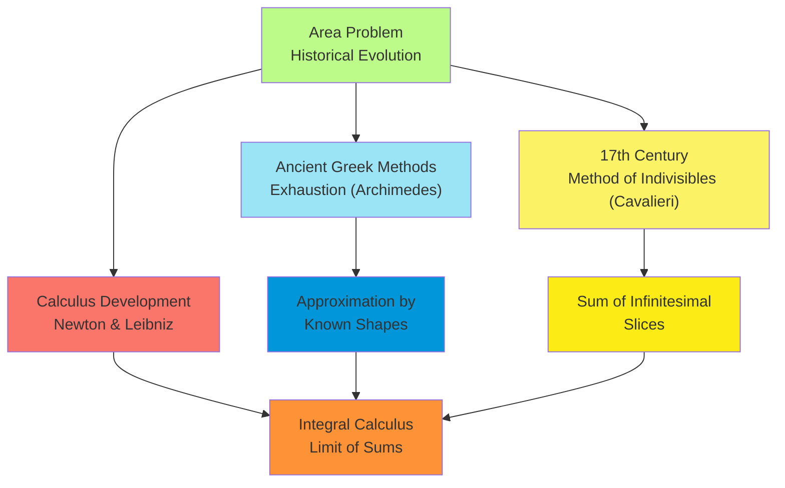
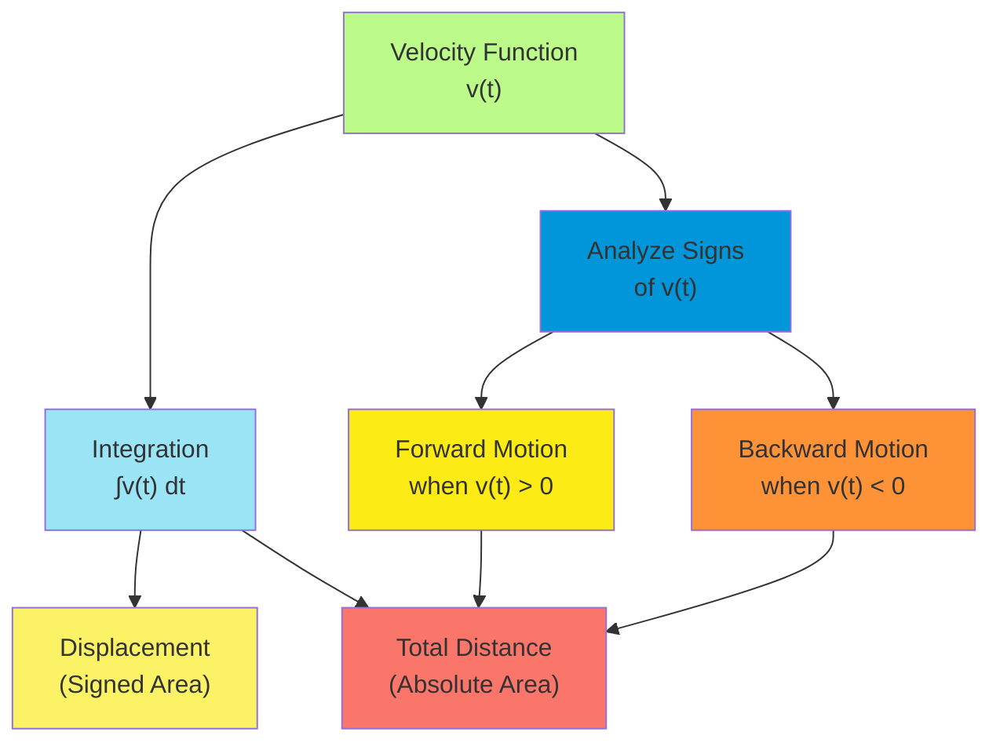
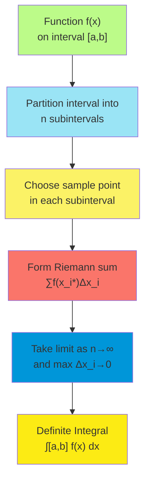
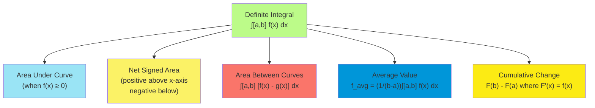
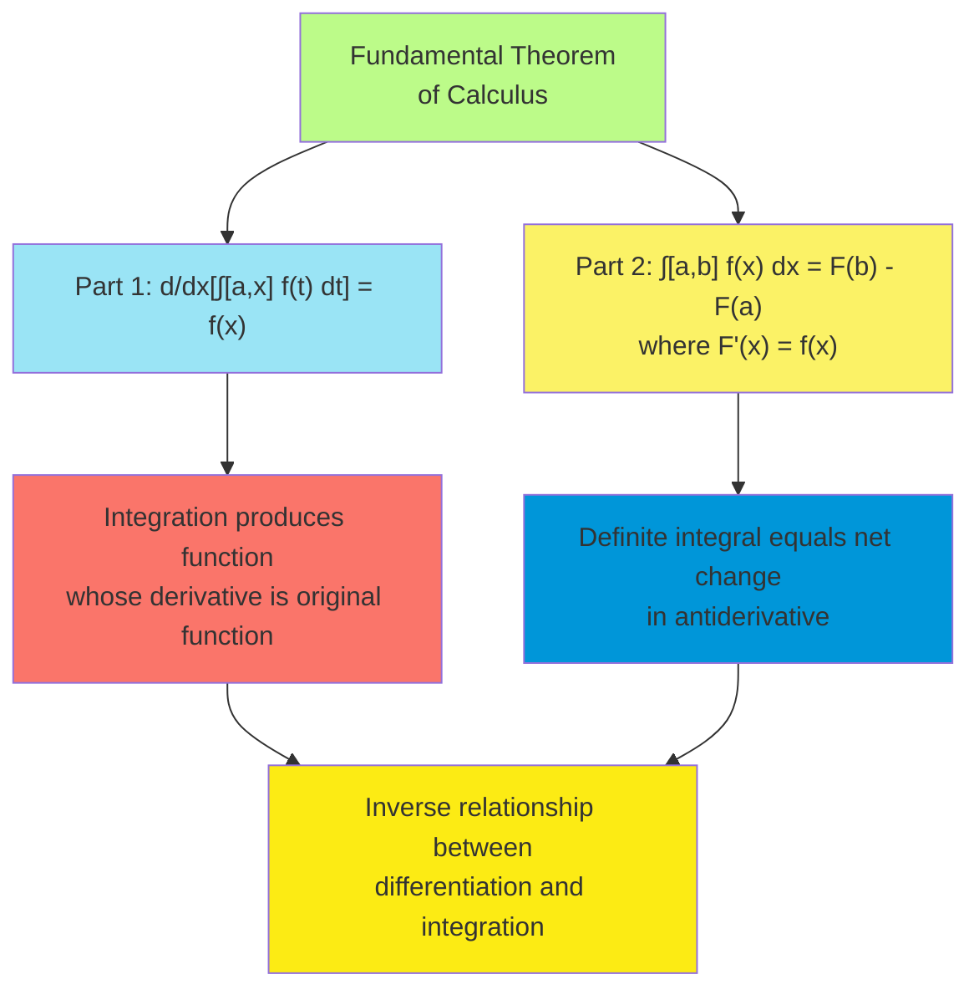
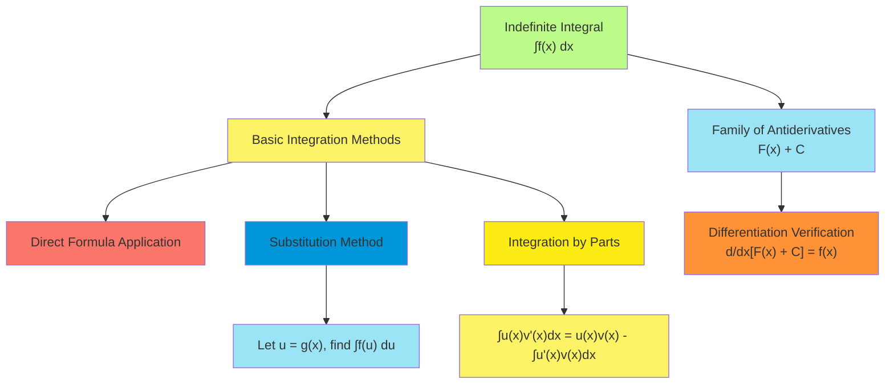
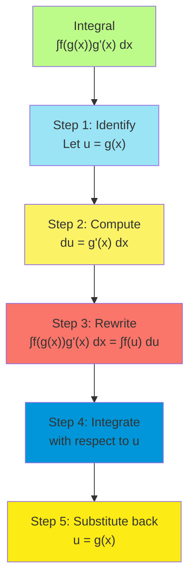
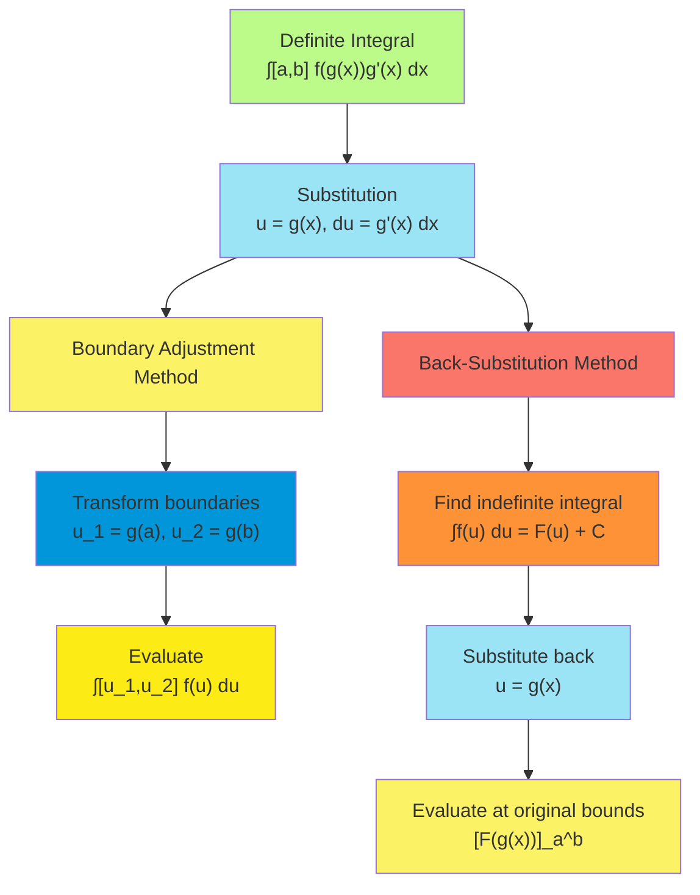

# C-4: Integrals

1. Areas and Distances

    - Area Problem and Historical Context
    - Riemann Sums and Approximation Methods
    - Distance from Velocity Function
    - Applications to Physical Problems

2. The Definite Integral

    - Definition as the Limit of Riemann Sums
    - Properties and Algebraic Rules
    - Geometric Interpretation
    - Evaluation Techniques

3. The Fundamental Theorem of Calculus

    - First and Second Parts of the Theorem
    - Connection Between Differentiation and Integration
    - Proof and Theoretical Significance
    - Applications in Computing Definite Integrals

4. Indefinite Integrals and the Net Change Theorem

    - Antiderivatives and Indefinite Integration
    - The Integration Constant and Family of Curves
    - Net Change Principle and Applications
    - Definite vs. Indefinite Integrals

5. The Substitution Rule
    - Change of Variables Technique
    - Relationship to the Chain Rule
    - Pattern Recognition for Effective Substitution
    - Definite Integral Substitution with Boundary Adjustment

#### Areas and Distances

Integral calculus originated from two seemingly disparate problems—calculating areas of curved regions and finding
distances traveled by objects with varying speeds. Both problems led to the same mathematical framework, revealing a
profound connection between accumulation and rates of change.

##### Area Problem and Historical Context

The area problem—determining the area enclosed by curves—challenged mathematicians for millennia and ultimately led to
the development of integral calculus:

1. **Historical Approaches**:
    - **Exhaustion Method**: Developed by ancient Greeks, particularly Eudoxus and Archimedes (3rd century BCE)
    - **Method of Indivisibles**: Advanced by Cavalieri in the 17th century
    - **Infinitesimals**: Used by Leibniz and others during the birth of calculus
2. **Archimedes' Contributions**:
    - Calculated areas and volumes by inscribing and circumscribing polygons/polyhedra
    - Approached exact values by increasing the number of sides
    - Found the area of a parabolic segment to be 4/3 the area of the inscribed triangle
    - Determined the value of π with remarkable accuracy using 96-sided polygons
3. **The 17th Century Revolution**:
    - Newton and Leibniz independently developed calculus in the late 17th century
    - Leibniz approached integration as summing infinitesimal rectangles
    - Newton viewed it through his "method of fluxions," focusing on continuous change
    - Their work unified techniques for solving area, volume, and motion problems
4. **Conceptual Evolution**:
    - From geometric intuition to analytic formulation
    - From specific techniques for particular curves to general methods
    - From approximate methods to exact formulations through limits
    - From controversial infinitesimals to rigorous limit-based foundations

The area problem exemplifies how mathematical innovation often emerges from concrete geometric challenges. The quest to
determine areas bounded by curves prompted the development of increasingly sophisticated mathematical techniques,
culminating in the integral calculus we study today.

##### Riemann Sums and Approximation Methods

Riemann sums provide a systematic approach for approximating areas under curves, forming the foundation for the definite
integral:

1. **Basic Construction of a Riemann Sum**:
    - Divide the interval $[a, b]$ into $n$ subintervals: $[x_0, x_1], [x_1, x_2], ..., [x_{n-1}, x_n]$
    - Width of each subinterval: $\Delta x_i = x_i - x_{i-1}$
    - Choose a sample point $x_i^*$ in each subinterval $[x_{i-1}, x_i]$
    - Form the sum: $\sum_{i=1}^{n} f(x_i^*) \Delta x_i$
2. **Common Types of Riemann Sums**:
    - **Left Endpoint**: $x_i^* = x_{i-1}$ (leftmost point of each subinterval)
    - **Right Endpoint**: $x_i^* = x_i$ (rightmost point of each subinterval)
    - **Midpoint**: $x_i^* = \frac{x_{i-1} + x_i}{2}$ (midpoint of each subinterval)
    - **Arbitrary Point**: Any point within each subinterval
3. **Regular Partitions**: When the interval $[a, b]$ is divided into $n$ equal subintervals:
    - Each subinterval has width $\Delta x = \frac{b-a}{n}$
    - The partition points are $x_i = a + i\Delta x$ for $i = 0, 1, 2, ..., n$
    - The Riemann sum simplifies to: $\sum_{i=1}^{n} f(x_i^*) \Delta x$
4. **Error Analysis**:
    - For increasing functions, left sums underestimate and right sums overestimate
    - For decreasing functions, left sums overestimate and right sums underestimate
    - Midpoint sums generally provide better approximations than left or right sums
    - Error decreases as $n$ increases, typically proportional to $\frac{1}{n}$ for left/right sums and $\frac{1}{n^2}$
      for midpoint sums
5. **Convergence to the Definite Integral**: As $n \to \infty$ and the maximum subinterval width approaches zero, the
   Riemann sum approaches the definite integral:
   $\lim_{n \to \infty} \sum_{i=1}^{n} f(x_i^*) \Delta x_i = \int_a^b f(x) , dx$

Example: Approximate $\int_0^1 x^2 , dx$ using left-endpoint Riemann sum with $n = 4$.

Step 1: Divide $[0, 1]$ into 4 equal subintervals.

- Subinterval width: $\Delta x = \frac{1-0}{4} = 0.25$
- Partition points: $x_0 = 0, x_1 = 0.25, x_2 = 0.5, x_3 = 0.75, x_4 = 1$

Step 2: Calculate the left-endpoint Riemann sum.

- Sample points: $x_1^* = 0, x_2^* = 0.25, x_3^* = 0.5, x_4^* = 0.75$
- $\sum_{i=1}^{4} f(x_i^*) \Delta x = f(0) \cdot 0.25 + f(0.25) \cdot 0.25 + f(0.5) \cdot 0.25 + f(0.75) \cdot 0.25$
- $= (0)^2 \cdot 0.25 + (0.25)^2 \cdot 0.25 + (0.5)^2 \cdot 0.25 + (0.75)^2 \cdot 0.25$
- $= 0 + 0.015625 + 0.0625 + 0.140625 = 0.21875$

Step 3: Compare with the exact value.

- Exact value: $\int_0^1 x^2 , dx = \left[ \frac{x^3}{3} \right]_0^1 = \frac{1}{3} - 0 = 0.33333...$
- Approximation error: $0.33333... - 0.21875 = 0.11458...$

This example illustrates how Riemann sums approximate areas under curves, with accuracy improving as the number of
subintervals increases.

##### Distance from Velocity Function

The connection between velocity and distance traveled represents a fundamental application of integration:

1. **Mathematical Relationship**:
    - If $v(t)$ is the velocity function of an object moving along a straight line
    - Then the displacement (net distance traveled) over the interval $[a, b]$ is: $s = \int_a^b v(t) , dt$
    - For total distance traveled (accounting for direction changes): $d = \int_a^b |v(t)| , dt$
2. **Physical Interpretation**:
    - Velocity represents the instantaneous rate of change of position: $v(t) = \frac{ds}{dt}$
    - Integration reverses this process, accumulating velocity over time to find total displacement
    - Geometrically, the displacement equals the signed area between the velocity curve and the time axis
    - Total distance equals the total area (ignoring signs) between the velocity curve and time axis
3. **Connection to the Fundamental Theorem**:
    - If $s(t)$ is the position function with $s'(t) = v(t)$
    - Then $\int_a^b v(t) , dt = s(b) - s(a)$
    - This illustrates the Fundamental Theorem of Calculus: integration reverses differentiation
4. **Special Cases**:
    - Constant velocity: $s = v \cdot (b-a)$ (area of a rectangle)
    - Linear velocity: $s = \frac{v(a) + v(b)}{2} \cdot (b-a)$ (area of a trapezoid)
    - Velocity with sign changes: Requires careful analysis of when motion changes direction

Example: An object moves along a straight line with velocity $v(t) = t^2 - 4t + 3$ meters per second. Find the
displacement and total distance traveled during the time interval $[0, 5]$.

Step 1: Analyze the velocity function to identify direction changes.

- $v(t) = t^2 - 4t + 3 = (t-1)(t-3)$
- $v(t) = 0$ when $t = 1$ or $t = 3$
- $v(t) > 0$ (moving forward) when $t < 1$ or $t > 3$
- $v(t) < 0$ (moving backward) when $1 < t < 3$

Step 2: Calculate the displacement.

- Displacement = $\int_0^5 (t^2 - 4t + 3) , dt$
- $= \left[ \frac{t^3}{3} - 2t^2 + 3t \right]_0^5$
- $= (\frac{125}{3} - 50 + 15) - (0 - 0 + 0)$
- $= \frac{125}{3} - 35 = \frac{125 - 105}{3} = \frac{20}{3} \approx 6.67$ meters

Step 3: Calculate the total distance traveled.

- Total distance = $\int_0^1 (t^2 - 4t + 3) , dt - \int_1^3 (t^2 - 4t + 3) , dt + \int_3^5 (t^2 - 4t + 3) , dt$
- $= \left[ \frac{t^3}{3} - 2t^2 + 3t \right]_0^1 - \left[ \frac{t^3}{3} - 2t^2 + 3t \right]_1^3 + \left[ \frac{t^3}{3} - 2t^2 + 3t \right]_3^5$
- $= (1/3 - 2 + 3) - (9 - 18 + 9) - (1/3 - 2 + 3) + (125/3 - 50 + 15) - (9 - 18 + 9)$
- $= 1/3 + 1 - (-9) + 125/3 - 35 - 0 = 1/3 + 1 + 9 + 125/3 - 35 = 10/3 + 125/3 - 25 = 135/3 - 25 = 45 - 25 = 20$ meters

The object's displacement is $\frac{20}{3}$ meters (net movement), while its total distance traveled is 20 meters
(accounting for movement in both directions).

This example illustrates how integration of the velocity function provides crucial information about an object's motion,
distinguishing between displacement (which considers direction) and total distance traveled (which doesn't).

##### Applications to Physical Problems

Integration applies to diverse physical situations involving accumulation and rates of change:

1. **Motion Analysis**:
    - Position from velocity: $s(t) = s(t_0) + \int_{t_0}^t v(\tau) , d\tau$
    - Velocity from acceleration: $v(t) = v(t_0) + \int_{t_0}^t a(\tau) , d\tau$
    - Average velocity: $\bar{v} = \frac{1}{b-a} \int_a^b v(t) , dt$
    - Distance traveled in 3D: $d = \int_a^b \sqrt{(x'(t))^2 + (y'(t))^2 + (z'(t))^2} , dt$
2. **Force and Work**:
    - Work done by a variable force: $W = \int_a^b F(x) , dx$
    - Spring force (Hooke's Law): $W = \int_0^d kx , dx = \frac{1}{2}kd^2$
    - Gravitational potential energy:
      $E_p = \int_{r_1}^{r_2} \frac{GMm}{r^2} , dr = GMm\left(\frac{1}{r_1} - \frac{1}{r_2}\right)$
    - Pressure-volume work: $W = \int_{V_1}^{V_2} P , dV$
3. **Fluid Mechanics**:
    - Hydrostatic force on a vertical plate: $F = \rho g \int_a^b w(y)(d-y) , dy$
    - Fluid flow rate: $Q = \int_R v , dA$
    - Archimedes' principle: $F_b = \rho g \int_V z , dV$
    - Bernoulli's equation: $P + \frac{1}{2}\rho v^2 + \rho gh = \text{constant}$ (derived from energy integration)
4. **Mass and Center of Mass**:
    - Mass of a rod with variable density: $m = \int_a^b \rho(x) , dx$
    - Center of mass of a rod: $\bar{x} = \frac{1}{m} \int_a^b x\rho(x) , dx$
    - Moment of inertia: $I = \int_a^b \rho(x)x^2 , dx$
    - Angular momentum: $L = \int_V \rho(\vec{r} \times \vec{v}) , dV$
5. **Electric and Magnetic Fields**:
    - Electric potential from field: $V(b) - V(a) = -\int_a^b \vec{E} \cdot d\vec{l}$
    - Magnetic flux: $\Phi_B = \int_S \vec{B} \cdot d\vec{A}$
    - Inductance: $L = \frac{\Phi_B}{I} = \frac{1}{I}\int_S \vec{B} \cdot d\vec{A}$
    - Energy in electric field: $U_E = \frac{1}{2} \int_V \varepsilon_0 E^2 , dV$

Example: Hydrostatic Force Problem

A triangular plate is submerged vertically in water with its top edge at the water surface. The plate has a base of 6
meters at the surface and a height of 4 meters. Calculate the hydrostatic force on one side of the plate.

Step 1: Set up coordinate system with y measured downward from the water surface.

Step 2: The width of the plate at depth y is: $w(y) = 6 \cdot \left(1 - \frac{y}{4}\right)$ for $0 \leq y \leq 4$

Step 3: At depth y, the pressure is: $P(y) = \rho g y$ where $\rho = 1000$ kg/m³ and $g = 9.8$ m/s²

Step 4: The force on a thin horizontal strip at depth y is:
$dF = P(y) \cdot w(y) , dy = \rho g y \cdot 6 \left(1 - \frac{y}{4}\right) , dy$

Step 5: Integrate to find the total force: $F = \int_0^4 \rho g y \cdot 6 \left(1 - \frac{y}{4}\right) , dy$
$= 6\rho g \int_0^4 y - \frac{y^2}{4} , dy$ $= 6\rho g \left[ \frac{y^2}{2} - \frac{y^3}{12} \right]_0^4$
$= 6\rho g \left[ \frac{16}{2} - \frac{64}{12} - 0 \right]$ $= 6\rho g \left[ 8 - \frac{16}{3} \right]$
$= 6\rho g \cdot \frac{24 - 16}{3}$ $= 6\rho g \cdot \frac{8}{3}$ $= 6 \cdot 1000 \cdot 9.8 \cdot \frac{8}{3}$
$= 156,800$ Newtons

The hydrostatic force on one side of the triangular plate is approximately 156.8 kilonewtons.

These applications demonstrate how integration serves as a powerful tool for analyzing physical systems, allowing us to
calculate quantities that involve accumulation over space, time, or other variables.

#### The Definite Integral

The definite integral formalizes the concept of accumulated change, providing a rigorous foundation for calculating
areas, distances, and other quantities that involve summing infinitesimal contributions.

##### Definition as the Limit of Riemann Sums

The definite integral is defined as the limit of Riemann sums, transforming an intuitive notion of accumulation into a
precise mathematical object:

1. **Formal Definition**: For a function $f$ defined on a closed interval $[a, b]$, the definite integral
   $\int_a^b f(x) , dx$ is defined as:

    $$\int_a^b f(x) , dx = \lim_{n \to \infty} \sum_{i=1}^{n} f(x_i^*) \Delta x_i$$

    provided this limit exists, where:

    - $[a, b]$ is partitioned into $n$ subintervals $[x_{i-1}, x_i]$
    - $\Delta x_i = x_i - x_{i-1}$ is the width of the $i$-th subinterval
    - $x_i^*$ is any sample point in the $i$-th subinterval
    - The limit is taken as the maximum width of all subintervals approaches zero

2. **Existence of the Definite Integral**:

    - A function $f$ is **integrable** on $[a, b]$ if the limit defining the definite integral exists
    - Sufficient conditions for integrability include:
        - Continuity on $[a, b]$
        - Piecewise continuity with a finite number of jump discontinuities
        - Monotonicity on $[a, b]$
        - Boundedness with a finite number of discontinuities

3. **Regular Partition Case**: When the interval $[a, b]$ is divided into $n$ equal subintervals:

    - Each subinterval has width $\Delta x = \frac{b-a}{n}$
    - The definition simplifies to:
      $$\int_a^b f(x) , dx = \lim_{n \to \infty} \sum_{i=1}^{n} f(x_i^*) \cdot \frac{b-a}{n}$$

4. **Terminology and Notation**:

    - $\int$ is the integral symbol, derived from the letter S for "sum"
    - $a$ and $b$ are the **limits of integration** (lower and upper limits)
    - $f(x)$ is the **integrand**
    - $dx$ is the **differential**, indicating integration with respect to variable $x$

5. **Interpretation**:

    - Geometrically: Area under the curve $y = f(x)$ from $x = a$ to $x = b$ (when $f(x) \geq 0$)
    - Physically: Accumulation of a quantity whose rate of change is $f(x)$
    - Analytically: Reversal of differentiation, finding total change from rates of change

Example: Understanding the definition for $\int_1^3 x^2 , dx$

Step 1: Set up a regular partition of $[1, 3]$ with $n$ equal subintervals.

- Each subinterval has width $\Delta x = \frac{3-1}{n} = \frac{2}{n}$
- The partition points are $x_i = 1 + i\Delta x = 1 + \frac{2i}{n}$ for $i = 0, 1, 2, ..., n$

Step 2: Choose sample points (using right endpoints for illustration).

- $x_i^* = x_i = 1 + \frac{2i}{n}$ for $i = 1, 2, ..., n$

Step 3: Form the Riemann sum.

- $\sum_{i=1}^{n} f(x_i^*) \Delta x = \sum_{i=1}^{n} \left(1 + \frac{2i}{n}\right)^2 \cdot \frac{2}{n}$
- $= \frac{2}{n} \sum_{i=1}^{n} \left(1 + \frac{4i}{n} + \frac{4i^2}{n^2}\right)$
- $= \frac{2}{n} \cdot n + \frac{2}{n} \cdot \frac{4}{n} \sum_{i=1}^{n} i + \frac{2}{n} \cdot \frac{4}{n^2} \sum_{i=1}^{n} i^2$

Step 4: Use summation formulas:

- $\sum_{i=1}^{n} 1 = n$
- $\sum_{i=1}^{n} i = \frac{n(n+1)}{2}$
- $\sum_{i=1}^{n} i^2 = \frac{n(n+1)(2n+1)}{6}$

Step 5: Simplify and take the limit as $n \to \infty$.

- $\frac{2}{n} \cdot n + \frac{8}{n^2} \cdot \frac{n(n+1)}{2} + \frac{8}{n^3} \cdot \frac{n(n+1)(2n+1)}{6}$
- $= 2 + \frac{4(n+1)}{n} + \frac{4(n+1)(2n+1)}{3n^2}$
- $\lim_{n \to \infty} \left[ 2 + \frac{4(n+1)}{n} + \frac{4(n+1)(2n+1)}{3n^2} \right]$
- $= 2 + 4 + \frac{8}{3} = 2 + 4 + \frac{8}{3} = 6 + \frac{8}{3} = \frac{18 + 8}{3} = \frac{26}{3}$

This agrees with the direct evaluation
$\int_1^3 x^2 , dx = \left[ \frac{x^3}{3} \right]_1^3 = \frac{27}{3} - \frac{1}{3} = \frac{26}{3}$.

The limit definition establishes the definite integral as a fundamental object in calculus, providing a rigorous
foundation for calculating accumulated quantities by summing infinitesimal contributions.

##### Properties and Algebraic Rules

Definite integrals obey several important properties that facilitate evaluation and interpretation:

1. **Basic Properties**:
    - **Linearity**: $\int_a^b [c\cdot f(x) + d\cdot g(x)] , dx = c\int_a^b f(x) , dx + d\int_a^b g(x) , dx$
    - **Additivity of Intervals**: $\int_a^b f(x) , dx + \int_b^c f(x) , dx = \int_a^c f(x) , dx$
    - **Integration of Constants**: $\int_a^b k , dx = k(b-a)$
    - **Switching Limits**: $\int_a^b f(x) , dx = -\int_b^a f(x) , dx$
    - **Zero-Length Interval**: $\int_a^a f(x) , dx = 0$
2. **Comparison Properties**:
    - **Domination**: If $f(x) \leq g(x)$ for all $x \in [a, b]$, then $\int_a^b f(x) , dx \leq \int_a^b g(x) , dx$
    - **Absolute Value**: $\left|\int_a^b f(x) , dx\right| \leq \int_a^b |f(x)| , dx$
    - **Triangle Inequality**:
      $\left|\int_a^b f(x) , dx + \int_a^b g(x) , dx\right| \leq \int_a^b |f(x)| , dx + \int_a^b |g(x)| , dx$
3. **Mean Value Property**:
    - If $f$ is continuous on $[a, b]$, there exists a point $c \in [a, b]$ such that: $\int_a^b f(x) , dx = f(c)(b-a)$
    - The value $f(c)$ is called the average value of $f$ on $[a, b]$: $f_{avg} = \frac{1}{b-a}\int_a^b f(x) , dx$
4. **Special Symmetric Properties**:
    - For **even functions** ($f(-x) = f(x)$): $\int_{-a}^a f(x) , dx = 2\int_0^a f(x) , dx$
    - For **odd functions** ($f(-x) = -f(x)$): $\int_{-a}^a f(x) , dx = 0$
5. **Estimation Properties**:
    - If $m \leq f(x) \leq M$ for all $x \in [a, b]$, then $m(b-a) \leq \int_a^b f(x) , dx \leq M(b-a)$
    - Average of left and right Riemann sums:
      $\frac{L_n + R_n}{2} = \frac{f(a) + f(b)}{2} \cdot \frac{b-a}{n} + \sum_{i=1}^{n-1} f(a + i\Delta x) \cdot \Delta x$
      (This is the trapezoidal rule approximation)

Example: Applying integration properties to evaluate $\int_0^4 (3x^2 - 2x + 5) , dx$

Using linearity: $\int_0^4 (3x^2 - 2x + 5) , dx = 3\int_0^4 x^2 , dx - 2\int_0^4 x , dx + 5\int_0^4 1 , dx$

Evaluating each term:

- $3\int_0^4 x^2 , dx = 3 \left[ \frac{x^3}{3} \right]_0^4 = 3 \cdot \frac{64 - 0}{3} = 64$
- $2\int_0^4 x , dx = 2 \left[ \frac{x^2}{2} \right]_0^4 = 2 \cdot \frac{16 - 0}{2} = 16$
- $5\int_0^4 1 , dx = 5 [x]_0^4 = 5 \cdot (4 - 0) = 20$

Combining results: $\int_0^4 (3x^2 - 2x + 5) , dx = 64 - 16 + 20 = 68$

Example: Using symmetry properties to evaluate $\int_{-3}^3 (x^4 - x^2 + 7) , dx$

Analyzing the integrand:

- $x^4$ is even: $(-x)^4 = x^4$
- $-x^2$ is even: $-(-x)^2 = -x^2$
- $7$ is even: $7$ is constant

Since the entire integrand is even and the interval $[-3, 3]$ is symmetric about the origin:
$\int_{-3}^3 (x^4 - x^2 + 7) , dx = 2\int_0^3 (x^4 - x^2 + 7) , dx$

Evaluating: $2\int_0^3 (x^4 - x^2 + 7) , dx = 2 \left[ \frac{x^5}{5} - \frac{x^3}{3} + 7x \right]_0^3$
$= 2 \left[ \frac{243}{5} - \frac{27}{3} + 21 - 0 \right]$ $= 2 \left[ \frac{243}{5} - 9 + 21 \right]$
$= 2 \left[ \frac{243}{5} + 12 \right]$ $ = 2 \left[ \frac{243}{5} + 12 \right] $ $ = 2 \left[ \frac{243 + 60}{5}
\right] $ $ = 2 \cdot \frac{303}{5} $ $ = \frac{606}{5} $

These properties of definite integrals provide powerful tools for evaluation, estimation, and understanding the behavior
of integrals without direct computation, allowing for more efficient and insightful analysis of integration problems.

##### Geometric Interpretation

The definite integral has rich geometric interpretations that provide intuitive understanding of this fundamental
concept:

1. **Area Under a Curve**:
    - For a non-negative function $f(x) \geq 0$ on $[a, b]$, $\int_a^b f(x) , dx$ represents the area of the region
      bounded by:
        - The graph of $f$
        - The x-axis
        - The vertical lines $x = a$ and $x = b$
    - This is the most common geometric interpretation, connecting integration to the area problem
2. **Net Signed Area**:
    - If $f(x)$ takes both positive and negative values on $[a, b]$, then $\int_a^b f(x) , dx$ represents the net signed
      area:
        - Areas above the x-axis (where $f(x) > 0$) count as positive
        - Areas below the x-axis (where $f(x) < 0$) count as negative
        - The integral gives the algebraic sum of these signed areas
3. **Area Between Curves**:
    - The area between two curves $f(x)$ and $g(x)$ where $f(x) \geq g(x)$ on $[a, b]$ is given by:
      $\int_a^b [f(x) - g(x)] , dx$
    - This represents the area of the region bounded by the graphs of $f$ and $g$ between $x = a$ and $x = b$
4. **Average Value Interpretation**:
    - The average value of $f$ on $[a, b]$ is given by: $f_{avg} = \frac{1}{b-a}\int_a^b f(x) , dx$
    - Geometrically, this is the height of the rectangle with base $[a, b]$ having the same area as the region under the
      curve
5. **Cumulative Change**:
    - If $f(x)$ represents the rate of change of a quantity $F$ with respect to $x$, then:
      $\int_a^b f(x) , dx = F(b) - F(a)$
    - This represents the net change in $F$ as $x$ changes from $a$ to $b$

Example: Geometric interpretation of $\int_0^2 (x^2 - 2) , dx$

Step 1: Analyze the function and identify where it changes sign.

- $f(x) = x^2 - 2$
- $f(x) = 0$ when $x = \pm\sqrt{2}$
- In the interval $[0, 2]$, $f(x) < 0$ for $0 \leq x < \sqrt{2}$ and $f(x) > 0$ for $\sqrt{2} < x \leq 2$

Step 2: Calculate the definite integral. $\int_0^2 (x^2 - 2) , dx = \left[ \frac{x^3}{3} - 2x \right]_0^2$
$= \left( \frac{8}{3} - 4 \right) - \left( 0 - 0 \right)$ $= \frac{8}{3} - 4 = \frac{8 - 12}{3} = -\frac{4}{3}$

Step 3: Interpret geometrically as net signed area.

- The negative area (below x-axis) from $x = 0$ to $x = \sqrt{2}$ is:
  $\int_0^{\sqrt{2}} (x^2 - 2) , dx = \left[ \frac{x^3}{3} - 2x \right]_0^{\sqrt{2}}$
  $= \left( \frac{(\sqrt{2})^3}{3} - 2\sqrt{2} \right) - 0$ $= \frac{2\sqrt{2}}{3} - 2\sqrt{2} = -\frac{4\sqrt{2}}{3}$
- The positive area (above x-axis) from $x = \sqrt{2}$ to $x = 2$ is:
  $\int_{\sqrt{2}}^{2} (x^2 - 2) , dx = \left[ \frac{x^3}{3} - 2x \right]_{\sqrt{2}}^{2}$
  $= \left( \frac{8}{3} - 4 \right) - \left( \frac{2\sqrt{2}}{3} - 2\sqrt{2} \right)$
  $= \frac{8}{3} - 4 - \frac{2\sqrt{2}}{3} + 2\sqrt{2}$ $= \frac{8}{3} - 4 + \frac{6\sqrt{2} - 2\sqrt{2}}{3}$
  $= \frac{8}{3} - 4 + \frac{4\sqrt{2}}{3}$
- The net signed area equals the sum of these areas:
  $-\frac{4\sqrt{2}}{3} + \frac{8}{3} - 4 + \frac{4\sqrt{2}}{3} = \frac{8}{3} - 4 = -\frac{4}{3}$

Step 4: Interpret using the average value.

- The average value of $f(x) = x^2 - 2$ over $[0, 2]$ is:
  $f_{avg} = \frac{1}{2-0}\int_0^2 (x^2 - 2) , dx = \frac{1}{2} \cdot (-\frac{4}{3}) = -\frac{2}{3}$
- This means a horizontal line at height $y = -\frac{2}{3}$ would create the same net signed area with the x-axis as the
  original function over $[0, 2]$

These geometric interpretations provide intuitive understanding of definite integrals beyond formal definitions and
algebraic manipulations, connecting abstract mathematical concepts to concrete visual representations.

##### Evaluation Techniques

Several techniques exist for evaluating definite integrals, from direct application of the Fundamental Theorem to
numerical approximation methods:

1. **Fundamental Theorem of Calculus**:
    - If $F$ is an antiderivative of $f$ on $[a, b]$, then $\int_a^b f(x) , dx = F(b) - F(a)$
    - This is the most common and direct method when the antiderivative can be found
    - The notation $\left[ F(x) \right]_a^b$ represents $F(b) - F(a)$
2. **Numerical Integration Methods**:
    - **Trapezoidal Rule**:
      $\int_a^b f(x) , dx \approx \frac{\Delta x}{2} [f(x_0) + 2f(x_1) + 2f(x_2) + \cdots + 2f(x_{n-1}) + f(x_n)]$
    - **Simpson's Rule**:
      $\int_a^b f(x) , dx \approx \frac{\Delta x}{3} [f(x_0) + 4f(x_1) + 2f(x_2) + 4f(x_3) + \cdots + 2f(x_{n-2}) + 4f(x_{n-1}) + f(x_n)]$
    - **Gaussian Quadrature**: Uses specially chosen points and weights for optimal accuracy
    - **Adaptive Methods**: Adjust step size based on local behavior of the integrand
3. **Integration by Parts**:
    - Using the formula $\int_a^b u(x)v'(x) , dx = [u(x)v(x)]_a^b - \int_a^b u'(x)v(x) , dx$
    - Particularly useful for products of functions such as $xe^x$, $x\sin(x)$, etc.
    - For definite integrals, evaluate the resulting antiderivative at the limits
4. **Substitution Method**:
    - For integrals of the form $\int_a^b f(g(x))g'(x) , dx$, use $u = g(x)$
    - Results in $\int_{g(a)}^{g(b)} f(u) , du$
    - Either adjust the limits or back-substitute after finding the antiderivative
5. **Symmetry and Periodicity Techniques**:
    - For even functions on symmetric intervals: $\int_{-a}^{a} f(x) , dx = 2\int_0^a f(x) , dx$
    - For odd functions on symmetric intervals: $\int_{-a}^{a} f(x) , dx = 0$
    - For periodic functions with period $p$: $\int_a^{a+p} f(x) , dx = \int_0^p f(x) , dx$
6. **Decomposition Methods**:
    - Partial fractions for rational functions
    - Trigonometric substitutions for certain radicals
    - Completing the square for quadratic expressions

Example: Evaluate $\int_0^{\pi/2} \sin^2(x) , dx$ using multiple techniques

Method 1: Using the identity $\sin^2(x) = \frac{1 - \cos(2x)}{2}$
$\int_0^{\pi/2} \sin^2(x) , dx = \int_0^{\pi/2} \frac{1 - \cos(2x)}{2} , dx$
$= \frac{1}{2} \int_0^{\pi/2} (1 - \cos(2x)) , dx$ $= \frac{1}{2} \left[ x - \frac{\sin(2x)}{2} \right]_0^{\pi/2}$
$= \frac{1}{2} \left[ \frac{\pi}{2} - \frac{\sin(\pi)}{2} - 0 - \frac{\sin(0)}{2} \right]$
$= \frac{1}{2} \cdot \frac{\pi}{2} = \frac{\pi}{4}$

Method 2: Using symmetry and periodicity For $\sin^2(x)$ on $[0, \pi]$:

- $\sin^2(x)$ is even about $x = \pi/2$ (i.e., $\sin^2(\pi/2 + t) = \sin^2(\pi/2 - t)$)
- Therefore,
  $\int_0^{\pi/2} \sin^2(x) , dx = \int_{\pi/2}^{\pi} \sin^2(x) , dx = \frac{1}{2} \int_0^{\pi} \sin^2(x) , dx$

For a complete period $[0, \pi]$, the average value of $\sin^2(x)$ is $1/2$, so:
$\int_0^{\pi} \sin^2(x) , dx = \frac{\pi}{2}$

Therefore, $\int_0^{\pi/2} \sin^2(x) , dx = \frac{1}{2} \cdot \frac{\pi}{2} = \frac{\pi}{4}$

Method 3: Numerical approximation (Simpson's Rule with n = 4)
$\int_0^{\pi/2} \sin^2(x) , dx \approx \frac{\pi/2 - 0}{4 \cdot 3} \left[ \sin^2(0) + 4\sin^2\left(\frac{\pi}{8}\right) + 2\sin^2\left(\frac{\pi}{4}\right) + 4\sin^2\left(\frac{3\pi}{8}\right) + \sin^2\left(\frac{\pi}{2}\right) \right]$

Evaluating: $\sin^2(0) = 0$ $\sin^2\left(\frac{\pi}{8}\right) \approx 0.1464$ $\sin^2\left(\frac{\pi}{4}\right) = 0.5$
$\sin^2\left(\frac{3\pi}{8}\right) \approx 0.8536$ $\sin^2\left(\frac{\pi}{2}\right) = 1$

Simpson's Rule approximation:
$\frac{\pi/2}{12} [0 + 4(0.1464) + 2(0.5) + 4(0.8536) + 1] \approx \frac{\pi}{24} [0 + 0.5856 + 1 + 3.4144 + 1] = \frac{\pi}{24} \cdot 6 = \frac{\pi}{4}$

All three methods yield the same result: $\int_0^{\pi/2} \sin^2(x) , dx = \frac{\pi}{4}$

These diverse evaluation techniques provide flexibility in approaching different types of integrals, allowing us to
choose the most appropriate method based on the specific characteristics of the integrand and the integration interval.

#### The Fundamental Theorem of Calculus

The Fundamental Theorem of Calculus bridges differential and integral calculus, establishing the inverse relationship
between differentiation and integration and providing a powerful method for evaluating definite integrals.

##### First and Second Parts of the Theorem

The Fundamental Theorem of Calculus consists of two parts that together reveal the profound connection between
differentiation and integration:

1. **First Part (FTC Part 1)**: If $f$ is continuous on $[a, b]$ and we define a function $F$ on $[a, b]$ by:
   $$F(x) = \int_a^x f(t) , dt$$

    Then $F$ is differentiable on $(a, b)$ and: $$F'(x) = f(x)$$

    In other words, the derivative of the integral function $F(x)$ equals the original function $f(x)$.

2. **Second Part (FTC Part 2)**: If $f$ is continuous on $[a, b]$ and $F$ is any antiderivative of $f$ on $[a, b]$
   (i.e., $F'(x) = f(x)$ for all $x \in [a, b]$), then: $$\int_a^b f(x) , dx = F(b) - F(a)$$

    This provides a method for evaluating definite integrals by finding an antiderivative and evaluating it at the
    endpoints.

3. **Notation**:

    - The shorthand notation $[F(x)]_a^b$ represents $F(b) - F(a)$
    - The definite integral $\int_a^b f(x) , dx$ is often computed as $[F(x)]_a^b$ where $F'(x) = f(x)$

4. **Implications**:

    - FTC Part 1 shows that integration (accumulating a rate of change) produces a function whose rate of change is the
      original function
    - FTC Part 2 demonstrates that finding the accumulated change is equivalent to finding the net change in the
      antiderivative

Example: Illustrating FTC Part 1

Define $F(x) = \int_1^x t^2 , dt$. Let's verify that $F'(x) = x^2$.

Step 1: According to FTC Part 1, $F'(x) = f(x)$, where $f(x) = x^2$.

Step 2: Alternative verification by computing $F(x)$ explicitly:
$F(x) = \int_1^x t^2 , dt = \left[ \frac{t^3}{3} \right]_1^x = \frac{x^3}{3} - \frac{1}{3}$

Step 3: Differentiate this expression:
$F'(x) = \frac{d}{dx}\left[ \frac{x^3}{3} - \frac{1}{3} \right] = \frac{3x^2}{3} = x^2$

This confirms that $F'(x) = x^2$, as predicted by FTC Part 1.

Example: Applying FTC Part 2

Evaluate $\int_1^4 (3x^2 - 2x + 1) , dx$ using the Fundamental Theorem.

Step 1: Find an antiderivative $F(x)$ of $f(x) = 3x^2 - 2x + 1$:
$F(x) = 3 \cdot \frac{x^3}{3} - 2 \cdot \frac{x^2}{2} + x = x^3 - x^2 + x$

Step 2: Apply FTC Part 2: $\int_1^4 (3x^2 - 2x + 1) , dx = [F(x)]_1^4 = F(4) - F(1)$
$= (4^3 - 4^2 + 4) - (1^3 - 1^2 + 1)$ $= (64 - 16 + 4) - (1 - 1 + 1)$ $= 52 - 1 = 51$

These examples demonstrate how the Fundamental Theorem of Calculus provides a powerful framework for understanding and
computing integrals by connecting the operations of differentiation and integration.

##### Connection Between Differentiation and Integration

The Fundamental Theorem of Calculus reveals that differentiation and integration are inverse operations, providing a
unifying framework for calculus:

1. **Inverse Operations**:
    - Differentiation of an antiderivative: $\frac{d}{dx}\left[ \int f(t) , dt \right] = f(x)$
    - Integration of a derivative: $\int \frac{d}{dx}[F(x)] , dx = F(x) + C$
    - These operations "undo" each other, similar to how addition and subtraction are inverses
2. **Accumulation Function**: The function $F(x) = \int_a^x f(t) , dt$ represents the accumulation of the quantity whose
   rate of change is $f(t)$:
    - $f(t)$ is the rate of change
    - $F(x)$ is the accumulated change from $a$ to $x$
    - $F'(x) = f(x)$ connects the accumulated value to its rate of change
3. **Net Change Theorem**: The net change in a quantity equals the integral of its rate of change:
    - If $F'(x) = f(x)$, then $F(b) - F(a) = \int_a^b f(x) , dx$
    - This principle applies across disciplines:
        - Distance traveled = integral of velocity
        - Work done = integral of force
        - Total cost = integral of marginal cost
4. **Local vs. Global Behavior**:
    - Derivatives provide local information (instantaneous rate of change at a point)
    - Integrals provide global information (accumulated change over an interval)
    - The Fundamental Theorem connects these complementary perspectives
5. **Differential Equations Connection**:
    - The equation $\frac{dy}{dx} = f(x)$ has general solution $y = \int f(x) , dx + C$
    - The Fundamental Theorem shows why integration solves first-order differential equations

Example: Demonstrating the Inverse Relationship

Consider the function $f(x) = x^2$ on the interval $[0, 3]$.

Step 1: Find the antiderivative $F(x) = \int x^2 , dx = \frac{x^3}{3} + C$.

Step 2: Choose a specific antiderivative by setting $C = 0$, so $F(x) = \frac{x^3}{3}$.

Step 3: Verify that differentiation reverses integration:
$F'(x) = \frac{d}{dx}\left[ \frac{x^3}{3} \right] = \frac{3x^2}{3} = x^2 = f(x)$

Step 4: Verify that integration reverses differentiation:
$\int F'(x) , dx = \int x^2 , dx = \frac{x^3}{3} + C = F(x) + C$

Step 5: Calculate the definite integral using the antiderivative:
$\int_0^3 x^2 , dx = \left[ \frac{x^3}{3} \right]_0^3 = \frac{27}{3} - 0 = 9$

Step 6: Interpret as accumulated change: If $f(x) = x^2$ represents the rate of change of $F(x) = \frac{x^3}{3}$, then
the accumulated change in $F$ from $x = 0$ to $x = 3$ is 9 units.

This example illustrates the fundamental connection between differentiation and integration, showing how these
operations invert each other and how the definite integral represents accumulated change.

##### Proof and Theoretical Significance

The proof of the Fundamental Theorem of Calculus reveals deep insights about the relationship between differentiation
and integration:

1. **Proof of FTC Part 1**: For the function $F(x) = \int_a^x f(t) , dt$ where $f$ is continuous on $[a, b]$:

    Step 1: Apply the definition of the derivative:
    $$F'(x) = \lim_{h \to 0} \frac{F(x+h) - F(x)}{h} = \lim_{h \to 0} \frac{1}{h} \left[ \int_a^{x+h} f(t) , dt - \int_a^x f(t) , dt \right]$$

    Step 2: Use the property of definite integrals: $$F'(x) = \lim_{h \to 0} \frac{1}{h} \int_x^{x+h} f(t) , dt$$

    Step 3: Apply the Mean Value Theorem for integrals: There exists $c_h \in [x, x+h]$ such that:
    $$\int_x^{x+h} f(t) , dt = f(c_h) \cdot h$$

    Step 4: Substitute this into the derivative expression:
    $$F'(x) = \lim_{h \to 0} \frac{f(c_h) \cdot h}{h} = \lim_{h \to 0} f(c_h)$$

    Step 5: As $h \to 0$, $c_h \to x$ since $c_h \in [x, x+h]$, and by the continuity of $f$:
    $$F'(x) = \lim_{h \to 0} f(c_h) = f(x)$$

2. **Proof of FTC Part 2**: If $F$ is any antiderivative of $f$ on $[a, b]$, and we define $G(x) = \int_a^x f(t) , dt$:

    Step 1: From FTC Part 1, we know $G'(x) = f(x)$.

    Step 2: Since $F'(x) = f(x) = G'(x)$, the function $H(x) = F(x) - G(x)$ has derivative $H'(x) = 0$ for all
    $x \in [a, b]$.

    Step 3: By the Mean Value Theorem, a function with zero derivative on an interval must be constant on that interval,
    so: $$F(x) - G(x) = C$$ for some constant $C$ and all $x \in [a, b]$.

    Step 4: Evaluate at $x = a$: $$F(a) - G(a) = F(a) - \int_a^a f(t) , dt = F(a) - 0 = F(a) = C$$

    Step 5: Therefore, $F(x) = G(x) + F(a)$ for all $x \in [a, b]$, which gives:
    $$F(b) = G(b) + F(a) = \int_a^b f(t) , dt + F(a)$$

    Step 6: Rearranging: $$\int_a^b f(t) , dt = F(b) - F(a)$$

3. **Theoretical Significance**:

    a. **Unification of Calculus**:

    - Connects the differential and integral calculus developed separately by Newton and Leibniz
    - Demonstrates that the seemingly distinct operations of finding tangent lines and computing areas are intimately
      related

    b. **Mathematical Analysis Foundation**:

    - Provides the basis for solving differential equations
    - Establishes the framework for advanced calculus concepts
    - Connects to important theoretical results like the Mean Value Theorem

    c. **Computational Significance**:

    - Transforms the problem of computing limits of Riemann sums to finding antiderivatives
    - Enables the evaluation of complex integrals through algebraic methods
    - Forms the basis for numerical integration techniques

    d. **Conceptual Framework**:

    - Demonstrates how local information (derivatives) relates to global behavior (integrals)
    - Shows how instantaneous rates determine accumulated quantities
    - Provides a mathematical foundation for understanding how small changes accumulate to produce overall change

The Fundamental Theorem of Calculus stands as one of the most profound results in mathematics, not only providing
practical tools for computation but also revealing deep connections between seemingly disparate concepts, unifying
calculus into a coherent framework for understanding change and accumulation.

##### Applications in Computing Definite Integrals

The Fundamental Theorem of Calculus transforms the evaluation of definite integrals from a complex limit process to a
straightforward algebraic procedure:

1. **Basic Evaluation Procedure**: To compute $\int_a^b f(x) , dx$:

    - Find an antiderivative $F(x)$ of $f(x)$
    - Evaluate $F(b) - F(a)$

2. **Standard Integral Formulas**: The Fundamental Theorem allows us to develop a catalog of standard integrals:

    - $\int x^n , dx = \frac{x^{n+1}}{n+1} + C$ (for $n \neq -1$)
    - $\int \sin(x) , dx = -\cos(x) + C$
    - $\int e^x , dx = e^x + C$
    - $\int \frac{1}{x} , dx = \ln|x| + C$
    - etc.

3. **Definite Integral Evaluations**:

    - $\int_0^1 x^n , dx = \left[ \frac{x^{n+1}}{n+1} \right]_0^1 = \frac{1}{n+1}$ (for $n > -1$)
    - $\int_0^{\pi/2} \sin(x) , dx = [-\cos(x)]_0^{\pi/2} = -\cos(\pi/2) + \cos(0) = 0 + 1 = 1$
    - $\int_1^2 \frac{1}{x} , dx = [\ln|x|]_1^2 = \ln(2) - \ln(1) = \ln(2)$

4. **Integration by Parts with Definite Integrals**: The formula becomes:
   $$\int_a^b u(x)v'(x) , dx = [u(x)v(x)]_a^b - \int_a^b u'(x)v(x) , dx$$

5. **Substitution Method with Definite Integrals**: Two approaches:

    a. **Adjusting the Limits**: For $\int_a^b f(g(x))g'(x) , dx$, with substitution $u = g(x)$:
    $$\int_a^b f(g(x))g'(x) , dx = \int_{g(a)}^{g(b)} f(u) , du$$

    b. **Back-Substitution**: Find antiderivative $F(g(x))$ where $F'(u) = f(u)$, then evaluate:
    $$\int_a^b f(g(x))g'(x) , dx = [F(g(x))]_a^b = F(g(b)) - F(g(a))$$

6. **Handling Improper Integrals**: For integrals with infinite limits or integrand singularities:
   $$\int_a^{\infty} f(x) , dx = \lim_{b \to \infty} \int_a^b f(x) , dx = \lim_{b \to \infty} [F(x)]*a^b = \lim*{b \to \infty} [F(b) - F(a)]$$

Example: Computing $\int_0^{\pi} \sin^2(x)\cos(x) , dx$

Method 1: Direct Substitution Let $u = \sin(x)$, then $du = \cos(x) , dx$
$\int_0^{\pi} \sin^2(x)\cos(x) , dx = \int_0^{\pi} u^2 , du$

When $x = 0$, $u = \sin(0) = 0$ When $x = \pi$, $u = \sin(\pi) = 0$

So: $\int_0^{\pi} \sin^2(x)\cos(x) , dx = \int_0^0 u^2 , du = [u^3/3]_0^0 = 0 - 0 = 0$

Method 2: Antiderivative Approach $\int \sin^2(x)\cos(x) , dx = \int \sin^2(x) \cdot \cos(x) , dx$

Let $u = \sin(x)$, then $du = \cos(x) , dx$, which gives:
$\int \sin^2(x)\cos(x) , dx = \int u^2 , du = \frac{u^3}{3} + C = \frac{\sin^3(x)}{3} + C$

Now evaluate:
$\int_0^{\pi} \sin^2(x)\cos(x) , dx = [\frac{\sin^3(x)}{3}]_0^{\pi} = \frac{\sin^3(\pi)}{3} - \frac{\sin^3(0)}{3} = 0 - 0 = 0$

Example: Computing $\int_1^4 \frac{x}{x^2+1} , dx$

Method 1: Substitution with adjusted limits Let $u = x^2+1$, then $du = 2x , dx$, so $x , dx = \frac{du}{2}$

When $x = 1$, $u = 1^2+1 = 2$ When $x = 4$, $u = 4^2+1 = 17$

$\int_1^4 \frac{x}{x^2+1} , dx = \int_2^{17} \frac{1}{u} \cdot \frac{du}{2} = \frac{1}{2}\int_2^{17} \frac{du}{u} = \frac{1}{2}[\ln|u|]_2^{17} = \frac{1}{2}[\ln(17) - \ln(2)] = \frac{1}{2}\ln(\frac{17}{2})$

Method 2: Direct integration $\int \frac{x}{x^2+1} , dx$

This has the form $\frac{1}{2}\frac{d}{dx}[x^2+1]/(x^2+1)$, which integrates to $\frac{1}{2}\ln(x^2+1) + C$

Evaluating:
$\int_1^4 \frac{x}{x^2+1} , dx = [\frac{1}{2}\ln(x^2+1)]_1^4 = \frac{1}{2}[\ln(17) - \ln(2)] = \frac{1}{2}\ln(\frac{17}{2})$

These applications demonstrate how the Fundamental Theorem of Calculus transforms the evaluation of definite integrals
from a challenging limit process into a more manageable algebraic procedure, providing a powerful computational tool
across mathematics and its applications.

#### Indefinite Integrals and the Net Change Theorem

Indefinite integrals represent families of antiderivatives, while the Net Change Theorem provides a framework for
understanding how rates of change accumulate to produce overall change.

##### Antiderivatives and Indefinite Integration

Indefinite integration seeks the family of all functions whose derivatives equal a given function:

1. **Definition**:
    - An **antiderivative** of a function $f$ is any function $F$ such that $F'(x) = f(x)$
    - The **indefinite integral** of $f$, denoted $\int f(x) , dx$, represents the family of all antiderivatives of $f$
    - $\int f(x) , dx = F(x) + C$, where $F$ is an antiderivative of $f$ and $C$ is an arbitrary constant
2. **Basic Properties**:
    - **Linearity**: $\int [af(x) + bg(x)] , dx = a\int f(x) , dx + b\int g(x) , dx$ for constants $a, b$
    - **Additivity**: $\int [f(x) + g(x)] , dx = \int f(x) , dx + \int g(x) , dx$
    - **Constant Multiple**: $\int cf(x) , dx = c \int f(x) , dx$ for constant $c$
3. **Common Antiderivative Formulas**:
    - $\int x^n , dx = \frac{x^{n+1}}{n+1} + C$ (for $n \neq -1$)
    - $\int \frac{1}{x} , dx = \ln|x| + C$
    - $\int e^x , dx = e^x + C$
    - $\int \sin(x) , dx = -\cos(x) + C$
    - $\int \cos(x) , dx = \sin(x) + C$
    - $\int \sec^2(x) , dx = \tan(x) + C$
    - $\int \frac{1}{1+x^2} , dx = \arctan(x) + C$
    - $\int \frac{1}{\sqrt{1-x^2}} , dx = \arcsin(x) + C$
4. **Integration by Substitution**:
    - For integrals of the form $\int f(g(x))g'(x) , dx$
    - Set $u = g(x)$, so $du = g'(x) , dx$
    - Transform to $\int f(u) , du$
    - Find the antiderivative in terms of $u$, then substitute back in terms of $x$
5. **Integration by Parts**:
    - Formula: $\int u(x)v'(x) , dx = u(x)v(x) - \int u'(x)v(x) , dx$
    - Useful for products like $xe^x$, $x\sin(x)$, etc.
    - Common choices for $u(x)$ include polynomials, logarithms, and inverse trigonometric functions
    - Common choices for $v'(x)$ include exponentials, sines, and cosines

Example: Finding $\int (3x^2 - 2\sin(x) + 5e^x) , dx$

Using linearity: $\int (3x^2 - 2\sin(x) + 5e^x) , dx = 3\int x^2 , dx - 2\int \sin(x) , dx + 5\int e^x , dx$

Applying antiderivative formulas: $= 3 \cdot \frac{x^3}{3} - 2 \cdot (-\cos(x)) + 5e^x + C$
$= x^3 + 2\cos(x) + 5e^x + C$

Example: Using substitution to find $\int \cos(3x+2) , dx$

Let $u = 3x+2$, then $du = 3 , dx$ or $dx = \frac{du}{3}$

$\int \cos(3x+2) , dx = \int \cos(u) \cdot \frac{du}{3} = \frac{1}{3} \int \cos(u) , du = \frac{1}{3} \sin(u) + C = \frac{1}{3} \sin(3x+2) + C$

Example: Using integration by parts to find $\int x\cos(x) , dx$

Let $u = x$ and $dv = \cos(x) , dx$, then $du = dx$ and $v = \sin(x)$

$\int x\cos(x) , dx = x\sin(x) - \int \sin(x) , dx = x\sin(x) - (-\cos(x)) + C = x\sin(x) + \cos(x) + C$

These examples demonstrate how indefinite integration provides the complete family of antiderivatives for a given
function, with the integration constant $C$ representing the fact that derivatives of functions that differ only by a
constant are identical.

##### The Integration Constant and Family of Curves

The integration constant in indefinite integrals represents a family of antiderivatives, each differing by a constant
value:

1. **Graphical Interpretation**:
    - Each specific value of $C$ in $F(x) + C$ represents a different antiderivative
    - Graphically, these form a family of curves that are vertical translations of each other
    - All curves in the family have the same derivative $f(x)$ at each $x$
    - The constant shifts the curve up or down without affecting its shape or slope
2. **Determining Specific Antiderivatives**:
    - To find a specific antiderivative passing through a point $(a, b)$:
        - Find the general antiderivative $F(x) + C$
        - Substitute the point: $F(a) + C = b$
        - Solve for $C$: $C = b - F(a)$
        - The specific antiderivative is $F(x) + (b - F(a))$
3. **Initial Value Problems**:
    - Given a differential equation $\frac{dy}{dx} = f(x)$ with initial condition $y(a) = b$:
        - The general solution is $y = \int f(x) , dx = F(x) + C$
        - Apply the initial condition to determine $C$: $F(a) + C = b$
        - The particular solution is $y = F(x) + (b - F(a))$
4. **Geometric Significance**:
    - Level curves: If $F'(x, y) = 0$, then $F(x, y) = C$ represents a family of level curves
    - Equipotential curves: In physics, $F(x, y) = C$ may represent curves of constant potential
    - Trajectories: In mechanics, $F(x, y) = C$ might represent possible paths of a particle
5. **Relationship to Definite Integrals**:
    - For any two points $a$ and $b$ in the domain, the difference in function values $F(b) - F(a)$ is:
        - Independent of which specific antiderivative $F$ is chosen
        - Equal to the definite integral $\int_a^b f(x) , dx$

Example: Finding a specific antiderivative

Find the antiderivative $F(x)$ of $f(x) = 2x$ that passes through the point $(3, 10)$.

Step 1: Find the general antiderivative. $F(x) = \int 2x , dx = x^2 + C$

Step 2: Apply the point condition. $F(3) = 3^2 + C = 9 + C = 10$ $C = 10 - 9 = 1$

Step 3: Write the specific antiderivative. $F(x) = x^2 + 1$

Verification: $F'(x) = 2x = f(x)$ and $F(3) = 9 + 1 = 10$

Example: Solving an initial value problem

Solve the differential equation $\frac{dy}{dx} = \sin(x) + e^x$ with initial condition $y(0) = 5$.

Step 1: Find the general solution by integration. $y = \int (\sin(x) + e^x) , dx = -\cos(x) + e^x + C$

Step 2: Apply the initial condition. $y(0) = -\cos(0) + e^0 + C = -1 + 1 + C = C = 5$ $C = 5$

Step 3: Write the particular solution. $y = -\cos(x) + e^x + 5$

Verification: $\frac{dy}{dx} = \sin(x) + e^x$ and $y(0) = -1 + 1 + 5 = 5$

These examples illustrate how the integration constant provides flexibility to match specific conditions, allowing us to
select the particular antiderivative that satisfies given constraints while maintaining the required derivative
relationship.

##### Net Change Principle and Applications

The Net Change Theorem provides a powerful framework for understanding how rates of change accumulate to produce overall
change:

1. **Net Change Theorem**: If $F'(x) = f(x)$ for all $x$ in $[a, b]$, then the net change in $F$ from $a$ to $b$ is:
   $$F(b) - F(a) = \int_a^b f(x) , dx$$

    In other words, the integral of a rate of change equals the net change in the quantity.

2. **Fundamental Applications**:

    - Position from velocity: $s(b) - s(a) = \int_a^b v(t) , dt$
    - Velocity from acceleration: $v(b) - v(a) = \int_a^b a(t) , dt$
    - Work from force: $W = \int_a^b F(x) , dx$
    - Mass from density: $m = \int_a^b \rho(x) , dx$

3. **Economics Applications**:

    - Net revenue from marginal revenue: $R(q_2) - R(q_1) = \int_{q_1}^{q_2} MR(q) , dq$
    - Net cost from marginal cost: $C(q_2) - C(q_1) = \int_{q_1}^{q_2} MC(q) , dq$
    - Consumer surplus: $CS = \int_0^q [D(x) - p] , dx$
    - Producer surplus: $PS = \int_0^q [p - S(x)] , dx$

4. **Physical Applications**:

    - Fluid flow: Total volume = $\int_a^b \text{flow rate}(t) , dt$
    - Heat transfer: Total heat = $\int_a^b \text{heat flow rate}(t) , dt$
    - Electrical charge: $q(t_2) - q(t_1) = \int_{t_1}^{t_2} i(t) , dt$
    - Population growth: Population change = $\int_a^b \text{growth rate}(t) , dt$

5. **Average Value Interpretation**:

    - The average value of $f$ on $[a, b]$ is $f_{avg} = \frac{1}{b-a}\int_a^b f(x) , dx$
    - This represents the height of a rectangle with the same area as the region under the curve
    - By the Mean Value Theorem for Integrals, there exists $c \in [a, b]$ such that $f(c) = f_{avg}$

Example: Calculating Accumulated Profit

A company's marginal profit function (profit per unit) is $MP(x) = 50 - 0.01x^2$ dollars per unit, where $x$ is the
number of units produced. Find the change in total profit when production increases from 10 to 60 units.

Solution: If $P(x)$ is the total profit function, then $P'(x) = MP(x) = 50 - 0.01x^2$

Using the Net Change Theorem: $P(60) - P(10) = \int_{10}^{60} (50 - 0.01x^2) , dx$
$= [50x - 0.01 \cdot \frac{x^3}{3}]_{10}^{60}$
$= (50 \cdot 60 - 0.01 \cdot \frac{60^3}{3}) - (50 \cdot 10 - 0.01 \cdot \frac{10^3}{3})$
$= (3000 - 0.01 \cdot \frac{216000}{3}) - (500 - 0.01 \cdot \frac{1000}{3})$ $= (3000 - 720) - (500 - 3.33)$
$= 2280 - 496.67$ $= 1783.33$

The total profit increases by approximately $1,783.33 when production increases from 10 to 60 units.

Example: Finding Average Temperature

The temperature (in °C) in a city over a 24-hour period is modeled by $T(t) = 20 + 5\sin(\frac{\pi t}{12})$, where $t$
is the time in hours since midnight. Find the average temperature over the day.

Solution: The average temperature is: $T_{avg} = \frac{1}{24 - 0}\int_0^{24} (20 + 5\sin(\frac{\pi t}{12})) , dt$
$= \frac{1}{24}[20t - \frac{60}{\pi}\cos(\frac{\pi t}{12})]_0^{24}$
$= \frac{1}{24}[(20 \cdot 24 - \frac{60}{\pi}\cos(2\pi)) - (0 - \frac{60}{\pi}\cos(0))]$
$= \frac{1}{24}[480 - \frac{60}{\pi} \cdot 1 - 0 + \frac{60}{\pi} \cdot 1]$ $= \frac{1}{24} \cdot 480 = 20$

The average temperature over the 24-hour period is 20°C.

These examples illustrate how the Net Change Theorem applies across diverse fields, providing a unifying framework for
understanding how rates of change accumulate to produce net changes in quantities of interest.

##### Definite vs. Indefinite Integrals

While related, definite and indefinite integrals serve different purposes and have distinct characteristics:

1. **Definition and Notation**:
    - Indefinite Integral: $\int f(x) , dx = F(x) + C$
        - Represents the family of all antiderivatives of $f(x)$
        - Includes an arbitrary constant of integration $C$
        - Results in a function
    - Definite Integral: $\int_a^b f(x) , dx = F(b) - F(a)$
        - Represents the signed area between the curve and the x-axis from $a$ to $b$
        - Has fixed numerical value (assuming $f$ is integrable on $[a, b]$)
        - Results in a number
2. **Relationship via Fundamental Theorem**:
    - The Fundamental Theorem of Calculus connects the two: $\int_a^b f(x) , dx = [F(x)]_a^b = F(b) - F(a)$
    - The definite integral evaluates the indefinite integral (any antiderivative) at the endpoints
3. **Mathematical Nature**:
    - Indefinite Integral:
        - Represents a generic function (with a parameter $C$)
        - Serves as the general solution to the differential equation $F'(x) = f(x)$
        - Involves purely symbolic manipulation
    - Definite Integral:
        - Represents a specific value
        - Can be interpreted as area, accumulated change, average value, etc.
        - Can be approximated numerically (e.g., Riemann sums)
4. **Properties and Rules**:
    - Both share linearity properties and many integration techniques
    - Definite integrals have additional properties:
        - Reversal of limits: $\int_a^b f(x) , dx = -\int_b^a f(x) , dx$
        - Additivity over intervals: $\int_a^b f(x) , dx + \int_b^c f(x) , dx = \int_a^c f(x) , dx$
        - Comparison properties (e.g., if $f \leq g$ then $\int_a^b f \leq \int_a^b g$)
5. **Computational Approaches**:
    - For indefinite integrals: Focus on finding symbolic antiderivatives
    - For definite integrals:
        - Analytical approach: Find antiderivative and evaluate at endpoints
        - Numerical approach: Use approximation methods (trapezoidal rule, Simpson's rule, etc.)
        - Geometric approach: Use area interpretation for simple cases

Example: Contrasting Definite and Indefinite Integrals

Consider the function $f(x) = 3x^2$.

Indefinite Integral: $\int 3x^2 , dx = 3 \cdot \frac{x^3}{3} + C = x^3 + C$

This represents the family of all cubic functions whose derivative is $3x^2$. Different values of $C$ generate different
members of this family.

Definite Integral from 1 to 2: $\int_1^2 3x^2 , dx = [x^3]_1^2 = 2^3 - 1^3 = 8 - 1 = 7$

This represents the area under the curve $y = 3x^2$ from $x = 1$ to $x = 2$, which equals 7 square units.

Example: Applying Both Types of Integrals

An object moves along a straight line with velocity $v(t) = 2t + 3$ meters per second.

Using the indefinite integral to find the position function: $s(t) = \int v(t) , dt = \int (2t + 3) , dt = t^2 + 3t + C$

To determine the specific position function, we need an initial condition. If $s(0) = 5$, then:
$5 = 0^2 + 3 \cdot 0 + C$, so $C = 5$

Therefore, the position function is $s(t) = t^2 + 3t + 5$.

Using the definite integral to find the displacement from $t = 1$ to $t = 4$:
$s(4) - s(1) = \int_1^4 v(t) , dt = \int_1^4 (2t + 3) , dt = [t^2 + 3t]_1^4$ $= (16 + 12) - (1 + 3) = 28 - 4 = 24$
meters

This example illustrates how the indefinite integral yields the general relationship between velocity and position (with
a constant to be determined by specific conditions), while the definite integral directly provides the displacement over
a specific time interval.

Understanding the distinctions and connections between definite and indefinite integrals is crucial for applying
integration effectively across various mathematical and physical contexts.

#### The Substitution Rule

The substitution rule, also known as u-substitution or the chain rule for integration, provides a powerful technique for
finding antiderivatives of composite functions.

##### Change of Variables Technique

The substitution method transforms a complex integral into a simpler form by changing variables:

1. **Basic Principle**: For integrals of the form $\int f(g(x))g'(x) , dx$:
    - Let $u = g(x)$
    - Then $du = g'(x) , dx$ or $dx = \frac{du}{g'(x)}$
    - The integral becomes $\int f(u) , du$
2. **Procedural Steps**: a. Identify a suitable substitution $u = g(x)$ where $g'(x)$ appears as a factor in the
   integrand b. Compute $du = g'(x) , dx$ c. Express the original integral in terms of $u$ and $du$ d. Evaluate the
   transformed integral e. Substitute back to express the result in terms of the original variable
3. **Selection Strategy**: Good candidates for $u$ include:
    - Expressions inside trigonometric, exponential, or logarithmic functions
    - Expressions raised to powers
    - Expressions under radicals
    - Terms whose derivatives (or multiples thereof) appear elsewhere in the integrand
4. **Notation and Mechanics**:
    - The substitution $dx = \frac{du}{g'(x)}$ must be handled carefully
    - All terms in the integrand must be expressed in terms of $u$
    - The limits of integration must be adjusted when working with definite integrals

Example: Evaluating $\int x\sqrt{x^2 + 1} , dx$

Step 1: Identify a suitable substitution. Let $u = x^2 + 1$, then $du = 2x , dx$ or $x , dx = \frac{du}{2}$

Step 2: Express the integral in terms of $u$.
$\int x\sqrt{x^2 + 1} , dx = \int \sqrt{u} \cdot \frac{du}{2} = \frac{1}{2} \int u^{1/2} , du$

Step 3: Evaluate the transformed integral.
$\frac{1}{2} \int u^{1/2} , du = \frac{1}{2} \cdot \frac{u^{3/2}}{3/2} + C = \frac{1}{3} u^{3/2} + C$

Step 4: Substitute back to the original variable. $\frac{1}{3} u^{3/2} + C = \frac{1}{3} (x^2 + 1)^{3/2} + C$

Therefore, $\int x\sqrt{x^2 + 1} , dx = \frac{1}{3}(x^2 + 1)^{3/2} + C$

Example: Evaluating $\int e^{3x} , dx$

Step 1: Let $u = 3x$, then $du = 3 , dx$ or $dx = \frac{du}{3}$

Step 2: Express the integral in terms of $u$.
$\int e^{3x} , dx = \int e^u \cdot \frac{du}{3} = \frac{1}{3} \int e^u , du$

Step 3: Evaluate and substitute back. $\frac{1}{3} \int e^u , du = \frac{1}{3} e^u + C = \frac{1}{3} e^{3x} + C$

Therefore, $\int e^{3x} , dx = \frac{1}{3} e^{3x} + C$

These examples illustrate how the substitution technique simplifies integrals by transforming them into standard forms,
making otherwise difficult integrals tractable.

##### Relationship to the Chain Rule

The substitution rule is the integration counterpart of the chain rule for differentiation, revealing the inverse
relationship between differentiation and integration:

1. **Chain Rule for Differentiation**: If $y = f(g(x))$, then $\frac{dy}{dx} = f'(g(x)) \cdot g'(x)$
2. **Substitution Rule for Integration**: If $F'(u) = f(u)$, then $\int f(g(x)) \cdot g'(x) , dx = F(g(x)) + C$
3. **Conceptual Correspondence**:
    - Differentiation: Apply the chain rule to composite functions
    - Integration: Recognize patterns where the chain rule was applied and reverse the process
4. **Mathematical Proof Connection**:
    - To verify the substitution rule, differentiate the result:
      $\frac{d}{dx}[F(g(x))] = F'(g(x)) \cdot g'(x) = f(g(x)) \cdot g'(x)$
    - This confirms that $F(g(x))$ is indeed an antiderivative of $f(g(x)) \cdot g'(x)$
5. **Pattern Recognition Strategy**:
    - Look for expressions of the form $f(g(x)) \cdot g'(x)$
    - Recognize that this is the derivative of a composite function $F(g(x))$
    - The integral is therefore $F(g(x)) + C$

Example: Understanding the correspondence

Consider the chain rule example: $\frac{d}{dx}[\sin(x^2)] = 2x\cos(x^2)$

The corresponding integration problem would be: $\int 2x\cos(x^2) , dx$

Using substitution with $u = x^2$: $du = 2x , dx$
$\int 2x\cos(x^2) , dx = \int \cos(u) , du = \sin(u) + C = \sin(x^2) + C$

This demonstrates how substitution "undoes" the chain rule.

Example: Recognizing patterns

For the integral $\int 3x^2 e^{x^3} , dx$:

Step 1: Recognize the pattern $f(g(x)) \cdot g'(x)$ where:

- $g(x) = x^3$ (the inner function)
- $g'(x) = 3x^2$ (its derivative)
- $f(u) = e^u$ (the outer function applied to the inner function)

Step 2: Apply the substitution rule directly:

- If $F(u) = e^u$ is an antiderivative of $f(u) = e^u$
- Then $\int 3x^2 e^{x^3} , dx = F(g(x)) + C = e^{x^3} + C$

Verification by differentiation: $\frac{d}{dx}[e^{x^3}] = e^{x^3} \cdot 3x^2 = 3x^2 e^{x^3}$

This pattern recognition approach can often provide a direct route to the antiderivative, bypassing the formal
substitution steps for familiar patterns.

##### Pattern Recognition for Effective Substitution

Recognizing common patterns leads to more efficient application of the substitution method:

1. Standard Patterns:

    - $\int f'(x) \cdot f(x)^n , dx = \frac{f(x)^{n+1}}{n+1} + C$ (for $n \neq -1$)
        - $\int f'(x) \cdot e^{f(x)} , dx = e^{f(x)} + C$
        - $\int \frac{f'(x)}{f(x)} , dx = \ln|f(x)| + C$
        - $\int f'(x) \cdot \sin(f(x)) , dx = -\cos(f(x)) + C$
        - $\int f'(x) \cdot \cos(f(x)) , dx = \sin(f(x)) + C$
        - $\int \frac{f'(x)}{1 + [f(x)]^2} , dx = \arctan(f(x)) + C$
        - $\int \frac{f'(x)}{\sqrt{1 - [f(x)]^2}} , dx = \arcsin(f(x)) + C$

1. **Common Substitution Types**:
    - Linear Substitutions: $u = ax + b$
        - $\int f(ax + b) , dx = \frac{1}{a} \int f(u) , du$
    - Power Substitutions: $u = x^n$
        - $\int x^{n-1} f(x^n) , dx = \frac{1}{n} \int f(u) , du$
    - Trigonometric Substitutions:
        - For $\sqrt{a^2 - x^2}$: Use $x = a\sin(\theta)$
        - For $\sqrt{a^2 + x^2}$: Use $x = a\tan(\theta)$
        - For $\sqrt{x^2 - a^2}$: Use $x = a\sec(\theta)$
    - Exponential Form: $u = e^{ax}$
        - $\int f(e^{ax}) \cdot e^{ax} , dx = \frac{1}{a} \int f(u) , du$
    - Logarithmic Form: $u = \ln(x)$
        - $\int f(\ln(x)) \cdot \frac{1}{x} , dx = \int f(u) , du$
1. **Heuristic Strategies**:
    - Look for a function and its derivative appearing together
    - Identify the "inner" function in composite expressions
    - Try substituting the most complex sub-expression
    - For rational functions of trigonometric functions, try $u = \tan(x/2)$
    - When radicals appear, consider trigonometric substitutions
    - For rational functions, use partial fractions before substitution
1. **Simplification Techniques**:
    - Factor expressions to identify substitution candidates
    - Complete the square for quadratic expressions
    - Use trigonometric identities to rewrite the integrand
    - Rewrite rational expressions in standard forms

Example: Pattern recognition for $\int x \cdot (x^2 + 1)^4 , dx$

Observe that $\frac{d}{dx}(x^2 + 1) = 2x$, so this fits the pattern $\frac{f'(x)}{2} \cdot [f(x)]^4$ where
$f(x) = x^2 + 1$.

Let $u = x^2 + 1$, then $du = 2x , dx$ or $x , dx = \frac{du}{2}$

$\int x \cdot (x^2 + 1)^4 , dx = \int (x^2 + 1)^4 \cdot x , dx = \int u^4 \cdot \frac{du}{2} = \frac{1}{2} \int u^4 , du = \frac{1}{2} \cdot \frac{u^5}{5} + C = \frac{(x^2 + 1)^5}{10} + C$

Example: Using logarithmic substitution for $\int \frac{x^2 + 1}{x} , dx$

Recognize that $\frac{d}{dx}[\ln(x)] = \frac{1}{x}$, suggesting a substitution.

Method 1: Direct approach
$\int \frac{x^2 + 1}{x} , dx = \int \frac{x^2}{x} , dx + \int \frac{1}{x} , dx = \int x , dx + \int \frac{1}{x} , dx = \frac{x^2}{2} + \ln|x| + C$

Method 2: Substitution with $u = \ln(x)$ $du = \frac{1}{x} , dx$, so $x , dx = x \cdot x , du = x^2 , du$ We need to
express $x^2$ in terms of $u$, which is challenging directly.

This example illustrates that sometimes the direct approach is more efficient than substitution.

Example: Using trigonometric substitution for $\int \frac{dx}{\sqrt{9 - x^2}}$

Recognize the form $\sqrt{a^2 - x^2}$ with $a = 3$, suggesting a trigonometric substitution.

Let $x = 3\sin(\theta)$, then $dx = 3\cos(\theta) , d\theta$ Also,
$\sqrt{9 - x^2} = \sqrt{9 - 9\sin^2(\theta)} = \sqrt{9(1 - \sin^2(\theta))} = \sqrt{9\cos^2(\theta)} = 3|\cos(\theta)| = 3\cos(\theta)$
(assuming $\theta$ in appropriate range)

$\int \frac{dx}{\sqrt{9 - x^2}} = \int \frac{3\cos(\theta) , d\theta}{3\cos(\theta)} = \int d\theta = \theta + C = \arcsin\left(\frac{x}{3}\right) + C$

These examples demonstrate how pattern recognition and strategic substitution choices can significantly simplify
integration problems, leading to more efficient solutions.

##### Definite Integral Substitution with Boundary Adjustment

When applying substitution to definite integrals, we must properly adjust the limits of integration:

1. **Boundary Adjustment Method**: For a definite integral $\int_a^b f(g(x))g'(x) , dx$ with substitution $u = g(x)$:
    - The new lower limit becomes $u_1 = g(a)$
    - The new upper limit becomes $u_2 = g(b)$
    - The transformed integral is $\int_{u_1}^{u_2} f(u) , du$
2. **Advantages of Boundary Adjustment**:
    - Eliminates the need to substitute back to the original variable
    - Often results in simpler calculations
    - Provides a direct path to the numerical value
    - Reduces opportunities for algebraic errors
3. **Alternative Approach**:
    - Find the indefinite integral using substitution
    - Substitute back in terms of the original variable
    - Evaluate at the original boundaries
    - This approach is sometimes necessary when boundary adjustment is complicated
4. **Method Selection Strategy**:
    - Boundary adjustment is preferable when the transformed limits are simple
    - Back-substitution may be better when the transformed integral is complex but has a known antiderivative in terms
      of $u$
    - Sometimes a combination of both approaches is most efficient

Example: Evaluating $\int_0^1 x(1+x^2)^3 , dx$ using boundary adjustment

Step 1: Let $u = 1 + x^2$, then $du = 2x , dx$ or $x , dx = \frac{du}{2}$

Step 2: Adjust the boundaries:

- When $x = 0$: $u = 1 + 0^2 = 1$
- When $x = 1$: $u = 1 + 1^2 = 2$

Step 3: Transform the integral:
$\int_0^1 x(1+x^2)^3 , dx = \int_1^2 u^3 \cdot \frac{du}{2} = \frac{1}{2} \int_1^2 u^3 , du$

Step 4: Evaluate the transformed integral:
$\frac{1}{2} \int_1^2 u^3 , du = \frac{1}{2} \left[ \frac{u^4}{4} \right]_1^2 = \frac{1}{8} [2^4 - 1^4] = \frac{1}{8} [16 - 1] = \frac{15}{8} = 1.875$

Example: Comparing approaches for $\int_0^{\pi/4} \tan(x) , dx$

Method 1: Boundary adjustment Let $u = \ln|\cos(x)|$, then $du = -\tan(x) , dx$ or $\tan(x) , dx = -du$

When $x = 0$: $u = \ln|\cos(0)| = \ln(1) = 0$ When $x = \pi/4$:
$u = \ln|\cos(\pi/4)| = \ln(1/\sqrt{2}) = \ln(2^{-1/2}) = -\frac{1}{2}\ln(2)$

$\int_0^{\pi/4} \tan(x) , dx = \int_0^{-\frac{1}{2}\ln(2)} -du = -\int_0^{-\frac{1}{2}\ln(2)} du = -[u]_0^{-\frac{1}{2}\ln(2)} = -(-\frac{1}{2}\ln(2) - 0) = \frac{1}{2}\ln(2)$

Method 2: Using the indefinite integral $\int \tan(x) , dx = \int \frac{\sin(x)}{\cos(x)} , dx$

Let $u = \cos(x)$, then $du = -\sin(x) , dx$ or $\sin(x) , dx = -du$

$\int \frac{\sin(x)}{\cos(x)} , dx = \int \frac{-du}{u} = -\ln|u| + C = -\ln|\cos(x)| + C$

Evaluating at the boundaries:
$[-\ln|\cos(x)|]_0^{\pi/4} = -\ln|\cos(\pi/4)| - (-\ln|\cos(0)|) = -\ln(1/\sqrt{2}) - (-\ln(1)) = -\ln(2^{-1/2}) = \frac{1}{2}\ln(2)$

Both methods yield the same result: $\int_0^{\pi/4} \tan(x) , dx = \frac{1}{2}\ln(2)$

These examples demonstrate how boundary adjustment can streamline the evaluation of definite integrals using
substitution, providing a direct path to the numerical result without requiring back-substitution to the original
variable.

The substitution rule, with its various applications and strategies, forms a cornerstone of integration techniques. By
recognizing patterns, choosing appropriate substitutions, and applying boundary adjustments for definite integrals, we
can systematically approach a wide range of integration problems. This method's connection to the chain rule highlights
the fundamental inverse relationship between differentiation and integration, reinforcing the unified framework of
calculus.
