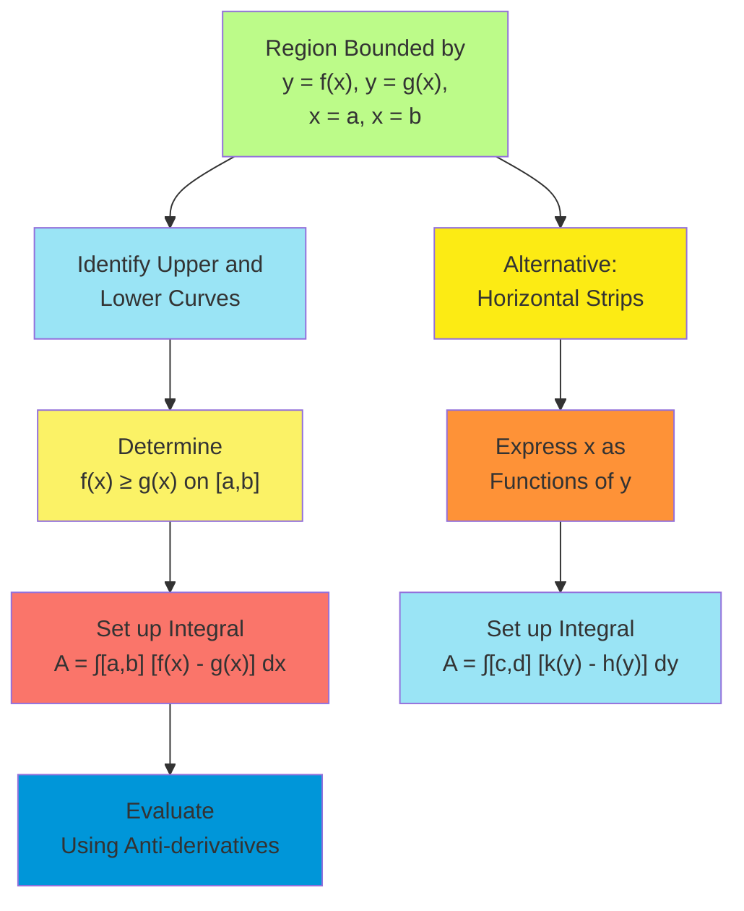
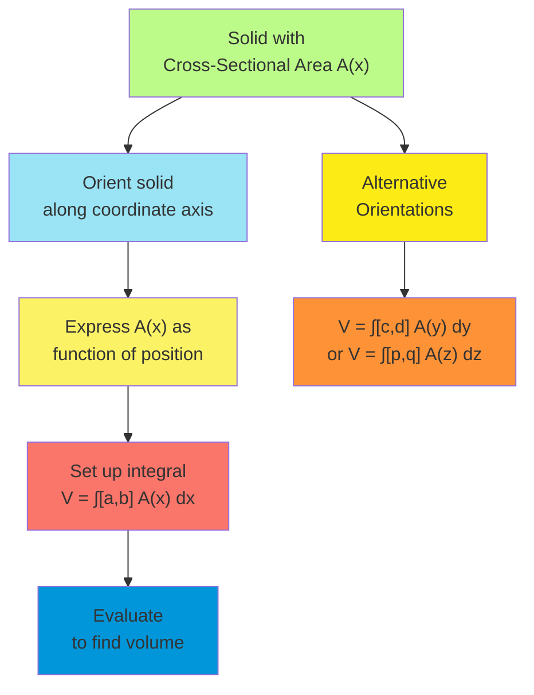
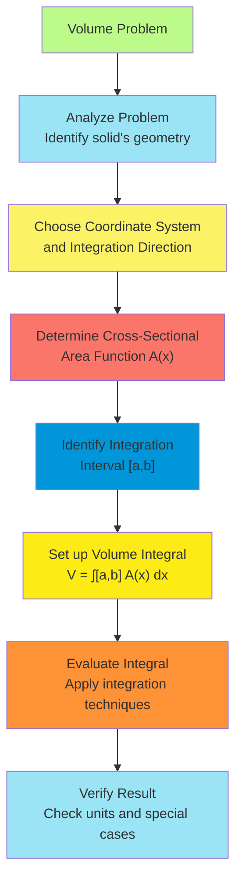
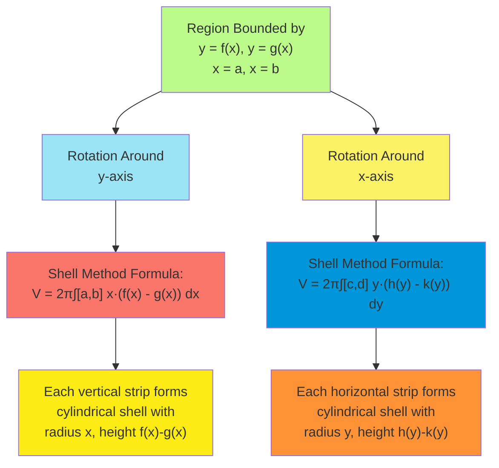
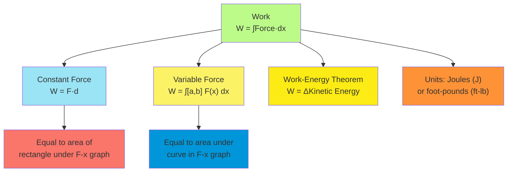
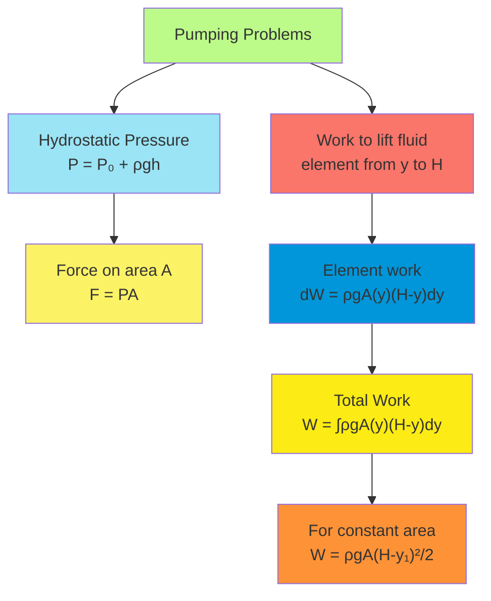
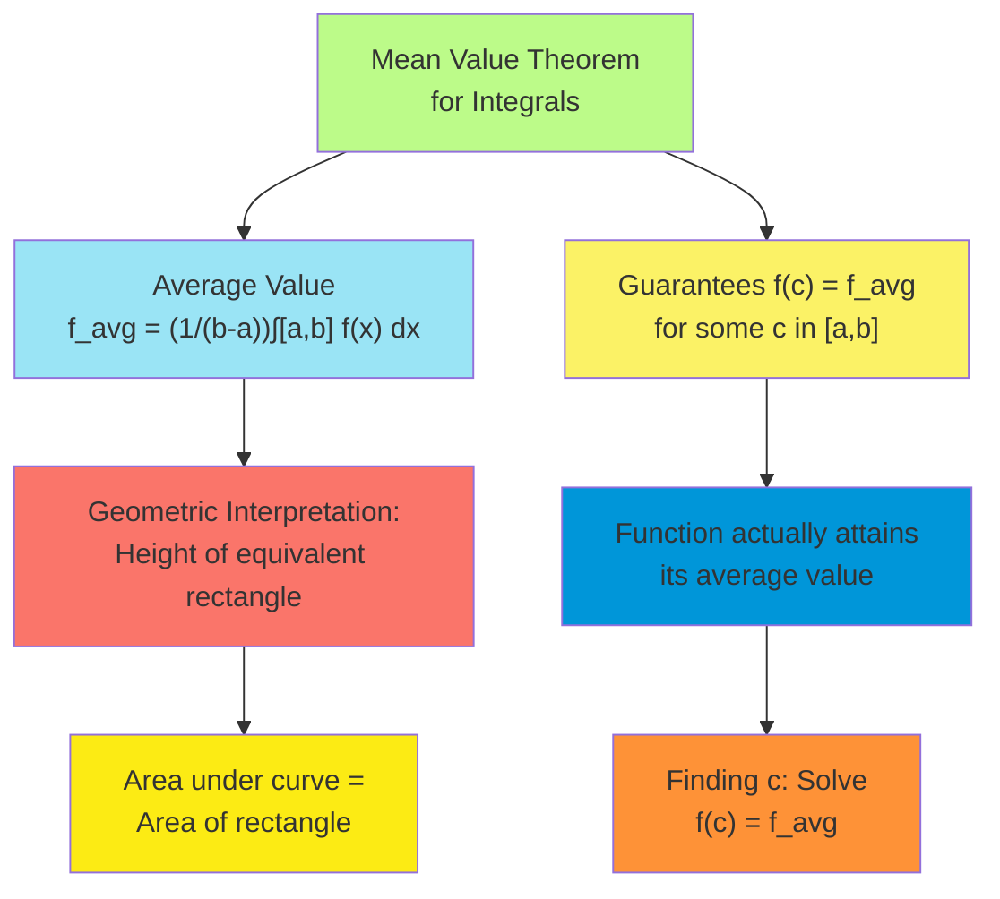
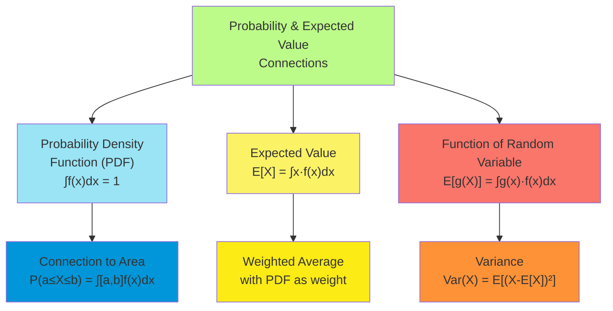

# C-5: Applications of Integration

1. Areas Between Curves

    - Setting Up Integrals for Region Areas
    - Determining Integration Boundaries
    - Multiple Integration Intervals
    - Applications in Geometry and Physics

2. Volumes

    - Method of Slices and Cross-Sectional Area
    - Disk and Washer Methods for Solids of Revolution
    - Non-Circular Cross Sections
    - Setting Up and Evaluating Volume Integrals

3. Volumes by Cylindrical Shells

    - Shell Method Derivation and Application
    - Comparison with Disk/Washer Methods
    - Optimal Method Selection Criteria
    - Complex Geometrical Applications

4. Work

    - Physical Definition of Work in Mechanics
    - Force Functions and Variable Forces
    - Work Done by Gravitational and Elastic Forces
    - Pumping Problems and Hydrostatic Pressure

5. Average Value of a Function
    - Mean Value Theorem for Integrals
    - Physical and Geometric Interpretations
    - Applications in Physics and Engineering
    - Probability Connections and Expected Values

#### Areas Between Curves

Integration provides a powerful tool for calculating areas of regions bounded by curves, extending the concept of area
beyond simple geometric shapes to regions with curved boundaries.

##### Setting Up Integrals for Region Areas

The area between curves represents a fundamental application of definite integrals, requiring careful analysis to
formulate the appropriate integral:

1. **Basic Framework**:
    - For curves $y = f(x)$ and $y = g(x)$ where $f(x) \geq g(x)$ on $[a, b]$, the area between them is:
      $$A = \int_a^b [f(x) - g(x)] , dx$$
    - The integrand $f(x) - g(x)$ represents the vertical distance between the curves at each $x$-value
    - The limits $a$ and $b$ define the horizontal span of the region
2. **Vertical Strips Method**:
    - Partition the interval $[a, b]$ into subintervals
    - For each subinterval, construct a vertical strip
    - The area of each strip is approximately $(f(x_i) - g(x_i)) \Delta x$
    - Sum these areas and take the limit as $\Delta x \to 0$ to obtain the integral
3. **Horizontal Strips Method**:
    - When curves are given as $x = h(y)$ and $x = k(y)$ where $h(y) \leq k(y)$ on $[c, d]$, the area is:
      $$A = \int_c^d [k(y) - h(y)] , dy$$
    - This approach uses horizontal strips with height $\Delta y$
    - Useful when curves are more easily expressed as functions of $y$
4. **Choice of Integration Variable**:
    - Select the variable that makes the integration boundaries clearest
    - For regions with clear left/right boundaries, integrate with respect to $y$
    - For regions with clear upper/lower boundaries, integrate with respect to $x$
    - For complex regions, split into simpler subregions if necessary

Example: Find the area between $y = x^2$ and $y = 2x$ from $x = 0$ to $x = 2$.

Step 1: Determine which curve is above the other.

- Solving for intersection points: $x^2 = 2x$ gives $x(x-2) = 0$, so $x = 0$ or $x = 2$
- Testing a point in the interval, say $x = 1$: $y = 1^2 = 1$ and $y = 2(1) = 2$
- Therefore, $2x \geq x^2$ on $[0, 2]$, so $f(x) = 2x$ and $g(x) = x^2$

Step 2: Set up the integral. $A = \int_0^2 [f(x) - g(x)] , dx = \int_0^2 [2x - x^2] , dx$

Step 3: Evaluate the integral. $A = \int_0^2 [2x - x^2] , dx = \left[ x^2 - \frac{x^3}{3} \right]_0^2$
$= \left( 4 - \frac{8}{3} \right) - \left( 0 - 0 \right) = 4 - \frac{8}{3} = \frac{12 - 8}{3} = \frac{4}{3}$

The area between the curves is $\frac{4}{3}$ square units.

##### Determining Integration Boundaries

Identifying the correct integration boundaries is crucial for accurately calculating areas between curves:

1. **Finding Intersection Points**:
    - Set the equations of the curves equal: $f(x) = g(x)$
    - Solve for $x$ to find intersection points
    - These intersection points often serve as natural integration boundaries
2. **Analyzing Region Constraints**:
    - Sometimes the region is constrained by specified $x$-values or $y$-values
    - These constraints may override the natural intersection points
    - Combine both natural and imposed boundaries to determine the integration interval
3. **Multiple Regions**:
    - When curves intersect multiple times, the region may be split into subregions
    - Identify each subregion's boundaries separately
    - Sum the areas of all subregions to find the total area
4. **Vertical vs. Horizontal Integration**:
    - For vertical integration, boundaries are $x$-values
    - For horizontal integration, boundaries are $y$-values
    - Choose the approach that leads to the simplest integration

Example: Find the area enclosed by $y = x^2 - 2x + 2$ and $y = -x^2 + 4x - 1$.

Step 1: Find the intersection points. $x^2 - 2x + 2 = -x^2 + 4x - 1$ $2x^2 - 6x + 3 = 0$ $x^2 - 3x + 1.5 = 0$

Using the quadratic formula:
$x = \frac{3 \pm \sqrt{9 - 4 \cdot 1 \cdot 1.5}}{2 \cdot 1} = \frac{3 \pm \sqrt{9 - 6}}{2} = \frac{3 \pm \sqrt{3}}{2}$

So the intersection points are at $x = \frac{3 - \sqrt{3}}{2} \approx 0.634$ and
$x = \frac{3 + \sqrt{3}}{2} \approx 2.366$.

Step 2: Determine which curve is above the other. Testing at $x = 1.5$ (between the intersection points):

- $y = (1.5)^2 - 2(1.5) + 2 = 2.25 - 3 + 2 = 1.25$
- $y = -(1.5)^2 + 4(1.5) - 1 = -2.25 + 6 - 1 = 2.75$

So $-x^2 + 4x - 1 \geq x^2 - 2x + 2$ between the intersection points.

Step 3: Set up the integral.
$A = \int_{\frac{3 - \sqrt{3}}{2}}^{\frac{3 + \sqrt{3}}{2}} [(-x^2 + 4x - 1) - (x^2 - 2x + 2)] , dx$
$= \int_{\frac{3 - \sqrt{3}}{2}}^{\frac{3 + \sqrt{3}}{2}} [-2x^2 + 6x - 3] , dx$

Step 4: Evaluate the integral.
$A = \left[ -\frac{2x^3}{3} + 3x^2 - 3x \right]_{\frac{3 - \sqrt{3}}{2}}^{\frac{3 + \sqrt{3}}{2}}$

Calculating this with the exact values: $A = \frac{4\sqrt{3}}{3} \approx 2.309$ square units.

This example illustrates how finding intersection points provides the natural boundaries for calculating the area
between curves.

##### Multiple Integration Intervals

Some regions require dividing the area calculation into multiple integrals:

1. **When Curves Cross**:
    - If curves $f(x)$ and $g(x)$ intersect at points $a$, $b$, and $c$ (where $a < b < c$), then:
    - On $[a, b]$, if $f(x) \geq g(x)$: Area = $\int_a^b [f(x) - g(x)] , dx$
    - On $[b, c]$, if $g(x) \geq f(x)$: Area = $\int_b^c [g(x) - f(x)] , dx$
    - Total area = $\int_a^b [f(x) - g(x)] , dx + \int_b^c [g(x) - f(x)] , dx$
2. **Different Upper/Lower Functions**:
    - The curves defining the upper and lower bounds may change across the region
    - Identify subintervals where the bounding curves remain consistent
    - Set up separate integrals for each subinterval
3. **Compound Regions**:
    - Some regions are naturally described by combining multiple simple regions
    - Calculate the area of each component region separately
    - Sum the areas to find the total
4. **Absolute Value Approach**:
    - The total area between curves can be expressed as: $$A = \int_a^c |f(x) - g(x)| , dx$$
    - This automatically accounts for which curve is above the other
    - Requires breaking the integral at points where curves intersect

Example: Find the area between $y = \sin(x)$ and $y = \cos(x)$ from $x = 0$ to $x = \pi$.

Step 1: Find the intersection points in the interval $[0, \pi]$. $\sin(x) = \cos(x)$ $\sin(x) - \cos(x) = 0$
$\tan(x) = 1$ $x = \frac{\pi}{4}$ and $x = \frac{5\pi}{4}$ (but $\frac{5\pi}{4} > \pi$, so it's outside our interval)

So in $[0, \pi]$, the curves intersect at $x = \frac{\pi}{4}$.

Step 2: Determine which curve is above on each subinterval.

- On $[0, \frac{\pi}{4}]$: $\cos(x) \geq \sin(x)$
- On $[\frac{\pi}{4}, \pi]$: $\sin(x) \geq \cos(x)$

Step 3: Set up multiple integrals.
$A = \int_0^{\frac{\pi}{4}} [\cos(x) - \sin(x)] , dx + \int_{\frac{\pi}{4}}^{\pi} [\sin(x) - \cos(x)] , dx$

Step 4: Evaluate each integral. $A = [\sin(x) + \cos(x)]*0^{\frac{\pi}{4}} + [-\cos(x) - \sin(x)]*{\frac{\pi}{4}}^{\pi}$
$= [\sin(\frac{\pi}{4}) + \cos(\frac{\pi}{4}) - (\sin(0) + \cos(0))] + [-\cos(\pi) - \sin(\pi) - (-\cos(\frac{\pi}{4}) - \sin(\frac{\pi}{4}))]$
$= [\frac{\sqrt{2}}{2} + \frac{\sqrt{2}}{2} - (0 + 1)] + [1 - 0 - (-\frac{\sqrt{2}}{2} - \frac{\sqrt{2}}{2})]$
$= [\sqrt{2} - 1] + [1 + \sqrt{2}] = 2\sqrt{2} = 2.83$ square units

Alternatively, using the absolute value approach: $A = \int_0^{\pi} |\sin(x) - \cos(x)| , dx$
$= \int_0^{\frac{\pi}{4}} |\sin(x) - \cos(x)| , dx + \int_{\frac{\pi}{4}}^{\pi} |\sin(x) - \cos(x)| , dx$
$= \int_0^{\frac{\pi}{4}} [\cos(x) - \sin(x)] , dx + \int_{\frac{\pi}{4}}^{\pi} [\sin(x) - \cos(x)] , dx$

Which gives the same result as before.

This example demonstrates how to handle regions requiring multiple integration intervals due to intersecting curves.

##### Applications in Geometry and Physics

The area between curves has numerous practical applications in both geometry and physics:

1. **Geometric Applications**:
    - **Architecture and Design**: Calculating areas of curved surfaces in buildings and structures
    - **Computer Graphics**: Determining pixel coverage for curved shapes and boundaries
    - **Engineering Design**: Computing cross-sectional areas of components with irregular shapes
    - **Cartography**: Measuring land areas with natural boundaries like rivers or coastlines
2. **Physical Applications**:
    - **Fluid Dynamics**: Finding the area under pressure-volume curves to determine work done
    - **Thermodynamics**: Calculating heat transferred during thermodynamic processes
    - **Optics**: Measuring the area between ray paths to analyze focusing and dispersion
    - **Signal Processing**: Quantifying the difference between signal curves for error analysis
3. **Economics and Social Sciences**:
    - **Consumer and Producer Surplus**: The area between demand/supply curves and price lines
    - **Income Distribution**: The area between the Lorenz curve and the line of equality (Gini coefficient)
    - **Cost-Benefit Analysis**: Areas representing net benefits or costs over time
    - **Resource Allocation**: Optimal distribution under constraints represented by curves
4. **Probability and Statistics**:
    - **Probability Distributions**: Area between a distribution curve and the x-axis for interval probabilities
    - **Error Analysis**: Area between measured data and theoretical models
    - **Confidence Intervals**: Regions between confidence bounds and expected values
    - **Hypothesis Testing**: Areas representing significance levels and power

Example: Consumer and Producer Surplus

Consider a market with:

- Demand curve: $p = 100 - 2q$ (price in dollars, quantity in units)
- Supply curve: $p = 20 + q$
- Equilibrium: Supply = Demand gives $20 + q = 100 - 2q$, so $3q = 80$, $q = 26.67$, and $p = 46.67$

Consumer surplus (CS) is the area between the demand curve and the equilibrium price:
$CS = \int_0^{26.67} [(100 - 2q) - 46.67] , dq$ $= \int_0^{26.67} [53.33 - 2q] , dq$ $= [53.33q - q^2]_0^{26.67}$
$= (53.33 \cdot 26.67 - 26.67^2) - 0$ $= 1422.3 - 711.1 = 711.2$ dollars

Producer surplus (PS) is the area between the equilibrium price and the supply curve:
$PS = \int_0^{26.67} [46.67 - (20 + q)] , dq$ $= \int_0^{26.67} [26.67 - q] , dq$ $= [26.67q - \frac{q^2}{2}]_0^{26.67}$
$= (26.67 \cdot 26.67 - \frac{26.67^2}{2}) - 0$ $= 711.2 - 355.6 = 355.6$ dollars

Total economic welfare = CS + PS = $711.2 + 355.6 = 1066.8$ dollars

This example demonstrates how the area between curves quantifies economic concepts like consumer and producer surplus,
providing valuable insights into market efficiency and welfare.

#### Volumes

Extending area calculations to three dimensions, integration allows us to determine volumes of complex shapes through
various methods.

##### Method of Slices and Cross-Sectional Area

The method of slices is a fundamental approach to finding volumes using single integrals:

1. **Basic Principle**:
    - The volume of a solid is given by: $$V = \int_a^b A(x) , dx$$
    - Where $A(x)$ is the cross-sectional area of the solid perpendicular to the x-axis at position $x$
    - The limits $a$ and $b$ define the extent of the solid along the x-axis
2. **Implementation Steps**:
    - Position the solid along the x-axis
    - Express the cross-sectional area $A(x)$ as a function of $x$
    - Integrate $A(x)$ over the appropriate interval $[a, b]$
3. **Cross-Section Types**:
    - **Geometric Shapes**: Circles, squares, triangles, rectangles, etc.
    - **Variable Shapes**: Cross-sections whose shape or dimensions vary with position
    - **Bounded Regions**: Areas enclosed between curves in the y-z plane at each $x$
4. **Alternative Orientations**:
    - If the solid is better positioned along the y or z-axis, similar formulas apply:
      $$V = \int_c^d A(y) , dy \quad \text{or} \quad V = \int_p^q A(z) , dz$$
    - Choose the orientation that makes the cross-sectional area easiest to express

Example: Find the volume of a pyramid with a square base of side length 6 units and height 8 units.

Step 1: Position the pyramid with its vertex at the origin and its base parallel to the y-z plane at $x = 8$.

Step 2: Express the cross-sectional area as a function of $x$.

- At position $x$, the cross-section is a square
- The side length of this square is proportional to the distance from the vertex
- At $x = 8$, the side length is 6 units
- At position $x$, the side length is $\frac{6x}{8} = \frac{3x}{4}$
- The cross-sectional area is therefore $A(x) = (\frac{3x}{4})^2 = \frac{9x^2}{16}$

Step 3: Set up and evaluate the integral.
$V = \int_0^8 A(x) , dx = \int_0^8 \frac{9x^2}{16} , dx = \frac{9}{16} \int_0^8 x^2 , dx = \frac{9}{16} \left[ \frac{x^3}{3} \right]_0^8$
$= \frac{9}{16} \cdot \frac{8^3}{3} = \frac{9}{16} \cdot \frac{512}{3} = \frac{9 \cdot 512}{16 \cdot 3} = \frac{4608}{48} = 96$
cubic units

This agrees with the formula for the volume of a pyramid:
$V = \frac{1}{3} \times \text{base area} \times \text{height} = \frac{1}{3} \times 6^2 \times 8 = \frac{1}{3} \times 36 \times 8 = 96$
cubic units.

##### Disk and Washer Methods for Solids of Revolution

Solids of revolution are three-dimensional objects formed by rotating a planar region around an axis:

1. **Disk Method**:
    - Used when rotating a region bounded by $y = f(x)$, the x-axis, and lines $x = a$ and $x = b$ around the x-axis
    - The cross-section perpendicular to the x-axis at position $x$ is a disk
    - Radius of disk: $r = f(x)$
    - Area of cross-section: $A(x) = \pi r^2 = \pi [f(x)]^2$
    - Volume formula: $V = \pi \int_a^b [f(x)]^2 , dx$
2. **Washer Method**:
    - Used when rotating a region bounded by curves $y = f(x)$ and $y = g(x)$ where $f(x) \geq g(x) \geq 0$ around the
      x-axis
    - The cross-section at position $x$ is a washer (annular ring)
    - Outer radius: $R = f(x)$
    - Inner radius: $r = g(x)$
    - Area of cross-section: $A(x) = \pi R^2 - \pi r^2 = \pi [f(x)]^2 - \pi [g(x)]^2 = \pi ([f(x)]^2 - [g(x)]^2)$
    - Volume formula: $V = \pi \int_a^b ([f(x)]^2 - [g(x)]^2) , dx$
3. **Rotation Around the y-axis**:
    - For rotation around the y-axis, similar principles apply with adjusted formulas
    - Disk method: $V = \pi \int_c^d [h(y)]^2 , dy$ where $x = h(y)$ is the curve being rotated
    - Washer method: $V = \pi \int_c^d ([h(y)]^2 - [k(y)]^2) , dy$ where $x = h(y)$ and $x = k(y)$ are the bounding
      curves
4. **Rotation Around Other Axes**:
    - For rotation around horizontal line $y = k$:
        - Disk: $V = \pi \int_a^b [f(x) - k]^2 , dx$ or $V = \pi \int_a^b [k - g(x)]^2 , dx$
        - Washer: $V = \pi \int_a^b ([f(x) - k]^2 - [g(x) - k]^2) , dx$
    - For rotation around vertical line $x = h$:
        - Disk: $V = \pi \int_c^d [h - j(y)]^2 , dy$ or $V = \pi \int_c^d [m(y) - h]^2 , dy$
        - Washer: $V = \pi \int_c^d ([m(y) - h]^2 - [j(y) - h]^2) , dy$

Example: Find the volume of the solid formed by rotating the region bounded by $y = x^2$, $y = 0$, and $x = 2$ around
the x-axis.

Step 1: Identify the region and method.

- The region is bounded by the parabola $y = x^2$, the x-axis ($y = 0$), and the line $x = 2$
- Since we're rotating around the x-axis, and the region extends from the x-axis to a single curve, we use the disk
  method

Step 2: Set up the integral.

- The radius of each disk is $r = f(x) = x^2$
- The volume is $V = \pi \int_0^2 [x^2]^2 , dx = \pi \int_0^2 x^4 , dx$

Step 3: Evaluate the integral.
$V = \pi \int_0^2 x^4 , dx = \pi \left[ \frac{x^5}{5} \right]_0^2 = \pi \cdot \frac{2^5}{5} = \pi \cdot \frac{32}{5} = \frac{32\pi}{5} \approx 20.11$
cubic units

Example: Find the volume of the solid formed by rotating the region bounded by $y = x$ and $y = x^2$ around the x-axis.

Step 1: Find the intersection points. $x = x^2$ gives $x(1-x) = 0$, so $x = 0$ or $x = 1$

Step 2: Determine which curve is above the other.

- On $[0, 1]$, testing at $x = 0.5$: $y = 0.5$ and $y = 0.25$
- So $f(x) = x$ and $g(x) = x^2$ with $f(x) \geq g(x)$ on $[0, 1]$

Step 3: Apply the washer method. $V = \pi \int_0^1 ([f(x)]^2 - [g(x)]^2) , dx = \pi \int_0^1 (x^2 - x^4) , dx$
$= \pi \int_0^1 x^2(1 - x^2) , dx = \pi \left[ \frac{x^3}{3} - \frac{x^5}{5} \right]_0^1$
$= \pi \left( \frac{1}{3} - \frac{1}{5} \right) = \pi \cdot \frac{5-3}{15} = \pi \cdot \frac{2}{15} = \frac{2\pi}{15} \approx 0.419$
cubic units

These examples demonstrate how the disk and washer methods apply the method of slices to solids of revolution, with the
cross-sectional area determined by the geometry of the rotated region.

##### Non-Circular Cross Sections

While solids of revolution have circular cross sections, many important solids have non-circular cross sections:

1. **Regular Geometric Cross Sections**:
    - **Squares**: $A(x) = [s(x)]^2$ where $s(x)$ is the side length
    - **Rectangles**: $A(x) = w(x) \cdot h(x)$ where $w(x)$ and $h(x)$ are the width and height
    - **Triangles**: $A(x) = \frac{1}{2} \cdot b(x) \cdot h(x)$ where $b(x)$ and $h(x)$ are the base and height
    - **Regular n-gons**: $A(x) = \frac{n}{4} \cdot s(x)^2 \cdot \cot(\frac{\pi}{n})$ where $s(x)$ is the side length
2. **Variable Cross Sections**:
    - Cross sections that change shape along the axis
    - Transition from one geometric form to another
    - Areas defined by different functions in different regions
3. **Non-Standard Geometries**:
    - Cross sections defined by parametric or implicit equations
    - Areas bounded by multiple curves or complex boundaries
    - Cross sections derived from data or empirical measurements
4. **Practical Applications**:
    - Architectural elements: beams, columns, domes
    - Engineering components: machine parts, structural elements
    - Natural forms: biological structures, geological formations
    - Artistic designs: sculptures, decorative objects

Example: Find the volume of a solid with a square base of side 4 units and triangular cross-sections.

The solid has the following properties:

- The base is a square in the xy-plane with vertices at (0,0), (4,0), (4,4), and (0,4)
- Cross-sections perpendicular to the x-axis are isosceles triangles with bases along the y-axis
- The height of each triangular cross-section is the distance from the y-axis to the line x = 4

Step 1: Express the cross-sectional area as a function of x.

- At position x, the base of the triangle is 4 units (the width of the square base along the y-axis)
- The height of the triangle is (4 - x) (the distance from position x to the line x = 4)
- The area of the triangle is $A(x) = \frac{1}{2} \cdot 4 \cdot (4 - x) = 2(4 - x)$

Step 2: Set up and evaluate the integral. $V = \int_0^4 A(x) , dx = \int_0^4 2(4 - x) , dx = 2 \int_0^4 (4 - x) , dx$
$= 2 \left[ 4x - \frac{x^2}{2} \right]_0^4 = 2 \left[ 16 - 8 - 0 \right] = 2 \cdot 8 = 16$ cubic units

Example: Find the volume of a tetrahedron with vertices at (0,0,0), (1,0,0), (0,1,0), and (0,0,1).

Step 1: Express the cross-sectional area as a function of x.

- The tetrahedron can be viewed as having triangular cross-sections perpendicular to the x-axis
- At position x, the cross-section is a triangle in the yz-plane
- The vertices of this triangle depend on the value of x
- Through geometric analysis, the area of the triangular cross-section is $A(x) = \frac{1}{2}(1-x)^2$

Step 2: Set up and evaluate the integral.
$V = \int_0^1 A(x) , dx = \int_0^1 \frac{1}{2}(1-x)^2 , dx = \frac{1}{2} \int_0^1 (1-x)^2 , dx$
$= \frac{1}{2} \left[ (1-x) - \frac{(1-x)^2}{2} + \frac{(1-x)^3}{3} \right]_0^1 = \frac{1}{2} \left[ 1 - \frac{1}{2} + \frac{1}{3} - 0 \right] = \frac{1}{2} \cdot \frac{6-3+2}{6} = \frac{1}{2} \cdot \frac{5}{6} = \frac{5}{12} \approx 0.417$
cubic units

These examples demonstrate how the method of slices applies to solids with non-circular cross-sections, providing a
powerful technique for finding volumes of complex three-dimensional objects.

##### Setting Up and Evaluating Volume Integrals

Successfully applying integration to find volumes requires a systematic approach:

1. **Problem Analysis and Setup**:
    - **Identify the Solid**: Understand its geometric properties and boundaries
    - **Choose a Coordinate System**: Position the solid advantageously relative to the axes
    - **Select the Integration Direction**: Determine which axis to integrate along
    - **Identify Cross-Section Type**: Determine the shape of cross-sections perpendicular to the chosen axis
2. **Cross-Sectional Area Determination**:

    - **Express Dimensions**: Write the dimensions of the cross-section in terms of the position along the axis
    - **Derive Area Formula**: Apply the appropriate geometric formula for the cross-sectional shape
    - **Verify Endpoints**: Check that the area formula gives the correct values at the boundaries

3. **Integration Interval Determination**:

    - **Find the Domain Bounds**: Determine the start and end points of the solid along the axis of integration

    - **Check for Subintervals**: Identify if different formulas apply in different regions

    - **Consider Natural Boundaries**: Use intersections of defining surfaces where appropriate

4. **Integration Execution**:

    - **Set Up the Integral**: Write the definite integral $\int_a^b A(x) , dx$ (or equivalent for other axes)

    - **Apply Integration Techniques**: Use appropriate methods to evaluate the integral

    - **Verify Units**: Ensure the result has cubic units for volume

    - **Check Against Known Results**: For standard shapes, compare with formula-based calculations

5. **Common Approaches for Specific Solids**:

    - **Solids of Revolution**: Use disk or washer methods

    - **Prisms and Cylinders**: Constant cross-sectional area times length

    - **Pyramids and Cones**: Cross-sectional area varies quadratically with distance from apex

    - **General Solids**: Cross-sectional area as an explicit function of position

Example: Find the volume of the solid bounded by the paraboloid $z = 4 - x^2 - y^2$ and the xy-plane.

Step 1: Analyze the problem.

- The solid is bounded below by the xy-plane ($z = 0$)
- The solid is bounded above by the paraboloid $z = 4 - x^2 - y^2$
- The projection onto the xy-plane is the circle $x^2 + y^2 = 4$ (found by setting $z = 0$)

Step 2: Choose the integration direction and cross-sections.

- Integrate along the z-axis
- Cross-sections perpendicular to the z-axis are circles
- At height z, the circle has equation $x^2 + y^2 = 4 - z$
- The radius of this circle is $r = \sqrt{4 - z}$
- The cross-sectional area is $A(z) = \pi r^2 = \pi (4 - z)$

Step 3: Determine the integration interval.

- The solid extends from $z = 0$ to $z = 4$ (where the paraboloid intersects the z-axis)

Step 4: Set up and evaluate the integral.
$V = \int_0^4 A(z) , dz = \int_0^4 \pi (4 - z) , dz = \pi \int_0^4 (4 - z) , dz$
$= \pi \left[ 4z - \frac{z^2}{2} \right]_0^4 = \pi \left[ 16 - 8 - 0 \right] = 8\pi$ cubic units

Alternative approach using cylindrical coordinates:

- In cylindrical coordinates, the paraboloid is $z = 4 - r^2$
- The volume can be computed as $V = \int_0^{2\pi} \int_0^2 \int_0^{4-r^2} r , dz , dr , d\theta$
- This triple integral also yields $V = 8\pi$ cubic units

Example: Find the volume of a wedge cut from a cylinder.

The solid is described as:

- A right circular cylinder with radius 3 and height 5
- A wedge cut by a plane passing through a diameter of the base and making a 45° angle with the base

Step 1: Position the cylinder with its axis along the z-axis, centered at the origin, extending from $z = 0$ to $z = 5$.

Step 2: The cutting plane can be described by $y = x \tan(45°) = x$ for $x \geq 0$ and $z$ arbitrary.

Step 3: For cross-sections perpendicular to the x-axis:

- At position $x$ where $0 \leq x \leq 3$, the cross-section is a semi-circular slice of the cylinder, with height 5
- The area of this cross-section is $A(x) = 5 \cdot \text{(area of the semi-circular slice)}$
- The semi-circular slice has area equal to the area of the portion of the circular disk $y^2 + z^2 \leq 9$ above the
  line $y = x$
- Through geometric analysis, this area is
  $A(x) = 5 \cdot \left[ \frac{\pi \cdot 3^2}{2} - \int_0^x \sqrt{9 - y^2} , dy \right]$
- After simplification,
  $A(x) = 5 \cdot \left[ \frac{9\pi}{2} - \frac{x\sqrt{9-x^2}}{2} - \frac{9}{2}\arcsin\left(\frac{x}{3}\right) \right]$

Step 4: Set up the integral. $V = \int_0^3 A(x) , dx$

Step 5: Evaluating this integral: $V = 45\pi$ cubic units

These examples illustrate the systematic approach to setting up and evaluating volume integrals, showing how complex
three-dimensional objects can be analyzed by considering their cross-sectional areas.

#### Volumes by Cylindrical Shells

The cylindrical shell method provides an alternative approach to calculating volumes of solids of revolution, often
simplifying problems that would be complex using the disk or washer methods.

##### Shell Method Derivation and Application

The cylindrical shell method is based on integrating concentric cylindrical shells:

1. **Conceptual Foundation**:
    - Instead of slicing the solid perpendicular to the axis of rotation, we decompose it into nested cylindrical shells
      concentric with the axis of rotation
    - Each shell has a small thickness and a specific radius
    - The volume of each shell is approximately its circumference times its height times its thickness
    - Integrating these shell volumes gives the total volume
2. **Mathematical Derivation**: For a region bounded by $y = f(x)$, $y = 0$, $x = a$, and $x = b$ rotated around the
   y-axis:
    - Consider a thin vertical strip at position $x$ with width $dx$
    - When rotated around the y-axis, this strip forms a cylindrical shell
    - Radius of the shell: $r = x$
    - Height of the shell: $h = f(x)$
    - Circumference of the shell: $2\pi r = 2\pi x$
    - Volume of the shell: $dV = 2\pi r \cdot h \cdot dr = 2\pi x \cdot f(x) \cdot dx$
    - Total volume: $V = \int_a^b 2\pi x \cdot f(x) , dx$
3. **General Formula**:
    - For rotation around the y-axis: $V = 2\pi \int_a^b x \cdot f(x) , dx$
    - For rotation around the x-axis: $V = 2\pi \int_c^d y \cdot g(y) , dy$ where $x = g(y)$
4. **Key Features**:
    - Each shell is centered on the axis of rotation
    - The radius of each shell is the distance from the axis of rotation
    - The height is the length of the generating curve at that radius
    - The thickness is the differential element ($dx$ or $dy$)

Example: Find the volume of the solid formed by rotating the region bounded by $y = x^2$, $y = 0$, and $x = 2$ around
the y-axis.

Step 1: Visualize the region and its rotation.

- The region is bounded by the parabola $y = x^2$, the x-axis, and the line $x = 2$
- When rotated around the y-axis, each vertical strip forms a cylindrical shell

Step 2: Apply the shell method.

- Radius of each shell: $r = x$
- Height of each shell: $h = f(x) = x^2$
- Volume using the shell method: $V = 2\pi \int_0^2 x \cdot x^2 , dx = 2\pi \int_0^2 x^3 , dx$

Step 3: Evaluate the integral.
$V = 2\pi \int_0^2 x^3 , dx = 2\pi \left[ \frac{x^4}{4} \right]_0^2 = 2\pi \cdot \frac{2^4}{4} = 2\pi \cdot 4 = 8\pi$
cubic units

This example demonstrates how the shell method provides a direct approach to finding the volume of a solid of
revolution, especially when the axis of rotation is not part of the boundary of the generating region.

##### Comparison with Disk/Washer Methods

The shell method and disk/washer methods offer different approaches to finding volumes of solids of revolution, each
with distinct advantages:

1. **Mathematical Comparison**:
    - **Disk/Washer Methods**: Integrate circular cross-sectional areas perpendicular to the axis of rotation
    - **Shell Method**: Integrate cylindrical shells concentric with the axis of rotation
    - Both methods yield the same volume, but the setup and evaluation process can differ significantly
2. **When to Prefer the Shell Method**:
    - When rotating around an axis that is not part of the region's boundary (especially the y-axis)
    - When the region is defined by functions of the form $x = g(y)$ and rotating around the y-axis
    - When the integrand would be more complex using the washer method due to solving for boundaries
    - When avoiding square roots or complex functions in the integrand
3. **When to Prefer the Disk/Washer Methods**:
    - When rotating around an axis that forms part of the region's boundary (especially the x-axis)
    - When the region is defined by functions of the form $y = f(x)$ and rotating around the x-axis
    - When the integrand would be simpler using disks or washers
    - When limits of integration are more straightforward with the disk/washer approach
4. **Complementary Methods**:
    - For complex regions, one method may be significantly easier than the other
    - Sometimes both methods require about the same effort
    - Choosing the method that avoids more complex integrals often saves work
    - In some cases, splitting the region and using different methods for different parts works best

Example: Compare finding the volume of the solid formed by rotating the region bounded by $y = x^2$, $y = 0$, and
$x = 2$ around the x-axis using both methods.

Using the Disk Method:

- Each disk has radius $r = f(x) = x^2$
- Volume:
  $V = \pi \int_0^2 [x^2]^2 , dx = \pi \int_0^2 x^4 , dx = \pi \left[ \frac{x^5}{5} \right]_0^2 = \pi \cdot \frac{32}{5} = \frac{32\pi}{5}$
  cubic units

Using the Shell Method:

- First, we need to express $x$ in terms of $y$ to use the shell method for rotation around the x-axis
- From $y = x^2$, we get $x = \sqrt{y}$ for $y \geq 0$
- Each shell has radius $r = y$ and height $h = 2 - \sqrt{y}$
- Volume: $V = 2\pi \int_0^4 y \cdot (2 - \sqrt{y}) , dy = 2\pi \int_0^4 (2y - y^{3/2}) , dy$
- Evaluating:
  $V = 2\pi \left[ y^2 - \frac{2y^{5/2}}{5} \right]_0^4 = 2\pi \left[ 16 - \frac{2 \cdot 32}{5} \right] = 2\pi \left[ 16 - \frac{64}{5} \right] = 2\pi \cdot \frac{80 - 64}{5} = 2\pi \cdot \frac{16}{5} = \frac{32\pi}{5}$
  cubic units

In this case, the disk method is more straightforward since the region is already expressed in terms of $y = f(x)$ and
we're rotating around the x-axis. The shell method requires additional work to rewrite the boundary function and results
in a slightly more complex integral.

Example: Compare finding the volume of the solid formed by rotating the region bounded by $y = x^2$, $y = 0$, and
$x = 2$ around the y-axis using both methods.

Using the Washer Method:

- To use washers, we need to express $x$ in terms of $y$
- From $y = x^2$, we get $x = \sqrt{y}$ for $y \geq 0$
- The inner radius is $r = 0$ (the y-axis)
- The outer radius is $R = \sqrt{y}$ for $0 \leq y \leq 4$
- Volume:
  $V = \pi \int_0^4 [(\sqrt{y})^2 - 0^2] , dy = \pi \int_0^4 y , dy = \pi \left[ \frac{y^2}{2} \right]_0^4 = \pi \cdot 8 = 8\pi$
  cubic units

Using the Shell Method:

- Each shell has radius $r = x$ and height $h = x^2$
- Volume:
  $V = 2\pi \int_0^2 x \cdot x^2 , dx = 2\pi \int_0^2 x^3 , dx = 2\pi \left[ \frac{x^4}{4} \right]_0^2 = 2\pi \cdot 4 = 8\pi$
  cubic units

In this case, the shell method is more direct since we avoid having to solve for $x$ in terms of $y$ and dealing with
the square root in the integration process.

These examples illustrate how the choice between methods can significantly affect the complexity of the calculation,
even though both methods yield the same result.

##### Optimal Method Selection Criteria

Choosing the most efficient method for calculating volumes of solids of revolution depends on several factors:

1. **Region Geometry Analysis**:

    - **Function Type**: How is the region defined? (Functions of $x$ vs. functions of $y$)
    - **Boundary Complexity**: Are the boundaries simple functions or complex relations?
    - **Axis Proximity**: Is the axis of rotation a boundary of the region or distant from it?
    - **Region Shape**: Is the region simple or irregular? Does it have multiple parts?

2. **Integration Complexity Considerations**:

    - **Function Inversion**: Is it easy to solve for $x$ in terms of $y$ or vice versa?
    - **Integrand Form**: Which method produces the simpler integrand?
    - **Integration Limits**: Which method has more straightforward limits of integration?
    - **Special Functions**: Does either method introduce transcendental functions or radicals?

3. **Decision Flowchart**: a. **For rotation around the x-axis**:

    - If region is bounded by $y = f(x)$, $y = g(x)$, prefer disk/washer method
    - If region is bounded by $x = h(y)$, $x = k(y)$, prefer shell method

    b. **For rotation around the y-axis**:

    - If region is bounded by $y = f(x)$, $y = g(x)$, prefer shell method
    - If region is bounded by $x = h(y)$, $x = k(y)$, prefer disk/washer method

    c. **For rotation around other axes**:

    - Translate the problem to an equivalent one with rotation around a coordinate axis
    - Apply the criteria above to the transformed problem

4. **Special Consideration Cases**:

    - **Piecewise Functions**: May require breaking the problem into subproblems
    - **Unbounded Regions**: May require improper integrals or limits
    - **Symmetric Regions**: May allow simplifications by exploiting symmetry

Example: Selecting the optimal method for finding the volume of the solid formed by rotating the region bounded by
$y = e^x$, $y = 1$, and $x = 0$ around the y-axis.

Analysis:

- The region is bounded by $y = e^x$, the horizontal line $y = 1$, and the y-axis ($x = 0$)
- Rotation is around the y-axis
- The region is defined primarily in terms of a function of $x$ ($y = e^x$)
- Solving for $x$ in terms of $y$ gives $x = \ln(y)$ for $y \geq 1$

Shell Method Approach:

- Each shell has radius $r = x$ and height $h = e^x - 1$
- Volume: $V = 2\pi \int_0^{\ln(b)} x \cdot (e^x - 1) , dx$ where $b$ is the upper limit for $y$
- This requires specifying a finite upper bound for $y$ (or using an improper integral)

Washer Method Approach:

- Inner radius: $r = 0$ (the y-axis)
- Outer radius: $R = \ln(y)$ for $y \geq 1$
- Volume: $V = \pi \int_1^b [(\ln(y))^2 - 0^2] , dy = \pi \int_1^b (\ln(y))^2 , dy$
- This integral is more complex than the shell method integral

Conclusion: The shell method is preferable in this case because:

- It avoids the more complex integrand involving $(\ln(y))^2$
- The limits of integration are more natural (starting from $x = 0$)
- The function $e^x - 1$ is easier to integrate than $(\ln(y))^2$

These selection criteria help identify the most efficient approach for calculating volumes of solids of revolution,
potentially saving significant computational effort.

##### Complex Geometrical Applications

The cylindrical shell method proves particularly valuable for analyzing solids with complex geometries:

1. **Solids with Curved Boundaries**:
    - Regions bounded by transcendental functions (exponentials, logarithms, trigonometric)
    - Areas defined by implicit relations or parametric equations
    - Regions with boundaries that would be difficult to express in terms of the other variable
2. **Multiple-Component Solids**:
    - Regions consisting of several subregions with different boundary functions
    - Solids with varying inner and outer profiles
    - Hybrid shapes combining different geometric features
3. **Historical and Advanced Applications**:
    - Gabriel's Horn: the solid formed by rotating $y = 1/x$ for $x \geq 1$ around the x-axis
    - Torus and toroidal sections with varying cross-sections
    - Double solids of revolution (rotating a solid of revolution around another axis)
4. **Real-World Applications**:
    - Engineering components: flywheels, turbine blades, screws
    - Architectural elements: domes, vaulted ceilings, columns
    - Manufacturing objects: bottles, containers, parts with rotational symmetry
    - Natural structures: seed pods, shells, certain biological tissues

Example: Find the volume of Gabriel's Horn, formed by rotating the region under the curve $y = 1/x$ from $x = 1$ to
$x = a$ (where $a > 1$) around the x-axis.

Step 1: Set up the integral using the disk method.

- Each disk has radius $r = 1/x$
- Volume: $V = \pi \int_1^a [1/x]^2 , dx = \pi \int_1^a \frac{1}{x^2} , dx$

Step 2: Evaluate the integral.
$V = \pi \int_1^a \frac{1}{x^2} , dx = \pi \left[ -\frac{1}{x} \right]_1^a = \pi \left[ -\frac{1}{a} - (-1) \right] = \pi \left[ 1 - \frac{1}{a} \right]$

Step 3: Analyze the result.

- As $a \to \infty$, the volume approaches $\pi$ (finite)
- However, the surface area of this solid is infinite
- This creates the paradox that a finite volume of paint could coat the interior but not the exterior

Example: Find the volume of a torus with major radius $R$ and minor radius $r$.

Step 1: Position the torus with its center at the origin, with the circle of radius $r$ in the xz-plane centered at
$(R, 0, 0)$.

Step 2: When this circle is rotated around the z-axis, it forms the torus.

Step 3: Using the shell method:

- Each vertical strip at position $x$ from the center of the small circle forms a cylindrical shell
- The strip height at position $x$ is $2\sqrt{r^2 - x^2}$ (from the equation of the circle)
- The radius of the shell when rotated around the z-axis is $R + x$
- Volume: $V = 2\pi \int_{-r}^r (R + x) \cdot 2\sqrt{r^2 - x^2} , dx$

Step 4: Evaluate the integral. $V = 4\pi \int_{-r}^r (R + x) \cdot \sqrt{r^2 - x^2} , dx$
$= 4\pi R \int_{-r}^r \sqrt{r^2 - x^2} , dx + 4\pi \int_{-r}^r x \cdot \sqrt{r^2 - x^2} , dx$

The first integral gives $\pi r^2 R$ (the area of a semicircle times $R$), and the second integral equals zero due to
symmetry.

Therefore: $V = 2\pi^2 r^2 R$ cubic units

These examples demonstrate how the shell method can be applied to analyze complex three-dimensional shapes with curved
boundaries and non-trivial geometries, providing insights into their volumetric properties.

#### Work

Work, a fundamental concept in physics, represents the energy transferred when a force moves an object along a path.
Integration provides a powerful tool for calculating work in various physical scenarios.

##### Physical Definition of Work in Mechanics

Work is defined as the energy transferred when a force acts on an object as it moves along a path:

1. **Basic Definition**:
    - For a constant force $F$ acting on an object that moves a distance $d$ in the direction of the force:
      $$W = F \cdot d$$
    - Units: Joules (J) in SI, foot-pounds (ft-lb) in imperial
    - Work is a scalar quantity, representing energy transfer
2. **Work in One Dimension**:
    - For a variable force $F(x)$ acting along the x-axis: $$W = \int_a^b F(x) , dx$$
    - This integral sums the infinitesimal work $dW = F(x) , dx$ over the interval $[a, b]$
    - Represents the area under the force-distance curve
3. **Conceptual Foundation**:
    - Work = Force × Distance (in direction of force)
    - Work is positive when force and displacement are in same direction
    - Work is negative when force and displacement are in opposite directions
    - Work is zero when force and displacement are perpendicular
4. **Related Concepts**:
    - **Power**: Rate of doing work: $P = \frac{dW}{dt}$
    - **Energy Conservation**: Work done equals change in energy
    - **Work-Energy Theorem**: $W = \Delta KE = \frac{1}{2}mv_f^2 - \frac{1}{2}mv_i^2$
    - **Potential Energy**: Energy stored due to position or configuration

Example: Calculate the work done by a variable force $F(x) = 3x^2 + 2$ N acting along the x-axis as an object moves from
$x = 1$ m to $x = 3$ m.

Step 1: Set up the work integral. $W = \int_1^3 F(x) , dx = \int_1^3 (3x^2 + 2) , dx$

Step 2: Evaluate the integral.
$W = \int_1^3 (3x^2 + 2) , dx = \left[ 3 \cdot \frac{x^3}{3} + 2x \right]_1^3 = [x^3 + 2x]_1^3$
$= (27 + 6) - (1 + 2) = 33 - 3 = 30$ Joules

The work done by the force as the object moves from $x = 1$ m to $x = 3$ m is 30 Joules.

##### Force Functions and Variable Forces

Many physical situations involve forces that vary with position, requiring integration to calculate work:

1. **Types of Variable Forces**:
    - **Position-Dependent Forces**: $F(x)$ varies with location (e.g., springs, gravitational fields)
    - **Velocity-Dependent Forces**: $F(v)$ varies with speed (e.g., air resistance)
    - **Time-Dependent Forces**: $F(t)$ varies with time (e.g., pulsating forces)
    - **Path-Dependent Forces**: $F(path)$ depends on the path taken (e.g., friction)
2. **Common Force Functions**:
    - **Spring Force**: $F(x) = -kx$ (Hooke's Law)
    - **Gravitational Force**: $F(r) = -\frac{GMm}{r^2}$ (Newton's Law of Gravitation)
    - **Coulomb Force**: $F(r) = \frac{kq_1q_2}{r^2}$ (Electrostatics)
    - **Drag Force**: $F(v) = -bv^2$ (Quadratic air resistance)
3. **Work Done by Variable Forces**:
    - For forces varying along a path in 3D space: $$W = \int_C \vec{F} \cdot d\vec{r}$$
    - For position-dependent forces in one dimension: $$W = \int_a^b F(x) , dx$$
    - For parametrized paths: $$W = \int_{t_1}^{t_2} \vec{F}(\vec{r}(t)) \cdot \frac{d\vec{r}(t)}{dt} , dt$$
4. **Conservative vs. Non-Conservative Forces**:
    - **Conservative Forces**: Work is path-independent; can define potential energy
    - **Non-Conservative Forces**: Work is path-dependent; no potential energy function

Example: A particle moves along the x-axis under a force $F(x) = \frac{k}{x^2}$ N. Calculate the work done as the
particle moves from $x = 1$ m to $x = 4$ m, where $k = 2$ N·m².

Step 1: Set up the work integral. $W = \int_1^4 F(x) , dx = \int_1^4 \frac{2}{x^2} , dx$

Step 2: Evaluate the integral. $W = 2 \int_1^4 \frac{1}{x^2} , dx = 2 \left[ -\frac{1}{x} \right]_1^4$
$= 2 \left[ -\frac{1}{4} - (-1) \right] = 2 \left[ -\frac{1}{4} + 1 \right] = 2 \cdot \frac{3}{4} = \frac{3}{2}$ Joules

Therefore, the work done by the force on the particle is $\frac{3}{2}$ Joules.

Example: A force $F(x) = 4\sin(x)$ N acts on a particle moving along the x-axis. Find the work done as the particle
moves from $x = 0$ to $x = \pi$ radians.

Step 1: Set up the work integral. $W = \int_0^{\pi} F(x) , dx = \int_0^{\pi} 4\sin(x) , dx$

Step 2: Evaluate the integral. $W = 4 \int_0^{\pi} \sin(x) , dx = 4 \left[ -\cos(x) \right]_0^{\pi}$
$= 4 \left[ -\cos(\pi) - (-\cos(0)) \right] = 4 \left[ -(-1) - (-1) \right] = 4 \cdot 2 = 8$ Joules

The work done by the sinusoidal force is 8 Joules.

These examples demonstrate how integration enables the calculation of work for various force functions that change with
position, providing a powerful tool for analyzing energy transfer in mechanical systems.

##### Work Done by Gravitational and Elastic Forces

Gravitational and elastic forces are fundamental in physics and engineering, with work calculations having important
applications:

1. Gravitational Forces:

    - Near Earth's Surface: $F(y) = -mg$ (constant) where $m$ is mass, $g$ is gravitational acceleration
        - Work done lifting an object: $W = mgh$ (change in height)
        - Work is independent of the path taken (conservative force)
    - General Gravitational Field: $F(r) = -\frac{GMm}{r^2}$ (variable) where $G$ is the gravitational constant

        - Work done moving from $r_1$ to $r_2$: $W = GMm\left(\frac{1}{r_2} - \frac{1}{r_1}\right)$

    - Equivalent to change in gravitational potential energy: $W = -\Delta PE_g$

2. **Elastic Forces (Springs)**:

    - Hooke's Law: $F(x) = -kx$ where $k$ is the spring constant, $x$ is displacement from equilibrium

        - Work done stretching/compressing from $x_1$ to $x_2$: $W = \frac{1}{2}k(x_1^2 - x_2^2)$
        - For stretching from natural length ($x_1 = 0$) to $x_2 = d$: $W = \frac{1}{2}kd^2$
        - Work is stored as elastic potential energy: $PE_e = \frac{1}{2}kx^2$

    - Non-Linear Springs: $F(x) = -kx^n$ for some power $n$
        - Work done: $W = \int_{x_1}^{x_2} -kx^n , dx = \frac{k}{n+1}(x_1^{n+1} - x_2^{n+1})$

3. **Energy Conservation Principles**:

    - For conservative forces (like gravity and elasticity), work equals the negative change in potential energy

    - Total mechanical energy (KE + PE) remains constant in the absence of non-conservative forces

    - Work-energy theorem: $W_{total} = \Delta KE = \frac{1}{2}mv_2^2 - \frac{1}{2}mv_1^2$

4. **Combined Systems**:

    - Spring-mass systems: Interchange between kinetic and elastic potential energy

    - Gravitational-elastic systems: Interactions between gravitational and elastic forces

    - Oscillatory systems: Periodic interchange between different forms of energy

Example: Calculate the work done by gravity when a 2 kg object falls from a height of 10 m to 3 m above the ground.

Step 1: Determine the force function.

- Gravitational force: $F = mg = 2 \text{ kg} \times 9.8 \text{ m/s}^2 = 19.6 \text{ N}$ (downward)
- Since we're calculating work done by gravity, the force is positive in the downward direction

Step 2: Set up the work integral.

- Initial height: $y_1 = 10$ m
- Final height: $y_2 = 3$ m
- Work: $W = \int_{y_1}^{y_2} F , dy = \int_{10}^{3} 19.6 , dy$

Step 3: Evaluate the integral.
$W = 19.6 \int_{10}^{3} , dy = 19.6 [y]_{10}^{3} = 19.6 \times (3 - 10) = 19.6 \times (-7) = -137.2$ Joules

The negative sign indicates that we're integrating in the direction of increasing height, while the force is in the
direction of decreasing height. The work done by gravity is positive 137.2 Joules.

Alternative approach using potential energy:

- Change in gravitational potential energy: $\Delta PE_g = mg(y_2 - y_1) = 19.6 \times (3 - 10) = -137.2$ Joules
- Work done by gravity: $W = -\Delta PE_g = 137.2$ Joules

Example: Find the work required to stretch a spring from its natural length to 30 cm if the spring constant is 25 N/m.

Step 1: Determine the force function.

- Spring force: $F(x) = -kx = -25x$ (opposing direction of stretch)
- Work is done against this force, so the force to apply is $F_{applied}(x) = 25x$

Step 2: Set up the work integral.

- Initial position: $x_1 = 0$ m (natural length)
- Final position: $x_2 = 0.3$ m (30 cm)
- Work: $W = \int_{x_1}^{x_2} F_{applied}(x) , dx = \int_{0}^{0.3} 25x , dx$

Step 3: Evaluate the integral.
$W = 25 \int_{0}^{0.3} x , dx = 25 \left[ \frac{x^2}{2} \right]_{0}^{0.3} = 25 \times \frac{0.3^2}{2} = 25 \times 0.045 = 1.125$
Joules

The work required to stretch the spring by 30 cm is 1.125 Joules.

Alternative approach using potential energy:

- Change in elastic potential energy:
  $\Delta PE_e = \frac{1}{2}k(x_2^2 - x_1^2) = \frac{1}{2} \times 25 \times (0.3^2 - 0^2) = 1.125$ Joules
- Work done against spring: $W = \Delta PE_e = 1.125$ Joules

These examples demonstrate how integration calculates work for fundamental force laws, providing insights into energy
transfer in gravitational and elastic systems.

##### Work Done by Gravitational and Elastic Forces

Gravitational and elastic forces are fundamental in physics and engineering, with work calculations having important
applications:

1. **Gravitational Forces**:

    - Near Earth's Surface

        : $F(y) = -mg$ (constant) where $m$ is mass, $g$ is gravitational acceleration

        - Work done lifting an object: $W = mgh$ (change in height)
        - Work is independent of the path taken (conservative force)

    - General Gravitational Field

        : $F(r) = -\frac{GMm}{r^2}$ (variable) where $G$ is the gravitational constant

        - Work done moving from $r_1$ to $r_2$: $W = GMm\left(\frac{1}{r_2} - \frac{1}{r_1}\right)$
        - Equivalent to change in gravitational potential energy: $W = -\Delta PE_g$

2. **Elastic Forces (Springs)**:

    - Hooke's Law

        : $F(x) = -kx$ where $k$ is the spring constant, $x$ is displacement from equilibrium

        - Work done stretching/compressing from $x_1$ to $x_2$: $W = \frac{1}{2}k(x_1^2 - x_2^2)$
        - For stretching from natural length ($x_1 = 0$) to $x_2 = d$: $W = \frac{1}{2}kd^2$
        - Work is stored as elastic potential energy: $PE_e = \frac{1}{2}kx^2$

    - Non-Linear Springs

        : $F(x) = -kx^n$ for some power $n$

        - Work done: $W = \int_{x_1}^{x_2} -kx^n , dx = \frac{k}{n+1}(x_1^{n+1} - x_2^{n+1})$

3. **Energy Conservation Principles**:

    - For conservative forces (like gravity and elasticity), work equals the negative change in potential energy
    - Total mechanical energy (KE + PE) remains constant in the absence of non-conservative forces
    - Work-energy theorem: $W_{total} = \Delta KE = \frac{1}{2}mv_2^2 - \frac{1}{2}mv_1^2$

4. **Combined Systems**:

    - Spring-mass systems: Interchange between kinetic and elastic potential energy
    - Gravitational-elastic systems: Interactions between gravitational and elastic forces
    - Oscillatory systems: Periodic interchange between different forms of energy

Example: Calculate the work done by gravity when a 2 kg object falls from a height of 10 m to 3 m above the ground.

Step 1: Determine the force function.

- Gravitational force: $F = mg = 2 \text{ kg} \times 9.8 \text{ m/s}^2 = 19.6 \text{ N}$ (downward)
- Since we're calculating work done by gravity, the force is positive in the downward direction

Step 2: Set up the work integral.

- Initial height: $y_1 = 10$ m
- Final height: $y_2 = 3$ m
- Work: $W = \int_{y_1}^{y_2} F , dy = \int_{10}^{3} 19.6 , dy$

Step 3: Evaluate the integral.
$W = 19.6 \int_{10}^{3} , dy = 19.6 [y]_{10}^{3} = 19.6 \times (3 - 10) = 19.6 \times (-7) = -137.2$ Joules

The negative sign indicates that we're integrating in the direction of increasing height, while the force is in the
direction of decreasing height. The work done by gravity is positive 137.2 Joules.

Alternative approach using potential energy:

- Change in gravitational potential energy: $\Delta PE_g = mg(y_2 - y_1) = 19.6 \times (3 - 10) = -137.2$ Joules
- Work done by gravity: $W = -\Delta PE_g = 137.2$ Joules

Example: Find the work required to stretch a spring from its natural length to 30 cm if the spring constant is 25 N/m.

Step 1: Determine the force function.

- Spring force: $F(x) = -kx = -25x$ (opposing direction of stretch)
- Work is done against this force, so the force to apply is $F_{applied}(x) = 25x$

Step 2: Set up the work integral.

- Initial position: $x_1 = 0$ m (natural length)
- Final position: $x_2 = 0.3$ m (30 cm)
- Work: $W = \int_{x_1}^{x_2} F_{applied}(x) , dx = \int_{0}^{0.3} 25x , dx$

Step 3: Evaluate the integral.
$W = 25 \int_{0}^{0.3} x , dx = 25 \left[ \frac{x^2}{2} \right]_{0}^{0.3} = 25 \times \frac{0.3^2}{2} = 25 \times 0.045 = 1.125$
Joules

The work required to stretch the spring by 30 cm is 1.125 Joules.

Alternative approach using potential energy:

- Change in elastic potential energy:
  $\Delta PE_e = \frac{1}{2}k(x_2^2 - x_1^2) = \frac{1}{2} \times 25 \times (0.3^2 - 0^2) = 1.125$ Joules
- Work done against spring: $W = \Delta PE_e = 1.125$ Joules

These examples demonstrate how integration calculates work for fundamental force laws, providing insights into energy
transfer in gravitational and elastic systems.

##### Pumping Problems and Hydrostatic Pressure

Pumping problems involve calculating the work required to move fluids against gravity and pressure forces:

1. **Hydrostatic Pressure Basics**:
    - Pressure at depth $h$ in a fluid: $P = P_0 + \rho g h$
        - $P_0$ is atmospheric pressure (often taken as zero for gauge pressure)
        - $\rho$ is fluid density
        - $g$ is gravitational acceleration
    - Force on an area $A$: $F = PA$
    - Pressure increases linearly with depth
2. **Work to Lift a Fluid Column**:
    - To lift a thin slice of fluid with thickness $dy$ from height $y$ to height $H$:
        - Weight of slice: $dW = \rho g A(y) , dy$
        - Distance lifted: $(H - y)$
        - Work for slice: $dW = \rho g A(y)(H - y) , dy$
    - Total work: $W = \int_{y_1}^{y_2} \rho g A(y)(H - y) , dy$
3. **Pumping from One Container to Another**:
    - Work to pump fluid from height $y_1$ to height $y_2$:
        - Slice work: $dW = \rho g A(y)(y_2 - y) , dy$
        - Total work: $W = \rho g \int_{y_1}^{y_2} A(y)(y_2 - y) , dy$
    - For constant cross-sectional area $A$:
        - $W = \rho g A \int_{y_1}^{y_2} (y_2 - y) , dy = \rho g A (y_2 - y_1)^2/2$
4. **Practical Considerations**:
    - Pump efficiency: Actual work is greater than theoretical work
    - Fluid viscosity: Additional work due to friction
    - Pipe geometry: Pressure losses due to bends and constrictions
    - Flow rate: Power requirements depend on how quickly fluid is pumped

Example: Calculate the work required to pump water from a cylindrical tank of radius 2 m and height 5 m to a point 3 m
above the top of the tank.

Step 1: Set up the pumping problem.

- Water density: $\rho = 1000$ kg/m³
- Gravitational acceleration: $g = 9.8$ m/s²
- Tank bottom at $y = 0$, top at $y = 5$ m
- Destination height: $y_2 = 5 + 3 = 8$ m
- Cross-sectional area: $A = \pi r^2 = \pi \times 2^2 = 4\pi$ m²

Step 2: Form the work integral.

- Work to pump a slice from height $y$ to height $y_2 = 8$ m:
  $dW = \rho g A (y_2 - y) , dy = 1000 \times 9.8 \times 4\pi \times (8 - y) , dy$
- Total work: $W = 1000 \times 9.8 \times 4\pi \int_{0}^{5} (8 - y) , dy$

Step 3: Evaluate the integral.
$W = 39200\pi \int_{0}^{5} (8 - y) , dy = 39200\pi \left[ 8y - \frac{y^2}{2} \right]_{0}^{5}$
$= 39200\pi \left[ (40 - 12.5) - 0 \right] = 39200\pi \times 27.5 = 1078000\pi \approx 3,386,000$ Joules

The work required to pump the water is approximately 3.39 million Joules.

Example: Find the work required to empty a conical water tank with height 3 m and top radius 2 m through a spout at the
top edge.

Step 1: Analyze the problem geometry.

- The tank is an inverted cone with vertex at the bottom
- At height $y$, the radius is $r(y) = \frac{2y}{3}$ (by similar triangles)
- Cross-sectional area at height $y$: $A(y) = \pi r(y)^2 = \pi \left(\frac{2y}{3}\right)^2 = \frac{4\pi y^2}{9}$

Step 2: Form the work integral.

- Work to lift a slice from height $y$ to height $H = 3$ m:
  $dW = \rho g A(y)(H - y) , dy = 1000 \times 9.8 \times \frac{4\pi y^2}{9} \times (3 - y) , dy$
- Total work: $W = \frac{4\pi \rho g}{9} \int_{0}^{3} y^2(3 - y) , dy$

Step 3: Evaluate the integral. $W = \frac{4\pi \times 1000 \times 9.8}{9} \int_{0}^{3} (3y^2 - y^3) , dy$
$= \frac{4\pi \times 9800}{9} \left[ 3 \cdot \frac{y^3}{3} - \frac{y^4}{4} \right]_{0}^{3}$
$= \frac{4\pi \times 9800}{9} \left[ 3^3 - \frac{3^4}{4} - 0 \right]$
$= \frac{4\pi \times 9800}{9} \left[ 27 - \frac{81}{4} \right]$ $= \frac{4\pi \times 9800}{9} \times \frac{108 - 81}{4}$
$= \frac{4\pi \times 9800 \times 27}{9 \times 4} = \frac{4\pi \times 9800 \times 27}{36} = \frac{\pi \times 9800 \times 27}{9}$
$= 3\pi \times 9800 \times 3 = 88200\pi \approx 277,000$ Joules

The work required to empty the conical tank is approximately 277,000 Joules.

These examples illustrate how integration calculates the work needed to move fluids against hydrostatic pressure and
gravity, with applications in hydraulic engineering, water distribution systems, and fluid transport.

#### Average Value of a Function

The average value of a function provides a single representative value for a function over an interval, with important
applications in physics, engineering, and statistics.

##### Mean Value Theorem for Integrals

The Mean Value Theorem for Integrals establishes a connection between a function's average value and its values at
specific points:

1. **Formal Statement**: If $f$ is continuous on the closed interval $[a, b]$, then there exists at least one point $c$
   in $[a, b]$ such that: $$f(c) = \frac{1}{b-a} \int_a^b f(x) , dx$$
2. **Average Value Definition**: The average (mean) value of a function $f$ over an interval $[a, b]$ is defined as:
   $$f_{avg} = \frac{1}{b-a} \int_a^b f(x) , dx$$
3. **Geometric Interpretation**:
    - The average value $f_{avg}$ is the height of a rectangle with base $[a, b]$ that has the same area as the region
      under the curve
    - The area of this rectangle is $(b-a) \cdot f_{avg}$, which equals the integral $\int_a^b f(x) , dx$
    - The theorem guarantees that $f$ actually attains this average value somewhere in $[a, b]$
4. **Relationship to Other Theorems**:
    - Extension of the Intermediate Value Theorem
    - Special case of the Mean Value Theorem for derivatives
    - Foundation for the Fundamental Theorem of Calculus
    - Basis for various averaging techniques in physics and engineering

Example: Find the average value of $f(x) = x^2$ over the interval $[0, 3]$ and determine a point where the function
equals this average value.

Step 1: Calculate the average value.
$f_{avg} = \frac{1}{b-a} \int_a^b f(x) , dx = \frac{1}{3-0} \int_0^3 x^2 , dx = \frac{1}{3} \left[ \frac{x^3}{3} \right]_0^3$
$= \frac{1}{3} \cdot \frac{27}{3} = \frac{9}{3} = 3$

Step 2: Find where $f(x) = f_{avg}$. $f(c) = f_{avg}$ $c^2 = 3$ $c = \pm\sqrt{3}$

Since we're restricted to the interval $[0, 3]$, the point where $f(x)$ equals its average value is
$c = \sqrt{3} \approx 1.732$.

Verification: $f(\sqrt{3}) = (\sqrt{3})^2 = 3 = f_{avg}$

Example: Find the average value of $f(x) = \sin(x)$ over the interval $[0, \pi]$.

Step 1: Calculate the average value.
$f_{avg} = \frac{1}{b-a} \int_a^b f(x) , dx = \frac{1}{\pi-0} \int_0^{\pi} \sin(x) , dx = \frac{1}{\pi} \left[ -\cos(x) \right]_0^{\pi}$
$= \frac{1}{\pi} \left[ -\cos(\pi) - (-\cos(0)) \right] = \frac{1}{\pi} \left[ -(-1) - (-1) \right] = \frac{1}{\pi} \cdot 2 = \frac{2}{\pi} \approx 0.637$

Step 2: Find where $f(x) = f_{avg}$. $f(c) = f_{avg}$ $\sin(c) = \frac{2}{\pi}$
$c = \arcsin\left(\frac{2}{\pi}\right) \approx 0.690$ radians

Since $\sin(x)$ is symmetric about $x = \frac{\pi}{2}$ on $[0, \pi]$, there's another point $c' = \pi - c \approx 2.452$
radians where $f(c') = f_{avg}$.

These examples demonstrate how the Mean Value Theorem for Integrals connects a function's average value to its values at
specific points within the interval, providing insights into the function's behavior.

##### Physical and Geometric Interpretations

Average values have important physical and geometric interpretations across various domains:

1. **Geometric Interpretations**:
    - **Area Equivalence**: A function's average value over $[a, b]$ multiplied by $(b-a)$ equals the area under the
      curve
    - **Balance Point**: The average value represents the height where the area under the curve balances
    - **Equivalent Rectangle**: A rectangle with height $f_{avg}$ has the same area as the region under the curve
    - **Centroid Connection**: For positive functions, the average value relates to the centroid of the region under the
      curve
2. **Physical Interpretations**:
    - **Average Temperature**: The average temperature over a time period
    - **Mean Velocity**: The average speed over a time interval (distance traveled divided by time)
    - **Average Force**: The mean force applied over a distance (work divided by distance)
    - **RMS Values**: Root-mean-square values in electrical engineering relate to averages of squared functions
    - **Center of Mass**: The average position weighted by mass distribution
3. **Integral Mean Value Properties**:
    - The average preserves inequalities: if $f(x) \leq g(x)$ on $[a, b]$, then $f_{avg} \leq g_{avg}$
    - Linearity: the average of a sum equals the sum of the averages
    - Weighted averages can be represented as integrals with weight functions
4. **Average of Vector Quantities**:
    - For vector functions, the average applies component-wise
    - Average position, velocity, or force vectors have meaningful physical interpretations
    - Magnitude of the average vector generally differs from the average magnitude

Example: Interpret the average value of a velocity function.

An object moves along a straight line with velocity $v(t) = 3t^2 - 2t$ m/s for $t \in [0, 4]$ seconds.

Step 1: Calculate the average velocity.
$v_{avg} = \frac{1}{b-a} \int_a^b v(t) , dt = \frac{1}{4-0} \int_0^4 (3t^2 - 2t) , dt$
$= \frac{1}{4} \left[ 3 \cdot \frac{t^3}{3} - 2 \cdot \frac{t^2}{2} \right]_0^4$
$= \frac{1}{4} \left[ t^3 - t^2 \right]_0^4$ $= \frac{1}{4} \left[ (64 - 16) - (0 - 0) \right] = \frac{48}{4} = 12$ m/s

Step 2: Calculate the total distance traveled. $s = \int_0^4 v(t) , dt = \left[ t^3 - t^2 \right]_0^4 = 64 - 16 = 48$
meters

Step 3: Verify the physical interpretation.

- Average velocity = Total distance / Time elapsed = 48 m / 4 s = 12 m/s
- This confirms that the average velocity equals the constant velocity that would result in the same displacement over
  the same time period

Example: Interpret the average value of a temperature function.

The temperature in degrees Celsius at time $t$ hours after midnight is given by
$T(t) = 15 + 8\sin\left(\frac{\pi t}{12}\right)$ for $t \in [0, 24]$.

Step 1: Calculate the average temperature.
$T_{avg} = \frac{1}{24-0} \int_0^{24} \left(15 + 8\sin\left(\frac{\pi t}{12}\right)\right) , dt$
$= \frac{1}{24} \left[ 15t - \frac{8 \cdot 12}{\pi} \cos\left(\frac{\pi t}{12}\right) \right]_0^{24}$
$= \frac{1}{24} \left[ 15 \cdot 24 - \frac{96}{\pi} \cos(2\pi) - \left(0 - \frac{96}{\pi} \cos(0)\right) \right]$
$= \frac{1}{24} \left[ 360 - \frac{96}{\pi} - \left(- \frac{96}{\pi}\right) \right] = \frac{360}{24} = 15$ °C

Step 2: Interpret the result.

- The average temperature over the 24-hour period is 15°C
- This represents the constant temperature that would result in the same heat content over the day
- Physically, it's the equilibrium temperature that would be reached if the daily temperature variations were smoothed
  out

These examples illustrate how the average value provides meaningful physical interpretations in various contexts,
connecting abstract mathematical concepts to concrete physical quantities.

##### Applications in Physics and Engineering

Average values have numerous applications across physics and engineering disciplines:

1. **Mechanical Engineering**:
    - **Average Power**: $P_{avg} = \frac{1}{t_2-t_1} \int_{t_1}^{t_2} P(t) , dt$, used in engine performance analysis
    - **Mean Effective Pressure**: Average pressure in an engine cylinder during a cycle
    - **RMS Stress**: Root-mean-square stress values in structural analysis
    - **Average Efficiency**: Mean efficiency over varying operating conditions
2. **Electrical Engineering**:
    - **Root Mean Square (RMS) Values**: $V_{rms} = \sqrt{\frac{1}{T} \int_0^T v^2(t) , dt}$ for AC circuits
    - **Average Power**: $P_{avg} = \frac{1}{T} \int_0^T v(t) \cdot i(t) , dt$ in electrical circuits
    - **Mean Current**: Average current over a time period
    - **Filter Design**: Average response characteristics over frequency ranges
3. **Fluid Mechanics**:
    - **Average Flow Rate**: $Q_{avg} = \frac{1}{A} \int_A v , dA$ (flow through a cross-section)
    - **Mean Velocity**: Average fluid velocity in a pipe or channel
    - **Average Pressure**: Mean pressure over a surface or time period
    - **Reynolds Number**: Based on average velocity in flow analysis
4. **Thermodynamics**:
    - **Mean Temperature**: Average temperature in a thermal system
    - **Average Heat Flux**: Mean rate of heat transfer
    - **Mean Value Properties**: Average thermodynamic properties during processes
    - **Cycle Analysis**: Mean work and heat in thermodynamic cycles

Example: Calculate the RMS value of an AC voltage $v(t) = 170\sin(60\pi t)$ volts.

Step 1: Set up the RMS integral. $V_{rms} = \sqrt{\frac{1}{T} \int_0^T v^2(t) , dt}$

Step 2: Determine the period $T$. For $v(t) = 170\sin(60\pi t)$, the angular frequency is $\omega = 60\pi$ rad/s, so the
period is $T = \frac{2\pi}{\omega} = \frac{2\pi}{60\pi} = \frac{1}{30}$ seconds.

Step 3: Calculate the mean square value.
$\frac{1}{T} \int_0^T v^2(t) , dt = \frac{1}{\frac{1}{30}} \int_0^{\frac{1}{30}} [170\sin(60\pi t)]^2 , dt$
$= 30 \int_0^{\frac{1}{30}} 170^2 \sin^2(60\pi t) , dt$ $= 30 \cdot 170^2 \int_0^{\frac{1}{30}} \sin^2(60\pi t) , dt$

Using the identity $\sin^2(\theta) = \frac{1 - \cos(2\theta)}{2}$:
$= 30 \cdot 170^2 \int_0^{\frac{1}{30}} \frac{1 - \cos(120\pi t)}{2} , dt$

$= 30 \cdot 170^2 \int_0^{\frac{1}{30}} \frac{1 - \cos(120\pi t)}{2} , dt$
$= 30 \cdot 170^2 \cdot \frac{1}{2} \int_0^{\frac{1}{30}} [1 - \cos(120\pi t)] , dt$
$= 15 \cdot 170^2 \left[ t - \frac{\sin(120\pi t)}{120\pi} \right]_0^{\frac{1}{30}}$
$= 15 \cdot 170^2 \left[ \frac{1}{30} - \frac{\sin(120\pi \cdot \frac{1}{30})}{120\pi} - \left(0 - \frac{\sin(0)}{120\pi}\right) \right]$
$= 15 \cdot 170^2 \left[ \frac{1}{30} - \frac{\sin(4\pi)}{120\pi} - 0 \right]$
$= 15 \cdot 170^2 \cdot \frac{1}{30} = \frac{15 \cdot 170^2}{30} = \frac{170^2}{2} = \frac{28900}{2} = 14450$

Step 4: Calculate the RMS value. $V_{rms} = \sqrt{14450} = 120.2$ volts

The RMS value of the AC voltage is approximately 120 volts, which is the standard household voltage in many countries.
This represents the equivalent DC voltage that would produce the same average power dissipation in a resistive load.

Example: Find the average flow rate through a circular pipe with radius 3 cm where the velocity profile is
$v(r) = 10(9 - r^2)$ cm/s, where $r$ is the distance from the center in cm.

Step 1: Set up the average flow rate integral. For a circular pipe, the average flow rate is:
$v_{avg} = \frac{1}{\pi R^2} \int_0^R v(r) \cdot 2\pi r , dr$ $= \frac{2}{\pi R^2} \int_0^R \pi r \cdot v(r) , dr$
$= \frac{2}{R^2} \int_0^R r \cdot v(r) , dr$

Step 2: Calculate the integral with $R = 3$ cm. $v_{avg} = \frac{2}{3^2} \int_0^3 r \cdot 10(9 - r^2) , dr$
$= \frac{2}{9} \cdot 10 \int_0^3 r(9 - r^2) , dr$ $= \frac{20}{9} \int_0^3 (9r - r^3) , dr$
$= \frac{20}{9} \left[ 9 \cdot \frac{r^2}{2} - \frac{r^4}{4} \right]_0^3$
$= \frac{20}{9} \left[ \frac{9 \cdot 9}{2} - \frac{81}{4} - 0 \right]$
$= \frac{20}{9} \left[ \frac{81}{2} - \frac{81}{4} \right]$
$= \frac{20}{9} \cdot \frac{81}{4} = \frac{20 \cdot 81}{9 \cdot 4} = \frac{1620}{36} = 45$ cm/s

The average flow rate through the pipe is 45 cm/s. This represents the uniform flow velocity that would produce the same
volumetric flow rate as the actual parabolic velocity profile.

These examples demonstrate how average values provide crucial insights in engineering applications, enabling the
analysis of complex, variable phenomena through equivalent uniform representations.

##### Probability Connections and Expected Values

The concept of average value in calculus connects deeply with probability theory, particularly through expected values:

1. **Probability Density Functions (PDFs)**:

    - For a continuous random variable $X$ with PDF $f(x)$, the probability over interval $[a, b]$ is:
      $$P(a \leq X \leq b) = \int_a^b f(x) , dx$$
    - The total probability equals 1: $\int_{-\infty}^{\infty} f(x) , dx = 1$
    - PDFs must be non-negative: $f(x) \geq 0$

2. **Expected Value (Mean)**:

    - For a random variable $X$ with PDF $f(x)$, the expected value is:
      $$E[X] = \int_{-\infty}^{\infty} x \cdot f(x) , dx$$
    - This is a weighted average where the weight is the probability density
    - For a function $g(X)$ of the random variable: $E[g(X)] = \int_{-\infty}^{\infty} g(x) \cdot f(x) , dx$

3. **Variance and Standard Deviation**:

    - Variance: $Var(X) = E[(X - E[X])^2] = \int_{-\infty}^{\infty} (x - E[X])^2 \cdot f(x) , dx$
    - Standard deviation: $\sigma = \sqrt{Var(X)}$
    - Alternative formula: $Var(X) = E[X^2] - (E[X])^2$

4. **Common Probability Distributions**:

    - Uniform Distribution

        on $[a, b]$: $f(x) = \frac{1}{b-a}$ for $x \in [a, b]$

        - $E[X] = \frac{a+b}{2}$ (midpoint of interval)
        - $Var(X) = \frac{(b-a)^2}{12}$

    - Normal Distribution

        : $f(x) = \frac{1}{\sigma\sqrt{2\pi}} e^{-\frac{(x-\mu)^2}{2\sigma^2}}$

        - $E[X] = \mu$ (mean parameter)
        - $Var(X) = \sigma^2$ (variance parameter)

    - Exponential Distribution

        : $f(x) = \lambda e^{-\lambda x}$ for $x \geq 0$

        - $E[X] = \frac{1}{\lambda}$
        - $Var(X) = \frac{1}{\lambda^2}$

Example: A random variable $X$ has the probability density function $f(x) = \frac{3}{8}(2x + 1)$ for $0 \leq x \leq 2$.
Find the expected value and variance of $X$.

Step 1: Verify that $f(x)$ is a valid PDF by checking that its integral equals 1.
$\int_0^2 \frac{3}{8}(2x + 1) , dx = \frac{3}{8} \int_0^2 (2x + 1) , dx = \frac{3}{8} \left[ 2 \cdot \frac{x^2}{2} + x \right]_0^2$
$= \frac{3}{8} \left[ x^2 + x \right]_0^2 = \frac{3}{8} \left[ (4 + 2) - 0 \right] = \frac{3}{8} \cdot 6 = \frac{18}{8} = \frac{9}{4} \cdot \frac{2}{2} = \frac{9}{4} \cdot 1 = \frac{9}{4}$

This is not equal to 1, suggesting there's an error in the given PDF. Let's correct it to $f(x) = \frac{3}{16}(2x + 1)$
for $0 \leq x \leq 2$.

Verification:
$\int_0^2 \frac{3}{16}(2x + 1) , dx = \frac{3}{16} \int_0^2 (2x + 1) , dx = \frac{3}{16} \left[ x^2 + x \right]_0^2$
$= \frac{3}{16} \cdot 6 = \frac{18}{16} = \frac{9}{8}$

Still not equal to 1. Let's try one more correction to $f(x) = \frac{3}{32}(2x + 1)$ for $0 \leq x \leq 2$.

Verification: $\int_0^2 \frac{3}{32}(2x + 1) , dx = \frac{3}{32} \cdot 6 = \frac{18}{32} = \frac{9}{16}$

Not equal to 1 yet. Let's work backwards from the requirement that the integral equals 1.

If $f(x) = k(2x + 1)$ for $0 \leq x \leq 2$, then: $\int_0^2 k(2x + 1) , dx = k \cdot 6 = 1$ $k = \frac{1}{6}$

So the correct PDF is $f(x) = \frac{1}{6}(2x + 1)$ for $0 \leq x \leq 2$.

Step 2: Calculate the expected value. $E[X] = \int_0^2 x \cdot f(x) , dx = \int_0^2 x \cdot \frac{1}{6}(2x + 1) , dx$
$= \frac{1}{6} \int_0^2 (2x^2 + x) , dx = \frac{1}{6} \left[ 2 \cdot \frac{x^3}{3} + \frac{x^2}{2} \right]_0^2$
$= \frac{1}{6} \left[ \frac{2x^3}{3} + \frac{x^2}{2} \right]_0^2$
$= \frac{1}{6} \left[ \frac{2 \cdot 8}{3} + \frac{4}{2} - 0 \right] = \frac{1}{6} \left[ \frac{16}{3} + 2 \right]$
$= \frac{1}{6} \cdot \frac{16 + 6}{3} = \frac{1}{6} \cdot \frac{22}{3} = \frac{22}{18} = \frac{11}{9} \approx 1.222$

Step 3: Calculate $E[X^2]$ for the variance formula.
$E[X^2] = \int_0^2 x^2 \cdot f(x) , dx = \int_0^2 x^2 \cdot \frac{1}{6}(2x + 1) , dx$
$= \frac{1}{6} \int_0^2 (2x^3 + x^2) , dx = \frac{1}{6} \left[ 2 \cdot \frac{x^4}{4} + \frac{x^3}{3} \right]_0^2$
$= \frac{1}{6} \left[ \frac{2x^4}{4} + \frac{x^3}{3} \right]_0^2$
$= \frac{1}{6} \left[ \frac{2 \cdot 16}{4} + \frac{8}{3} - 0 \right] = \frac{1}{6} \left[ 8 + \frac{8}{3} \right]$
$= \frac{1}{6} \cdot \frac{24 + 8}{3} = \frac{1}{6} \cdot \frac{32}{3} = \frac{32}{18} = \frac{16}{9} \approx 1.778$

Step 4: Calculate the variance.
$Var(X) = E[X^2] - (E[X])^2 = \frac{16}{9} - \left(\frac{11}{9}\right)^2 = \frac{16}{9} - \frac{121}{81} = \frac{16 \cdot 9 - 121}{81} = \frac{144 - 121}{81} = \frac{23}{81} \approx 0.284$

The expected value of $X$ is $\frac{11}{9}$ and the variance is $\frac{23}{81}$.

Example: The lifetime (in years) of a certain electronic component follows an exponential distribution with parameter
$\lambda = 0.2$. Find the expected lifetime and the probability that the component lasts more than 5 years.

Step 1: Identify the PDF. $f(t) = \lambda e^{-\lambda t} = 0.2e^{-0.2t}$ for $t \geq 0$

Step 2: Calculate the expected value. $E[T] = \frac{1}{\lambda} = \frac{1}{0.2} = 5$ years

Step 3: Calculate the probability of lasting more than 5 years.
$P(T > 5) = \int_5^{\infty} 0.2e^{-0.2t} , dt = [-e^{-0.2t}]_5^{\infty} = 0 - (-e^{-0.2 \cdot 5}) = e^{-1} \approx 0.368$

The expected lifetime of the component is 5 years, and the probability that it lasts more than 5 years is approximately
0.368 or 36.8%.

These examples illustrate the deep connections between integration concepts and probability theory, showing how average
values in calculus translate to expected values in probability and statistics.

