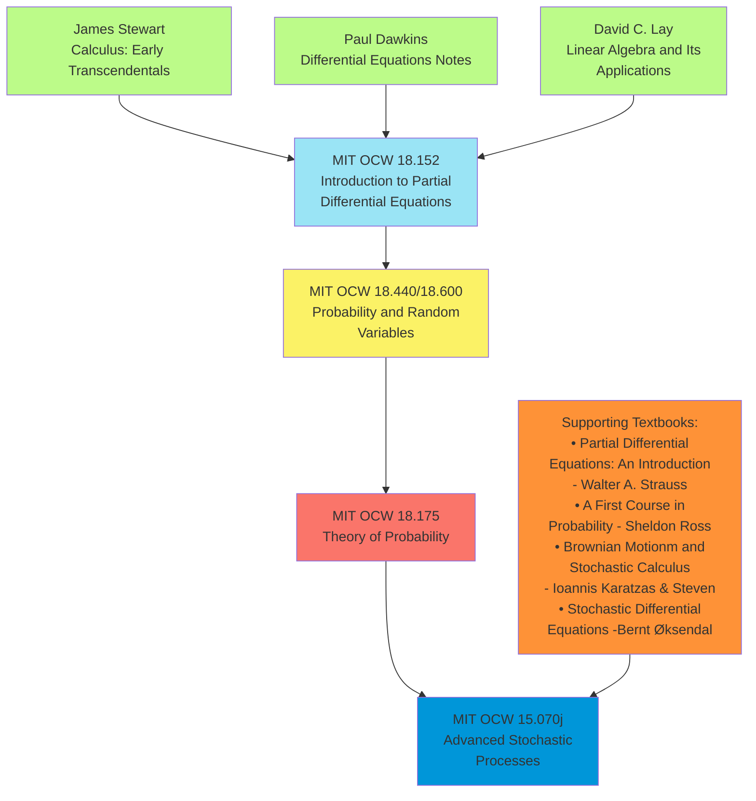
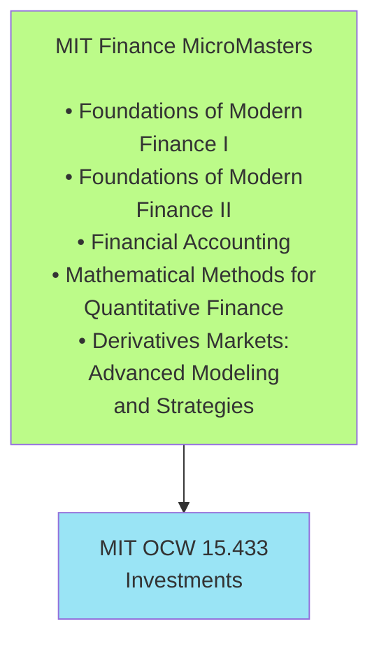

# **Financial Mathmatics**

**Foundation:**

1. James Stewart Calculus
2. Paul's Differential Equations Notes
3. David C. Lay - Linear Algebra and Its Applications

**PDE Preparation:** 4. MIT 18.152 - Introduction to Partial Differential Equations

- Textbook: Walter A. Strauss - Partial Differential Equations: An Introduction

**Probability Foundation:** 5. MIT 18.440/18.600 - Probability and Random Variables

- Textbook: Sheldon Ross - A First Course in Probability

**Advanced Probability Theory:** 6. MIT 18.175 - Theory of Probability

- Focus: Measure-theoretic probability, Brownian motion, martingales

**Complete Stochastic Calculus:** 7. MIT 15.070j - Advanced Stochastic Processes

- Textbooks: Karatzas & Shreve - Brownian Motion and Stochastic Calculus
- Øksendal - Stochastic Differential Equations

# **Finance Learning Path**

**Foundation:**

1. MIT Finance MicroMasters
    - Foundations of Modern Finance I
    - Foundations of Modern Finance II
    - Financial Accounting
    - Mathematical Methods for Quantitative Finance
    - Derivatives Markets: Advanced Modeling and Strategies

**Additional Course:** 2. MIT OCW 15.433 - Investments

- Focus: Portfolio optimization, behavioral finance, performance evaluation

#### Mathmatics Courses - MIT OCW

###### Required Courses

- Introduction to Partial Differential Equations
- Probability and Random Variables
- Theory of Probability
- Advanced Stochastic Processes

###### Advanced Courses

-  Introduction to Convex Optimization (MIT 6.079)
-  Pricing Options with Mathematical Models - Caltech
- Mathematical Statistics
- Mathematics of Machine Learning

#### Finance Courses - MIT OCW

- Finance Theory I
- Finance Theory II
- Financial Accounting
- Investments
- Topics in Mathematics with Applications in Finance

#### List of Books

**Foundation Mathematics:**

- Calculus: Early Transcendentals - James Stewart
- Linear Algebra and Its Applications - David C. Lay
- Elementary Differential Equations and Boundary Value Problems - William Boyce, Richard DiPrima, and Douglas Meade
- Differential Equations with Applications and Historical Notes - George Simmons
- Differential Equations Notes - Paul Dawkins

**PDE Books:**

- Partial Differential Equations: An Introduction - Walter A. Strauss
- Partial Differential Equations - Lawrence C. Evans

**Probability Books:**

- A First Course in Probability - Sheldon Ross
- A Probability Path - Sidney I. Resnick

**Stochastic Calculus Books:**

- Brownian Motion and Stochastic Calculus - Ioannis Karatzas & Steven Shreve
- Stochastic Differential Equations - Bernt Øksendal
- Stochastic Calculus for Finance I: The Binomial Asset Pricing Model - Steven E. Shreve
- Stochastic Calculus for Finance II: Continuous-Time Models - Steven E. Shreve

**Finance Books:**

- Investments - Zvi Bodie, Alex Kane, Alan Marcus

# **Mathematical Finance Preparation**

**Foundation (Completed):**

- Calculus: Early Transcendentals - James Stewart
- Linear Algebra and Its Applications - David C. Lay
- Elementary Differential Equations and Boundary Value Problems - Boyce & DiPrima

**Main Pathway:**

1. Partial Differential Equations: An Introduction - Walter A. Strauss
2. Basic Probability (6-8 weeks):
   - MIT 18.440/18.600 - Probability and Random Variables
   - A First Course in Probability - Sheldon Ross
3. Advanced Stochastic Processes:
   - MIT 15.070j - Advanced Stochastic Processes  (includes measure theory, Brownian motion, Itô calculus, finance applications)

**Stochastic Calculus Textbooks:**

- Brownian Motion and Stochastic Calculus - Ioannis Karatzas & Steven Shreve
- Stochastic Differential Equations - Bernt Øksendal
- Stochastic Calculus for Finance I: The Binomial Asset Pricing Model - Steven E. Shreve
- Stochastic Calculus for Finance II: Continuous-Time Models - Steven E. Shreve
