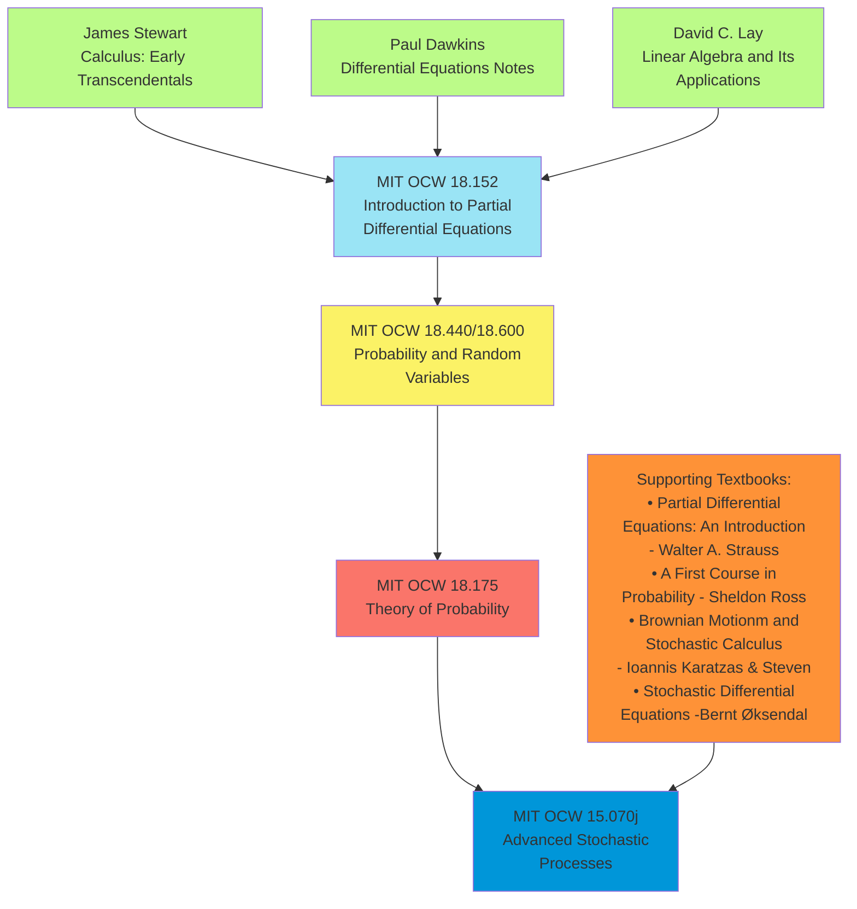

# **Complete Sequential Learning Path**

**Foundation:**

1. James Stewart Calculus
2. Paul's Differential Equations Notes
3. David C. Lay - Linear Algebra and Its Applications

**PDE Preparation:** 4. MIT 18.152 - Introduction to Partial Differential Equations

- Textbook: Walter A. Strauss - Partial Differential Equations: An Introduction

**Probability Foundation:** 5. MIT 18.440/18.600 - Probability and Random Variables

- Textbook: Sheldon Ross - A First Course in Probability

**Advanced Probability Theory:** 6. MIT 18.175 - Theory of Probability

- Focus: Measure-theoretic probability, Brownian motion, martingales

**Complete Stochastic Calculus:** 7. MIT 15.070j - Advanced Stochastic Processes

- Textbooks: Karatzas & Shreve - Brownian Motion and Stochastic Calculus
- Øksendal - Stochastic Differential Equations

# SEC-A

##### [Finance Theory I](https://ocw.mit.edu/courses/15-401-finance-theory-i-fall-2008/)

##### [Finance Theory II](https://ocw.mit.edu/courses/15-402-finance-theory-ii-spring-2003/)

##### [Financial Accounting](https://ocw.mit.edu/courses/15-511-financial-accounting-summer-2004/)

##### [Analytics of Finance](https://ocw.mit.edu/courses/15-450-analytics-of-finance-fall-2010/)

##### [Investments](https://ocw.mit.edu/courses/15-433-investments-spring-2003/)

##### [Introduction to Financial and Managerial Accounting](https://ocw.mit.edu/courses/15-501-introduction-to-financial-and-managerial-accounting-spring-2004/)

# SEC-B

##### [Introduction to Probability and Statistics](https://ocw.mit.edu/courses/18-05-introduction-to-probability-and-statistics-spring-2022/)

##### [Probability and Random Variables](https://ocw.mit.edu/courses/18-440-probability-and-random-variables-spring-2014/)

##### [Probabilistic Systems Analysis and Applied Probability](https://ocw.mit.edu/courses/6-041-probabilistic-systems-analysis-and-applied-probability-fall-2010/)

##### [Introduction to Partial Differential Equations](https://ocw.mit.edu/courses/18-152-introduction-to-partial-differential-equations-fall-2011/)

##### [Introduction to Computational Thinking and Data Science](https://ocw.mit.edu/courses/6-0002-introduction-to-computational-thinking-and-data-science-fall-2016/)

##### [Optimization Methods](https://ocw.mit.edu/courses/15-093j-optimization-methods-fall-2009/)

# SEC-C

##### [Theory of Probability](https://ocw.mit.edu/courses/18-175-theory-of-probability-spring-2014/)

##### [Probability and Statistics in Engineering](https://ocw.mit.edu/courses/1-151-probability-and-statistics-in-engineering-spring-2005/)

##### [Introduction to Stochastic Processes](https://ocw.mit.edu/courses/18-445-introduction-to-stochastic-processes-spring-2015/)

##### [Advanced Stochastic Processes](https://ocw.mit.edu/courses/15-070j-advanced-stochastic-processes-fall-2013/)

##### [Discrete Stochastic Processes](https://ocw.mit.edu/courses/6-262-discrete-stochastic-processes-spring-2011/)

# SEC-D

##### [Mathematical Statistics](https://ocw.mit.edu/courses/18-655-mathematical-statistics-spring-2016/)

##### [Algorithms for Inference](https://ocw.mit.edu/courses/6-438-algorithms-for-inference-fall-2014/)

##### [Topics in Mathematics with Applications in Finance](https://ocw.mit.edu/courses/18-s096-topics-in-mathematics-with-applications-in-finance-fall-2013/)

##### [Mathematics of Machine Learning](https://ocw.mit.edu/courses/18-657-mathematics-of-machine-learning-fall-2015/)

# SEC-E

##### Differential Equations

##### Introduction to Partial Differential Equations

##### Linear Algebra

##### Mathematics of Machine Learning

##### Matrix Calculus

##### MIT 6.S191 Introduction to Deep Learning

##### Multivariable Calculus

##### [Advanced Partial Differential Equations with Applications](https://ocw.mit.edu/courses/18-306-advanced-partial-differential-equations-with-applications-fall-2009/)

##### [Linear Partial Differential Equations](https://ocw.mit.edu/courses/18-303-linear-partial-differential-equations-fall-2006/)

##### [Numerical Methods for Partial Differential Equations](https://ocw.mit.edu/courses/18-336-numerical-methods-for-partial-differential-equations-spring-2009/)

# Finnace Micro-Masters - MITx

1. Foundations of Modern Finance I
2. Foundations of Modern Finance II
3. Financial Accounting
4. Mathematical Methods for Quantitative Finance
5. Derivatives Markets: Advanced Modeling and Strategies
